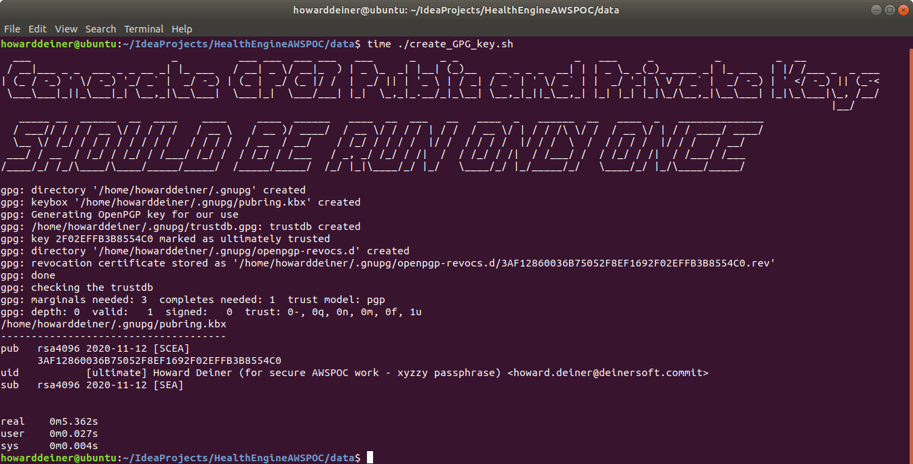
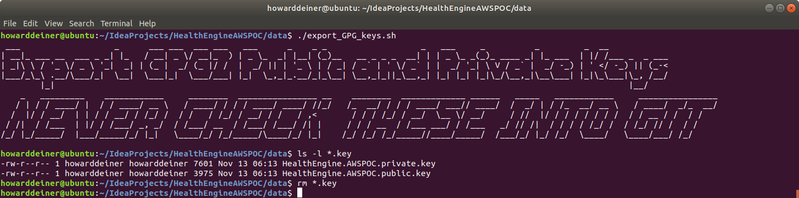
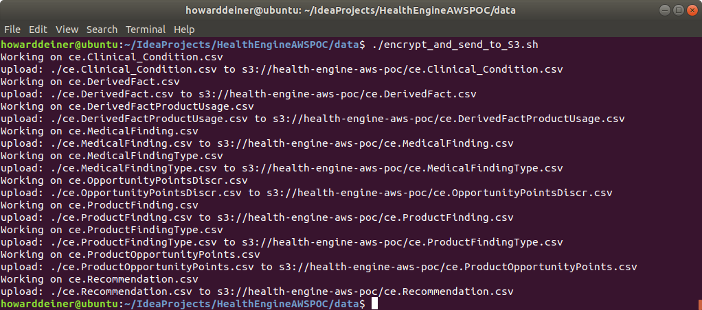
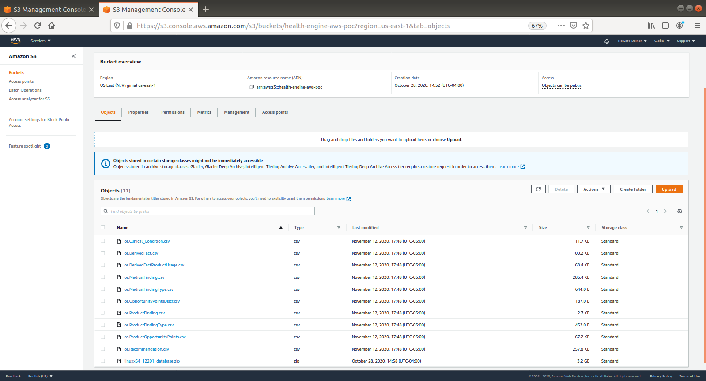

### Test Data for the AWSPOC Project

##### Concept

In recognition of the sensitive nature of the data currently stored in the Oracle Database sitting inside the corporate network it is currently encased in, the following are guiding princpals for this project:

<ul>
<li>If confidential records end up in the hands of a person not privy to the information, the consequences can be overwhelming. Breach of medical records could lead to identity theft, which can destroy a person's finances, credit and reputation. Victims could seek litigation against the healthcare practice in which the breach occurred. If the breach affected multiple patients, the practice is headed down a long road of legal tribulations.</li>
<li>Federal legislation, such as HIPAA and the HITECH Act, seek to safeguard protected health information (PHI). In addition, according to the National Conference of State Legislatures, 46 states have data breach notification laws. And, of course, there’s the Consumer Privacy Bill of Rights which affords some level of privacy rights to patients.<BR/><BR/>HIPAA and the Consumer Privacy Bill of Rights, however, create an odd legislative gap. The Consumer Privacy Bill of Rights excludes patients to the extent their health information is covered by HIPAA, while offering greater privacy rights with respect to health information not covered by HIPAA. There is long standing by ANSI and others that uncovered the “inadequacies” of HIPAA, including the fact that the HIPAA Privacy Rule was not even intended by the Department of Health and Human Services to serve as a “best practices” standard for privacy protection.<BR/><BR/>This means that HIPAA-protected PHI does not benefit from the Consumer Privacy Bill of Rights and is subject to the same privacy pitfalls as before. The Health Information Privacy Bill of Rights seeks to “protect the fundamental right to privacy of all Americans and the health information privacy that is essential for quality health care,” with prescriptions for patient control, security, accountability, and other rights.</li>
<li>Patient privacy is a fundamental right that is being challenged as patient records are digitized, and access to those records increases exponentially. The success of our national healthcare ecosystem depends on respecting that right. Patients should not be required to sacrifice their right to privacy in order to obtain health care. Public trust in the health care delivery system cannot be maintained if privacy rights for sensitive health information are weaker than the privacy rights of individuals for less sensitive non-health data.</li>
</ul>

<ul>
<li><B>Make no mistake about it.  We do not want to expose patient data to capture and sale by others.  We want patient data safe with us so we can use it to make money on it for ourselves</B></li>
</ul>

<ul>
<li>We in this project take the above seriously.  Perhaps even more seriously than the corporate concerns being voiced during this development.</li>
<li>To that end, we will not store any data gleaned from the Oracle database that will be used to benchmark alternative databases against in Git and/or GitHub itself.  Due to the size of the data involved, we need reasonable access to this data.  We choose Amazon S3 (simple storage service) as the way to house this data due to latency and the speed of light.</li>
<li>To protect the data itself, we will use PGP 4096 bit public and private keys and AES256 synmetric encryption for all data stored in S3.  See https://en.wikipedia.org/wiki/RSA_(cryptosystem) and https://en.wikipedia.org/wiki/Advanced_Encryption_Standard and https://www.solarwindsmsp.com/blog/aes-256-encryption-algorithm for further information on this and how this is uncrackable by brute force, taking billions of years using current technology.</li>
</ul>

<table>
<tr><th>local file name</th><th>AWS S3 URI</th></tr>
<tr><td>ce.Clinical_Condition.csv</td><td>s3://health-engine-aws-poc/ce.Clinical_Condition.csv</td></tr>
<tr><td>ce.DerivedFact.csv</td><td>s3://health-engine-aws-poc/ce.DerivedFact.csv</td></tr>
<tr><td>ce.DerivedFactProductUsage.csv</td><td>s3://health-engine-aws-poc/ce.DerivedFactProductUsage.csv</td></tr>
<tr><td>ce.MedicalFinding.csv</td><td>s3://health-engine-aws-poc/ce.MedicalFinding.csv</td></tr>
<tr><td>ce.MedicalFindingType.csv</td><td>s3://health-engine-aws-poc/ce.MedicalFindingType.csv</td></tr>
<tr><td>ce.OpportunityPointsDiscr.csv</td><td>s3://health-engine-aws-poc/ce.OpportunityPointsDiscr.csv</td></tr>
<tr><td>ce.ProductFinding.csv</td><td>s3://health-engine-aws-poc/ce.ProductFinding.csv</td></tr>
<tr><td>ce.ProductFindingType.csv</td><td>s3://health-engine-aws-poc/ce.ProductFindingType.csv</td></tr>
<tr><td>ce.ProductOpportunityPoints.csv</td><td>s3://health-engine-aws-poc/ce.ProductOpportunityPoints.csv</td></tr>
<tr><td>ce.Recommendation.csv</td><td>s3://health-engine-aws-poc/ce.Recommendation.csv</td></tr>
</table>

#### Execution

### create_GPG_key.sh
This script is run once to produce the gpg public and private keys that will be used for our secure work.
```bash
#!/usr/bin/env bash

figlet -w 160 -f small "Generate GPG2 Public and Private Keys"
figlet -w 160 -f slant "SHOULD BE RUN ONLY ONCE"
rm -rf ~/.gnupg/

#
# if you ever need to start over, rm -rf ~/.gnupg/ will decimate all the keys and your keyring
#
# the system requires a lot of entropy to generate the keys.  use cat /proc/sys/kernel/random/entropy_avail
# to see how much you have.  you'll need thousands to generate a 4096 but key.  try doing a lot of file io to
# gain more entropy or expect things to take quite a while.  for example, sudo find / -name xyzzy > /dev/null may help.
#
# you may also try sudo apt-get install rng-tools & sudo rngd -r /dev/urandom, and kill the /usr/sbin/rngd -r /dev/hwrng when done.
# the best solution for an entropy starved machine may be simply using yur keyboard and mouse a lot
# you can see this with until [ $COUNT -lt 1 ]; do   let COUNT=`cat /proc/sys/kernel/random/entropy_avail`;   echo "`date` COUNTER $COUNT";done
# this one worked the best for me.  before running it, I could not get enough entropy for 4096 generation even sfter an hour.  after starting it,
# the network traffic caused my entropy to rise and then fall as gpg2 consumed it (maybe 256 bits at a time), and was finally done in ten minutes or so
#

#
# Originally, I tried to generate RSA 4096 bit keys.  But this was taking hours and still not complete.
#
# I decided to see what the NSA uses.  https://www.keylength.com/en/6/
#
# 	NSA will initiate a transition to quantum resistant algorithms in the not too distant future.
# 	Until this new suite is developed and products are available implementing the quantum resistant suite,
# 	NSA will rely on current algorithms. For those partners and vendors that have not yet made the
# 	transition to CNSA suite elliptic curve algorithms, the NSA recommend not making a significant
# 	expenditure to do so at this point but instead to prepare for the upcoming quantum resistant
# 	algorithm transition.
#
# From this, I decided to go to RSA 3072 bit length
#
# THEN I FOUND THAT REBOOTING YOUR SYSTEM IS THE BEST ADVICE.  WITH THIS I WAS EASILY ABLE TO GENERATE THE 4096 BIT KEYS IN 5 SECONDS.

bash -c 'cat << "EOF" > foo
     %echo Generating OpenPGP key for our use
     Key-Type: RSA
     Key-Length: 4096
     Subkey-Type: RSA
     Subkey-Length: 4096
     Name-Real: Howard Deiner
     Name-Comment: for secure AWSPOC work - xyzzy passphrase
     Name-Email: howard.deiner@deinersoft.commit
     Expire-Date: 0
     Passphrase: xyzzy
     # Do a commit here, so that we can later print "done" :-)
     %commit
     %echo done
EOF'

gpg2 --batch --generate-key foo
rm foo

gpg2 --list-keys
```
This is what the console looks like when the script is executed.  It takes less than a minute (on a rebooted system), is completely repeatable, and doesn't require any manual intervention.  


### export_GPG_keys.sh
This script is run when the GPG key creator wants others to run decryption or encryption using the project's private and public keys.

<B>Note that the files created from this command (HealthEngine.AWSPOC.public.key and HealthEngine.AWSPOC.private.key) must never be added to the repository.  That would sorta defeat the purpose!</B>
```bash
#!/usr/bin/env bash

figlet -w 160 -f small "Export GPG2 Public and Private Keys"
figlet -w 160 -f slant "NEVER CHECK THESE INTO GIT"

gpg2 --export -a "Howard Deiner" > HealthEngine.AWSPOC.public.key
echo 'xyzzy' | gpg2 --batch --yes --pinentry-mode loopback --passphrase-fd 0 --export-secret-key -a "Howard Deiner"  > HealthEngine.AWSPOC.private.key
```
This is what the console looks like when the script is executed.  It takes less than a minute (on a rebooted system), is completely repeatable, and doesn't require any manual intervention.  


### encrypt_and_send_to_S3.sh
This script is run whenever new csv files are place in the oracle directory.  It encrypts the file and uploads it to the S3 bucket used to hold AWSPOC artifacts.

<B>Note that once the csv file from the oracle directory is encrypted and uploaded to S3, it is removed from the oracle directory.</B>
```bash
#!/usr/bin/env bash

cd oracle ; ls -1 *.csv > ../.filesToEncrypt ; cd ..

cat .filesToEncrypt |
  while read LINE;
    do
      echo "Working on ${LINE}"
      gpg2 --batch --passphrase xyzzy --symmetric --cipher-algo AES256 --output ${LINE} <  oracle/${LINE}
      aws s3 cp ${LINE} s3://health-engine-aws-poc/${LINE}
      rm ${LINE}
      rm oracle/{LINE}
    done

rm .filesToEncrypt
```
This is what the console looks like when the script is executed.  It takes less than a minute (on a rebooted system), is completely repeatable, and doesn't require any manual intervention.  


And this is what the AWS S3 console looks like after the script is executed.    


### transfer_from_s3_and_decrypt.sh
This script is run whenever a csv file is needed in a test environment. It brings the file from the S3 bucket used to hold project artifacts and decrypts the file.

<B>Note: You are responsible for removing the csv file when you're done with it.</B>
```bash
#!/usr/bin/env bash

aws s3 cp s3://health-engine-aws-poc/$1 $1.gpg
gpg2 --decrypt --batch --passphrase xyzzy $1.gpg > $1
rm $1.gpg
```
