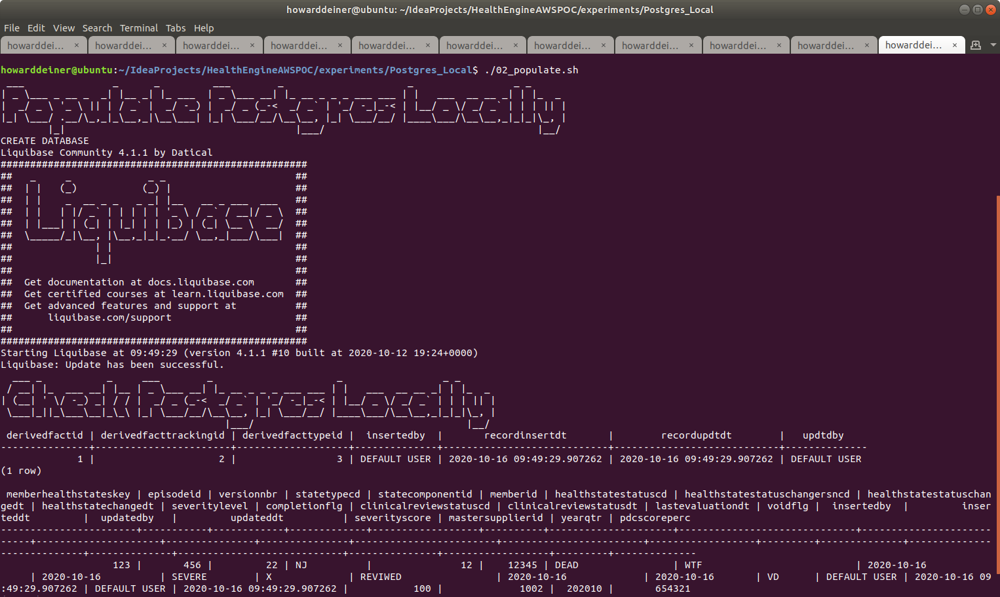

### Starting out with Postgres

##### Concept

> PostgreSQL, also known as Postgres, is a free and open-source relational database management system (RDBMS) emphasizing extensibility and SQL compliance. It was originally named POSTGRES, referring to its origins as a successor to the Ingres database developed at the University of California, Berkeley. In 1996, the project was renamed to PostgreSQL to reflect its support for SQL. After a review in 2007, the development team decided to keep the name PostgreSQL and the alias Postgres.
> https://en.wikipedia.org/wiki/PostgreSQL
> https://www.postgresql.org

#### Execution

We want to get into Postgres quickly.  So, before we start running AWS instances, we need to master our data and how we're going to instantiate it in the database.

This whole project is about rearchitecting the database behind CareEngine, and we will try several different databases to do that.

Rather than rewrite each SQL DDL into each database's dialect, I will use a tool called Liquibase, which can do two things.
<UL>
<LI>Emit SQL DDL specific to each database from a common changeset</LI>
<LI>Use the notion of changesets to allow us to migrate the database created from one version to another.</LI>
</UL>

### 01_startup.sh
This script uses docker-compose to take the latest Dockerhub postgres image and bring it up in a container running as a daemon.  Since Postgres wants to persist data, I use a Docker Volume, which I delete in 03_shutdown.sh

Since we do not want to make use of the database until it actually starts, I monitor the logs from the postgres_container until I see a signature which tells me that the database has started.
```bash
#!/usr/bin/env bash

figlet -w 160 -f small "Startup Postgres Locally"
docker volume rm postgres_local_postgres_data
docker-compose -f docker-compose.yml up -d

figlet -w 160 -f small "Wait For Postgres To Start"
while true ; do
  docker logs postgres_container > stdout.txt 2> stderr.txt
  result=$(grep -c "LOG:  database system is ready to accept connections" stderr.txt)
  if [ $result = 1 ] ; then
    echo "Postgres has started"
    break
  fi
  sleep 5
done
rm stdout.txt stderr.txt
```
### 02_populate.sh
This script first uses the running postgres_container to run psql to create a database for us.

The script then runs liquibase to update the database to it's intended state.  More on that in a bit.

The script then demonstrates that the two tables created have data in them, all managed by liquibase.
```bash
#!/usr/bin/env bash

figlet -w 160 -f small "Populate Postgres Locally"
docker exec postgres_container psql --port=5432 --username=postgres --no-password -c 'create database testdatabase;'
liquibase update

figlet -w 160 -f small "Check Postgres Locally"
docker exec postgres_container psql --port=5432 --username=postgres --no-password -d testdatabase -c 'select * from DERIVEDFACT;'
docker exec postgres_container psql --port=5432 --username=postgres --no-password -d testdatabase -c 'select * from MEMBERHEALTHSTATE;'
```
Liquibase itself is controlled by a liquibase.properties file for now.
```bash
changeLogFile: ../../src/db/changeset.xml
url:  jdbc:postgresql://localhost:5432/testdatabase
username:  postgres
password:  password
driver:  org.postgresql.Driver
classpath:  ../../liquibase_drivers/postgresql-42.2.18.jre6.jar
```
It is also using tht changeset.
```xml
<?xml version="1.0" encoding="UTF-8"?>

<databaseChangeLog
  xmlns="http://www.liquibase.org/xml/ns/dbchangelog"
  xmlns:xsi="http://www.w3.org/2001/XMLSchema-instance"
  xsi:schemaLocation="http://www.liquibase.org/xml/ns/dbchangelog
         http://www.liquibase.org/xml/ns/dbchangelog/dbchangelog-3.8.xsd">

    <changeSet  id="1"  author="howarddeiner">

        <createTable tableName="DERIVEDFACT">
            <column name="DERIVEDFACTID" type="bigint"/>
            <column name="DERIVEDFACTTRACKINGID" type="bigint"/>
            <column name="DERIVEDFACTTYPEID" type="bigint"/>
            <column name="INSERTEDBY" type="varchar(30)" defaultValue="DEFAULT USER"/>
            <column name="RECORDINSERTDT" type="timestamp" defaultValueComputed="CURRENT_TIMESTAMP"/>
            <column name="RECORDUPDTDT" type="timestamp" defaultValueComputed="CURRENT_TIMESTAMP"/>
            <column name="UPDTDBY" type="varchar(30)" defaultValue="DEFAULT USER"/>
        </createTable>

        <loadData file="DERIVEDFACT.csv" relativeToChangelogFile="true" tableName="DERIVEDFACT"/>

        <createTable tableName="MEMBERHEALTHSTATE">
            <column name="MEMBERHEALTHSTATESKEY" type="bigint"/>
            <column name="EPISODEID" type="bigint"/>
            <column name="VERSIONNBR" type="bigint"/>
            <column name="STATETYPECD" type="varchar(2)"/>
            <column name="STATECOMPONENTID" type="bigint"/>
            <column name="MEMBERID" type="bigint"/>
            <column name="HEALTHSTATESTATUSCD" type="varchar(12)"/>
            <column name="HEALTHSTATESTATUSCHANGERSNCD" type="varchar(12)"/>
            <column name="HEALTHSTATESTATUSCHANGEDT" type="date"/>
            <column name="HEALTHSTATECHANGEDT" type="date"/>
            <column name="SEVERITYLEVEL" type="varchar(12)"/>
            <column name="COMPLETIONFLG" type="varchar(1)"/>
            <column name="CLINICALREVIEWSTATUSCD" type="varchar(12)"/>
            <column name="CLINICALREVIEWSTATUSDT" type="date"/>
            <column name="LASTEVALUATIONDT" type="date"/>
            <column name="VOIDFLG" type="varchar(2)"/>
            <column name="INSERTEDBY" type="varchar(30)" defaultValue="DEFAULT USER"/>
            <column name="INSERTEDDT" type="timestamp" defaultValueComputed="CURRENT_TIMESTAMP"/>
            <column name="UPDATEDBY" type="varchar(30)" defaultValue="DEFAULT USER"/>
            <column name="UPDATEDDT" type="timestamp" defaultValueComputed="CURRENT_TIMESTAMP"/>
            <column name="SEVERITYSCORE" type="bigint"/>
            <column name="MASTERSUPPLIERID" type="bigint"/>
            <column name="YEARQTR" type="bigint"/>
            <column name="PDCSCOREPERC" type="bigint"/>
        </createTable>

        <loadData file="MEMBERHEALTHSTATE.csv" relativeToChangelogFile="true" tableName="MEMBERHEALTHSTATE"/>

    </changeSet>

</databaseChangeLog>
```
We will be reusing that changeset for all the databases we explore.

### 03_shutdown.sh
This script is brutely simple.  It uses docker-compose to bring down the environment it established, and then uses docker volume rm to delete the data which held the bits for out database data.

```bash
#!/usr/bin/env bash

figlet -w 160 -f small "Shutdown Postgres Locally"
docker-compose -f docker-compose.yml down
docker volume rm postgres_local_postgres_data
```

### Putting it all together...

It all looks something like this:

\
<BR />
\
<BR />
\
<BR />
