### Starting out with Postgres

##### Concept

> PostgreSQL, also known as Postgres, is a free and open-source relational database management system (RDBMS) emphasizing extensibility and SQL compliance. It was originally named POSTGRES, referring to its origins as a successor to the Ingres database developed at the University of California, Berkeley. In 1996, the project was renamed to PostgreSQL to reflect its support for SQL. After a review in 2007, the development team decided to keep the name PostgreSQL and the alias Postgres.
> https://en.wikipedia.org/wiki/PostgreSQL
> https://www.postgresql.org

#### Execution

We want to get into Postgres quickly.  So, before we start running AWS instances, we need to master our data and how we're going to instantiate it in the database.

This whole project is about rearchitecting the database behind CareEngine, and we will try several different databases to do that.

Rather than rewrite each SQL DDL into each database's dialect, I will use a tool called Liquibase, which can do two things.
<UL>
<LI>Emit SQL DDL specific to each database from a common changeset</LI>
<LI>Use the notion of changesets to allow us to migrate the database created from one version to another.</LI>
</UL>

### 01_startup.sh
This script uses docker-compose to take the latest Dockerhub postgres image and bring it up in a container running as a daemon.  Since Postgres wants to persist data, I use a Docker Volume, which I delete in 03_shutdown.sh

Since we do not want to make use of the database until it actually starts, I monitor the logs from the postgres_container until I see a signature which tells me that the database has started.
```bash
#!/usr/bin/env bash

../../startExperiment.sh

bash -c 'cat << "EOF" > .script
#!/usr/bin/env bash
figlet -w 240 -f small "Startup Postgres/pgadmin Locally"
docker volume rm 01_postgres_local_postgres_data
docker volume rm 01_postgres_local_pgadmin_data
docker-compose -f docker-compose.yml up -d

figlet -w 240 -f small "Wait For Postgres To Start"
while true ; do
  docker logs postgres_container > stdout.txt 2> stderr.txt
  result=$(grep -c "LOG:  database system is ready to accept connections" stderr.txt)
  if [ $result = 1 ] ; then
    echo "Postgres has started"
    break
  fi
  sleep 5
done
rm stdout.txt stderr.txt
rm stdout.txt stderr.txt
EOF'
chmod +x .script
command time -v ./.script 2> .results
../../getExperimentalResults.sh
experiment=$(../../getExperimentNumber.sh)
../../getDataAsCSVline.sh .results ${experiment} "01_Postgres_Local: Startup Postgres Locally" >> Experimental\ Results.csv
../../putExperimentalResults.sh
rm .script .results Experimental\ Results.csv
```
### 02_populate.sh
This script first uses the running postgres_container to run psql to create a database for us.

The script then runs liquibase to update the database to it's intended state.  More on that in a bit.

We then import data into the database using the Postgres client in the container.

And finally, we demonstrate that the tables created have data in them, all managed by liquibase.
```bash
#!/usr/bin/env bash

bash -c 'cat << "EOF" > .script
#!/usr/bin/env bash
figlet -w 240 -f small "Populate Postgres Locally"

figlet -w 240 -f small "Apply Schema for Postgres Locally"

docker exec postgres_container psql --port=5432 --username=postgres --no-password --no-align -c '"'"'create database CE;'"'"'
docker exec postgres_container psql --port=5432 --username=postgres --no-password --no-align -d ce -c '"'"'create schema CE;'"'"'
liquibase update
EOF'
chmod +x .script
command time -v ./.script 2> .results
../../getExperimentalResults.sh
experiment=$(../../getExperimentNumber.sh)
../../getDataAsCSVline.sh .results ${experiment} "01_Postgres_Local: Populate Postgres Schema" >> Experimental\ Results.csv
../../putExperimentalResults.sh
rm .script .results Experimental\ Results.csv

bash -c 'cat << "EOF" > .script
#!/usr/bin/env bash
figlet -w 240 -f small "Get Data from S3 Bucket"
../../data/transfer_from_s3_and_decrypt.sh ce.ClinicalCondition.csv
../../data/transfer_from_s3_and_decrypt.sh ce.DerivedFact.csv
../../data/transfer_from_s3_and_decrypt.sh ce.DerivedFactProductUsage.csv
../../data/transfer_from_s3_and_decrypt.sh ce.MedicalFinding.csv
../../data/transfer_from_s3_and_decrypt.sh ce.MedicalFindingType.csv
../../data/transfer_from_s3_and_decrypt.sh ce.OpportunityPointsDiscr.csv
../../data/transfer_from_s3_and_decrypt.sh ce.ProductFinding.csv
../../data/transfer_from_s3_and_decrypt.sh ce.ProductFindingType.csv
../../data/transfer_from_s3_and_decrypt.sh ce.ProductOpportunityPoints.csv
../../data/transfer_from_s3_and_decrypt.sh ce.Recommendation.csv
EOF'
chmod +x .script
command time -v ./.script 2> .results
../../getExperimentalResults.sh
experiment=$(../../getExperimentNumber.sh)
../../getDataAsCSVline.sh .results ${experiment} "01_Postgres_Local: Get Data from S3 Bucket" >> Experimental\ Results.csv
../../putExperimentalResults.sh
rm .script .results Experimental\ Results.csv

bash -c 'cat << "EOF" > .script
#!/usr/bin/env bash
figlet -w 240 -f small "Process S3 Data into CSV Files For Import"
../transform_Oracle_ce.ClinicalCondition_to_csv.sh
../transform_Oracle_ce.DerivedFact_to_csv.sh
../transform_Oracle_ce.DerivedFactProductUsage_to_csv.sh
../transform_Oracle_ce.MedicalFinding_to_csv.sh
../transform_Oracle_ce.MedicalFindingType_to_csv.sh
../transform_Oracle_ce.OpportunityPointsDiscr_to_csv.sh
../transform_Oracle_ce.ProductFinding_to_csv.sh
../transform_Oracle_ce.ProductFindingType_to_csv.sh
../transform_Oracle_ce.ProductOpportunityPoints_to_csv.sh
../transform_Oracle_ce.Recommendation_to_csv.sh
EOF'
chmod +x .script
command time -v ./.script 2> .results
../../getExperimentalResults.sh
experiment=$(../../getExperimentNumber.sh)
../../getDataAsCSVline.sh .results ${experiment} "01_Postgres_Local: Process S3 Data into CSV Files For Import" >> Experimental\ Results.csv
../../putExperimentalResults.sh
rm .script .results Experimental\ Results.csv

bash -c 'cat << "EOF" > .script
#!/usr/bin/env bash
figlet -w 240 -f small "Populate Postgres Data"
echo "CLINICAL_CONDITION"
docker cp ce.ClinicalCondition.csv postgres_container:/tmp/ce.ClinicalCondition.csv
docker exec postgres_container psql --port=5432 --username=postgres --no-password -d ce --no-align -c "COPY CE.CLINICAL_CONDITION(CLINICAL_CONDITION_COD,CLINICAL_CONDITION_NAM,INSERTED_BY,REC_INSERT_DATE,REC_UPD_DATE,UPDATED_BY,CLINICALCONDITIONCLASSCD,CLINICALCONDITIONTYPECD,CLINICALCONDITIONABBREV) FROM '"'"'/tmp/ce.ClinicalCondition.csv'"'"' DELIMITER '"'"','"'"' CSV HEADER;"
echo "DERIVEDFACT"
docker cp ce.DerivedFact.csv postgres_container:/tmp/ce.DerivedFact.csv
docker exec postgres_container psql --port=5432 --username=postgres --no-password -d ce --no-align -c "COPY CE.DERIVEDFACT(DERIVEDFACTID,DERIVEDFACTTRACKINGID,DERIVEDFACTTYPEID,INSERTEDBY,RECORDINSERTDT,RECORDUPDTDT,UPDTDBY) FROM '"'"'/tmp/ce.DerivedFact.csv'"'"' DELIMITER '"'"','"'"' CSV HEADER;"
echo "DERIVEDFACTPRODUCTUSAGE"
docker cp ce.DerivedFactProductUsage.csv postgres_container:/tmp/ce.DerivedFactProductUsage.csv
docker exec postgres_container psql --port=5432 --username=postgres --no-password -d ce --no-align -c "COPY CE.DERIVEDFACTPRODUCTUSAGE(DERIVEDFACTPRODUCTUSAGEID,DERIVEDFACTID,PRODUCTMNEMONICCD,INSERTEDBY,RECORDINSERTDT,RECORDUPDTDT,UPDTDBY) FROM '"'"'/tmp/ce.DerivedFactProductUsage.csv'"'"' DELIMITER '"'"','"'"' CSV HEADER;"
echo "MEDICALFINDING"
docker cp ce.MedicalFinding.csv postgres_container:/tmp/ce.MedicalFinding.csv
docker exec postgres_container psql --port=5432 --username=postgres --no-password -d ce --no-align -c "COPY CE.MEDICALFINDING(MEDICALFINDINGID,MEDICALFINDINGTYPECD,MEDICALFINDINGNM,SEVERITYLEVELCD,IMPACTABLEFLG,CLINICAL_CONDITION_COD,INSERTEDBY,RECORDINSERTDT,RECORDUPDTDT,UPDTDBY,ACTIVEFLG,OPPORTUNITYPOINTSDISCRCD) FROM '"'"'/tmp/ce.MedicalFinding.csv'"'"' DELIMITER '"'"','"'"' CSV HEADER;"
echo "MEDICALFINDINGTYPE"
docker cp ce.MedicalFindingType.csv postgres_container:/tmp/ce.MedicalFindingType.csv
docker exec postgres_container psql --port=5432 --username=postgres --no-password -d ce --no-align -c "COPY CE.MEDICALFINDINGTYPE(MEDICALFINDINGTYPECD,MEDICALFINDINGTYPEDESC,INSERTEDBY,RECORDINSERTDT,RECORDUPDTDT,UPDTDBY,HEALTHSTATEAPPLICABLEFLAG) FROM '"'"'/tmp/ce.MedicalFindingType.csv'"'"' DELIMITER '"'"','"'"' CSV HEADER;"
echo "OPPORTUNITYPOINTSDISCR"
docker cp ce.OpportunityPointsDiscr.csv postgres_container:/tmp/ce.OpportunityPointsDiscr.csv
docker exec postgres_container psql --port=5432 --username=postgres --no-password -d ce --no-align -c "COPY CE.OPPORTUNITYPOINTSDISCR(OPPORTUNITYPOINTSDISCRCD,OPPORTUNITYPOINTSDISCNM,INSERTEDBY,RECORDINSERTDT,RECORDUPDTDT,UPDTDBY) FROM '"'"'/tmp/ce.OpportunityPointsDiscr.csv'"'"' DELIMITER '"'"','"'"' CSV HEADER;"
echo "PRODUCTFINDING"
docker cp ce.ProductFinding.csv postgres_container:/tmp/ce.ProductFinding.csv
docker exec postgres_container psql --port=5432 --username=postgres --no-password -d ce --no-align -c "COPY CE.PRODUCTFINDING(PRODUCTFINDINGID,PRODUCTFINDINGNM,SEVERITYLEVELCD,PRODUCTFINDINGTYPECD,PRODUCTMNEMONICCD,SUBPRODUCTMNEMONICCD,INSERTEDBY,RECORDINSERTDT,RECORDUPDTDT,UPDTDBY) FROM '"'"'/tmp/ce.ProductFinding.csv'"'"' DELIMITER '"'"','"'"' CSV HEADER;"
echo "PRODUCTFINDINGTYPE"
docker cp ce.ProductFindingType.csv postgres_container:/tmp/ce.ProductFindingType.csv
docker exec postgres_container psql --port=5432 --username=postgres --no-password -d ce --no-align -c "COPY CE.PRODUCTFINDINGTYPE(PRODUCTFINDINGTYPECD,PRODUCTFINDINGTYPEDESC,INSERTEDBY,RECORDINSERTDT,RECORDUPDTDT,UPDTDBY) FROM '"'"'/tmp/ce.ProductFindingType.csv'"'"' DELIMITER '"'"','"'"' CSV HEADER;"
echo "PRODUCTOPPORTUNITYPOINTS"
docker cp ce.ProductOpportunityPoints.csv postgres_container:/tmp/ce.ProductOpportunityPoints.csv
docker exec postgres_container psql --port=5432 --username=postgres --no-password -d ce --no-align -c "COPY CE.PRODUCTOPPORTUNITYPOINTS(OPPORTUNITYPOINTSDISCCD,EFFECTIVESTARTDT,OPPORTUNITYPOINTSNBR,EFFECTIVEENDDT,DERIVEDFACTPRODUCTUSAGEID,INSERTEDBY,RECORDINSERTDT,RECORDUPDTDT,UPDTDBY) FROM '"'"'/tmp/ce.ProductOpportunityPoints.csv'"'"' DELIMITER '"'"','"'"' CSV HEADER;"
echo "RECOMMENDATION"
docker cp ce.Recommendation.csv postgres_container:/tmp/ce.Recommendation.csv
docker exec postgres_container psql --port=5432 --username=postgres --no-password -d ce --no-align -c "COPY CE.RECOMMENDATION(RECOMMENDATIONSKEY,RECOMMENDATIONID,RECOMMENDATIONCODE,RECOMMENDATIONDESC,RECOMMENDATIONTYPE,CCTYPE,CLINICALREVIEWTYPE,AGERANGEID,ACTIONCODE,THERAPEUTICCLASS,MDCCODE,MCCCODE,PRIVACYCATEGORY,INTERVENTION,RECOMMENDATIONFAMILYID,RECOMMENDPRECEDENCEGROUPID,INBOUNDCOMMUNICATIONROUTE,SEVERITY,PRIMARYDIAGNOSIS,SECONDARYDIAGNOSIS,ADVERSEEVENT,ICMCONDITIONID,WELLNESSFLAG,VBFELIGIBLEFLAG,COMMUNICATIONRANKING,PRECEDENCERANKING,PATIENTDERIVEDFLAG,LABREQUIREDFLAG,UTILIZATIONTEXTAVAILABLEF,SENSITIVEMESSAGEFLAG,HIGHIMPACTFLAG,ICMLETTERFLAG,REQCLINICIANCLOSINGFLAG,OPSIMPELMENTATIONPHASE,SEASONALFLAG,SEASONALSTARTDT,SEASONALENDDT,EFFECTIVESTARTDT,EFFECTIVEENDDT,RECORDINSERTDT,RECORDUPDTDT,INSERTEDBY,UPDTDBY,STANDARDRUNFLAG,INTERVENTIONFEEDBACKFAMILYID,CONDITIONFEEDBACKFAMILYID,ASHWELLNESSELIGIBILITYFLAG,HEALTHADVOCACYELIGIBILITYFLAG) FROM '"'"'/tmp/ce.Recommendation.csv'"'"' DELIMITER '"'"','"'"' CSV HEADER;"
EOF'
chmod +x .script
command time -v ./.script 2> .results
../../getExperimentalResults.sh
experiment=$(../../getExperimentNumber.sh)
../../getDataAsCSVline.sh .results ${experiment} "01_Postgres_Local: Populate Postgres Data" >> Experimental\ Results.csv
../../putExperimentalResults.sh
rm .script .results Experimental\ Results.csv

bash -c 'cat << "EOF" > .script
#!/usr/bin/env bash
figlet -w 240 -f small "Check Postgres Data"
echo "CLINICAL_CONDITION"
docker exec postgres_container psql --port=5432 --username=postgres --no-password -d ce --no-align -c "select * from CE.CLINICAL_CONDITION limit 2;"
docker exec postgres_container psql --port=5432 --username=postgres --no-password -d ce --no-align -c "select count(*) from CE.CLINICAL_CONDITION;"
echo "DERIVEDFACT"
docker exec postgres_container psql --port=5432 --username=postgres --no-password -d ce --no-align -c "select * from CE.DERIVEDFACT limit 2;"
docker exec postgres_container psql --port=5432 --username=postgres --no-password -d ce --no-align -c "select count(*) from CE.DERIVEDFACT;"
echo "DERIVEDFACTPRODUCTUSAGE"
docker exec postgres_container psql --port=5432 --username=postgres --no-password -d ce --no-align -c "select * from CE.DERIVEDFACTPRODUCTUSAGE limit 2;"
docker exec postgres_container psql --port=5432 --username=postgres --no-password -d ce --no-align -c "select count(*) from CE.DERIVEDFACTPRODUCTUSAGE;"
echo "MEDICALFINDING"
docker exec postgres_container psql --port=5432 --username=postgres --no-password -d ce --no-align -c "select * from CE.MEDICALFINDING limit 2;"
docker exec postgres_container psql --port=5432 --username=postgres --no-password -d ce --no-align -c "select count(*) from CE.MEDICALFINDING;"
echo "MEDICALFINDINGTYPE"
docker exec postgres_container psql --port=5432 --username=postgres --no-password -d ce --no-align -c "select * from CE.MEDICALFINDINGTYPE limit 2;"
docker exec postgres_container psql --port=5432 --username=postgres --no-password -d ce --no-align -c "select count(*) from CE.MEDICALFINDINGTYPE;"
echo "OPPORTUNITYPOINTSDISCR"
docker exec postgres_container psql --port=5432 --username=postgres --no-password -d ce --no-align -c "select * from CE.OPPORTUNITYPOINTSDISCR limit 2;"
docker exec postgres_container psql --port=5432 --username=postgres --no-password -d ce --no-align -c "select count(*) from CE.OPPORTUNITYPOINTSDISCR;"
echo "PRODUCTFINDING"
docker exec postgres_container psql --port=5432 --username=postgres --no-password -d ce --no-align -c "select * from CE.PRODUCTFINDING limit 2;"
docker exec postgres_container psql --port=5432 --username=postgres --no-password -d ce --no-align -c "select count(*) CE.from PRODUCTFINDING;"
echo "PRODUCTFINDINGTYPE"
docker exec postgres_container psql --port=5432 --username=postgres --no-password -d ce --no-align -c "select * from CE.PRODUCTFINDINGTYPE limit 2;"
docker exec postgres_container psql --port=5432 --username=postgres --no-password -d ce --no-align -c "select count(*) from CE.PRODUCTFINDINGTYPE;"
echo "PRODUCTOPPORTUNITYPOINTS"
docker exec postgres_container psql --port=5432 --username=postgres --no-password -d ce --no-align -c "select * from CE.PRODUCTOPPORTUNITYPOINTS limit 2;"
docker exec postgres_container psql --port=5432 --username=postgres --no-password -d ce --no-align -c "select count(*) from CE.PRODUCTOPPORTUNITYPOINTS;"
echo "RECOMMENDATION"
docker exec postgres_container psql --port=5432 --username=postgres --no-password -d ce --no-align -c "select * from CE.RECOMMENDATION limit 2;"
docker exec postgres_container psql --port=5432 --username=postgres --no-password -d ce --no-align -c "select count(*) from CE.RECOMMENDATION;"
EOF'
chmod +x .script
command time -v ./.script 2> .results
../../getExperimentalResults.sh
experiment=$(../../getExperimentNumber.sh)
../../getDataAsCSVline.sh .results ${experiment} "01_Postgres_Local: Check Postgres Data" >> Experimental\ Results.csv
../../putExperimentalResults.sh
rm .script .results *.csv
```
It is using the following changeset.  
```xml
<?xml version="1.0" encoding="UTF-8"?>

<databaseChangeLog
        xmlns="http://www.liquibase.org/xml/ns/dbchangelog"
        xmlns:xsi="http://www.w3.org/2001/XMLSchema-instance"
        xsi:schemaLocation="http://www.liquibase.org/xml/ns/dbchangelog
	http://www.liquibase.org/xml/ns/dbchangelog/dbchangelog-3.8.xsd">

    <changeSet  id="1"  author="ce">

        <createTable tableName="OPPORTUNITYPOINTSDISCR" schemaName="CE">
            <column name="OPPORTUNITYPOINTSDISCNM" type="VARCHAR2(255)"/>
            <column name="INSERTEDBY" type="VARCHAR2(30)" defaultValue="DEFAULT USER"/>
            <column name="RECORDINSERTDT" type="TIMESTAMP" defaultValueComputed="CURRENT_TIMESTAMP"/>
            <column name="RECORDUPDTDT" type="TIMESTAMP" defaultValueComputed="CURRENT_TIMESTAMP"/>
            <column name="UPDTDBY" type="VARCHAR2(30)" defaultValue="DEFAULT USER"/>
            <column name="OPPORTUNITYPOINTSDISCRCD" type="VARCHAR2(12)">
                <constraints primaryKey="true"/>
            </column>
        </createTable>

        <createTable tableName="DERIVEDFACT" schemaName="CE">
            <column name="DERIVEDFACTTRACKINGID" type="bigint"/>
            <column name="DERIVEDFACTTYPEID" type="bigint"/>
            <column name="INSERTEDBY" type="VARCHAR2(30)" defaultValue="DEFAULT USER"/>
            <column name="RECORDINSERTDT" type="TIMESTAMP" defaultValueComputed="CURRENT_TIMESTAMP"/>
            <column name="RECORDUPDTDT" type="TIMESTAMP" defaultValueComputed="CURRENT_TIMESTAMP"/>
            <column name="UPDTDBY" type="VARCHAR2(30)" defaultValue="DEFAULT USER"/>
            <column name="DERIVEDFACTID" type="bigint">
                <constraints primaryKey="true"/>
            </column>
        </createTable>

        <createTable tableName="RECOMMENDATIONTEXT" schemaName="CE">
            <column name="RECOMMENDATIONTEXTID" type="bigint"/>
            <column name="RECOMMENDATIONID" type="NUMBER(10,0)"/>
            <column name="LANGUAGECD" type="CHAR(2)"/>
            <column name="RECOMMENDATIONTEXTTYPE" type="VARCHAR2(20)"/>
            <column name="MESSAGETYPE" type="CHAR(3)"/>
            <column name="RECOMMENDATIONTITLE" type="VARCHAR2(200)"/>
            <column name="RECOMMENDATIONTEXT" type="VARCHAR2(4000)"/>
            <column name="RECORDINSERTDT" type="TIMESTAMP" defaultValueComputed="CURRENT_TIMESTAMP"/>
            <column name="RECORDUPDATEDT" type="TIMESTAMP" defaultValueComputed="CURRENT_TIMESTAMP"/>
            <column name="INSERTEDBY" type="VARCHAR2(30)" defaultValue="DEFAULT USER"/>
            <column name="UPDATEDBY" type="VARCHAR2(30)" defaultValue="DEFAULT USER"/>
            <column name="DEFAULTIN" type="CHAR(1)"/>
        </createTable>

        <createTable tableName="CLINICAL_CONDITION" schemaName="CE">
            <column name="CLINICAL_CONDITION_NAM" type="VARCHAR2(200)"/>
            <column name="INSERTED_BY" type="VARCHAR2(50)"/>
            <column name="REC_INSERT_DATE" type="DATE"/>
            <column name="REC_UPD_DATE" type="DATE"/>
            <column name="UPDATED_BY" type="VARCHAR2(50)"/>
            <column name="CLINICALCONDITIONCLASSCD" type="bigint"/>
            <column name="CLINICALCONDITIONTYPECD" type="VARCHAR2(12)"/>
            <column name="CLINICALCONDITIONABBREV" type="VARCHAR2(50)"/>
            <column name="CLINICAL_CONDITION_COD" type="bigint">
                <constraints primaryKey="true"/>
            </column>
        </createTable>

        <createTable tableName="PRODUCTOPPORTUNITYPOINTS" schemaName="CE">
            <column name="OPPORTUNITYPOINTSDISCCD" type="VARCHAR2(100)"/>
            <column name="EFFECTIVESTARTDT" type="DATE"/>
            <column name="OPPORTUNITYPOINTSNBR" type="bigint"/>
            <column name="EFFECTIVEENDDT" type="DATE"/>
            <column name="DERIVEDFACTPRODUCTUSAGEID" type="bigint"/>
            <column name="INSERTEDBY" type="VARCHAR2(30)" defaultValue="DEFAULT USER"/>
            <column name="RECORDINSERTDT" type="TIMESTAMP" defaultValueComputed="CURRENT_TIMESTAMP"/>
            <column name="RECORDUPDTDT" type="TIMESTAMP" defaultValueComputed="CURRENT_TIMESTAMP"/>
            <column name="UPDTDBY" type="VARCHAR2(30)" defaultValue="DEFAULT USER"/>
        </createTable>

        <createTable tableName="MEDICALFINDING" schemaName="CE">
            <column name="MEDICALFINDINGID" type="bigint"/>
            <column name="MEDICALFINDINGTYPECD" type="VARCHAR2(12)"/>
            <column name="MEDICALFINDINGNM" type="VARCHAR2(200)"/>
            <column name="SEVERITYLEVELCD" type="VARCHAR2(12)"/>
            <column name="IMPACTABLEFLG" type="CHAR(1)"/>
            <column name="CLINICAL_CONDITION_COD" type="bigint"/>
            <column name="INSERTEDBY" type="VARCHAR2(30)" defaultValue="DEFAULT USER"/>
            <column name="RECORDINSERTDT" type="TIMESTAMP" defaultValueComputed="CURRENT_TIMESTAMP"/>
            <column name="RECORDUPDTDT" type="TIMESTAMP" defaultValueComputed="CURRENT_TIMESTAMP"/>
            <column name="UPDTDBY" type="VARCHAR2(30)" defaultValue="DEFAULT USER"/>
            <column name="ACTIVEFLG" type="CHAR(1)"/>
            <column name="OPPORTUNITYPOINTSDISCRCD" type="VARCHAR2(12)"/>
        </createTable>

        <createTable tableName="DERIVEDFACTPRODUCTUSAGE" schemaName="CE">
            <column name="DERIVEDFACTID" type="bigint"/>
            <column name="PRODUCTMNEMONICCD" type="VARCHAR2(50)"/>
            <column name="INSERTEDBY" type="VARCHAR2(30)" defaultValue="DEFAULT USER"/>
            <column name="RECORDINSERTDT" type="TIMESTAMP" defaultValueComputed="CURRENT_TIMESTAMP"/>
            <column name="RECORDUPDTDT" type="TIMESTAMP" defaultValueComputed="CURRENT_TIMESTAMP"/>
            <column name="UPDTDBY" type="VARCHAR2(30)" defaultValue="DEFAULT USER"/>
            <column name="DERIVEDFACTPRODUCTUSAGEID" type="bigint">
                <constraints primaryKey="true"/>
            </column>
        </createTable>

        <createTable tableName="PRODUCTFINDINGTYPE" schemaName="CE">
            <column name="PRODUCTFINDINGTYPECD" type="VARCHAR2(12)"/>
            <column name="PRODUCTFINDINGTYPEDESC" type="VARCHAR2(255)"/>
            <column name="INSERTEDBY" type="VARCHAR2(30)" defaultValue="DEFAULT USER"/>
            <column name="RECORDINSERTDT" type="TIMESTAMP" defaultValueComputed="CURRENT_TIMESTAMP"/>
            <column name="RECORDUPDTDT" type="TIMESTAMP" defaultValueComputed="CURRENT_TIMESTAMP"/>
            <column name="UPDTDBY" type="VARCHAR2(30)" defaultValue="DEFAULT USER"/>
        </createTable>

        <createTable tableName="RECOMMENDATION" schemaName="CE">
            <column name="RECOMMENDATIONSKEY" type="bigint"/>
            <column name="RECOMMENDATIONID" type="NUMBER(10,0)"/>
            <column name="RECOMMENDATIONCODE" type="VARCHAR2(200)"/>
            <column name="RECOMMENDATIONDESC" type="VARCHAR2(4000)"/>
            <column name="RECOMMENDATIONTYPE" type="VARCHAR2(20)"/>
            <column name="CCTYPE" type="VARCHAR2(50)"/>
            <column name="CLINICALREVIEWTYPE" type="VARCHAR2(20)"/>
            <column name="AGERANGEID" type="bigint"/>
            <column name="ACTIONCODE" type="VARCHAR2(200)"/>
            <column name="THERAPEUTICCLASS" type="VARCHAR2(300)"/>
            <column name="MDCCODE" type="VARCHAR2(20)"/>
            <column name="MCCCODE" type="VARCHAR2(50)"/>
            <column name="PRIVACYCATEGORY" type="VARCHAR2(20)"/>
            <column name="INTERVENTION" type="VARCHAR2(200)"/>
            <column name="RECOMMENDATIONFAMILYID" type="bigint"/>
            <column name="RECOMMENDPRECEDENCEGROUPID" type="bigint"/>
            <column name="INBOUNDCOMMUNICATIONROUTE" type="VARCHAR2(15)"/>
            <column name="SEVERITY" type="VARCHAR2(2)"/>
            <column name="PRIMARYDIAGNOSIS" type="VARCHAR2(300)"/>
            <column name="SECONDARYDIAGNOSIS" type="VARCHAR2(300)"/>
            <column name="ADVERSEEVENT" type="VARCHAR2(300)"/>
            <column name="ICMCONDITIONID" type="bigint"/>
            <column name="WELLNESSFLAG" type="CHAR(1)"/>
            <column name="VBFELIGIBLEFLAG" type="CHAR(1)"/>
            <column name="COMMUNICATIONRANKING" type="bigint"/>
            <column name="PRECEDENCERANKING" type="bigint"/>
            <column name="PATIENTDERIVEDFLAG" type="CHAR(1)"/>
            <column name="LABREQUIREDFLAG" type="CHAR(1)"/>
            <column name="UTILIZATIONTEXTAVAILABLEF" type="CHAR(1)"/>
            <column name="SENSITIVEMESSAGEFLAG" type="CHAR(1)"/>
            <column name="HIGHIMPACTFLAG" type="CHAR(1)"/>
            <column name="ICMLETTERFLAG" type="CHAR(1)"/>
            <column name="REQCLINICIANCLOSINGFLAG" type="CHAR(1)"/>
            <column name="OPSIMPELMENTATIONPHASE" type="bigint"/>
            <column name="SEASONALFLAG" type="CHAR(1)"/>
            <column name="SEASONALSTARTDT" type="DATE"/>
            <column name="SEASONALENDDT" type="DATE"/>
            <column name="EFFECTIVESTARTDT" type="DATE"/>
            <column name="EFFECTIVEENDDT" type="DATE"/>
            <column name="RECORDINSERTDT" type="TIMESTAMP" defaultValueComputed="CURRENT_TIMESTAMP"/>
            <column name="RECORDUPDTDT" type="TIMESTAMP" defaultValueComputed="CURRENT_TIMESTAMP"/>
            <column name="INSERTEDBY" type="VARCHAR2(30)" defaultValue="DEFAULT USER"/>
            <column name="UPDTDBY" type="VARCHAR2(30)" defaultValue="DEFAULT USER"/>
            <column name="STANDARDRUNFLAG" type="CHAR(1)"/>
            <column name="INTERVENTIONFEEDBACKFAMILYID" type="bigint"/>
            <column name="CONDITIONFEEDBACKFAMILYID" type="bigint"/>
            <column name="ASHWELLNESSELIGIBILITYFLAG" type="CHAR(1)"/>
            <column name="HEALTHADVOCACYELIGIBILITYFLAG" type="CHAR(1)"/>
        </createTable>

        <createTable tableName="PRODUCTFINDING" schemaName="CE">
            <column name="PRODUCTFINDINGID" type="bigint"/>
            <column name="PRODUCTFINDINGNM" type="VARCHAR2(100)"/>
            <column name="SEVERITYLEVELCD" type="VARCHAR2(12)"/>
            <column name="PRODUCTFINDINGTYPECD" type="VARCHAR2(12)"/>
            <column name="PRODUCTMNEMONICCD" type="VARCHAR2(50)"/>
            <column name="SUBPRODUCTMNEMONICCD" type="VARCHAR2(50)"/>
            <column name="INSERTEDBY" type="VARCHAR2(30)" defaultValue="DEFAULT USER"/>
            <column name="RECORDINSERTDT" type="TIMESTAMP" defaultValueComputed="CURRENT_TIMESTAMP"/>
            <column name="RECORDUPDTDT" type="TIMESTAMP" defaultValueComputed="CURRENT_TIMESTAMP"/>
            <column name="UPDTDBY" type="VARCHAR2(30)" defaultValue="DEFAULT USER"/>
        </createTable>

        <createTable tableName="MEDICALFINDINGTYPE" schemaName="CE">
            <column name="MEDICALFINDINGTYPEDESC" type="VARCHAR2(255)"/>
            <column name="INSERTEDBY" type="VARCHAR2(30)" defaultValue="DEFAULT USER"/>
            <column name="RECORDINSERTDT" type="TIMESTAMP" defaultValueComputed="CURRENT_TIMESTAMP"/>
            <column name="RECORDUPDTDT" type="TIMESTAMP" defaultValueComputed="CURRENT_TIMESTAMP"/>
            <column name="UPDTDBY" type="VARCHAR2(30)" defaultValue="DEFAULT USER"/>
            <column name="HEALTHSTATEAPPLICABLEFLAG" type="CHAR(1)"/>
            <column name="MEDICALFINDINGTYPECD" type="VARCHAR2(12)">
                <constraints primaryKey="true"/>
            </column>
        </createTable>

        <addNotNullConstraint
                columnName="RECOMMENDATIONTEXTID"
                schemaName="CE"
                columnDataType="NUMBER"
                tableName="RECOMMENDATIONTEXT"/>

        <addNotNullConstraint
                columnName="RECOMMENDATIONID"
                schemaName="CE"
                columnDataType="NUMBER(10,0)"
                tableName="RECOMMENDATIONTEXT"/>

        <addNotNullConstraint
                columnName="LANGUAGECD"
                schemaName="CE"
                columnDataType="CHAR(2)"
                tableName="RECOMMENDATIONTEXT"/>

        <addNotNullConstraint
                columnName="RECOMMENDATIONTEXTTYPE"
                schemaName="CE"
                columnDataType="VARCHAR2(20)"
                tableName="RECOMMENDATIONTEXT"/>

        <addNotNullConstraint
                columnName="MESSAGETYPE"
                schemaName="CE"
                columnDataType="CHAR(3)"
                tableName="RECOMMENDATIONTEXT"/>

        <addNotNullConstraint
                columnName="RECOMMENDATIONSKEY"
                schemaName="CE"
                columnDataType="NUMBER"
                tableName="RECOMMENDATION"/>

        <addNotNullConstraint
                columnName="RECOMMENDATIONID"
                schemaName="CE"
                columnDataType="NUMBER(10,0)"
                tableName="RECOMMENDATION"/>

        <addNotNullConstraint
                columnName="RECOMMENDATIONTYPE"
                schemaName="CE"
                columnDataType="VARCHAR2(20)"
                tableName="RECOMMENDATION"/>

        <addNotNullConstraint
                columnName="CLINICALREVIEWTYPE"
                schemaName="CE"
                columnDataType="VARCHAR2(20)"
                tableName="RECOMMENDATION"/>

        <addNotNullConstraint
                columnName="PRIVACYCATEGORY"
                schemaName="CE"
                columnDataType="VARCHAR2(20)"
                tableName="RECOMMENDATION"/>

        <addNotNullConstraint
                columnName="EFFECTIVESTARTDT"
                schemaName="CE"
                columnDataType="DATE"
                tableName="RECOMMENDATION"/>

    </changeSet>

</databaseChangeLog>
```
We will be reusing that changeset for all the RDMS databases we explore.

### 03_startup_app.sh
Here, we bring up the CECacheServer with docker-compose with the same network as we used to bring up Postgres in, so the CECacheServer can make requests of the database.
<BR/>
Normally, we would do this in the 01_startup.sh script, but we want to seperate out the effects of the database from the application for performance collection purposes, so we do it here.

```bash
#!/usr/bin/env bash

bash -c 'cat << "EOF" > .script
#!/usr/bin/env bash
figlet -w 160 -f small "Startup CECacheServer Locally"
docker volume rm 01_postgres_local_cecacheserver_data
docker-compose -f docker-compose.app.yml up -d --build

echo "Wait For CECacheServer To Start"
while true ; do
  docker logs cecacheserver_forpostgres_container > stdout.txt 2> stderr.txt
  result=$(grep -cE "<<<<< Local Cache Statistics <<<<<" stdout.txt)
  if [ $result != 0 ] ; then
    echo "CECacheServer has started"
    break
  fi
  sleep 5
done
rm stdout.txt stderr.txt
EOF'
chmod +x .script
command time -v ./.script 2> .results
../../getExperimentalResults.sh
experiment=$(../../getExperimentNumber.sh)
../../getDataAsCSVline.sh .results ${experiment} "03_MySQL_Local: Startup CECacheServer Locally" >> Experimental\ Results.csv
../../putExperimentalResults.sh
rm .script .results Experimental\ Results.csv

../../getExperimentalResults.sh
experiment=$(../../getExperimentNumber.sh)
docker logs cecacheserver_forpostgres_container | grep -E "Timing for get" > .result
while IFS= read -r line
do
	table=$(echo $line | perl -n -e'/.*Timing for get(.*)\:/ && print $1')
  ms=$(echo $line | perl -n -e'/.*Timing for get'$table'\: (\d*)/ && print $1')
  sec=$(echo 'scale=3;'$ms'/1000' | bc | sed 's/^\./0./')

  experimenter=$experiment
  timestamp=$(date --utc)
  system=$(uname -snrmo)
  memory=$(free -h)
  totalmemory=$(echo $memory | perl -n -e'/.*Mem:\s([0-9\.A-Z]+)\s([0-9\.A-Z]+)\s([0-9\.A-Z]+)\s([0-9\.A-Z]+)\s([0-9\.A-Z]+)\s([0-9\.A-Z]+)/ && print $1')
  usedmemory=$(echo $memory | perl -n -e'/.*Mem:\s([0-9\.A-Z]+)\s([0-9\.A-Z]+)\s([0-9\.A-Z]+)\s([0-9\.A-Z]+)\s([0-9\.A-Z]+)\s([0-9\.A-Z]+)/ && print $2')
  freememory=$(echo $memory | perl -n -e'/.*Mem:\s([0-9\.A-Z]+)\s([0-9\.A-Z]+)\s([0-9\.A-Z]+)\s([0-9\.A-Z]+)\s([0-9\.A-Z]+)\s([0-9\.A-Z]+)/ && print $3')
  sharedmemory=$(echo $memory | perl -n -e'/.*Mem:\s([0-9\.A-Z]+)\s([0-9\.A-Z]+)\s([0-9\.A-Z]+)\s([0-9\.A-Z]+)\s([0-9\.A-Z]+)\s([0-9\.A-Z]+)/ && print $4')
  buffcachememory=$(echo $memory | perl -n -e'/.*Mem:\s([0-9\.A-Z]+)\s([0-9\.A-Z]+)\s([0-9\.A-Z]+)\s([0-9\.A-Z]+)\s([0-9\.A-Z]+)\s([0-9\.A-Z]+)/ && print $5')
  availablememory=$(echo $memory | perl -n -e'/.*Mem:\s([0-9\.A-Z]+)\s([0-9\.A-Z]+)\s([0-9\.A-Z]+)\s([0-9\.A-Z]+)\s([0-9\.A-Z]+)\s([0-9\.A-Z]+)/ && print $6')
  totalswap=$(echo $memory | perl -n -e'/.*Swap:\s([0-9\.A-Z]+)\s([0-9\.A-Z]+)\s([0-9\.A-Z]+)/ && print $1')
  usedswap=$(echo $memory | perl -n -e'/.*Swap:\s([0-9\.A-Z]+)\s([0-9\.A-Z]+)\s([0-9\.A-Z]+)/ && print $2')
  freeswap=$(echo $memory | perl -n -e'/.*Swap:\s([0-9\.A-Z]+)\s([0-9\.A-Z]+)\s([0-9\.A-Z]+)/ && print $3')
  command="03_MySQL_Local: Startup CECacheServer Locally Table: "$table
  usertime=""
  systemtime=""
  percentcpu=""
  elapsedtime=$sec
  maxresidentsetsize=""
  avgresidentsetsize=""
  majorpagefaults=""
  minorpagefaults=""
  voluntarycontextswitches=""
  involuntarycontextswitches=""
  swaps=""
  filesysteminputs=""
  filesystemoutputs=""
  socketmessagessent=""
  socketmessagesreceived=""
  signalsdelivered=""
  pagesize=""
  echo "$experimenter,$timestamp,$system,$totalmemory,$usedmemory,$freememory,$sharedmemory,$buffcachememory,$availablememory,$totalswap,$usedswap,$freeswap,$command,$usertime,$systemtime,$percentcpu,$elapsedtime,$maxresidentsetsize,$avgresidentsetsize,$majorpagefaults,$minorpagefaults,$voluntarycontextswitches,$involuntarycontextswitches,$swaps,$filesysteminputs,$filesystemoutputs,$socketmessagessent,$socketmessagesreceived,$signalsdelivered,$pagesize" >> Experimental\ Results.csv
done < .result
rm .result

../../putExperimentalResults.sh
```

### 04_shutdown.sh
This script is brutely simple.  It uses docker-compose to bring down the environment it established, and then uses docker volume rm to delete the data which held the bits for out database data.

```bash
#!/usr/bin/env bash

bash -c 'cat << "EOF" > .script
#!/usr/bin/env bash
figlet -w 240 -f small "Shutdown Postgres and CECacheServer Locally"
docker-compose -f docker-compose.app.yml down
docker volume rm 01_postgres_local_cecacheserver_data
docker-compose -f docker-compose.yml down
docker volume rm 01_postgres_local_postgres_data
docker volume rm 01_postgres_local_pgadmin_data
EOF'
chmod +x .script
command time -v ./.script 2> .results
../../getExperimentalResults.sh
experiment=$(../../getExperimentNumber.sh)
../../getDataAsCSVline.sh .results ${experiment} "01_Postgres_Local: Shutdown Postgres and CECacheServer Locally" >> Experimental\ Results.csv
../../putExperimentalResults.sh
rm .script .results Experimental\ Results.csv

../../endExperiment.sh
```

### Putting it all together...

It all looks something like this:

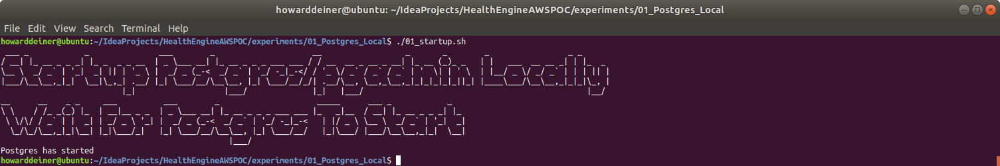\
<BR />
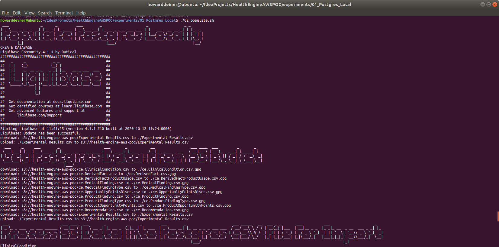\
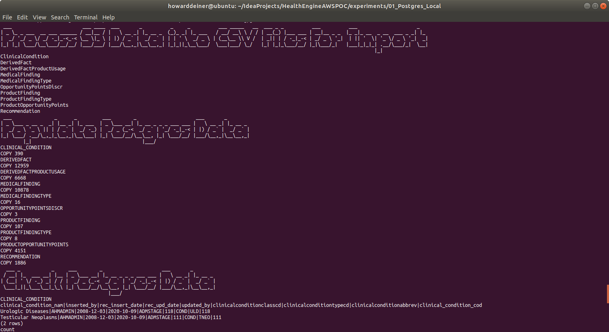\
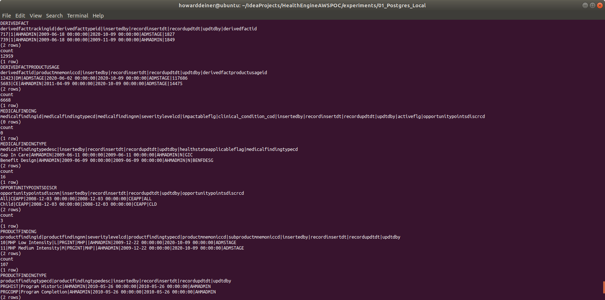\
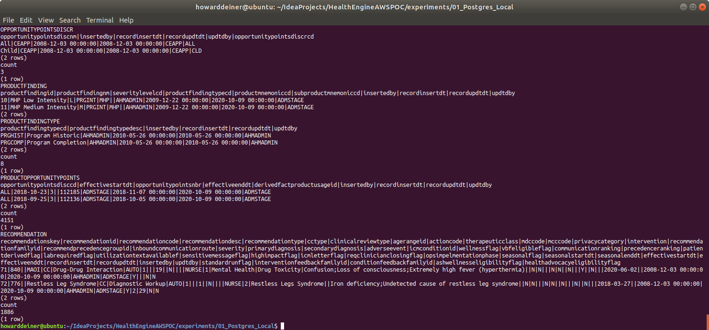\
<BR />
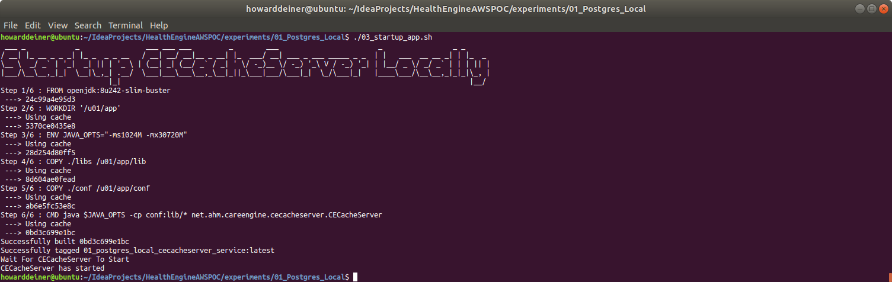\
<BR />
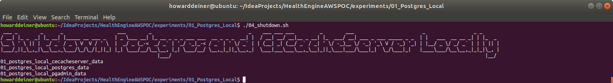\
<BR />
And just for laughs, here's the timings for this run.  All kept in a csv file in S3 at s3://health-engine-aws-poc/Experimental Results.csv
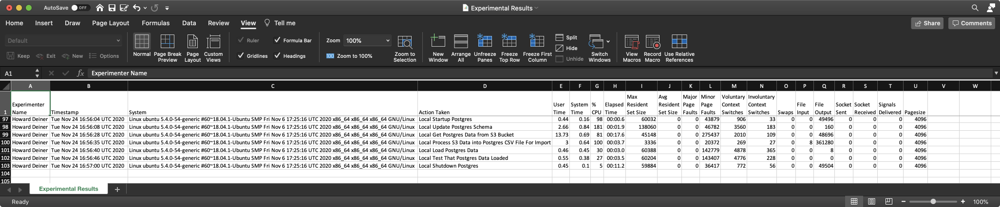\
<BR />

### Large Data Experiments

A different script is available for large data testing.  This transfers the dataset for large volume testing.  It uses the data from the "Complete 2019 Program Year Open Payments Dataset" from the Center for Medicare & Medicade Services.  See https://www.cms.gov/OpenPayments/Explore-the-Data/Dataset-Downloads for details.  In total, there is over 6GB in this dataset. 

The script 02_populate_large_data.sh is a variation on 02_populate.sh.
```bash
#!/usr/bin/env bash

if [ $# -eq 0 ]
  then
    echo "must supply the command with the number of rows to use"
    exit 1
fi

re='^[0-9]+$'
if ! [[ $1 =~ $re ]] ; then
    echo "must supply the command with the number of rows to use"
   exit 1
fi

ROWS=$1
export ROWS

bash -c 'cat << "EOF" > .script
#!/usr/bin/env bash

echo $1

figlet -w 240 -f small "Populate Postgres Locally - Large Data - $(numfmt --grouping $ROWS) rows"

figlet -w 240 -f small "Apply Schema for Postgres - Large Data - $(numfmt --grouping $ROWS) rows"
docker exec postgres_container psql --port=5432 --username=postgres --no-password --no-align -c '"'"'create database PGYR19_P063020;'"'"'
docker exec postgres_container psql --port=5432 --username=postgres --no-password --no-align -d pgyr19_p063020 -c '"'"'create schema PI;'"'"'
liquibase --changeLogFile=../../ddl/PGYR19_P063020/changeset.xml --url=jdbc:postgresql://localhost:5432/pgyr19_p063020 --username=postgres --password=password  --driver=org.postgresql.Driver --classpath=../../liquibase_drivers/postgresql-42.2.18.jre6.jar update
EOF'
chmod +x .script
command time -v ./.script 2> .results
../../getExperimentalResults.sh
experiment=$(../../getExperimentNumber.sh)
../../getDataAsCSVline.sh .results ${experiment} "01_Postgres_Local: Populate Postgres Schema - Large Data - $ROWS rows" >> Experimental\ Results.csv
../../putExperimentalResults.sh
rm .script .results Experimental\ Results.csv

bash -c 'cat << "EOF" > .script
#!/usr/bin/env bash
figlet -w 240 -f small "Get Data from S3 Bucket"
../../data/transferPGYR19_P063020_from_s3_and_decrypt.sh
EOF'
chmod +x .script
command time -v ./.script 2> .results
../../getExperimentalResults.sh
experiment=$(../../getExperimentNumber.sh)
../../getDataAsCSVline.sh .results ${experiment} "01_Postgres_Local: Get Data from S3 Bucket - Large Data - $ROWS rows" >> Experimental\ Results.csv
../../putExperimentalResults.sh
rm .script .results Experimental\ Results.csv
ls -lh /tmp/PGYR19_P063020

bash -c 'cat << "EOF" > .script
#!/usr/bin/env bash
figlet -w 240 -f small "Populate Postgres Data - Large Data - $ROWS rows"
head -n `echo "$ROWS+1" | bc` /tmp/PGYR19_P063020/OP_DTL_GNRL_PGYR2019_P06302020.csv > /tmp/PGYR19_P063020/OP_DTL_GNRL_PGYR2019_P06302020.subset.csv
sed --in-place 's/applicable_manufacturer_or_applicable_gpo_making_payment_country/applicable_manufacturer_or_applicable_gpo_making_payment_countr/gI' /tmp/PGYR19_P063020/OP_DTL_GNRL_PGYR2019_P06302020.subset.csv
sed --in-place 's/name_of_third_party_entity_receiving_payment_or_transfer_of_value/name_of_third_party_entity_receiving_payment_or_transfer_of_val/gI' /tmp/PGYR19_P063020/OP_DTL_GNRL_PGYR2019_P06302020.subset.csv
COLUMN_NAMES=$(head -n 1 /tmp/PGYR19_P063020/OP_DTL_GNRL_PGYR2019_P06302020.subset.csv)
docker cp /tmp/PGYR19_P063020/OP_DTL_GNRL_PGYR2019_P06302020.subset.csv postgres_container:/tmp/OP_DTL_GNRL_PGYR2019_P06302020.subset.csv
docker exec postgres_container psql --port=5432 --username=postgres --no-password -d pgyr19_p063020 --no-align -c "COPY PI.OP_DTL_GNRL_PGYR2019_P06302020("$COLUMN_NAMES") FROM '"'"'/tmp/OP_DTL_GNRL_PGYR2019_P06302020.subset.csv'"'"' DELIMITER '"'"','"'"' QUOTE '"'"'\"'"'"' CSV HEADER;"
EOF'
chmod +x .script
command time -v ./.script 2> .results
../../getExperimentalResults.sh
experiment=$(../../getExperimentNumber.sh)
../../getDataAsCSVline.sh .results ${experiment} "01_Postgres_Local: Populate Postgres Data - Large Data - $ROWS rows" >> Experimental\ Results.csv
../../putExperimentalResults.sh
rm -rf .script .results Experimental\ Results.csv

bash -c 'cat << "EOF" > .script
#!/usr/bin/env bash
figlet -w 240 -f small "Check Postgres Data - Large Data - $(numfmt --grouping $ROWS) rows"
echo ""
echo "First two rows of data"
docker exec postgres_container psql --port=5432 --username=postgres --no-password -d pgyr19_p063020 --no-align -c "select * from PI.OP_DTL_GNRL_PGYR2019_P06302020 limit 2;"
echo ""
echo "Count of rows of data"
docker exec postgres_container psql --port=5432 --username=postgres --no-password -d pgyr19_p063020 --no-align -c "select count(*) from PI.OP_DTL_GNRL_PGYR2019_P06302020;"
echo ""
echo "Average of total_amount_of_payment_usdollars"
docker exec postgres_container psql --port=5432 --username=postgres --no-password -d pgyr19_p063020 --no-align -c "select avg(total_amount_of_payment_usdollars) from PI.OP_DTL_GNRL_PGYR2019_P06302020;"
echo ""
echo "Top ten earning physicians"
echo "SELECT physician_first_name, physician_last_name, SUM(total_amount_of_payment_usdollars), COUNT(total_amount_of_payment_usdollars)" > .sql
echo "FROM PI.OP_DTL_GNRL_PGYR2019_P06302020" >> .sql
echo "WHERE physician_first_name <> '"'"''"'"'" >> .sql
echo "  AND physician_last_name <> '"'"''"'"'" >> .sql
echo "GROUP BY physician_first_name, physician_last_name" >> .sql
echo "ORDER BY SUM(total_amount_of_payment_usdollars) DESC" >> .sql
echo "LIMIT 10;" >> .sql
docker exec postgres_container psql --port=5432 --username=postgres --no-password -d pgyr19_p063020 --no-align -c "$(<.sql)"
EOF'

chmod +x .script
command time -v ./.script 2> .results
../../getExperimentalResults.sh
experiment=$(../../getExperimentNumber.sh)
../../getDataAsCSVline.sh .results ${experiment} "01_Postgres_Local: Check Postgres Data - Large Data - $ROWS rows" >> Experimental\ Results.csv
../../putExperimentalResults.sh
rm -rf .script .sql .results *.csv /tmp/PGYR19_P063020
```
It uses the following changeset.
```xml
<?xml version="1.0" encoding="UTF-8"?>

<databaseChangeLog
  xmlns="http://www.liquibase.org/xml/ns/dbchangelog"
  xmlns:xsi="http://www.w3.org/2001/XMLSchema-instance"
  xsi:schemaLocation="http://www.liquibase.org/xml/ns/dbchangelog
         http://www.liquibase.org/xml/ns/dbchangelog/dbchangelog-3.8.xsd">

    <changeSet  id="1"  author="howarddeiner">

        <createTable tableName="OP_DTL_GNRL_PGYR2019_P06302020" schemaName="PI">
            <column name="change_type" type="VARCHAR2(20)"/>
            <column name="covered_recipient_type" type="VARCHAR2(50)"/>
            <column name="teaching_hospital_ccn" type="VARCHAR2(06)"/>
            <column name="teaching_hospital_id" type="NUMBER(38,0)"/>
            <column name="teaching_hospital_name" type="VARCHAR2(100)"/>
            <column name="physician_profile_id" type="NUMBER(38,0)"/>
            <column name="physician_first_name" type="VARCHAR2(20)"/>
            <column name="physician_middle_name" type="VARCHAR2(20)"/>
            <column name="physician_last_name" type="VARCHAR2(35)"/>
            <column name="physician_name_suffix" type="VARCHAR2(5)"/>
            <column name="recipient_primary_business_street_address_line1" type="VARCHAR2(55)"/>
            <column name="recipient_primary_business_street_address_line2" type="VARCHAR2(55)"/>
            <column name="recipient_city" type="VARCHAR2(40)"/>
            <column name="recipient_state" type="CHAR(2)"/>
            <column name="recipient_zip_code" type="VARCHAR2(10)"/>
            <column name="recipient_country" type="VARCHAR2(100)"/>
            <column name="recipient_province" type="VARCHAR2(20)"/>
            <column name="recipient_postal_code" type="VARCHAR2(20)"/>
            <column name="physician_primary_type" type="VARCHAR2(100)"/>
            <column name="physician_specialty" type="VARCHAR2(300)"/>
            <column name="physician_license_state_code1" type="CHAR(2)"/>
            <column name="physician_license_state_code2" type="CHAR(2)"/>
            <column name="physician_license_state_code3" type="CHAR(2)"/>
            <column name="physician_license_state_code4" type="CHAR(2)"/>
            <column name="physician_license_state_code5" type="CHAR(2)"/>
            <column name="submitting_applicable_manufacturer_or_applicable_gpo_name" type="VARCHAR2(100)"/>
            <column name="applicable_manufacturer_or_applicable_gpo_making_payment_id" type="VARCHAR2(12)"/>
            <column name="applicable_manufacturer_or_applicable_gpo_making_payment_name" type="VARCHAR2(100)"/>
            <column name="applicable_manufacturer_or_applicable_gpo_making_payment_state" type="CHAR(2)"/>
            <column name="applicable_manufacturer_or_applicable_gpo_making_payment_countr" type="VARCHAR2(100)"/>
            <column name="total_amount_of_payment_usdollars" type="NUMBER(12,2)"/>
            <column name="date_of_payment" type="DATE"/>
            <column name="number_of_payments_included_in_total_amount" type="NUMBER(3,0)"/>
            <column name="form_of_payment_or_transfer_of_value" type="VARCHAR2(100)"/>
            <column name="nature_of_payment_or_transfer_of_value" type="VARCHAR2(200)"/>
            <column name="city_of_travel" type="VARCHAR2(40)"/>
            <column name="state_of_travel" type="CHAR(2)"/>
            <column name="country_of_travel" type="VARCHAR2(100)"/>
            <column name="physician_ownership_indicator" type="CHAR(3)"/>
            <column name="third_party_payment_recipient_indicator" type="VARCHAR2(50)"/>
            <column name="name_of_third_party_entity_receiving_payment_or_transfer_of_val" type="VARCHAR2(50)"/>
            <column name="charity_indicator" type="CHAR(3)"/>
            <column name="third_party_equals_covered_recipient_indicator" type="CHAR(3)"/>
            <column name="contextual_information" type="VARCHAR2(500)"/>
            <column name="delay_in_publication_indicator" type="CHAR(3)"/>
            <column name="record_id" type="NUMBER(38,0)"/>
            <column name="dispute_status_for_publication" type="CHAR(3)"/>
            <column name="related_product_indicator" type="VARCHAR2(100)"/>
            <column name="covered_or_noncovered_indicator_1" type="VARCHAR2(100)"/>
            <column name="indicate_drug_or_biological_or_device_or_medical_supply_1" type="VARCHAR2(100)"/>
            <column name="product_category_or_therapeutic_area_1" type="VARCHAR2(100)"/>
            <column name="name_of_drug_or_biological_or_device_or_medical_supply_1" type="VARCHAR2(500)"/>
            <column name="associated_drug_or_biological_ndc_1" type="VARCHAR2(100)"/>
            <column name="covered_or_noncovered_indicator_2" type="VARCHAR2(100)"/>
            <column name="indicate_drug_or_biological_or_device_or_medical_supply_2" type="VARCHAR2(100)"/>
            <column name="product_category_or_therapeutic_area_2" type="VARCHAR2(100)"/>
            <column name="name_of_drug_or_biological_or_device_or_medical_supply_2" type="VARCHAR2(500)"/>
            <column name="associated_drug_or_biological_ndc_2" type="VARCHAR2(100)"/>
            <column name="covered_or_noncovered_indicator_3" type="VARCHAR2(100)"/>
            <column name="indicate_drug_or_biological_or_device_or_medical_supply_3" type="VARCHAR2(100)"/>
            <column name="product_category_or_therapeutic_area_3" type="VARCHAR2(100)"/>
            <column name="name_of_drug_or_biological_or_device_or_medical_supply_3" type="VARCHAR2(500)"/>
            <column name="associated_drug_or_biological_ndc_3" type="VARCHAR2(100)"/>
            <column name="covered_or_noncovered_indicator_4" type="VARCHAR2(100)"/>
            <column name="indicate_drug_or_biological_or_device_or_medical_supply_4" type="VARCHAR2(100)"/>
            <column name="product_category_or_therapeutic_area_4" type="VARCHAR2(100)"/>
            <column name="name_of_drug_or_biological_or_device_or_medical_supply_4" type="VARCHAR2(500)"/>
            <column name="associated_drug_or_biological_ndc_4" type="VARCHAR2(100)"/>
            <column name="covered_or_noncovered_indicator_5" type="VARCHAR2(100)"/>
            <column name="indicate_drug_or_biological_or_device_or_medical_supply_5" type="VARCHAR2(100)"/>
            <column name="product_category_or_therapeutic_area_5" type="VARCHAR2(100)"/>
            <column name="name_of_drug_or_biological_or_device_or_medical_supply_5" type="VARCHAR2(500)"/>
            <column name="associated_drug_or_biological_ndc_5" type="VARCHAR2(100)"/>
            <column name="program_year" type="CHAR(4)"/>
            <column name="payment_publication_date" type="DATE"/>
        </createTable>

    </changeSet>

</databaseChangeLog>
```
<BR />
When run in conjunction with 01_startup.sh and 03_shutdown.sh for a sample size of 1,000,000 records, you will see:

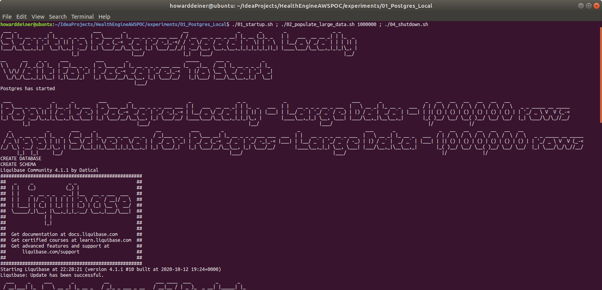\
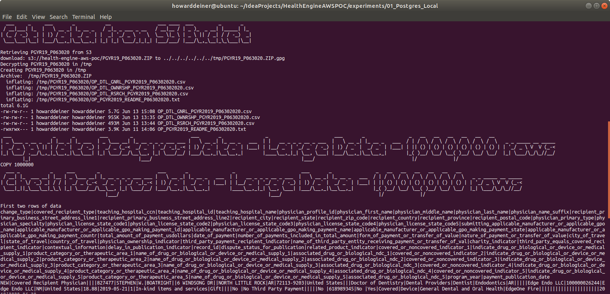\
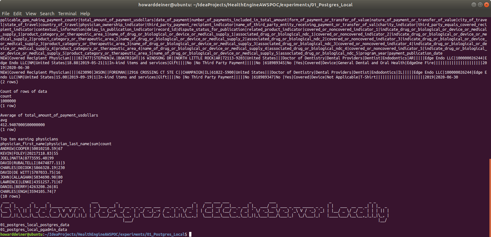\
<BR />
This particular run generated the following results.

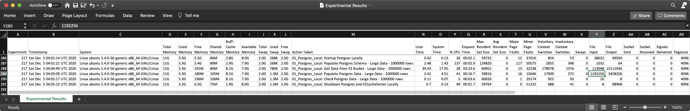\
<BR />
