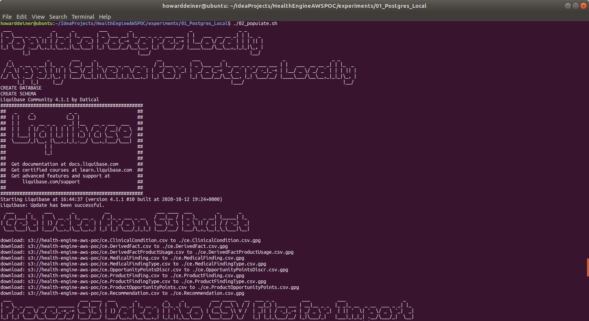
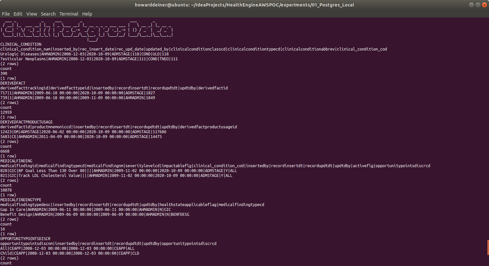
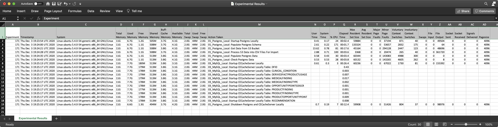

### Starting out with Postgres

##### Concept

> PostgreSQL, also known as Postgres, is a free and open-source relational database management system (RDBMS) emphasizing extensibility and SQL compliance. It was originally named POSTGRES, referring to its origins as a successor to the Ingres database developed at the University of California, Berkeley. In 1996, the project was renamed to PostgreSQL to reflect its support for SQL. After a review in 2007, the development team decided to keep the name PostgreSQL and the alias Postgres.
> https://en.wikipedia.org/wiki/PostgreSQL
> https://www.postgresql.org

#### Execution

We want to get into Postgres quickly.  So, before we start running AWS instances, we need to master our data and how we're going to instantiate it in the database.

This whole project is about rearchitecting the database behind CareEngine, and we will try several different databases to do that.

Rather than rewrite each SQL DDL into each database's dialect, I will use a tool called Liquibase, which can do two things.
<UL>
<LI>Emit SQL DDL specific to each database from a common changeset</LI>
<LI>Use the notion of changesets to allow us to migrate the database created from one version to another.</LI>
</UL>

### 01_startup.sh
This script uses docker-compose to take the latest Dockerhub postgres image and bring it up in a container running as a daemon.  Since Postgres wants to persist data, I use a Docker Volume, which I delete in 03_shutdown.sh

Since we do not want to make use of the database until it actually starts, I monitor the logs from the postgres_container until I see a signature which tells me that the database has started.
```bash
#!/usr/bin/env bash

bash -c 'cat << "EOF" > .script
#!/usr/bin/env bash
figlet -w 240 -f small "Startup Postgres/pgadmin/cecacheserver Locally"
docker volume rm 01_postgres_local_postgres_data
docker volume rm 01_postgres_local_pgadmin_data
docker volume rm 01_postgres_local_cecacheserver_data
docker-compose -f docker-compose.yml up -d

figlet -w 240 -f small "Wait For Postgres To Start"
while true ; do
  docker logs postgres_container > stdout.txt 2> stderr.txt
  result=$(grep -c "LOG:  database system is ready to accept connections" stderr.txt)
  if [ $result = 1 ] ; then
    echo "Postgres has started"
    break
  fi
  sleep 5
done
rm stdout.txt stderr.txt
rm stdout.txt stderr.txt
EOF'
chmod +x .script
command time -v ./.script 2> .results
../../getExperimentalResults.sh
../../getDataAsCSVline.sh .results "Howard Deiner" "Local Startup Postgres" >> Experimental\ Results.csv
../../putExperimentalResults.sh
rm .script .results Experimental\ Results.csv
```
### 02_populate.sh
This script first uses the running postgres_container to run psql to create a database for us.

The script then runs liquibase to update the database to it's intended state.  More on that in a bit.

The script then demonstrates that the tables created have data in them, all managed by liquibase.
```bash
#!/usr/bin/env bash
bash -c 'cat << "EOF" > .script
#!/usr/bin/env bash
figlet -w 240 -f small "Populate Postgres Locally"
docker exec postgres_container psql --port=5432 --username=postgres --no-password --no-align -c '"'"'create database CE;'"'"'
cp ../../src/java/Translator/changeSet.xml changeSet.xml
# fix <createTable tableName=" to become <createTable tableName="
sed --in-place --regexp-extended '"'"'s/<createTable\ tableName\=\"CE\./<createTable\ tableName\=\"/g'"'"' changeSet.xml
# fix to remove " schemaName="CE""
sed --in-place --regexp-extended '"'"'s/ schemaName\=\"\CE\">/>/g'"'"' changeSet.xml
# make schemaName="CE" in a line go away
sed --in-place --regexp-extended '"'"'s/schemaName\=\"CE\"//g'"'"' changeSet.xml
liquibase update
rm changeSet.xml
EOF'
chmod +x .script
command time -v ./.script 2> .results
../../getExperimentalResults.sh
../../getDataAsCSVline.sh .results "Howard Deiner" "Local Update Postgres Schema" >> Experimental\ Results.csv
../../putExperimentalResults.sh
rm .script .results Experimental\ Results.csv

bash -c 'cat << "EOF" > .script
#!/usr/bin/env bash
figlet -w 240 -f small "Get Postgres Data from S3 Bucket"
../../data/transfer_from_s3_and_decrypt.sh ce.ClinicalCondition.csv
../../data/transfer_from_s3_and_decrypt.sh ce.DerivedFact.csv
../../data/transfer_from_s3_and_decrypt.sh ce.DerivedFactProductUsage.csv
../../data/transfer_from_s3_and_decrypt.sh ce.MedicalFinding.csv
../../data/transfer_from_s3_and_decrypt.sh ce.MedicalFindingType.csv
../../data/transfer_from_s3_and_decrypt.sh ce.OpportunityPointsDiscr.csv
../../data/transfer_from_s3_and_decrypt.sh ce.ProductFinding.csv
../../data/transfer_from_s3_and_decrypt.sh ce.ProductFindingType.csv
../../data/transfer_from_s3_and_decrypt.sh ce.ProductOpportunityPoints.csv
../../data/transfer_from_s3_and_decrypt.sh ce.Recommendation.csv
EOF'
chmod +x .script
command time -v ./.script 2> .results
../../getExperimentalResults.sh
../../getDataAsCSVline.sh .results "Howard Deiner" "Local Get Postgres Data from S3 Bucket" >> Experimental\ Results.csv
../../putExperimentalResults.sh
rm .script .results Experimental\ Results.csv

bash -c 'cat << "EOF" > .script
#!/usr/bin/env bash
figlet -w 240 -f small "Process S3 Data into Postgres CSV File For Import"
../transform_Oracle_ce.ClinicalCondition_to_csv.sh
../transform_Oracle_ce.DerivedFact_to_csv.sh
../transform_Oracle_ce.DerivedFactProductUsage_to_csv.sh
../transform_Oracle_ce.MedicalFinding_to_csv.sh
../transform_Oracle_ce.MedicalFindingType_to_csv.sh
../transform_Oracle_ce.OpportunityPointsDiscr_to_csv.sh
../transform_Oracle_ce.ProductFinding_to_csv.sh
../transform_Oracle_ce.ProductFindingType_to_csv.sh
../transform_Oracle_ce.ProductOpportunityPoints_to_csv.sh
../transform_Oracle_ce.Recommendation_to_csv.sh
EOF'
chmod +x .script
command time -v ./.script 2> .results
../../getExperimentalResults.sh
../../getDataAsCSVline.sh .results "Howard Deiner" "Local Process S3 Data into Postgres CSV File For Import" >> Experimental\ Results.csv
../../putExperimentalResults.sh
rm .script .results Experimental\ Results.csv

bash -c 'cat << "EOF" > .script
#!/usr/bin/env bash
figlet -w 240 -f small "Load Postgres Data"
echo "CLINICAL_CONDITION"
docker cp ce.ClinicalCondition.csv postgres_container:/tmp/ce.ClinicalCondition.csv
docker exec postgres_container psql --port=5432 --username=postgres --no-password -d ce --no-align -c "COPY CLINICAL_CONDITION(CLINICAL_CONDITION_COD,CLINICAL_CONDITION_NAM,INSERTED_BY,REC_INSERT_DATE,REC_UPD_DATE,UPDATED_BY,CLINICALCONDITIONCLASSCD,CLINICALCONDITIONTYPECD,CLINICALCONDITIONABBREV) FROM '"'"'/tmp/ce.ClinicalCondition.csv'"'"' DELIMITER '"'"','"'"' CSV HEADER;"
echo "DERIVEDFACT"
docker cp ce.DerivedFact.csv postgres_container:/tmp/ce.DerivedFact.csv
docker exec postgres_container psql --port=5432 --username=postgres --no-password -d ce --no-align -c "COPY DERIVEDFACT(DERIVEDFACTID,DERIVEDFACTTRACKINGID,DERIVEDFACTTYPEID,INSERTEDBY,RECORDINSERTDT,RECORDUPDTDT,UPDTDBY) FROM '"'"'/tmp/ce.DerivedFact.csv'"'"' DELIMITER '"'"','"'"' CSV HEADER;"
echo "DERIVEDFACTPRODUCTUSAGE"
docker cp ce.DerivedFactProductUsage.csv postgres_container:/tmp/ce.DerivedFactProductUsage.csv
docker exec postgres_container psql --port=5432 --username=postgres --no-password -d ce --no-align -c "COPY DERIVEDFACTPRODUCTUSAGE(DERIVEDFACTPRODUCTUSAGEID,DERIVEDFACTID,PRODUCTMNEMONICCD,INSERTEDBY,RECORDINSERTDT,RECORDUPDTDT,UPDTDBY) FROM '"'"'/tmp/ce.DerivedFactProductUsage.csv'"'"' DELIMITER '"'"','"'"' CSV HEADER;"
echo "MEDICALFINDING"
docker cp ce.MedicalFinding.csv postgres_container:/tmp/ce.MedicalFinding.csv
docker exec postgres_container psql --port=5432 --username=postgres --no-password -d ce --no-align -c "COPY MEDICALFINDING(CLINICAL_CONDITION_COD,CLINICAL_CONDITION_NAM,INSERTED_BY,REC_INSERT_DATE,REC_UPD_DATE,UPDATED_BY,CLINICALCONDITIONCLASSCD,CLINICALCONDITIONTYPECD,CLINICALCONDITIONABBREV) FROM '"'"'/tmp/ce.MedicalFinding.csv'"'"' DELIMITER '"'"','"'"' CSV HEADER;"
echo "MEDICALFINDINGTYPE"
docker cp ce.MedicalFindingType.csv postgres_container:/tmp/ce.MedicalFindingType.csv
docker exec postgres_container psql --port=5432 --username=postgres --no-password -d ce --no-align -c "COPY MEDICALFINDINGTYPE(MEDICALFINDINGTYPECD,MEDICALFINDINGTYPEDESC,INSERTEDBY,RECORDINSERTDT,RECORDUPDTDT,UPDTDBY,HEALTHSTATEAPPLICABLEFLAG) FROM '"'"'/tmp/ce.MedicalFindingType.csv'"'"' DELIMITER '"'"','"'"' CSV HEADER;"
echo "OPPORTUNITYPOINTSDISCR"
docker cp ce.OpportunityPointsDiscr.csv postgres_container:/tmp/ce.OpportunityPointsDiscr.csv
docker exec postgres_container psql --port=5432 --username=postgres --no-password -d ce --no-align -c "COPY OPPORTUNITYPOINTSDISCR(OPPORTUNITYPOINTSDISCRCD,OPPORTUNITYPOINTSDISCNM,INSERTEDBY,RECORDINSERTDT,RECORDUPDTDT,UPDTDBY) FROM '"'"'/tmp/ce.OpportunityPointsDiscr.csv'"'"' DELIMITER '"'"','"'"' CSV HEADER;"
echo "PRODUCTFINDING"
docker cp ce.ProductFinding.csv postgres_container:/tmp/ce.ProductFinding.csv
docker exec postgres_container psql --port=5432 --username=postgres --no-password -d ce --no-align -c "COPY PRODUCTFINDING(PRODUCTFINDINGID,PRODUCTFINDINGNM,SEVERITYLEVELCD,PRODUCTFINDINGTYPECD,PRODUCTMNEMONICCD,SUBPRODUCTMNEMONICCD,INSERTEDBY,RECORDINSERTDT,RECORDUPDTDT,UPDTDBY) FROM '"'"'/tmp/ce.ProductFinding.csv'"'"' DELIMITER '"'"','"'"' CSV HEADER;"
echo "PRODUCTFINDINGTYPE"
docker cp ce.ProductFindingType.csv postgres_container:/tmp/ce.ProductFindingType.csv
docker exec postgres_container psql --port=5432 --username=postgres --no-password -d ce --no-align -c "COPY PRODUCTFINDINGTYPE(PRODUCTFINDINGTYPECD,PRODUCTFINDINGTYPEDESC,INSERTEDBY,RECORDINSERTDT,RECORDUPDTDT,UPDTDBY) FROM '"'"'/tmp/ce.ProductFindingType.csv'"'"' DELIMITER '"'"','"'"' CSV HEADER;"
echo "PRODUCTOPPORTUNITYPOINTS"
docker cp ce.ProductOpportunityPoints.csv postgres_container:/tmp/ce.ProductOpportunityPoints.csv
docker exec postgres_container psql --port=5432 --username=postgres --no-password -d ce --no-align -c "COPY PRODUCTOPPORTUNITYPOINTS(OPPORTUNITYPOINTSDISCCD,EFFECTIVESTARTDT,OPPORTUNITYPOINTSNBR,EFFECTIVEENDDT,DERIVEDFACTPRODUCTUSAGEID,INSERTEDBY,RECORDINSERTDT,RECORDUPDTDT,UPDTDBY) FROM '"'"'/tmp/ce.ProductOpportunityPoints.csv'"'"' DELIMITER '"'"','"'"' CSV HEADER;"
echo "RECOMMENDATION"
docker cp ce.Recommendation.csv postgres_container:/tmp/ce.Recommendation.csv
docker exec postgres_container psql --port=5432 --username=postgres --no-password -d ce --no-align -c "COPY RECOMMENDATION(RECOMMENDATIONSKEY,RECOMMENDATIONID,RECOMMENDATIONCODE,RECOMMENDATIONDESC,RECOMMENDATIONTYPE,CCTYPE,CLINICALREVIEWTYPE,AGERANGEID,ACTIONCODE,THERAPEUTICCLASS,MDCCODE,MCCCODE,PRIVACYCATEGORY,INTERVENTION,RECOMMENDATIONFAMILYID,RECOMMENDPRECEDENCEGROUPID,INBOUNDCOMMUNICATIONROUTE,SEVERITY,PRIMARYDIAGNOSIS,SECONDARYDIAGNOSIS,ADVERSEEVENT,ICMCONDITIONID,WELLNESSFLAG,VBFELIGIBLEFLAG,COMMUNICATIONRANKING,PRECEDENCERANKING,PATIENTDERIVEDFLAG,LABREQUIREDFLAG,UTILIZATIONTEXTAVAILABLEF,SENSITIVEMESSAGEFLAG,HIGHIMPACTFLAG,ICMLETTERFLAG,REQCLINICIANCLOSINGFLAG,OPSIMPELMENTATIONPHASE,SEASONALFLAG,SEASONALSTARTDT,SEASONALENDDT,EFFECTIVESTARTDT,EFFECTIVEENDDT,RECORDINSERTDT,RECORDUPDTDT,INSERTEDBY,UPDTDBY,STANDARDRUNFLAG,INTERVENTIONFEEDBACKFAMILYID,CONDITIONFEEDBACKFAMILYID,ASHWELLNESSELIGIBILITYFLAG,HEALTHADVOCACYELIGIBILITYFLAG) FROM '"'"'/tmp/ce.Recommendation.csv'"'"' DELIMITER '"'"','"'"' CSV HEADER;"
EOF'
chmod +x .script
command time -v ./.script 2> .results
../../getExperimentalResults.sh
../../getDataAsCSVline.sh .results "Howard Deiner" "Local Load Postgres Data" >> Experimental\ Results.csv
../../putExperimentalResults.sh
rm .script .results Experimental\ Results.csv

bash -c 'cat << "EOF" > .script
#!/usr/bin/env bash
figlet -w 240 -f small "Check Postgres Locally"
echo "CLINICAL_CONDITION"
docker exec postgres_container psql --port=5432 --username=postgres --no-password -d ce --no-align -c "select * from CLINICAL_CONDITION limit 2;"
docker exec postgres_container psql --port=5432 --username=postgres --no-password -d ce --no-align -c "select count(*) from CLINICAL_CONDITION;"
echo "DERIVEDFACT"
docker exec postgres_container psql --port=5432 --username=postgres --no-password -d ce --no-align -c "select * from DERIVEDFACT limit 2;"
docker exec postgres_container psql --port=5432 --username=postgres --no-password -d ce --no-align -c "select count(*) from DERIVEDFACT;"
echo "DERIVEDFACTPRODUCTUSAGE"
docker exec postgres_container psql --port=5432 --username=postgres --no-password -d ce --no-align -c "select * from DERIVEDFACTPRODUCTUSAGE limit 2;"
docker exec postgres_container psql --port=5432 --username=postgres --no-password -d ce --no-align -c "select count(*) from DERIVEDFACTPRODUCTUSAGE;"
echo "MEDICALFINDING"
docker exec postgres_container psql --port=5432 --username=postgres --no-password -d ce --no-align -c "select * from MEDICALFINDING limit 2;"
docker exec postgres_container psql --port=5432 --username=postgres --no-password -d ce --no-align -c "select count(*) from MEDICALFINDING;"
echo "MEDICALFINDINGTYPE"
docker exec postgres_container psql --port=5432 --username=postgres --no-password -d ce --no-align -c "select * from MEDICALFINDINGTYPE limit 2;"
docker exec postgres_container psql --port=5432 --username=postgres --no-password -d ce --no-align -c "select count(*) from MEDICALFINDINGTYPE;"
echo "OPPORTUNITYPOINTSDISCR"
docker exec postgres_container psql --port=5432 --username=postgres --no-password -d ce --no-align -c "select * from OPPORTUNITYPOINTSDISCR limit 2;"
docker exec postgres_container psql --port=5432 --username=postgres --no-password -d ce --no-align -c "select count(*) from OPPORTUNITYPOINTSDISCR;"
echo "PRODUCTFINDING"
docker exec postgres_container psql --port=5432 --username=postgres --no-password -d ce --no-align -c "select * from PRODUCTFINDING limit 2;"
docker exec postgres_container psql --port=5432 --username=postgres --no-password -d ce --no-align -c "select count(*) from PRODUCTFINDING;"
echo "PRODUCTFINDINGTYPE"
docker exec postgres_container psql --port=5432 --username=postgres --no-password -d ce --no-align -c "select * from PRODUCTFINDINGTYPE limit 2;"
docker exec postgres_container psql --port=5432 --username=postgres --no-password -d ce --no-align -c "select count(*) from PRODUCTFINDINGTYPE;"
echo "PRODUCTOPPORTUNITYPOINTS"
docker exec postgres_container psql --port=5432 --username=postgres --no-password -d ce --no-align -c "select * from PRODUCTOPPORTUNITYPOINTS limit 2;"
docker exec postgres_container psql --port=5432 --username=postgres --no-password -d ce --no-align -c "select count(*) from PRODUCTOPPORTUNITYPOINTS;"
echo "RECOMMENDATION"
docker exec postgres_container psql --port=5432 --username=postgres --no-password -d ce --no-align -c "select * from RECOMMENDATION limit 2;"
docker exec postgres_container psql --port=5432 --username=postgres --no-password -d ce --no-align -c "select count(*) from RECOMMENDATION;"
EOF'
chmod +x .script
command time -v ./.script 2> .results
../../getExperimentalResults.sh
../../getDataAsCSVline.sh .results "Howard Deiner" "Local Test That Postgres Data Loaded" >> Experimental\ Results.csv
../../putExperimentalResults.sh
rm .script .results *.csv
```
It is also using this changeset.  There is some small amount of pre-processing in 02_populate to remove the schema related issues.
```xml
<?xml version="1.0" encoding="UTF-8"?>

<databaseChangeLog
	xmlns="http://www.liquibase.org/xml/ns/dbchangelog"
	xmlns:xsi="http://www.w3.org/2001/XMLSchema-instance"
	xsi:schemaLocation="http://www.liquibase.org/xml/ns/dbchangelog
	http://www.liquibase.org/xml/ns/dbchangelog/dbchangelog-3.8.xsd">

	<changeSet  id="1"  author="ce">

		<createTable tableName="CE.OPPORTUNITYPOINTSDISCR" schemaName="CE">
			<column name="OPPORTUNITYPOINTSDISCNM" type="VARCHAR2(255)"/>
			<column name="INSERTEDBY" type="VARCHAR2(30)" defaultValue="DEFAULT USER"/>
			<column name="RECORDINSERTDT" type="TIMESTAMP" defaultValueComputed="CURRENT_TIMESTAMP"/>
			<column name="RECORDUPDTDT" type="TIMESTAMP" defaultValueComputed="CURRENT_TIMESTAMP"/>
			<column name="UPDTDBY" type="VARCHAR2(30)" defaultValue="DEFAULT USER"/>
			<column name="OPPORTUNITYPOINTSDISCRCD" type="VARCHAR2(12)">
				<constraints primaryKey="true"/>
			</column>
		</createTable>

		<createTable tableName="CE.DERIVEDFACT" schemaName="CE">
			<column name="DERIVEDFACTTRACKINGID" type="bigint"/>
			<column name="DERIVEDFACTTYPEID" type="bigint"/>
			<column name="INSERTEDBY" type="VARCHAR2(30)" defaultValue="DEFAULT USER"/>
			<column name="RECORDINSERTDT" type="TIMESTAMP" defaultValueComputed="CURRENT_TIMESTAMP"/>
			<column name="RECORDUPDTDT" type="TIMESTAMP" defaultValueComputed="CURRENT_TIMESTAMP"/>
			<column name="UPDTDBY" type="VARCHAR2(30)" defaultValue="DEFAULT USER"/>
			<column name="DERIVEDFACTID" type="bigint">
				<constraints primaryKey="true"/>
			</column>
		</createTable>

		<createTable tableName="CE.RECOMMENDATIONTEXT" schemaName="CE">
			<column name="RECOMMENDATIONTEXTID" type="bigint"/>
			<column name="RECOMMENDATIONID" type="NUMBER(10,0)"/>
			<column name="LANGUAGECD" type="CHAR(2)"/>
			<column name="RECOMMENDATIONTEXTTYPE" type="VARCHAR2(20)"/>
			<column name="MESSAGETYPE" type="CHAR(3)"/>
			<column name="RECOMMENDATIONTITLE" type="VARCHAR2(200)"/>
			<column name="RECOMMENDATIONTEXT" type="VARCHAR2(4000)"/>
			<column name="RECORDINSERTDT" type="TIMESTAMP" defaultValueComputed="CURRENT_TIMESTAMP"/>
			<column name="RECORDUPDATEDT" type="TIMESTAMP" defaultValueComputed="CURRENT_TIMESTAMP"/>
			<column name="INSERTEDBY" type="VARCHAR2(30)" defaultValue="DEFAULT USER"/>
			<column name="UPDATEDBY" type="VARCHAR2(30)" defaultValue="DEFAULT USER"/>
			<column name="DEFAULTIN" type="CHAR(1)"/>
		</createTable>

		<createTable tableName="CE.CLINICAL_CONDITION" schemaName="CE">
			<column name="CLINICAL_CONDITION_NAM" type="VARCHAR2(200)"/>
			<column name="INSERTED_BY" type="VARCHAR2(50)"/>
			<column name="REC_INSERT_DATE" type="DATE"/>
			<column name="REC_UPD_DATE" type="DATE"/>
			<column name="UPDATED_BY" type="VARCHAR2(50)"/>
			<column name="CLINICALCONDITIONCLASSCD" type="bigint"/>
			<column name="CLINICALCONDITIONTYPECD" type="VARCHAR2(12)"/>
			<column name="CLINICALCONDITIONABBREV" type="VARCHAR2(50)"/>
			<column name="CLINICAL_CONDITION_COD" type="bigint">
				<constraints primaryKey="true"/>
			</column>
		</createTable>

		<createTable tableName="CE.PRODUCTOPPORTUNITYPOINTS" schemaName="CE">
			<column name="OPPORTUNITYPOINTSDISCCD" type="VARCHAR2(100)"/>
			<column name="EFFECTIVESTARTDT" type="DATE"/>
			<column name="OPPORTUNITYPOINTSNBR" type="bigint"/>
			<column name="EFFECTIVEENDDT" type="DATE"/>
			<column name="DERIVEDFACTPRODUCTUSAGEID" type="bigint"/>
			<column name="INSERTEDBY" type="VARCHAR2(30)" defaultValue="DEFAULT USER"/>
			<column name="RECORDINSERTDT" type="TIMESTAMP" defaultValueComputed="CURRENT_TIMESTAMP"/>
			<column name="RECORDUPDTDT" type="TIMESTAMP" defaultValueComputed="CURRENT_TIMESTAMP"/>
			<column name="UPDTDBY" type="VARCHAR2(30)" defaultValue="DEFAULT USER"/>
		</createTable>

		<createTable tableName="CE.MEDICALFINDING" schemaName="CE">
			<column name="MEDICALFINDINGID" type="bigint"/>
			<column name="MEDICALFINDINGTYPECD" type="VARCHAR2(12)"/>
			<column name="MEDICALFINDINGNM" type="VARCHAR2(200)"/>
			<column name="SEVERITYLEVELCD" type="VARCHAR2(12)"/>
			<column name="IMPACTABLEFLG" type="CHAR(1)"/>
			<column name="CLINICAL_CONDITION_COD" type="bigint"/>
			<column name="INSERTEDBY" type="VARCHAR2(30)" defaultValue="DEFAULT USER"/>
			<column name="RECORDINSERTDT" type="TIMESTAMP" defaultValueComputed="CURRENT_TIMESTAMP"/>
			<column name="RECORDUPDTDT" type="TIMESTAMP" defaultValueComputed="CURRENT_TIMESTAMP"/>
			<column name="UPDTDBY" type="VARCHAR2(30)" defaultValue="DEFAULT USER"/>
			<column name="ACTIVEFLG" type="CHAR(1)"/>
			<column name="OPPORTUNITYPOINTSDISCRCD" type="VARCHAR2(12)"/>
		</createTable>

		<createTable tableName="CE.DERIVEDFACTPRODUCTUSAGE" schemaName="CE">
			<column name="DERIVEDFACTID" type="bigint"/>
			<column name="PRODUCTMNEMONICCD" type="VARCHAR2(50)"/>
			<column name="INSERTEDBY" type="VARCHAR2(30)" defaultValue="DEFAULT USER"/>
			<column name="RECORDINSERTDT" type="TIMESTAMP" defaultValueComputed="CURRENT_TIMESTAMP"/>
			<column name="RECORDUPDTDT" type="TIMESTAMP" defaultValueComputed="CURRENT_TIMESTAMP"/>
			<column name="UPDTDBY" type="VARCHAR2(30)" defaultValue="DEFAULT USER"/>
			<column name="DERIVEDFACTPRODUCTUSAGEID" type="bigint">
				<constraints primaryKey="true"/>
			</column>
		</createTable>

		<createTable tableName="CE.PRODUCTFINDINGTYPE" schemaName="CE">
			<column name="PRODUCTFINDINGTYPECD" type="VARCHAR2(12)"/>
			<column name="PRODUCTFINDINGTYPEDESC" type="VARCHAR2(255)"/>
			<column name="INSERTEDBY" type="VARCHAR2(30)" defaultValue="DEFAULT USER"/>
			<column name="RECORDINSERTDT" type="TIMESTAMP" defaultValueComputed="CURRENT_TIMESTAMP"/>
			<column name="RECORDUPDTDT" type="TIMESTAMP" defaultValueComputed="CURRENT_TIMESTAMP"/>
			<column name="UPDTDBY" type="VARCHAR2(30)" defaultValue="DEFAULT USER"/>
		</createTable>

		<createTable tableName="CE.RECOMMENDATION" schemaName="CE">
			<column name="RECOMMENDATIONSKEY" type="bigint"/>
			<column name="RECOMMENDATIONID" type="NUMBER(10,0)"/>
			<column name="RECOMMENDATIONCODE" type="VARCHAR2(200)"/>
			<column name="RECOMMENDATIONDESC" type="VARCHAR2(4000)"/>
			<column name="RECOMMENDATIONTYPE" type="VARCHAR2(20)"/>
			<column name="CCTYPE" type="VARCHAR2(50)"/>
			<column name="CLINICALREVIEWTYPE" type="VARCHAR2(20)"/>
			<column name="AGERANGEID" type="bigint"/>
			<column name="ACTIONCODE" type="VARCHAR2(200)"/>
			<column name="THERAPEUTICCLASS" type="VARCHAR2(300)"/>
			<column name="MDCCODE" type="VARCHAR2(20)"/>
			<column name="MCCCODE" type="VARCHAR2(50)"/>
			<column name="PRIVACYCATEGORY" type="VARCHAR2(20)"/>
			<column name="INTERVENTION" type="VARCHAR2(200)"/>
			<column name="RECOMMENDATIONFAMILYID" type="bigint"/>
			<column name="RECOMMENDPRECEDENCEGROUPID" type="bigint"/>
			<column name="INBOUNDCOMMUNICATIONROUTE" type="VARCHAR2(15)"/>
			<column name="SEVERITY" type="VARCHAR2(2)"/>
			<column name="PRIMARYDIAGNOSIS" type="VARCHAR2(300)"/>
			<column name="SECONDARYDIAGNOSIS" type="VARCHAR2(300)"/>
			<column name="ADVERSEEVENT" type="VARCHAR2(300)"/>
			<column name="ICMCONDITIONID" type="bigint"/>
			<column name="WELLNESSFLAG" type="CHAR(1)"/>
			<column name="VBFELIGIBLEFLAG" type="CHAR(1)"/>
			<column name="COMMUNICATIONRANKING" type="bigint"/>
			<column name="PRECEDENCERANKING" type="bigint"/>
			<column name="PATIENTDERIVEDFLAG" type="CHAR(1)"/>
			<column name="LABREQUIREDFLAG" type="CHAR(1)"/>
			<column name="UTILIZATIONTEXTAVAILABLEF" type="CHAR(1)"/>
			<column name="SENSITIVEMESSAGEFLAG" type="CHAR(1)"/>
			<column name="HIGHIMPACTFLAG" type="CHAR(1)"/>
			<column name="ICMLETTERFLAG" type="CHAR(1)"/>
			<column name="REQCLINICIANCLOSINGFLAG" type="CHAR(1)"/>
			<column name="OPSIMPELMENTATIONPHASE" type="bigint"/>
			<column name="SEASONALFLAG" type="CHAR(1)"/>
			<column name="SEASONALSTARTDT" type="DATE"/>
			<column name="SEASONALENDDT" type="DATE"/>
			<column name="EFFECTIVESTARTDT" type="DATE"/>
			<column name="EFFECTIVEENDDT" type="DATE"/>
			<column name="RECORDINSERTDT" type="TIMESTAMP" defaultValueComputed="CURRENT_TIMESTAMP"/>
			<column name="RECORDUPDTDT" type="TIMESTAMP" defaultValueComputed="CURRENT_TIMESTAMP"/>
			<column name="INSERTEDBY" type="VARCHAR2(30)" defaultValue="DEFAULT USER"/>
			<column name="UPDTDBY" type="VARCHAR2(30)" defaultValue="DEFAULT USER"/>
			<column name="STANDARDRUNFLAG" type="CHAR(1)"/>
			<column name="INTERVENTIONFEEDBACKFAMILYID" type="bigint"/>
			<column name="CONDITIONFEEDBACKFAMILYID" type="bigint"/>
			<column name="ASHWELLNESSELIGIBILITYFLAG" type="CHAR(1)"/>
			<column name="HEALTHADVOCACYELIGIBILITYFLAG" type="CHAR(1)"/>
		</createTable>

		<createTable tableName="CE.PRODUCTFINDING" schemaName="CE">
			<column name="PRODUCTFINDINGID" type="bigint"/>
			<column name="PRODUCTFINDINGNM" type="VARCHAR2(100)"/>
			<column name="SEVERITYLEVELCD" type="VARCHAR2(12)"/>
			<column name="PRODUCTFINDINGTYPECD" type="VARCHAR2(12)"/>
			<column name="PRODUCTMNEMONICCD" type="VARCHAR2(50)"/>
			<column name="SUBPRODUCTMNEMONICCD" type="VARCHAR2(50)"/>
			<column name="INSERTEDBY" type="VARCHAR2(30)" defaultValue="DEFAULT USER"/>
			<column name="RECORDINSERTDT" type="TIMESTAMP" defaultValueComputed="CURRENT_TIMESTAMP"/>
			<column name="RECORDUPDTDT" type="TIMESTAMP" defaultValueComputed="CURRENT_TIMESTAMP"/>
			<column name="UPDTDBY" type="VARCHAR2(30)" defaultValue="DEFAULT USER"/>
		</createTable>

		<createTable tableName="CE.MEDICALFINDINGTYPE" schemaName="CE">
			<column name="MEDICALFINDINGTYPEDESC" type="VARCHAR2(255)"/>
			<column name="INSERTEDBY" type="VARCHAR2(30)" defaultValue="DEFAULT USER"/>
			<column name="RECORDINSERTDT" type="TIMESTAMP" defaultValueComputed="CURRENT_TIMESTAMP"/>
			<column name="RECORDUPDTDT" type="TIMESTAMP" defaultValueComputed="CURRENT_TIMESTAMP"/>
			<column name="UPDTDBY" type="VARCHAR2(30)" defaultValue="DEFAULT USER"/>
			<column name="HEALTHSTATEAPPLICABLEFLAG" type="CHAR(1)"/>
			<column name="MEDICALFINDINGTYPECD" type="VARCHAR2(12)">
				<constraints primaryKey="true"/>
			</column>
		</createTable>

		<addNotNullConstraint
			columnName="RECOMMENDATIONTEXTID"
			schemaName="CE"
			columnDataType="NUMBER"
			tableName="RECOMMENDATIONTEXT"/>

		<addNotNullConstraint
			columnName="RECOMMENDATIONID"
			schemaName="CE"
			columnDataType="NUMBER(10,0)"
			tableName="RECOMMENDATIONTEXT"/>

		<addNotNullConstraint
			columnName="LANGUAGECD"
			schemaName="CE"
			columnDataType="CHAR(2)"
			tableName="RECOMMENDATIONTEXT"/>

		<addNotNullConstraint
			columnName="RECOMMENDATIONTEXTTYPE"
			schemaName="CE"
			columnDataType="VARCHAR2(20)"
			tableName="RECOMMENDATIONTEXT"/>

		<addNotNullConstraint
			columnName="MESSAGETYPE"
			schemaName="CE"
			columnDataType="CHAR(3)"
			tableName="RECOMMENDATIONTEXT"/>

		<addNotNullConstraint
			columnName="RECOMMENDATIONSKEY"
			schemaName="CE"
			columnDataType="NUMBER"
			tableName="RECOMMENDATION"/>

		<addNotNullConstraint
			columnName="RECOMMENDATIONID"
			schemaName="CE"
			columnDataType="NUMBER(10,0)"
			tableName="RECOMMENDATION"/>

		<addNotNullConstraint
			columnName="RECOMMENDATIONTYPE"
			schemaName="CE"
			columnDataType="VARCHAR2(20)"
			tableName="RECOMMENDATION"/>

		<addNotNullConstraint
			columnName="CLINICALREVIEWTYPE"
			schemaName="CE"
			columnDataType="VARCHAR2(20)"
			tableName="RECOMMENDATION"/>

		<addNotNullConstraint
			columnName="PRIVACYCATEGORY"
			schemaName="CE"
			columnDataType="VARCHAR2(20)"
			tableName="RECOMMENDATION"/>

		<addNotNullConstraint
			columnName="EFFECTIVESTARTDT"
			schemaName="CE"
			columnDataType="DATE"
			tableName="RECOMMENDATION"/>

	</changeSet>

</databaseChangeLog>
```
We will be reusing that changeset for all the RDMS databases we explore.

### 03_shutdown.sh
This script is brutely simple.  It uses docker-compose to bring down the environment it established, and then uses docker volume rm to delete the data which held the bits for out database data.

```bash
#!/usr/bin/env bash

bash -c 'cat << "EOF" > .script
#!/usr/bin/env bash
figlet -w 240 -f small "Shutdown Postgres/pgadmin/cecacheserver Locally"
docker-compose -f docker-compose.yml down
docker volume rm 01_postgres_local_postgres_data
docker volume rm 01_postgres_local_pgadmin_data
docker volume rm 01_postgres_local_cecacheserver_data
EOF'
chmod +x .script
command time -v ./.script 2> .results
../../getExperimentalResults.sh
../../getDataAsCSVline.sh .results "Howard Deiner" "Local Shutdown Postgres" >> Experimental\ Results.csv
../../putExperimentalResults.sh
rm .script .results Experimental\ Results.csv
```

### Putting it all together...

It all looks something like this:

\
<BR />
\
\
\
\
<BR />
\
<BR />
And just for laughs, here's the timings for this run.  All kept in a csv file in S3 at s3://health-engine-aws-poc/Experimental Results.csv
\
<BR />