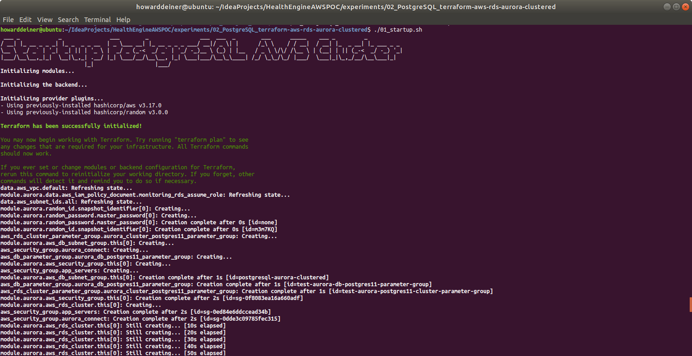
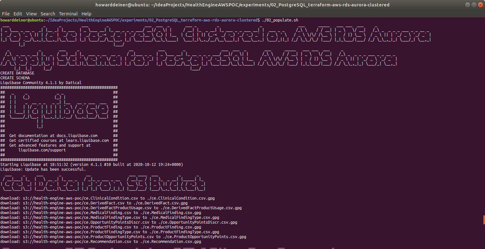
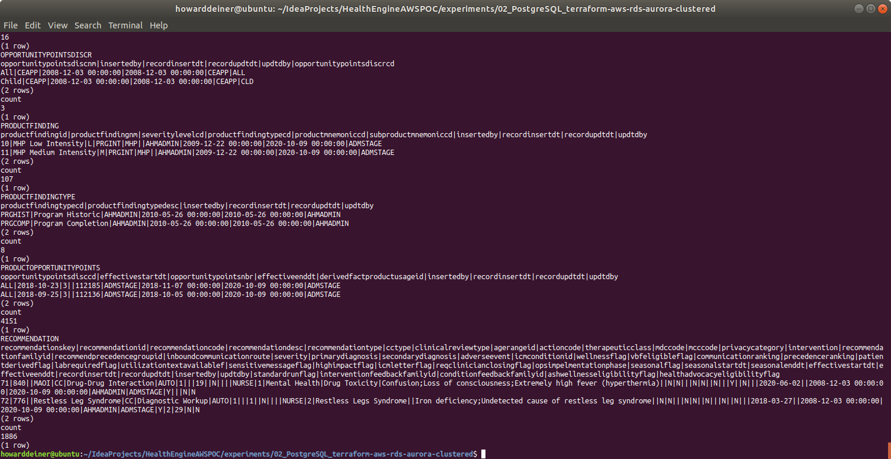

### Starting out with AWS RDS PostgreSQL Clusters

##### Concept

> Amazon Relational Database Service (or Amazon RDS) is a distributed relational database service by Amazon Web Services (AWS). It is a web service running "in the cloud" designed to simplify the setup, operation, and scaling of a relational database for use in applications. Administration processes like patching the database software, backing up databases and enabling point-in-time recovery are managed automatically. Scaling storage and compute resources can be performed by a single API call as AWS does not offer an ssh connection to RDS instances
> https://en.wikipedia.org/wiki/Amazon_Relational_Database_Service

> PostgreSQL has become the preferred open source relational database for many enterprise developers and start-ups, powering leading business and mobile applications. Amazon RDS makes it easy to set up, operate, and scale PostgreSQL deployments in the cloud. With Amazon RDS, you can deploy scalable PostgreSQL deployments in minutes with cost-efficient and resizable hardware capacity. Amazon RDS manages complex and time-consuming administrative tasks such as PostgreSQL software installation and upgrades; storage management; replication for high availability and read throughput; and backups for disaster recovery.
>
> Amazon RDS for PostgreSQL gives you access to the capabilities of the familiar PostgreSQL database engine. This means that the code, applications, and tools you already use today with your existing databases can be used with Amazon RDS. Amazon RDS supports PostgreSQL major version 12, which includes a number of enhancements to performance, robustness, transaction management, query parallelism, and more.
>
> https://aws.amazon.com/rds/postgresql/ (AWS propoganda)
>
#### Execution

### 01_startup.sh
This script uses simple Terraform and applies it.  You get 14 resources of ready to go database.  
```bash
#!/usr/bin/env bash

bash -c 'cat << "EOF" > .script
#!/usr/bin/env bash
figlet -w 200 -f small "Startup PostgresSQL Clustered on AWS RDS Aurora"
terraform init
terraform apply -auto-approve
EOF'
chmod +x .script
command time -v ./.script 2> .results
../../getExperimentalResults.sh
../../getDataAsCSVline.sh .results "Howard Deiner" "AWS Startup PostgresSQL (Client Side)" >> Experimental\ Results.csv
../../putExperimentalResults.sh
rm .script .results Experimental\ Results.csv

bash -c 'cat << "EOF" > .script
#!/usr/bin/env bash
figlet -w 240 -f small "Startup Postgres/pgadmin/cecacheserver Locally"
docker volume rm 01_postgres_local_postgres_data
docker volume rm 01_postgres_local_pgadmin_data
docker volume rm 01_postgres_local_cecacheserver_data
docker-compose -f ../01_Postgres_Local/docker-compose.yml up -d

figlet -w 240 -f small "Wait For Postgres To Start"
while true ; do
  docker logs postgres_container > stdout.txt 2> stderr.txt
  result=$(grep -c "LOG:  database system is ready to accept connections" stderr.txt)
  if [ $result = 1 ] ; then
    echo "Postgres has started"
    break
  fi
  sleep 5
done
rm stdout.txt stderr.txt
rm stdout.txt stderr.txt
EOF'
chmod +x .script
command time -v ./.script 2> .results
../../getExperimentalResults.sh
../../getDataAsCSVline.sh .results "Howard Deiner" "AWS Startup PostgresSQL Locally (Client Side)" >> Experimental\ Results.csv
../../putExperimentalResults.sh
rm .script .results Experimental\ Results.csv
```
The one script that does all of the heavy lifting is below.
```hcl-terraform
provider "aws" {
  region                  = "us-east-1"
  shared_credentials_file = "~/.aws/credentials"
}

#######################################
# Data sources to get VPC and subnets #
#######################################
data "aws_vpc" "default" {
  default = true
}

data "aws_subnet_ids" "all" {
  vpc_id = data.aws_vpc.default.id
}

##############
# RDS Aurora #
##############
module "aurora" {
  source  = "terraform-aws-modules/rds-aurora/aws"
  version = "~> 2.0"

  name                            = "aurora-example-postgresql"
  engine                          = "aurora-postgresql"
  engine_version                  = "11.6"
  username                        = "postgres"
  password                        = ""
  publicly_accessible             = true
  subnets                         = data.aws_subnet_ids.all.ids
  vpc_id                          = data.aws_vpc.default.id
  allowed_security_groups         = [aws_security_group.aurora_connect.id]
  allowed_cidr_blocks             = ["0.0.0.0/0"]
  replica_count                   = 2
  instance_type                   = "db.r4.large" #  2 vCPU	8 ECU 15.25 GiB Memory EBS Only	$0.133 per Hour
  instance_type_replica           = "db.t3.medium" # 2 vCPU	variable ECU 4 GiB Memory EBS Only	$0.0416 per Hour
  apply_immediately               = true
  skip_final_snapshot             = true
  db_parameter_group_name         = aws_db_parameter_group.aurora_db_postgres11_parameter_group.id
  db_cluster_parameter_group_name = aws_rds_cluster_parameter_group.aurora_cluster_postgres11_parameter_group.id
#  enabled_cloudwatch_logs_exports = ["audit", "error", "general", "slowquery"]
  security_group_description      = ""
  tags = {
    Terraform = "true"
    Environment = "dev"
  }
}

resource "aws_db_parameter_group" "aurora_db_postgres11_parameter_group" {
  name        = "test-aurora-db-postgres11-parameter-group"
  family      = "aurora-postgresql11"
  description = "test-aurora-db-postgres11-parameter-group"
}

resource "aws_rds_cluster_parameter_group" "aurora_cluster_postgres11_parameter_group" {
  name        = "test-aurora-postgres11-cluster-parameter-group"
  family      = "aurora-postgresql11"
  description = "test-aurora-postgres11-cluster-parameter-group"
}

#############################
# Example of security group #
#############################
resource "aws_security_group" "app_servers" {
  name_prefix = "app-servers-"
  description = "For application servers"
  vpc_id      = data.aws_vpc.default.id
  ingress {
    protocol  = "tcp"
    from_port = 5432
    to_port   = 5432
    cidr_blocks = [
      "0.0.0.0/0",
    ]
  }
  egress {
    from_port = 0
    to_port   = 0
    protocol  = "-1"
    cidr_blocks = [
      "0.0.0.0/0",
    ]
  }
}

resource "aws_security_group_rule" "allow_access" {
  type                     = "ingress"
  from_port                = module.aurora.this_rds_cluster_port
  to_port                  = module.aurora.this_rds_cluster_port
  protocol                 = "tcp"
  source_security_group_id = aws_security_group.app_servers.id
  security_group_id        = module.aurora.this_security_group_id
}

resource "aws_security_group" "aurora_connect" {
  name        = "Aurora Security Group"
  description = "Aurora Security Group"
  ingress {
    protocol  = "tcp"
    from_port = 5432
    to_port   = 5432
    cidr_blocks = [
      "0.0.0.0/0",
    ]
  }
  egress {
    from_port = 0
    to_port   = 0
    protocol  = "-1"
    cidr_blocks = [
      "0.0.0.0/0",
    ]
  }
  tags = {
    Name = "Aurora Security Group"
  }
}
```

This is what the console looks like when the script is executed.
\
\
\
\
<BR/>
If we were to peruse the AWS Console Database Dashboard, here's what we will see.
\
<BR/>
Looking deeper into the AWS Console Database Connectivity, we'd see this.
\
\
<BR/>
And, finally, looking deeper into the AWS Console Database Monitoring, we'd see this.
\
\
\
<BR/>
### 02_populate.sh
This script first uses the running AWS database and runs psql in the docker-composed local environment (so we don't have to install psql clients) to create a CE database for us.

The script then creates a liquibase.properties to run liquibase to update the database to it's intended state.

We then continue to run psql from the docker composed environment to lod data into the AWS database.

And finally, the script demonstrates that tables created have data in them (again, from the docker-composed local psql client).
```bash
#!/usr/bin/env bash

bash -c 'cat << "EOF" > .script
#!/usr/bin/env bash
figlet -w 240 -f small "AWS RDS Aurora Populate PostgreSQL (client side)"
echo `terraform output database_dns | grep -o '"'"'".*"'"'"' | cut -d '"'"'"'"'"' -f2` > .database_dns
echo `terraform output database_port | grep -Eo '"'"'[0-9]{1,}'"'"' | cut -d '"'"'"'"'"' -f2` > .database_port
echo `terraform output database_username | grep -o '"'"'".*"'"'"' | cut -d '"'"'"'"'"' -f2` > .database_username
echo `terraform output database_password | grep -o '"'"'".*"'"'"' | cut -d '"'"'"'"'"' -f2` > .database_password

docker exec postgres_container bash -c "export PGPASSWORD=$(<.database_password);psql --host=$(<.database_dns) --port=$(<.database_port) --username=$(<.database_username) --no-password --no-align -c '"'"'create database ce;'"'"'"
cp ../../src/java/Translator/changeSet.xml changeSet.xml
# fix <createTable tableName=" to become <createTable tableName="
sed --in-place --regexp-extended '"'"'s/<createTable\ tableName\=\"CE\./<createTable\ tableName\=\"/g'"'"' changeSet.xml
# fix to remove " schemaName="CE""
sed --in-place --regexp-extended '"'"'s/ schemaName\=\"\CE\">/>/g'"'"' changeSet.xml
# make schemaName="CE" in a line go away
sed --in-place --regexp-extended '"'"'s/schemaName\=\"CE\"//g'"'"' changeSet.xml
echo '"'"'changeLogFile: changeSet.xml'"'"' > liquibase.properties
echo '"'"'url:  jdbc:postgresql://'"'"'$(<.database_dns)'"'"':'"'"'$(<.database_port)'"'"'/ce'"'"' >> liquibase.properties
echo '"'"'username: '"'"'$(<.database_username) >> liquibase.properties
echo '"'"'password: '"'"'$(<.database_password) >> liquibase.properties
echo '"'"'driver:  org.postgresql.Driver'"'"' >> liquibase.properties
echo '"'"'classpath:  ../../liquibase_drivers/postgresql-42.2.18.jre6.jar'"'"' >> liquibase.properties

liquibase update
rm changeSet.xml liquibase.properties
EOF'
chmod +x .script
command time -v ./.script 2> .results
../../getExperimentalResults.sh
../../getDataAsCSVline.sh .results "Howard Deiner" "AWS RDS Aurora Create PostgreSQL Schema (client side)" >> Experimental\ Results.csv
../../putExperimentalResults.sh
rm .script .results Experimental\ Results.csv

bash -c 'cat << "EOF" > .script
#!/usr/bin/env bash
figlet -w 240 -f small "AWS RDS Aurora Get PostgreSQL Data from S3 (client side)"
../../data/transfer_from_s3_and_decrypt.sh ce.ClinicalCondition.csv
../../data/transfer_from_s3_and_decrypt.sh ce.DerivedFact.csv
../../data/transfer_from_s3_and_decrypt.sh ce.DerivedFactProductUsage.csv
../../data/transfer_from_s3_and_decrypt.sh ce.MedicalFinding.csv
../../data/transfer_from_s3_and_decrypt.sh ce.MedicalFindingType.csv
../../data/transfer_from_s3_and_decrypt.sh ce.OpportunityPointsDiscr.csv
../../data/transfer_from_s3_and_decrypt.sh ce.ProductFinding.csv
../../data/transfer_from_s3_and_decrypt.sh ce.ProductFindingType.csv
../../data/transfer_from_s3_and_decrypt.sh ce.ProductOpportunityPoints.csv
../../data/transfer_from_s3_and_decrypt.sh ce.Recommendation.csv
EOF'
chmod +x .script
command time -v ./.script 2> .results
../../getExperimentalResults.sh
../../getDataAsCSVline.sh .results "Howard Deiner" "AWS RDS Aurora Get PostgreSQL Data from S3 Bucket (client side)" >> Experimental\ Results.csv
../../putExperimentalResults.sh
rm .script .results Experimental\ Results.csv

bash -c 'cat << "EOF" > .script
#!/usr/bin/env bash
figlet -w 240 -f small "AWS RDS Aurora Process S3 Data PostgreSQL (client side)"
../transform_Oracle_ce.ClinicalCondition_to_csv.sh
../transform_Oracle_ce.DerivedFact_to_csv.sh
../transform_Oracle_ce.DerivedFactProductUsage_to_csv.sh
../transform_Oracle_ce.MedicalFinding_to_csv.sh
../transform_Oracle_ce.MedicalFindingType_to_csv.sh
../transform_Oracle_ce.OpportunityPointsDiscr_to_csv.sh
../transform_Oracle_ce.ProductFinding_to_csv.sh
../transform_Oracle_ce.ProductFindingType_to_csv.sh
../transform_Oracle_ce.ProductOpportunityPoints_to_csv.sh
../transform_Oracle_ce.Recommendation_to_csv.sh
EOF'
chmod +x .script
command time -v ./.script 2> .results
../../getExperimentalResults.sh
../../getDataAsCSVline.sh .results "Howard Deiner" "AWS RDS Aurora Process S3 Data PostgreSQL (client side)" >> Experimental\ Results.csv
../../putExperimentalResults.sh
rm .script .results Experimental\ Results.csv

bash -c 'cat << "EOF" > .script
#!/usr/bin/env bash
figlet -w 240 -f small "AWS RDS Aurora PostgreSQL Data Load (client side)"
echo "CLINICAL_CONDITION"
docker cp ce.ClinicalCondition.csv postgres_container:/tmp/ce.ClinicalCondition.csv
docker exec postgres_container bash -c "export PGPASSWORD=$(<.database_password);echo \"\COPY CLINICAL_CONDITION(CLINICAL_CONDITION_COD,CLINICAL_CONDITION_NAM,INSERTED_BY,REC_INSERT_DATE,REC_UPD_DATE,UPDATED_BY,CLINICALCONDITIONCLASSCD,CLINICALCONDITIONTYPECD,CLINICALCONDITIONABBREV) FROM '/tmp/ce.ClinicalCondition.csv' DELIMITER '"'"','"'"' CSV HEADER;\" | psql --host=$(<.database_dns) --port=$(<.database_port) --username=$(<.database_username) --no-password -d ce --no-align"
echo "DERIVEDFACT"
docker cp ce.DerivedFact.csv postgres_container:/tmp/ce.DerivedFact.csv
docker exec postgres_container bash -c "export PGPASSWORD=$(<.database_password);echo \"\COPY DERIVEDFACT(DERIVEDFACTID,DERIVEDFACTTRACKINGID,DERIVEDFACTTYPEID,INSERTEDBY,RECORDINSERTDT,RECORDUPDTDT,UPDTDBY) FROM '"'"'/tmp/ce.DerivedFact.csv'"'"' DELIMITER '"'"','"'"' CSV HEADER;\" | psql --host=$(<.database_dns) --port=$(<.database_port) --username=$(<.database_username) --no-password -d ce --no-align"
echo "DERIVEDFACTPRODUCTUSAGE"
docker cp ce.DerivedFactProductUsage.csv postgres_container:/tmp/ce.DerivedFactProductUsage.csv
docker exec postgres_container bash -c "export PGPASSWORD=$(<.database_password);echo \"\COPY DERIVEDFACTPRODUCTUSAGE(DERIVEDFACTPRODUCTUSAGEID,DERIVEDFACTID,PRODUCTMNEMONICCD,INSERTEDBY,RECORDINSERTDT,RECORDUPDTDT,UPDTDBY) FROM '"'"'/tmp/ce.DerivedFactProductUsage.csv'"'"' DELIMITER '"'"','"'"' CSV HEADER;\" | psql --host=$(<.database_dns) --port=$(<.database_port) --username=$(<.database_username) --no-password -d ce --no-align"
echo "MEDICALFINDING"
docker cp ce.MedicalFinding.csv postgres_container:/tmp/ce.MedicalFinding.csv
docker exec postgres_container bash -c "export PGPASSWORD=$(<.database_password);echo \"\COPY MEDICALFINDING(MEDICALFINDINGID,MEDICALFINDINGTYPECD,MEDICALFINDINGNM,SEVERITYLEVELCD,IMPACTABLEFLG,CLINICAL_CONDITION_COD,INSERTEDBY,RECORDINSERTDT,RECORDUPDTDT,UPDTDBY,ACTIVEFLG,OPPORTUNITYPOINTSDISCRCD) FROM '"'"'/tmp/ce.MedicalFinding.csv'"'"' DELIMITER '"'"','"'"' CSV HEADER;\" | psql --host=$(<.database_dns) --port=$(<.database_port) --username=$(<.database_username) --no-password -d ce --no-align"
echo "MEDICALFINDINGTYPE"
docker cp ce.MedicalFindingType.csv postgres_container:/tmp/ce.MedicalFindingType.csv
docker exec postgres_container bash -c "export PGPASSWORD=$(<.database_password);echo \"\COPY MEDICALFINDINGTYPE(MEDICALFINDINGTYPECD,MEDICALFINDINGTYPEDESC,INSERTEDBY,RECORDINSERTDT,RECORDUPDTDT,UPDTDBY,HEALTHSTATEAPPLICABLEFLAG) FROM '"'"'/tmp/ce.MedicalFindingType.csv'"'"' DELIMITER '"'"','"'"' CSV HEADER;\" | psql --host=$(<.database_dns) --port=$(<.database_port) --username=$(<.database_username) --no-password -d ce --no-align"
echo "OPPORTUNITYPOINTSDISCR"
docker cp ce.OpportunityPointsDiscr.csv postgres_container:/tmp/ce.OpportunityPointsDiscr.csv
docker exec postgres_container bash -c "export PGPASSWORD=$(<.database_password);echo \"\COPY OPPORTUNITYPOINTSDISCR(OPPORTUNITYPOINTSDISCRCD,OPPORTUNITYPOINTSDISCNM,INSERTEDBY,RECORDINSERTDT,RECORDUPDTDT,UPDTDBY) FROM '"'"'/tmp/ce.OpportunityPointsDiscr.csv'"'"' DELIMITER '"'"','"'"' CSV HEADER;\" | psql --host=$(<.database_dns) --port=$(<.database_port) --username=$(<.database_username) --no-password -d ce --no-align"
echo "PRODUCTFINDING"
docker cp ce.ProductFinding.csv postgres_container:/tmp/ce.ProductFinding.csv
docker exec postgres_container bash -c "export PGPASSWORD=$(<.database_password);echo \"\COPY PRODUCTFINDING(PRODUCTFINDINGID,PRODUCTFINDINGNM,SEVERITYLEVELCD,PRODUCTFINDINGTYPECD,PRODUCTMNEMONICCD,SUBPRODUCTMNEMONICCD,INSERTEDBY,RECORDINSERTDT,RECORDUPDTDT,UPDTDBY) FROM '"'"'/tmp/ce.ProductFinding.csv'"'"' DELIMITER '"'"','"'"' CSV HEADER;\" | psql --host=$(<.database_dns) --port=$(<.database_port) --username=$(<.database_username) --no-password -d ce --no-align"
echo "PRODUCTFINDINGTYPE"
docker cp ce.ProductFindingType.csv postgres_container:/tmp/ce.ProductFindingType.csv
docker exec postgres_container bash -c "export PGPASSWORD=$(<.database_password);echo \"\COPY PRODUCTFINDINGTYPE(PRODUCTFINDINGTYPECD,PRODUCTFINDINGTYPEDESC,INSERTEDBY,RECORDINSERTDT,RECORDUPDTDT,UPDTDBY) FROM '"'"'/tmp/ce.ProductFindingType.csv'"'"' DELIMITER '"'"','"'"' CSV HEADER;\" | psql --host=$(<.database_dns) --port=$(<.database_port) --username=$(<.database_username) --no-password -d ce --no-align"
echo "PRODUCTOPPORTUNITYPOINTS"
docker cp ce.ProductOpportunityPoints.csv postgres_container:/tmp/ce.ProductOpportunityPoints.csv
docker exec postgres_container bash -c "export PGPASSWORD=$(<.database_password);echo \"\COPY PRODUCTOPPORTUNITYPOINTS(OPPORTUNITYPOINTSDISCCD,EFFECTIVESTARTDT,OPPORTUNITYPOINTSNBR,EFFECTIVEENDDT,DERIVEDFACTPRODUCTUSAGEID,INSERTEDBY,RECORDINSERTDT,RECORDUPDTDT,UPDTDBY) FROM '"'"'/tmp/ce.ProductOpportunityPoints.csv'"'"' DELIMITER '"'"','"'"' CSV HEADER;\" | psql --host=$(<.database_dns) --port=$(<.database_port) --username=$(<.database_username) --no-password -d ce --no-align"
echo "RECOMMENDATION"
docker cp ce.Recommendation.csv postgres_container:/tmp/ce.Recommendation.csv
docker exec postgres_container bash -c "export PGPASSWORD=$(<.database_password);echo \"\COPY RECOMMENDATION(RECOMMENDATIONSKEY,RECOMMENDATIONID,RECOMMENDATIONCODE,RECOMMENDATIONDESC,RECOMMENDATIONTYPE,CCTYPE,CLINICALREVIEWTYPE,AGERANGEID,ACTIONCODE,THERAPEUTICCLASS,MDCCODE,MCCCODE,PRIVACYCATEGORY,INTERVENTION,RECOMMENDATIONFAMILYID,RECOMMENDPRECEDENCEGROUPID,INBOUNDCOMMUNICATIONROUTE,SEVERITY,PRIMARYDIAGNOSIS,SECONDARYDIAGNOSIS,ADVERSEEVENT,ICMCONDITIONID,WELLNESSFLAG,VBFELIGIBLEFLAG,COMMUNICATIONRANKING,PRECEDENCERANKING,PATIENTDERIVEDFLAG,LABREQUIREDFLAG,UTILIZATIONTEXTAVAILABLEF,SENSITIVEMESSAGEFLAG,HIGHIMPACTFLAG,ICMLETTERFLAG,REQCLINICIANCLOSINGFLAG,OPSIMPELMENTATIONPHASE,SEASONALFLAG,SEASONALSTARTDT,SEASONALENDDT,EFFECTIVESTARTDT,EFFECTIVEENDDT,RECORDINSERTDT,RECORDUPDTDT,INSERTEDBY,UPDTDBY,STANDARDRUNFLAG,INTERVENTIONFEEDBACKFAMILYID,CONDITIONFEEDBACKFAMILYID,ASHWELLNESSELIGIBILITYFLAG,HEALTHADVOCACYELIGIBILITYFLAG) FROM '"'"'/tmp/ce.Recommendation.csv'"'"' DELIMITER '"'"','"'"' CSV HEADER;\" | psql --host=$(<.database_dns) --port=$(<.database_port) --username=$(<.database_username) --no-password -d ce --no-align"
EOF'
chmod +x .script
command time -v ./.script 2> .results
../../getExperimentalResults.sh
../../getDataAsCSVline.sh .results "Howard Deiner" "AWS RDS Aurora PostgreSQL Data Load (client side)" >> Experimental\ Results.csv
../../putExperimentalResults.sh
rm .script .results Experimental\ Results.csv

bash -c 'cat << "EOF" > .script
#!/usr/bin/env bash
figlet -w 240 -f small "AWS RDS Aurora Check PostgreSQL Data (client side)"
echo "CLINICAL_CONDITION"
docker exec postgres_container bash -c "export PGPASSWORD=$(<.database_password);psql --host=$(<.database_dns) --port=$(<.database_port) --username=$(<.database_username) --no-password -d ce --no-align -c '"'"'select * from CLINICAL_CONDITION limit 2;'"'"'"
docker exec postgres_container bash -c "export PGPASSWORD=$(<.database_password);psql --host=$(<.database_dns) --port=$(<.database_port) --username=$(<.database_username) --no-password -d ce --no-align -c '"'"'select count(*) from CLINICAL_CONDITION;'"'"'"
echo "DERIVEDFACT"
docker exec postgres_container bash -c "export PGPASSWORD=$(<.database_password);psql --host=$(<.database_dns) --port=$(<.database_port) --username=$(<.database_username) --no-password -d ce --no-align -c '"'"'select * from DERIVEDFACT limit 2;'"'"'"
docker exec postgres_container bash -c "export PGPASSWORD=$(<.database_password);psql --host=$(<.database_dns) --port=$(<.database_port) --username=$(<.database_username) --no-password -d ce --no-align -c '"'"'select count(*) from DERIVEDFACT;'"'"'"
echo "DERIVEDFACTPRODUCTUSAGE"
docker exec postgres_container bash -c "export PGPASSWORD=$(<.database_password);psql --host=$(<.database_dns) --port=$(<.database_port) --username=$(<.database_username) --no-password -d ce --no-align -c '"'"'select * from DERIVEDFACTPRODUCTUSAGE limit 2;'"'"'"
docker exec postgres_container bash -c "export PGPASSWORD=$(<.database_password);psql --host=$(<.database_dns) --port=$(<.database_port) --username=$(<.database_username) --no-password -d ce --no-align -c '"'"'select count(*) from DERIVEDFACTPRODUCTUSAGE;'"'"'"
echo "MEDICALFINDING"
docker exec postgres_container bash -c "export PGPASSWORD=$(<.database_password);psql --host=$(<.database_dns) --port=$(<.database_port) --username=$(<.database_username) --no-password -d ce --no-align -c '"'"'select * from MEDICALFINDING limit 2;'"'"'"
docker exec postgres_container bash -c "export PGPASSWORD=$(<.database_password);psql --host=$(<.database_dns) --port=$(<.database_port) --username=$(<.database_username) --no-password -d ce --no-align -c '"'"'select count(*) from MEDICALFINDING;'"'"'"
echo "MEDICALFINDINGTYPE"
docker exec postgres_container bash -c "export PGPASSWORD=$(<.database_password);psql --host=$(<.database_dns) --port=$(<.database_port) --username=$(<.database_username) --no-password -d ce --no-align -c '"'"'select * from MEDICALFINDINGTYPE limit 2;'"'"'"
docker exec postgres_container bash -c "export PGPASSWORD=$(<.database_password);psql --host=$(<.database_dns) --port=$(<.database_port) --username=$(<.database_username) --no-password -d ce --no-align -c '"'"'select count(*) from MEDICALFINDINGTYPE;'"'"'"
echo "OPPORTUNITYPOINTSDISCR"
docker exec postgres_container bash -c "export PGPASSWORD=$(<.database_password);psql --host=$(<.database_dns) --port=$(<.database_port) --username=$(<.database_username) --no-password -d ce --no-align -c '"'"'select * from OPPORTUNITYPOINTSDISCR limit 2;'"'"'"
docker exec postgres_container bash -c "export PGPASSWORD=$(<.database_password);psql --host=$(<.database_dns) --port=$(<.database_port) --username=$(<.database_username) --no-password -d ce --no-align -c '"'"'select count(*) from OPPORTUNITYPOINTSDISCR;'"'"'"
echo "PRODUCTFINDING"
docker exec postgres_container bash -c "export PGPASSWORD=$(<.database_password);psql --host=$(<.database_dns) --port=$(<.database_port) --username=$(<.database_username) --no-password -d ce --no-align -c '"'"'select * from PRODUCTFINDING limit 2;'"'"'"
docker exec postgres_container bash -c "export PGPASSWORD=$(<.database_password);psql --host=$(<.database_dns) --port=$(<.database_port) --username=$(<.database_username) --no-password -d ce --no-align -c '"'"'select count(*) from PRODUCTFINDING;'"'"'"
echo "PRODUCTFINDINGTYPE"
docker exec postgres_container bash -c "export PGPASSWORD=$(<.database_password);psql --host=$(<.database_dns) --port=$(<.database_port) --username=$(<.database_username) --no-password -d ce --no-align -c '"'"'select * from PRODUCTFINDINGTYPE limit 2;'"'"'"
docker exec postgres_container bash -c "export PGPASSWORD=$(<.database_password);psql --host=$(<.database_dns) --port=$(<.database_port) --username=$(<.database_username) --no-password -d ce --no-align -c '"'"'select count(*) from PRODUCTFINDINGTYPE;'"'"'"
echo "PRODUCTOPPORTUNITYPOINTS"
docker exec postgres_container bash -c "export PGPASSWORD=$(<.database_password);psql --host=$(<.database_dns) --port=$(<.database_port) --username=$(<.database_username) --no-password -d ce --no-align -c '"'"'select * from PRODUCTOPPORTUNITYPOINTS limit 2;'"'"'"
docker exec postgres_container bash -c "export PGPASSWORD=$(<.database_password);psql --host=$(<.database_dns) --port=$(<.database_port) --username=$(<.database_username) --no-password -d ce --no-align -c '"'"'select count(*) from PRODUCTOPPORTUNITYPOINTS;'"'"'"
echo "RECOMMENDATION"
docker exec postgres_container bash -c "export PGPASSWORD=$(<.database_password);psql --host=$(<.database_dns) --port=$(<.database_port) --username=$(<.database_username) --no-password -d ce --no-align -c '"'"'select * from RECOMMENDATION limit 2;'"'"'"
docker exec postgres_container bash -c "export PGPASSWORD=$(<.database_password);psql --host=$(<.database_dns) --port=$(<.database_port) --username=$(<.database_username) --no-password -d ce --no-align -c '"'"'select count(*) from RECOMMENDATION;'"'"'"
EOF'
chmod +x .script
command time -v ./.script 2> .results
../../getExperimentalResults.sh
../../getDataAsCSVline.sh .results "Howard Deiner" "AWS RDS Aurora Check PostgreSQL Data (client side)" >> Experimental\ Results.csv
../../putExperimentalResults.sh
rm .script .results *.csv .database_dns .database_password .database_port .database_username
```
This is what the console looks like when the script is executed.
\
\
\
\
<BR/>
### 03_shutdown.sh
This script is extremely simple.  It tells terraform to destroy all that it created.

```bash
#!/usr/bin/env bash

bash -c 'cat << "EOF" > .script
#!/usr/bin/env bash
figlet -w 200 -f small "Shutdown PostgresSQL Clustered on AWS RDS Aurora"
terraform destroy -auto-approve
EOF'
chmod +x .script
command time -v ./.script 2> .results
../../getExperimentalResults.sh
../../getDataAsCSVline.sh .results "Howard Deiner" "AWS Shutdown PostgresSQL (Client Side)" >> Experimental\ Results.csv
../../putExperimentalResults.sh
rm .script .results Experimental\ Results.csv

bash -c 'cat << "EOF" > .script
#!/usr/bin/env bash
figlet -w 240 -f small "Shutdown Postgres/pgadmin/cecacheserver Locally"
docker-compose -f ../01_Postgres_Local/docker-compose.yml down
docker volume rm 01_postgres_local_postgres_data
docker volume rm 01_postgres_local_pgadmin_data
docker volume rm 01_postgres_local_cecacheserver_data
EOF'
chmod +x .script
command time -v ./.script 2> .results
../../getExperimentalResults.sh
../../getDataAsCSVline.sh .results "Howard Deiner" "AWS Shutdown PostSQL Locally (Client Side)" >> Experimental\ Results.csv
../../putExperimentalResults.sh
rm .script .results Experimental\ Results.csv
```
The console shows what it does.
\
\
<BR/>
And just for laughs, here's the timings for this run.  All kept in a csv file in S3 at s3://health-engine-aws-poc/Experimental Results.csv
\
<BR />