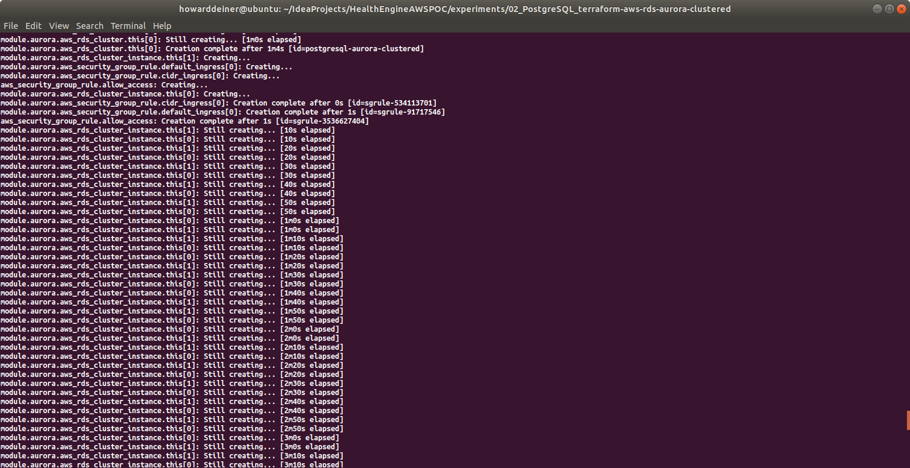
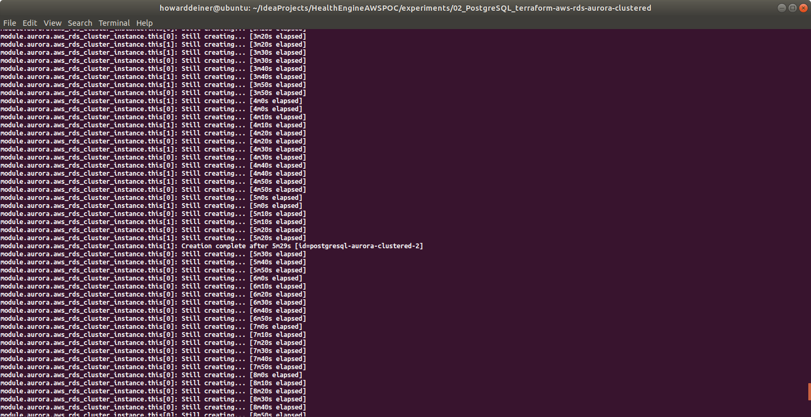
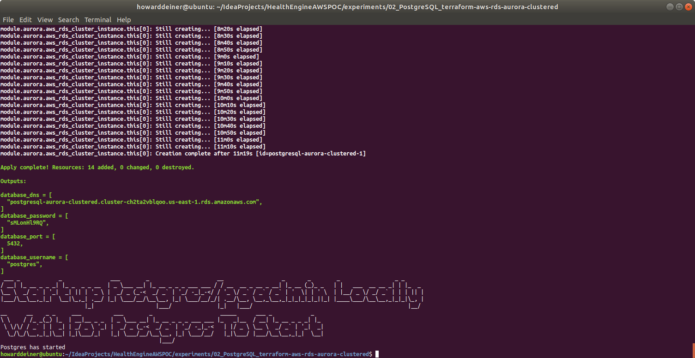
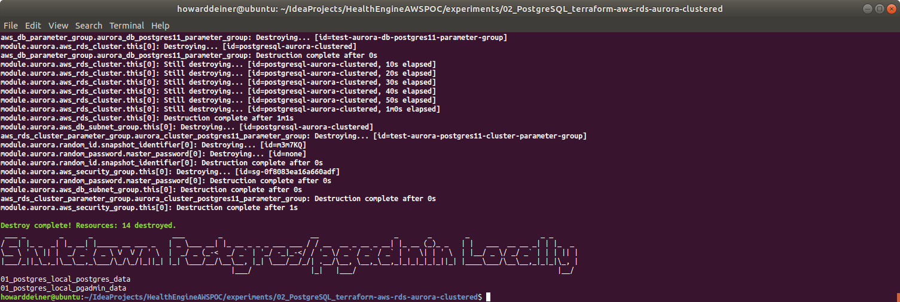

### Starting out with AWS RDS PostgreSQL Clusters

##### Concept

> Amazon Relational Database Service (or Amazon RDS) is a distributed relational database service by Amazon Web Services (AWS). It is a web service running "in the cloud" designed to simplify the setup, operation, and scaling of a relational database for use in applications. Administration processes like patching the database software, backing up databases and enabling point-in-time recovery are managed automatically. Scaling storage and compute resources can be performed by a single API call as AWS does not offer an ssh connection to RDS instances
> https://en.wikipedia.org/wiki/Amazon_Relational_Database_Service

> PostgreSQL has become the preferred open source relational database for many enterprise developers and start-ups, powering leading business and mobile applications. Amazon RDS makes it easy to set up, operate, and scale PostgreSQL deployments in the cloud. With Amazon RDS, you can deploy scalable PostgreSQL deployments in minutes with cost-efficient and resizable hardware capacity. Amazon RDS manages complex and time-consuming administrative tasks such as PostgreSQL software installation and upgrades; storage management; replication for high availability and read throughput; and backups for disaster recovery.
>
> Amazon RDS for PostgreSQL gives you access to the capabilities of the familiar PostgreSQL database engine. This means that the code, applications, and tools you already use today with your existing databases can be used with Amazon RDS. Amazon RDS supports PostgreSQL major version 12, which includes a number of enhancements to performance, robustness, transaction management, query parallelism, and more.
>
> https://aws.amazon.com/rds/postgresql/ (AWS propoganda)
>
#### Execution

### 01_startup.sh
This script uses simple Terraform and applies it.  You get 14 resources of ready to go database.  
```bash
#!/usr/bin/env bash

../../startExperiment.sh

bash -c 'cat << "EOF" > .script
#!/usr/bin/env bash
figlet -w 200 -f small "Startup PostgreSQL AWS Cluster"
terraform init
terraform apply -auto-approve
EOF'
chmod +x .script
command time -v ./.script 2> .results
../../getExperimentalResults.sh
experiment=$(../../getExperimentNumber.sh)
../../getDataAsCSVline.sh .results ${experiment} "02_PostgreSQL_AWS_Clustered: Startup PostgreSQL AWS Cluster" >> Experimental\ Results.csv
../../putExperimentalResults.sh
rm .script .results Experimental\ Results.csv

bash -c 'cat << "EOF" > .script
#!/usr/bin/env bash
figlet -w 240 -f small "Startup Postgres/pgadmin Locally"
docker volume rm 01_postgres_local_postgres_data
docker volume rm 01_postgres_local_pgadmin_data
docker-compose -f ../01_Postgres_Local/docker-compose.yml up -d

figlet -w 240 -f small "Wait For Postgres To Start"
while true ; do
  docker logs postgres_container > stdout.txt 2> stderr.txt
  result=$(grep -c "LOG:  database system is ready to accept connections" stderr.txt)
  if [ $result = 1 ] ; then
    echo "Postgres has started"
    break
  fi
  sleep 5
done
rm stdout.txt stderr.txt
rm stdout.txt stderr.txt
EOF'
chmod +x .script
command time -v ./.script 2> .results
../../getExperimentalResults.sh
experiment=$(../../getExperimentNumber.sh)
../../getDataAsCSVline.sh .results ${experiment} "02_PostgreSQL_AWS_Clustered: Startup Postgres Locally" >> Experimental\ Results.csv
../../putExperimentalResults.sh
rm .script .results Experimental\ Results.csv
```
The one script that does all of the heavy lifting is below.
```hcl-terraform
provider "aws" {
  region                  = "us-east-1"
  shared_credentials_file = "~/.aws/credentials"
}

#######################################
# Data sources to get VPC and subnets #
#######################################
data "aws_vpc" "default" {
  default = true
}

data "aws_subnet_ids" "all" {
  vpc_id = data.aws_vpc.default.id
}

##############
# RDS Aurora #
##############
module "aurora" {
  source  = "terraform-aws-modules/rds-aurora/aws"
  version = "~> 2.0"

  name                            = "postgresql-aurora-clustered"
  engine                          = "aurora-postgresql"
  engine_version                  = "11.6"
  username                        = "postgres"
  password                        = ""
  publicly_accessible             = true
  subnets                         = data.aws_subnet_ids.all.ids
  vpc_id                          = data.aws_vpc.default.id
  allowed_security_groups         = [aws_security_group.aurora_connect.id]
  allowed_cidr_blocks             = ["0.0.0.0/0"]
  replica_count                   = 2
  instance_type                   = "db.r4.large" #  2 vCPU	8 ECU 15.25 GiB Memory EBS Only	$0.133 per Hour
  instance_type_replica           = "db.t3.medium" # 2 vCPU	variable ECU 4 GiB Memory EBS Only	$0.0416 per Hour
  apply_immediately               = true
  skip_final_snapshot             = true
  db_parameter_group_name         = aws_db_parameter_group.aurora_db_postgres11_parameter_group.id
  db_cluster_parameter_group_name = aws_rds_cluster_parameter_group.aurora_cluster_postgres11_parameter_group.id
  #  enabled_cloudwatch_logs_exports = ["audit", "error", "general", "slowquery"]
  security_group_description      = ""
  tags = {
    Terraform = "true"
    Environment = "dev"
  }
}

resource "aws_db_parameter_group" "aurora_db_postgres11_parameter_group" {
  name        = "test-aurora-db-postgres11-parameter-group"
  family      = "aurora-postgresql11"
  description = "test-aurora-db-postgres11-parameter-group"
}

resource "aws_rds_cluster_parameter_group" "aurora_cluster_postgres11_parameter_group" {
  name        = "test-aurora-postgres11-cluster-parameter-group"
  family      = "aurora-postgresql11"
  description = "test-aurora-postgres11-cluster-parameter-group"
}

#############################
# Example of security group #
#############################
resource "aws_security_group" "app_servers" {
  name_prefix = "app-servers-"
  description = "For application servers"
  vpc_id      = data.aws_vpc.default.id
  ingress {
    protocol  = "tcp"
    from_port = 5432
    to_port   = 5432
    cidr_blocks = [
      "0.0.0.0/0",
    ]
  }
  egress {
    from_port = 0
    to_port   = 0
    protocol  = "-1"
    cidr_blocks = [
      "0.0.0.0/0",
    ]
  }
}

resource "aws_security_group_rule" "allow_access" {
  type                     = "ingress"
  from_port                = module.aurora.this_rds_cluster_port
  to_port                  = module.aurora.this_rds_cluster_port
  protocol                 = "tcp"
  source_security_group_id = aws_security_group.app_servers.id
  security_group_id        = module.aurora.this_security_group_id
}

resource "aws_security_group" "aurora_connect" {
  name        = "Aurora Security Group"
  description = "Aurora Security Group"
  ingress {
    protocol  = "tcp"
    from_port = 5432
    to_port   = 5432
    cidr_blocks = [
      "0.0.0.0/0",
    ]
  }
  egress {
    from_port = 0
    to_port   = 0
    protocol  = "-1"
    cidr_blocks = [
      "0.0.0.0/0",
    ]
  }
  tags = {
    Name = "Aurora Security Group"
  }
}
```

This is what the console looks like when the script is executed.
\
\
\
\
<BR/>
If we were to peruse the AWS Console Database Dashboard, here's what we will see.
\
<BR/>
Looking deeper into the AWS Console Database Connectivity, we'd see this.
\
\
<BR/>
And, finally, looking deeper into the AWS Console Database Monitoring, we'd see this.
\
\
\
<BR/>
### 02_populate.sh
This script first uses the running AWS database and runs psql in the docker-composed local environment (so we don't have to install psql clients) to create a CE database for us.

The script then creates a liquibase.properties to run liquibase to update the database to it's intended state.

We then continue to run psql from the docker composed environment to lod data into the AWS database.

And finally, the script demonstrates that tables created have data in them (again, from the docker-composed local psql client).
```bash
#!/usr/bin/env bash

bash -c 'cat << "EOF" > .script
#!/usr/bin/env bash
figlet -w 240 -f small "Populate PostgreSQL Clustered on AWS RDS Aurora"
echo `terraform output database_dns | grep -o '"'"'".*"'"'"' | cut -d '"'"'"'"'"' -f2` > .database_dns
echo `terraform output database_port | grep -Eo '"'"'[0-9]{1,}'"'"' | cut -d '"'"'"'"'"' -f2` > .database_port
echo `terraform output database_username | grep -o '"'"'".*"'"'"' | cut -d '"'"'"'"'"' -f2` > .database_username
echo `terraform output database_password | grep -o '"'"'".*"'"'"' | cut -d '"'"'"'"'"' -f2` > .database_password

cp .database_dns .database_name
sed --in-place --regexp-extended '"'"'s/\..*//g'"'"' .database_name

figlet -w 240 -f small "Apply Schema for PostgreSQL AWS RDS Aurora"
docker exec postgres_container bash -c "export PGPASSWORD=$(<.database_password);psql --host=$(<.database_dns) --port=$(<.database_port) --username=$(<.database_username) --no-password --no-align -c '"'"'create database ce;'"'"'"
docker exec postgres_container bash -c "export PGPASSWORD=$(<.database_password);psql --host=$(<.database_dns) --port=$(<.database_port) --username=$(<.database_username) --no-password --no-align -d ce -c '"'"'create schema CE;'"'"'"

echo '"'"'changeLogFile: ../../src/application/TranslatedChangeSet/Postgres/changeset.xml'"'"' > liquibase.properties
echo '"'"'url:  jdbc:postgresql://'"'"'$(<.database_dns)'"'"':'"'"'$(<.database_port)'"'"'/ce'"'"' >> liquibase.properties
echo '"'"'username: '"'"'$(<.database_username) >> liquibase.properties
echo '"'"'password: '"'"'$(<.database_password) >> liquibase.properties
echo '"'"'driver:  org.postgresql.Driver'"'"' >> liquibase.properties
echo '"'"'classpath:  ../../liquibase_drivers/postgresql-42.2.18.jre6.jar'"'"' >> liquibase.properties

liquibase update
EOF'
chmod +x .script
command time -v ./.script 2> .results
../../getExperimentalResults.sh
experiment=$(../../getExperimentNumber.sh)
../../getDataAsCSVline.sh .results ${experiment} "02_PostgreSQL_AWS_Clustered: Populate PostgreSQL Schema "$(<.database_name) >> Experimental\ Results.csv
../../putExperimentalResults.sh
rm .script .results Experimental\ Results.csv liquibase.properties

bash -c 'cat << "EOF" > .script
#!/usr/bin/env bash
figlet -w 240 -f small "Get Data from S3 Bucket"
../../data/transfer_from_s3_and_decrypt.sh ce.ClinicalCondition.csv
../../data/transfer_from_s3_and_decrypt.sh ce.DerivedFact.csv
../../data/transfer_from_s3_and_decrypt.sh ce.DerivedFactProductUsage.csv
../../data/transfer_from_s3_and_decrypt.sh ce.MedicalFinding.csv
../../data/transfer_from_s3_and_decrypt.sh ce.MedicalFindingType.csv
../../data/transfer_from_s3_and_decrypt.sh ce.OpportunityPointsDiscr.csv
../../data/transfer_from_s3_and_decrypt.sh ce.ProductFinding.csv
../../data/transfer_from_s3_and_decrypt.sh ce.ProductFindingType.csv
../../data/transfer_from_s3_and_decrypt.sh ce.ProductOpportunityPoints.csv
../../data/transfer_from_s3_and_decrypt.sh ce.Recommendation.csv
EOF'
chmod +x .script
command time -v ./.script 2> .results
../../getExperimentalResults.sh
experiment=$(../../getExperimentNumber.sh)
../../getDataAsCSVline.sh .results ${experiment} "02_PostgreSQL_AWS_Clustered: Get Data from S3 Bucket "$(<.database_name) >> Experimental\ Results.csv
../../putExperimentalResults.sh
rm .script .results Experimental\ Results.csv

bash -c 'cat << "EOF" > .script
#!/usr/bin/env bash
figlet -w 240 -f small "Process S3 Data into CSV Files For Import"
../transform_Oracle_ce.ClinicalCondition_to_csv.sh
../transform_Oracle_ce.DerivedFact_to_csv.sh
../transform_Oracle_ce.DerivedFactProductUsage_to_csv.sh
../transform_Oracle_ce.MedicalFinding_to_csv.sh
../transform_Oracle_ce.MedicalFindingType_to_csv.sh
../transform_Oracle_ce.OpportunityPointsDiscr_to_csv.sh
../transform_Oracle_ce.ProductFinding_to_csv.sh
../transform_Oracle_ce.ProductFindingType_to_csv.sh
../transform_Oracle_ce.ProductOpportunityPoints_to_csv.sh
../transform_Oracle_ce.Recommendation_to_csv.sh
EOF'
chmod +x .script
command time -v ./.script 2> .results
../../getExperimentalResults.sh
experiment=$(../../getExperimentNumber.sh)
../../getDataAsCSVline.sh .results ${experiment} "02_PostgreSQL_AWS_Clustered: Process S3 Data into CSV Files For Import "$(<.database_name) >> Experimental\ Results.csv
../../putExperimentalResults.sh
rm .script .results Experimental\ Results.csv

bash -c 'cat << "EOF" > .script
#!/usr/bin/env bash
figlet -w 240 -f small "Populate PostgreSQL Data"
echo "CLINICAL_CONDITION"
docker cp ce.ClinicalCondition.csv postgres_container:/tmp/ce.ClinicalCondition.csv
docker exec postgres_container bash -c "export PGPASSWORD=$(<.database_password);echo \"\COPY CE.CLINICAL_CONDITION(CLINICAL_CONDITION_COD,CLINICAL_CONDITION_NAM,INSERTED_BY,REC_INSERT_DATE,REC_UPD_DATE,UPDATED_BY,CLINICALCONDITIONCLASSCD,CLINICALCONDITIONTYPECD,CLINICALCONDITIONABBREV) FROM '/tmp/ce.ClinicalCondition.csv' DELIMITER '"'"','"'"' CSV HEADER;\" | psql --host=$(<.database_dns) --port=$(<.database_port) --username=$(<.database_username) --no-password -d ce --no-align"
echo "DERIVEDFACT"
docker cp ce.DerivedFact.csv postgres_container:/tmp/ce.DerivedFact.csv
docker exec postgres_container bash -c "export PGPASSWORD=$(<.database_password);echo \"\COPY CE.DERIVEDFACT(DERIVEDFACTID,DERIVEDFACTTRACKINGID,DERIVEDFACTTYPEID,INSERTEDBY,RECORDINSERTDT,RECORDUPDTDT,UPDTDBY) FROM '"'"'/tmp/ce.DerivedFact.csv'"'"' DELIMITER '"'"','"'"' CSV HEADER;\" | psql --host=$(<.database_dns) --port=$(<.database_port) --username=$(<.database_username) --no-password -d ce --no-align"
echo "DERIVEDFACTPRODUCTUSAGE"
docker cp ce.DerivedFactProductUsage.csv postgres_container:/tmp/ce.DerivedFactProductUsage.csv
docker exec postgres_container bash -c "export PGPASSWORD=$(<.database_password);echo \"\COPY CE.DERIVEDFACTPRODUCTUSAGE(DERIVEDFACTPRODUCTUSAGEID,DERIVEDFACTID,PRODUCTMNEMONICCD,INSERTEDBY,RECORDINSERTDT,RECORDUPDTDT,UPDTDBY) FROM '"'"'/tmp/ce.DerivedFactProductUsage.csv'"'"' DELIMITER '"'"','"'"' CSV HEADER;\" | psql --host=$(<.database_dns) --port=$(<.database_port) --username=$(<.database_username) --no-password -d ce --no-align"
echo "MEDICALFINDING"
docker cp ce.MedicalFinding.csv postgres_container:/tmp/ce.MedicalFinding.csv
docker exec postgres_container bash -c "export PGPASSWORD=$(<.database_password);echo \"\COPY CE.MEDICALFINDING(MEDICALFINDINGID,MEDICALFINDINGTYPECD,MEDICALFINDINGNM,SEVERITYLEVELCD,IMPACTABLEFLG,CLINICAL_CONDITION_COD,INSERTEDBY,RECORDINSERTDT,RECORDUPDTDT,UPDTDBY,ACTIVEFLG,OPPORTUNITYPOINTSDISCRCD) FROM '"'"'/tmp/ce.MedicalFinding.csv'"'"' DELIMITER '"'"','"'"' CSV HEADER;\" | psql --host=$(<.database_dns) --port=$(<.database_port) --username=$(<.database_username) --no-password -d ce --no-align"
echo "MEDICALFINDINGTYPE"
docker cp ce.MedicalFindingType.csv postgres_container:/tmp/ce.MedicalFindingType.csv
docker exec postgres_container bash -c "export PGPASSWORD=$(<.database_password);echo \"\COPY CE.MEDICALFINDINGTYPE(MEDICALFINDINGTYPECD,MEDICALFINDINGTYPEDESC,INSERTEDBY,RECORDINSERTDT,RECORDUPDTDT,UPDTDBY,HEALTHSTATEAPPLICABLEFLAG) FROM '"'"'/tmp/ce.MedicalFindingType.csv'"'"' DELIMITER '"'"','"'"' CSV HEADER;\" | psql --host=$(<.database_dns) --port=$(<.database_port) --username=$(<.database_username) --no-password -d ce --no-align"
echo "OPPORTUNITYPOINTSDISCR"
docker cp ce.OpportunityPointsDiscr.csv postgres_container:/tmp/ce.OpportunityPointsDiscr.csv
docker exec postgres_container bash -c "export PGPASSWORD=$(<.database_password);echo \"\COPY CE.OPPORTUNITYPOINTSDISCR(OPPORTUNITYPOINTSDISCRCD,OPPORTUNITYPOINTSDISCNM,INSERTEDBY,RECORDINSERTDT,RECORDUPDTDT,UPDTDBY) FROM '"'"'/tmp/ce.OpportunityPointsDiscr.csv'"'"' DELIMITER '"'"','"'"' CSV HEADER;\" | psql --host=$(<.database_dns) --port=$(<.database_port) --username=$(<.database_username) --no-password -d ce --no-align"
echo "PRODUCTFINDING"
docker cp ce.ProductFinding.csv postgres_container:/tmp/ce.ProductFinding.csv
docker exec postgres_container bash -c "export PGPASSWORD=$(<.database_password);echo \"\COPY CE.PRODUCTFINDING(PRODUCTFINDINGID,PRODUCTFINDINGNM,SEVERITYLEVELCD,PRODUCTFINDINGTYPECD,PRODUCTMNEMONICCD,SUBPRODUCTMNEMONICCD,INSERTEDBY,RECORDINSERTDT,RECORDUPDTDT,UPDTDBY) FROM '"'"'/tmp/ce.ProductFinding.csv'"'"' DELIMITER '"'"','"'"' CSV HEADER;\" | psql --host=$(<.database_dns) --port=$(<.database_port) --username=$(<.database_username) --no-password -d ce --no-align"
echo "PRODUCTFINDINGTYPE"
docker cp ce.ProductFindingType.csv postgres_container:/tmp/ce.ProductFindingType.csv
docker exec postgres_container bash -c "export PGPASSWORD=$(<.database_password);echo \"\COPY CE.PRODUCTFINDINGTYPE(PRODUCTFINDINGTYPECD,PRODUCTFINDINGTYPEDESC,INSERTEDBY,RECORDINSERTDT,RECORDUPDTDT,UPDTDBY) FROM '"'"'/tmp/ce.ProductFindingType.csv'"'"' DELIMITER '"'"','"'"' CSV HEADER;\" | psql --host=$(<.database_dns) --port=$(<.database_port) --username=$(<.database_username) --no-password -d ce --no-align"
echo "PRODUCTOPPORTUNITYPOINTS"
docker cp ce.ProductOpportunityPoints.csv postgres_container:/tmp/ce.ProductOpportunityPoints.csv
docker exec postgres_container bash -c "export PGPASSWORD=$(<.database_password);echo \"\COPY CE.PRODUCTOPPORTUNITYPOINTS(OPPORTUNITYPOINTSDISCCD,EFFECTIVESTARTDT,OPPORTUNITYPOINTSNBR,EFFECTIVEENDDT,DERIVEDFACTPRODUCTUSAGEID,INSERTEDBY,RECORDINSERTDT,RECORDUPDTDT,UPDTDBY) FROM '"'"'/tmp/ce.ProductOpportunityPoints.csv'"'"' DELIMITER '"'"','"'"' CSV HEADER;\" | psql --host=$(<.database_dns) --port=$(<.database_port) --username=$(<.database_username) --no-password -d ce --no-align"
echo "RECOMMENDATION"
docker cp ce.Recommendation.csv postgres_container:/tmp/ce.Recommendation.csv
docker exec postgres_container bash -c "export PGPASSWORD=$(<.database_password);echo \"\COPY CE.RECOMMENDATION(RECOMMENDATIONSKEY,RECOMMENDATIONID,RECOMMENDATIONCODE,RECOMMENDATIONDESC,RECOMMENDATIONTYPE,CCTYPE,CLINICALREVIEWTYPE,AGERANGEID,ACTIONCODE,THERAPEUTICCLASS,MDCCODE,MCCCODE,PRIVACYCATEGORY,INTERVENTION,RECOMMENDATIONFAMILYID,RECOMMENDPRECEDENCEGROUPID,INBOUNDCOMMUNICATIONROUTE,SEVERITY,PRIMARYDIAGNOSIS,SECONDARYDIAGNOSIS,ADVERSEEVENT,ICMCONDITIONID,WELLNESSFLAG,VBFELIGIBLEFLAG,COMMUNICATIONRANKING,PRECEDENCERANKING,PATIENTDERIVEDFLAG,LABREQUIREDFLAG,UTILIZATIONTEXTAVAILABLEF,SENSITIVEMESSAGEFLAG,HIGHIMPACTFLAG,ICMLETTERFLAG,REQCLINICIANCLOSINGFLAG,OPSIMPELMENTATIONPHASE,SEASONALFLAG,SEASONALSTARTDT,SEASONALENDDT,EFFECTIVESTARTDT,EFFECTIVEENDDT,RECORDINSERTDT,RECORDUPDTDT,INSERTEDBY,UPDTDBY,STANDARDRUNFLAG,INTERVENTIONFEEDBACKFAMILYID,CONDITIONFEEDBACKFAMILYID,ASHWELLNESSELIGIBILITYFLAG,HEALTHADVOCACYELIGIBILITYFLAG) FROM '"'"'/tmp/ce.Recommendation.csv'"'"' DELIMITER '"'"','"'"' CSV HEADER;\" | psql --host=$(<.database_dns) --port=$(<.database_port) --username=$(<.database_username) --no-password -d ce --no-align"
EOF'
chmod +x .script
command time -v ./.script 2> .results
../../getExperimentalResults.sh
experiment=$(../../getExperimentNumber.sh)
../../getDataAsCSVline.sh .results ${experiment} "02_PostgreSQL_AWS_Clustered: Populate PostgreSQL Data "$(<.database_name) >> Experimental\ Results.csv
../../putExperimentalResults.sh
rm .script .results Experimental\ Results.csv

bash -c 'cat << "EOF" > .script
#!/usr/bin/env bash
figlet -w 240 -f small "Check PostgreSQL Data"
echo "CLINICAL_CONDITION"
docker exec postgres_container bash -c "export PGPASSWORD=$(<.database_password);psql --host=$(<.database_dns) --port=$(<.database_port) --username=$(<.database_username) --no-password -d ce --no-align -c '"'"'select * from CE.CLINICAL_CONDITION limit 2;'"'"'"
docker exec postgres_container bash -c "export PGPASSWORD=$(<.database_password);psql --host=$(<.database_dns) --port=$(<.database_port) --username=$(<.database_username) --no-password -d ce --no-align -c '"'"'select count(*) from CE.CLINICAL_CONDITION;'"'"'"
echo "DERIVEDFACT"
docker exec postgres_container bash -c "export PGPASSWORD=$(<.database_password);psql --host=$(<.database_dns) --port=$(<.database_port) --username=$(<.database_username) --no-password -d ce --no-align -c '"'"'select * from CE.DERIVEDFACT limit 2;'"'"'"
docker exec postgres_container bash -c "export PGPASSWORD=$(<.database_password);psql --host=$(<.database_dns) --port=$(<.database_port) --username=$(<.database_username) --no-password -d ce --no-align -c '"'"'select count(*) from CE.DERIVEDFACT;'"'"'"
echo "DERIVEDFACTPRODUCTUSAGE"
docker exec postgres_container bash -c "export PGPASSWORD=$(<.database_password);psql --host=$(<.database_dns) --port=$(<.database_port) --username=$(<.database_username) --no-password -d ce --no-align -c '"'"'select * from CE.DERIVEDFACTPRODUCTUSAGE limit 2;'"'"'"
docker exec postgres_container bash -c "export PGPASSWORD=$(<.database_password);psql --host=$(<.database_dns) --port=$(<.database_port) --username=$(<.database_username) --no-password -d ce --no-align -c '"'"'select count(*) from CE.DERIVEDFACTPRODUCTUSAGE;'"'"'"
echo "MEDICALFINDING"
docker exec postgres_container bash -c "export PGPASSWORD=$(<.database_password);psql --host=$(<.database_dns) --port=$(<.database_port) --username=$(<.database_username) --no-password -d ce --no-align -c '"'"'select * from CE.MEDICALFINDING limit 2;'"'"'"
docker exec postgres_container bash -c "export PGPASSWORD=$(<.database_password);psql --host=$(<.database_dns) --port=$(<.database_port) --username=$(<.database_username) --no-password -d ce --no-align -c '"'"'select count(*) from CE.MEDICALFINDING;'"'"'"
echo "MEDICALFINDINGTYPE"
docker exec postgres_container bash -c "export PGPASSWORD=$(<.database_password);psql --host=$(<.database_dns) --port=$(<.database_port) --username=$(<.database_username) --no-password -d ce --no-align -c '"'"'select * from CE.MEDICALFINDINGTYPE limit 2;'"'"'"
docker exec postgres_container bash -c "export PGPASSWORD=$(<.database_password);psql --host=$(<.database_dns) --port=$(<.database_port) --username=$(<.database_username) --no-password -d ce --no-align -c '"'"'select count(*) from CE.MEDICALFINDINGTYPE;'"'"'"
echo "OPPORTUNITYPOINTSDISCR"
docker exec postgres_container bash -c "export PGPASSWORD=$(<.database_password);psql --host=$(<.database_dns) --port=$(<.database_port) --username=$(<.database_username) --no-password -d ce --no-align -c '"'"'select * from CE.OPPORTUNITYPOINTSDISCR limit 2;'"'"'"
docker exec postgres_container bash -c "export PGPASSWORD=$(<.database_password);psql --host=$(<.database_dns) --port=$(<.database_port) --username=$(<.database_username) --no-password -d ce --no-align -c '"'"'select count(*) from CE.OPPORTUNITYPOINTSDISCR;'"'"'"
echo "PRODUCTFINDING"
docker exec postgres_container bash -c "export PGPASSWORD=$(<.database_password);psql --host=$(<.database_dns) --port=$(<.database_port) --username=$(<.database_username) --no-password -d ce --no-align -c '"'"'select * from CE.PRODUCTFINDING limit 2;'"'"'"
docker exec postgres_container bash -c "export PGPASSWORD=$(<.database_password);psql --host=$(<.database_dns) --port=$(<.database_port) --username=$(<.database_username) --no-password -d ce --no-align -c '"'"'select count(*) from CE.PRODUCTFINDING;'"'"'"
echo "PRODUCTFINDINGTYPE"
docker exec postgres_container bash -c "export PGPASSWORD=$(<.database_password);psql --host=$(<.database_dns) --port=$(<.database_port) --username=$(<.database_username) --no-password -d ce --no-align -c '"'"'select * from CE.PRODUCTFINDINGTYPE limit 2;'"'"'"
docker exec postgres_container bash -c "export PGPASSWORD=$(<.database_password);psql --host=$(<.database_dns) --port=$(<.database_port) --username=$(<.database_username) --no-password -d ce --no-align -c '"'"'select count(*) from CE.PRODUCTFINDINGTYPE;'"'"'"
echo "PRODUCTOPPORTUNITYPOINTS"
docker exec postgres_container bash -c "export PGPASSWORD=$(<.database_password);psql --host=$(<.database_dns) --port=$(<.database_port) --username=$(<.database_username) --no-password -d ce --no-align -c '"'"'select * from CE.PRODUCTOPPORTUNITYPOINTS limit 2;'"'"'"
docker exec postgres_container bash -c "export PGPASSWORD=$(<.database_password);psql --host=$(<.database_dns) --port=$(<.database_port) --username=$(<.database_username) --no-password -d ce --no-align -c '"'"'select count(*) from CE.PRODUCTOPPORTUNITYPOINTS;'"'"'"
echo "RECOMMENDATION"
docker exec postgres_container bash -c "export PGPASSWORD=$(<.database_password);psql --host=$(<.database_dns) --port=$(<.database_port) --username=$(<.database_username) --no-password -d ce --no-align -c '"'"'select * from CE.RECOMMENDATION limit 2;'"'"'"
docker exec postgres_container bash -c "export PGPASSWORD=$(<.database_password);psql --host=$(<.database_dns) --port=$(<.database_port) --username=$(<.database_username) --no-password -d ce --no-align -c '"'"'select count(*) from CE.RECOMMENDATION;'"'"'"
EOF'
chmod +x .script
command time -v ./.script 2> .results
../../getExperimentalResults.sh
experiment=$(../../getExperimentNumber.sh)
../../getDataAsCSVline.sh .results ${experiment} "04_PostgreSQL_AWS_Clustered: Check PostgreSQL Data "$(<.database_name) >> Experimental\ Results.csv
../../putExperimentalResults.sh
rm .database_dns .database_port .database_username .database_password .database_name ce.*.csv
```
This is what the console looks like when the script is executed.
\
\
\
\
<BR/>
### 03_shutdown.sh
This script is extremely simple.  It tells terraform to destroy all that it created.

```bash
#!/usr/bin/env bash

bash -c 'cat << "EOF" > .script
#!/usr/bin/env bash
figlet -w 200 -f small "Shutdown PostgreSQL Clustered on AWS RDS Aurora"
terraform destroy -auto-approve
EOF'
chmod +x .script
command time -v ./.script 2> .results
../../getExperimentalResults.sh
experiment=$(../../getExperimentNumber.sh)
../../getDataAsCSVline.sh .results ${experiment} "02_PostgreSQL_AWS_Clustered: Shutdown PostgreSQL AWS Cluster" >> Experimental\ Results.csv
../../putExperimentalResults.sh
rm .script .results Experimental\ Results.csv

bash -c 'cat << "EOF" > .script
#!/usr/bin/env bash
figlet -w 240 -f small "Shutdown Postgres/pgadmin Locally"
docker-compose -f ../01_Postgres_Local/docker-compose.yml down
docker volume rm 01_postgres_local_postgres_data
docker volume rm 01_postgres_local_pgadmin_data
EOF'
chmod +x .script
command time -v ./.script 2> .results
../../getExperimentalResults.sh
experiment=$(../../getExperimentNumber.sh)
../../getDataAsCSVline.sh .results ${experiment} "02_PostpreSQL_AWS_Clustered: Shutdown Postgres Locally" >> Experimental\ Results.csv
../../putExperimentalResults.sh
rm .script .results Experimental\ Results.csv

../../endExperiment.sh
```
The console shows what it does.
\
\
\
<BR/>
And just for laughs, here's the timings for this run.  All kept in a csv file in S3 at s3://health-engine-aws-poc/Experimental Results.csv
\
<BR />