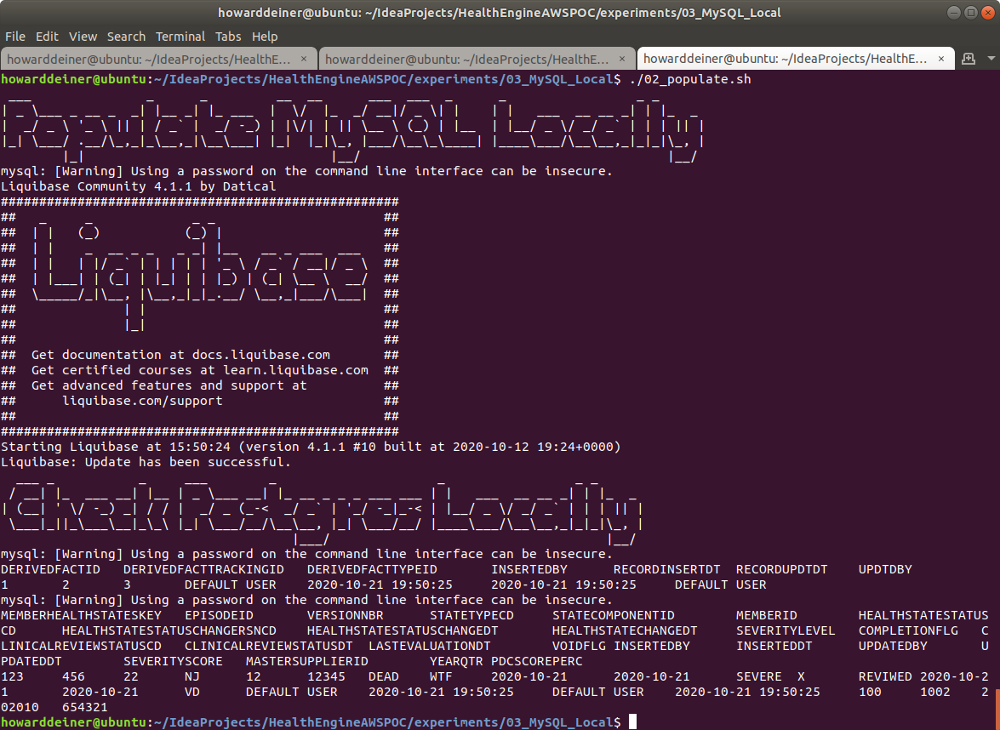
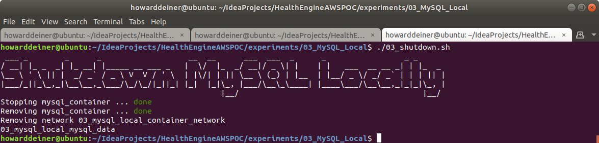

### Starting out with MySQL

##### Concept

> MySQL is an open-source relational database management system. Its name is a combination of "My", the name of co-founder Michael Widenius's daughter, and "SQL", the abbreviation for Structured Query Language. A relational database organizes data into one or more data tables in which data types may be related to each other; these relations help structure the data. SQL is a language programmers use to create, modify and extract data from the relational database, as well as control user access to the database. In addition to relational databases and SQL, an RDBMS like MySQL works with an operating system to implement a relational database in a computer's storage system, manages users, allows for network access and facilitates testing database integrity and creation of backups.
>  
> MySQL is free and open-source software under the terms of the GNU General Public License, and is also available under a variety of proprietary licenses. MySQL was owned and sponsored by the Swedish company MySQL AB, which was bought by Sun Microsystems (now Oracle Corporation). In 2010, when Oracle acquired Sun, Widenius forked the open-source MySQL project to create MariaDB.
>  
> MySQL has stand-alone clients that allow users to interact directly with a MySQL database using SQL, but more often MySQL is used with other programs to implement applications that need relational database capability. MySQL is a component of the LAMP web application software stack (and others), which is an acronym for Linux, Apache, MySQL, Perl/PHP/Python. MySQL is used by many database-driven web applications, including Drupal, Joomla, phpBB, and WordPress. MySQL is also used by many popular websites, including Facebook, Flickr, MediaWiki, Twitter, and YouTube.
>
> https://en.wikipedia.org/wiki/MySQL
>
> https://www.mysql.com
>
> https://mariadb.org

#### Execution

We want to get into MySQL quickly.  So, before we start running AWS instances, we need to master our data and how we're going to instantiate it in the database.

This whole project is about rearchitecting the database behind CareEngine, and we will try several different databases to do that.

Rather than rewrite each SQL DDL into each database's dialect, I will use a tool called Liquibase, which can do two things.
<UL>
<LI>Emit SQL DDL specific to each database from a common changeset</LI>
<LI>Use the notion of changesets to allow us to migrate the database created from one version to another.</LI>
</UL>

### 01_startup.sh
This script uses docker-compose to take the latest Dockerhub mysql image and bring it up in a container running as a daemon.  Since MySQL wants to persist data, I use a Docker Volume, which I delete in 03_shutdown.sh

Since we do not want to make use of the database until it actually starts, I monitor the logs from the mysql_container until I see a signature which tells me that the database has started.
```bash
#!/usr/bin/env bash

figlet -w 160 -f small "Startup MySQL Locally"
docker volume rm 03_mysql_local_mysql_data
docker-compose -f docker-compose.yml up -d

figlet -w 160 -f small "Wait For MySQL To Start"
while true ; do
  docker logs mysql_container > stdout.txt 2> stderr.txt
  result=$(grep -c "\[System\] \[MY-010931\] \[Server\] /usr/sbin/mysqld: ready for connections." stderr.txt)
  if [ $result = 1 ] ; then
    sleep 10 # it says it's ready for connections, but not really
    echo "MySQL has started"
    break
  fi
  sleep 5
done
rm stdout.txt stderr.txt
```
### 02_populate.sh
This script first uses the running mysql_container to run the mysql client to create a database for us.

The script then runs liquibase to update the database to it's intended state.  More on that in a bit.

The script then demonstrates that the two tables created have data in them, all managed by liquibase.
```bash
#!/usr/bin/env bash

figlet -w 160 -f small "Populate MySQL Locally"
docker exec mysql_container echo 'CREATE DATABASE testdatabase;' | mysql -h 127.0.0.1 -P 3306 -u root --password=password
liquibase update

figlet -w 160 -f small "Check Postgres Locally"
docker exec mysql_container echo 'select * from DERIVEDFACT;' | mysql -h 127.0.0.1 -P 3306 -u root --password=password testdatabase
docker exec mysql_container echo 'select * from MEMBERHEALTHSTATE;' | mysql -h 127.0.0.1 -P 3306 -u root --password=password testdatabase 
```
Liquibase itself is controlled by a liquibase.properties file for now.
```bash
changeLogFile: ../../src/db/changeset.xml
url:  jdbc:mysql://localhost:3306/testdatabase?autoReconnect=true&verifyServerCertificate=false&useSSL=false
username:  root
password:  password
driver:  org.gjt.mm.mysql.Driver
classpath:  ../../liquibase_drivers/mysql-connector-java-5.1.48.jar
```
It is also using tht changeset.
```xml
<?xml version="1.0" encoding="UTF-8"?>

<databaseChangeLog
  xmlns="http://www.liquibase.org/xml/ns/dbchangelog"
  xmlns:xsi="http://www.w3.org/2001/XMLSchema-instance"
  xsi:schemaLocation="http://www.liquibase.org/xml/ns/dbchangelog
         http://www.liquibase.org/xml/ns/dbchangelog/dbchangelog-3.8.xsd">

    <changeSet  id="1"  author="howarddeiner">

        <createTable tableName="DERIVEDFACT">
            <column name="DERIVEDFACTID" type="bigint"/>
            <column name="DERIVEDFACTTRACKINGID" type="bigint"/>
            <column name="DERIVEDFACTTYPEID" type="bigint"/>
            <column name="INSERTEDBY" type="varchar(30)" defaultValue="DEFAULT USER"/>
            <column name="RECORDINSERTDT" type="timestamp" defaultValueComputed="CURRENT_TIMESTAMP"/>
            <column name="RECORDUPDTDT" type="timestamp" defaultValueComputed="CURRENT_TIMESTAMP"/>
            <column name="UPDTDBY" type="varchar(30)" defaultValue="DEFAULT USER"/>
        </createTable>

        <loadData file="DERIVEDFACT.csv" relativeToChangelogFile="true" tableName="DERIVEDFACT"/>

        <createTable tableName="MEMBERHEALTHSTATE">
            <column name="MEMBERHEALTHSTATESKEY" type="bigint"/>
            <column name="EPISODEID" type="bigint"/>
            <column name="VERSIONNBR" type="bigint"/>
            <column name="STATETYPECD" type="varchar(2)"/>
            <column name="STATECOMPONENTID" type="bigint"/>
            <column name="MEMBERID" type="bigint"/>
            <column name="HEALTHSTATESTATUSCD" type="varchar(12)"/>
            <column name="HEALTHSTATESTATUSCHANGERSNCD" type="varchar(12)"/>
            <column name="HEALTHSTATESTATUSCHANGEDT" type="date"/>
            <column name="HEALTHSTATECHANGEDT" type="date"/>
            <column name="SEVERITYLEVEL" type="varchar(12)"/>
            <column name="COMPLETIONFLG" type="varchar(1)"/>
            <column name="CLINICALREVIEWSTATUSCD" type="varchar(12)"/>
            <column name="CLINICALREVIEWSTATUSDT" type="date"/>
            <column name="LASTEVALUATIONDT" type="date"/>
            <column name="VOIDFLG" type="varchar(2)"/>
            <column name="INSERTEDBY" type="varchar(30)" defaultValue="DEFAULT USER"/>
            <column name="INSERTEDDT" type="timestamp" defaultValueComputed="CURRENT_TIMESTAMP"/>
            <column name="UPDATEDBY" type="varchar(30)" defaultValue="DEFAULT USER"/>
            <column name="UPDATEDDT" type="timestamp" defaultValueComputed="CURRENT_TIMESTAMP"/>
            <column name="SEVERITYSCORE" type="bigint"/>
            <column name="MASTERSUPPLIERID" type="bigint"/>
            <column name="YEARQTR" type="bigint"/>
            <column name="PDCSCOREPERC" type="bigint"/>
        </createTable>

        <loadData file="MEMBERHEALTHSTATE.csv" relativeToChangelogFile="true" tableName="MEMBERHEALTHSTATE"/>

    </changeSet>

</databaseChangeLog>
```
We will be reusing that changeset for all the databases we explore.

### 03_shutdown.sh
This script is brutely simple.  It uses docker-compose to bring down the environment it established, and then uses docker volume rm to delete the data which held the bits for out database data.

```bash
#!/usr/bin/env bash

figlet -w 160 -f small "Shutdown MySQL Locally"
docker-compose -f docker-compose.yml down
docker volume rm 03_mysql_local_mysql_data
```

### Putting it all together...

It all looks something like this:

\
<BR />
\
<BR />
\
<BR />
