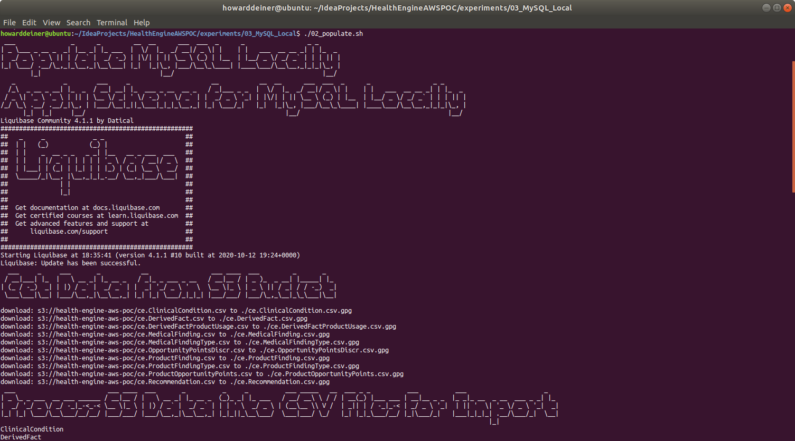
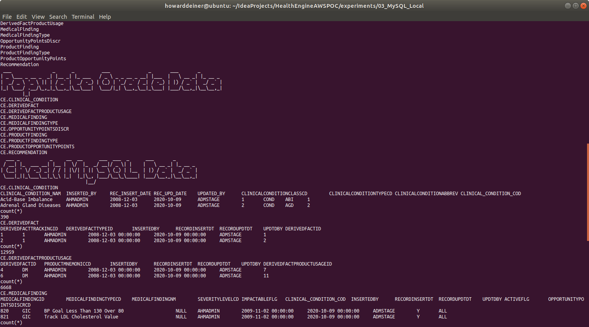

### Starting out with MySQL

##### Concept

> MySQL is an open-source relational database management system. Its name is a combination of "My", the name of co-founder Michael Widenius's daughter, and "SQL", the abbreviation for Structured Query Language. A relational database organizes data into one or more data tables in which data types may be related to each other; these relations help structure the data. SQL is a language programmers use to create, modify and extract data from the relational database, as well as control user access to the database. In addition to relational databases and SQL, an RDBMS like MySQL works with an operating system to implement a relational database in a computer's storage system, manages users, allows for network access and facilitates testing database integrity and creation of backups.
>  
> MySQL is free and open-source software under the terms of the GNU General Public License, and is also available under a variety of proprietary licenses. MySQL was owned and sponsored by the Swedish company MySQL AB, which was bought by Sun Microsystems (now Oracle Corporation). In 2010, when Oracle acquired Sun, Widenius forked the open-source MySQL project to create MariaDB.
>  
> MySQL has stand-alone clients that allow users to interact directly with a MySQL database using SQL, but more often MySQL is used with other programs to implement applications that need relational database capability. MySQL is a component of the LAMP web application software stack (and others), which is an acronym for Linux, Apache, MySQL, Perl/PHP/Python. MySQL is used by many database-driven web applications, including Drupal, Joomla, phpBB, and WordPress. MySQL is also used by many popular websites, including Facebook, Flickr, MediaWiki, Twitter, and YouTube.
>
> https://en.wikipedia.org/wiki/MySQL
>
> https://www.mysql.com
>
> https://mariadb.org

#### Execution

We want to get into MySQL quickly.  So, before we start running AWS instances, we need to master our data and how we're going to instantiate it in the database.

This whole project is about rearchitecting the database behind CareEngine, and we will try several different databases to do that.

Rather than rewrite each SQL DDL into each database's dialect, I will use a tool called Liquibase, which can do two things.
<UL>
<LI>Emit SQL DDL specific to each database from a common changeset</LI>
<LI>Use the notion of changesets to allow us to migrate the database created from one version to another.</LI>
</UL>

### 01_startup.sh
This script uses docker-compose to take the latest Dockerhub mysql image and bring it up in a container running as a daemon.  Since MySQL wants to persist data, I use a Docker Volume, which I delete in 03_shutdown.sh

Since we do not want to make use of the database until it actually starts, I monitor the logs from the mysql_container until I see a signature which tells me that the database has started.
```bash
#!/usr/bin/env bash

../../startExperiment.sh

bash -c 'cat << "EOF" > .script
#!/usr/bin/env bash
figlet -w 240 -f small "Startup MySQL/MySQLClient Locally"
docker volume rm 03_mysql_local_mysql_data
docker volume rm 03_mysql_local_mysqlclient_data
docker-compose -f docker-compose.yml up -d
figlet -w 160 -f small "Wait For MySQL To Start"
while true ; do
  docker logs mysql_container > stdout.txt 2> stderr.txt
  result=$(grep -c "\[System\] \[MY-010931\] \[Server\] /usr/sbin/mysqld: ready for connections." stderr.txt)
  if [ $result = 1 ] ; then
    sleep 10 # it says it'"'"'s ready for connections, but not really
    echo "MySQL has started"
    break
  fi
  sleep 5
done
rm stdout.txt stderr.txt
EOF'
chmod +x .script
command time -v ./.script 2> .results
../../getExperimentalResults.sh
experiment=$(../../getExperimentNumber.sh)
../../getDataAsCSVline.sh .results ${experiment} "03_MySQL_Local: Startup MySQL Locally" >> Experimental\ Results.csv
../../putExperimentalResults.sh
rm .script .results Experimental\ Results.csv
```
### 02_populate.sh
This script first uses the running mysql_container to run the mysql client to create a database for us.

The script then runs liquibase to update the database to it's intended state.  More on that in a bit.

The script then demonstrates that the tables created have data in them, all managed by liquibase.
```bash
#!/usr/bin/env bash

bash -c 'cat << "EOF" > .script
#!/usr/bin/env bash
figlet -w 160 -f small "Populate MySQL Locally"

figlet -w 240 -f small "Apply Schema for MySQL Locally"
docker exec mysql_container echo '"'"'CREATE DATABASE CE;'"'"' | mysql -h 127.0.0.1 -P 3306 -u root --password=password
cp ../../src/java/Translator/changeSet.xml changeSet.xml
# fix <createTable tableName="CE. to become <createTable tableName="
sed --in-place --regexp-extended '"'"'s/<createTable\ tableName\=\"CE\./<createTable\ tableName\=\"/g'"'"' changeSet.xml
liquibase update
rm changeSet.xml
EOF'
chmod +x .script
command time -v ./.script 2> .results
../../getExperimentalResults.sh
experiment=$(../../getExperimentNumber.sh)
../../getDataAsCSVline.sh .results ${experiment} "03_MySQL_Local: Populate MySQL Schema" >> Experimental\ Results.csv
../../putExperimentalResults.sh
rm .script .results Experimental\ Results.csv

bash -c 'cat << "EOF" > .script
#!/usr/bin/env bash
figlet -w 240 -f small "Get Data from S3 Bucket"
../../data/transfer_from_s3_and_decrypt.sh ce.ClinicalCondition.csv
../../data/transfer_from_s3_and_decrypt.sh ce.DerivedFact.csv
../../data/transfer_from_s3_and_decrypt.sh ce.DerivedFactProductUsage.csv
../../data/transfer_from_s3_and_decrypt.sh ce.MedicalFinding.csv
../../data/transfer_from_s3_and_decrypt.sh ce.MedicalFindingType.csv
../../data/transfer_from_s3_and_decrypt.sh ce.OpportunityPointsDiscr.csv
../../data/transfer_from_s3_and_decrypt.sh ce.ProductFinding.csv
../../data/transfer_from_s3_and_decrypt.sh ce.ProductFindingType.csv
../../data/transfer_from_s3_and_decrypt.sh ce.ProductOpportunityPoints.csv
../../data/transfer_from_s3_and_decrypt.sh ce.Recommendation.csv
EOF'
chmod +x .script
command time -v ./.script 2> .results
../../getExperimentalResults.sh
experiment=$(../../getExperimentNumber.sh)
../../getDataAsCSVline.sh .results ${experiment} "03_MySQL_Local: Get Data from S3 Bucket" >> Experimental\ Results.csv
../../putExperimentalResults.sh
rm .script .results Experimental\ Results.csv

bash -c 'cat << "EOF" > .script
#!/usr/bin/env bash
figlet -w 240 -f small "Process S3 Data into CSV Files For Import"
../transform_Oracle_ce.ClinicalCondition_to_csv.sh
../transform_Oracle_ce.DerivedFact_to_csv.sh
../transform_Oracle_ce.DerivedFactProductUsage_to_csv.sh
../transform_Oracle_ce.MedicalFinding_to_csv.sh
../transform_Oracle_ce.MedicalFindingType_to_csv.sh
../transform_Oracle_ce.OpportunityPointsDiscr_to_csv.sh
../transform_Oracle_ce.ProductFinding_to_csv.sh
../transform_Oracle_ce.ProductFindingType_to_csv.sh
../transform_Oracle_ce.ProductOpportunityPoints_to_csv.sh
../transform_Oracle_ce.Recommendation_to_csv.sh
EOF'
chmod +x .script
command time -v ./.script 2> .results
../../getExperimentalResults.sh
experiment=$(../../getExperimentNumber.sh)
../../getDataAsCSVline.sh .results ${experiment} "03_MySQL_Local: Process S3 Data into CSV Files For Import" >> Experimental\ Results.csv
../../putExperimentalResults.sh
rm .script .results Experimental\ Results.csv

bash -c 'cat << "EOF" > .script
#!/usr/bin/env bash
figlet -w 240 -f small "Populate Oracle Data"
echo "CE.CLINICAL_CONDITION"
docker cp ce.ClinicalCondition.csv mysql_container:/tmp/ce.ClinicalCondition.csv
docker exec mysql_container echo '"'"'LOAD DATA INFILE "/tmp/ce.ClinicalCondition.csv" INTO TABLE CE.CLINICAL_CONDITION FIELDS TERMINATED BY "," LINES TERMINATED BY "\n" IGNORE 1 ROWS (CLINICAL_CONDITION_COD,CLINICAL_CONDITION_NAM,INSERTED_BY,REC_INSERT_DATE,REC_UPD_DATE,UPDATED_BY,@CLINICALCONDITIONCLASSCD,CLINICALCONDITIONTYPECD,CLINICALCONDITIONABBREV) SET CLINICALCONDITIONCLASSCD = IF(@CLINICALCONDITIONCLASSCD="",NULL,@CLINICALCONDITIONCLASSCD);'"'"' | mysql -h 127.0.0.1 -P 3306 -u root --password=password CE
echo "CE.DERIVEDFACT"
docker cp ce.DerivedFact.csv mysql_container:/tmp/ce.DerivedFact.csv
docker exec mysql_container echo '"'"'LOAD DATA INFILE "/tmp/ce.DerivedFact.csv" INTO TABLE CE.DERIVEDFACT FIELDS TERMINATED BY "," LINES TERMINATED BY "\n" IGNORE 1 ROWS (DERIVEDFACTID,DERIVEDFACTTRACKINGID,DERIVEDFACTTYPEID,INSERTEDBY,RECORDINSERTDT,RECORDUPDTDT,UPDTDBY);'"'"' | mysql -h 127.0.0.1 -P 3306 -u root --password=password CE
echo "CE.DERIVEDFACTPRODUCTUSAGE"
docker cp ce.DerivedFactProductUsage.csv mysql_container:/tmp/ce.DerivedFactProductUsage.csv
docker exec mysql_container echo '"'"'LOAD DATA INFILE "/tmp/ce.DerivedFactProductUsage.csv" INTO TABLE CE.DERIVEDFACTPRODUCTUSAGE FIELDS TERMINATED BY "," LINES TERMINATED BY "\n" IGNORE 1 ROWS (DERIVEDFACTPRODUCTUSAGEID,DERIVEDFACTID,PRODUCTMNEMONICCD,INSERTEDBY,RECORDINSERTDT,RECORDUPDTDT,UPDTDBY);'"'"' | mysql -h 127.0.0.1 -P 3306 -u root --password=password CE
echo "CE.MEDICALFINDING"
docker cp ce.MedicalFinding.csv mysql_container:/tmp/ce.MedicalFinding.csv
docker exec mysql_container echo '"'"'LOAD DATA INFILE "/tmp/ce.MedicalFinding.csv" INTO TABLE CE.MEDICALFINDING FIELDS TERMINATED BY "," LINES TERMINATED BY "\n" IGNORE 1 ROWS (MEDICALFINDINGID,MEDICALFINDINGTYPECD,MEDICALFINDINGNM,SEVERITYLEVELCD,IMPACTABLEFLG,@CLINICAL_CONDITION_COD,INSERTEDBY,RECORDINSERTDT,RECORDUPDTDT,UPDTDBY,ACTIVEFLG,OPPORTUNITYPOINTSDISCRCD) SET CLINICAL_CONDITION_COD = IF(@CLINICAL_CONDITION_COD="",NULL,@CLINICAL_CONDITION_COD);'"'"' | mysql -h 127.0.0.1 -P 3306 -u root --password=password CE
echo "CE.MEDICALFINDINGTYPE"
docker cp ce.MedicalFindingType.csv mysql_container:/tmp/ce.MedicalFindingType.csv
docker exec mysql_container echo '"'"'LOAD DATA INFILE "/tmp/ce.MedicalFindingType.csv" INTO TABLE CE.MEDICALFINDINGTYPE FIELDS TERMINATED BY "," LINES TERMINATED BY "\n" IGNORE 1 ROWS (MEDICALFINDINGTYPECD,MEDICALFINDINGTYPEDESC,INSERTEDBY,RECORDINSERTDT,RECORDUPDTDT,UPDTDBY,HEALTHSTATEAPPLICABLEFLAG);'"'"' | mysql -h 127.0.0.1 -P 3306 -u root --password=password CE
echo "CE.OPPORTUNITYPOINTSDISCR"
docker cp ce.OpportunityPointsDiscr.csv mysql_container:/tmp/ce.OpportunityPointsDiscr.csv
docker exec mysql_container echo '"'"'LOAD DATA INFILE "/tmp/ce.OpportunityPointsDiscr.csv" INTO TABLE CE.OPPORTUNITYPOINTSDISCR FIELDS TERMINATED BY "," LINES TERMINATED BY "\n" IGNORE 1 ROWS (OPPORTUNITYPOINTSDISCRCD,OPPORTUNITYPOINTSDISCNM,INSERTEDBY,RECORDINSERTDT,RECORDUPDTDT,UPDTDBY);'"'"' | mysql -h 127.0.0.1 -P 3306 -u root --password=password CE
echo "CE.PRODUCTFINDING"
docker cp ce.ProductFinding.csv mysql_container:/tmp/ce.ProductFinding.csv
docker exec mysql_container echo '"'"'LOAD DATA INFILE "/tmp/ce.ProductFinding.csv" INTO TABLE CE.PRODUCTFINDING FIELDS TERMINATED BY "," LINES TERMINATED BY "\n" IGNORE 1 ROWS (PRODUCTFINDINGID,PRODUCTFINDINGNM,SEVERITYLEVELCD,PRODUCTFINDINGTYPECD,PRODUCTMNEMONICCD,SUBPRODUCTMNEMONICCD,INSERTEDBY,RECORDINSERTDT,RECORDUPDTDT,UPDTDBY);'"'"' | mysql -h 127.0.0.1 -P 3306 -u root --password=password CE
echo "CE.PRODUCTFINDINGTYPE"
docker cp ce.ProductFindingType.csv mysql_container:/tmp/ce.ProductFindingType.csv
docker exec mysql_container echo '"'"'LOAD DATA INFILE "/tmp/ce.ProductFindingType.csv" INTO TABLE CE.PRODUCTFINDINGTYPE FIELDS TERMINATED BY "," LINES TERMINATED BY "\n" IGNORE 1 ROWS (PRODUCTFINDINGTYPECD,PRODUCTFINDINGTYPEDESC,INSERTEDBY,RECORDINSERTDT,RECORDUPDTDT,UPDTDBY);'"'"' | mysql -h 127.0.0.1 -P 3306 -u root --password=password CE
echo "CE.PRODUCTOPPORTUNITYPOINTS"
docker cp ce.ProductOpportunityPoints.csv mysql_container:/tmp/ce.ProductOpportunityPoints.csv
docker exec mysql_container echo '"'"'LOAD DATA INFILE "/tmp/ce.ProductOpportunityPoints.csv" INTO TABLE CE.PRODUCTOPPORTUNITYPOINTS FIELDS TERMINATED BY "," LINES TERMINATED BY "\n" IGNORE 1 ROWS (OPPORTUNITYPOINTSDISCCD,EFFECTIVESTARTDT,OPPORTUNITYPOINTSNBR,@EFFECTIVEENDDT,DERIVEDFACTPRODUCTUSAGEID,INSERTEDBY,RECORDINSERTDT,RECORDUPDTDT,UPDTDBY) SET EFFECTIVEENDDT = IF(@EFFECTIVEENDDT="",NULL,@EFFECTIVEENDDT);'"'"' | mysql -h 127.0.0.1 -P 3306 -u root --password=password CE
echo "CE.RECOMMENDATION"
docker cp ce.Recommendation.csv mysql_container:/tmp/ce.Recommendation.csv
docker exec mysql_container echo '"'"'LOAD DATA INFILE "/tmp/ce.Recommendation.csv" INTO TABLE CE.RECOMMENDATION FIELDS TERMINATED BY "," LINES TERMINATED BY "\n" IGNORE 1 ROWS (RECOMMENDATIONSKEY,RECOMMENDATIONID,RECOMMENDATIONCODE,RECOMMENDATIONDESC,RECOMMENDATIONTYPE,CCTYPE,CLINICALREVIEWTYPE,@AGERANGEID,ACTIONCODE,THERAPEUTICCLASS,MDCCODE,MCCCODE,PRIVACYCATEGORY,INTERVENTION,@RECOMMENDATIONFAMILYID,@RECOMMENDPRECEDENCEGROUPID,INBOUNDCOMMUNICATIONROUTE,SEVERITY,PRIMARYDIAGNOSIS,SECONDARYDIAGNOSIS,ADVERSEEVENT,@ICMCONDITIONID,WELLNESSFLAG,VBFELIGIBLEFLAG,@COMMUNICATIONRANKING,@PRECEDENCERANKING,PATIENTDERIVEDFLAG,LABREQUIREDFLAG,UTILIZATIONTEXTAVAILABLEF,SENSITIVEMESSAGEFLAG,HIGHIMPACTFLAG,ICMLETTERFLAG,REQCLINICIANCLOSINGFLAG,@OPSIMPELMENTATIONPHASE,SEASONALFLAG,@SEASONALSTARTDT,@SEASONALENDDT,EFFECTIVESTARTDT,@EFFECTIVEENDDT,RECORDINSERTDT,RECORDUPDTDT,INSERTEDBY,UPDTDBY,STANDARDRUNFLAG,@INTERVENTIONFEEDBACKFAMILYID,@CONDITIONFEEDBACKFAMILYID,ASHWELLNESSELIGIBILITYFLAG,HEALTHADVOCACYELIGIBILITYFLAG) SET RECOMMENDATIONFAMILYID = IF(@RECOMMENDATIONFAMILYID="",NULL,@RECOMMENDATIONFAMILYID), RECOMMENDPRECEDENCEGROUPID = IF(@RECOMMENDPRECEDENCEGROUPID="",NULL,@RECOMMENDPRECEDENCEGROUPID), ICMCONDITIONID = IF(@ICMCONDITIONID="",NULL,@ICMCONDITIONID), COMMUNICATIONRANKING = IF(@COMMUNICATIONRANKING="",NULL,@COMMUNICATIONRANKING), PRECEDENCERANKING = IF(@PRECEDENCERANKING="",NULL,@PRECEDENCERANKING), OPSIMPELMENTATIONPHASE = IF(@OPSIMPELMENTATIONPHASE="",NULL,@OPSIMPELMENTATIONPHASE), SEASONALSTARTDT = IF(@SEASONALSTARTDT="",NULL,@SEASONALSTARTDT), SEASONALENDDT = IF(@SEASONALENDDT="",NULL,@SEASONALENDDT), EFFECTIVEENDDT = IF(@EFFECTIVEENDDT="",NULL,@EFFECTIVEENDDT), INTERVENTIONFEEDBACKFAMILYID = IF(@INTERVENTIONFEEDBACKFAMILYID="",NULL,@INTERVENTIONFEEDBACKFAMILYID), CONDITIONFEEDBACKFAMILYID = IF(@CONDITIONFEEDBACKFAMILYID="",NULL,@CONDITIONFEEDBACKFAMILYID), AGERANGEID = IF(@AGERANGEID="",NULL,@AGERANGEID);'"'"' | mysql -h 127.0.0.1 -P 3306 -u root --password=password CE
EOF'
chmod +x .script
command time -v ./.script 2> .results
../../getExperimentalResults.sh
experiment=$(../../getExperimentNumber.sh)
../../getDataAsCSVline.sh .results ${experiment} "03_MySQL_Local: Populate MySQL Data" >> Experimental\ Results.csv
../../putExperimentalResults.sh
rm .script .results Experimental\ Results.csv

bash -c 'cat << "EOF" > .script
#!/usr/bin/env bash
figlet -w 160 -f small "Check MySQL Data"
echo "CE.CLINICAL_CONDITION"
docker exec mysql_container echo '"'"'select * from CE.CLINICAL_CONDITION LIMIT 2;'"'"' | mysql -h 127.0.0.1 -P 3306 -u root --password=password CE
docker exec mysql_container echo '"'"'select count(*) from CE.CLINICAL_CONDITION;'"'"' | mysql -h 127.0.0.1 -P 3306 -u root --password=password CE
echo "CE.DERIVEDFACT"
docker exec mysql_container echo '"'"'select * from CE.DERIVEDFACT LIMIT 2;'"'"' | mysql -h 127.0.0.1 -P 3306 -u root --password=password CE
docker exec mysql_container echo '"'"'select count(*) from CE.DERIVEDFACT;'"'"' | mysql -h 127.0.0.1 -P 3306 -u root --password=password CE
echo "CE.DERIVEDFACTPRODUCTUSAGE"
docker exec mysql_container echo '"'"'select * from CE.DERIVEDFACTPRODUCTUSAGE LIMIT 2;'"'"' | mysql -h 127.0.0.1 -P 3306 -u root --password=password CE
docker exec mysql_container echo '"'"'select count(*) from CE.DERIVEDFACTPRODUCTUSAGE;'"'"' | mysql -h 127.0.0.1 -P 3306 -u root --password=password CE
echo "CE.MEDICALFINDING"
docker exec mysql_container echo '"'"'select * from CE.MEDICALFINDING LIMIT 2;'"'"' | mysql -h 127.0.0.1 -P 3306 -u root --password=password CE
docker exec mysql_container echo '"'"'select count(*) from CE.MEDICALFINDING;'"'"' | mysql -h 127.0.0.1 -P 3306 -u root --password=password CE
echo "CE.MEDICALFINDINGTYPE"
docker exec mysql_container echo '"'"'select * from CE.MEDICALFINDINGTYPE LIMIT 2;'"'"' | mysql -h 127.0.0.1 -P 3306 -u root --password=password CE
docker exec mysql_container echo '"'"'select count(*) from CE.MEDICALFINDINGTYPE;'"'"' | mysql -h 127.0.0.1 -P 3306 -u root --password=password CE
echo "CE.OPPORTUNITYPOINTSDISCR"
docker exec mysql_container echo '"'"'select * from CE.OPPORTUNITYPOINTSDISCR LIMIT 2;'"'"' | mysql -h 127.0.0.1 -P 3306 -u root --password=password CE
docker exec mysql_container echo '"'"'select count(*) from CE.OPPORTUNITYPOINTSDISCR;'"'"' | mysql -h 127.0.0.1 -P 3306 -u root --password=password CE
echo "CE.PRODUCTFINDING"
docker exec mysql_container echo '"'"'select * from CE.PRODUCTFINDING LIMIT 2;'"'"' | mysql -h 127.0.0.1 -P 3306 -u root --password=password CE
docker exec mysql_container echo '"'"'select count(*) from CE.PRODUCTFINDING;'"'"' | mysql -h 127.0.0.1 -P 3306 -u root --password=password CE
echo "CE.PRODUCTFINDINGTYPE"
docker exec mysql_container echo '"'"'select * from CE.PRODUCTFINDINGTYPE LIMIT 2;'"'"' | mysql -h 127.0.0.1 -P 3306 -u root --password=password CE
docker exec mysql_container echo '"'"'select count(*) from CE.PRODUCTFINDINGTYPE;'"'"' | mysql -h 127.0.0.1 -P 3306 -u root --password=password CE
echo "CE.PRODUCTOPPORTUNITYPOINTS"
docker exec mysql_container echo '"'"'select * from CE.PRODUCTOPPORTUNITYPOINTS LIMIT 2;'"'"' | mysql -h 127.0.0.1 -P 3306 -u root --password=password CE
docker exec mysql_container echo '"'"'select count(*) from CE.PRODUCTOPPORTUNITYPOINTS;'"'"' | mysql -h 127.0.0.1 -P 3306 -u root --password=password CE
echo "CE.RECOMMENDATION"
docker exec mysql_container echo '"'"'select * from CE.RECOMMENDATION LIMIT 2;'"'"' | mysql -h 127.0.0.1 -P 3306 -u root --password=password CE
docker exec mysql_container echo '"'"'select count(*) from CE.RECOMMENDATION;'"'"' | mysql -h 127.0.0.1 -P 3306 -u root --password=password CE
EOF'
chmod +x .script
command time -v ./.script 2> .results
../../getExperimentalResults.sh
experiment=$(../../getExperimentNumber.sh)
../../getDataAsCSVline.sh .results ${experiment} "03_MySQL_Local: Check MySQL Data" >> Experimental\ Results.csv
../../putExperimentalResults.sh
rm .script .results *.csv
```
It is also using this changeset.
```xml
<?xml version="1.0" encoding="UTF-8"?>

<databaseChangeLog
	xmlns="http://www.liquibase.org/xml/ns/dbchangelog"
	xmlns:xsi="http://www.w3.org/2001/XMLSchema-instance"
	xsi:schemaLocation="http://www.liquibase.org/xml/ns/dbchangelog
	http://www.liquibase.org/xml/ns/dbchangelog/dbchangelog-3.8.xsd">

	<changeSet  id="1"  author="ce">

		<createTable tableName="CE.OPPORTUNITYPOINTSDISCR" schemaName="CE">
			<column name="OPPORTUNITYPOINTSDISCNM" type="VARCHAR2(255)"/>
			<column name="INSERTEDBY" type="VARCHAR2(30)" defaultValue="DEFAULT USER"/>
			<column name="RECORDINSERTDT" type="TIMESTAMP" defaultValueComputed="CURRENT_TIMESTAMP"/>
			<column name="RECORDUPDTDT" type="TIMESTAMP" defaultValueComputed="CURRENT_TIMESTAMP"/>
			<column name="UPDTDBY" type="VARCHAR2(30)" defaultValue="DEFAULT USER"/>
			<column name="OPPORTUNITYPOINTSDISCRCD" type="VARCHAR2(12)">
				<constraints primaryKey="true"/>
			</column>
		</createTable>

		<createTable tableName="CE.DERIVEDFACT" schemaName="CE">
			<column name="DERIVEDFACTTRACKINGID" type="bigint"/>
			<column name="DERIVEDFACTTYPEID" type="bigint"/>
			<column name="INSERTEDBY" type="VARCHAR2(30)" defaultValue="DEFAULT USER"/>
			<column name="RECORDINSERTDT" type="TIMESTAMP" defaultValueComputed="CURRENT_TIMESTAMP"/>
			<column name="RECORDUPDTDT" type="TIMESTAMP" defaultValueComputed="CURRENT_TIMESTAMP"/>
			<column name="UPDTDBY" type="VARCHAR2(30)" defaultValue="DEFAULT USER"/>
			<column name="DERIVEDFACTID" type="bigint">
				<constraints primaryKey="true"/>
			</column>
		</createTable>

		<createTable tableName="CE.RECOMMENDATIONTEXT" schemaName="CE">
			<column name="RECOMMENDATIONTEXTID" type="bigint"/>
			<column name="RECOMMENDATIONID" type="NUMBER(10,0)"/>
			<column name="LANGUAGECD" type="CHAR(2)"/>
			<column name="RECOMMENDATIONTEXTTYPE" type="VARCHAR2(20)"/>
			<column name="MESSAGETYPE" type="CHAR(3)"/>
			<column name="RECOMMENDATIONTITLE" type="VARCHAR2(200)"/>
			<column name="RECOMMENDATIONTEXT" type="VARCHAR2(4000)"/>
			<column name="RECORDINSERTDT" type="TIMESTAMP" defaultValueComputed="CURRENT_TIMESTAMP"/>
			<column name="RECORDUPDATEDT" type="TIMESTAMP" defaultValueComputed="CURRENT_TIMESTAMP"/>
			<column name="INSERTEDBY" type="VARCHAR2(30)" defaultValue="DEFAULT USER"/>
			<column name="UPDATEDBY" type="VARCHAR2(30)" defaultValue="DEFAULT USER"/>
			<column name="DEFAULTIN" type="CHAR(1)"/>
		</createTable>

		<createTable tableName="CE.CLINICAL_CONDITION" schemaName="CE">
			<column name="CLINICAL_CONDITION_NAM" type="VARCHAR2(200)"/>
			<column name="INSERTED_BY" type="VARCHAR2(50)"/>
			<column name="REC_INSERT_DATE" type="DATE"/>
			<column name="REC_UPD_DATE" type="DATE"/>
			<column name="UPDATED_BY" type="VARCHAR2(50)"/>
			<column name="CLINICALCONDITIONCLASSCD" type="bigint"/>
			<column name="CLINICALCONDITIONTYPECD" type="VARCHAR2(12)"/>
			<column name="CLINICALCONDITIONABBREV" type="VARCHAR2(50)"/>
			<column name="CLINICAL_CONDITION_COD" type="bigint">
				<constraints primaryKey="true"/>
			</column>
		</createTable>

		<createTable tableName="CE.PRODUCTOPPORTUNITYPOINTS" schemaName="CE">
			<column name="OPPORTUNITYPOINTSDISCCD" type="VARCHAR2(100)"/>
			<column name="EFFECTIVESTARTDT" type="DATE"/>
			<column name="OPPORTUNITYPOINTSNBR" type="bigint"/>
			<column name="EFFECTIVEENDDT" type="DATE"/>
			<column name="DERIVEDFACTPRODUCTUSAGEID" type="bigint"/>
			<column name="INSERTEDBY" type="VARCHAR2(30)" defaultValue="DEFAULT USER"/>
			<column name="RECORDINSERTDT" type="TIMESTAMP" defaultValueComputed="CURRENT_TIMESTAMP"/>
			<column name="RECORDUPDTDT" type="TIMESTAMP" defaultValueComputed="CURRENT_TIMESTAMP"/>
			<column name="UPDTDBY" type="VARCHAR2(30)" defaultValue="DEFAULT USER"/>
		</createTable>

		<createTable tableName="CE.MEDICALFINDING" schemaName="CE">
			<column name="MEDICALFINDINGID" type="bigint"/>
			<column name="MEDICALFINDINGTYPECD" type="VARCHAR2(12)"/>
			<column name="MEDICALFINDINGNM" type="VARCHAR2(200)"/>
			<column name="SEVERITYLEVELCD" type="VARCHAR2(12)"/>
			<column name="IMPACTABLEFLG" type="CHAR(1)"/>
			<column name="CLINICAL_CONDITION_COD" type="bigint"/>
			<column name="INSERTEDBY" type="VARCHAR2(30)" defaultValue="DEFAULT USER"/>
			<column name="RECORDINSERTDT" type="TIMESTAMP" defaultValueComputed="CURRENT_TIMESTAMP"/>
			<column name="RECORDUPDTDT" type="TIMESTAMP" defaultValueComputed="CURRENT_TIMESTAMP"/>
			<column name="UPDTDBY" type="VARCHAR2(30)" defaultValue="DEFAULT USER"/>
			<column name="ACTIVEFLG" type="CHAR(1)"/>
			<column name="OPPORTUNITYPOINTSDISCRCD" type="VARCHAR2(12)"/>
		</createTable>

		<createTable tableName="CE.DERIVEDFACTPRODUCTUSAGE" schemaName="CE">
			<column name="DERIVEDFACTID" type="bigint"/>
			<column name="PRODUCTMNEMONICCD" type="VARCHAR2(50)"/>
			<column name="INSERTEDBY" type="VARCHAR2(30)" defaultValue="DEFAULT USER"/>
			<column name="RECORDINSERTDT" type="TIMESTAMP" defaultValueComputed="CURRENT_TIMESTAMP"/>
			<column name="RECORDUPDTDT" type="TIMESTAMP" defaultValueComputed="CURRENT_TIMESTAMP"/>
			<column name="UPDTDBY" type="VARCHAR2(30)" defaultValue="DEFAULT USER"/>
			<column name="DERIVEDFACTPRODUCTUSAGEID" type="bigint">
				<constraints primaryKey="true"/>
			</column>
		</createTable>

		<createTable tableName="CE.PRODUCTFINDINGTYPE" schemaName="CE">
			<column name="PRODUCTFINDINGTYPECD" type="VARCHAR2(12)"/>
			<column name="PRODUCTFINDINGTYPEDESC" type="VARCHAR2(255)"/>
			<column name="INSERTEDBY" type="VARCHAR2(30)" defaultValue="DEFAULT USER"/>
			<column name="RECORDINSERTDT" type="TIMESTAMP" defaultValueComputed="CURRENT_TIMESTAMP"/>
			<column name="RECORDUPDTDT" type="TIMESTAMP" defaultValueComputed="CURRENT_TIMESTAMP"/>
			<column name="UPDTDBY" type="VARCHAR2(30)" defaultValue="DEFAULT USER"/>
		</createTable>

		<createTable tableName="CE.RECOMMENDATION" schemaName="CE">
			<column name="RECOMMENDATIONSKEY" type="bigint"/>
			<column name="RECOMMENDATIONID" type="NUMBER(10,0)"/>
			<column name="RECOMMENDATIONCODE" type="VARCHAR2(200)"/>
			<column name="RECOMMENDATIONDESC" type="VARCHAR2(4000)"/>
			<column name="RECOMMENDATIONTYPE" type="VARCHAR2(20)"/>
			<column name="CCTYPE" type="VARCHAR2(50)"/>
			<column name="CLINICALREVIEWTYPE" type="VARCHAR2(20)"/>
			<column name="AGERANGEID" type="bigint"/>
			<column name="ACTIONCODE" type="VARCHAR2(200)"/>
			<column name="THERAPEUTICCLASS" type="VARCHAR2(300)"/>
			<column name="MDCCODE" type="VARCHAR2(20)"/>
			<column name="MCCCODE" type="VARCHAR2(50)"/>
			<column name="PRIVACYCATEGORY" type="VARCHAR2(20)"/>
			<column name="INTERVENTION" type="VARCHAR2(200)"/>
			<column name="RECOMMENDATIONFAMILYID" type="bigint"/>
			<column name="RECOMMENDPRECEDENCEGROUPID" type="bigint"/>
			<column name="INBOUNDCOMMUNICATIONROUTE" type="VARCHAR2(15)"/>
			<column name="SEVERITY" type="VARCHAR2(2)"/>
			<column name="PRIMARYDIAGNOSIS" type="VARCHAR2(300)"/>
			<column name="SECONDARYDIAGNOSIS" type="VARCHAR2(300)"/>
			<column name="ADVERSEEVENT" type="VARCHAR2(300)"/>
			<column name="ICMCONDITIONID" type="bigint"/>
			<column name="WELLNESSFLAG" type="CHAR(1)"/>
			<column name="VBFELIGIBLEFLAG" type="CHAR(1)"/>
			<column name="COMMUNICATIONRANKING" type="bigint"/>
			<column name="PRECEDENCERANKING" type="bigint"/>
			<column name="PATIENTDERIVEDFLAG" type="CHAR(1)"/>
			<column name="LABREQUIREDFLAG" type="CHAR(1)"/>
			<column name="UTILIZATIONTEXTAVAILABLEF" type="CHAR(1)"/>
			<column name="SENSITIVEMESSAGEFLAG" type="CHAR(1)"/>
			<column name="HIGHIMPACTFLAG" type="CHAR(1)"/>
			<column name="ICMLETTERFLAG" type="CHAR(1)"/>
			<column name="REQCLINICIANCLOSINGFLAG" type="CHAR(1)"/>
			<column name="OPSIMPELMENTATIONPHASE" type="bigint"/>
			<column name="SEASONALFLAG" type="CHAR(1)"/>
			<column name="SEASONALSTARTDT" type="DATE"/>
			<column name="SEASONALENDDT" type="DATE"/>
			<column name="EFFECTIVESTARTDT" type="DATE"/>
			<column name="EFFECTIVEENDDT" type="DATE"/>
			<column name="RECORDINSERTDT" type="TIMESTAMP" defaultValueComputed="CURRENT_TIMESTAMP"/>
			<column name="RECORDUPDTDT" type="TIMESTAMP" defaultValueComputed="CURRENT_TIMESTAMP"/>
			<column name="INSERTEDBY" type="VARCHAR2(30)" defaultValue="DEFAULT USER"/>
			<column name="UPDTDBY" type="VARCHAR2(30)" defaultValue="DEFAULT USER"/>
			<column name="STANDARDRUNFLAG" type="CHAR(1)"/>
			<column name="INTERVENTIONFEEDBACKFAMILYID" type="bigint"/>
			<column name="CONDITIONFEEDBACKFAMILYID" type="bigint"/>
			<column name="ASHWELLNESSELIGIBILITYFLAG" type="CHAR(1)"/>
			<column name="HEALTHADVOCACYELIGIBILITYFLAG" type="CHAR(1)"/>
		</createTable>

		<createTable tableName="CE.PRODUCTFINDING" schemaName="CE">
			<column name="PRODUCTFINDINGID" type="bigint"/>
			<column name="PRODUCTFINDINGNM" type="VARCHAR2(100)"/>
			<column name="SEVERITYLEVELCD" type="VARCHAR2(12)"/>
			<column name="PRODUCTFINDINGTYPECD" type="VARCHAR2(12)"/>
			<column name="PRODUCTMNEMONICCD" type="VARCHAR2(50)"/>
			<column name="SUBPRODUCTMNEMONICCD" type="VARCHAR2(50)"/>
			<column name="INSERTEDBY" type="VARCHAR2(30)" defaultValue="DEFAULT USER"/>
			<column name="RECORDINSERTDT" type="TIMESTAMP" defaultValueComputed="CURRENT_TIMESTAMP"/>
			<column name="RECORDUPDTDT" type="TIMESTAMP" defaultValueComputed="CURRENT_TIMESTAMP"/>
			<column name="UPDTDBY" type="VARCHAR2(30)" defaultValue="DEFAULT USER"/>
		</createTable>

		<createTable tableName="CE.MEDICALFINDINGTYPE" schemaName="CE">
			<column name="MEDICALFINDINGTYPEDESC" type="VARCHAR2(255)"/>
			<column name="INSERTEDBY" type="VARCHAR2(30)" defaultValue="DEFAULT USER"/>
			<column name="RECORDINSERTDT" type="TIMESTAMP" defaultValueComputed="CURRENT_TIMESTAMP"/>
			<column name="RECORDUPDTDT" type="TIMESTAMP" defaultValueComputed="CURRENT_TIMESTAMP"/>
			<column name="UPDTDBY" type="VARCHAR2(30)" defaultValue="DEFAULT USER"/>
			<column name="HEALTHSTATEAPPLICABLEFLAG" type="CHAR(1)"/>
			<column name="MEDICALFINDINGTYPECD" type="VARCHAR2(12)">
				<constraints primaryKey="true"/>
			</column>
		</createTable>

		<addNotNullConstraint
			columnName="RECOMMENDATIONTEXTID"
			schemaName="CE"
			columnDataType="NUMBER"
			tableName="RECOMMENDATIONTEXT"/>

		<addNotNullConstraint
			columnName="RECOMMENDATIONID"
			schemaName="CE"
			columnDataType="NUMBER(10,0)"
			tableName="RECOMMENDATIONTEXT"/>

		<addNotNullConstraint
			columnName="LANGUAGECD"
			schemaName="CE"
			columnDataType="CHAR(2)"
			tableName="RECOMMENDATIONTEXT"/>

		<addNotNullConstraint
			columnName="RECOMMENDATIONTEXTTYPE"
			schemaName="CE"
			columnDataType="VARCHAR2(20)"
			tableName="RECOMMENDATIONTEXT"/>

		<addNotNullConstraint
			columnName="MESSAGETYPE"
			schemaName="CE"
			columnDataType="CHAR(3)"
			tableName="RECOMMENDATIONTEXT"/>

		<addNotNullConstraint
			columnName="RECOMMENDATIONSKEY"
			schemaName="CE"
			columnDataType="NUMBER"
			tableName="RECOMMENDATION"/>

		<addNotNullConstraint
			columnName="RECOMMENDATIONID"
			schemaName="CE"
			columnDataType="NUMBER(10,0)"
			tableName="RECOMMENDATION"/>

		<addNotNullConstraint
			columnName="RECOMMENDATIONTYPE"
			schemaName="CE"
			columnDataType="VARCHAR2(20)"
			tableName="RECOMMENDATION"/>

		<addNotNullConstraint
			columnName="CLINICALREVIEWTYPE"
			schemaName="CE"
			columnDataType="VARCHAR2(20)"
			tableName="RECOMMENDATION"/>

		<addNotNullConstraint
			columnName="PRIVACYCATEGORY"
			schemaName="CE"
			columnDataType="VARCHAR2(20)"
			tableName="RECOMMENDATION"/>

		<addNotNullConstraint
			columnName="EFFECTIVESTARTDT"
			schemaName="CE"
			columnDataType="DATE"
			tableName="RECOMMENDATION"/>

	</changeSet>

</databaseChangeLog>
```
We will be reusing that changeset for all the RDBMSs we explore.


### 03_startup_app.sh
Here, we bring up the CECacheServer with docker-compose with the same network as we used to bring up MySQL in, so the CECacheServer can make requests of the database.
<BR/>
Normally, we would do this in the 01_startup.sh script, but we want to seperate out the effects of the database from the application for performance collection purposes, so we do it here.

```bash
#!/usr/bin/env bash

bash -c 'cat << "EOF" > .script
#!/usr/bin/env bash
figlet -w 160 -f small "Startup CECacheServer Locally"
docker volume rm 03_mysql_local_cecacheserver_data
docker-compose -f docker-compose.app.yml up -d --build

echo "Wait For CECacheServer To Start"
while true ; do
  docker logs cecacheserver_formysql_container > stdout.txt 2> stderr.txt
  result=$(grep -cE "<<<<< Local Cache Statistics <<<<<" stdout.txt)
  if [ $result != 0 ] ; then
    echo "CECacheServer has started"
    break
  fi
  sleep 5
done
rm stdout.txt stderr.txt
EOF'
chmod +x .script
command time -v ./.script 2> .results
../../getExperimentalResults.sh
experiment=$(../../getExperimentNumber.sh)
../../getDataAsCSVline.sh .results ${experiment} "03_MySQL_Local: Startup CECacheServer Locally" >> Experimental\ Results.csv
../../putExperimentalResults.sh
rm .script .results Experimental\ Results.csv
```

### 04_shutdown.sh
This script is brutely simple.  It uses docker-compose to bring down the environment it established, and then uses docker volume rm to delete the data which held the bits for out database data.

```bash
#!/usr/bin/env bash

bash -c 'cat << "EOF" > .script
#!/usr/bin/env bash
figlet -w 240 -f small "Shutdown MySQL and CECacheServer Locally"
docker-compose -f docker-compose.app.yml down
docker volume rm 03_mysql_local_cecacheserver_data
docker-compose -f docker-compose.yml down
docker volume rm 03_mysql_local_mysql_data
docker volume rm 03_mysql_local_mysqlclient_data
EOF'
chmod +x .script
command time -v ./.script 2> .results
../../getExperimentalResults.sh
experiment=$(../../getExperimentNumber.sh)
../../getDataAsCSVline.sh .results ${experiment} "03_MySQL_Local: Shutdown MySQL and CECacheServer Locally" >> Experimental\ Results.csv
../../putExperimentalResults.sh
rm .script .results Experimental\ Results.csv

../../endExperiment.sh
```

### Putting it all together...

It all looks something like this:

\
<BR />
\
\
\
<BR />
\
<BR />
\
<BR />
And just for laughs, here's the timings for this run.  All kept in a csv file in S3 at s3://health-engine-aws-poc/Experimental Results.csv
\
<BR />