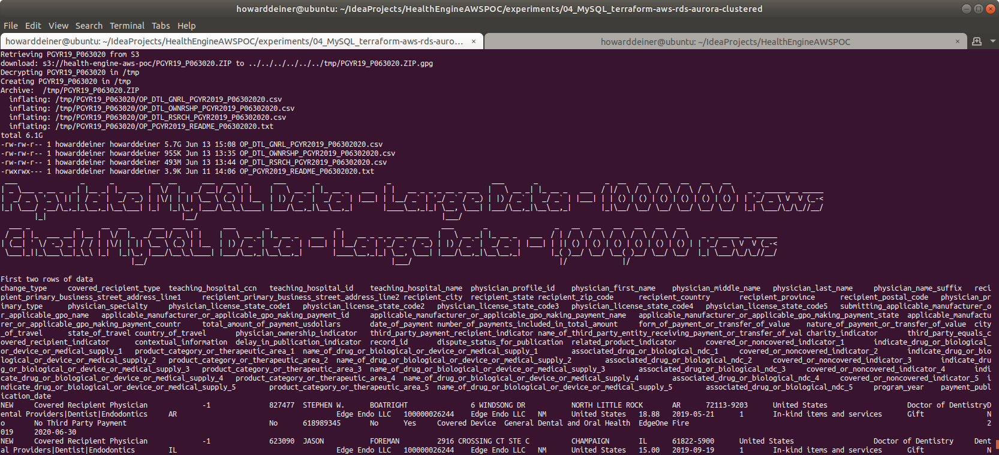

### Starting out with AWS RDS MySQL Clusters

##### Concept

> Amazon Relational Database Service (or Amazon RDS) is a distributed relational database service by Amazon Web Services (AWS). It is a web service running "in the cloud" designed to simplify the setup, operation, and scaling of a relational database for use in applications. Administration processes like patching the database software, backing up databases and enabling point-in-time recovery are managed automatically. Scaling storage and compute resources can be performed by a single API call as AWS does not offer an ssh connection to RDS instances
>
> https://en.wikipedia.org/wiki/Amazon_Relational_Database_Service
>
> MySQL is the world's most popular open source relational database and Amazon RDS makes it easy to set up, operate, and scale MySQL deployments in the cloud. With Amazon RDS, you can deploy scalable MySQL servers in minutes with cost-efficient and resizable hardware capacity.
>  
> Amazon RDS for MySQL frees you up to focus on application development by managing time-consuming database administration tasks including backups, software patching, monitoring, scaling and replication.
> 
> Amazon RDS supports MySQL Community Edition versions 5.5, 5.6, 5.7, and 8.0 which means that the code, applications, and tools you already use today can be used with Amazon RDS.>
>
> https://aws.amazon.com/rds/mysql/ (AWS propoganda)
>
#### Execution

### 01_startup.sh
This script uses simple Terraform and applies it.  You get 14 resources of ready to go database.  We also bring up a Local MySQL docker-composed instance, se we don't have to install MySQL on our machine to speak to the database in AWS, 
```bash
#!/usr/bin/env bash

../../startExperiment.sh

bash -c 'cat << "EOF" > .script
#!/usr/bin/env bash
figlet -w 200 -f small "Startup MySQL AWS Cluster"
terraform init
terraform apply -auto-approve
EOF'
chmod +x .script
command time -v ./.script 2> .results
../../getExperimentalResults.sh
experiment=$(../../getExperimentNumber.sh)
../../getDataAsCSVline.sh .results ${experiment} "04_MySQL_AWS_Clustered: Startup MySQL AWS Cluster" >> Experimental\ Results.csv
../../putExperimentalResults.sh
rm .script .results Experimental\ Results.csv

bash -c 'cat << "EOF" > .script
#!/usr/bin/env bash
figlet -w 240 -f small "Startup MySQL/MySQLClient Locally"
docker volume rm 03_mysql_local_mysql_data
docker volume rm 03_mysql_local_mysqlclient_data
docker-compose -f ../03_MySQL_Local/docker-compose.yml up -d
figlet -w 160 -f small "Wait For MySQL To Start"
while true ; do
  docker logs mysql_container > stdout.txt 2> stderr.txt
  result=$(grep -c "\[System\] \[MY-010931\] \[Server\] /usr/sbin/mysqld: ready for connections." stderr.txt)
  if [ $result = 1 ] ; then
    sleep 10 # it says it'"'"'s ready for connections, but not really
    echo "MySQL has started"
    break
  fi
  sleep 5
done
rm stdout.txt stderr.txt
EOF'
chmod +x .script
command time -v ./.script 2> .results
../../getExperimentalResults.sh
experiment=$(../../getExperimentNumber.sh)
../../getDataAsCSVline.sh .results ${experiment} "04_MySQL_AWS_Clustered: Startup MySQL Locally" >> Experimental\ Results.csv
../../putExperimentalResults.sh
rm .script .results Experimental\ Results.csv
```
The one script that does all of the heavy lifting is below.
```hcl-terraform
provider "aws" {
  region                  = "us-east-1"
  shared_credentials_file = "~/.aws/credentials"
}

#######################################
# Data sources to get VPC and subnets #
#######################################
data "aws_vpc" "default" {
  default = true
}

data "aws_subnet_ids" "all" {
  vpc_id = data.aws_vpc.default.id
}

##############
# RDS Aurora #
##############
module "aurora" {
  source  = "terraform-aws-modules/rds-aurora/aws"
  version = "~> 2.0"

  name                            = "mysql-aurora-clustered"
  engine                          = "aurora-mysql"
  engine_version                  = "5.7"
  username                        = "root"
  password                        = "password"
  publicly_accessible             = true
  subnets                         = data.aws_subnet_ids.all.ids
  vpc_id                          = data.aws_vpc.default.id
  allowed_security_groups         = [aws_security_group.aurora_connect.id]
  allowed_cidr_blocks             = ["0.0.0.0/0"]
  replica_count                   = 2
  instance_type                   = "db.r4.large" #  2 vCPU	8 ECU 15.25 GiB Memory EBS Only	$0.133 per Hour
  instance_type_replica           = "db.t3.medium" # 2 vCPU	variable ECU 4 GiB Memory EBS Only	$0.0416 per Hour
  apply_immediately               = true
  skip_final_snapshot             = true
  db_parameter_group_name         = aws_db_parameter_group.aurora_db_mysql57_parameter_group.id
  db_cluster_parameter_group_name = aws_rds_cluster_parameter_group.aurora_cluster_mysql57_parameter_group.id
  #  enabled_cloudwatch_logs_exports = ["audit", "error", "general", "slowquery"]
  security_group_description      = ""
  tags = {
    Terraform = "true"
    Environment = "dev"
  }
}

resource "aws_db_parameter_group" "aurora_db_mysql57_parameter_group" {
  name        = "test-aurora-db-mysql57-parameter-group"
  family      = "aurora-mysql5.7"
  description = "test-aurora-db-mysql57-parameter-group"
}

resource "aws_rds_cluster_parameter_group" "aurora_cluster_mysql57_parameter_group" {
  name        = "test-aurora-mysql57-cluster-parameter-group"
  family      = "aurora-mysql5.7"
  description = "test-aurora-mysql57-cluster-parameter-group"
}

#############################
# Example of security group #
#############################
resource "aws_security_group" "app_servers" {
  name_prefix = "app-servers-"
  description = "For application servers"
  vpc_id      = data.aws_vpc.default.id
  ingress {
    protocol  = "tcp"
    from_port = 3306
    to_port   = 3306
    cidr_blocks = [
      "0.0.0.0/0",
    ]
  }
  egress {
    from_port = 0
    to_port   = 0
    protocol  = "-1"
    cidr_blocks = [
      "0.0.0.0/0",
    ]
  }
}

resource "aws_security_group_rule" "allow_access" {
  type                     = "ingress"
  from_port                = module.aurora.this_rds_cluster_port
  to_port                  = module.aurora.this_rds_cluster_port
  protocol                 = "tcp"
  source_security_group_id = aws_security_group.app_servers.id
  security_group_id        = module.aurora.this_security_group_id
}

resource "aws_security_group" "aurora_connect" {
  name        = "Aurora Security Group"
  description = "Aurora Security Group"
  ingress {
    protocol  = "tcp"
    from_port = 3306
    to_port   = 3306
    cidr_blocks = [
      "0.0.0.0/0",
    ]
  }
  egress {
    from_port = 0
    to_port   = 0
    protocol  = "-1"
    cidr_blocks = [
      "0.0.0.0/0",
    ]
  }
  tags = {
    Name = "Aurora Security Group"
  }
}
```

This is what the console looks like when the script is executed.
\
\
\
\
<BR/>
If we were to peruse the AWS Console Database Dashboard, here's what we will see.
\
<BR/>
Looking deeper into the AWS Console Database Connectivity, we'd see this.
\
<BR/>
And, finally, looking deeper into the AWS Console Database Monitoring, we'd see this.
\
<BR/>
### 02_populate.sh
This script first uses the running AWS database and to runs mysql in the local docker instance to create a database on AWS for us.

The script then creates a liquibase.properties to run liquibase to update the database to it's intended state.

The script then downloads, decrypts, and processes the S3 files that hold the database data.

And, finally, the script then demonstrates that database has the tables we created and has their data in them, done through IaC.
```bash
#!/usr/bin/env bash

bash -c 'cat << "EOF" > .script
#!/usr/bin/env bash
figlet -w 200 -f small "Populate MySQL Clustered on AWS RDS Aurora"
echo `terraform output database_dns | grep -o '"'"'".*"'"'"' | cut -d '"'"'"'"'"' -f2` > .database_dns
echo `terraform output database_port | grep -Eo '"'"'[0-9]{1,}'"'"' | cut -d '"'"'"'"'"' -f2` > .database_port
echo `terraform output database_username | grep -o '"'"'".*"'"'"' | cut -d '"'"'"'"'"' -f2` > .database_username
echo `terraform output database_password | grep -o '"'"'".*"'"'"' | cut -d '"'"'"'"'"' -f2` > .database_password

cp .database_dns .database_name
sed --in-place --regexp-extended '"'"'s/\..*//g'"'"' .database_name  # take away everything starting with the first dot on the dns name and make it the database name

figlet -w 240 -f small "Apply Schema for MySQL AWS RDS Aurora"
docker exec mysql_container echo '"'"'CREATE DATABASE CE;'"'"' | mysql -h $(<.database_dns) -P $(<.database_port) -u $(<.database_username) --password=$(<.database_password)
#docker exec mysql_container echo '"'"'SHOW DATABASES;'"'"' | mysql -h $(<.database_dns) -P $(<.database_port) -u $(<.database_username) --password=$(<.database_password)

cp ../../src/java/Translator/changeSet.xml changeSet.xml
# fix <createTable tableName="CE. to become <createTable tableName="
sed --in-place --regexp-extended '"'"'s/<createTable\ tableName\=\"CE\./<createTable\ tableName\=\"/g'"'"' changeSet.xml

echo '"'"'changeLogFile: changeSet.xml'"'"' > liquibase.properties
echo '"'"'url:  jdbc:mysql://'"'"'$(<.database_dns)'"'"':'"'"'$(<.database_port)'"'"'/CE?autoReconnect=true&verifyServerCertificate=false&useSSL=false'"'"' >> liquibase.properties
echo '"'"'username: '"'"'$(<.database_username) >> liquibase.properties
echo '"'"'password: '"'"'$(<.database_password) >> liquibase.properties
echo '"'"'driver:  org.gjt.mm.mysql.Driver'"'"' >> liquibase.properties
echo '"'"'classpath:  ../../liquibase_drivers/mysql-connector-java-5.1.48.jar'"'"' >> liquibase.properties
liquibase update

EOF'
chmod +x .script
command time -v ./.script 2> .results
../../getExperimentalResults.sh
experiment=$(../../getExperimentNumber.sh)
../../getDataAsCSVline.sh .results ${experiment} "04_MySQL_AWS_Clustered: Populate MySQL Schema "$(<.database_name) >> Experimental\ Results.csv
../../putExperimentalResults.sh
rm .script .results Experimental\ Results.csv

bash -c 'cat << "EOF" > .script
#!/usr/bin/env bash
figlet -w 240 -f small "Get Data from S3 Bucket"
../../data/transfer_from_s3_and_decrypt.sh ce.ClinicalCondition.csv
../../data/transfer_from_s3_and_decrypt.sh ce.DerivedFact.csv
../../data/transfer_from_s3_and_decrypt.sh ce.DerivedFactProductUsage.csv
../../data/transfer_from_s3_and_decrypt.sh ce.MedicalFinding.csv
../../data/transfer_from_s3_and_decrypt.sh ce.MedicalFindingType.csv
../../data/transfer_from_s3_and_decrypt.sh ce.OpportunityPointsDiscr.csv
../../data/transfer_from_s3_and_decrypt.sh ce.ProductFinding.csv
../../data/transfer_from_s3_and_decrypt.sh ce.ProductFindingType.csv
../../data/transfer_from_s3_and_decrypt.sh ce.ProductOpportunityPoints.csv
../../data/transfer_from_s3_and_decrypt.sh ce.Recommendation.csv
EOF'
chmod +x .script
command time -v ./.script 2> .results
../../getExperimentalResults.sh
experiment=$(../../getExperimentNumber.sh)
../../getDataAsCSVline.sh .results ${experiment} "04_MySQL_AWS_Clustered: Get Data from S3 Bucket "$(<.database_name) >> Experimental\ Results.csv
../../putExperimentalResults.sh
rm .script .results Experimental\ Results.csv

bash -c 'cat << "EOF" > .script
#!/usr/bin/env bash
figlet -w 240 -f small "Process S3 Data into CSV Files For Import"
../transform_Oracle_ce.ClinicalCondition_to_csv.sh
../transform_Oracle_ce.DerivedFact_to_csv.sh
../transform_Oracle_ce.DerivedFactProductUsage_to_csv.sh
../transform_Oracle_ce.MedicalFinding_to_csv.sh
../transform_Oracle_ce.MedicalFindingType_to_csv.sh
../transform_Oracle_ce.OpportunityPointsDiscr_to_csv.sh
../transform_Oracle_ce.ProductFinding_to_csv.sh
../transform_Oracle_ce.ProductFindingType_to_csv.sh
../transform_Oracle_ce.ProductOpportunityPoints_to_csv.sh
../transform_Oracle_ce.Recommendation_to_csv.sh
EOF'
chmod +x .script
command time -v ./.script 2> .results
../../getExperimentalResults.sh
experiment=$(../../getExperimentNumber.sh)
../../getDataAsCSVline.sh .results ${experiment} "04_MySQL_AWS_Clustered: Process S3 Data into CSV Files For Import "$(<.database_name) >> Experimental\ Results.csv
../../putExperimentalResults.sh
rm .script .results Experimental\ Results.csv

bash -c 'cat << "EOF" > .script
#!/usr/bin/env bash
MYSQL='"'"'mysql -h '"'"'$(<.database_dns)'"'"' -P '"'"'$(<.database_port)'"'"' -u '"'"'$(<.database_username)'"'"' --password='"'"'$(<.database_password)'"'"' --local-infile'"'"'
figlet -w 240 -f small "Populate MySQL Data"
echo "CE.CLINICAL_CONDITION"
docker exec mysql_container echo '"'"'USE CE;LOAD DATA LOCAL INFILE "./ce.ClinicalCondition.csv" INTO TABLE CE.CLINICAL_CONDITION FIELDS TERMINATED BY "," LINES TERMINATED BY "\n" IGNORE 1 ROWS (CLINICAL_CONDITION_COD,CLINICAL_CONDITION_NAM,INSERTED_BY,REC_INSERT_DATE,REC_UPD_DATE,UPDATED_BY,@CLINICALCONDITIONCLASSCD,CLINICALCONDITIONTYPECD,CLINICALCONDITIONABBREV) SET CLINICALCONDITIONCLASSCD = IF(@CLINICALCONDITIONCLASSCD="",NULL,@CLINICALCONDITIONCLASSCD);'"'"' | $MYSQL
echo "CE.DERIVEDFACT"
docker exec mysql_container echo '"'"'USE CE;LOAD DATA LOCAL INFILE "./ce.DerivedFact.csv" INTO TABLE CE.DERIVEDFACT FIELDS TERMINATED BY "," LINES TERMINATED BY "\n" IGNORE 1 ROWS (DERIVEDFACTID,DERIVEDFACTTRACKINGID,DERIVEDFACTTYPEID,INSERTEDBY,RECORDINSERTDT,RECORDUPDTDT,UPDTDBY);'"'"' | $MYSQL
echo "CE.DERIVEDFACTPRODUCTUSAGE"
docker exec mysql_container echo '"'"'USE CE;LOAD DATA LOCAL INFILE "./ce.DerivedFactProductUsage.csv" INTO TABLE CE.DERIVEDFACTPRODUCTUSAGE FIELDS TERMINATED BY "," LINES TERMINATED BY "\n" IGNORE 1 ROWS (DERIVEDFACTPRODUCTUSAGEID,DERIVEDFACTID,PRODUCTMNEMONICCD,INSERTEDBY,RECORDINSERTDT,RECORDUPDTDT,UPDTDBY);'"'"' | $MYSQL
echo "CE.MEDICALFINDING"
docker exec mysql_container echo '"'"'USE CE;LOAD DATA LOCAL INFILE "./ce.MedicalFinding.csv" INTO TABLE CE.MEDICALFINDING FIELDS TERMINATED BY "," LINES TERMINATED BY "\n" IGNORE 1 ROWS (MEDICALFINDINGID,MEDICALFINDINGTYPECD,MEDICALFINDINGNM,SEVERITYLEVELCD,IMPACTABLEFLG,@CLINICAL_CONDITION_COD,INSERTEDBY,RECORDINSERTDT,RECORDUPDTDT,UPDTDBY,ACTIVEFLG,OPPORTUNITYPOINTSDISCRCD) SET CLINICAL_CONDITION_COD = IF(@CLINICAL_CONDITION_COD="",NULL,@CLINICAL_CONDITION_COD);'"'"' | $MYSQL
echo "CE.MEDICALFINDINGTYPE"
docker exec mysql_container echo '"'"'USE CE;LOAD DATA LOCAL INFILE "./ce.MedicalFindingType.csv" INTO TABLE CE.MEDICALFINDINGTYPE FIELDS TERMINATED BY "," LINES TERMINATED BY "\n" IGNORE 1 ROWS (MEDICALFINDINGTYPECD,MEDICALFINDINGTYPEDESC,INSERTEDBY,RECORDINSERTDT,RECORDUPDTDT,UPDTDBY,HEALTHSTATEAPPLICABLEFLAG);'"'"' | $MYSQL
echo "CE.OPPORTUNITYPOINTSDISCR"
docker exec mysql_container echo '"'"'USE CE;LOAD DATA LOCAL INFILE "./ce.OpportunityPointsDiscr.csv" INTO TABLE CE.OPPORTUNITYPOINTSDISCR FIELDS TERMINATED BY "," LINES TERMINATED BY "\n" IGNORE 1 ROWS (OPPORTUNITYPOINTSDISCRCD,OPPORTUNITYPOINTSDISCNM,INSERTEDBY,RECORDINSERTDT,RECORDUPDTDT,UPDTDBY);'"'"' | $MYSQL
echo "CE.PRODUCTFINDING"
docker exec mysql_container echo '"'"'USE CE;LOAD DATA LOCAL INFILE "./ce.ProductFinding.csv" INTO TABLE CE.PRODUCTFINDING FIELDS TERMINATED BY "," LINES TERMINATED BY "\n" IGNORE 1 ROWS (PRODUCTFINDINGID,PRODUCTFINDINGNM,SEVERITYLEVELCD,PRODUCTFINDINGTYPECD,PRODUCTMNEMONICCD,SUBPRODUCTMNEMONICCD,INSERTEDBY,RECORDINSERTDT,RECORDUPDTDT,UPDTDBY);'"'"' | $MYSQL
echo "CE.PRODUCTFINDINGTYPE"
docker exec mysql_container echo '"'"'USE CE;LOAD DATA LOCAL INFILE "./ce.ProductFindingType.csv" INTO TABLE CE.PRODUCTFINDINGTYPE FIELDS TERMINATED BY "," LINES TERMINATED BY "\n" IGNORE 1 ROWS (PRODUCTFINDINGTYPECD,PRODUCTFINDINGTYPEDESC,INSERTEDBY,RECORDINSERTDT,RECORDUPDTDT,UPDTDBY);'"'"' | $MYSQL
echo "CE.PRODUCTOPPORTUNITYPOINTS"
docker exec mysql_container echo '"'"'USE CE;LOAD DATA LOCAL INFILE "./ce.ProductOpportunityPoints.csv" INTO TABLE CE.PRODUCTOPPORTUNITYPOINTS FIELDS TERMINATED BY "," LINES TERMINATED BY "\n" IGNORE 1 ROWS (OPPORTUNITYPOINTSDISCCD,EFFECTIVESTARTDT,OPPORTUNITYPOINTSNBR,@EFFECTIVEENDDT,DERIVEDFACTPRODUCTUSAGEID,INSERTEDBY,RECORDINSERTDT,RECORDUPDTDT,UPDTDBY) SET EFFECTIVEENDDT = IF(@EFFECTIVEENDDT="",NULL,@EFFECTIVEENDDT);'"'"' | $MYSQL
echo "CE.RECOMMENDATION"
docker exec mysql_container echo '"'"'USE CE;LOAD DATA LOCAL INFILE "./ce.Recommendation.csv" INTO TABLE CE.RECOMMENDATION FIELDS TERMINATED BY "," LINES TERMINATED BY "\n" IGNORE 1 ROWS (RECOMMENDATIONSKEY,RECOMMENDATIONID,RECOMMENDATIONCODE,RECOMMENDATIONDESC,RECOMMENDATIONTYPE,CCTYPE,CLINICALREVIEWTYPE,@AGERANGEID,ACTIONCODE,THERAPEUTICCLASS,MDCCODE,MCCCODE,PRIVACYCATEGORY,INTERVENTION,@RECOMMENDATIONFAMILYID,@RECOMMENDPRECEDENCEGROUPID,INBOUNDCOMMUNICATIONROUTE,SEVERITY,PRIMARYDIAGNOSIS,SECONDARYDIAGNOSIS,ADVERSEEVENT,@ICMCONDITIONID,WELLNESSFLAG,VBFELIGIBLEFLAG,@COMMUNICATIONRANKING,@PRECEDENCERANKING,PATIENTDERIVEDFLAG,LABREQUIREDFLAG,UTILIZATIONTEXTAVAILABLEF,SENSITIVEMESSAGEFLAG,HIGHIMPACTFLAG,ICMLETTERFLAG,REQCLINICIANCLOSINGFLAG,@OPSIMPELMENTATIONPHASE,SEASONALFLAG,@SEASONALSTARTDT,@SEASONALENDDT,EFFECTIVESTARTDT,@EFFECTIVEENDDT,RECORDINSERTDT,RECORDUPDTDT,INSERTEDBY,UPDTDBY,STANDARDRUNFLAG,@INTERVENTIONFEEDBACKFAMILYID,@CONDITIONFEEDBACKFAMILYID,ASHWELLNESSELIGIBILITYFLAG,HEALTHADVOCACYELIGIBILITYFLAG) SET RECOMMENDATIONFAMILYID = IF(@RECOMMENDATIONFAMILYID="",NULL,@RECOMMENDATIONFAMILYID), RECOMMENDPRECEDENCEGROUPID = IF(@RECOMMENDPRECEDENCEGROUPID="",NULL,@RECOMMENDPRECEDENCEGROUPID), ICMCONDITIONID = IF(@ICMCONDITIONID="",NULL,@ICMCONDITIONID), COMMUNICATIONRANKING = IF(@COMMUNICATIONRANKING="",NULL,@COMMUNICATIONRANKING), PRECEDENCERANKING = IF(@PRECEDENCERANKING="",NULL,@PRECEDENCERANKING), OPSIMPELMENTATIONPHASE = IF(@OPSIMPELMENTATIONPHASE="",NULL,@OPSIMPELMENTATIONPHASE), SEASONALSTARTDT = IF(@SEASONALSTARTDT="",NULL,@SEASONALSTARTDT), SEASONALENDDT = IF(@SEASONALENDDT="",NULL,@SEASONALENDDT), EFFECTIVEENDDT = IF(@EFFECTIVEENDDT="",NULL,@EFFECTIVEENDDT), INTERVENTIONFEEDBACKFAMILYID = IF(@INTERVENTIONFEEDBACKFAMILYID="",NULL,@INTERVENTIONFEEDBACKFAMILYID), CONDITIONFEEDBACKFAMILYID = IF(@CONDITIONFEEDBACKFAMILYID="",NULL,@CONDITIONFEEDBACKFAMILYID), AGERANGEID = IF(@AGERANGEID="",NULL,@AGERANGEID);'"'"' | $MYSQL
EOF'
chmod +x .script
command time -v ./.script 2> .results
../../getExperimentalResults.sh
experiment=$(../../getExperimentNumber.sh)
../../getDataAsCSVline.sh .results ${experiment} "04_MySQL_AWS_Clustered: Populate MySQL Data "$(<.database_name) >> Experimental\ Results.csv
../../putExperimentalResults.sh
rm .script .results Experimental\ Results.csv

bash -c 'cat << "EOF" > .script
#!/usr/bin/env bash
figlet -w 160 -f small "Check MySQL Data"
echo "CE.CLINICAL_CONDITION"
docker exec mysql_container echo '"'"'select * from CE.CLINICAL_CONDITION LIMIT 2;'"'"' | mysql -h $(<.database_dns) -P $(<.database_port) -u $(<.database_username) --password=$(<.database_password) CE
docker exec mysql_container echo '"'"'select count(*) from CE.CLINICAL_CONDITION;'"'"' | mysql -h $(<.database_dns) -P $(<.database_port) -u $(<.database_username) --password=$(<.database_password) CE
echo "CE.DERIVEDFACT"
docker exec mysql_container echo '"'"'select * from CE.DERIVEDFACT LIMIT 2;'"'"' | mysql -h $(<.database_dns) -P $(<.database_port) -u $(<.database_username) --password=$(<.database_password) CE
docker exec mysql_container echo '"'"'select count(*) from CE.DERIVEDFACT;'"'"' | mysql -h $(<.database_dns) -P $(<.database_port) -u $(<.database_username) --password=$(<.database_password) CE
echo "CE.DERIVEDFACTPRODUCTUSAGE"
docker exec mysql_container echo '"'"'select * from CE.DERIVEDFACTPRODUCTUSAGE LIMIT 2;'"'"' | mysql -h $(<.database_dns) -P $(<.database_port) -u $(<.database_username) --password=$(<.database_password) CE
docker exec mysql_container echo '"'"'select count(*) from CE.DERIVEDFACTPRODUCTUSAGE;'"'"' | mysql -h $(<.database_dns) -P $(<.database_port) -u $(<.database_username) --password=$(<.database_password) CE
echo "CE.MEDICALFINDING"
docker exec mysql_container echo '"'"'select * from CE.MEDICALFINDING LIMIT 2;'"'"' | mysql -h $(<.database_dns) -P $(<.database_port) -u $(<.database_username) --password=$(<.database_password) CE
docker exec mysql_container echo '"'"'select count(*) from CE.MEDICALFINDING;'"'"' | mysql -h $(<.database_dns) -P $(<.database_port) -u $(<.database_username) --password=$(<.database_password) CE
echo "CE.MEDICALFINDINGTYPE"
docker exec mysql_container echo '"'"'select * from CE.MEDICALFINDINGTYPE LIMIT 2;'"'"' | mysql -h $(<.database_dns) -P $(<.database_port) -u $(<.database_username) --password=$(<.database_password) CE
docker exec mysql_container echo '"'"'select count(*) from CE.MEDICALFINDINGTYPE;'"'"' | mysql -h $(<.database_dns) -P $(<.database_port) -u $(<.database_username) --password=$(<.database_password) CE
echo "CE.OPPORTUNITYPOINTSDISCR"
docker exec mysql_container echo '"'"'select * from CE.OPPORTUNITYPOINTSDISCR LIMIT 2;'"'"' | mysql -h $(<.database_dns) -P $(<.database_port) -u $(<.database_username) --password=$(<.database_password) CE
docker exec mysql_container echo '"'"'select count(*) from CE.OPPORTUNITYPOINTSDISCR;'"'"' | mysql -h $(<.database_dns) -P $(<.database_port) -u $(<.database_username) --password=$(<.database_password) CE
echo "CE.PRODUCTFINDING"
docker exec mysql_container echo '"'"'select * from CE.PRODUCTFINDING LIMIT 2;'"'"' | mysql -h $(<.database_dns) -P $(<.database_port) -u $(<.database_username) --password=$(<.database_password) CE
docker exec mysql_container echo '"'"'select count(*) from CE.PRODUCTFINDING;'"'"' | mysql -h $(<.database_dns) -P $(<.database_port) -u $(<.database_username) --password=$(<.database_password) CE
echo "CE.PRODUCTFINDINGTYPE"
docker exec mysql_container echo '"'"'select * from CE.PRODUCTFINDINGTYPE LIMIT 2;'"'"' | mysql -h $(<.database_dns) -P $(<.database_port) -u $(<.database_username) --password=$(<.database_password) CE
docker exec mysql_container echo '"'"'select count(*) from CE.PRODUCTFINDINGTYPE;'"'"' | mysql -h $(<.database_dns) -P $(<.database_port) -u $(<.database_username) --password=$(<.database_password) CE
echo "CE.PRODUCTOPPORTUNITYPOINTS"
docker exec mysql_container echo '"'"'select * from CE.PRODUCTOPPORTUNITYPOINTS LIMIT 2;'"'"' | mysql -h $(<.database_dns) -P $(<.database_port) -u $(<.database_username) --password=$(<.database_password) CE
docker exec mysql_container echo '"'"'select count(*) from CE.PRODUCTOPPORTUNITYPOINTS;'"'"' | mysql -h $(<.database_dns) -P $(<.database_port) -u $(<.database_username) --password=$(<.database_password) CE
echo "CE.RECOMMENDATION"
docker exec mysql_container echo '"'"'select * from CE.RECOMMENDATION LIMIT 2;'"'"' | mysql -h $(<.database_dns) -P $(<.database_port) -u $(<.database_username) --password=$(<.database_password) CE
docker exec mysql_container echo '"'"'select count(*) from CE.RECOMMENDATION;'"'"' | mysql -h $(<.database_dns) -P $(<.database_port) -u $(<.database_username) --password=$(<.database_password) CE
EOF'
chmod +x .script
command time -v ./.script 2> .results
../../getExperimentalResults.sh
experiment=$(../../getExperimentNumber.sh)
../../getDataAsCSVline.sh .results ${experiment} "04_MySQL_AWS_Clustered: Check MySQL Data "$(<.database_name) >> Experimental\ Results.csv
../../putExperimentalResults.sh
rm .script .results Experimental\ Results.csv

rm .database_dns .database_port .database_username .database_password .database_name liquibase.properties changeSet.xml ce.*.csv
```
This is what the console looks like when the script is executed.
\
\
\
<BR/>
### 03_shutdown.sh
This script is extremely simple.  It tells terraform to destroy all that it created.

```bash
#!/usr/bin/env bash

bash -c 'cat << "EOF" > .script
#!/usr/bin/env bash
figlet -w 200 -f small "Shutdown MySQL Clustered on AWS RDS Aurora"
terraform destroy -auto-approve
EOF'
chmod +x .script
command time -v ./.script 2> .results
../../getExperimentalResults.sh
experiment=$(../../getExperimentNumber.sh)
../../getDataAsCSVline.sh .results ${experiment} "04_MySQL_AWS_Clustered: Shutdown MySQL AWS Cluster" >> Experimental\ Results.csv
../../putExperimentalResults.sh
rm .script .results Experimental\ Results.csv

bash -c 'cat << "EOF" > .script
#!/usr/bin/env bash
figlet -w 240 -f small "Shutdown MySQL/MySQLClient Locally"
docker-compose -f ../03_MySQL_Local/docker-compose.yml down
docker volume rm 03_mysql_local_mysql_data
docker volume rm 03_mysql_local_mysqlclient_data
EOF'
chmod +x .script
command time -v ./.script 2> .results
../../getExperimentalResults.sh
experiment=$(../../getExperimentNumber.sh)
../../getDataAsCSVline.sh .results ${experiment} "04_MySQL_AWS_Clustered: Shutdown MySQL Locally" >> Experimental\ Results.csv
../../putExperimentalResults.sh
rm .script .results Experimental\ Results.csv

../../endExperiment.sh
```
The console shows what it does.
\
\
\
<BR/>
And just for laughs, here's the timings for this run.  All kept in a csv file in S3 at s3://health-engine-aws-poc/Experimental Results.csv
\
<BR />

### Large Data Experiments

A different script is available for large data testing.  This transfers the dataset for large volume testing.  It uses the data from the "Complete 2019 Program Year Open Payments Dataset" from the Center for Medicare & Medicade Services.  See https://www.cms.gov/OpenPayments/Explore-the-Data/Dataset-Downloads for details.  In total, there is over 6GB in this dataset.

The script 02_populate_large_data.sh is a variation on 02_populate.sh.
```bash
#!/usr/bin/env bash

if [ $# -eq 0 ]
  then
    echo "must supply the command with the number of rows to use"
    exit 1
fi

re='^[0-9]+$'
if ! [[ $1 =~ $re ]] ; then
    echo "must supply the command with the number of rows to use"
   exit 1
fi

ROWS=$1
export ROWS

bash -c 'cat << "EOF" > .script
#!/usr/bin/env bash

echo $1

figlet -w 240 -f small "Populate MySQL Clustered on AWS RDS Aurora - Large Data - $(numfmt --grouping $ROWS) rows"

figlet -w 240 -f small "Populate MySQL Clustered on AWS RDS Aurora"

echo `terraform output database_dns | grep -o '"'"'".*"'"'"' | cut -d '"'"'"'"'"' -f2` > .database_dns
echo `terraform output database_port | grep -Eo '"'"'[0-9]{1,}'"'"' | cut -d '"'"'"'"'"' -f2` > .database_port
echo `terraform output database_username | grep -o '"'"'".*"'"'"' | cut -d '"'"'"'"'"' -f2` > .database_username
echo `terraform output database_password | grep -o '"'"'".*"'"'"' | cut -d '"'"'"'"'"' -f2` > .database_password

cp .database_dns .database_name
sed --in-place --regexp-extended '"'"'s/\..*//g'"'"' .database_name

figlet -w 240 -f small "Apply Schema for MySQL - Large Data - $(numfmt --grouping $ROWS) rows"
docker exec mysql_container echo '"'"'CREATE DATABASE PI;'"'"' | mysql -h $(<.database_dns) -P $(<.database_port) -u $(<.database_username) --password=$(<.database_password)

echo '"'"'changeLogFile: ../../ddl/PGYR19_P063020/changeset.xml'"'"' > liquibase.properties
echo '"'"'url: jdbc:mysql://'"'"'$(<.database_dns)'"'"':'"'"'$(<.database_port)'"'"'/PI?autoReconnect=true&verifyServerCertificate=false&useSSL=false'"'"' >> liquibase.properties
echo '"'"'username: '"'"'$(<.database_username) >> liquibase.properties
echo '"'"'password: '"'"'$(<.database_password) >> liquibase.properties
echo '"'"'driver:  org.gjt.mm.mysql.Driver'"'"' >> liquibase.properties
echo '"'"'classpath:  ../../liquibase_drivers/mysql-connector-java-5.1.48.jar'"'"' >> liquibase.properties

liquibase update
EOF'
chmod +x .script
command time -v ./.script 2> .results
../../getExperimentalResults.sh
experiment=$(../../getExperimentNumber.sh)
../../getDataAsCSVline.sh .results ${experiment} "04_MySQL_AWS_Clustered: Populate MySQL Schema - Large Data - $ROWS rows" >> Experimental\ Results.csv
../../putExperimentalResults.sh
rm .script .results liquibase.properties Experimental\ Results.csv

bash -c 'cat << "EOF" > .script
#!/usr/bin/env bash
figlet -w 240 -f small "Get Data from S3 Bucket"
../../data/transferPGYR19_P063020_from_s3_and_decrypt.sh
EOF'
chmod +x .script
command time -v ./.script 2> .results
../../getExperimentalResults.sh
experiment=$(../../getExperimentNumber.sh)
../../getDataAsCSVline.sh .results ${experiment} "04_MySQL_AWS_Clustered: Get Data from S3 Bucket - Large Data - $ROWS rows" >> Experimental\ Results.csv
../../putExperimentalResults.sh
rm .script .results Experimental\ Results.csv
ls -lh /tmp/PGYR19_P063020

command time -v ./02_populate_large_data_load_data.sh $ROWS 2> .results
../../getExperimentalResults.sh
experiment=$(../../getExperimentNumber.sh)
../../getDataAsCSVline.sh .results ${experiment} "04_MySQL_AWS_Clustered: Populate MySQL Data - Large Data - $ROWS rows" >> Experimental\ Results.csv
../../putExperimentalResults.sh
rm -rf .script .results Experimental\ Results.csv

bash -c 'cat << "EOF" > .script
#!/usr/bin/env bash
figlet -w 240 -f small "Check MySQL Data - Large Data - $(numfmt --grouping $ROWS) rows"
echo ""
echo "First two rows of data"
docker exec mysql_container echo '"'"'select * from PI.OP_DTL_GNRL_PGYR2019_P06302020 LIMIT 2;'"'"' | mysql -h $(<.database_dns) -P $(<.database_port) -u $(<.database_username) --password=$(<.database_password) PI
echo ""
echo "Count of rows of data"
docker exec mysql_container echo '"'"'select count(*) from PI.OP_DTL_GNRL_PGYR2019_P06302020 LIMIT 2;'"'"' | mysql -h $(<.database_dns) -P $(<.database_port) -u $(<.database_username) --password=$(<.database_password) PI
echo ""
echo "Average of total_amount_of_payment_usdollars"
docker exec mysql_container echo '"'"'select avg(total_amount_of_payment_usdollars) from PI.OP_DTL_GNRL_PGYR2019_P06302020;'"'"' | mysql -h $(<.database_dns) -P $(<.database_port) -u $(<.database_username) --password=$(<.database_password) PI
echo ""
echo "Top ten earning physicians"
docker exec mysql_container echo '"'"'SELECT physician_first_name, physician_last_name, SUM(total_amount_of_payment_usdollars), COUNT(total_amount_of_payment_usdollars) FROM PI.OP_DTL_GNRL_PGYR2019_P06302020 WHERE physician_first_name IS NOT NULL AND physician_last_name IS NOT NULL GROUP BY physician_first_name, physician_last_name ORDER BY SUM(total_amount_of_payment_usdollars) DESC LIMIT 10;'"'"' | mysql -h $(<.database_dns) -P $(<.database_port) -u $(<.database_username) --password=$(<.database_password) PI
EOF'

chmod +x .script
command time -v ./.script 2> .results
../../getExperimentalResults.sh
experiment=$(../../getExperimentNumber.sh)
../../getDataAsCSVline.sh .results ${experiment} "04_MySQL_AWS_Clustered: Check MySQL Data - Large Data - $ROWS rows" >> Experimental\ Results.csv
../../putExperimentalResults.sh
rm -rf .script .sql .results *.csv /tmp/PGYR19_P063020
rm .database_dns .database_port .database_username .database_password .database_name
```
It uses the following changeset.
```xml
<?xml version="1.0" encoding="UTF-8"?>

<databaseChangeLog
  xmlns="http://www.liquibase.org/xml/ns/dbchangelog"
  xmlns:xsi="http://www.w3.org/2001/XMLSchema-instance"
  xsi:schemaLocation="http://www.liquibase.org/xml/ns/dbchangelog
         http://www.liquibase.org/xml/ns/dbchangelog/dbchangelog-3.8.xsd">

    <changeSet  id="1"  author="howarddeiner">

        <createTable tableName="OP_DTL_GNRL_PGYR2019_P06302020" schemaName="PI">
            <column name="change_type" type="VARCHAR2(20)"/>
            <column name="covered_recipient_type" type="VARCHAR2(50)"/>
            <column name="teaching_hospital_ccn" type="VARCHAR2(06)"/>
            <column name="teaching_hospital_id" type="NUMBER(38,0)"/>
            <column name="teaching_hospital_name" type="VARCHAR2(100)"/>
            <column name="physician_profile_id" type="NUMBER(38,0)"/>
            <column name="physician_first_name" type="VARCHAR2(20)"/>
            <column name="physician_middle_name" type="VARCHAR2(20)"/>
            <column name="physician_last_name" type="VARCHAR2(35)"/>
            <column name="physician_name_suffix" type="VARCHAR2(5)"/>
            <column name="recipient_primary_business_street_address_line1" type="VARCHAR2(55)"/>
            <column name="recipient_primary_business_street_address_line2" type="VARCHAR2(55)"/>
            <column name="recipient_city" type="VARCHAR2(40)"/>
            <column name="recipient_state" type="CHAR(2)"/>
            <column name="recipient_zip_code" type="VARCHAR2(10)"/>
            <column name="recipient_country" type="VARCHAR2(100)"/>
            <column name="recipient_province" type="VARCHAR2(20)"/>
            <column name="recipient_postal_code" type="VARCHAR2(20)"/>
            <column name="physician_primary_type" type="VARCHAR2(100)"/>
            <column name="physician_specialty" type="VARCHAR2(300)"/>
            <column name="physician_license_state_code1" type="CHAR(2)"/>
            <column name="physician_license_state_code2" type="CHAR(2)"/>
            <column name="physician_license_state_code3" type="CHAR(2)"/>
            <column name="physician_license_state_code4" type="CHAR(2)"/>
            <column name="physician_license_state_code5" type="CHAR(2)"/>
            <column name="submitting_applicable_manufacturer_or_applicable_gpo_name" type="VARCHAR2(100)"/>
            <column name="applicable_manufacturer_or_applicable_gpo_making_payment_id" type="VARCHAR2(12)"/>
            <column name="applicable_manufacturer_or_applicable_gpo_making_payment_name" type="VARCHAR2(100)"/>
            <column name="applicable_manufacturer_or_applicable_gpo_making_payment_state" type="CHAR(2)"/>
            <column name="applicable_manufacturer_or_applicable_gpo_making_payment_countr" type="VARCHAR2(100)"/>
            <column name="total_amount_of_payment_usdollars" type="NUMBER(12,2)"/>
            <column name="date_of_payment" type="DATE"/>
            <column name="number_of_payments_included_in_total_amount" type="NUMBER(3,0)"/>
            <column name="form_of_payment_or_transfer_of_value" type="VARCHAR2(100)"/>
            <column name="nature_of_payment_or_transfer_of_value" type="VARCHAR2(200)"/>
            <column name="city_of_travel" type="VARCHAR2(40)"/>
            <column name="state_of_travel" type="CHAR(2)"/>
            <column name="country_of_travel" type="VARCHAR2(100)"/>
            <column name="physician_ownership_indicator" type="CHAR(3)"/>
            <column name="third_party_payment_recipient_indicator" type="VARCHAR2(50)"/>
            <column name="name_of_third_party_entity_receiving_payment_or_transfer_of_val" type="VARCHAR2(50)"/>
            <column name="charity_indicator" type="CHAR(3)"/>
            <column name="third_party_equals_covered_recipient_indicator" type="CHAR(3)"/>
            <column name="contextual_information" type="VARCHAR2(500)"/>
            <column name="delay_in_publication_indicator" type="CHAR(3)"/>
            <column name="record_id" type="NUMBER(38,0)"/>
            <column name="dispute_status_for_publication" type="CHAR(3)"/>
            <column name="related_product_indicator" type="VARCHAR2(100)"/>
            <column name="covered_or_noncovered_indicator_1" type="VARCHAR2(100)"/>
            <column name="indicate_drug_or_biological_or_device_or_medical_supply_1" type="VARCHAR2(100)"/>
            <column name="product_category_or_therapeutic_area_1" type="VARCHAR2(100)"/>
            <column name="name_of_drug_or_biological_or_device_or_medical_supply_1" type="VARCHAR2(500)"/>
            <column name="associated_drug_or_biological_ndc_1" type="VARCHAR2(100)"/>
            <column name="covered_or_noncovered_indicator_2" type="VARCHAR2(100)"/>
            <column name="indicate_drug_or_biological_or_device_or_medical_supply_2" type="VARCHAR2(100)"/>
            <column name="product_category_or_therapeutic_area_2" type="VARCHAR2(100)"/>
            <column name="name_of_drug_or_biological_or_device_or_medical_supply_2" type="VARCHAR2(500)"/>
            <column name="associated_drug_or_biological_ndc_2" type="VARCHAR2(100)"/>
            <column name="covered_or_noncovered_indicator_3" type="VARCHAR2(100)"/>
            <column name="indicate_drug_or_biological_or_device_or_medical_supply_3" type="VARCHAR2(100)"/>
            <column name="product_category_or_therapeutic_area_3" type="VARCHAR2(100)"/>
            <column name="name_of_drug_or_biological_or_device_or_medical_supply_3" type="VARCHAR2(500)"/>
            <column name="associated_drug_or_biological_ndc_3" type="VARCHAR2(100)"/>
            <column name="covered_or_noncovered_indicator_4" type="VARCHAR2(100)"/>
            <column name="indicate_drug_or_biological_or_device_or_medical_supply_4" type="VARCHAR2(100)"/>
            <column name="product_category_or_therapeutic_area_4" type="VARCHAR2(100)"/>
            <column name="name_of_drug_or_biological_or_device_or_medical_supply_4" type="VARCHAR2(500)"/>
            <column name="associated_drug_or_biological_ndc_4" type="VARCHAR2(100)"/>
            <column name="covered_or_noncovered_indicator_5" type="VARCHAR2(100)"/>
            <column name="indicate_drug_or_biological_or_device_or_medical_supply_5" type="VARCHAR2(100)"/>
            <column name="product_category_or_therapeutic_area_5" type="VARCHAR2(100)"/>
            <column name="name_of_drug_or_biological_or_device_or_medical_supply_5" type="VARCHAR2(500)"/>
            <column name="associated_drug_or_biological_ndc_5" type="VARCHAR2(100)"/>
            <column name="program_year" type="CHAR(4)"/>
            <column name="payment_publication_date" type="DATE"/>
        </createTable>

    </changeSet>

</databaseChangeLog>
```
<BR />
When run in conjunction with 01_startup.sh and 03_shutdown.sh for a sample size of 1,000,000 records, you will see:

\
\
\
\
\
\
\
\
\
\
<BR />
This particular run generated the following results.

\
<BR />
When rerun with sample sizes of 3,000,000 and then 9,000,000 records, the following results can be observed for comparison.  For clarity, many of the metrics are hidden to make the observations more easily observed:

\
<BR />
