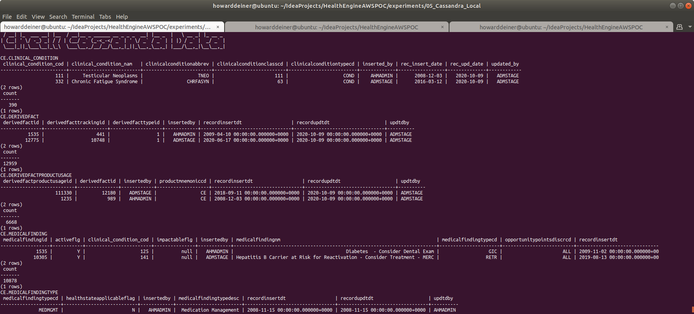
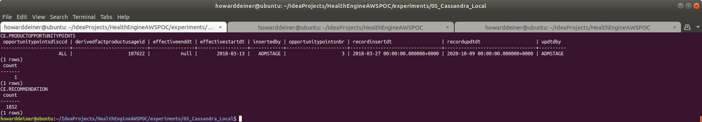
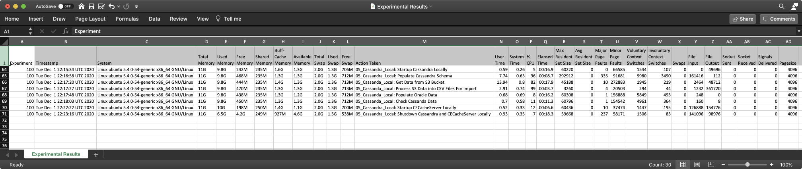

### Starting out with Cassandra

##### Concept

> Apache Cassandra is a free and open-source, distributed, wide column store, NoSQL database management system designed to handle large amounts of data across many commodity servers, providing high availability with no single point of failure. Cassandra offers robust support for clusters spanning multiple datacenters, with asynchronous masterless replication allowing low latency operations for all clients. Cassandra offers the distribution design of Amazon DynamoDB with the data model of Google's Bigtable.
> 
> Avinash Lakshman, one of the authors of Amazon's Dynamo, and Prashant Malik initially developed Cassandra at Facebook to power the Facebook inbox search feature. Facebook released Cassandra as an open-source project on Google code in July 2008. In March 2009 it became an Apache Incubator project. On February 17, 2010 it graduated to a top-level project.
>
> Facebook developers named their database after the Trojan mythological prophet Cassandra, with classical allusions to a curse on an oracle.
>
> https://en.wikipedia.org/wiki/Apache_Cassandra
>
> https://cassandra.apache.org

Why Cassandra?
<UL>
<LI>Designed for massive data</LI>
<LI>Designed to be fault tolerant</LI>
<LI>Built in peer-to-peer distribution synchronization</LI>
</UL>

#### Execution

We want to get into Cassandra quickly.  So, before we start running AWS instances, we need to master our data and how we're going to instantiate it in the database.

This whole project is about rearchitecting the database behind CareEngine, and we will try several different databases to do that.

Rather than rewrite each SQL DDL into each database's dialect, I will use a tool called Liquibase, which can do two things.
<UL>
<LI>Emit SQL DDL specific to each database from a common changeset</LI>
<LI>Use the notion of changesets to allow us to migrate the database created from one version to another.</LI>
</UL>
Unhappily, Liquibase support for Cassandra does not support the changeset.xml format yet.  That still seems to be under active development.  Never the less, we can use Liquibase with just the native cqlsh client, and achieve the same goals.  

### 01_startup.sh
This script uses docker-compose to take the 3.8.11 Dockerhub Cassandra image and bring it up in a container running as a daemon.  Since Cassandra wants to persist data, I use a Docker Volume, which I delete in 03_shutdown.sh

Since we do not want to make use of the database until it actually starts, I monitor the logs from the cassandra_container until I see a signature which tells me that the database has started.
```bash
#!/usr/bin/env bash

bash -c 'cat << "EOF" > .script
#!/usr/bin/env bash
figlet -w 240 -f small "Startup Cassandra/CassandraWeb/CECacheServer Locally"
docker volume rm 05_Cassandra_local_cassandra_data
docker volume rm 05_Cassandra_local_cassandraweb_data
docker volume rm 05_Cassandra_local_cecacheserver_data
docker-compose -f docker-compose.yml up -d

figlet -w 240 -f small "Wait For Cassandra To Start"
while true ; do
  docker logs cassandra_container > stdout.txt 2> stderr.txt
  result=$(grep -c "Created default superuser role '"'"'cassandra'"'"'" stdout.txt)
  if [ $result = 1 ] ; then
    echo "Cassandra has started"
    break
  fi
  sleep 5
done
rm stdout.txt stderr.txt
EOF'
chmod +x .script
command time -v ./.script 2> .results
../../getExperimentalResults.sh
../../getDataAsCSVline.sh .results "Howard Deiner" "Local Startup Cassandra" >> Experimental\ Results.csv
../../putExperimentalResults.sh
rm .script .results Experimental\ Results.csv
```
### 02_populate.sh
This script first uses the running cassandra_container to run cqlsh to create a database (keystore) for us.

The script then runs liquibase to update the database to it's intended state.  More on that in a bit.

The script then demonstrates that the tables created have data in them, all managed by liquibase.  Since Liquibase is being used in a native sql form, I also have to import the csv data using native cqlsh COPY commands.
```bash
#!/usr/bin/env bash

figlet -w 240 -f small "Populate Cassandra Locally"

bash -c 'cat << "EOF" > .script
#!/usr/bin/env bash
figlet -w 240 -f small "Update Cassanda Schema"
docker exec cassandra_container cqlsh -e "CREATE KEYSPACE IF NOT EXISTS CE WITH replication = {'"'"'class'"'"': '"'"'SimpleStrategy'"'"', '"'"'replication_factor'"'"' : 1}"
liquibase update
EOF'
chmod +x .script
command time -v ./.script 2> .results
../../getExperimentalResults.sh
../../getDataAsCSVline.sh .results "Howard Deiner" "Update Cassanda Schema" >> Experimental\ Results.csv
../../putExperimentalResults.sh
rm .script .results Experimental\ Results.csv

bash -c 'cat << "EOF" > .script
#!/usr/bin/env bash
figlet -w 240 -f small "Get Cassandra Data from S3 Bucket"
../../data/transfer_from_s3_and_decrypt.sh ce.ClinicalCondition.csv
../../data/transfer_from_s3_and_decrypt.sh ce.DerivedFact.csv
../../data/transfer_from_s3_and_decrypt.sh ce.DerivedFactProductUsage.csv
../../data/transfer_from_s3_and_decrypt.sh ce.MedicalFinding.csv
../../data/transfer_from_s3_and_decrypt.sh ce.MedicalFindingType.csv
../../data/transfer_from_s3_and_decrypt.sh ce.OpportunityPointsDiscr.csv
../../data/transfer_from_s3_and_decrypt.sh ce.ProductFinding.csv
../../data/transfer_from_s3_and_decrypt.sh ce.ProductFindingType.csv
../../data/transfer_from_s3_and_decrypt.sh ce.ProductOpportunityPoints.csv
../../data/transfer_from_s3_and_decrypt.sh ce.Recommendation.csv
EOF'
chmod +x .script
command time -v ./.script 2> .results
../../getExperimentalResults.sh
../../getDataAsCSVline.sh .results "Howard Deiner" "Local Get Cassandra Data from S3 Bucket" >> Experimental\ Results.csv
../../putExperimentalResults.sh
rm .script .results Experimental\ Results.csv

bash -c 'cat << "EOF" > .script
#!/usr/bin/env bash
figlet -w 240 -f small "Process S3 Data into Cassandra CSV File For Inport"
../transform_Oracle_ce.ClinicalCondition_to_csv.sh
../transform_Oracle_ce.DerivedFact_to_csv.sh
../transform_Oracle_ce.DerivedFactProductUsage_to_csv.sh
../transform_Oracle_ce.MedicalFinding_to_csv.sh
../transform_Oracle_ce.MedicalFindingType_to_csv.sh
../transform_Oracle_ce.OpportunityPointsDiscr_to_csv.sh
../transform_Oracle_ce.ProductFinding_to_csv.sh
../transform_Oracle_ce.ProductFindingType_to_csv.sh
../transform_Oracle_ce.ProductOpportunityPoints_to_csv.sh
../transform_Oracle_ce.Recommendation_to_csv.sh
EOF'
chmod +x .script
command time -v ./.script 2> .results
../../getExperimentalResults.sh
../../getDataAsCSVline.sh .results "Howard Deiner" "Local Process S3 Data into Cassandra CSV File For Inport" >> Experimental\ Results.csv
../../putExperimentalResults.sh
rm .script .results Experimental\ Results.csv

bash -c 'cat << "EOF" > .script
#!/usr/bin/env bash
figlet -w 240 -f small "Load Cassandra Data"
echo "CE.CLINICAL_CONDITION"
docker cp ce.ClinicalCondition.csv cassandra_container:/tmp/ce.ClinicalCondition.csv
docker exec cassandra_container cqlsh -e "COPY CE.CLINICAL_CONDITION (CLINICAL_CONDITION_COD,CLINICAL_CONDITION_NAM,INSERTED_BY,REC_INSERT_DATE,REC_UPD_DATE,UPDATED_BY,CLINICALCONDITIONCLASSCD,CLINICALCONDITIONTYPECD,CLINICALCONDITIONABBREV) FROM '"'"'/tmp/ce.ClinicalCondition.csv'"'"' WITH DELIMITER='"'"','"'"' AND HEADER=TRUE"
echo "CE.DERIVEDFACT"
docker cp ce.DerivedFact.csv cassandra_container:/tmp/ce.DerivedFact.csv
docker exec cassandra_container cqlsh -e "COPY CE.DERIVEDFACT (DERIVEDFACTID,DERIVEDFACTTRACKINGID,DERIVEDFACTTYPEID,INSERTEDBY,RECORDINSERTDT,RECORDUPDTDT,UPDTDBY) FROM '"'"'/tmp/ce.DerivedFact.csv'"'"' WITH DELIMITER='"'"','"'"' AND HEADER=TRUE"
echo "CE.DERIVEDFACTPRODUCTUSAGE"
docker cp ce.DerivedFactProductUsage.csv cassandra_container:/tmp/ce.DerivedFactProductUsage.csv
docker exec cassandra_container cqlsh -e "COPY CE.DERIVEDFACTPRODUCTUSAGE (DERIVEDFACTPRODUCTUSAGEID,DERIVEDFACTID,PRODUCTMNEMONICCD,INSERTEDBY,RECORDINSERTDT,RECORDUPDTDT,UPDTDBY) FROM '"'"'/tmp/ce.DerivedFactProductUsage.csv'"'"' WITH DELIMITER='"'"','"'"' AND HEADER=TRUE"
echo "CE.DERIVEDFACTPRODUCTUSAGE"
docker cp ce.DerivedFactProductUsage.csv cassandra_container:/tmp/ce.DerivedFactProductUsage.csv
docker exec cassandra_container cqlsh -e "COPY CE.DERIVEDFACTPRODUCTUSAGE (DERIVEDFACTPRODUCTUSAGEID,DERIVEDFACTID,PRODUCTMNEMONICCD,INSERTEDBY,RECORDINSERTDT,RECORDUPDTDT,UPDTDBY) FROM '"'"'/tmp/ce.DerivedFactProductUsage.csv'"'"' WITH DELIMITER='"'"','"'"' AND HEADER=TRUE"
echo "CE.MEDICALFINDING"
docker cp ce.MedicalFinding.csv cassandra_container:/tmp/ce.MedicalFinding.csv
docker exec cassandra_container cqlsh -e "COPY CE.MEDICALFINDING (MEDICALFINDINGID,MEDICALFINDINGTYPECD,MEDICALFINDINGNM,SEVERITYLEVELCD,IMPACTABLEFLG,CLINICAL_CONDITION_COD,INSERTEDBY,RECORDINSERTDT,RECORDUPDTDT,UPDTDBY,ACTIVEFLG,OPPORTUNITYPOINTSDISCRCD) FROM '"'"'/tmp/ce.MedicalFinding.csv'"'"' WITH DELIMITER='"'"','"'"' AND HEADER=TRUE"
echo "CE.MEDICALFINDINGTYPE"
docker cp ce.MedicalFindingType.csv cassandra_container:/tmp/ce.MedicalFindingType.csv
docker exec cassandra_container cqlsh -e "COPY CE.MEDICALFINDINGTYPE (MEDICALFINDINGTYPECD,MEDICALFINDINGTYPEDESC,INSERTEDBY,RECORDINSERTDT,RECORDUPDTDT,UPDTDBY,HEALTHSTATEAPPLICABLEFLAG) FROM '"'"'/tmp/ce.MedicalFindingType.csv'"'"' WITH DELIMITER='"'"','"'"' AND HEADER=TRUE"
echo "CE.OPPORTUNITYPOINTSDISCR"
docker cp ce.OpportunityPointsDiscr.csv cassandra_container:/tmp/ce.OpportunityPointsDiscr.csv
docker exec cassandra_container cqlsh -e "COPY CE.OPPORTUNITYPOINTSDISCR (OPPORTUNITYPOINTSDISCRCD,OPPORTUNITYPOINTSDISCNM,INSERTEDBY,RECORDINSERTDT,RECORDUPDTDT,UPDTDBY) FROM '"'"'/tmp/ce.OpportunityPointsDiscr.csv'"'"' WITH DELIMITER='"'"','"'"' AND HEADER=TRUE"
echo "CE.PRODUCTFINDING"
docker cp ce.ProductFinding.csv cassandra_container:/tmp/ce.ProductFinding.csv
docker exec cassandra_container cqlsh -e "COPY CE.PRODUCTFINDING (PRODUCTFINDINGID,PRODUCTFINDINGNM,SEVERITYLEVELCD,PRODUCTFINDINGTYPECD,PRODUCTMNEMONICCD,SUBPRODUCTMNEMONICCD,INSERTEDBY,RECORDINSERTDT,RECORDUPDTDT,UPDTDBY) FROM '"'"'/tmp/ce.ProductFinding.csv'"'"' WITH DELIMITER='"'"','"'"' AND HEADER=TRUE"
echo "CE.PRODUCTFINDINGTYPE"
docker cp ce.ProductFindingType.csv cassandra_container:/tmp/ce.ProductFindingType.csv
docker exec cassandra_container cqlsh -e "COPY CE.PRODUCTFINDINGTYPE (PRODUCTFINDINGTYPECD,PRODUCTFINDINGTYPEDESC,INSERTEDBY,RECORDINSERTDT,RECORDUPDTDT,UPDTDBY) FROM '"'"'/tmp/ce.ProductFindingType.csv'"'"' WITH DELIMITER='"'"','"'"' AND HEADER=TRUE"
echo "CE.PRODUCTOPPORTUNITYPOINTS"
docker cp ce.ProductOpportunityPoints.csv cassandra_container:/tmp/ce.ProductOpportunityPoints.csv
docker exec cassandra_container cqlsh -e "COPY CE.PRODUCTOPPORTUNITYPOINTS (OPPORTUNITYPOINTSDISCCD,EFFECTIVESTARTDT,OPPORTUNITYPOINTSNBR,EFFECTIVEENDDT,DERIVEDFACTPRODUCTUSAGEID,INSERTEDBY,RECORDINSERTDT,RECORDUPDTDT,UPDTDBY) FROM '"'"'/tmp/ce.ProductOpportunityPoints.csv'"'"' WITH DELIMITER='"'"','"'"' AND HEADER=TRUE"
echo "CE.RECOMMENDATION"
docker cp ce.Recommendation.csv cassandra_container:/tmp/ce.Recommendation.csv
docker exec cassandra_container cqlsh -e "COPY CE.RECOMMENDATION (RECOMMENDATIONSKEY,RECOMMENDATIONID,RECOMMENDATIONCODE,RECOMMENDATIONDESC,RECOMMENDATIONTYPE,CCTYPE,CLINICALREVIEWTYPE,AGERANGEID,ACTIONCODE,THERAPEUTICCLASS,MDCCODE,MCCCODE,PRIVACYCATEGORY,INTERVENTION,RECOMMENDATIONFAMILYID,RECOMMENDPRECEDENCEGROUPID,INBOUNDCOMMUNICATIONROUTE,SEVERITY,PRIMARYDIAGNOSIS,SECONDARYDIAGNOSIS,ADVERSEEVENT,ICMCONDITIONID,WELLNESSFLAG,VBFELIGIBLEFLAG,COMMUNICATIONRANKING,PRECEDENCERANKING,PATIENTDERIVEDFLAG,LABREQUIREDFLAG,UTILIZATIONTEXTAVAILABLEF,SENSITIVEMESSAGEFLAG,HIGHIMPACTFLAG,ICMLETTERFLAG,REQCLINICIANCLOSINGFLAG,OPSIMPELMENTATIONPHASE,SEASONALFLAG,SEASONALSTARTDT,SEASONALENDDT,EFFECTIVESTARTDT,EFFECTIVEENDDT,RECORDINSERTDT,RECORDUPDTDT,INSERTEDBY,UPDTDBY,STANDARDRUNFLAG,INTERVENTIONFEEDBACKFAMILYID,CONDITIONFEEDBACKFAMILYID,ASHWELLNESSELIGIBILITYFLAG,HEALTHADVOCACYELIGIBILITYFLAG) FROM '"'"'/tmp/ce.Recommendation.csv'"'"' WITH DELIMITER='"'"','"'"' AND HEADER=TRUE"
EOF'
chmod +x .script
command time -v ./.script 2> .results
../../getExperimentalResults.sh
../../getDataAsCSVline.sh .results "Howard Deiner" "Local Load Cassandra Data" >> Experimental\ Results.csv
../../putExperimentalResults.sh
rm .script .results Experimental\ Results.csv

bash -c 'cat << "EOF" > .script
#!/usr/bin/env bash
figlet -w 240 -f small "Test That Cassandra Data Loaded"
echo "CE.CLINICAL_CONDITION"
docker exec cassandra_container cqlsh  -e '"'"'select * from CE.CLINICAL_CONDITION LIMIT 2;'"'"'
docker exec cassandra_container cqlsh  -e '"'"'select count(*) from CE.CLINICAL_CONDITION;'"'"'
echo "CE.DERIVEDFACT"
docker exec cassandra_container cqlsh  -e '"'"'select * from CE.DERIVEDFACT LIMIT 2;'"'"'
docker exec cassandra_container cqlsh  -e '"'"'select count(*) from CE.DERIVEDFACT;'"'"'
echo "CE.DERIVEDFACTPRODUCTUSAGE"
docker exec cassandra_container cqlsh  -e '"'"'select * from CE.DERIVEDFACTPRODUCTUSAGE LIMIT 2;'"'"'
docker exec cassandra_container cqlsh  -e '"'"'select count(*) from CE.DERIVEDFACTPRODUCTUSAGE;'"'"'
echo "CE.MEDICALFINDING"
docker exec cassandra_container cqlsh  -e '"'"'select * from CE.MEDICALFINDING LIMIT 2;'"'"'
docker exec cassandra_container cqlsh  -e '"'"'select count(*) from CE.MEDICALFINDING;'"'"'
echo "CE.MEDICALFINDINGTYPE"
docker exec cassandra_container cqlsh  -e '"'"'select * from CE.MEDICALFINDINGTYPE LIMIT 2;'"'"'
docker exec cassandra_container cqlsh  -e '"'"'select count(*) from CE.MEDICALFINDINGTYPE;'"'"'
echo "CE.OPPORTUNITYPOINTSDISCR"
docker exec cassandra_container cqlsh  -e '"'"'select * from CE.OPPORTUNITYPOINTSDISCR LIMIT 2;'"'"'
docker exec cassandra_container cqlsh  -e '"'"'select count(*) from CE.OPPORTUNITYPOINTSDISCR;'"'"'
echo "CE.PRODUCTFINDING"
docker exec cassandra_container cqlsh  -e '"'"'select * from CE.PRODUCTFINDING LIMIT 2;'"'"'
docker exec cassandra_container cqlsh  -e '"'"'select count(*) from CE.PRODUCTFINDING;'"'"'
echo "CE.PRODUCTFINDINGTYPE"
docker exec cassandra_container cqlsh  -e '"'"'select * from CE.PRODUCTFINDINGTYPE LIMIT 2;'"'"'
docker exec cassandra_container cqlsh  -e '"'"'select count(*) from CE.PRODUCTFINDINGTYPE;'"'"'
echo "CE.PRODUCTOPPORTUNITYPOINTS"
docker exec cassandra_container cqlsh  -e '"'"'select * from CE.PRODUCTOPPORTUNITYPOINTS LIMIT 2;'"'"'
docker exec cassandra_container cqlsh  -e '"'"'select count(*) from CE.PRODUCTOPPORTUNITYPOINTS;'"'"'
echo "CE.RECOMMENDATION"
docker exec cassandra_container cqlsh  -e '"'"'select * from CE.RECOMMENDATION WHERE recommendationskey;'"'"'
docker exec cassandra_container cqlsh  -e '"'"'select count(*) from CE.RECOMMENDATION;'"'"'
EOF'
chmod +x .script
command time -v ./.script 2> .results
../../getExperimentalResults.sh
../../getDataAsCSVline.sh .results "Howard Deiner" "Local Test That Cassandra Data Loaded" >> Experimental\ Results.csv
../../putExperimentalResults.sh
rm .script .results Experimental\ Results.csv *.csv
```
Liquibase itself is controlled by a liquibase.properties file for now.
```bash
changeLogFile: ../../src/db/changeset.cassandra.sql
url:  jdbc:cassandra://localhost:9042/CE;DefaultKeyspace=CE
username:  cassandra
password:  cassandra
driver: com.simba.cassandra.jdbc42.Driver
defaultSchemaName: CE
classpath:  ../../liquibase_drivers/CassandraJDBC42.jar:../../liquibase_drivers/liquibase-cassandra-4.0.0.2.jar
```
It is also using this changeset.cassandrq.sql
```sql
--liquibase formatted sql

--changeset howarddeiner:1
CREATE TABLE testdatabase.DERIVEDFACT (
    DERIVEDFACTID BIGINT PRIMARY KEY,
    DERIVEDFACTTRACKINGID BIGINT,
    DERIVEDFACTTYPEID BIGINT,
    INSERTEDBY VARCHAR,
    RECORDINSERTDT DATE,
    RECORDUPDTDT DATE,
    UPDTDBY VARCHAR
)
-- rollback DROP TABLE testdatabase.DERIVEDFACT;

--changeset howarddeiner:2
CREATE TABLE testdatabase.MEMBERHEALTHSTATE (
    MEMBERHEALTHSTATESKEY BIGINT PRIMARY KEY,
    EPISODEID BIGINT,
    VERSIONNBR BIGINT,
    STATETYPECD VARCHAR,
    STATECOMPONENTID BIGINT,
    MEMBERID BIGINT,
    HEALTHSTATESTATUSCD VARCHAR,
    HEALTHSTATESTATUSCHANGERSNCD VARCHAR,
    HEALTHSTATESTATUSCHANGEDT DATE,
    HEALTHSTATECHANGEDT DATE,
    SEVERITYLEVEL VARCHAR,
    COMPLETIONFLG VARCHAR,
    CLINICALREVIEWSTATUSCD VARCHAR,
    CLINICALREVIEWSTATUSDT DATE,
    LASTEVALUATIONDT DATE,
    VOIDFLG VARCHAR,
    INSERTEDBY VARCHAR,
    INSERTEDDT DATE,
    UPDATEDBY VARCHAR,
    UPDATEDDT DATE,
    SEVERITYSCORE BIGINT,
    MASTERSUPPLIERID BIGINT,
    YEARQTR BIGINT,
    PDCSCOREPERC BIGINT
)
-- rollback DROP TABLE testdatabase.MEMBERHEALTHSTATE;
```

### 03_shutdown.sh
This script is brutely simple.  It uses docker-compose to bring down the environment it established, and then uses docker volume rm to delete the data which held the bits for out database data.

```bash
#!/usr/bin/env bash

figlet -w 160 -f small "Shutdown Cassandra Locally"
docker-compose -f docker-compose.yml down
docker volume rm 01_cassandra_local_cassandra_data
```

### Putting it all together...

It all looks something like this:

\
<BR />
\
\
\
\
\
\
\
<BR />
\
<BR />
And just for laughs, here's the timings for this run.  All kept in a csv file in S3 at s3://health-engine-aws-poc/Experimental Results.csv
\
<BR />
### Connect to your cassandra via cassandra-web...
After you execuate 01_startup.sh, wait a few seconds until you see cassandra-web is running via 'docker ps', then open a browser, just type 'localhost:3000'
