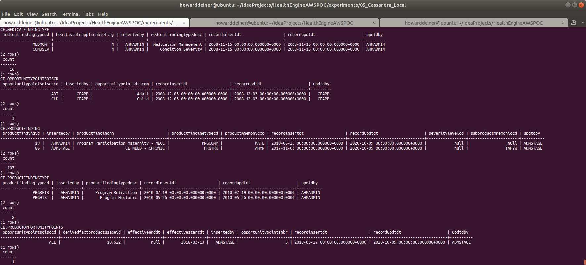

### Starting out with Cassandra

##### Concept

> Apache Cassandra is a free and open-source, distributed, wide column store, NoSQL database management system designed to handle large amounts of data across many commodity servers, providing high availability with no single point of failure. Cassandra offers robust support for clusters spanning multiple datacenters, with asynchronous masterless replication allowing low latency operations for all clients. Cassandra offers the distribution design of Amazon DynamoDB with the data model of Google's Bigtable.
> 
> Avinash Lakshman, one of the authors of Amazon's Dynamo, and Prashant Malik initially developed Cassandra at Facebook to power the Facebook inbox search feature. Facebook released Cassandra as an open-source project on Google code in July 2008. In March 2009 it became an Apache Incubator project. On February 17, 2010 it graduated to a top-level project.
>
> Facebook developers named their database after the Trojan mythological prophet Cassandra, with classical allusions to a curse on an oracle.
>
> https://en.wikipedia.org/wiki/Apache_Cassandra
>
> https://cassandra.apache.org

Why Cassandra?
<UL>
<LI>Designed for massive data</LI>
<LI>Designed to be fault tolerant</LI>
<LI>Built in peer-to-peer distribution synchronization</LI>
</UL>

#### Execution

We want to get into Cassandra quickly.  So, before we start running AWS instances, we need to master our data and how we're going to instantiate it in the database.

This whole project is about rearchitecting the database behind CareEngine, and we will try several different databases to do that.

Rather than rewrite each SQL DDL into each database's dialect, I will use a tool called Liquibase, which can do two things.
<UL>
<LI>Emit SQL DDL specific to each database from a common changeset</LI>
<LI>Use the notion of changesets to allow us to migrate the database created from one version to another.</LI>
</UL>
Unhappily, Liquibase support for Cassandra does not support the changeset.xml format yet.  That still seems to be under active development.  Never the less, we can use Liquibase with just the native cqlsh client, and achieve the same goals.  

### 01_startup.sh
This script uses docker-compose to take the 3.8.11 Dockerhub Cassandra image and bring it up in a container running as a daemon.  Since Cassandra wants to persist data, I use a Docker Volume, which I delete in 03_shutdown.sh

Since we do not want to make use of the database until it actually starts, I monitor the logs from the cassandra_container until I see a signature which tells me that the database has started.
```bash
#!/usr/bin/env bash

../../startExperiment.sh

bash -c 'cat << "EOF" > .script
#!/usr/bin/env bash
figlet -w 240 -f small "Startup Cassandra/CassandraWeb Locally"
docker volume rm 05_cassandra_local_cassandra_data
docker volume rm 05_cassandra_local_cassandra_config
docker volume rm 05_cassandra_local_cassandraweb_data
docker-compose -f docker-compose.yml up -d

figlet -w 240 -f small "Wait For Cassandra To Start"
while true ; do
  docker logs cassandra_container > stdout.txt 2> stderr.txt
  result=$(grep -c "Created default superuser role '"'"'cassandra'"'"'" stdout.txt)
  if [ $result = 1 ] ; then
    echo "Cassandra has started"
    break
  fi
  sleep 5
done
rm stdout.txt stderr.txt
EOF'
chmod +x .script
command time -v ./.script 2> .results
../../getExperimentalResults.sh
experiment=$(../../getExperimentNumber.sh)
../../getDataAsCSVline.sh .results ${experiment} "05_Cassandra_Local: Startup Cassandra Locally" >> Experimental\ Results.csv
../../putExperimentalResults.sh
rm .script .results Experimental\ Results.csv
```
### 02_populate.sh
This script first uses the running cassandra_container to run cqlsh to create a database (keystore) for us.

The script then runs liquibase to update the database to it's intended state.  More on that in a bit.

The script then demonstrates that the tables created have data in them, all managed by liquibase.  Since Liquibase is being used in a native sql form, I also have to import the csv data using native cqlsh COPY commands.
```bash
#!/usr/bin/env bash

figlet -w 240 -f small "Populate Cassandra Locally"

bash -c 'cat << "EOF" > .script
#!/usr/bin/env bash
figlet -w 240 -f small "Update Cassanda Schema"
docker exec cassandra_container cqlsh -e "CREATE KEYSPACE IF NOT EXISTS CE WITH replication = {'"'"'class'"'"': '"'"'SimpleStrategy'"'"', '"'"'replication_factor'"'"' : 1}"
liquibase update
EOF'
chmod +x .script
command time -v ./.script 2> .results
../../getExperimentalResults.sh
experiment=$(../../getExperimentNumber.sh)
../../getDataAsCSVline.sh .results ${experiment} "05_Cassandra_Local: Populate Cassandra Schema" >> Experimental\ Results.csv
../../putExperimentalResults.sh
rm .script .results Experimental\ Results.csv

bash -c 'cat << "EOF" > .script
#!/usr/bin/env bash
figlet -w 240 -f small "Get Cassandra Data from S3 Bucket"
../../data/transfer_from_s3_and_decrypt.sh ce.ClinicalCondition.csv
../../data/transfer_from_s3_and_decrypt.sh ce.DerivedFact.csv
../../data/transfer_from_s3_and_decrypt.sh ce.DerivedFactProductUsage.csv
../../data/transfer_from_s3_and_decrypt.sh ce.MedicalFinding.csv
../../data/transfer_from_s3_and_decrypt.sh ce.MedicalFindingType.csv
../../data/transfer_from_s3_and_decrypt.sh ce.OpportunityPointsDiscr.csv
../../data/transfer_from_s3_and_decrypt.sh ce.ProductFinding.csv
../../data/transfer_from_s3_and_decrypt.sh ce.ProductFindingType.csv
../../data/transfer_from_s3_and_decrypt.sh ce.ProductOpportunityPoints.csv
../../data/transfer_from_s3_and_decrypt.sh ce.Recommendation.csv
EOF'
chmod +x .script
command time -v ./.script 2> .results
../../getExperimentalResults.sh
experiment=$(../../getExperimentNumber.sh)
../../getDataAsCSVline.sh .results ${experiment} "05_Cassanda_Local: Get Data from S3 Bucket" >> Experimental\ Results.csv
../../putExperimentalResults.sh
rm .script .results Experimental\ Results.csv

bash -c 'cat << "EOF" > .script
#!/usr/bin/env bash
figlet -w 240 -f small "Process S3 Data into Cassandra CSV File For Inport"
../transform_Oracle_ce.ClinicalCondition_to_csv.sh
../transform_Oracle_ce.DerivedFact_to_csv.sh
../transform_Oracle_ce.DerivedFactProductUsage_to_csv.sh
../transform_Oracle_ce.MedicalFinding_to_csv.sh
../transform_Oracle_ce.MedicalFindingType_to_csv.sh
../transform_Oracle_ce.OpportunityPointsDiscr_to_csv.sh
../transform_Oracle_ce.ProductFinding_to_csv.sh
../transform_Oracle_ce.ProductFindingType_to_csv.sh
../transform_Oracle_ce.ProductOpportunityPoints_to_csv.sh
../transform_Oracle_ce.Recommendation_to_csv.sh
EOF'
chmod +x .script
command time -v ./.script 2> .results
../../getExperimentalResults.sh
experiment=$(../../getExperimentNumber.sh)
../../getDataAsCSVline.sh .results ${experiment} "05_Cassanda_Local: Process S3 Data into CSV Files For Import" >> Experimental\ Results.csv
../../putExperimentalResults.sh
rm .script .results Experimental\ Results.csv

bash -c 'cat << "EOF" > .script
#!/usr/bin/env bash
figlet -w 240 -f small "Load Cassandra Data"
echo "CE.CLINICAL_CONDITION"
docker cp ce.ClinicalCondition.csv cassandra_container:/tmp/ce.ClinicalCondition.csv
docker exec cassandra_container cqlsh -e "COPY CE.CLINICAL_CONDITION (CLINICAL_CONDITION_COD,CLINICAL_CONDITION_NAM,INSERTED_BY,REC_INSERT_DATE,REC_UPD_DATE,UPDATED_BY,CLINICALCONDITIONCLASSCD,CLINICALCONDITIONTYPECD,CLINICALCONDITIONABBREV) FROM '"'"'/tmp/ce.ClinicalCondition.csv'"'"' WITH DELIMITER='"'"','"'"' AND HEADER=TRUE"
echo "CE.DERIVEDFACT"
docker cp ce.DerivedFact.csv cassandra_container:/tmp/ce.DerivedFact.csv
docker exec cassandra_container cqlsh -e "COPY CE.DERIVEDFACT (DERIVEDFACTID,DERIVEDFACTTRACKINGID,DERIVEDFACTTYPEID,INSERTEDBY,RECORDINSERTDT,RECORDUPDTDT,UPDTDBY) FROM '"'"'/tmp/ce.DerivedFact.csv'"'"' WITH DELIMITER='"'"','"'"' AND HEADER=TRUE"
echo "CE.DERIVEDFACTPRODUCTUSAGE"
docker cp ce.DerivedFactProductUsage.csv cassandra_container:/tmp/ce.DerivedFactProductUsage.csv
docker exec cassandra_container cqlsh -e "COPY CE.DERIVEDFACTPRODUCTUSAGE (DERIVEDFACTPRODUCTUSAGEID,DERIVEDFACTID,PRODUCTMNEMONICCD,INSERTEDBY,RECORDINSERTDT,RECORDUPDTDT,UPDTDBY) FROM '"'"'/tmp/ce.DerivedFactProductUsage.csv'"'"' WITH DELIMITER='"'"','"'"' AND HEADER=TRUE"
echo "CE.DERIVEDFACTPRODUCTUSAGE"
docker cp ce.DerivedFactProductUsage.csv cassandra_container:/tmp/ce.DerivedFactProductUsage.csv
docker exec cassandra_container cqlsh -e "COPY CE.DERIVEDFACTPRODUCTUSAGE (DERIVEDFACTPRODUCTUSAGEID,DERIVEDFACTID,PRODUCTMNEMONICCD,INSERTEDBY,RECORDINSERTDT,RECORDUPDTDT,UPDTDBY) FROM '"'"'/tmp/ce.DerivedFactProductUsage.csv'"'"' WITH DELIMITER='"'"','"'"' AND HEADER=TRUE"
echo "CE.MEDICALFINDING"
docker cp ce.MedicalFinding.csv cassandra_container:/tmp/ce.MedicalFinding.csv
docker exec cassandra_container cqlsh -e "COPY CE.MEDICALFINDING (MEDICALFINDINGID,MEDICALFINDINGTYPECD,MEDICALFINDINGNM,SEVERITYLEVELCD,IMPACTABLEFLG,CLINICAL_CONDITION_COD,INSERTEDBY,RECORDINSERTDT,RECORDUPDTDT,UPDTDBY,ACTIVEFLG,OPPORTUNITYPOINTSDISCRCD) FROM '"'"'/tmp/ce.MedicalFinding.csv'"'"' WITH DELIMITER='"'"','"'"' AND HEADER=TRUE"
echo "CE.MEDICALFINDINGTYPE"
docker cp ce.MedicalFindingType.csv cassandra_container:/tmp/ce.MedicalFindingType.csv
docker exec cassandra_container cqlsh -e "COPY CE.MEDICALFINDINGTYPE (MEDICALFINDINGTYPECD,MEDICALFINDINGTYPEDESC,INSERTEDBY,RECORDINSERTDT,RECORDUPDTDT,UPDTDBY,HEALTHSTATEAPPLICABLEFLAG) FROM '"'"'/tmp/ce.MedicalFindingType.csv'"'"' WITH DELIMITER='"'"','"'"' AND HEADER=TRUE"
echo "CE.OPPORTUNITYPOINTSDISCR"
docker cp ce.OpportunityPointsDiscr.csv cassandra_container:/tmp/ce.OpportunityPointsDiscr.csv
docker exec cassandra_container cqlsh -e "COPY CE.OPPORTUNITYPOINTSDISCR (OPPORTUNITYPOINTSDISCRCD,OPPORTUNITYPOINTSDISCNM,INSERTEDBY,RECORDINSERTDT,RECORDUPDTDT,UPDTDBY) FROM '"'"'/tmp/ce.OpportunityPointsDiscr.csv'"'"' WITH DELIMITER='"'"','"'"' AND HEADER=TRUE"
echo "CE.PRODUCTFINDING"
docker cp ce.ProductFinding.csv cassandra_container:/tmp/ce.ProductFinding.csv
docker exec cassandra_container cqlsh -e "COPY CE.PRODUCTFINDING (PRODUCTFINDINGID,PRODUCTFINDINGNM,SEVERITYLEVELCD,PRODUCTFINDINGTYPECD,PRODUCTMNEMONICCD,SUBPRODUCTMNEMONICCD,INSERTEDBY,RECORDINSERTDT,RECORDUPDTDT,UPDTDBY) FROM '"'"'/tmp/ce.ProductFinding.csv'"'"' WITH DELIMITER='"'"','"'"' AND HEADER=TRUE"
echo "CE.PRODUCTFINDINGTYPE"
docker cp ce.ProductFindingType.csv cassandra_container:/tmp/ce.ProductFindingType.csv
docker exec cassandra_container cqlsh -e "COPY CE.PRODUCTFINDINGTYPE (PRODUCTFINDINGTYPECD,PRODUCTFINDINGTYPEDESC,INSERTEDBY,RECORDINSERTDT,RECORDUPDTDT,UPDTDBY) FROM '"'"'/tmp/ce.ProductFindingType.csv'"'"' WITH DELIMITER='"'"','"'"' AND HEADER=TRUE"
echo "CE.PRODUCTOPPORTUNITYPOINTS"
docker cp ce.ProductOpportunityPoints.csv cassandra_container:/tmp/ce.ProductOpportunityPoints.csv
docker exec cassandra_container cqlsh -e "COPY CE.PRODUCTOPPORTUNITYPOINTS (OPPORTUNITYPOINTSDISCCD,EFFECTIVESTARTDT,OPPORTUNITYPOINTSNBR,EFFECTIVEENDDT,DERIVEDFACTPRODUCTUSAGEID,INSERTEDBY,RECORDINSERTDT,RECORDUPDTDT,UPDTDBY) FROM '"'"'/tmp/ce.ProductOpportunityPoints.csv'"'"' WITH DELIMITER='"'"','"'"' AND HEADER=TRUE"
echo "CE.RECOMMENDATION"
docker cp ce.Recommendation.csv cassandra_container:/tmp/ce.Recommendation.csv
docker exec cassandra_container cqlsh -e "COPY CE.RECOMMENDATION (RECOMMENDATIONSKEY,RECOMMENDATIONID,RECOMMENDATIONCODE,RECOMMENDATIONDESC,RECOMMENDATIONTYPE,CCTYPE,CLINICALREVIEWTYPE,AGERANGEID,ACTIONCODE,THERAPEUTICCLASS,MDCCODE,MCCCODE,PRIVACYCATEGORY,INTERVENTION,RECOMMENDATIONFAMILYID,RECOMMENDPRECEDENCEGROUPID,INBOUNDCOMMUNICATIONROUTE,SEVERITY,PRIMARYDIAGNOSIS,SECONDARYDIAGNOSIS,ADVERSEEVENT,ICMCONDITIONID,WELLNESSFLAG,VBFELIGIBLEFLAG,COMMUNICATIONRANKING,PRECEDENCERANKING,PATIENTDERIVEDFLAG,LABREQUIREDFLAG,UTILIZATIONTEXTAVAILABLEF,SENSITIVEMESSAGEFLAG,HIGHIMPACTFLAG,ICMLETTERFLAG,REQCLINICIANCLOSINGFLAG,OPSIMPELMENTATIONPHASE,SEASONALFLAG,SEASONALSTARTDT,SEASONALENDDT,EFFECTIVESTARTDT,EFFECTIVEENDDT,RECORDINSERTDT,RECORDUPDTDT,INSERTEDBY,UPDTDBY,STANDARDRUNFLAG,INTERVENTIONFEEDBACKFAMILYID,CONDITIONFEEDBACKFAMILYID,ASHWELLNESSELIGIBILITYFLAG,HEALTHADVOCACYELIGIBILITYFLAG) FROM '"'"'/tmp/ce.Recommendation.csv'"'"' WITH DELIMITER='"'"','"'"' AND HEADER=TRUE"
EOF'
chmod +x .script
command time -v ./.script 2> .results
../../getExperimentalResults.sh
experiment=$(../../getExperimentNumber.sh)
../../getDataAsCSVline.sh .results ${experiment} "05_Cassanda_Local: Populate Oracle Data" >> Experimental\ Results.csv
../../putExperimentalResults.sh
rm .script .results Experimental\ Results.csv

bash -c 'cat << "EOF" > .script
#!/usr/bin/env bash
figlet -w 240 -f small "Check Cassanda Data"
echo "CE.CLINICAL_CONDITION"
docker exec cassandra_container cqlsh  -e '"'"'select * from CE.CLINICAL_CONDITION LIMIT 2;'"'"' | sed -r '"'"'s/(^.{240})(.*)/\1/'"'"' | sed -E '"'"'/Warnings \:|Aggregation query used without partition key|\(see tombstone_warn_threshold\)|yyy|^$/d'"'"'
docker exec cassandra_container cqlsh  -e '"'"'select count(*) from CE.CLINICAL_CONDITION;'"'"' | sed -r '"'"'s/(^.{240})(.*)/\1/'"'"' | sed -E '"'"'/Warnings \:|Aggregation query used without partition key|\(see tombstone_warn_threshold\)|yyy|^$/d'"'"'
echo "CE.DERIVEDFACT"
docker exec cassandra_container cqlsh  -e '"'"'select * from CE.DERIVEDFACT LIMIT 2;'"'"' | sed -r '"'"'s/(^.{240})(.*)/\1/'"'"' | sed -E '"'"'/Warnings \:|Aggregation query used without partition key|\(see tombstone_warn_threshold\)|yyy|^$/d'"'"'
docker exec cassandra_container cqlsh  -e '"'"'select count(*) from CE.DERIVEDFACT;'"'"' | sed -r '"'"'s/(^.{240})(.*)/\1/'"'"' | sed -E '"'"'/Warnings \:|Aggregation query used without partition key|\(see tombstone_warn_threshold\)|yyy|^$/d'"'"'
echo "CE.DERIVEDFACTPRODUCTUSAGE"
docker exec cassandra_container cqlsh  -e '"'"'select * from CE.DERIVEDFACTPRODUCTUSAGE LIMIT 2;'"'"' | sed -r '"'"'s/(^.{240})(.*)/\1/'"'"' | sed -E '"'"'/Warnings \:|Aggregation query used without partition key|\(see tombstone_warn_threshold\)|yyy|^$/d'"'"'
docker exec cassandra_container cqlsh  -e '"'"'select count(*) from CE.DERIVEDFACTPRODUCTUSAGE;'"'"' | sed -r '"'"'s/(^.{240})(.*)/\1/'"'"' | sed -E '"'"'/Warnings \:|Aggregation query used without partition key|\(see tombstone_warn_threshold\)|yyy|^$/d'"'"'
echo "CE.MEDICALFINDING"
docker exec cassandra_container cqlsh  -e '"'"'select * from CE.MEDICALFINDING LIMIT 2;'"'"' | sed -r '"'"'s/(^.{240})(.*)/\1/'"'"' | sed -E '"'"'/Warnings \:|Aggregation query used without partition key|\(see tombstone_warn_threshold\)|yyy|^$/d'"'"'
docker exec cassandra_container cqlsh  -e '"'"'select count(*) from CE.MEDICALFINDING;'"'"' | sed -r '"'"'s/(^.{240})(.*)/\1/'"'"' | sed -E '"'"'/Warnings \:|Aggregation query used without partition key|\(see tombstone_warn_threshold\)|yyy|^$/d'"'"'
echo "CE.MEDICALFINDINGTYPE"
docker exec cassandra_container cqlsh  -e '"'"'select * from CE.MEDICALFINDINGTYPE LIMIT 2;'"'"' | sed -r '"'"'s/(^.{240})(.*)/\1/'"'"' | sed -E '"'"'/Warnings \:|Aggregation query used without partition key|\(see tombstone_warn_threshold\)|yyy|^$/d'"'"'
docker exec cassandra_container cqlsh  -e '"'"'select count(*) from CE.MEDICALFINDINGTYPE;'"'"' | sed -r '"'"'s/(^.{240})(.*)/\1/'"'"' | sed -E '"'"'/Warnings \:|Aggregation query used without partition key|\(see tombstone_warn_threshold\)|yyy|^$/d'"'"'
echo "CE.OPPORTUNITYPOINTSDISCR"
docker exec cassandra_container cqlsh  -e '"'"'select * from CE.OPPORTUNITYPOINTSDISCR LIMIT 2;'"'"' | sed -r '"'"'s/(^.{240})(.*)/\1/'"'"' | sed -E '"'"'/Warnings \:|Aggregation query used without partition key|\(see tombstone_warn_threshold\)|yyy|^$/d'"'"'
docker exec cassandra_container cqlsh  -e '"'"'select count(*) from CE.OPPORTUNITYPOINTSDISCR;'"'"' | sed -r '"'"'s/(^.{240})(.*)/\1/'"'"' | sed -E '"'"'/Warnings \:|Aggregation query used without partition key|\(see tombstone_warn_threshold\)|yyy|^$/d'"'"'
echo "CE.PRODUCTFINDING"
docker exec cassandra_container cqlsh  -e '"'"'select * from CE.PRODUCTFINDING LIMIT 2;'"'"' | sed -r '"'"'s/(^.{240})(.*)/\1/'"'"' | sed -E '"'"'/Warnings \:|Aggregation query used without partition key|\(see tombstone_warn_threshold\)|yyy|^$/d'"'"'
docker exec cassandra_container cqlsh  -e '"'"'select count(*) from CE.PRODUCTFINDING;'"'"' | sed -r '"'"'s/(^.{240})(.*)/\1/'"'"' | sed -E '"'"'/Warnings \:|Aggregation query used without partition key|\(see tombstone_warn_threshold\)|yyy|^$/d'"'"'
echo "CE.PRODUCTFINDINGTYPE"
docker exec cassandra_container cqlsh  -e '"'"'select * from CE.PRODUCTFINDINGTYPE LIMIT 2;'"'"' | sed -r '"'"'s/(^.{240})(.*)/\1/'"'"' | sed -E '"'"'/Warnings \:|Aggregation query used without partition key|\(see tombstone_warn_threshold\)|yyy|^$/d'"'"'
docker exec cassandra_container cqlsh  -e '"'"'select count(*) from CE.PRODUCTFINDINGTYPE;'"'"' | sed -r '"'"'s/(^.{240})(.*)/\1/'"'"' | sed -E '"'"'/Warnings \:|Aggregation query used without partition key|\(see tombstone_warn_threshold\)|yyy|^$/d'"'"'
echo "CE.PRODUCTOPPORTUNITYPOINTS"
docker exec cassandra_container cqlsh  -e '"'"'select * from CE.PRODUCTOPPORTUNITYPOINTS LIMIT 2;'"'"' | sed -r '"'"'s/(^.{240})(.*)/\1/'"'"' | sed -E '"'"'/Warnings \:|Aggregation query used without partition key|\(see tombstone_warn_threshold\)|yyy|^$/d'"'"'
docker exec cassandra_container cqlsh  -e '"'"'select count(*) from CE.PRODUCTOPPORTUNITYPOINTS;'"'"' | sed -r '"'"'s/(^.{240})(.*)/\1/'"'"' | sed -E '"'"'/Warnings \:|Aggregation query used without partition key|\(see tombstone_warn_threshold\)|yyy|^$/d'"'"'
echo "CE.RECOMMENDATION"
docker exec cassandra_container cqlsh  -e '"'"'select * from CE.RECOMMENDATION WHERE recommendationskey;'"'"' | sed -r '"'"'s/(^.{240})(.*)/\1/'"'"' | sed -E '"'"'/Warnings \:|Aggregation query used without partition key|\(see tombstone_warn_threshold\)|yyy|^$/d'"'"'
docker exec cassandra_container cqlsh  -e '"'"'select count(*) from CE.RECOMMENDATION;'"'"' | sed -r '"'"'s/(^.{240})(.*)/\1/'"'"' | sed -E '"'"'/Warnings \:|Aggregation query used without partition key|\(see tombstone_warn_threshold\)|yyy|^$/d'"'"'
EOF'
chmod +x .script
command time -v ./.script 2> .results
../../getExperimentalResults.sh
experiment=$(../../getExperimentNumber.sh)
../../getDataAsCSVline.sh .results ${experiment} "05_Cassanda_Local: Check Cassanda Data" >> Experimental\ Results.csv
../../putExperimentalResults.sh
rm .script .results *.csv
```
Liquibase itself is controlled by a liquibase.properties file for now.
```bash
changeLogFile: ../../src/java/CassandraTranslator/changeSet.cassandra.sql
url:  jdbc:cassandra://localhost:9042/CE;DefaultKeyspace=CE
username:  cassandra
password:  cassandra
driver: com.simba.cassandra.jdbc42.Driver
defaultSchemaName: CE
classpath:  ../../liquibase_drivers/CassandraJDBC42.jar:../../liquibase_drivers/liquibase-cassandra-4.0.0.2.jar
```
It is also using this changeSet.cassandrq.sql, produced by the CassandraTranslator, which uses ANTLR4 for lexing, parsing, and producing the changeset from the present Oracle DDL.
```sql
--liquibase formatted sql


--changeset CE:1
CREATE TABLE CE.OPPORTUNITYPOINTSDISCR (
	OPPORTUNITYPOINTSDISCNM VARCHAR,
	INSERTEDBY VARCHAR,
	RECORDINSERTDT TIMESTAMP,
	RECORDUPDTDT TIMESTAMP,
	UPDTDBY VARCHAR,
	OPPORTUNITYPOINTSDISCRCD VARCHAR PRIMARY KEY
)
--rollback DROP TABLE CE.OPPORTUNITYPOINTSDISCR;


--changeset CE:2
CREATE TABLE CE.DERIVEDFACT (
	DERIVEDFACTTRACKINGID BIGINT,
	DERIVEDFACTTYPEID BIGINT,
	INSERTEDBY VARCHAR,
	RECORDINSERTDT TIMESTAMP,
	RECORDUPDTDT TIMESTAMP,
	UPDTDBY VARCHAR,
	DERIVEDFACTID BIGINT PRIMARY KEY
)
--rollback DROP TABLE CE.DERIVEDFACT;


--changeset CE:3
CREATE TABLE CE.RECOMMENDATIONTEXT (
	RECOMMENDATIONTEXTID BIGINT PRIMARY KEY,
	RECOMMENDATIONID BIGINT,
	LANGUAGECD VARCHAR,
	RECOMMENDATIONTEXTTYPE VARCHAR,
	MESSAGETYPE VARCHAR,
	RECOMMENDATIONTITLE VARCHAR,
	RECOMMENDATIONTEXT VARCHAR,
	RECORDINSERTDT TIMESTAMP,
	RECORDUPDATEDT TIMESTAMP,
	INSERTEDBY VARCHAR,
	UPDATEDBY VARCHAR,
	DEFAULTIN VARCHAR
)
--rollback DROP TABLE CE.RECOMMENDATIONTEXT;


--changeset CE:4
CREATE TABLE CE.CLINICAL_CONDITION (
	CLINICAL_CONDITION_NAM VARCHAR,
	INSERTED_BY VARCHAR,
	REC_INSERT_DATE DATE,
	REC_UPD_DATE DATE,
	UPDATED_BY VARCHAR,
	CLINICALCONDITIONCLASSCD BIGINT,
	CLINICALCONDITIONTYPECD VARCHAR,
	CLINICALCONDITIONABBREV VARCHAR,
	CLINICAL_CONDITION_COD BIGINT PRIMARY KEY
)
--rollback DROP TABLE CE.CLINICAL_CONDITION;


--changeset CE:5
CREATE TABLE CE.PRODUCTOPPORTUNITYPOINTS (
	OPPORTUNITYPOINTSDISCCD VARCHAR PRIMARY KEY,
	EFFECTIVESTARTDT DATE,
	OPPORTUNITYPOINTSNBR BIGINT,
	EFFECTIVEENDDT DATE,
	DERIVEDFACTPRODUCTUSAGEID BIGINT,
	INSERTEDBY VARCHAR,
	RECORDINSERTDT TIMESTAMP,
	RECORDUPDTDT TIMESTAMP,
	UPDTDBY VARCHAR
)
--rollback DROP TABLE CE.PRODUCTOPPORTUNITYPOINTS;


--changeset CE:6
CREATE TABLE CE.MEDICALFINDING (
	MEDICALFINDINGID BIGINT PRIMARY KEY,
	MEDICALFINDINGTYPECD VARCHAR,
	MEDICALFINDINGNM VARCHAR,
	SEVERITYLEVELCD VARCHAR,
	IMPACTABLEFLG VARCHAR,
	CLINICAL_CONDITION_COD BIGINT,
	INSERTEDBY VARCHAR,
	RECORDINSERTDT TIMESTAMP,
	RECORDUPDTDT TIMESTAMP,
	UPDTDBY VARCHAR,
	ACTIVEFLG VARCHAR,
	OPPORTUNITYPOINTSDISCRCD VARCHAR
)
--rollback DROP TABLE CE.MEDICALFINDING;


--changeset CE:7
CREATE TABLE CE.DERIVEDFACTPRODUCTUSAGE (
	DERIVEDFACTID BIGINT,
	PRODUCTMNEMONICCD VARCHAR,
	INSERTEDBY VARCHAR,
	RECORDINSERTDT TIMESTAMP,
	RECORDUPDTDT TIMESTAMP,
	UPDTDBY VARCHAR,
	DERIVEDFACTPRODUCTUSAGEID BIGINT PRIMARY KEY
)
--rollback DROP TABLE CE.DERIVEDFACTPRODUCTUSAGE;


--changeset CE:8
CREATE TABLE CE.PRODUCTFINDINGTYPE (
	PRODUCTFINDINGTYPECD VARCHAR PRIMARY KEY,
	PRODUCTFINDINGTYPEDESC VARCHAR,
	INSERTEDBY VARCHAR,
	RECORDINSERTDT TIMESTAMP,
	RECORDUPDTDT TIMESTAMP,
	UPDTDBY VARCHAR
)
--rollback DROP TABLE CE.PRODUCTFINDINGTYPE;


--changeset CE:9
CREATE TABLE CE.RECOMMENDATION (
	RECOMMENDATIONSKEY BIGINT PRIMARY KEY,
	RECOMMENDATIONID BIGINT,
	RECOMMENDATIONCODE VARCHAR,
	RECOMMENDATIONDESC VARCHAR,
	RECOMMENDATIONTYPE VARCHAR,
	CCTYPE VARCHAR,
	CLINICALREVIEWTYPE VARCHAR,
	AGERANGEID BIGINT,
	ACTIONCODE VARCHAR,
	THERAPEUTICCLASS VARCHAR,
	MDCCODE VARCHAR,
	MCCCODE VARCHAR,
	PRIVACYCATEGORY VARCHAR,
	INTERVENTION VARCHAR,
	RECOMMENDATIONFAMILYID BIGINT,
	RECOMMENDPRECEDENCEGROUPID BIGINT,
	INBOUNDCOMMUNICATIONROUTE VARCHAR,
	SEVERITY VARCHAR,
	PRIMARYDIAGNOSIS VARCHAR,
	SECONDARYDIAGNOSIS VARCHAR,
	ADVERSEEVENT VARCHAR,
	ICMCONDITIONID BIGINT,
	WELLNESSFLAG VARCHAR,
	VBFELIGIBLEFLAG VARCHAR,
	COMMUNICATIONRANKING BIGINT,
	PRECEDENCERANKING BIGINT,
	PATIENTDERIVEDFLAG VARCHAR,
	LABREQUIREDFLAG VARCHAR,
	UTILIZATIONTEXTAVAILABLEF VARCHAR,
	SENSITIVEMESSAGEFLAG VARCHAR,
	HIGHIMPACTFLAG VARCHAR,
	ICMLETTERFLAG VARCHAR,
	REQCLINICIANCLOSINGFLAG VARCHAR,
	OPSIMPELMENTATIONPHASE BIGINT,
	SEASONALFLAG VARCHAR,
	SEASONALSTARTDT DATE,
	SEASONALENDDT DATE,
	EFFECTIVESTARTDT DATE,
	EFFECTIVEENDDT DATE,
	RECORDINSERTDT TIMESTAMP,
	RECORDUPDTDT TIMESTAMP,
	INSERTEDBY VARCHAR,
	UPDTDBY VARCHAR,
	STANDARDRUNFLAG VARCHAR,
	INTERVENTIONFEEDBACKFAMILYID BIGINT,
	CONDITIONFEEDBACKFAMILYID BIGINT,
	ASHWELLNESSELIGIBILITYFLAG VARCHAR,
	HEALTHADVOCACYELIGIBILITYFLAG VARCHAR
)
--rollback DROP TABLE CE.RECOMMENDATION;


--changeset CE:10
CREATE TABLE CE.PRODUCTFINDING (
	PRODUCTFINDINGID BIGINT PRIMARY KEY,
	PRODUCTFINDINGNM VARCHAR,
	SEVERITYLEVELCD VARCHAR,
	PRODUCTFINDINGTYPECD VARCHAR,
	PRODUCTMNEMONICCD VARCHAR,
	SUBPRODUCTMNEMONICCD VARCHAR,
	INSERTEDBY VARCHAR,
	RECORDINSERTDT TIMESTAMP,
	RECORDUPDTDT TIMESTAMP,
	UPDTDBY VARCHAR
)
--rollback DROP TABLE CE.PRODUCTFINDING;


--changeset CE:11
CREATE TABLE CE.MEDICALFINDINGTYPE (
	MEDICALFINDINGTYPEDESC VARCHAR,
	INSERTEDBY VARCHAR,
	RECORDINSERTDT TIMESTAMP,
	RECORDUPDTDT TIMESTAMP,
	UPDTDBY VARCHAR,
	HEALTHSTATEAPPLICABLEFLAG VARCHAR,
	MEDICALFINDINGTYPECD VARCHAR PRIMARY KEY
)
--rollback DROP TABLE CE.MEDICALFINDINGTYPE;
```

### 03_startup_app.sh
Here, we bring up the CECacheServer with docker-compose with the same network as we used to bring up Apache Ignite in, so the CECacheServer can make requests of the database.
<BR/>
Normally, we would do this in the 01_startup.sh script, but we want to seperate out the effects of the database from the application for performance collection purposes, so we do it here.

```bash
#!/usr/bin/env bash

bash -c 'cat << "EOF" > .script
#!/usr/bin/env bash
figlet -w 240 -f small "Startup CECacheServer Locally"
docker volume rm 07_oracle_local_oracle_data
docker-compose -f docker-compose.app.yml up -d --build

echo "Wait For CECacheServer To Start"
while true ; do
  docker logs cecacheserver_fororacle_container > stdout.txt 2> stderr.txt
#  result=$(grep -cE "<<<<< Local Cache Statistics <<<<<" stdout.txt) cecacheserver_formongodb_container is failing!
  result=$(grep -cE "using Agent sizeof engine" stdout.txt)
  if [ $result != 0 ] ; then
    echo "CECacheServer has started"
    break
  fi
  sleep 5
done
rm stdout.txt stderr.txt
EOF'
chmod +x .script
command time -v ./.script 2> .results
../../getExperimentalResults.sh
experiment=$(../../getExperimentNumber.sh)
../../getDataAsCSVline.sh .results ${experiment} "07_Oracle_Local: Startup CECacheServer Locally" >> Experimental\ Results.csv
../../putExperimentalResults.sh
rm .script .results Experimental\ Results.csv
```

### 03_startup_app.sh
Here, we bring up the CECacheServer with docker-compose with the same network as we used to bring up Apache Cassandra in, so the CECacheServer can make requests of the database.
<BR/>
Normally, we would do this in the 01_startup.sh script, but we want to seperate out the effects of the database from the application for performance collection purposes, so we do it here.

```bash
#!/usr/bin/env bash

bash -c 'cat << "EOF" > .script
#!/usr/bin/env bash
figlet -w 160 -f small "Startup CECacheServer Locally"
docker volume rm 05_cassandra_local_cecacheserver_data
docker-compose -f docker-compose.app.yml up -d --build

echo "Wait For CECacheServer To Start"
while true ; do
  docker logs cecacheserver_forcassandra_container > stdout.txt 2> stderr.txt
  result=$(grep -cE "<<<<< Local Cache Statistics <<<<<" stdout.txt)
  if [ $result != 0 ] ; then
    echo "CECacheServer has started"
    break
  fi
  sleep 5
done
rm stdout.txt stderr.txt
EOF'
chmod +x .script
command time -v ./.script 2> .results
../../getExperimentalResults.sh
experiment=$(../../getExperimentNumber.sh)
../../getDataAsCSVline.sh .results ${experiment} "05_Cassandra_Local: Startup CECacheServer Locally" >> Experimental\ Results.csv
../../putExperimentalResults.sh
rm .script .results Experimental\ Results.csv
```

### 04_shutdown.sh
This script is brutely simple.  It uses docker-compose to bring down the environment it established, and then uses docker volume rm to delete the data which held the bits for out database data.

```bash
#!/usr/bin/env bash

bash -c 'cat << "EOF" > .script
#!/usr/bin/env bash
figlet -w 240 -f small "Shutdown Cassandra and CECacheServer Locally"
docker-compose -f docker-compose.app.yml down
docker volume rm 05_cassandra_local_cecacheserver_data
docker-compose -f docker-compose.yml -f docker-compose.app.yml down
docker volume rm 05_cassandra_local_cassandra_data
docker volume rm 05_cassandra_local_cassandra_config
docker volume rm 05_cassandra_local_cassandraweb_data
EOF'
chmod +x .script
command time -v ./.script 2> .results
../../getExperimentalResults.sh
experiment=$(../../getExperimentNumber.sh)
../../getDataAsCSVline.sh .results ${experiment} "05_Cassandra_Local: Shutdown Cassandra and CECacheServer Locally" >> Experimental\ Results.csv
../../putExperimentalResults.sh
rm .script .results Experimental\ Results.csv

../../endExperiment.sh
```

### Putting it all together...

It all looks something like this:

\
<BR />
\
\
\
\
\
\
<BR />
\
<BR />
\
<BR />
And just for laughs, here's the timings for this run.  All kept in a csv file in S3 at s3://health-engine-aws-poc/Experimental Results.csv
\
<BR />

### Large Data Experiments

A different script is available for large data testing.  This transfers the dataset for large volume testing.  It uses the data from the "Complete 2019 Program Year Open Payments Dataset" from the Center for Medicare & Medicade Services.  See https://www.cms.gov/OpenPayments/Explore-the-Data/Dataset-Downloads for details.  In total, there is over 6GB in this dataset.

The script 02_populate_large_data.sh is a variation on 02_populate.sh.
```bash
#!/usr/bin/env bash

if [ $# -eq 0 ]
  then
    echo "must supply the command with the number of rows to use"
    exit 1
fi

re='^[0-9]+$'
if ! [[ $1 =~ $re ]] ; then
    echo "must supply the command with the number of rows to use"
   exit 1
fi

ROWS=$1
export ROWS

bash -c 'cat << "EOF" > .script
#!/usr/bin/env bash

echo $1

figlet -w 240 -f small " Populate Cassandra Locally - Large Data - $(numfmt --grouping $ROWS) rows"

figlet -w 240 -f small " Populate Cassandra Locally"

figlet -w 240 -f small "Apply Schema for Cassandra - Large Data - $(numfmt --grouping $ROWS) rows"
docker exec cassandra_container cqlsh -e "CREATE KEYSPACE IF NOT EXISTS PGYR19_P063020 WITH replication = {'"'"'class'"'"': '"'"'SimpleStrategy'"'"', '"'"'replication_factor'"'"' : 1}"
docker exec cassandra_container cqlsh -e "$(<../../ddl/PGYR19_P063020/changeset.cassandra.sql)"

EOF'
chmod +x .script
command time -v ./.script 2> .results
../../getExperimentalResults.sh
experiment=$(../../getExperimentNumber.sh)
../../getDataAsCSVline.sh .results ${experiment} "05_Cassandra_Local: Populate Cassandra Schema - Large Data - $ROWS rows" >> Experimental\ Results.csv
../../putExperimentalResults.sh
rm .script .results  Experimental\ Results.csv

bash -c 'cat << "EOF" > .script
#!/usr/bin/env bash
figlet -w 240 -f small "Get Data from S3 Bucket"
../../data/transferPGYR19_P063020_from_s3_and_decrypt.sh
EOF'
chmod +x .script
command time -v ./.script 2> .results
../../getExperimentalResults.sh
experiment=$(../../getExperimentNumber.sh)
../../getDataAsCSVline.sh .results ${experiment} "05_Cassandra_Local: Get Data from S3 Bucket - Large Data - $ROWS rows" >> Experimental\ Results.csv
../../putExperimentalResults.sh
rm .script .results Experimental\ Results.csv
ls -lh /tmp/PGYR19_P063020

command time -v ./02_populate_large_data_load_data.sh $ROWS 2> .results
../../getExperimentalResults.sh
experiment=$(../../getExperimentNumber.sh)
../../getDataAsCSVline.sh .results ${experiment} "05_Cassandra_Local: Populate Cassandra Data - Large Data - $ROWS rows" >> Experimental\ Results.csv
../../putExperimentalResults.sh
rm -rf .script .results Experimental\ Results.csv

bash -c 'cat << "EOF" > .script
#!/usr/bin/env bash
figlet -w 240 -f small "Check Cassandra Data - Large Data - $(numfmt --grouping $ROWS) rows"
echo ""
echo "First two rows of data"
docker exec cassandra_container cqlsh -e "select * from PGYR19_P063020.PI LIMIT 2;" 2> /dev/tty
echo ""
echo "Count of rows of data"
docker exec cassandra_container cqlsh -e "select count(*) from PGYR19_P063020.PI;" 2> /dev/tty
echo ""
echo "Average of total_amount_of_payment_usdollars"
docker exec cassandra_container cqlsh -e "select avg(total_amount_of_payment_usdollars) from PGYR19_P063020.PI;" 2> /dev/tty
echo ""
echo "Top ten earning physicians"
docker exec cassandra_container cqlsh -e "SELECT physician_first_name, physician_last_name, SUM(total_amount_of_payment_usdollars), COUNT(total_amount_of_payment_usdollars) FROM PGYR19_P063020.PI WHERE physician_first_name IS NOT NULL AND physician_last_name IS NOT NULL GROUP BY physician_first_name, physician_last_name ORDER BY SUM(total_amount_of_payment_usdollars) DESC LIMIT 10;" 2> /dev/tty
EOF'

chmod +x .script
command time -v ./.script 2> .results
../../getExperimentalResults.sh
experiment=$(../../getExperimentNumber.sh)
../../getDataAsCSVline.sh .results ${experiment} "05_Cassandra_Local: Check Cassandra Data - Large Data - $ROWS rows" >> Experimental\ Results.csv
../../putExperimentalResults.sh
rm -rf .script .sql .results *.csv /tmp/PGYR19_P063020
```
As you can see, a helper script is used to actually do the data load, called 02_populate_large_data_load_data.sh.  It looks like:
```bash
#!/usr/bin/env bash

ROWS=$1

figlet -w 240 -f small "Populate Cassandra Data - Large Data - $ROWS rows"
head -n `echo "$ROWS+1" | bc` /tmp/PGYR19_P063020/OP_DTL_GNRL_PGYR2019_P06302020.csv > /tmp/PGYR19_P063020/OP_DTL_GNRL_PGYR2019_P06302020.subset.csv
sed --in-place s/Applicable_Manufacturer_or_Applicable_GPO_Making_Payment_Country/Applicable_Manufacturer_or_Applicable_GPO_Making_Payment_Countr/g /tmp/PGYR19_P063020/OP_DTL_GNRL_PGYR2019_P06302020.subset.csv
sed --in-place s/Name_of_Third_Party_Entity_Receiving_Payment_or_Transfer_of_Value/Name_of_Third_Party_Entity_Receiving_Payment_or_transfer_of_Val/g /tmp/PGYR19_P063020/OP_DTL_GNRL_PGYR2019_P06302020.subset.csv
head -n 1 /tmp/PGYR19_P063020/OP_DTL_GNRL_PGYR2019_P06302020.subset.csv > .columns

echo "COPY PGYR19_P063020.PI " > .command
echo " ($(<.columns)) " >> .command
echo " FROM '/tmp/OP_DTL_GNRL_PGYR2019_P06302020.subset.csv' " >> .command
echo " WITH DELIMITER=',' " >> .command
echo " AND DATETIMEFORMAT='%m/%d/%Y' " >> .command
echo " AND NULL='n/a' " >> .command
echo " AND HEADER=TRUE " >> .command

docker cp /tmp/PGYR19_P063020/OP_DTL_GNRL_PGYR2019_P06302020.subset.csv cassandra_container:/tmp/OP_DTL_GNRL_PGYR2019_P06302020.subset.csv
docker exec cassandra_container cqlsh -e "$(<.command)"
#docker exec cassandra_container cqlsh -e "ALTER TABLE PGYR19_P063020.PI WITH gc_grace_seconds = '0'" # get rid of tombstone
#docker exec cassandra_container nodetool compact # get rid of tombstones
rm .columns .command
```


It uses the following schema.
```sql
CREATE TABLE PGYR19_P063020.PI (
                                   change_type VARCHAR,
                                   covered_recipient_type VARCHAR,
                                   teaching_hospital_ccn VARCHAR,
                                   teaching_hospital_id INT,
                                   teaching_hospital_name VARCHAR,
                                   physician_profile_id INT,
                                   physician_first_name VARCHAR,
                                   physician_middle_name VARCHAR,
                                   physician_last_name VARCHAR,
                                   physician_name_suffix VARCHAR,
                                   recipient_primary_business_street_address_line1 VARCHAR,
                                   recipient_primary_business_street_address_line2 VARCHAR,
                                   recipient_city VARCHAR,
                                   recipient_state VARCHAR,
                                   recipient_zip_code VARCHAR,
                                   recipient_country VARCHAR,
                                   recipient_province VARCHAR,
                                   recipient_postal_code VARCHAR,
                                   physician_primary_type VARCHAR,
                                   physician_specialty VARCHAR,
                                   physician_license_state_code1 VARCHAR,
                                   physician_license_state_code2 VARCHAR,
                                   physician_license_state_code3 VARCHAR,
                                   physician_license_state_code4 VARCHAR,
                                   physician_license_state_code5 VARCHAR,
                                   submitting_applicable_manufacturer_or_applicable_gpo_name VARCHAR,
                                   applicable_manufacturer_or_applicable_gpo_making_payment_id VARCHAR,
                                   applicable_manufacturer_or_applicable_gpo_making_payment_name VARCHAR,
                                   applicable_manufacturer_or_applicable_gpo_making_payment_state VARCHAR,
                                   applicable_manufacturer_or_applicable_gpo_making_payment_countr VARCHAR,
                                   total_amount_of_payment_usdollars DECIMAL,
                                   date_of_payment TIMESTAMP,
                                   number_of_payments_included_in_total_amount INT,
                                   form_of_payment_or_transfer_of_value VARCHAR,
                                   nature_of_payment_or_transfer_of_value VARCHAR,
                                   city_of_travel VARCHAR,
                                   state_of_travel VARCHAR,
                                   country_of_travel VARCHAR,
                                   physician_ownership_indicator VARCHAR,
                                   third_party_payment_recipient_indicator VARCHAR,
                                   name_of_third_party_entity_receiving_payment_or_transfer_of_val VARCHAR,
                                   charity_indicator VARCHAR,
                                   third_party_equals_covered_recipient_indicator VARCHAR,
                                   contextual_information VARCHAR,
                                   delay_in_publication_indicator VARCHAR,
                                   record_id INT PRIMARY KEY,
                                   dispute_status_for_publication VARCHAR,
                                   related_product_indicator VARCHAR,
                                   covered_or_noncovered_indicator_1 VARCHAR,
                                   indicate_drug_or_biological_or_device_or_medical_supply_1 VARCHAR,
                                   product_category_or_therapeutic_area_1 VARCHAR,
                                   name_of_drug_or_biological_or_device_or_medical_supply_1 VARCHAR,
                                   associated_drug_or_biological_ndc_1 VARCHAR,
                                   covered_or_noncovered_indicator_2 VARCHAR,
                                   indicate_drug_or_biological_or_device_or_medical_supply_2 VARCHAR,
                                   product_category_or_therapeutic_area_2 VARCHAR,
                                   name_of_drug_or_biological_or_device_or_medical_supply_2 VARCHAR,
                                   associated_drug_or_biological_ndc_2 VARCHAR,
                                   covered_or_noncovered_indicator_3 VARCHAR,
                                   indicate_drug_or_biological_or_device_or_medical_supply_3 VARCHAR,
                                   product_category_or_therapeutic_area_3 VARCHAR,
                                   name_of_drug_or_biological_or_device_or_medical_supply_3 VARCHAR,
                                   associated_drug_or_biological_ndc_3 VARCHAR,
                                   covered_or_noncovered_indicator_4 VARCHAR,
                                   indicate_drug_or_biological_or_device_or_medical_supply_4 VARCHAR,
                                   product_category_or_therapeutic_area_4 VARCHAR,
                                   name_of_drug_or_biological_or_device_or_medical_supply_4 VARCHAR,
                                   associated_drug_or_biological_ndc_4 VARCHAR,
                                   covered_or_noncovered_indicator_5 VARCHAR,
                                   indicate_drug_or_biological_or_device_or_medical_supply_5 VARCHAR,
                                   product_category_or_therapeutic_area_5 VARCHAR,
                                   name_of_drug_or_biological_or_device_or_medical_supply_5 VARCHAR,
                                   associated_drug_or_biological_ndc_5 VARCHAR,
                                   program_year TEXT,
                                   payment_publication_date TIMESTAMP
);
```
<BR />
When run in conjunction with 01_startup.sh and 04_shutdown.sh for a sample size of 1,000,000 records, you will see:

\
\
\
\
<BR />
As you can see, the final three tests failed.  Let's describe and discuss.

The first failure is on a rather easy bit of SQL.
```sql
select count(*) from PGYR19_P063020.PI;
```
What's going on here.  Several things.  

First, remember that the central goals of Cassandra revolve around Fault Tolerance, decentralization, scalability to PB scales, and durability.  And that brings us to the issue of tombstones.

In Cassandra, deleted data is not immediately purged from the disk. Instead, Cassandra writes a special value, known as a tombstone, to indicate that data has been deleted. Tombstones prevent deleted data from being returned during reads, and will eventually allow the data to be dropped via compaction. Tombstones are writes – they go through the normal write path, take up space on disk, and make use of Cassandra’s consistency mechanisms. Tombstones can be propagated across the cluster via hints and repairs. If a cluster is managed properly, this ensures that data will remain deleted even if a node is down when the delete is issued.  

Tombstones are also created when null data is imported into the database.  If you carefully look at 02_populate_large_data_load_data.sh, you will see that I avoid the tombstone issue by converting NULL to the string 'n/a'.  I even tried more agressive options to rid ourselves of tombstones (which are actually poor ideas on production use) of using nodetool to compact the database and reduce the time to live for tombstone data to zero.

Those measures get rid of tombstones for our purposes, but then surface a more deeply disturbing issue.  Cassandra does not like table scans.  There is an option for cqlsh to "ALLOW FILTERING" if you absolutely need to tell Cassandra to return a resukt set that requires a table scan, but that brings up an even graver problem: performance for such querries are so slow that the server times out from the client.  You can see these on the colsole output during the test run.  It's possible to change the timeout values to make these timeouts have longer values, but doing so on the Cassandra image would require a change to the Dockfile for Cassandra, which I didn't feel like doing.

Then there's the matter of grouping, aggregation, and ordering.

This fairly simple query fails. 
```sql
SELECT physician_first_name, physician_last_name, SUM(total_amount_of_payment_usdollars), COUNT(total_amount_of_payment_usdollars) 
FROM PGYR19_P063020.PI 
WHERE physician_first_name IS NOT NULL AND physician_last_name IS NOT NULL 
GROUP BY physician_first_name, physician_last_name 
ORDER BY SUM(total_amount_of_payment_usdollars) DESC 
LIMIT 10
```

These are further limitations of  in cqlsh that further make Cassandra unsuiutable for use.  These revolve around grouping and orering of results.  From https://cassandra.apache.org/doc/latest/cql/dml.html:

> Grouping results
> The GROUP BY option allows to condense into a single row all selected rows that share the same values for a set of columns.
>
> Using the GROUP BY option, it is only possible to group rows at the partition key level or at a clustering column level. By consequence, the GROUP BY option only accept as arguments primary key column names in the primary key order. If a primary key column is restricted by an equality restriction it is not required to be present in the GROUP BY clause.
>
> Aggregate functions will produce a separate value for each group. If no GROUP BY clause is specified, aggregates functions will produce a single value for all the rows.
> 
> If a column is selected without an aggregate function, in a statement with a GROUP BY, the first value encounter in each group will be returned.

and

> Ordering results
> The ORDER BY clause allows to select the order of the returned results. It takes as argument a list of column names along with the order for the column (ASC for ascendant and DESC for descendant, omitting the order being equivalent to ASC). Currently the possible orderings are limited by the clustering order defined on the table:
>
> if the table has been defined without any specific CLUSTERING ORDER, then then allowed orderings are the order induced by the clustering columns and the reverse of that one.
> otherwise, the orderings allowed are the order of the CLUSTERING ORDER option and the reversed one.

For these reasons, Cassandra is not suitable due to it's limitations for our intended uses and results are not recorded.


### Connect to your cassandra via cassandra-web...
After you execuate 01_startup.sh, wait a few seconds until you see cassandra-web is running via 'docker ps', then open a browser, just type 'localhost:3000'

