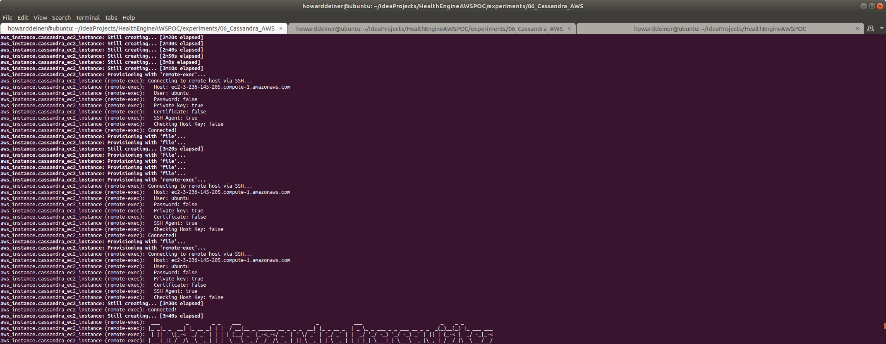
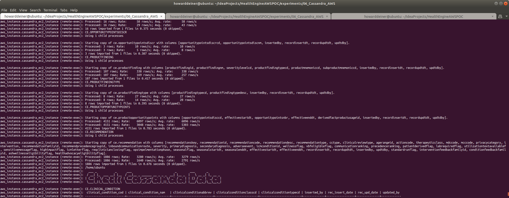

### Starting out with Cassandra on AWS

##### Concept

> Apache Cassandra is a free and open-source, distributed, wide column store, NoSQL database management system designed to handle large amounts of data across many commodity servers, providing high availability with no single point of failure. Cassandra offers robust support for clusters spanning multiple datacenters, with asynchronous masterless replication allowing low latency operations for all clients. Cassandra offers the distribution design of Amazon DynamoDB with the data model of Google's Bigtable.
> 
> Avinash Lakshman, one of the authors of Amazon's Dynamo, and Prashant Malik initially developed Cassandra at Facebook to power the Facebook inbox search feature. Facebook released Cassandra as an open-source project on Google code in July 2008. In March 2009 it became an Apache Incubator project. On February 17, 2010 it graduated to a top-level project.
>
> Facebook developers named their database after the Trojan mythological prophet Cassandra, with classical allusions to a curse on an oracle.
>
> https://en.wikipedia.org/wiki/Apache_Cassandra
>
> https://cassandra.apache.org

Why Cassandra?
<UL>
<LI>Designed for massive data</LI>
<LI>Designed to be fault tolerant</LI>
<LI>Built in peer-to-peer distribution synchronization</LI>
</UL>

#### Execution

We want to get into Cassandra quickly.  So, before we start running AWS instances, we need to master our data and how we're going to instantiate it in the database.

This whole project is about rearchitecting the database behind CareEngine, and we will try several different databases to do that.

Rather than rewrite each SQL DDL into each database's dialect, I will use a tool called Liquibase, which can do two things.
<UL>
<LI>Emit SQL DDL specific to each database from a common changeset</LI>
<LI>Use the notion of changesets to allow us to migrate the database created from one version to another.</LI>
</UL>
Unhappily, Liquibase support for Cassandra does not support the changeset.xml format yet.  That still seems to be under active development.  Never the less, we can use Liquibase with just the native cqlsh client, and achieve the same goals.  

### 01_startup.sh
This script uses terraform to provision an AWS EC2 instance.  The 02_populate.sh script is run on the server so that there are no client to server delays due to networking.  It also keeps us from having to run everything rigth now through a Cassandra client.  

```bash
#!/usr/bin/env bash

../../startExperiment.sh

bash -c 'cat << "EOF" > .script
#!/usr/bin/env bash
figlet -w 200 -f small "Startup Cassandra on AWS"
terraform init
terraform apply -auto-approve
EOF'
chmod +x .script
command time -v ./.script 2> .results
../../getExperimentalResults.sh
experiment=$(../../getExperimentNumber.sh)
../../getDataAsCSVline.sh .results "${experiment}" "06_Cassandra_AWS: Startup Cassandra AWS" >> Experimental\ Results.csv
../../putExperimentalResults.sh
rm .script .results Experimental\ Results.csv
```
It's probably of interest to see the major script called terraform.aws_instance.tf

There are some unusual details about AWS EBS (Eslatic Block Store) used or comtimplated to ge used.  For a high performance machine, we will have to consider the types, characteristics, and costs of the various EBS types available to us.  Look to https://docs.aws.amazon.com/AWSEC2/latest/UserGuide/ebs-volume-types.html to get started.  I am using an io1 IOPS SSD, and we would probably use io2 IOPS SSD for production or further experimentation.  Note that to reach io2 rates, you have to consider that not all EC2 instance types can make use io2 storage.  I am using a m5.large instance type, which costs about $0.10/hour.  The m5d.metal instance type can use io2 storage, but that costs $5.42 per hour.  That's a lot more money, but something that we'd want for production.
```hcl-terraform
resource "aws_instance" "cassandra_ec2_instance" {
  ami = "ami-0ac80df6eff0e70b5"  #  Ubuntu 18.04 LTS - Bionic - hvm:ebs-ssde  https://cloud-images.ubuntu.com/locator/ec2/
  instance_type = "m5.large"   # $0.096/hour ; 2 vCPU  ; 10 ECU  ; 8 GiB memory   ; EBS disk              ; EBS Optimized by default
  #  instance_type = "m5d.metal" # $5.424/hour ; 96 vCPU ; 345 ECU ; 384 GiB memory ; 4 x 900 NVMe SSD disk ; EBS Optimized by default ; max bandwidth 19,000 Mbps ; max throughput 2,375 MB/s ; Max IOPS 80,000
  key_name = aws_key_pair.cassandra_key_pair.key_name
  ebs_optimized = true
  security_groups = [aws_security_group.cassandra.name]
  root_block_device {
    volume_type           = "io1"
    volume_size           = 10 # GB
    iops                  = 500
    delete_on_termination = true
  }
  tags = {
    Name = "Cassandra Instance"
  }
  provisioner "local-exec" {
    command = "aws ec2 wait instance-status-ok --region ${regex("[a-z]+[^a-z][a-z]+[^a-z][0-9]+",self.availability_zone)} --instance-ids ${aws_instance.cassandra_ec2_instance.id}"
  }
  provisioner "remote-exec" {
    connection {
      type = "ssh"
      user = "ubuntu"
      host = self.public_dns
      private_key = file("~/.ssh/id_rsa")
    }
    inline = [
      "mkdir -p /home/ubuntu/.aws",
    ]
  }
  provisioner "file" {
    connection {
      type = "ssh"
      user = "ubuntu"
      host = self.public_dns
      private_key = file("~/.ssh/id_rsa")
    }
    source = "~/.aws/config"
    destination = "/home/ubuntu/.aws/config"
  }
  provisioner "file" {
    connection {
      type = "ssh"
      user = "ubuntu"
      host = self.public_dns
      private_key = file("~/.ssh/id_rsa")
    }
    source = "~/.aws/credentials"
    destination = "/home/ubuntu/.aws/credentials"
  }
  provisioner "file" {
    connection {
      type = "ssh"
      user = "ubuntu"
      host = self.public_dns
      private_key = file("~/.ssh/id_rsa")
    }
    source      = "../../getExperimentNumber.sh"
    destination = "/tmp/getExperimentNumber.sh"
  }
  provisioner "file" {
    connection {
      type = "ssh"
      user = "ubuntu"
      host = self.public_dns
      private_key = file("~/.ssh/id_rsa")
    }
    source      = "../../getExperimentalResults.sh"
    destination = "/tmp/getExperimentalResults.sh"
  }
  provisioner "file" {
    connection {
      type = "ssh"
      user = "ubuntu"
      host = self.public_dns
      private_key = file("~/.ssh/id_rsa")
    }
    source      = "../../getDataAsCSVline.sh"
    destination = "/tmp/getDataAsCSVline.sh"
  }
  provisioner "file" {
    connection {
      type = "ssh"
      user = "ubuntu"
      host = self.public_dns
      private_key = file("~/.ssh/id_rsa")
    }
    source      = "../../putExperimentalResults.sh"
    destination = "/tmp/putExperimentalResults.sh"
  }
  provisioner "remote-exec" {
    connection {
      type = "ssh"
      user = "ubuntu"
      host = self.public_dns
      private_key = file("~/.ssh/id_rsa")
    }
    inline = [
      "chmod +x /tmp/getExperimentNumber.sh",
      "chmod +x /tmp/getExperimentalResults.sh",
      "chmod +x /tmp/getDataAsCSVline.sh",
      "chmod +x /tmp/putExperimentalResults.sh"
    ]
  }
  provisioner "file" {
    connection {
      type = "ssh"
      user = "ubuntu"
      host = self.public_dns
      private_key = file("~/.ssh/id_rsa")
    }
    source      = "provision.cassandra.sh"
    destination = "/tmp/provision.cassandra.sh"
  }
  provisioner "remote-exec" {
    connection {
      type = "ssh"
      user = "ubuntu"
      host = self.public_dns
      private_key = file("~/.ssh/id_rsa")
    }
    inline = [
      "chmod +x /tmp/provision.cassandra.sh",
      "/tmp/provision.cassandra.sh",
    ]
  }
  provisioner "file" {
    connection {
      type = "ssh"
      user = "ubuntu"
      host = self.public_dns
      private_key = file("~/.ssh/id_rsa")
    }
    source      = "../../src/java/CassandraTranslator/changeSet.cassandra.sql"
    destination = "/tmp/changeSet.cassandra.sql"
  }
  provisioner "file" {
    connection {
      type = "ssh"
      user = "ubuntu"
      host = self.public_dns
      private_key = file("~/.ssh/id_rsa")
    }
    source      = "liquibase.jar"
    destination = "/tmp/liquibase.jar"
  }
  provisioner "file" {
    connection {
      type = "ssh"
      user = "ubuntu"
      host = self.public_dns
      private_key = file("~/.ssh/id_rsa")
    }
    source      = "../../liquibase_drivers/CassandraJDBC42.jar"
    destination = "/tmp/CassandraJDBC42.jar"
  }
  provisioner "file" {
    connection {
      type = "ssh"
      user = "ubuntu"
      host = self.public_dns
      private_key = file("~/.ssh/id_rsa")
    }
    source      = "../../liquibase_drivers/liquibase-cassandra-4.0.0.2.jar"
    destination = "/tmp/liquibase-cassandra-4.0.0.2.jar"
  }
  provisioner "file" {
    connection {
      type = "ssh"
      user = "ubuntu"
      host = self.public_dns
      private_key = file("~/.ssh/id_rsa")
    }
    source      = "../../data/import_GPG_keys.sh"
    destination = "/tmp/import_GPG_keys.sh"
  }
  provisioner "local-exec" {
    command = "../../data/export_GPG_keys.sh"
  }
  provisioner "file" {
    connection {
      type = "ssh"
      user = "ubuntu"
      host = self.public_dns
      private_key = file("~/.ssh/id_rsa")
    }
    source      = "HealthEngine.AWSPOC.public.key"
    destination = "/tmp/HealthEngine.AWSPOC.public.key"
  }
  provisioner "file" {
    connection {
      type = "ssh"
      user = "ubuntu"
      host = self.public_dns
      private_key = file("~/.ssh/id_rsa")
    }
    source      = "HealthEngine.AWSPOC.private.key"
    destination = "/tmp/HealthEngine.AWSPOC.private.key"
  }
  provisioner "local-exec" {
    command = "rm HealthEngine.AWSPOC.public.key HealthEngine.AWSPOC.private.key"
  }
  provisioner "file" {
    connection {
      type = "ssh"
      user = "ubuntu"
      host = self.public_dns
      private_key = file("~/.ssh/id_rsa")
    }
    source      = "../../data/transfer_from_s3_and_decrypt.sh"
    destination = "/tmp/transfer_from_s3_and_decrypt.sh"
  }
  provisioner "remote-exec" {
    connection {
      type = "ssh"
      user = "ubuntu"
      host = self.public_dns
      private_key = file("~/.ssh/id_rsa")
    }
    inline = [
      "chmod +x /tmp/import_GPG_keys.sh",
      "/tmp/import_GPG_keys.sh /tmp/HealthEngine.AWSPOC.public.key /tmp/HealthEngine.AWSPOC.private.key",
      "chmod +x /tmp/transfer_from_s3_and_decrypt.sh",
      "rm /tmp/import_GPG_keys.sh /tmp/*.key"
    ]
  }
  provisioner "file" {
    connection {
      type = "ssh"
      user = "ubuntu"
      host = self.public_dns
      private_key = file("~/.ssh/id_rsa")
    }
    source      = "../transform_Oracle_ce.ClinicalCondition_to_csv.sh"
    destination = "/tmp/transform_Oracle_ce.ClinicalCondition_to_csv.sh"
  }
  provisioner "file" {
    connection {
      type = "ssh"
      user = "ubuntu"
      host = self.public_dns
      private_key = file("~/.ssh/id_rsa")
    }
    source      = "../transform_Oracle_ce.DerivedFact_to_csv.sh"
    destination = "/tmp/transform_Oracle_ce.DerivedFact_to_csv.sh"
  }
  provisioner "file" {
    connection {
      type = "ssh"
      user = "ubuntu"
      host = self.public_dns
      private_key = file("~/.ssh/id_rsa")
    }
    source      = "../transform_Oracle_ce.DerivedFactProductUsage_to_csv.sh"
    destination = "/tmp/transform_Oracle_ce.DerivedFactProductUsage_to_csv.sh"
  }
  provisioner "file" {
    connection {
      type = "ssh"
      user = "ubuntu"
      host = self.public_dns
      private_key = file("~/.ssh/id_rsa")
    }
    source      = "../transform_Oracle_ce.MedicalFinding_to_csv.sh"
    destination = "/tmp/transform_Oracle_ce.MedicalFinding_to_csv.sh"
  }
  provisioner "file" {
    connection {
      type = "ssh"
      user = "ubuntu"
      host = self.public_dns
      private_key = file("~/.ssh/id_rsa")
    }
    source      = "../transform_Oracle_ce.MedicalFindingType_to_csv.sh"
    destination = "/tmp/transform_Oracle_ce.MedicalFindingType_to_csv.sh"
  }
  provisioner "file" {
    connection {
      type = "ssh"
      user = "ubuntu"
      host = self.public_dns
      private_key = file("~/.ssh/id_rsa")
    }
    source      = "../transform_Oracle_ce.OpportunityPointsDiscr_to_csv.sh"
    destination = "/tmp/transform_Oracle_ce.OpportunityPointsDiscr_to_csv.sh"
  }
  provisioner "file" {
    connection {
      type = "ssh"
      user = "ubuntu"
      host = self.public_dns
      private_key = file("~/.ssh/id_rsa")
    }
    source      = "../transform_Oracle_ce.ProductFinding_to_csv.sh"
    destination = "/tmp/transform_Oracle_ce.ProductFinding_to_csv.sh"
  }
  provisioner "file" {
    connection {
      type = "ssh"
      user = "ubuntu"
      host = self.public_dns
      private_key = file("~/.ssh/id_rsa")
    }
    source      = "../transform_Oracle_ce.ProductFindingType_to_csv.sh"
    destination = "/tmp/transform_Oracle_ce.ProductFindingType_to_csv.sh"
  }
  provisioner "file" {
    connection {
      type = "ssh"
      user = "ubuntu"
      host = self.public_dns
      private_key = file("~/.ssh/id_rsa")
    }
    source      = "../transform_Oracle_ce.ProductOpportunityPoints_to_csv.sh"
    destination = "/tmp/transform_Oracle_ce.ProductOpportunityPoints_to_csv.sh"
  }
  provisioner "file" {
    connection {
      type = "ssh"
      user = "ubuntu"
      host = self.public_dns
      private_key = file("~/.ssh/id_rsa")
    }
    source      = "../transform_Oracle_ce.Recommendation_to_csv.sh"
    destination = "/tmp/transform_Oracle_ce.Recommendation_to_csv.sh"
  }
  provisioner "remote-exec" {
    connection {
      type = "ssh"
      user = "ubuntu"
      host = self.public_dns
      private_key = file("~/.ssh/id_rsa")
    }
    inline = [
      "chmod +x /tmp/transform_Oracle_ce.ClinicalCondition_to_csv.sh",
      "chmod +x /tmp/transform_Oracle_ce.DerivedFact_to_csv.sh",
      "chmod +x /tmp/transform_Oracle_ce.DerivedFactProductUsage_to_csv.sh",
      "chmod +x /tmp/transform_Oracle_ce.MedicalFinding_to_csv.sh",
      "chmod +x /tmp/transform_Oracle_ce.MedicalFindingType_to_csv.sh",
      "chmod +x /tmp/transform_Oracle_ce.OpportunityPointsDiscr_to_csv.sh",
      "chmod +x /tmp/transform_Oracle_ce.ProductFinding_to_csv.sh",
      "chmod +x /tmp/transform_Oracle_ce.ProductFindingType_to_csv.sh",
      "chmod +x /tmp/transform_Oracle_ce.ProductOpportunityPoints_to_csv.sh",
      "chmod +x /tmp/transform_Oracle_ce.Recommendation_to_csv.sh",
    ]
  }
  provisioner "file" {
    connection {
      type = "ssh"
      user = "ubuntu"
      host = self.public_dns
      private_key = file("~/.ssh/id_rsa")
    }
    source      = "02_populate.sh"
    destination = "/tmp/02_populate.sh"
  }
  provisioner "remote-exec" {
    connection {
      type = "ssh"
      user = "ubuntu"
      host = self.public_dns
      private_key = file("~/.ssh/id_rsa")
    }
    inline = [
      "chmod +x /tmp/02_populate.sh",
      "/tmp/02_populate.sh"
    ]
  }
}

# FOR NOW, JUST USE ROOT DEVICE resource "aws_ebs_volume" "cassandra_ebs_volume" {
# FOR NOW, JUST USE ROOT DEVICE   availability_zone     = aws_instance.cassandra_ec2_instance.availability_zone
# FOR NOW, JUST USE ROOT DEVICE   type                  = "io2" # SSD 4-16TB 1,000 MiB/s
# FOR NOW, JUST USE ROOT DEVICE   size                  = 10    # 10 GB
# FOR NOW, JUST USE ROOT DEVICE   iops                  = 3000  # 100 - 64,000
# FOR NOW, JUST USE ROOT DEVICE #  timeouts {
# FOR NOW, JUST USE ROOT DEVICE #    create = "60m"
# FOR NOW, JUST USE ROOT DEVICE #    delete = "2h"
# FOR NOW, JUST USE ROOT DEVICE #  }
# FOR NOW, JUST USE ROOT DEVICE }
# FOR NOW, JUST USE ROOT DEVICE
# FOR NOW, JUST USE ROOT DEVICE resource "aws_volume_attachment" "example-volume-attachment" {
# FOR NOW, JUST USE ROOT DEVICE   device_name = "/dev/xvdb"
# FOR NOW, JUST USE ROOT DEVICE   instance_id = aws_instance.cassandra_ec2_instance.id
# FOR NOW, JUST USE ROOT DEVICE   volume_id   = aws_ebs_volume.cassandra_ebs_volume.id
# FOR NOW, JUST USE ROOT DEVICE }
```
You will also see that the terraform provisioners are sending up all the files needed to run 02_provision.sh, which is then run as the very last thing in the above script.

This is what the console looks like when the script is executed.
\
\
\
\
\
\
\
\
\
\
\
\
<BR/>
If we were to peruse the AWS Console EC2 Dashboard for Instances, here's what we will see.
\
<BR/>
Looking deeper into the AWS Console Instance Summary Details for the running instance, here's the summary.
\
\
\
<BR/>
Looking deeper into the AWS Console Instance Summary Security for the running instance, here's the summary.
\
\
<BR/>
Looking deeper into the AWS Console Instance Summary Networking for the running instance, here's the summary.
\
\
\
<BR/>
Looking deeper into the AWS Console Instance Summary Storage for the running instance, here's the summary.
\
\
<BR/>
And finally, looking deeper into the AWS Console Instance Summary Monitoring for the running instance, here's the summary.
\
\
<BR/>

### 02_populate.sh
THIS SCRIPT IS RUN BY TERRAFORM AS PART OF PROVISIONING THE EC2 INSTANCE.

The script is very similar to the 05_Cassandra_Local 02_populate.sh script.
```bash
#!/usr/bin/env bash

figlet -w 200 -f slant "This is run on AWS ONLY during startup"

aws ec2 describe-instances --region "us-east-1" --instance-id "`curl -s http://169.254.169.254/latest/meta-data/instance-id`" --query 'Reservations[].Instances[].[Tags[0].Value]' --output text > /tmp/.instanceName
sed --in-place --regexp-extended 's/ /_/g' /tmp/.instanceName

bash -c 'cat << "EOF" > .script
#!/usr/bin/env bash
figlet -w 200 -f small "Populate Cassandra AWS"

figlet -w 240 -f small "Apply Schema for Cassanda AWS"
cqlsh localhost 9042 -e "CREATE KEYSPACE IF NOT EXISTS CE WITH replication = {'"'"'class'"'"': '"'"'SimpleStrategy'"'"', '"'"'replication_factor'"'"' : 1}"
cd /tmp
java -jar liquibase.jar --driver=com.simba.cassandra.jdbc42.Driver --url="jdbc:cassandra://localhost:9042/CE;DefaultKeyspace=CE" --username=cassandra --password=cassandra --classpath="CassandraJDBC42.jar:liquibase-cassandra-4.0.0.2.jar" --changeLogFile=changeSet.cassandra.sql --defaultSchemaName=CE update
cd -
EOF'
chmod +x .script
command time -v ./.script 2> /tmp/.results
/tmp/getExperimentalResults.sh
experiment=$(/tmp/getExperimentNumber.sh)
/tmp/getDataAsCSVline.sh /tmp/.results ${experiment} "06_Cassandra_AWS: Populate Cassandra Schema "$(</tmp/.instanceName) >> Experimental\ Results.csv
/tmp/putExperimentalResults.sh
rm .script /tmp/.results Experimental\ Results.csv

bash -c 'cat << "EOF" > .script
#!/usr/bin/env bash
figlet -w 240 -f small "Get Data from S3 Bucket"
cd /tmp
/tmp/transfer_from_s3_and_decrypt.sh ce.ClinicalCondition.csv
/tmp/transfer_from_s3_and_decrypt.sh ce.DerivedFact.csv
/tmp/transfer_from_s3_and_decrypt.sh ce.DerivedFactProductUsage.csv
/tmp/transfer_from_s3_and_decrypt.sh ce.MedicalFinding.csv
/tmp/transfer_from_s3_and_decrypt.sh ce.MedicalFindingType.csv
/tmp/transfer_from_s3_and_decrypt.sh ce.OpportunityPointsDiscr.csv
/tmp/transfer_from_s3_and_decrypt.sh ce.ProductFinding.csv
/tmp/transfer_from_s3_and_decrypt.sh ce.ProductFindingType.csv
/tmp/transfer_from_s3_and_decrypt.sh ce.ProductOpportunityPoints.csv
/tmp/transfer_from_s3_and_decrypt.sh ce.Recommendation.csv
cd -
EOF'
chmod +x .script
command time -v ./.script 2> /tmp/.results
/tmp/getExperimentalResults.sh
experiment=$(/tmp/getExperimentNumber.sh)
/tmp/getDataAsCSVline.sh /tmp/.results ${experiment} "06_Cassanda_AWS: Get Data from S3 Bucket "$(</tmp/.instanceName) >> Experimental\ Results.csv
/tmp/putExperimentalResults.sh
rm .script /tmp/.results Experimental\ Results.csv

bash -c 'cat << "EOF" > .script
#!/usr/bin/env bash
figlet -w 240 -f small "Process S3 Data into CSV Files For Import"
cd /tmp
/tmp/transform_Oracle_ce.ClinicalCondition_to_csv.sh
/tmp/transform_Oracle_ce.DerivedFact_to_csv.sh
/tmp/transform_Oracle_ce.DerivedFactProductUsage_to_csv.sh
/tmp/transform_Oracle_ce.MedicalFinding_to_csv.sh
/tmp/transform_Oracle_ce.MedicalFindingType_to_csv.sh
/tmp/transform_Oracle_ce.OpportunityPointsDiscr_to_csv.sh
/tmp/transform_Oracle_ce.ProductFinding_to_csv.sh
/tmp/transform_Oracle_ce.ProductFindingType_to_csv.sh
/tmp/transform_Oracle_ce.ProductOpportunityPoints_to_csv.sh
/tmp/transform_Oracle_ce.Recommendation_to_csv.sh
cd -
EOF'
chmod +x .script
command time -v ./.script 2> /tmp/.results
/tmp/getExperimentalResults.sh
experiment=$(/tmp/getExperimentNumber.sh)
/tmp/getDataAsCSVline.sh /tmp/.results ${experiment} "06_Cassanda_AWS: Process S3 Data into CSV Files For Import "$(</tmp/.instanceName) >> Experimental\ Results.csv
/tmp/putExperimentalResults.sh
rm .script /tmp/.results Experimental\ Results.csv

bash -c 'cat << "EOF" > .script
#!/usr/bin/env bash
figlet -w 240 -f small "Populate Cassanda Data"
cd /tmp
echo "CE.CLINICAL_CONDITION"
cqlsh -e "COPY CE.CLINICAL_CONDITION (CLINICAL_CONDITION_COD,CLINICAL_CONDITION_NAM,INSERTED_BY,REC_INSERT_DATE,REC_UPD_DATE,UPDATED_BY,CLINICALCONDITIONCLASSCD,CLINICALCONDITIONTYPECD,CLINICALCONDITIONABBREV) FROM '"'"'ce.ClinicalCondition.csv'"'"' WITH DELIMITER='"'"','"'"' AND HEADER=TRUE"
echo "CE.DERIVEDFACT"
cqlsh -e "COPY CE.DERIVEDFACT (DERIVEDFACTID,DERIVEDFACTTRACKINGID,DERIVEDFACTTYPEID,INSERTEDBY,RECORDINSERTDT,RECORDUPDTDT,UPDTDBY) FROM '"'"'/tmp/ce.DerivedFact.csv'"'"' WITH DELIMITER='"'"','"'"' AND HEADER=TRUE"
echo "CE.DERIVEDFACTPRODUCTUSAGE"
cqlsh -e "COPY CE.DERIVEDFACTPRODUCTUSAGE (DERIVEDFACTPRODUCTUSAGEID,DERIVEDFACTID,PRODUCTMNEMONICCD,INSERTEDBY,RECORDINSERTDT,RECORDUPDTDT,UPDTDBY) FROM '"'"'/tmp/ce.DerivedFactProductUsage.csv'"'"' WITH DELIMITER='"'"','"'"' AND HEADER=TRUE"
echo "CE.DERIVEDFACTPRODUCTUSAGE"
cqlsh -e "COPY CE.DERIVEDFACTPRODUCTUSAGE (DERIVEDFACTPRODUCTUSAGEID,DERIVEDFACTID,PRODUCTMNEMONICCD,INSERTEDBY,RECORDINSERTDT,RECORDUPDTDT,UPDTDBY) FROM '"'"'/tmp/ce.DerivedFactProductUsage.csv'"'"' WITH DELIMITER='"'"','"'"' AND HEADER=TRUE"
echo "CE.MEDICALFINDING"
cqlsh -e "COPY CE.MEDICALFINDING (MEDICALFINDINGID,MEDICALFINDINGTYPECD,MEDICALFINDINGNM,SEVERITYLEVELCD,IMPACTABLEFLG,CLINICAL_CONDITION_COD,INSERTEDBY,RECORDINSERTDT,RECORDUPDTDT,UPDTDBY,ACTIVEFLG,OPPORTUNITYPOINTSDISCRCD) FROM '"'"'/tmp/ce.MedicalFinding.csv'"'"' WITH DELIMITER='"'"','"'"' AND HEADER=TRUE"
echo "CE.MEDICALFINDINGTYPE"
cqlsh -e "COPY CE.MEDICALFINDINGTYPE (MEDICALFINDINGTYPECD,MEDICALFINDINGTYPEDESC,INSERTEDBY,RECORDINSERTDT,RECORDUPDTDT,UPDTDBY,HEALTHSTATEAPPLICABLEFLAG) FROM '"'"'/tmp/ce.MedicalFindingType.csv'"'"' WITH DELIMITER='"'"','"'"' AND HEADER=TRUE"
echo "CE.OPPORTUNITYPOINTSDISCR"
cqlsh -e "COPY CE.OPPORTUNITYPOINTSDISCR (OPPORTUNITYPOINTSDISCRCD,OPPORTUNITYPOINTSDISCNM,INSERTEDBY,RECORDINSERTDT,RECORDUPDTDT,UPDTDBY) FROM '"'"'/tmp/ce.OpportunityPointsDiscr.csv'"'"' WITH DELIMITER='"'"','"'"' AND HEADER=TRUE"
echo "CE.PRODUCTFINDING"
cqlsh -e "COPY CE.PRODUCTFINDING (PRODUCTFINDINGID,PRODUCTFINDINGNM,SEVERITYLEVELCD,PRODUCTFINDINGTYPECD,PRODUCTMNEMONICCD,SUBPRODUCTMNEMONICCD,INSERTEDBY,RECORDINSERTDT,RECORDUPDTDT,UPDTDBY) FROM '"'"'/tmp/ce.ProductFinding.csv'"'"' WITH DELIMITER='"'"','"'"' AND HEADER=TRUE"
echo "CE.PRODUCTFINDINGTYPE"
cqlsh -e "COPY CE.PRODUCTFINDINGTYPE (PRODUCTFINDINGTYPECD,PRODUCTFINDINGTYPEDESC,INSERTEDBY,RECORDINSERTDT,RECORDUPDTDT,UPDTDBY) FROM '"'"'/tmp/ce.ProductFindingType.csv'"'"' WITH DELIMITER='"'"','"'"' AND HEADER=TRUE"
echo "CE.PRODUCTOPPORTUNITYPOINTS"
cqlsh -e "COPY CE.PRODUCTOPPORTUNITYPOINTS (OPPORTUNITYPOINTSDISCCD,EFFECTIVESTARTDT,OPPORTUNITYPOINTSNBR,EFFECTIVEENDDT,DERIVEDFACTPRODUCTUSAGEID,INSERTEDBY,RECORDINSERTDT,RECORDUPDTDT,UPDTDBY) FROM '"'"'/tmp/ce.ProductOpportunityPoints.csv'"'"' WITH DELIMITER='"'"','"'"' AND HEADER=TRUE"
echo "CE.RECOMMENDATION"
cqlsh -e "COPY CE.RECOMMENDATION (RECOMMENDATIONSKEY,RECOMMENDATIONID,RECOMMENDATIONCODE,RECOMMENDATIONDESC,RECOMMENDATIONTYPE,CCTYPE,CLINICALREVIEWTYPE,AGERANGEID,ACTIONCODE,THERAPEUTICCLASS,MDCCODE,MCCCODE,PRIVACYCATEGORY,INTERVENTION,RECOMMENDATIONFAMILYID,RECOMMENDPRECEDENCEGROUPID,INBOUNDCOMMUNICATIONROUTE,SEVERITY,PRIMARYDIAGNOSIS,SECONDARYDIAGNOSIS,ADVERSEEVENT,ICMCONDITIONID,WELLNESSFLAG,VBFELIGIBLEFLAG,COMMUNICATIONRANKING,PRECEDENCERANKING,PATIENTDERIVEDFLAG,LABREQUIREDFLAG,UTILIZATIONTEXTAVAILABLEF,SENSITIVEMESSAGEFLAG,HIGHIMPACTFLAG,ICMLETTERFLAG,REQCLINICIANCLOSINGFLAG,OPSIMPELMENTATIONPHASE,SEASONALFLAG,SEASONALSTARTDT,SEASONALENDDT,EFFECTIVESTARTDT,EFFECTIVEENDDT,RECORDINSERTDT,RECORDUPDTDT,INSERTEDBY,UPDTDBY,STANDARDRUNFLAG,INTERVENTIONFEEDBACKFAMILYID,CONDITIONFEEDBACKFAMILYID,ASHWELLNESSELIGIBILITYFLAG,HEALTHADVOCACYELIGIBILITYFLAG) FROM '"'"'/tmp/ce.Recommendation.csv'"'"' WITH DELIMITER='"'"','"'"' AND HEADER=TRUE"
cd -
EOF'
chmod +x .script
command time -v ./.script 2> /tmp/.results
/tmp/getExperimentalResults.sh
experiment=$(/tmp/getExperimentNumber.sh)
/tmp/getDataAsCSVline.sh /tmp/.results ${experiment} "06_Cassanda_AWS: Populate Cassanda Data "$(</tmp/.instanceName) >> Experimental\ Results.csv
/tmp/putExperimentalResults.sh
rm .script /tmp/.results Experimental\ Results.csv

bash -c 'cat << "EOF" > .script
#!/usr/bin/env bash
figlet -w 240 -f small "Check Cassanda Data"
echo "CE.CLINICAL_CONDITION"
cqlsh  -e '"'"'select * from CE.CLINICAL_CONDITION LIMIT 2;'"'"' | sed -r '"'"'s/(^.{240})(.*)/\1/'"'"' | sed -E '"'"'/Warnings \:|Aggregation query used without partition key|\(see tombstone_warn_threshold\)|yyy|^$/d'"'"'
cqlsh  -e '"'"'select count(*) from CE.CLINICAL_CONDITION;'"'"' | sed -r '"'"'s/(^.{240})(.*)/\1/'"'"' | sed -E '"'"'/Warnings \:|Aggregation query used without partition key|\(see tombstone_warn_threshold\)|yyy|^$/d'"'"'
echo "CE.DERIVEDFACT"
cqlsh  -e '"'"'select * from CE.DERIVEDFACT LIMIT 2;'"'"' | sed -r '"'"'s/(^.{240})(.*)/\1/'"'"' | sed -E '"'"'/Warnings \:|Aggregation query used without partition key|\(see tombstone_warn_threshold\)|yyy|^$/d'"'"'
cqlsh  -e '"'"'select count(*) from CE.DERIVEDFACT;'"'"' | sed -r '"'"'s/(^.{240})(.*)/\1/'"'"' | sed -E '"'"'/Warnings \:|Aggregation query used without partition key|\(see tombstone_warn_threshold\)|yyy|^$/d'"'"'
echo "CE.DERIVEDFACTPRODUCTUSAGE"
cqlsh  -e '"'"'select * from CE.DERIVEDFACTPRODUCTUSAGE LIMIT 2;'"'"' | sed -r '"'"'s/(^.{240})(.*)/\1/'"'"' | sed -E '"'"'/Warnings \:|Aggregation query used without partition key|\(see tombstone_warn_threshold\)|yyy|^$/d'"'"'
cqlsh  -e '"'"'select count(*) from CE.DERIVEDFACTPRODUCTUSAGE;'"'"' | sed -r '"'"'s/(^.{240})(.*)/\1/'"'"' | sed -E '"'"'/Warnings \:|Aggregation query used without partition key|\(see tombstone_warn_threshold\)|yyy|^$/d'"'"'
echo "CE.MEDICALFINDING"
cqlsh  -e '"'"'select * from CE.MEDICALFINDING LIMIT 2;'"'"' | sed -r '"'"'s/(^.{240})(.*)/\1/'"'"' | sed -E '"'"'/Warnings \:|Aggregation query used without partition key|\(see tombstone_warn_threshold\)|yyy|^$/d'"'"'
cqlsh  -e '"'"'select count(*) from CE.MEDICALFINDING;'"'"' | sed -r '"'"'s/(^.{240})(.*)/\1/'"'"' | sed -E '"'"'/Warnings \:|Aggregation query used without partition key|\(see tombstone_warn_threshold\)|yyy|^$/d'"'"'
echo "CE.MEDICALFINDINGTYPE"
cqlsh  -e '"'"'select * from CE.MEDICALFINDINGTYPE LIMIT 2;'"'"' | sed -r '"'"'s/(^.{240})(.*)/\1/'"'"' | sed -E '"'"'/Warnings \:|Aggregation query used without partition key|\(see tombstone_warn_threshold\)|yyy|^$/d'"'"'
cqlsh  -e '"'"'select count(*) from CE.MEDICALFINDINGTYPE;'"'"' | sed -r '"'"'s/(^.{240})(.*)/\1/'"'"' | sed -E '"'"'/Warnings \:|Aggregation query used without partition key|\(see tombstone_warn_threshold\)|yyy|^$/d'"'"'
echo "CE.OPPORTUNITYPOINTSDISCR"
cqlsh  -e '"'"'select * from CE.OPPORTUNITYPOINTSDISCR LIMIT 2;'"'"' | sed -r '"'"'s/(^.{240})(.*)/\1/'"'"' | sed -E '"'"'/Warnings \:|Aggregation query used without partition key|\(see tombstone_warn_threshold\)|yyy|^$/d'"'"'
cqlsh  -e '"'"'select count(*) from CE.OPPORTUNITYPOINTSDISCR;'"'"' | sed -r '"'"'s/(^.{240})(.*)/\1/'"'"' | sed -E '"'"'/Warnings \:|Aggregation query used without partition key|\(see tombstone_warn_threshold\)|yyy|^$/d'"'"'
echo "CE.PRODUCTFINDING"
cqlsh  -e '"'"'select * from CE.PRODUCTFINDING LIMIT 2;'"'"' | sed -r '"'"'s/(^.{240})(.*)/\1/'"'"' | sed -E '"'"'/Warnings \:|Aggregation query used without partition key|\(see tombstone_warn_threshold\)|yyy|^$/d'"'"'
cqlsh  -e '"'"'select count(*) from CE.PRODUCTFINDING;'"'"' | sed -r '"'"'s/(^.{240})(.*)/\1/'"'"' | sed -E '"'"'/Warnings \:|Aggregation query used without partition key|\(see tombstone_warn_threshold\)|yyy|^$/d'"'"'
echo "CE.PRODUCTFINDINGTYPE"
cqlsh  -e '"'"'select * from CE.PRODUCTFINDINGTYPE LIMIT 2;'"'"' | sed -r '"'"'s/(^.{240})(.*)/\1/'"'"' | sed -E '"'"'/Warnings \:|Aggregation query used without partition key|\(see tombstone_warn_threshold\)|yyy|^$/d'"'"'
cqlsh  -e '"'"'select count(*) from CE.PRODUCTFINDINGTYPE;'"'"' | sed -r '"'"'s/(^.{240})(.*)/\1/'"'"' | sed -E '"'"'/Warnings \:|Aggregation query used without partition key|\(see tombstone_warn_threshold\)|yyy|^$/d'"'"'
echo "CE.PRODUCTOPPORTUNITYPOINTS"
cqlsh  -e '"'"'select * from CE.PRODUCTOPPORTUNITYPOINTS LIMIT 2;'"'"' | sed -r '"'"'s/(^.{240})(.*)/\1/'"'"' | sed -E '"'"'/Warnings \:|Aggregation query used without partition key|\(see tombstone_warn_threshold\)|yyy|^$/d'"'"'
cqlsh  -e '"'"'select count(*) from CE.PRODUCTOPPORTUNITYPOINTS;'"'"' | sed -r '"'"'s/(^.{240})(.*)/\1/'"'"' | sed -E '"'"'/Warnings \:|Aggregation query used without partition key|\(see tombstone_warn_threshold\)|yyy|^$/d'"'"'
echo "CE.RECOMMENDATION"
cqlsh  -e '"'"'select * from CE.RECOMMENDATION LIMIT 2;'"'"' | sed -r '"'"'s/(^.{240})(.*)/\1/'"'"' | sed -E '"'"'/Warnings \:|Aggregation query used without partition key|\(see tombstone_warn_threshold\)|yyy|^$/d'"'"'
cqlsh  -e '"'"'select count(*) from CE.RECOMMENDATION;'"'"' | sed -r '"'"'s/(^.{240})(.*)/\1/'"'"' | sed -E '"'"'/Warnings \:|Aggregation query used without partition key|\(see tombstone_warn_threshold\)|yyy|^$/d'"'"'
EOF'
chmod +x .script
command time -v ./.script 2> /tmp/.results
/tmp/getExperimentalResults.sh
experiment=$(/tmp/getExperimentNumber.sh)
/tmp/getDataAsCSVline.sh /tmp/.results ${experiment} "06_Cassanda_AWS: Check Cassanda Data "$(</tmp/.instanceName) >> Experimental\ Results.csv
/tmp/putExperimentalResults.sh
rm .script /tmp/.results Experimental\ Results.csv /tmp/*.csv
```
It is also using this changeSet.cassandrq.sql
```sql
--liquibase formatted sql


--changeset CE:1
CREATE TABLE CE.OPPORTUNITYPOINTSDISCR (
                                           OPPORTUNITYPOINTSDISCNM VARCHAR,
                                           INSERTEDBY VARCHAR,
                                           RECORDINSERTDT TIMESTAMP,
                                           RECORDUPDTDT TIMESTAMP,
                                           UPDTDBY VARCHAR,
                                           OPPORTUNITYPOINTSDISCRCD VARCHAR PRIMARY KEY
)
--rollback DROP TABLE CE.OPPORTUNITYPOINTSDISCR;


--changeset CE:2
CREATE TABLE CE.DERIVEDFACT (
                                DERIVEDFACTTRACKINGID BIGINT,
                                DERIVEDFACTTYPEID BIGINT,
                                INSERTEDBY VARCHAR,
                                RECORDINSERTDT TIMESTAMP,
                                RECORDUPDTDT TIMESTAMP,
                                UPDTDBY VARCHAR,
                                DERIVEDFACTID BIGINT PRIMARY KEY
)
--rollback DROP TABLE CE.DERIVEDFACT;


--changeset CE:3
CREATE TABLE CE.RECOMMENDATIONTEXT (
                                       RECOMMENDATIONTEXTID BIGINT PRIMARY KEY,
                                       RECOMMENDATIONID BIGINT,
                                       LANGUAGECD VARCHAR,
                                       RECOMMENDATIONTEXTTYPE VARCHAR,
                                       MESSAGETYPE VARCHAR,
                                       RECOMMENDATIONTITLE VARCHAR,
                                       RECOMMENDATIONTEXT VARCHAR,
                                       RECORDINSERTDT TIMESTAMP,
                                       RECORDUPDATEDT TIMESTAMP,
                                       INSERTEDBY VARCHAR,
                                       UPDATEDBY VARCHAR,
                                       DEFAULTIN VARCHAR
)
--rollback DROP TABLE CE.RECOMMENDATIONTEXT;


--changeset CE:4
CREATE TABLE CE.CLINICAL_CONDITION (
                                       CLINICAL_CONDITION_NAM VARCHAR,
                                       INSERTED_BY VARCHAR,
                                       REC_INSERT_DATE DATE,
                                       REC_UPD_DATE DATE,
                                       UPDATED_BY VARCHAR,
                                       CLINICALCONDITIONCLASSCD BIGINT,
                                       CLINICALCONDITIONTYPECD VARCHAR,
                                       CLINICALCONDITIONABBREV VARCHAR,
                                       CLINICAL_CONDITION_COD BIGINT PRIMARY KEY
)
--rollback DROP TABLE CE.CLINICAL_CONDITION;


--changeset CE:5
CREATE TABLE CE.PRODUCTOPPORTUNITYPOINTS (
                                             OPPORTUNITYPOINTSDISCCD VARCHAR PRIMARY KEY,
                                             EFFECTIVESTARTDT DATE,
                                             OPPORTUNITYPOINTSNBR BIGINT,
                                             EFFECTIVEENDDT DATE,
                                             DERIVEDFACTPRODUCTUSAGEID BIGINT,
                                             INSERTEDBY VARCHAR,
                                             RECORDINSERTDT TIMESTAMP,
                                             RECORDUPDTDT TIMESTAMP,
                                             UPDTDBY VARCHAR
)
--rollback DROP TABLE CE.PRODUCTOPPORTUNITYPOINTS;


--changeset CE:6
CREATE TABLE CE.MEDICALFINDING (
                                   MEDICALFINDINGID BIGINT PRIMARY KEY,
                                   MEDICALFINDINGTYPECD VARCHAR,
                                   MEDICALFINDINGNM VARCHAR,
                                   SEVERITYLEVELCD VARCHAR,
                                   IMPACTABLEFLG VARCHAR,
                                   CLINICAL_CONDITION_COD BIGINT,
                                   INSERTEDBY VARCHAR,
                                   RECORDINSERTDT TIMESTAMP,
                                   RECORDUPDTDT TIMESTAMP,
                                   UPDTDBY VARCHAR,
                                   ACTIVEFLG VARCHAR,
                                   OPPORTUNITYPOINTSDISCRCD VARCHAR
)
--rollback DROP TABLE CE.MEDICALFINDING;


--changeset CE:7
CREATE TABLE CE.DERIVEDFACTPRODUCTUSAGE (
                                            DERIVEDFACTID BIGINT,
                                            PRODUCTMNEMONICCD VARCHAR,
                                            INSERTEDBY VARCHAR,
                                            RECORDINSERTDT TIMESTAMP,
                                            RECORDUPDTDT TIMESTAMP,
                                            UPDTDBY VARCHAR,
                                            DERIVEDFACTPRODUCTUSAGEID BIGINT PRIMARY KEY
)
--rollback DROP TABLE CE.DERIVEDFACTPRODUCTUSAGE;


--changeset CE:8
CREATE TABLE CE.PRODUCTFINDINGTYPE (
                                       PRODUCTFINDINGTYPECD VARCHAR PRIMARY KEY,
                                       PRODUCTFINDINGTYPEDESC VARCHAR,
                                       INSERTEDBY VARCHAR,
                                       RECORDINSERTDT TIMESTAMP,
                                       RECORDUPDTDT TIMESTAMP,
                                       UPDTDBY VARCHAR
)
--rollback DROP TABLE CE.PRODUCTFINDINGTYPE;


--changeset CE:9
CREATE TABLE CE.RECOMMENDATION (
                                   RECOMMENDATIONSKEY BIGINT PRIMARY KEY,
                                   RECOMMENDATIONID BIGINT,
                                   RECOMMENDATIONCODE VARCHAR,
                                   RECOMMENDATIONDESC VARCHAR,
                                   RECOMMENDATIONTYPE VARCHAR,
                                   CCTYPE VARCHAR,
                                   CLINICALREVIEWTYPE VARCHAR,
                                   AGERANGEID BIGINT,
                                   ACTIONCODE VARCHAR,
                                   THERAPEUTICCLASS VARCHAR,
                                   MDCCODE VARCHAR,
                                   MCCCODE VARCHAR,
                                   PRIVACYCATEGORY VARCHAR,
                                   INTERVENTION VARCHAR,
                                   RECOMMENDATIONFAMILYID BIGINT,
                                   RECOMMENDPRECEDENCEGROUPID BIGINT,
                                   INBOUNDCOMMUNICATIONROUTE VARCHAR,
                                   SEVERITY VARCHAR,
                                   PRIMARYDIAGNOSIS VARCHAR,
                                   SECONDARYDIAGNOSIS VARCHAR,
                                   ADVERSEEVENT VARCHAR,
                                   ICMCONDITIONID BIGINT,
                                   WELLNESSFLAG VARCHAR,
                                   VBFELIGIBLEFLAG VARCHAR,
                                   COMMUNICATIONRANKING BIGINT,
                                   PRECEDENCERANKING BIGINT,
                                   PATIENTDERIVEDFLAG VARCHAR,
                                   LABREQUIREDFLAG VARCHAR,
                                   UTILIZATIONTEXTAVAILABLEF VARCHAR,
                                   SENSITIVEMESSAGEFLAG VARCHAR,
                                   HIGHIMPACTFLAG VARCHAR,
                                   ICMLETTERFLAG VARCHAR,
                                   REQCLINICIANCLOSINGFLAG VARCHAR,
                                   OPSIMPELMENTATIONPHASE BIGINT,
                                   SEASONALFLAG VARCHAR,
                                   SEASONALSTARTDT DATE,
                                   SEASONALENDDT DATE,
                                   EFFECTIVESTARTDT DATE,
                                   EFFECTIVEENDDT DATE,
                                   RECORDINSERTDT TIMESTAMP,
                                   RECORDUPDTDT TIMESTAMP,
                                   INSERTEDBY VARCHAR,
                                   UPDTDBY VARCHAR,
                                   STANDARDRUNFLAG VARCHAR,
                                   INTERVENTIONFEEDBACKFAMILYID BIGINT,
                                   CONDITIONFEEDBACKFAMILYID BIGINT,
                                   ASHWELLNESSELIGIBILITYFLAG VARCHAR,
                                   HEALTHADVOCACYELIGIBILITYFLAG VARCHAR
)
--rollback DROP TABLE CE.RECOMMENDATION;


--changeset CE:10
CREATE TABLE CE.PRODUCTFINDING (
                                   PRODUCTFINDINGID BIGINT PRIMARY KEY,
                                   PRODUCTFINDINGNM VARCHAR,
                                   SEVERITYLEVELCD VARCHAR,
                                   PRODUCTFINDINGTYPECD VARCHAR,
                                   PRODUCTMNEMONICCD VARCHAR,
                                   SUBPRODUCTMNEMONICCD VARCHAR,
                                   INSERTEDBY VARCHAR,
                                   RECORDINSERTDT TIMESTAMP,
                                   RECORDUPDTDT TIMESTAMP,
                                   UPDTDBY VARCHAR
)
--rollback DROP TABLE CE.PRODUCTFINDING;


--changeset CE:11
CREATE TABLE CE.MEDICALFINDINGTYPE (
                                       MEDICALFINDINGTYPEDESC VARCHAR,
                                       INSERTEDBY VARCHAR,
                                       RECORDINSERTDT TIMESTAMP,
                                       RECORDUPDTDT TIMESTAMP,
                                       UPDTDBY VARCHAR,
                                       HEALTHSTATEAPPLICABLEFLAG VARCHAR,
                                       MEDICALFINDINGTYPECD VARCHAR PRIMARY KEY
)
--rollback DROP TABLE CE.MEDICALFINDINGTYPE;
```

### 03_shutdown.sh
This script is brutely simple.  It uses terraform tp destroy everything created in the 01_startup.sh script.

```bash
#!/usr/bin/env bash

bash -c 'cat << "EOF" > .script
#!/usr/bin/env bash
figlet -w 200 -f small "Shutdown Cassandra AWS"
terraform destroy -auto-approve
EOF'
chmod +x .script
command time -v ./.script 2> .results
../../getExperimentalResults.sh
experiment=$(../../getExperimentNumber.sh)
../../getDataAsCSVline.sh .results ${experiment} "06_Cassandra_AWS: Shutdown Cassandra AWS" >> Experimental\ Results.csv
../../putExperimentalResults.sh
rm .script .results Experimental\ Results.csv
../../endExperiment.sh
```
This is what the console looks like when the script is executed.

<BR/>
And just for laughs, here's the timings for this run.  All kept in a csv file in S3 at s3://health-engine-aws-poc/Experimental Results.csv
\
<BR/>