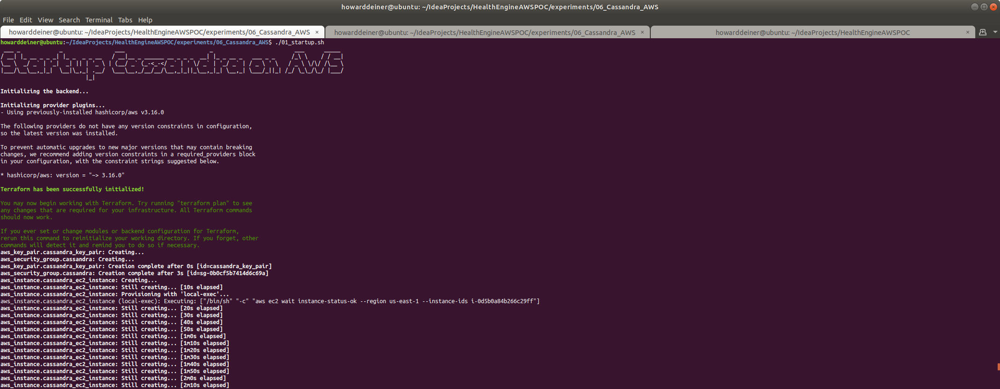
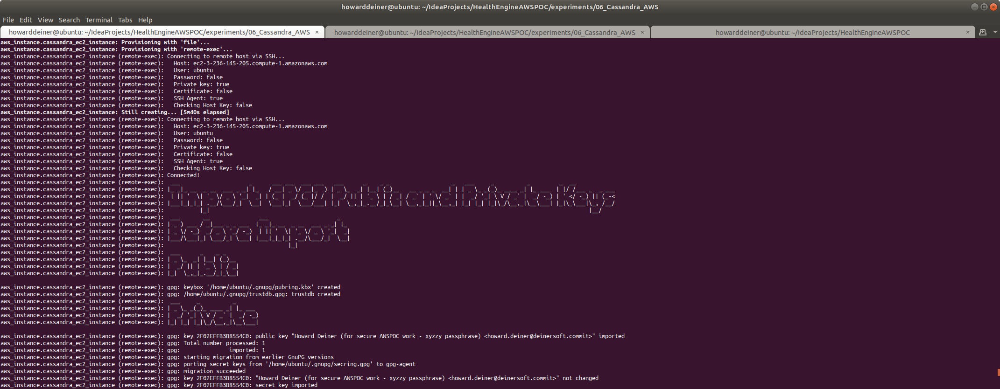
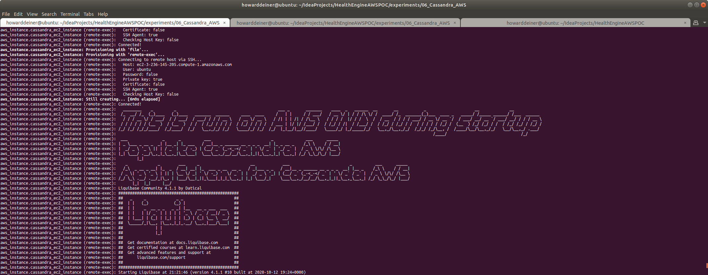
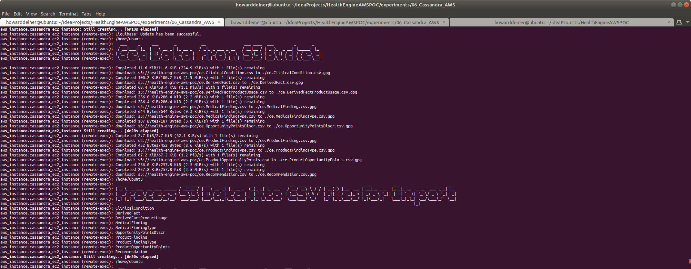
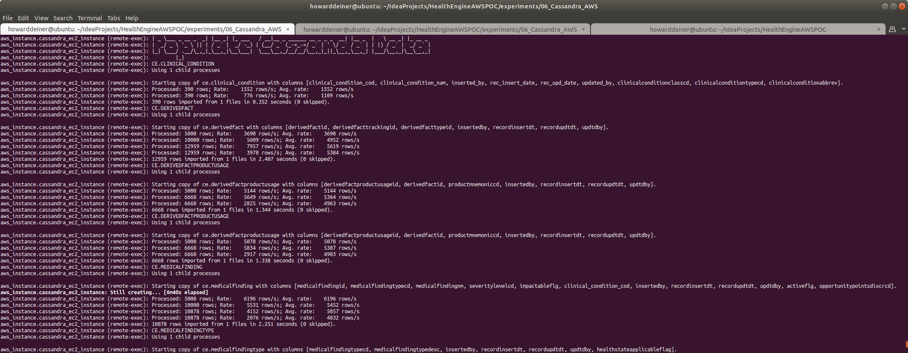

### Starting out with Cassandra on AWS

##### Concept

> Apache Cassandra is a free and open-source, distributed, wide column store, NoSQL database management system designed to handle large amounts of data across many commodity servers, providing high availability with no single point of failure. Cassandra offers robust support for clusters spanning multiple datacenters, with asynchronous masterless replication allowing low latency operations for all clients. Cassandra offers the distribution design of Amazon DynamoDB with the data model of Google's Bigtable.
> 
> Avinash Lakshman, one of the authors of Amazon's Dynamo, and Prashant Malik initially developed Cassandra at Facebook to power the Facebook inbox search feature. Facebook released Cassandra as an open-source project on Google code in July 2008. In March 2009 it became an Apache Incubator project. On February 17, 2010 it graduated to a top-level project.
>
> Facebook developers named their database after the Trojan mythological prophet Cassandra, with classical allusions to a curse on an oracle.
>
> https://en.wikipedia.org/wiki/Apache_Cassandra
>
> https://cassandra.apache.org

Why Cassandra?
<UL>
<LI>Designed for massive data</LI>
<LI>Designed to be fault tolerant</LI>
<LI>Built in peer-to-peer distribution synchronization</LI>
</UL>

#### Execution

We want to get into Cassandra quickly.  So, before we start running AWS instances, we need to master our data and how we're going to instantiate it in the database.

This whole project is about rearchitecting the database behind CareEngine, and we will try several different databases to do that.

Rather than rewrite each SQL DDL into each database's dialect, I will use a tool called Liquibase, which can do two things.
<UL>
<LI>Emit SQL DDL specific to each database from a common changeset</LI>
<LI>Use the notion of changesets to allow us to migrate the database created from one version to another.</LI>
</UL>
Unhappily, Liquibase support for Cassandra does not support the changeset.xml format yet.  That still seems to be under active development.  Never the less, we can use Liquibase with just the native cqlsh client, and achieve the same goals.  

### 01_startup.sh
This script uses terraform to provision an AWS EC2 instance.  Normally, I would run the 02_populate.sh script locally to put the database together.  However, there are some issues I am having getting remote connection against the Cassandra server.  Until that is fixed, I am doing all the work directly on the server.  This will be fixed. 

```bash
#!/usr/bin/env bash

figlet -w 200 -f small "Startup Cassandra on AWS"
terraform init
terraform apply -auto-approve
```
It's probably of interest to see the major script called terraform.aws_instance.tf

There are some unusual details about AWS EBS (Eslatic Block Store) used or comtimplated to ge used.  For a high performance machine, we will have to consider the types, characteristics, and costs of the various EBS types available to us.  Look to https://docs.aws.amazon.com/AWSEC2/latest/UserGuide/ebs-volume-types.html to get started.  I am using an io1 IOPS SSD, and we would probably use io2 IOPS SSD for production or further experimentation.  Note that to reach io2 rates, you have to consider that not all EC2 instance types can make use io2 storage.  I am using a m5.large instance type, which costs about $0.01/hour.  The m5d.meta instance type can use io2 storage, but that costs $5.42 per hour.  That's a lot more money, but something that we'd want for production.
```hcl-terraform
resource "aws_instance" "cassandra_ec2_instance" {
  ami = "ami-0ac80df6eff0e70b5"  #  Ubuntu 18.04 LTS - Bionic - hvm:ebs-ssde  https://cloud-images.ubuntu.com/locator/ec2/
  instance_type = "m5.large"   # $0.096/hour ; 2 vCPU  ; 10 ECU  ; 8 GiB memory   ; EBS disk              ; EBS Optimized by default
#  instance_type = "m5d.metal" # $5.424/hour ; 96 vCPU ; 345 ECU ; 384 GiB memory ; 4 x 900 NVMe SSD disk ; EBS Optimized by default ; max bandwidth 19,000 Mbps ; max throughput 2,375 MB/s ; Max IOPS 80,000
  key_name = aws_key_pair.cassandra_key_pair.key_name
  ebs_optimized = true
  security_groups = [aws_security_group.cassandra.name]
  root_block_device {
    volume_type           = "io1"
    volume_size           = 10 # GB
    iops                  = 500
    delete_on_termination = true
  }
  provisioner "remote-exec" {
    connection {
      type = "ssh"
      user = "ubuntu"
      host = self.public_dns
      private_key = file("~/.ssh/id_rsa")
    }
    script = "provision.cassandra.sh"
  }
  provisioner "file" {
    connection {
      type = "ssh"
      user = "ubuntu"
      host = self.public_dns
      private_key = file("~/.ssh/id_rsa")
    }
    source      = "../../src/db/DERIVEDFACT.csv"
    destination = "/tmp/DERIVEDFACT.csv"
  }
  provisioner "file" {
    connection {
      type = "ssh"
      user = "ubuntu"
      host = self.public_dns
      private_key = file("~/.ssh/id_rsa")
    }
    source      = "../../src/db/MEMBERHEALTHSTATE.csv"
    destination = "/tmp/MEMBERHEALTHSTATE.csv"
  }
  provisioner "file" {
    connection {
      type = "ssh"
      user = "ubuntu"
      host = self.public_dns
      private_key = file("~/.ssh/id_rsa")
    }
    source      = "../../src/db/changeset.cassandra.sql"
    destination = "/tmp/changeset.cassandra.sql"
  }
  provisioner "file" {
    connection {
      type = "ssh"
      user = "ubuntu"
      host = self.public_dns
      private_key = file("~/.ssh/id_rsa")
    }
    source      = "liquibase.jar"
    destination = "/tmp/liquibase.jar"
  }
  provisioner "file" {
    connection {
      type = "ssh"
      user = "ubuntu"
      host = self.public_dns
      private_key = file("~/.ssh/id_rsa")
    }
    source      = "../../liquibase_drivers/CassandraJDBC42.jar"
    destination = "/tmp/CassandraJDBC42.jar"
  }
  provisioner "file" {
    connection {
      type = "ssh"
      user = "ubuntu"
      host = self.public_dns
      private_key = file("~/.ssh/id_rsa")
    }
    source      = "../../liquibase_drivers/liquibase-cassandra-4.0.0.2.jar"
    destination = "/tmp/liquibase-cassandra-4.0.0.2.jar"
  }
  provisioner "remote-exec" {
    connection {
      type = "ssh"
      user = "ubuntu"
      host = self.public_dns
      private_key = file("~/.ssh/id_rsa")
    }
    script = "02_populate.sh"
  }
  tags = {
    Name = "Cassandra Instance"
  }
}

# FOR NOW, JUST USE ROOT DEVICE resource "aws_ebs_volume" "cassandra_ebs_volume" {
# FOR NOW, JUST USE ROOT DEVICE   availability_zone     = aws_instance.cassandra_ec2_instance.availability_zone
# FOR NOW, JUST USE ROOT DEVICE   type                  = "io2" # SSD 4-16TB 1,000 MiB/s
# FOR NOW, JUST USE ROOT DEVICE   size                  = 10    # 10 GB
# FOR NOW, JUST USE ROOT DEVICE   iops                  = 3000  # 100 - 64,000
# FOR NOW, JUST USE ROOT DEVICE #  timeouts {
# FOR NOW, JUST USE ROOT DEVICE #    create = "60m"
# FOR NOW, JUST USE ROOT DEVICE #    delete = "2h"
# FOR NOW, JUST USE ROOT DEVICE #  }
# FOR NOW, JUST USE ROOT DEVICE }
# FOR NOW, JUST USE ROOT DEVICE
# FOR NOW, JUST USE ROOT DEVICE resource "aws_volume_attachment" "example-volume-attachment" {
# FOR NOW, JUST USE ROOT DEVICE   device_name = "/dev/xvdb"
# FOR NOW, JUST USE ROOT DEVICE   instance_id = aws_instance.cassandra_ec2_instance.id
# FOR NOW, JUST USE ROOT DEVICE   volume_id   = aws_ebs_volume.cassandra_ebs_volume.id
# FOR NOW, JUST USE ROOT DEVICE }
```
You will also see that the terraform provisioners are sending up all the files needed to run 02_provision.sh, which is then run as the very last thing in the above script.

This is what the console looks like when the script is executed.
\
\
\
\
\
\
\
\
\
\
\
\
\
\
\
\
\
\
\
\
\
\
\
\
\
\
\
<BR/>
If we were to peruse the AWS Console EC2 Dashboard for Instances, here's what we will see.
\
<BR/>
Looking deeper into the AWS Console Instance Summary Details for the running instance, here's the summary.
\
\
\
<BR/>
Looking deeper into the AWS Console Instance Summary Security for the running instance, here's the summary.
\
\
<BR/>
Looking deeper into the AWS Console Instance Summary Networking for the running instance, here's the summary.
\
\
\
<BR/>
Looking deeper into the AWS Console Instance Summary Storage for the running instance, here's the summary.
\
\
<BR/>
And finally, looking deeper into the AWS Console Instance Summary Monitoring for the running instance, here's the summary.
\
\
<BR/>

### 02_populate.sh
THIS SCRIPT IS RUN BY TERRAFORM AS PART OF PROVISIONING THE EC2 INSTANCE.

The script is very similar to the 05_Cassandra_Local 02_populate.sh script.
```bash
#!/usr/bin/env bash

figlet -w 200 -f slant "This is run on AWS ONLY during startup"

figlet -w 200 -f small "Populate Cassandra on AWS"

figlet -w 200 -f small "Create Cassandra Database (Keyspace) on AWS"
cqlsh localhost 9042 -e "CREATE KEYSPACE IF NOT EXISTS testdatabase WITH replication = {'class': 'SimpleStrategy', 'replication_factor' : 1}"

figlet -w 200 -f small "Create Cassandra Tables on AWS"
cd /tmp
java -jar liquibase.jar --driver=com.simba.cassandra.jdbc42.Driver --url="jdbc:cassandra://localhost:9042/testdatabase;DefaultKeyspace=testdatabase" --username=cassandra --password=cassandra --classpath="CassandraJDBC42.jar:liquibase-cassandra-4.0.0.2.jar" --changeLogFile=changeset.cassandra.sql --defaultSchemaName=testdatabase update
cd -

figlet -w 200 -f small "Load Cassandra Data on AWS"
cqlsh localhost 9042 -e "COPY testdatabase.DERIVEDFACT (DERIVEDFACTID,DERIVEDFACTTRACKINGID,DERIVEDFACTTYPEID,INSERTEDBY,RECORDINSERTDT,RECORDUPDTDT,UPDTDBY) FROM '/tmp/DERIVEDFACT.csv' WITH DELIMITER=',' AND HEADER=TRUE"
cqlsh localhost 9042 -e "COPY testdatabase.MEMBERHEALTHSTATE (MEMBERHEALTHSTATESKEY,EPISODEID,VERSIONNBR,STATETYPECD,STATECOMPONENTID,MEMBERID,HEALTHSTATESTATUSCD,HEALTHSTATESTATUSCHANGERSNCD,HEALTHSTATESTATUSCHANGEDT,HEALTHSTATECHANGEDT,SEVERITYLEVEL,COMPLETIONFLG,CLINICALREVIEWSTATUSCD,CLINICALREVIEWSTATUSDT,LASTEVALUATIONDT,VOIDFLG,INSERTEDBY,INSERTEDDT,UPDATEDBY,UPDATEDDT,SEVERITYSCORE,MASTERSUPPLIERID,YEARQTR,PDCSCOREPERC) FROM '/tmp/MEMBERHEALTHSTATE.csv' WITH DELIMITER=',' AND HEADER=TRUE"

figlet -w 200 -f small "Check Cassandra on AWS"
cqlsh localhost 9042 -e "select * from testdatabase.DERIVEDFACT;"
cqlsh localhost 9042 -e "select * from testdatabase.MEMBERHEALTHSTATE;"
```
It is also using this changeset.cassandrq.sql
```sql
--liquibase formatted sql

--changeset howarddeiner:1
CREATE TABLE testdatabase.DERIVEDFACT (
    DERIVEDFACTID BIGINT PRIMARY KEY,
    DERIVEDFACTTRACKINGID BIGINT,
    DERIVEDFACTTYPEID BIGINT,
    INSERTEDBY VARCHAR,
    RECORDINSERTDT DATE,
    RECORDUPDTDT DATE,
    UPDTDBY VARCHAR
)
-- rollback DROP TABLE testdatabase.DERIVEDFACT;

--changeset howarddeiner:2
CREATE TABLE testdatabase.MEMBERHEALTHSTATE (
    MEMBERHEALTHSTATESKEY BIGINT PRIMARY KEY,
    EPISODEID BIGINT,
    VERSIONNBR BIGINT,
    STATETYPECD VARCHAR,
    STATECOMPONENTID BIGINT,
    MEMBERID BIGINT,
    HEALTHSTATESTATUSCD VARCHAR,
    HEALTHSTATESTATUSCHANGERSNCD VARCHAR,
    HEALTHSTATESTATUSCHANGEDT DATE,
    HEALTHSTATECHANGEDT DATE,
    SEVERITYLEVEL VARCHAR,
    COMPLETIONFLG VARCHAR,
    CLINICALREVIEWSTATUSCD VARCHAR,
    CLINICALREVIEWSTATUSDT DATE,
    LASTEVALUATIONDT DATE,
    VOIDFLG VARCHAR,
    INSERTEDBY VARCHAR,
    INSERTEDDT DATE,
    UPDATEDBY VARCHAR,
    UPDATEDDT DATE,
    SEVERITYSCORE BIGINT,
    MASTERSUPPLIERID BIGINT,
    YEARQTR BIGINT,
    PDCSCOREPERC BIGINT
)
-- rollback DROP TABLE testdatabase.MEMBERHEALTHSTATE;
```

### 03_shutdown.sh
This script is brutely simple.  It uses terraform tp destroy everything created in the 01_startup.sh script.

```bash
#!/usr/bin/env bash

figlet -w 200 -f small "Shutdown Cassandra on AWS"
terraform destroy -auto-approve
```
This is what the console looks like when the script is executed.


