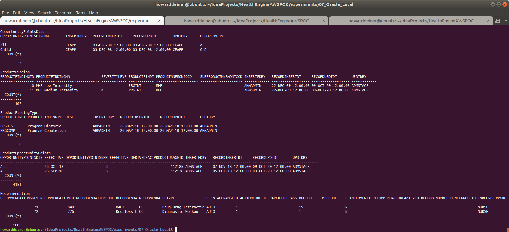

### Starting out with Oracle

##### Concept

> [The] Oracle Corporation is an American multinational computer technology corporation headquartered in Redwood Shores, California. The company sells database software and technology, cloud engineered systems, and enterprise software products—particularly its own brands of database management systems. In 2019, Oracle was the second-largest software company by revenue and market capitalization. The company also develops and builds tools for database development and systems of middle-tier software, enterprise resource planning (ERP) software, Human Capital Management (HCM) software, customer relationship management (CRM) software, and supply chain management (SCM) software.
>
>Larry Ellison co-founded Oracle Corporation in 1977 with Bob Miner and Ed Oates under the name Software Development Laboratories (SDL). Ellison took inspiration from the 1970 paper written by Edgar F. Codd on relational database management systems (RDBMS) named "A Relational Model of Data for Large Shared Data Banks." He heard about the IBM System R database from an article in the IBM Research Journal provided by Oates. Ellison wanted to make Oracle's product compatible with System R, but failed to do so as IBM kept the error codes for their DBMS a secret. SDL changed its name to Relational Software, Inc (RSI) in 1979, then again to Oracle Systems Corporation in 1983, to align itself more closely with its flagship product Oracle Database. At this stage Bob Miner served as the company's senior programmer. On March 12, 1986, the company had its initial public offering.
> 
> In 1995, Oracle Systems Corporation changed its name to Oracle Corporation, officially named Oracle, but sometimes referred to as Oracle Corporation, the name of the holding company. Part of Oracle Corporation's early success arose from using the C programming language to implement its products. This eased porting to different operating systems most of which support C.
>
> https://en.wikipedia.org/wiki/Oracle_Corporation
>
>
> It's been a long time since 1977.  Today, Oracle revenue has risen to about $10B annually, with revenue of over $2B annually.  Larry Ellison has a personal net worth of almost $76B, according to Forbes.  Unhappily, the companay has not made many changes which keep up with the times, and has seduced it's users with wonderful features to stay relevant in a manner that is both closed and with a huge barrier to switch.  We are reaching the point where our company's future becomes an extension of Larry's largesse.  Should Larry decide that he would like to fund his hobby in souped up America's Cup high tech catamarans by trippling license fees, we would have no choice except to pay it.
>
> So, why is this experiment in here, you ask?  It should be a slam dunk to get HealthEngine working in the cloud with this.  It provides a baseline for performance against other implementations, and a baseline on the economics of moving away from Oracle at this time.  Furthermore, as far as risk mitigation goes, this should be a very safe move to get into the cloud.

#### Execution

We want to get into Oracle quickly.  So, before we start running AWS instances, we need to master our data and how we're going to instantiate it in the database.

This whole project is about rearchitecting the database behind CareEngine, and we will try several different databases to do that.

Rather than rewrite each SQL DDL into each database's dialect, I will use a tool called Liquibase, which can do two things.
<UL>
<LI>Emit SQL DDL specific to each database from a common changeset</LI>
<LI>Use the notion of changesets to allow us to migrate the database created from one version to another.</LI>
</UL>

### 01_startup.sh
This script uses docker-compose to take the latest Dockerhub OracleEnterprise 12.2.0.1 image and bring it up in a container running as a daemon.  Since Oracle wants to persist data, I use a Docker Volume, which I delete in 03_shutdown.sh

Since we do not want to make use of the database until it actually starts, I monitor the logs from the postgres_container until I see a signature which tells me that the database has started.
```bash
#!/usr/bin/env bash

figlet -w 160 -f small "Startup Oracle Locally"
docker volume rm 07_oracle_local_oracle_data
docker-compose -f docker-compose.yml up -d

figlet -w 160 -f small "Wait For Oracle To Start"
while true ; do
  docker logs oracle_container > stdout.txt 2> stderr.txt
  result=$(grep -c "Done ! The database is ready for use ." stdout.txt)
  if [ $result = 1 ] ; then
    sleep 60 # it only thinks it is started
    echo "Oracle has started"
    break
  fi
  sleep 5
done
rm stdout.txt stderr.txt
```
### 02_populate.sh
This script first uses the running oracle_container, with it's default ORCLCDB database and runs liquibase to update the database to it's intended state.  Unhppily, liquibase does not run the loadData command corectly, which forces me to use the sqlldr found in the running container (since I'd rather not install Oracle and all of it's tools locally).  It also calls upon the oracle_container to do the select * from the tables to display data in them.

The script demonstrates that the two tables created have data in them with the DDL managed by Liquibase..
```bash
#!/usr/bin/env bash

figlet -w 160 -f small "Populate Oracle Locally"
liquibase update

echo 'options  ( skip=1 )' > .control.ctl
echo 'load data' >> .control.ctl
echo '  infile "/ORCL/DERIVEDFACT.csv"' >> .control.ctl
echo '  truncate into table DERIVEDFACT' >> .control.ctl
echo 'fields terminated by ","' >> .control.ctl
echo '( DERIVEDFACTID,' >> .control.ctl
echo '  DERIVEDFACTTRACKINGID,' >> .control.ctl
echo '  DERIVEDFACTTYPEID,' >> .control.ctl
echo '  INSERTEDBY,' >> .control.ctl
echo '  RECORDINSERTDT DATE "YYYY-MM-DD",' >> .control.ctl
echo '  RECORDUPDTDT DATE "YYYY-MM-DD",' >> .control.ctl
echo '  UPDTDBY) ' >> .control.ctl
docker cp .control.ctl oracle_container:/ORCL/control.ctl
docker cp ../../src/db/DERIVEDFACT.csv oracle_container:/ORCL/DERIVEDFACT.csv
docker exec oracle_container /u01/app/oracle/product/12.2.0/dbhome_1/bin/sqlldr system/Oradoc_db1@localhost:1521/ORCLCDB.localdomain control=/ORCL/control.ctl log=/ORCL/control.log

echo 'options  ( skip=1 )' > .control.ctl
echo 'load data' >> .control.ctl
echo '  infile "/ORCL/MEMBERHEALTHSTATE.csv"' >> .control.ctl
echo '  truncate into table MEMBERHEALTHSTATE' >> .control.ctl
echo 'fields terminated by ","' >> .control.ctl
echo '( MEMBERHEALTHSTATESKEY,' >> .control.ctl
echo '  EPISODEID,' >> .control.ctl
echo '  VERSIONNBR,' >> .control.ctl
echo '  STATETYPECD,' >> .control.ctl
echo '  STATECOMPONENTID,' >> .control.ctl
echo '  MEMBERID,' >> .control.ctl
echo '  HEALTHSTATESTATUSCD,' >> .control.ctl
echo '  HEALTHSTATESTATUSCHANGERSNCD,' >> .control.ctl
echo '  HEALTHSTATESTATUSCHANGEDT DATE "YYYY-MM-DD",' >> .control.ctl
echo '  HEALTHSTATECHANGEDT DATE "YYYY-MM-DD",' >> .control.ctl
echo '  SEVERITYLEVEL,' >> .control.ctl
echo '  COMPLETIONFLG,' >> .control.ctl
echo '  CLINICALREVIEWSTATUSCD,' >> .control.ctl
echo '  CLINICALREVIEWSTATUSDT DATE "YYYY-MM-DD",' >> .control.ctl
echo '  LASTEVALUATIONDT DATE "YYYY-MM-DD",' >> .control.ctl
echo '  VOIDFLG,' >> .control.ctl
echo '  INSERTEDBY,' >> .control.ctl
echo '  INSERTEDDT DATE "YYYY-MM-DD",' >> .control.ctl
echo '  UPDATEDBY,' >> .control.ctl
echo '  UPDATEDDT DATE "YYYY-MM-DD",' >> .control.ctl
echo '  SEVERITYSCORE,' >> .control.ctl
echo '  MASTERSUPPLIERID,' >> .control.ctl
echo '  YEARQTR,' >> .control.ctl
echo '  PDCSCOREPERC)' >> .control.ctl
docker cp .control.ctl oracle_container:/ORCL/control.ctl
docker cp ../../src/db/MEMBERHEALTHSTATE.csv oracle_container:/ORCL/MEMBERHEALTHSTATE.csv
docker exec oracle_container /u01/app/oracle/product/12.2.0/dbhome_1/bin/sqlldr system/Oradoc_db1@localhost:1521/ORCLCDB.localdomain control=/ORCL/control.ctl log=/ORCL/control.log

figlet -w 160 -f small "Check Oracle Locally"
echo 'select * from DERIVEDFACT;' > .command.sql``
echo 'select * from MEMBERHEALTHSTATE;' >> .command.sql
docker cp .command.sql oracle_container:/ORCL/command.sql
docker exec oracle_container /u01/app/oracle/product/12.2.0/dbhome_1/bin/sqlplus system/Oradoc_db1@localhost:1521/ORCLCDB.localdomain @/ORCL/command.sql
docker exec oracle_container rm /ORCL/command.sql
rm .control.ctl .command.sql
```
Liquibase itself is controlled by a liquibase.properties file for now.
```bash
changeLogFile: ../../src/db/changeset.oracle.xml
#url: jdbc:oracle:thin:@localhost:1521/ORCLCDB.localdomain
url: jdbc:oracle:thin:@localhost:1521:ORCLCDB
username:  system
password:  Oradoc_db1
driver: oracle.jdbc.OracleDriver
classpath:  ../../liquibase_drivers/ojdbc7.jar
```
It is also using tht changeset.
```xml
<?xml version="1.0" encoding="UTF-8"?>

<databaseChangeLog
  xmlns="http://www.liquibase.org/xml/ns/dbchangelog"
  xmlns:xsi="http://www.w3.org/2001/XMLSchema-instance"
  xsi:schemaLocation="http://www.liquibase.org/xml/ns/dbchangelog
         http://www.liquibase.org/xml/ns/dbchangelog/dbchangelog-3.8.xsd">

    <changeSet  id="1"  author="howarddeiner">

        <createTable tableName="DERIVEDFACT">
            <column name="DERIVEDFACTID" type="bigint">
                <constraints primaryKey="true"/>
            </column>
            <column name="DERIVEDFACTTRACKINGID" type="bigint"/>
            <column name="DERIVEDFACTTYPEID" type="bigint"/>
            <column name="INSERTEDBY" type="varchar(30)" defaultValue="DEFAULT USER"/>
            <column name="RECORDINSERTDT" type="timestamp" defaultValueComputed="CURRENT_TIMESTAMP"/>
            <column name="RECORDUPDTDT" type="timestamp" defaultValueComputed="CURRENT_TIMESTAMP"/>
            <column name="UPDTDBY" type="varchar(30)" defaultValue="DEFAULT USER"/>
        </createTable>

        <createTable tableName="MEMBERHEALTHSTATE">
            <column name="MEMBERHEALTHSTATESKEY" type="bigint">
                <constraints primaryKey="true"/>
            </column>
            <column name="EPISODEID" type="bigint"/>
            <column name="VERSIONNBR" type="bigint"/>
            <column name="STATETYPECD" type="varchar(2)"/>
            <column name="STATECOMPONENTID" type="bigint"/>
            <column name="MEMBERID" type="bigint"/>
            <column name="HEALTHSTATESTATUSCD" type="varchar(12)"/>
            <column name="HEALTHSTATESTATUSCHANGERSNCD" type="varchar(12)"/>
            <column name="HEALTHSTATESTATUSCHANGEDT" type="date"/>
            <column name="HEALTHSTATECHANGEDT" type="date"/>
            <column name="SEVERITYLEVEL" type="varchar(12)"/>
            <column name="COMPLETIONFLG" type="varchar(1)"/>
            <column name="CLINICALREVIEWSTATUSCD" type="varchar(12)"/>
            <column name="CLINICALREVIEWSTATUSDT" type="date"/>
            <column name="LASTEVALUATIONDT" type="date"/>
            <column name="VOIDFLG" type="varchar(2)"/>
            <column name="INSERTEDBY" type="varchar(30)" defaultValue="DEFAULT USER"/>
            <column name="INSERTEDDT" type="timestamp" defaultValueComputed="CURRENT_TIMESTAMP"/>
            <column name="UPDATEDBY" type="varchar(30)" defaultValue="DEFAULT USER"/>
            <column name="UPDATEDDT" type="timestamp" defaultValueComputed="CURRENT_TIMESTAMP"/>
            <column name="SEVERITYSCORE" type="bigint"/>
            <column name="MASTERSUPPLIERID" type="bigint"/>
            <column name="YEARQTR" type="bigint"/>
            <column name="PDCSCOREPERC" type="bigint"/>
        </createTable>

    </changeSet>

</databaseChangeLog>
```
### 03_shutdown.sh
This script is brutely simple.  It uses docker-compose to bring down the environment it established, and then uses docker volume rm to delete the data which held the bits for out database data.

```bash
#!/usr/bin/env bash

figlet -w 160 -f small "Shutdown Oracle Locally"
docker-compose -f docker-compose.yml down
docker volume rm 07_oracle_local_oracle_data
```

### Putting it all together...

It all looks something like this:

\
<BR />
\
\
\
\
\
\
\
<BR />
\
<BR />
