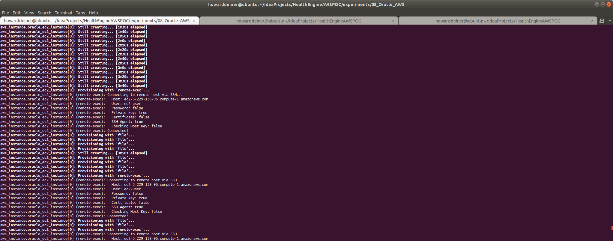
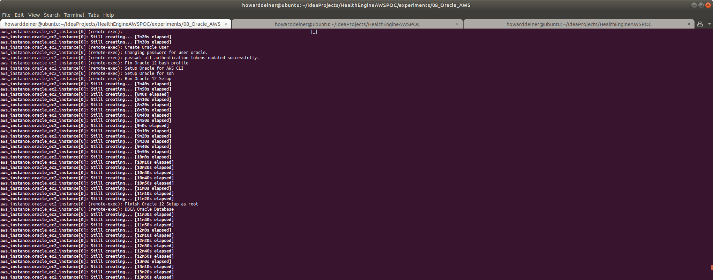
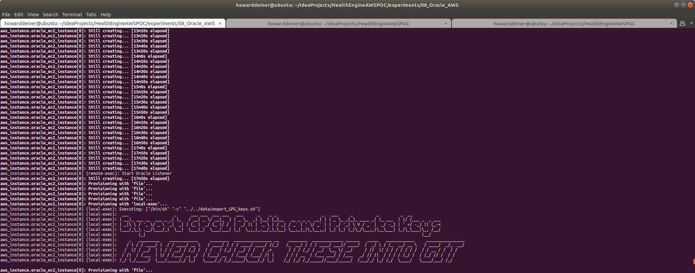
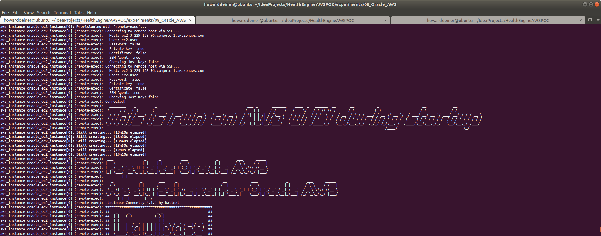
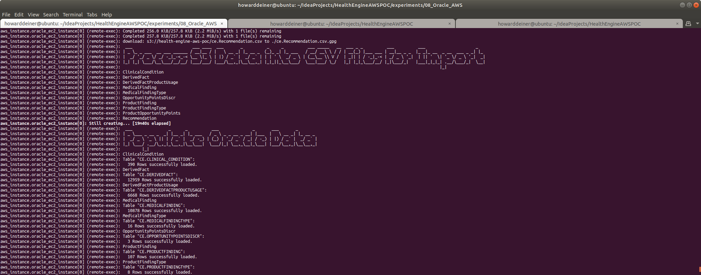
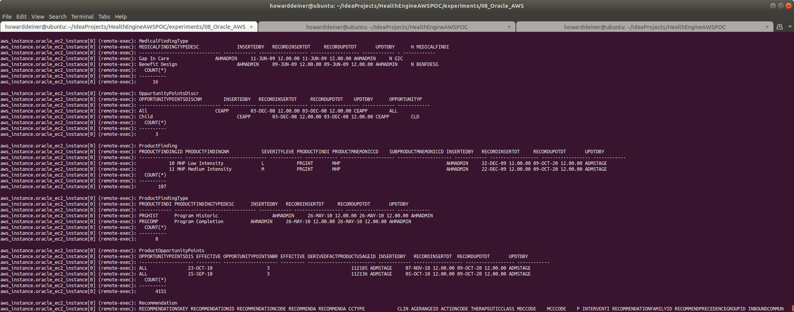

### Starting out with AWS RDS Oracle

##### Concept

> [The] Oracle Corporation is an American multinational computer technology corporation headquartered in Redwood Shores, California. The company sells database software and technology, cloud engineered systems, and enterprise software products—particularly its own brands of database management systems. In 2019, Oracle was the second-largest software company by revenue and market capitalization. The company also develops and builds tools for database development and systems of middle-tier software, enterprise resource planning (ERP) software, Human Capital Management (HCM) software, customer relationship management (CRM) software, and supply chain management (SCM) software.
>
>Larry Ellison co-founded Oracle Corporation in 1977 with Bob Miner and Ed Oates under the name Software Development Laboratories (SDL). Ellison took inspiration from the 1970 paper written by Edgar F. Codd on relational database management systems (RDBMS) named "A Relational Model of Data for Large Shared Data Banks." He heard about the IBM System R database from an article in the IBM Research Journal provided by Oates. Ellison wanted to make Oracle's product compatible with System R, but failed to do so as IBM kept the error codes for their DBMS a secret. SDL changed its name to Relational Software, Inc (RSI) in 1979, then again to Oracle Systems Corporation in 1983, to align itself more closely with its flagship product Oracle Database. At this stage Bob Miner served as the company's senior programmer. On March 12, 1986, the company had its initial public offering.
> 
> In 1995, Oracle Systems Corporation changed its name to Oracle Corporation, officially named Oracle, but sometimes referred to as Oracle Corporation, the name of the holding company. Part of Oracle Corporation's early success arose from using the C programming language to implement its products. This eased porting to different operating systems most of which support C.
>
> https://en.wikipedia.org/wiki/Oracle_Corporation
>
>
> It's been a long time since 1977.  Today, Oracle revenue has risen to about $10B annually, with revenue of over $2B annually.  Larry Ellison has a personal net worth of almost $76B, according to Forbes.  Unhappily, the companay has not made many changes which keep up with the times, and has seduced it's users with wonderful features to stay relevant in a manner that is both closed and with a huge barrier to switch.  We are reaching the point where our company's future becomes an extension of Larry's largesse.  Should Larry decide that he would like to fund his hobby in souped up America's Cup high tech catamarans by trippling license fees, we would have no choice except to pay it.
>
> So, why is this experiment in here, you ask?  It should be a slam dunk to get HealthEngine working in the cloud with this.  It provides a baseline for performance against other implementations, and a baseline on the economics of moving away from Oracle at this time.  Furthermore, as far as risk mitigation goes, this should be a very safe move to get into the cloud.
>
#### Execution

### 01_startup.sh
This script uses simple Terraform and applies it.   
```bash
#!/usr/bin/env bash

figlet -w 200 -f small "Startup Oracle AWS"
terraform init
terraform apply -auto-approve
```
The terraform.aws_instance.tf is the most interesting of the terraform scripts because it does does all of the heavy lifting through provisiong.

The reason for doing the provisioning of the actual database, setting up the DDL using Liquibase, and loading sample data is that I don't want to install local clients (such as sqlplus) on the invoking machine.
```hcl-terraform
resource "aws_instance" "oracle_ec2_instance" {
  ami = "ami-00cf6ad74f988f94b"  #  Oracle Linux 7 update 7
  instance_type = "m5.large"   # $0.096/hour ; 2 vCPU  ; 10 ECU  ; 8 GiB memory   ; EBS disk              ; EBS Optimized by default
#  instance_type = "m5d.metal" # $5.424/hour ; 96 vCPU ; 345 ECU ; 384 GiB memory ; 4 x 900 NVMe SSD disk ; EBS Optimized by default ; max bandwidth 19,000 Mbps ; max throughput 2,375 MB/s ; Max IOPS 80,000
  key_name = aws_key_pair.oracle_key_pair.key_name
  ebs_optimized = true
  security_groups = [aws_security_group.oracle.name]
  root_block_device {
    volume_type           = "io1"
    volume_size           = 30 # GB
    iops                  = 500
    delete_on_termination = true
  }
  provisioner "file" {
    connection {
      type = "ssh"
      user = "ec2-user"
      host = self.public_dns
      private_key = file("~/.ssh/id_rsa")
    }
    source      = "provision.ignite.sh"
    destination = "/tmp/provision.ignite.sh"
  }
  provisioner "remote-exec" {
    connection {
      type = "ssh"
      user = "ec2-user"
      host = self.public_dns
      private_key = file("~/.ssh/id_rsa")
    }
    inline = [
      "mkdir -p /home/ec2-user/.aws",
    ]
  }
  provisioner "file" {
    connection {
      type = "ssh"
      user = "ec2-user"
      host = self.public_dns
      private_key = file("~/.ssh/id_rsa")
    }
    source = "~/.aws/config"
    destination = "/home/ec2-user/.aws/config"
  }
  provisioner "file" {
    connection {
      type = "ssh"
      user = "ec2-user"
      host = self.public_dns
      private_key = file("~/.ssh/id_rsa")
    }
    source = "~/.aws/credentials"
    destination = "/home/ec2-user/.aws/credentials"
  }
  provisioner "file" {
    connection {
      type = "ssh"
      user = "ec2-user"
      host = self.public_dns
      private_key = file("~/.ssh/id_rsa")
    }
    source = "provision.oracle.response.file.rsp"
    destination = "/tmp/provision.oracle.response.file.rsp"
  }
  provisioner "remote-exec" {
    connection {
      type = "ssh"
      user = "ec2-user"
      host = self.public_dns
      private_key = file("~/.ssh/id_rsa")
    }
    inline = ["chmod +x /tmp/provision.ignite.sh", "/tmp/provision.ignite.sh"]
  }
  provisioner "file" {
    connection {
      type = "ssh"
      user = "ec2-user"
      host = self.public_dns
      private_key = file("~/.ssh/id_rsa")
    }
    source      = "../../src/db/DERIVEDFACT.csv"
    destination = "/tmp/DERIVEDFACT.csv"
  }
  provisioner "file" {
    connection {
      type = "ssh"
      user = "ec2-user"
      host = self.public_dns
      private_key = file("~/.ssh/id_rsa")
    }
    source      = "../../src/db/MEMBERHEALTHSTATE.csv"
    destination = "/tmp/MEMBERHEALTHSTATE.csv"
  }
  provisioner "file" {
    connection {
      type = "ssh"
      user = "ec2-user"
      host = self.public_dns
      private_key = file("~/.ssh/id_rsa")
    }
    source      = "../../src/db/changeset.oracle.xml"
    destination = "/tmp/changeset.oracle.xml"
  }
  provisioner "file" {
    connection {
      type = "ssh"
      user = "ec2-user"
      host = self.public_dns
      private_key = file("~/.ssh/id_rsa")
    }
    source      = "../06_Cassandra_AWS/liquibase.jar"
    destination = "/tmp/liquibase.jar"
  }
  provisioner "file" {
    connection {
      type = "ssh"
      user = "ec2-user"
      host = self.public_dns
      private_key = file("~/.ssh/id_rsa")
    }
    source      = "../../liquibase_drivers/ojdbc8.jar"
    destination = "/tmp/ojdbc8.jar"
  }
  provisioner "file" {
    connection {
      type = "ssh"
      user = "ec2-user"
      host = self.public_dns
      private_key = file("~/.ssh/id_rsa")
    }
    source      = "02_populate.sh"
    destination = "/tmp/02_populate.sh"
  }
  provisioner "remote-exec" {
    connection {
      type = "ssh"
      user = "ec2-user"
      host = self.public_dns
      private_key = file("~/.ssh/id_rsa")
    }
    inline = ["chmod +x /tmp/02_populate.sh", "/tmp/02_populate.sh"]
  }
  tags = {
    Name = "Oracle Instance"
  }
}
```
The script that is run on the EC2 instance (provision.oracle.sh) does the provisioning of the database itself.  It is written to run in Oracle Linux 7.7, which was called out in the ami used for the EC2 instance.
```bash
#!/usr/bin/env bash

sleep 15

echo "yum update"
sudo yum update -q -y
echo "yum install wget gcc make"
sudo yum install wget gcc make -q -y

echo "create figlet"
wget ftp://ftp.figlet.org/pub/figlet/program/unix/figlet-2.2.5.tar.gz --quiet
tar -xf figlet-2.2.5.tar.gz
cd figlet-2.2.5
sudo make install > figlet.log 2>&1
cd ..
rm -rf figlet-2.2.5 figlet-2.2.5.tar.gz

figlet -w 160 -f small "Install Oracle Prerequisites"
sudo yum install oracle-database-server-12cR2-preinstall zip unzip awscli java-1.8.0-openjdk -q -y

figlet -w 160 -f small "Create Oracle User"
sudo echo -e "FuckMeAgain\nFuckMeAgain" | sudo passwd oracle
sudo mkdir -p /u01/software
sudo chown -R oracle:oinstall /u01
sudo chmod -R 775 /u01

figlet -w 160 -f small "Fix Oracle 12 bash_profile"
echo '# Oracle specific environment and startup programs' | sudo tee -a /home/oracle/.bash_profile > /dev/null
echo 'export ORACLE_HOME=/u01/app/oracle/product/12.2.0.1.0/dbhome_1' | sudo tee -a /home/oracle/.bash_profile > /dev/null
echo 'export ORACLE_SID=ORCL' | sudo tee -a /home/oracle/.bash_profile > /dev/null
echo 'PATH=$PATH:$HOME/.local/bin:$ORACLE_HOME/bin' | sudo tee -a /home/oracle/.bash_profile > /dev/null
echo 'export PATH' | sudo tee -a /home/oracle/.bash_profile > /dev/null
sudo chown oracle /home/oracle

figlet -w 160 -f small "Setup Oracle for AWS CLI"
sudo mkdir /home/oracle/.aws
sudo cp -R /home/ec2-user/.aws/* /home/oracle/.aws/.

figlet -w 160 -f small "Setup Oracle for ssh"
sudo mkdir /home/oracle/.ssh
sudo cp /home/ec2-user/.ssh/authorized_keys /home/oracle/.ssh/.

figlet -w 160 -f small "Run Oracle 12 Setup"
# get the public dns in for the hostname
echo ORACLE_HOSTNAME=`curl http://169.254.169.254/latest/meta-data/public-hostname --silent` >> provision.oracle.response.file.rsp

sudo -u oracle bash -c 'source /home/oracle/.bash_profile ; cd /u01/software ; aws s3 cp --quiet s3://health-engine-aws-poc/linuxx64_12201_database.zip linuxx64_12201_database.zip ; unzip -qq linuxx64_12201_database.zip ; rm linuxx64_12201_database.zip ; cd /u01/software/database ; ./runInstaller -waitForCompletion -showProgress -silent -ignoreSysPrereqs -responseFile /tmp/provision.oracle.response.file.rsp'

figlet -w 160 -f small "Finish Oracle 12 Setup as root"

sudo /u01/app/oraInventory/orainstRoot.sh
sudo /u01/app/oracle/product/12.2.0.1.0/dbhome_1/root.sh

figlet -w 160 -f small "DBCA Oracle Database"
#sudo -u oracle bash -c 'source /home/oracle/.bash_profile ; dbca -silent -createDatabase -templateName General_Purpose.dbc -gdbname cdb1 -sid cdb1 -responseFile NO_VALUE -characterSet AL32UTF8 -sysPassword OraPasswd1 -systemPassword OraPasswd1 -createAsContainerDatabase true -numberOfPDBs 1 -pdbName pdb1 -pdbAdminPassword OraPasswd1 -databaseType MULTIPURPOSE -automaticMemoryManagement false -storageType FS -ignorePreReqs'
sudo -u oracle bash -c 'source /home/oracle/.bash_profile ; dbca -silent -createDatabase -templateName General_Purpose.dbc -gdbname ORCL -sid ORCL -responseFile NO_VALUE -characterSet AL32UTF8 -sysPassword OraPasswd1 -systemPassword OraPasswd1 -createAsContainerDatabase true -numberOfPDBs 1 -pdbName ORCLPDB -pdbAdminPassword OraPasswd1 -databaseType MULTIPURPOSE -automaticMemoryManagement false -createListener ORCL -storageType FS  -datafileDestination "/u01/app/oracle/oradata/" -redoLogFileSize 50  -emConfiguration NONE -ignorePreReqs'

figlet -w 160 -f small "Start Oracle Listener"
sudo -u oracle bash -c 'source /home/oracle/.bash_profile ; lsnrctl start'
sudo -u oracle bash -c 'source /home/oracle/.bash_profile ; lsnrctl services'
```
The script that is then run on the EC2 instance (02_populate.sh) runs Liquibase for the DDL and the Oracle command sqlldr for loading the data.
```bash
#!/usr/bin/env bash

sleep 2m
figlet -w 200 -f slant "This is run on AWS ONLY during startup"

figlet -w 200 -f small "Populate Oracle AWS"
sudo -u oracle bash -c 'source /home/oracle/.bash_profile ; cd /tmp ; java -jar liquibase.jar --driver=oracle.jdbc.OracleDriver --url="jdbc:oracle:thin:@localhost:1521:ORCL" --username=system --password=OraPasswd1 --classpath="ojdbc8.jar" --changeLogFile=changeset.oracle.xml update'

echo 'options  ( skip=1 )' >/tmp/control.ctl
echo 'load data' >>/tmp/control.ctl
echo '  infile "/tmp/DERIVEDFACT.csv"' >>/tmp/control.ctl
echo '  truncate into table DERIVEDFACT' >>/tmp/control.ctl
echo 'fields terminated by ","' >>/tmp/control.ctl
echo '( DERIVEDFACTID,' >>/tmp/control.ctl
echo '  DERIVEDFACTTRACKINGID,' >>/tmp/control.ctl
echo '  DERIVEDFACTTYPEID,' >>/tmp/control.ctl
echo '  INSERTEDBY,' >>/tmp/control.ctl
echo '  RECORDINSERTDT DATE "YYYY-MM-DD",' >>/tmp/control.ctl
echo '  RECORDUPDTDT DATE "YYYY-MM-DD",' >>/tmp/control.ctl
echo '  UPDTDBY) ' >>/tmp/control.ctl
sudo -u oracle bash -c 'source /home/oracle/.bash_profile ; sqlldr system/OraPasswd1@localhost:1521/ORCL control=/tmp/control.ctl log=/tmp/control.log'

echo 'options  ( skip=1 )' >/tmp/control.ctl
echo 'load data' >>/tmp/control.ctl
echo '  infile "/tmp/MEMBERHEALTHSTATE.csv"' >>/tmp/control.ctl
echo '  truncate into table MEMBERHEALTHSTATE' >>/tmp/control.ctl
echo 'fields terminated by ","' >>/tmp/control.ctl
echo '( MEMBERHEALTHSTATESKEY,' >>/tmp/control.ctl
echo '  EPISODEID,' >>/tmp/control.ctl
echo '  VERSIONNBR,' >>/tmp/control.ctl
echo '  STATETYPECD,' >>/tmp/control.ctl
echo '  STATECOMPONENTID,' >>/tmp/control.ctl
echo '  MEMBERID,' >>/tmp/control.ctl
echo '  HEALTHSTATESTATUSCD,' >>/tmp/control.ctl
echo '  HEALTHSTATESTATUSCHANGERSNCD,' >>/tmp/control.ctl
echo '  HEALTHSTATESTATUSCHANGEDT DATE "YYYY-MM-DD",' >>/tmp/control.ctl
echo '  HEALTHSTATECHANGEDT DATE "YYYY-MM-DD",' >>/tmp/control.ctl
echo '  SEVERITYLEVEL,' >>/tmp/control.ctl
echo '  COMPLETIONFLG,' >>/tmp/control.ctl
echo '  CLINICALREVIEWSTATUSCD,' >>/tmp/control.ctl
echo '  CLINICALREVIEWSTATUSDT DATE "YYYY-MM-DD",' >>/tmp/control.ctl
echo '  LASTEVALUATIONDT DATE "YYYY-MM-DD",' >>/tmp/control.ctl
echo '  VOIDFLG,' >>/tmp/control.ctl
echo '  INSERTEDBY,' >>/tmp/control.ctl
echo '  INSERTEDDT DATE "YYYY-MM-DD",' >>/tmp/control.ctl
echo '  UPDATEDBY,' >>/tmp/control.ctl
echo '  UPDATEDDT DATE "YYYY-MM-DD",' >>/tmp/control.ctl
echo '  SEVERITYSCORE,' >>/tmp/control.ctl
echo '  MASTERSUPPLIERID,' >>/tmp/control.ctl
echo '  YEARQTR,' >>/tmp/control.ctl
echo '  PDCSCOREPERC)' >>/tmp/control.ctl
sudo -u oracle bash -c 'source /home/oracle/.bash_profile ; sqlldr system/OraPasswd1@localhost:1521/ORCL control=/tmp/control.ctl log=/tmp/control.log'

figlet -w 200 -f small "Check Oracle AWS"
sudo -u oracle bash -c 'source /home/oracle/.bash_profile ; echo "select * from DERIVEDFACT;" | sqlplus system/OraPasswd1@localhost:1521/ORCL'
sudo -u oracle bash -c 'source /home/oracle/.bash_profile ; echo "select * from MEMBERHEALTHSTATE;" | sqlplus system/OraPasswd1@localhost:1521/ORCL'
```
This is what the console looks like when the script is executed.  It takes about 12 minutes.  But it is completely repeatable, and doesn't require any manual intervention.  It's the way our DBAs should create Oracle instances, regardless of the environment.  Everything is in Git, and anyone can use it.
\
\
\
\
\
\
\
\
\
\
\
\
\
\
\
\
<BR/>
If we were to peruse the AWS Console EC2 Dashboard, here's what we will see.
\
<BR/>
Looking at the running instances, we see
\
<BR/>
Looking at details of that runing instance, we see
\
<BR/>
The security tab of that runing instance shows us
\
<BR/>
The networking tab of that runing instance shows us
\
<BR/>
The storage tab of that runing instance shows us
\
<BR/>
And, finally, the monitoring tab of that runing instance shows us
\
<BR/>
### 02_populate.sh
This script was run on the AWS EC2 instance in the 01_startup.sh for this experiment to avoid having to install Oracle clients on our local machine.
<BR/>
### 03_shutdown.sh
This script is extremely simple.  It tells terraform to destroy all that it created.

```bash
#!/usr/bin/env bash

figlet -w 200 -f small "Shutdown Oracle AWS"
terraform destroy -auto-approve
```
The console shows what it does.
\
<BR/>
