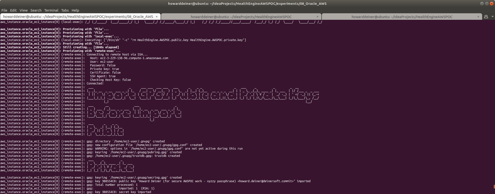
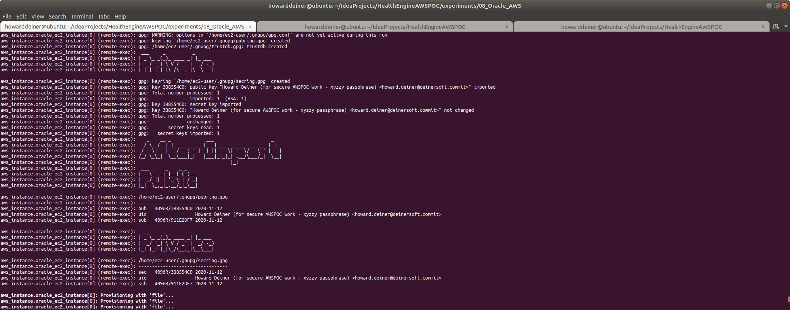
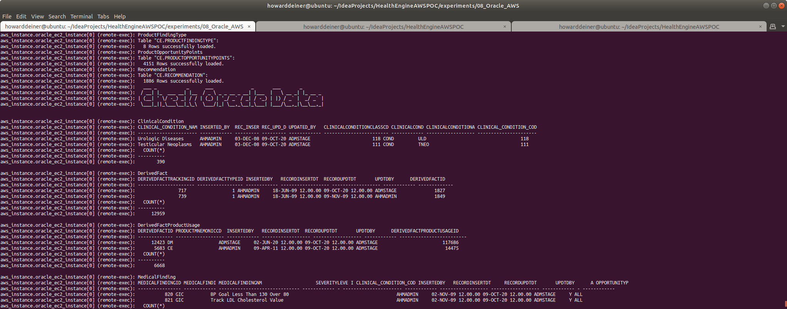
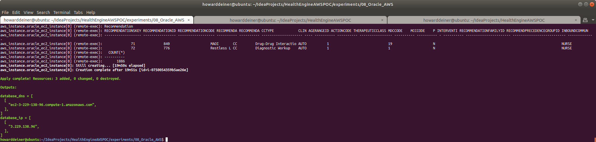

### Starting out with AWS RDS Oracle

##### Concept

> [The] Oracle Corporation is an American multinational computer technology corporation headquartered in Redwood Shores, California. The company sells database software and technology, cloud engineered systems, and enterprise software products—particularly its own brands of database management systems. In 2019, Oracle was the second-largest software company by revenue and market capitalization. The company also develops and builds tools for database development and systems of middle-tier software, enterprise resource planning (ERP) software, Human Capital Management (HCM) software, customer relationship management (CRM) software, and supply chain management (SCM) software.
>
>Larry Ellison co-founded Oracle Corporation in 1977 with Bob Miner and Ed Oates under the name Software Development Laboratories (SDL). Ellison took inspiration from the 1970 paper written by Edgar F. Codd on relational database management systems (RDBMS) named "A Relational Model of Data for Large Shared Data Banks." He heard about the IBM System R database from an article in the IBM Research Journal provided by Oates. Ellison wanted to make Oracle's product compatible with System R, but failed to do so as IBM kept the error codes for their DBMS a secret. SDL changed its name to Relational Software, Inc (RSI) in 1979, then again to Oracle Systems Corporation in 1983, to align itself more closely with its flagship product Oracle Database. At this stage Bob Miner served as the company's senior programmer. On March 12, 1986, the company had its initial public offering.
> 
> In 1995, Oracle Systems Corporation changed its name to Oracle Corporation, officially named Oracle, but sometimes referred to as Oracle Corporation, the name of the holding company. Part of Oracle Corporation's early success arose from using the C programming language to implement its products. This eased porting to different operating systems most of which support C.
>
> https://en.wikipedia.org/wiki/Oracle_Corporation
>
>
> It's been a long time since 1977.  Today, Oracle revenue has risen to about $10B annually, with revenue of over $2B annually.  Larry Ellison has a personal net worth of almost $76B, according to Forbes.  Unhappily, the companay has not made many changes which keep up with the times, and has seduced it's users with wonderful features to stay relevant in a manner that is both closed and with a huge barrier to switch.  We are reaching the point where our company's future becomes an extension of Larry's largesse.  Should Larry decide that he would like to fund his hobby in souped up America's Cup high tech catamarans by trippling license fees, we would have no choice except to pay it.
>
> So, why is this experiment in here, you ask?  It should be a slam dunk to get HealthEngine working in the cloud with this.  It provides a baseline for performance against other implementations, and a baseline on the economics of moving away from Oracle at this time.  Furthermore, as far as risk mitigation goes, this should be a very safe move to get into the cloud.
>
#### Execution

### 01_startup.sh
This script uses simple Terraform and applies it.   
```bash
#!/usr/bin/env bash

../../startExperiment.sh

bash -c 'cat << "EOF" > .script
#!/usr/bin/env bash
figlet -w 200 -f small "Startup Oracle AWS"
terraform init
terraform apply -auto-approve
EOF'
chmod +x .script
command time -v ./.script 2> .results
../../getExperimentalResults.sh
experiment=$(../../getExperimentNumber.sh)
../../getDataAsCSVline.sh .results ${experiment} "08_Oracle_AWS: Startup Oracle AWS" >> Experimental\ Results.csv
../../putExperimentalResults.sh
rm .script .results Experimental\ Results.csv
```
The terraform.aws_instance.tf is the most interesting of the terraform scripts because it does does all of the heavy lifting through provisiong.

The reason for doing the provisioning of the actual database, setting up the DDL using Liquibase, and loading sample data is that I don't want to install local clients (such as sqlplus) on the invoking machine.
```hcl-terraform
resource "aws_instance" "oracle_ec2_instance" {
  ami = "ami-00cf6ad74f988f94b"  #  Oracle Linux 7 update 7
  instance_type = "m5.large"   # $0.096/hour ; 2 vCPU  ; 10 ECU  ; 8 GiB memory   ; EBS disk              ; EBS Optimized by default
# instance_type = "m5.xlarge"   # $0.192/hour ; 4 vCPU  ; 16 ECU  ; 16 GiB memory   ; EBS disk              ; EBS Optimized by default
# instance_type = "m5.16xlarge"   # $3.027/hour ; 64 vCPU  ; 256 ECU  ; 256 GiB memory   ; EBS disk              ; EBS Optimized by default
# instance_type = "m5d.metal" # $5.424/hour ; 96 vCPU ; 345 ECU ; 384 GiB memory ; 4 x 900 NVMe SSD disk ; EBS Optimized by default ; max bandwidth 19,000 Mbps ; max throughput 2,375 MB/s ; Max IOPS 80,000
  key_name = aws_key_pair.oracle_key_pair.key_name
  ebs_optimized = true
  security_groups = [aws_security_group.oracle.name]
  root_block_device {
    volume_type           = "io1"
    volume_size           = 30 # GB
    iops                  = 500
    delete_on_termination = true
  }
  count = 1
  tags = {
    Name = "Oracle Instance"
  }
  provisioner "local-exec" {
    command = "aws ec2 wait instance-status-ok --region ${regex("[a-z]+[^a-z][a-z]+[^a-z][0-9]+",self.availability_zone)} --instance-ids ${aws_instance.oracle_ec2_instance[count.index].id}"
  }
  provisioner "remote-exec" {
    connection {
      type = "ssh"
      user = "ec2-user"
      host = self.public_dns
      private_key = file("~/.ssh/id_rsa")
    }
    inline = [
      "mkdir -p /home/ec2-user/.aws",
    ]
  }
  provisioner "file" {
    connection {
      type = "ssh"
      user = "ec2-user"
      host = self.public_dns
      private_key = file("~/.ssh/id_rsa")
    }
    source = "~/.aws/config"
    destination = "/home/ec2-user/.aws/config"
  }
  provisioner "file" {
    connection {
      type = "ssh"
      user = "ec2-user"
      host = self.public_dns
      private_key = file("~/.ssh/id_rsa")
    }
    source = "~/.aws/credentials"
    destination = "/home/ec2-user/.aws/credentials"
  }
  provisioner "file" {
    connection {
      type = "ssh"
      user = "ec2-user"
      host = self.public_dns
      private_key = file("~/.ssh/id_rsa")
    }
    source      = "../../getDataBasicAsCSVline.sh"
    destination = "/tmp/getDataAsCSVline.sh"
  }
  provisioner "file" {
    connection {
      type = "ssh"
      user = "ec2-user"
      host = self.public_dns
      private_key = file("~/.ssh/id_rsa")
    }
    source      = "../../getExperimentalResults.sh"
    destination = "/tmp/getExperimentalResults.sh"
  }
  provisioner "file" {
    connection {
      type = "ssh"
      user = "ec2-user"
      host = self.public_dns
      private_key = file("~/.ssh/id_rsa")
    }
    source      = "../../putExperimentalResults.sh"
    destination = "/tmp/putExperimentalResults.sh"
  }
  provisioner "file" {
    connection {
      type = "ssh"
      user = "ec2-user"
      host = self.public_dns
      private_key = file("~/.ssh/id_rsa")
    }
    source      = "../../startExperiment.sh"
    destination = "/tmp/startExperiment.sh"
  }
  provisioner "file" {
    connection {
      type = "ssh"
      user = "ec2-user"
      host = self.public_dns
      private_key = file("~/.ssh/id_rsa")
    }
    source      = "../../endExperiment.sh"
    destination = "/tmp/endExperiment.sh"
  }
  provisioner "file" {
    connection {
      type = "ssh"
      user = "ec2-user"
      host = self.public_dns
      private_key = file("~/.ssh/id_rsa")
    }
    source      = "../../getExperimentNumber.sh"
    destination = "/tmp/getExperimentNumber.sh"
  }
  provisioner "remote-exec" {
    connection {
      type = "ssh"
      user = "ec2-user"
      host = self.public_dns
      private_key = file("~/.ssh/id_rsa")
    }
    inline = [
      "chmod +x /tmp/getDataAsCSVline.sh",
      "chmod +x /tmp/getExperimentalResults.sh",
      "chmod +x /tmp/putExperimentalResults.sh",
      "chmod +x /tmp/startExperiment.sh",
      "chmod +x /tmp/endExperiment.sh",
      "chmod +x /tmp/getExperimentNumber.sh"
    ]
  }
  provisioner "file" {
    connection {
      type = "ssh"
      user = "ec2-user"
      host = self.public_dns
      private_key = file("~/.ssh/id_rsa")
    }
    source      = "provision.oracle.sh"
    destination = "/tmp/provision.oracle.sh"
  }
  provisioner "file" {
    connection {
      type = "ssh"
      user = "ec2-user"
      host = self.public_dns
      private_key = file("~/.ssh/id_rsa")
    }
    source = "provision.oracle.response.file.rsp"
    destination = "/tmp/provision.oracle.response.file.rsp"
  }
  provisioner "remote-exec" {
    connection {
      type = "ssh"
      user = "ec2-user"
      host = self.public_dns
      private_key = file("~/.ssh/id_rsa")
    }
    inline = [
      "chmod +x /tmp/provision.oracle.sh",
      "/tmp/provision.oracle.sh",
    ]
  }
  provisioner "file" {
    connection {
      type = "ssh"
      user = "ec2-user"
      host = self.public_dns
      private_key = file("~/.ssh/id_rsa")
    }
    source      = "../../src/java/Translator/changeSet.xml"
    destination = "/tmp/changeSet.xml"
  }
  provisioner "file" {
    connection {
      type = "ssh"
      user = "ec2-user"
      host = self.public_dns
      private_key = file("~/.ssh/id_rsa")
    }
    source      = "../06_Cassandra_AWS/liquibase.jar"
    destination = "/tmp/liquibase.jar"
  }
  provisioner "file" {
    connection {
      type = "ssh"
      user = "ec2-user"
      host = self.public_dns
      private_key = file("~/.ssh/id_rsa")
    }
    source      = "../../liquibase_drivers/ojdbc8.jar"
    destination = "/tmp/ojdbc8.jar"
  }
  provisioner "file" {
    connection {
      type = "ssh"
      user = "ec2-user"
      host = self.public_dns
      private_key = file("~/.ssh/id_rsa")
    }
    source      = "../../data/import_GPG_keys.sh"
    destination = "/tmp/import_GPG_keys.sh"
  }
  provisioner "local-exec" {
    command = "../../data/export_GPG_keys.sh"
  }
  provisioner "file" {
    connection {
      type = "ssh"
      user = "ec2-user"
      host = self.public_dns
      private_key = file("~/.ssh/id_rsa")
    }
    source      = "HealthEngine.AWSPOC.public.key"
    destination = "/tmp/HealthEngine.AWSPOC.public.key"
  }
  provisioner "file" {
    connection {
      type = "ssh"
      user = "ec2-user"
      host = self.public_dns
      private_key = file("~/.ssh/id_rsa")
    }
    source      = "HealthEngine.AWSPOC.private.key"
    destination = "/tmp/HealthEngine.AWSPOC.private.key"
  }
  provisioner "local-exec" {
    command = "rm HealthEngine.AWSPOC.public.key HealthEngine.AWSPOC.private.key"
  }
  provisioner "file" {
    connection {
      type = "ssh"
      user = "ec2-user"
      host = self.public_dns
      private_key = file("~/.ssh/id_rsa")
    }
    source      = "../../data/transfer_from_s3_and_decrypt.sh"
    destination = "/tmp/transfer_from_s3_and_decrypt.sh"
  }
  provisioner "remote-exec" {
    connection {
      type = "ssh"
      user = "ec2-user"
      host = self.public_dns
      private_key = file("~/.ssh/id_rsa")
    }
    inline = [
      "chmod +x /tmp/import_GPG_keys.sh",
      "/tmp/import_GPG_keys.sh /tmp/HealthEngine.AWSPOC.public.key /tmp/HealthEngine.AWSPOC.private.key",
      "chmod +x /tmp/transfer_from_s3_and_decrypt.sh",
      "rm /tmp/import_GPG_keys.sh /tmp/*.key"]
  }
  provisioner "file" {
    connection {
      type = "ssh"
      user = "ec2-user"
      host = self.public_dns
      private_key = file("~/.ssh/id_rsa")
    }
    source      = "../transform_Oracle_ce.ClinicalCondition_to_csv.sh"
    destination = "/tmp/transform_Oracle_ce.ClinicalCondition_to_csv.sh"
  }
  provisioner "file" {
    connection {
      type = "ssh"
      user = "ec2-user"
      host = self.public_dns
      private_key = file("~/.ssh/id_rsa")
    }
    source      = "../transform_Oracle_ce.DerivedFact_to_csv.sh"
    destination = "/tmp/transform_Oracle_ce.DerivedFact_to_csv.sh"
  }
  provisioner "file" {
    connection {
      type = "ssh"
      user = "ec2-user"
      host = self.public_dns
      private_key = file("~/.ssh/id_rsa")
    }
    source      = "../transform_Oracle_ce.DerivedFactProductUsage_to_csv.sh"
    destination = "/tmp/transform_Oracle_ce.DerivedFactProductUsage_to_csv.sh"
  }
  provisioner "file" {
    connection {
      type = "ssh"
      user = "ec2-user"
      host = self.public_dns
      private_key = file("~/.ssh/id_rsa")
    }
    source      = "../transform_Oracle_ce.MedicalFinding_to_csv.sh"
    destination = "/tmp/transform_Oracle_ce.MedicalFinding_to_csv.sh"
  }
  provisioner "file" {
    connection {
      type = "ssh"
      user = "ec2-user"
      host = self.public_dns
      private_key = file("~/.ssh/id_rsa")
    }
    source      = "../transform_Oracle_ce.MedicalFindingType_to_csv.sh"
    destination = "/tmp/transform_Oracle_ce.MedicalFindingType_to_csv.sh"
  }
  provisioner "file" {
    connection {
      type = "ssh"
      user = "ec2-user"
      host = self.public_dns
      private_key = file("~/.ssh/id_rsa")
    }
    source      = "../transform_Oracle_ce.OpportunityPointsDiscr_to_csv.sh"
    destination = "/tmp/transform_Oracle_ce.OpportunityPointsDiscr_to_csv.sh"
  }
  provisioner "file" {
    connection {
      type = "ssh"
      user = "ec2-user"
      host = self.public_dns
      private_key = file("~/.ssh/id_rsa")
    }
    source      = "../transform_Oracle_ce.ProductFinding_to_csv.sh"
    destination = "/tmp/transform_Oracle_ce.ProductFinding_to_csv.sh"
  }
  provisioner "file" {
    connection {
      type = "ssh"
      user = "ec2-user"
      host = self.public_dns
      private_key = file("~/.ssh/id_rsa")
    }
    source      = "../transform_Oracle_ce.ProductFindingType_to_csv.sh"
    destination = "/tmp/transform_Oracle_ce.ProductFindingType_to_csv.sh"
  }
  provisioner "file" {
    connection {
      type = "ssh"
      user = "ec2-user"
      host = self.public_dns
      private_key = file("~/.ssh/id_rsa")
    }
    source      = "../transform_Oracle_ce.ProductOpportunityPoints_to_csv.sh"
    destination = "/tmp/transform_Oracle_ce.ProductOpportunityPoints_to_csv.sh"
  }
  provisioner "file" {
    connection {
      type = "ssh"
      user = "ec2-user"
      host = self.public_dns
      private_key = file("~/.ssh/id_rsa")
    }
    source      = "../transform_Oracle_ce.Recommendation_to_csv.sh"
    destination = "/tmp/transform_Oracle_ce.Recommendation_to_csv.sh"
  }
  provisioner "remote-exec" {
    connection {
      type = "ssh"
      user = "ec2-user"
      host = self.public_dns
      private_key = file("~/.ssh/id_rsa")
    }
    inline = [
      "chmod +x /tmp/transform_Oracle_ce.ClinicalCondition_to_csv.sh",
      "chmod +x /tmp/transform_Oracle_ce.DerivedFact_to_csv.sh",
      "chmod +x /tmp/transform_Oracle_ce.DerivedFactProductUsage_to_csv.sh",
      "chmod +x /tmp/transform_Oracle_ce.MedicalFinding_to_csv.sh",
      "chmod +x /tmp/transform_Oracle_ce.MedicalFindingType_to_csv.sh",
      "chmod +x /tmp/transform_Oracle_ce.OpportunityPointsDiscr_to_csv.sh",
      "chmod +x /tmp/transform_Oracle_ce.ProductFinding_to_csv.sh",
      "chmod +x /tmp/transform_Oracle_ce.ProductFindingType_to_csv.sh",
      "chmod +x /tmp/transform_Oracle_ce.ProductOpportunityPoints_to_csv.sh",
      "chmod +x /tmp/transform_Oracle_ce.Recommendation_to_csv.sh",
    ]
  }
  provisioner "file" {
    connection {
      type = "ssh"
      user = "ec2-user"
      host = self.public_dns
      private_key = file("~/.ssh/id_rsa")
    }
    source      = "02_populate.sh"
    destination = "/tmp/02_populate.sh"
  }
  provisioner "remote-exec" {
    connection {
      type = "ssh"
      user = "ec2-user"
      host = self.public_dns
      private_key = file("~/.ssh/id_rsa")
    }
    inline = [
      "chmod +x /tmp/02_populate.sh",
      "/tmp/02_populate.sh"
    ]
  }
}
```
The script that is run on the EC2 instance (provision.oracle.sh) does the provisioning of the database itself.  It is written to run in Oracle Linux 7.7, which was called out in the ami used for the EC2 instance.
```bash
#!/usr/bin/env bash

bash -c 'cat << "EOF" > /tmp/.script
#!/usr/bin/env bash
echo "yum update"
sudo yum update -q -y > provision.log
echo "yum install wget gcc make awscli perl gnupg gnupg2"
sudo yum install wget gcc make awscli perl gnupg gnupg2 -q -y >> provision.log

echo "create figlet"
wget ftp://ftp.figlet.org/pub/figlet/program/unix/figlet-2.2.5.tar.gz --quiet
tar -xf figlet-2.2.5.tar.gz >> provision.log
cd figlet-2.2.5
sudo make install > figlet.log 2>&1
cd ..
rm -rf figlet-2.2.5 figlet-2.2.5.tar.gz

figlet -w 240 -f small "Install Oracle Prerequisites"
sudo yum install oracle-database-server-12cR2-preinstall zip unzip gnupg gnupg2 awscli java-1.8.0-openjdk -q -y >> provision.log

echo "Create Oracle User"
sudo echo -e "FuckMeAgain\nFuckMeAgain" | sudo passwd oracle
sudo mkdir -p /u01/software
sudo chown -R oracle:oinstall /u01
sudo chmod -R 775 /u01

echo "Fix Oracle 12 bash_profile"
echo '"'"'# Oracle specific environment and startup programs'"'"' | sudo tee -a /home/oracle/.bash_profile > /dev/null
echo '"'"'export ORACLE_HOME=/u01/app/oracle/product/12.2.0.1.0/dbhome_1'"'"' | sudo tee -a /home/oracle/.bash_profile > /dev/null
echo '"'"'export ORACLE_SID=ORCL'"'"' | sudo tee -a /home/oracle/.bash_profile > /dev/null
echo '"'"'PATH=$PATH:$HOME/.local/bin:$ORACLE_HOME/bin'"'"' | sudo tee -a /home/oracle/.bash_profile > /dev/null
echo '"'"'export PATH'"'"' | sudo tee -a /home/oracle/.bash_profile > /dev/null
sudo chown oracle /home/oracle

echo "Setup Oracle for AWS CLI"
sudo mkdir /home/oracle/.aws
sudo cp -R /home/ec2-user/.aws/* /home/oracle/.aws/.

echo "Setup Oracle for ssh"
sudo mkdir /home/oracle/.ssh
sudo cp /home/ec2-user/.ssh/authorized_keys /home/oracle/.ssh/.

echo "Run Oracle 12 Setup"
# get the public dns in for the hostname
echo ORACLE_HOSTNAME=`curl http://169.254.169.254/latest/meta-data/public-hostname --silent` >> provision.oracle.response.file.rsp

sudo -u oracle bash -c "source /home/oracle/.bash_profile ; cd /u01/software ; aws s3 cp --quiet s3://health-engine-aws-poc/linuxx64_12201_database.zip linuxx64_12201_database.zip ; unzip -qq linuxx64_12201_database.zip ; rm linuxx64_12201_database.zip ; cd /u01/software/database ; ./runInstaller -waitForCompletion -showProgress -silent -ignoreSysPrereqs -responseFile /tmp/provision.oracle.response.file.rsp" >> provision.log

echo "Finish Oracle 12 Setup as root"

sudo /u01/app/oraInventory/orainstRoot.sh >> provision.log
sudo /u01/app/oracle/product/12.2.0.1.0/dbhome_1/root.sh >> provision.log

echo "DBCA Oracle Database"
#sudo -u oracle bash -c "source /home/oracle/.bash_profile ; dbca -silent -createDatabase -templateName General_Purpose.dbc -gdbname cdb1 -sid cdb1 -responseFile NO_VALUE -characterSet AL32UTF8 -sysPassword OraPasswd1 -systemPassword OraPasswd1 -createAsContainerDatabase true -numberOfPDBs 1 -pdbName pdb1 -pdbAdminPassword OraPasswd1 -databaseType MULTIPURPOSE -automaticMemoryManagement false -storageType FS -ignorePreReqs"
sudo -u oracle bash -c "source /home/oracle/.bash_profile ; dbca -silent -createDatabase -templateName General_Purpose.dbc -gdbname ORCL -sid ORCL -responseFile NO_VALUE -characterSet AL32UTF8 -sysPassword OraPasswd1 -systemPassword OraPasswd1 -createAsContainerDatabase true -numberOfPDBs 1 -pdbName ORCLPDB -pdbAdminPassword OraPasswd1 -databaseType MULTIPURPOSE -automaticMemoryManagement false -createListener ORCL -storageType FS  -datafileDestination "/u01/app/oracle/oradata/" -redoLogFileSize 50  -emConfiguration NONE -ignorePreReqs" >> provision.log

echo "Start Oracle Listener"
sudo -u oracle bash -c "source /home/oracle/.bash_profile ; lsnrctl start" >> provision.log
sudo -u oracle bash -c "source /home/oracle/.bash_profile ; lsnrctl services" >> provision.log
echo "alter system set local_listener = '"'"'(ADDRESS=(PROTOCOL=TCP)(HOST=localhost)(PORT=1521))'"'"' scope = both;"  > /tmp/command.sql
echo "alter system resister;"  >> /tmp/command.sql
sudo -u oracle bash -c "source /home/oracle/.bash_profile ; cat /tmp/command.sql | sqlplus system/OraPasswd1">> provision.log
rm /tmp/command.sql
sudo -u oracle bash -c "source /home/oracle/.bash_profile ; lsnrctl status" >> provision.log
EOF'
chmod +x /tmp/.script
{ time /tmp/.script; } 2> /tmp/.results
aws ec2 describe-instances --region "us-east-1" --instance-id "`curl -s http://169.254.169.254/latest/meta-data/instance-id`" --query 'Reservations[].Instances[].[Tags[0].Value]' --output text > /tmp/.instanceName
sed --in-place --regexp-extended 's/ /_/g' /tmp/.instanceName
/tmp/getExperimentalResults.sh
experiment=$(/tmp/getExperimentNumber.sh)
/tmp/getDataAsCSVline.sh /tmp/.results ${experiment} "08_Oracle_AWS: Install Prerequisites "$(</tmp/.instanceName) >> Experimental\ Results.csv
/tmp/putExperimentalResults.sh
rm /tmp/.script /tmp/.results
```
The script that is then run on the EC2 instance (02_populate.sh) runs Liquibase for the DDL and the Oracle command sqlldr for loading the data and sqlplus for reporting on it.
```bash
#!/usr/bin/env bash

figlet -w 200 -f slant "This is run on AWS ONLY during startup"

sleep 1m

aws ec2 describe-instances --region "us-east-1" --instance-id "`curl -s http://169.254.169.254/latest/meta-data/instance-id`" --query 'Reservations[].Instances[].[Tags[0].Value]' --output text > /tmp/.instanceName
sed --in-place --regexp-extended 's/ /_/g' /tmp/.instanceName

bash -c 'cat << "EOF" > /tmp/.script
#!/usr/bin/env bash
figlet -w 240 -f small "Populate Oracle AWS"

figlet -w 240 -f small "Apply Schema for Oracle AWS"
# make schemaName="CE" in a line go away
sed --in-place --regexp-extended '"'"'s/schemaName\=\"CE\"//g'"'"' /tmp/changeSet.xml
# modify the tablenames in constraints clauses to include the CE in from of the tablemame.
sed --in-place --regexp-extended '"'"'s/(tableName\=\")([A-Za-z0-9_\-]+)(\"\/>)/\1CE.\2\3/g'"'"' /tmp/changeSet.xml
cd /tmp ; java -jar liquibase.jar --driver=oracle.jdbc.OracleDriver --url="jdbc:oracle:thin:@localhost:1521/ORCL" --username=system --password=OraPasswd1 --classpath="ojdbc8.jar" --changeLogFile=changeSet.xml update
EOF'
chmod +x /tmp/.script
{ time /tmp/.script; } 2> /tmp/.results
/tmp/getExperimentalResults.sh
experiment=$(/tmp/getExperimentNumber.sh)
/tmp/getDataAsCSVline.sh /tmp/.results ${experiment} "08_Oracle_AWS: Populate Oracle Schema "$(</tmp/.instanceName) >> Experimental\ Results.csv
/tmp/putExperimentalResults.sh
rm /tmp/.script /tmp/.results Experimental\ Results.csv

bash -c 'cat << "EOF" > /tmp/.script
#!/usr/bin/env bash
figlet -w 240 -f small "Get Data from S3 Bucket"
/tmp/transfer_from_s3_and_decrypt.sh ce.ClinicalCondition.csv
/tmp/transfer_from_s3_and_decrypt.sh ce.DerivedFact.csv
/tmp/transfer_from_s3_and_decrypt.sh ce.DerivedFactProductUsage.csv
/tmp/transfer_from_s3_and_decrypt.sh ce.MedicalFinding.csv
/tmp/transfer_from_s3_and_decrypt.sh ce.MedicalFindingType.csv
/tmp/transfer_from_s3_and_decrypt.sh ce.OpportunityPointsDiscr.csv
/tmp/transfer_from_s3_and_decrypt.sh ce.ProductFinding.csv
/tmp/transfer_from_s3_and_decrypt.sh ce.ProductFindingType.csv
/tmp/transfer_from_s3_and_decrypt.sh ce.ProductOpportunityPoints.csv
/tmp/transfer_from_s3_and_decrypt.sh ce.Recommendation.csv
EOF'
chmod +x /tmp/.script
{ time /tmp/.script; } 2> /tmp/.results
/tmp/getExperimentalResults.sh
experiment=$(/tmp/getExperimentNumber.sh)
/tmp/getDataAsCSVline.sh /tmp/.results ${experiment} "08_Oracle_AWS: Get Data from S3 Bucket "$(</tmp/.instanceName) >> Experimental\ Results.csv
/tmp/putExperimentalResults.sh
rm /tmp/.script /tmp/.results Experimental\ Results.csv

bash -c 'cat << "EOF" > /tmp/.script
#!/usr/bin/env bash
figlet -w 240 -f small "Process S3 Data into CSV Files For Import"
/tmp/transform_Oracle_ce.ClinicalCondition_to_csv.sh
/tmp/transform_Oracle_ce.DerivedFact_to_csv.sh
/tmp/transform_Oracle_ce.DerivedFactProductUsage_to_csv.sh
/tmp/transform_Oracle_ce.MedicalFinding_to_csv.sh
/tmp/transform_Oracle_ce.MedicalFindingType_to_csv.sh
/tmp/transform_Oracle_ce.OpportunityPointsDiscr_to_csv.sh
/tmp/transform_Oracle_ce.ProductFinding_to_csv.sh
/tmp/transform_Oracle_ce.ProductFindingType_to_csv.sh
/tmp/transform_Oracle_ce.ProductOpportunityPoints_to_csv.sh
/tmp/transform_Oracle_ce.Recommendation_to_csv.sh
mv ce.*.csv /tmp/.
EOF'
chmod +x /tmp/.script
{ time /tmp/.script; } 2> /tmp/.results
/tmp/getExperimentalResults.sh
experiment=$(/tmp/getExperimentNumber.sh)
/tmp/getDataAsCSVline.sh /tmp/.results ${experiment} "08_Oracle_AWS: Process S3 Data into CSV Files For Import "$(</tmp/.instanceName) >> Experimental\ Results.csv
/tmp/putExperimentalResults.sh
rm /tmp/.script /tmp/.results Experimental\ Results.csv

bash -c 'cat << "EOF" > /tmp/.script
#!/usr/bin/env bash
figlet -w 240 -f small "Populate Oracle Data"
touch /tmp/control.ctl ; chmod 666 /tmp/control.ctl
touch /tmp/control.log ; chmod 666 /tmp/control.log
touch /tmp/command.sql ; chmod 666 /tmp/command.sql
echo "ClinicalCondition"
echo '"'"'options  ( skip=1 ) '"'"' > /tmp/control.ctl
echo '"'"'load data'"'"' >> /tmp/control.ctl
echo '"'"'  infile "/tmp/ce.ClinicalCondition.csv"'"'"' >> /tmp/control.ctl
echo '"'"'  truncate into table "CE.CLINICAL_CONDITION"'"'"' >> /tmp/control.ctl
echo '"'"'fields terminated by ","'"'"' >> /tmp/control.ctl
echo '"'"'( CLINICAL_CONDITION_COD,'"'"' >> /tmp/control.ctl
echo '"'"'  CLINICAL_CONDITION_NAM,'"'"' >> /tmp/control.ctl
echo '"'"'  INSERTED_BY,'"'"' >> /tmp/control.ctl
echo '"'"'  REC_INSERT_DATE DATE "YYYY-MM-DD",'"'"' >> /tmp/control.ctl
echo '"'"'  REC_UPD_DATE DATE "YYYY-MM-DD",'"'"' >> /tmp/control.ctl
echo '"'"'  UPDATED_BY,'"'"' >> /tmp/control.ctl
echo '"'"'  CLINICALCONDITIONCLASSCD,'"'"' >> /tmp/control.ctl
echo '"'"'  CLINICALCONDITIONTYPECD,'"'"' >> /tmp/control.ctl
echo '"'"'  CLINICALCONDITIONABBREV) '"'"' >> /tmp/control.ctl
sudo -u oracle bash -c "source /home/oracle/.bash_profile ; sqlldr system/OraPasswd1@localhost:1521/ORCL control=/tmp/control.ctl log=/tmp/control.log | sed -E '"'"'/Loader:|Commit point reached|Copyright|Path used:|Loader:|Commit point reached|Copyright|Path used:|Check the log file:|control.log|for more information about the load|^$/d'"'"'"
echo "DerivedFact"
echo '"'"'options  ( skip=1 )'"'"' > /tmp/control.ctl
echo '"'"'load data'"'"' >> /tmp/control.ctl
echo '"'"'  infile "/tmp/ce.DerivedFact.csv"'"'"' >> /tmp/control.ctl
echo '"'"'  truncate into table "CE.DERIVEDFACT"'"'"' >> /tmp/control.ctl
echo '"'"'fields terminated by ","'"'"' >> /tmp/control.ctl
echo '"'"'( DERIVEDFACTID,'"'"' >> /tmp/control.ctl
echo '"'"'  DERIVEDFACTTRACKINGID,'"'"' >> /tmp/control.ctl
echo '"'"'  DERIVEDFACTTYPEID,'"'"' >> /tmp/control.ctl
echo '"'"'  INSERTEDBY,'"'"' >> /tmp/control.ctl
echo '"'"'  RECORDINSERTDT DATE "YYYY-MM-DD",'"'"' >> /tmp/control.ctl
echo '"'"'  RECORDUPDTDT DATE "YYYY-MM-DD",'"'"' >> /tmp/control.ctl
echo '"'"'  UPDTDBY) '"'"' >> /tmp/control.ctl
sudo -u oracle bash -c "source /home/oracle/.bash_profile ; sqlldr system/OraPasswd1@localhost:1521/ORCL control=/tmp/control.ctl log=/tmp/control.log | sed -E '"'"'/Loader:|Commit point reached|Copyright|Path used:|Loader:|Commit point reached|Copyright|Path used:|Check the log file:|control.log|for more information about the load|^$/d'"'"'"
echo "DerivedFactProductUsage"
echo '"'"'options  ( skip=1 )'"'"' > /tmp/control.ctl
echo '"'"'load data'"'"' >> /tmp/control.ctl
echo '"'"'  infile "/tmp/ce.DerivedFactProductUsage.csv"'"'"' >> /tmp/control.ctl
echo '"'"'  truncate into table "CE.DERIVEDFACTPRODUCTUSAGE"'"'"' >> /tmp/control.ctl
echo '"'"'fields terminated by ","'"'"' >> /tmp/control.ctl
echo '"'"'( DERIVEDFACTPRODUCTUSAGEID,'"'"' >> /tmp/control.ctl
echo '"'"'  DERIVEDFACTID,'"'"' >> /tmp/control.ctl
echo '"'"'  PRODUCTMNEMONICCD,'"'"' >> /tmp/control.ctl
echo '"'"'  INSERTEDBY,'"'"' >> /tmp/control.ctl
echo '"'"'  RECORDINSERTDT DATE "YYYY-MM-DD",'"'"' >> /tmp/control.ctl
echo '"'"'  RECORDUPDTDT DATE "YYYY-MM-DD",'"'"' >> /tmp/control.ctl
echo '"'"'  UPDTDBY) '"'"' >> /tmp/control.ctl
sudo -u oracle bash -c "source /home/oracle/.bash_profile ; sqlldr system/OraPasswd1@localhost:1521/ORCL control=/tmp/control.ctl log=/tmp/control.log | sed -E '"'"'/Loader:|Commit point reached|Copyright|Path used:|Loader:|Commit point reached|Copyright|Path used:|Check the log file:|control.log|for more information about the load|^$/d'"'"'"
echo "MedicalFinding"
echo '"'"'options  ( skip=1 )'"'"' > /tmp/control.ctl
echo '"'"'load data'"'"' >> /tmp/control.ctl
echo '"'"'  infile "/tmp/ce.MedicalFinding.csv"'"'"' >> /tmp/control.ctl
echo '"'"'  truncate into table "CE.MEDICALFINDING"'"'"' >> /tmp/control.ctl
echo '"'"'fields terminated by ","'"'"' >> /tmp/control.ctl
echo '"'"'( MEDICALFINDINGID,'"'"' >> /tmp/control.ctl
echo '"'"'  MEDICALFINDINGTYPECD,'"'"' >> /tmp/control.ctl
echo '"'"'  MEDICALFINDINGNM,'"'"' >> /tmp/control.ctl
echo '"'"'  SEVERITYLEVELCD,'"'"' >> /tmp/control.ctl
echo '"'"'  IMPACTABLEFLG,'"'"' >> /tmp/control.ctl
echo '"'"'  CLINICAL_CONDITION_COD,'"'"' >> /tmp/control.ctl
echo '"'"'  INSERTEDBY,'"'"' >> /tmp/control.ctl
echo '"'"'  RECORDINSERTDT DATE "YYYY-MM-DD",'"'"' >> /tmp/control.ctl
echo '"'"'  RECORDUPDTDT DATE "YYYY-MM-DD",'"'"' >> /tmp/control.ctl
echo '"'"'  UPDTDBY,'"'"' >> /tmp/control.ctl
echo '"'"'  ACTIVEFLG,'"'"' >> /tmp/control.ctl
echo '"'"'  OPPORTUNITYPOINTSDISCRCD) '"'"' >> /tmp/control.ctl
sudo -u oracle bash -c "source /home/oracle/.bash_profile ; sqlldr system/OraPasswd1@localhost:1521/ORCL control=/tmp/control.ctl log=/tmp/control.log | sed -E '"'"'/Loader:|Commit point reached|Copyright|Path used:|Loader:|Commit point reached|Copyright|Path used:|Check the log file:|control.log|for more information about the load|^$/d'"'"'"
echo "MedicalFindingType"
echo '"'"'options  ( skip=1 )'"'"' > /tmp/control.ctl
echo '"'"'load data'"'"' >> /tmp/control.ctl
echo '"'"'  infile "/tmp/ce.MedicalFindingType.csv"'"'"' >> /tmp/control.ctl
echo '"'"'  truncate into table "CE.MEDICALFINDINGTYPE"'"'"' >> /tmp/control.ctl
echo '"'"'fields terminated by ","'"'"' >> /tmp/control.ctl
echo '"'"'( MEDICALFINDINGTYPECD,'"'"' >> /tmp/control.ctl
echo '"'"'  MEDICALFINDINGTYPEDESC,'"'"' >> /tmp/control.ctl
echo '"'"'  INSERTEDBY,'"'"' >> /tmp/control.ctl
echo '"'"'  RECORDINSERTDT DATE "YYYY-MM-DD",'"'"' >> /tmp/control.ctl
echo '"'"'  RECORDUPDTDT DATE "YYYY-MM-DD",'"'"' >> /tmp/control.ctl
echo '"'"'  UPDTDBY,'"'"' >> /tmp/control.ctl
echo '"'"'  HEALTHSTATEAPPLICABLEFLAG) '"'"' >> /tmp/control.ctl
sudo -u oracle bash -c "source /home/oracle/.bash_profile ; sqlldr system/OraPasswd1@localhost:1521/ORCL control=/tmp/control.ctl log=/tmp/control.log | sed -E '"'"'/Loader:|Commit point reached|Copyright|Path used:|Loader:|Commit point reached|Copyright|Path used:|Check the log file:|control.log|for more information about the load|^$/d'"'"'"
echo "OpportunityPointsDiscr"
echo '"'"'options  ( skip=1 )'"'"' > /tmp/control.ctl
echo '"'"'load data'"'"' >> /tmp/control.ctl
echo '"'"'  infile "/tmp/ce.OpportunityPointsDiscr.csv"'"'"' >> /tmp/control.ctl
echo '"'"'  truncate into table "CE.OPPORTUNITYPOINTSDISCR"'"'"' >> /tmp/control.ctl
echo '"'"'fields terminated by ","'"'"' >> /tmp/control.ctl
echo '"'"'( OPPORTUNITYPOINTSDISCRCD,'"'"' >> /tmp/control.ctl
echo '"'"'  OPPORTUNITYPOINTSDISCNM,'"'"' >> /tmp/control.ctl
echo '"'"'  INSERTEDBY,'"'"' >> /tmp/control.ctl
echo '"'"'  RECORDINSERTDT DATE "YYYY-MM-DD",'"'"' >> /tmp/control.ctl
echo '"'"'  RECORDUPDTDT DATE "YYYY-MM-DD",'"'"' >> /tmp/control.ctl
echo '"'"'  UPDTDBY) '"'"' >> /tmp/control.ctl
sudo -u oracle bash -c "source /home/oracle/.bash_profile ; sqlldr system/OraPasswd1@localhost:1521/ORCL control=/tmp/control.ctl log=/tmp/control.log | sed -E '"'"'/Loader:|Commit point reached|Copyright|Path used:|Loader:|Commit point reached|Copyright|Path used:|Check the log file:|control.log|for more information about the load|^$/d'"'"'"
echo "ProductFinding"
echo '"'"'options  ( skip=1 )'"'"' > /tmp/control.ctl
echo '"'"'load data'"'"' >> /tmp/control.ctl
echo '"'"'  infile "/tmp/ce.ProductFinding.csv"'"'"' >> /tmp/control.ctl
echo '"'"'  truncate into table "CE.PRODUCTFINDING"'"'"' >> /tmp/control.ctl
echo '"'"'fields terminated by ","'"'"' >> /tmp/control.ctl
echo '"'"'( PRODUCTFINDINGID,'"'"' >> /tmp/control.ctl
echo '"'"'  PRODUCTFINDINGNM,'"'"' >> /tmp/control.ctl
echo '"'"'  SEVERITYLEVELCD,'"'"' >> /tmp/control.ctl
echo '"'"'  PRODUCTFINDINGTYPECD,'"'"' >> /tmp/control.ctl
echo '"'"'  PRODUCTMNEMONICCD,'"'"' >> /tmp/control.ctl
echo '"'"'  SUBPRODUCTMNEMONICCD,'"'"' >> /tmp/control.ctl
echo '"'"'  INSERTEDBY,'"'"' >> /tmp/control.ctl
echo '"'"'  RECORDINSERTDT DATE "YYYY-MM-DD",'"'"' >> /tmp/control.ctl
echo '"'"'  RECORDUPDTDT DATE "YYYY-MM-DD",'"'"' >> /tmp/control.ctl
echo '"'"'  UPDTDBY) '"'"' >> /tmp/control.ctl
sudo -u oracle bash -c "source /home/oracle/.bash_profile ; sqlldr system/OraPasswd1@localhost:1521/ORCL control=/tmp/control.ctl log=/tmp/control.log | sed -E '"'"'/Loader:|Commit point reached|Copyright|Path used:|Loader:|Commit point reached|Copyright|Path used:|Check the log file:|control.log|for more information about the load|^$/d'"'"'"
echo "ProductFindingType"
echo '"'"'options  ( skip=1 )'"'"' > /tmp/control.ctl
echo '"'"'load data'"'"' >> /tmp/control.ctl
echo '"'"'  infile "/tmp/ce.ProductFindingType.csv"'"'"' >> /tmp/control.ctl
echo '"'"'  truncate into table "CE.PRODUCTFINDINGTYPE"'"'"' >> /tmp/control.ctl
echo '"'"'fields terminated by ","'"'"' >> /tmp/control.ctl
echo '"'"'( PRODUCTFINDINGTYPECD,'"'"' >> /tmp/control.ctl
echo '"'"'  PRODUCTFINDINGTYPEDESC,'"'"' >> /tmp/control.ctl
echo '"'"'  INSERTEDBY,'"'"' >> /tmp/control.ctl
echo '"'"'  RECORDINSERTDT DATE "YYYY-MM-DD",'"'"' >> /tmp/control.ctl
echo '"'"'  RECORDUPDTDT DATE "YYYY-MM-DD",'"'"' >> /tmp/control.ctl
echo '"'"'  UPDTDBY) '"'"' >> /tmp/control.ctl
sudo -u oracle bash -c "source /home/oracle/.bash_profile ; sqlldr system/OraPasswd1@localhost:1521/ORCL control=/tmp/control.ctl log=/tmp/control.log | sed -E '"'"'/Loader:|Commit point reached|Copyright|Path used:|Loader:|Commit point reached|Copyright|Path used:|Check the log file:|control.log|for more information about the load|^$/d'"'"'"
#sudo -u oracle bash -c "source /home/oracle/.bash_profile ; sqlldr system/OraPasswd1@"`hostname`":1521/ORCL control=/tmp/control.ctl log=/tmp/control.log | sed -E '"'"'/Loader:|Commit point reached|Copyright|Path used:|Loader:|Commit point reached|Copyright|Path used:|Check the log file:|control.log|for more information about the load|^$/d'"'"'"
echo "ProductOpportunityPoints"
echo '"'"'options  ( skip=1 )'"'"' > /tmp/control.ctl
echo '"'"'load data'"'"' >> /tmp/control.ctl
echo '"'"'  infile "/tmp/ce.ProductOpportunityPoints.csv"'"'"' >> /tmp/control.ctl
echo '"'"'  truncate into table "CE.PRODUCTOPPORTUNITYPOINTS"'"'"' >> /tmp/control.ctl
echo '"'"'fields terminated by ","'"'"' >> /tmp/control.ctl
echo '"'"'( OPPORTUNITYPOINTSDISCCD,'"'"' >> /tmp/control.ctl
echo '"'"'  EFFECTIVESTARTDT DATE "YYYY-MM-DD",'"'"' >> /tmp/control.ctl
echo '"'"'  OPPORTUNITYPOINTSNBR,'"'"' >> /tmp/control.ctl
echo '"'"'  EFFECTIVEENDDT DATE "YYYY-MM-DD",'"'"' >> /tmp/control.ctl
echo '"'"'  DERIVEDFACTPRODUCTUSAGEID,'"'"' >> /tmp/control.ctl
echo '"'"'  INSERTEDBY,'"'"' >> /tmp/control.ctl
echo '"'"'  RECORDINSERTDT DATE "YYYY-MM-DD",'"'"' >> /tmp/control.ctl
echo '"'"'  RECORDUPDTDT DATE "YYYY-MM-DD",'"'"' >> /tmp/control.ctl
echo '"'"'  UPDTDBY) '"'"' >> /tmp/control.ctl
sudo -u oracle bash -c "source /home/oracle/.bash_profile ; sqlldr system/OraPasswd1@localhost:1521/ORCL control=/tmp/control.ctl log=/tmp/control.log | sed -E '"'"'/Loader:|Commit point reached|Copyright|Path used:|Loader:|Commit point reached|Copyright|Path used:|Check the log file:|control.log|for more information about the load|^$/d'"'"'"
echo "Recommendation"
echo '"'"'options  ( skip=1 )'"'"' > /tmp/control.ctl
echo '"'"'load data'"'"' >> /tmp/control.ctl
echo '"'"'  infile "/tmp/ce.Recommendation.csv"'"'"' >> /tmp/control.ctl
echo '"'"'  truncate into table "CE.RECOMMENDATION"'"'"' >> /tmp/control.ctl
echo '"'"'fields terminated by ","'"'"' >> /tmp/control.ctl
echo '"'"'( RECOMMENDATIONSKEY,'"'"' >> /tmp/control.ctl
echo '"'"'  RECOMMENDATIONID,'"'"' >> /tmp/control.ctl
echo '"'"'  RECOMMENDATIONCODE,'"'"' >> /tmp/control.ctl
echo '"'"'  RECOMMENDATIONDESC,'"'"' >> /tmp/control.ctl
echo '"'"'  RECOMMENDATIONTYPE,'"'"' >> /tmp/control.ctl
echo '"'"'  CCTYPE,'"'"' >> /tmp/control.ctl
echo '"'"'  CLINICALREVIEWTYPE,'"'"' >> /tmp/control.ctl
echo '"'"'  AGERANGEID,'"'"' >> /tmp/control.ctl
echo '"'"'  ACTIONCODE,'"'"' >> /tmp/control.ctl
echo '"'"'  THERAPEUTICCLASS,'"'"' >> /tmp/control.ctl
echo '"'"'  MDCCODE,'"'"' >> /tmp/control.ctl
echo '"'"'  MCCCODE,'"'"' >> /tmp/control.ctl
echo '"'"'  PRIVACYCATEGORY,'"'"' >> /tmp/control.ctl
echo '"'"'  INTERVENTION,'"'"' >> /tmp/control.ctl
echo '"'"'  RECOMMENDATIONFAMILYID,'"'"' >> /tmp/control.ctl
echo '"'"'  RECOMMENDPRECEDENCEGROUPID,'"'"' >> /tmp/control.ctl
echo '"'"'  INBOUNDCOMMUNICATIONROUTE,'"'"' >> /tmp/control.ctl
echo '"'"'  SEVERITY,'"'"' >> /tmp/control.ctl
echo '"'"'  PRIMARYDIAGNOSIS,'"'"' >> /tmp/control.ctl
echo '"'"'  SECONDARYDIAGNOSIS,'"'"' >> /tmp/control.ctl
echo '"'"'  ADVERSEEVENT,'"'"' >> /tmp/control.ctl
echo '"'"'  ICMCONDITIONID,'"'"' >> /tmp/control.ctl
echo '"'"'  WELLNESSFLAG,'"'"' >> /tmp/control.ctl
echo '"'"'  VBFELIGIBLEFLAG,'"'"' >> /tmp/control.ctl
echo '"'"'  COMMUNICATIONRANKING,'"'"' >> /tmp/control.ctl
echo '"'"'  PRECEDENCERANKING,'"'"' >> /tmp/control.ctl
echo '"'"'  PATIENTDERIVEDFLAG,'"'"' >> /tmp/control.ctl
echo '"'"'  LABREQUIREDFLAG,'"'"' >> /tmp/control.ctl
echo '"'"'  UTILIZATIONTEXTAVAILABLEF,'"'"' >> /tmp/control.ctl
echo '"'"'  SENSITIVEMESSAGEFLAG,'"'"' >> /tmp/control.ctl
echo '"'"'  HIGHIMPACTFLAG,'"'"' >> /tmp/control.ctl
echo '"'"'  ICMLETTERFLAG,'"'"' >> /tmp/control.ctl
echo '"'"'  REQCLINICIANCLOSINGFLAG,'"'"' >> /tmp/control.ctl
echo '"'"'  OPSIMPELMENTATIONPHASE,'"'"' >> /tmp/control.ctl
echo '"'"'  SEASONALFLAG,'"'"' >> /tmp/control.ctl
echo '"'"'  SEASONALSTARTDT DATE "YYYY-MM-DD",'"'"' >> /tmp/control.ctl
echo '"'"'  SEASONALENDDT DATE "YYYY-MM-DD",'"'"' >> /tmp/control.ctl
echo '"'"'  EFFECTIVESTARTDT DATE "YYYY-MM-DD",'"'"' >> /tmp/control.ctl
echo '"'"'  EFFECTIVEENDDT DATE "YYYY-MM-DD",'"'"' >> /tmp/control.ctl
echo '"'"'  RECORDINSERTDT DATE "YYYY-MM-DD",'"'"' >> /tmp/control.ctl
echo '"'"'  RECORDUPDTDT DATE "YYYY-MM-DD",'"'"' >> /tmp/control.ctl
echo '"'"'  INSERTEDBY,'"'"' >> /tmp/control.ctl
echo '"'"'  UPDTDBY,'"'"' >> /tmp/control.ctl
echo '"'"'  STANDARDRUNFLAG,'"'"' >> /tmp/control.ctl
echo '"'"'  INTERVENTIONFEEDBACKFAMILYID,'"'"' >> /tmp/control.ctl
echo '"'"'  CONDITIONFEEDBACKFAMILYID,'"'"' >> /tmp/control.ctl
echo '"'"'  ASHWELLNESSELIGIBILITYFLAG,'"'"' >> /tmp/control.ctl
echo '"'"'  HEALTHADVOCACYELIGIBILITYFLAG) '"'"' >> /tmp/control.ctl
sudo -u oracle bash -c "source /home/oracle/.bash_profile ; sqlldr system/OraPasswd1@localhost:1521/ORCL control=/tmp/control.ctl log=/tmp/control.log | sed -E '"'"'/Loader:|Commit point reached|Copyright|Path used:|Loader:|Commit point reached|Copyright|Path used:|Check the log file:|control.log|for more information about the load|^$/d'"'"'"
EOF'
chmod +x /tmp/.script
{ time /tmp/.script; } 2> /tmp/.results
/tmp/getExperimentalResults.sh
experiment=$(/tmp/getExperimentNumber.sh)
/tmp/getDataAsCSVline.sh /tmp/.results ${experiment} "08_Oracle_AWS: Populate Oracle Data "$(</tmp/.instanceName) >> Experimental\ Results.csv
/tmp/putExperimentalResults.sh
rm /tmp/.script /tmp/.results Experimental\ Results.csv

bash -c 'cat << "EOF" > /tmp/.script
#!/usr/bin/env bash
figlet -w 240 -f small "Check Oracle Data"
echo ""
echo "ClinicalCondition"
echo '"'"'SET LINESIZE 240; '"'"' > /tmp/command.sql
echo '"'"'SET WRAP OFF;'"'"' >> /tmp/command.sql
echo '"'"'SET TRIMSPOOL ON;'"'"' >> /tmp/command.sql
echo '"'"'SET TRIMOUT ON;'"'"' >> /tmp/command.sql
echo '"'"'COLUMN CLINICAL_CONDITION_NAM FORMAT A22;'"'"' >> /tmp/command.sql
echo '"'"'COLUMN INSERTED_BY FORMAT A12;'"'"' >> /tmp/command.sql
echo '"'"'COLUMN UPDATED_BY FORMAT A12;'"'"' >> /tmp/command.sql
echo '"'"'COLUMN RECOMMENDATIONDESC FORMAT A18;'"'"' >> /tmp/command.sql
echo '"'"'COLUMN CLINICALCONDITIONABBREV FORMAT A18;'"'"' >> /tmp/command.sql
echo '"'"'select * from "CE.CLINICAL_CONDITION" FETCH FIRST 2 ROWS ONLY;'"'"' >> /tmp/command.sql
echo '"'"'select count(*) from "CE.CLINICAL_CONDITION";'"'"' >> /tmp/command.sql
sudo -u oracle bash -c "source /home/oracle/.bash_profile ; cat /tmp/command.sql | sqlplus system/OraPasswd1@localhost:1521/ORCL | sed -r '"'"'s/(^.{240})(.*)/\1/'"'"' | sed -E '"'"'/SQL\*Plus|Copyright|Last Successful login time:|Oracle Database 12c|Connected to:|rows will be truncated|SQL\>|^$/d'"'"'"
echo ""
echo "DerivedFact"
echo '"'"'SET LINESIZE 240; '"'"' > /tmp/command.sql
echo '"'"'SET WRAP OFF;'"'"' >> /tmp/command.sql
echo '"'"'SET TRIMSPOOL ON;'"'"' >> /tmp/command.sql
echo '"'"'SET TRIMOUT ON;'"'"' >> /tmp/command.sql
echo '"'"'COLUMN INSERTEDBY FORMAT A12;'"'"' >> /tmp/command.sql
echo '"'"'COLUMN RECORDINSERTDT FORMAT A18;'"'"' >> /tmp/command.sql
echo '"'"'COLUMN RECORDUPDTDT FORMAT A18;'"'"' >> /tmp/command.sql
echo '"'"'COLUMN UPDTDBY FORMAT A12;'"'"' >> /tmp/command.sql
echo '"'"'select * from "CE.DERIVEDFACT" FETCH FIRST 2 ROWS ONLY;'"'"' >> /tmp/command.sql
echo '"'"'select count(*) from "CE.DERIVEDFACT";'"'"' >> /tmp/command.sql
sudo -u oracle bash -c "source /home/oracle/.bash_profile ; cat /tmp/command.sql | sqlplus system/OraPasswd1@localhost:1521/ORCL | sed -r '"'"'s/(^.{240})(.*)/\1/'"'"' | sed -E '"'"'/SQL\*Plus|Copyright|Last Successful login time:|Oracle Database 12c|Connected to:|rows will be truncated|SQL\>|^$/d'"'"'"
echo ""
echo "DerivedFactProductUsage"
echo '"'"'SET LINESIZE 240; '"'"' > /tmp/command.sql
echo '"'"'SET WRAP OFF;'"'"' >> /tmp/command.sql
echo '"'"'SET TRIMSPOOL ON;'"'"' >> /tmp/command.sql
echo '"'"'SET TRIMOUT ON;'"'"' >> /tmp/command.sql
echo '"'"'COLUMN PRODUCTMNEMONICCD FORMAT A18;'"'"' >> /tmp/command.sql
echo '"'"'COLUMN INSERTEDBY FORMAT A12;'"'"' >> /tmp/command.sql
echo '"'"'COLUMN RECORDINSERTDT FORMAT A18;'"'"' >> /tmp/command.sql
echo '"'"'COLUMN RECORDUPDTDT FORMAT A18;'"'"' >> /tmp/command.sql
echo '"'"'COLUMN UPDTDBY FORMAT A12;'"'"' >> /tmp/command.sql
echo '"'"'select * from "CE.DERIVEDFACTPRODUCTUSAGE" FETCH FIRST 2 ROWS ONLY;'"'"' >> /tmp/command.sql
echo '"'"'select count(*) from "CE.DERIVEDFACTPRODUCTUSAGE";'"'"' >> /tmp/command.sql
sudo -u oracle bash -c "source /home/oracle/.bash_profile ; cat /tmp/command.sql | sqlplus system/OraPasswd1@localhost:1521/ORCL | sed -r '"'"'s/(^.{240})(.*)/\1/'"'"' | sed -E '"'"'/SQL\*Plus|Copyright|Last Successful login time:|Oracle Database 12c|Connected to:|rows will be truncated|SQL\>|^$/d'"'"'"
echo ""
echo "MedicalFinding"
echo '"'"'SET LINESIZE 240; '"'"' > /tmp/command.sql
echo '"'"'SET WRAP OFF;'"'"' >> /tmp/command.sql
echo '"'"'SET TRIMSPOOL ON;'"'"' >> /tmp/command.sql
echo '"'"'SET TRIMOUT ON;'"'"' >> /tmp/command.sql
echo '"'"'COLUMN MEDICALFINDINGNM FORMAT A30;'"'"' >> /tmp/command.sql
echo '"'"'COLUMN INSERTEDBY FORMAT A12;'"'"' >> /tmp/command.sql
echo '"'"'COLUMN RECORDINSERTDT FORMAT A18;'"'"' >> /tmp/command.sql
echo '"'"'COLUMN RECORDUPDTDT FORMAT A18;'"'"' >> /tmp/command.sql
echo '"'"'COLUMN UPDTDBY FORMAT A12;'"'"' >> /tmp/command.sql
echo '"'"'select * from "CE.MEDICALFINDING" FETCH FIRST 2 ROWS ONLY;'"'"' >> /tmp/command.sql
echo '"'"'select count(*) from "CE.MEDICALFINDING";'"'"' >> /tmp/command.sql
sudo -u oracle bash -c "source /home/oracle/.bash_profile ; cat /tmp/command.sql | sqlplus system/OraPasswd1@localhost:1521/ORCL | sed -r '"'"'s/(^.{240})(.*)/\1/'"'"' | sed -E '"'"'/SQL\*Plus|Copyright|Last Successful login time:|Oracle Database 12c|Connected to:|rows will be truncated|SQL\>|^$/d'"'"'"
echo ""
echo "MedicalFindingType"
echo '"'"'SET LINESIZE 240; '"'"' > /tmp/command.sql
echo '"'"'SET WRAP OFF;'"'"' >> /tmp/command.sql
echo '"'"'SET TRIMSPOOL ON;'"'"' >> /tmp/command.sql
echo '"'"'SET TRIMOUT ON;'"'"' >> /tmp/command.sql
echo '"'"'COLUMN MEDICALFINDINGTYPEDESC FORMAT A30;'"'"' >> /tmp/command.sql
echo '"'"'COLUMN INSERTEDBY FORMAT A12;'"'"' >> /tmp/command.sql
echo '"'"'COLUMN RECORDINSERTDT FORMAT A18;'"'"' >> /tmp/command.sql
echo '"'"'COLUMN RECORDUPDTDT FORMAT A18;'"'"' >> /tmp/command.sql
echo '"'"'COLUMN UPDTDBY FORMAT A12;'"'"' >> /tmp/command.sql
echo '"'"'select * from "CE.MEDICALFINDINGTYPE" FETCH FIRST 2 ROWS ONLY;'"'"' >> /tmp/command.sql
echo '"'"'select count(*) from "CE.MEDICALFINDINGTYPE";'"'"' >> /tmp/command.sql
sudo -u oracle bash -c "source /home/oracle/.bash_profile ; cat /tmp/command.sql | sqlplus system/OraPasswd1@localhost:1521/ORCL | sed -r '"'"'s/(^.{240})(.*)/\1/'"'"' | sed -E '"'"'/SQL\*Plus|Copyright|Last Successful login time:|Oracle Database 12c|Connected to:|rows will be truncated|SQL\>|^$/d'"'"'"
echo ""
echo "OppurtunityPointsDiscr"
echo '"'"'SET LINESIZE 240; '"'"' > /tmp/command.sql
echo '"'"'SET WRAP OFF;'"'"' >> /tmp/command.sql
echo '"'"'SET TRIMSPOOL ON;'"'"' >> /tmp/command.sql
echo '"'"'SET TRIMOUT ON;'"'"' >> /tmp/command.sql
echo '"'"'COLUMN INSERTEDBY FORMAT A12;'"'"' >> /tmp/command.sql
echo '"'"'COLUMN RECORDINSERTDT FORMAT A18;'"'"' >> /tmp/command.sql
echo '"'"'COLUMN RECORDUPDTDT FORMAT A18;'"'"' >> /tmp/command.sql
echo '"'"'COLUMN UPDTDBY FORMAT A12;'"'"' >> /tmp/command.sql
echo '"'"'COLUMN OPPORTUNITYPOINTSDISCNM FORMAT A30;'"'"' >> /tmp/command.sql
echo '"'"'select * from "CE.OPPORTUNITYPOINTSDISCR" FETCH FIRST 2 ROWS ONLY;'"'"' >> /tmp/command.sql
echo '"'"'select count(*) from "CE.OPPORTUNITYPOINTSDISCR";'"'"' >> /tmp/command.sql
sudo -u oracle bash -c "source /home/oracle/.bash_profile ; cat /tmp/command.sql | sqlplus system/OraPasswd1@localhost:1521/ORCL | sed -r '"'"'s/(^.{240})(.*)/\1/'"'"' | sed -E '"'"'/SQL\*Plus|Copyright|Last Successful login time:|Oracle Database 12c|Connected to:|rows will be truncated|SQL\>|^$/d'"'"'"
echo ""
echo "ProductFinding"
echo '"'"'SET LINESIZE 240; '"'"' > /tmp/command.sql
echo '"'"'SET WRAP OFF;'"'"' >> /tmp/command.sql
echo '"'"'SET TRIMSPOOL ON;'"'"' >> /tmp/command.sql
echo '"'"'SET TRIMOUT ON;'"'"' >> /tmp/command.sql
echo '"'"'COLUMN PRODUCTFINDINGNM FORMAT A30;'"'"' >> /tmp/command.sql
echo '"'"'COLUMN PRODUCTMNEMONICCD FORMAT A20;'"'"' >> /tmp/command.sql
echo '"'"'COLUMN SUBPRODUCTMNEMONICCD FORMAT A20;'"'"' >> /tmp/command.sql
echo '"'"'COLUMN INSERTEDBY FORMAT A12;'"'"' >> /tmp/command.sql
echo '"'"'COLUMN RECORDINSERTDT FORMAT A18;'"'"' >> /tmp/command.sql
echo '"'"'COLUMN RECORDUPDTDT FORMAT A18;'"'"' >> /tmp/command.sql
echo '"'"'COLUMN UPDTDBY FORMAT A12;'"'"' >> /tmp/command.sql
echo '"'"'select * from "CE.PRODUCTFINDING" FETCH FIRST 2 ROWS ONLY;'"'"' >> /tmp/command.sql
echo '"'"'select count(*) from "CE.PRODUCTFINDING";'"'"' >> /tmp/command.sql
sudo -u oracle bash -c "source /home/oracle/.bash_profile ; cat /tmp/command.sql | sqlplus system/OraPasswd1@localhost:1521/ORCL | sed -r '"'"'s/(^.{240})(.*)/\1/'"'"' | sed -E '"'"'/SQL\*Plus|Copyright|Last Successful login time:|Oracle Database 12c|Connected to:|rows will be truncated|SQL\>|^$/d'"'"'"
echo ""
echo "ProductFindingType"
echo '"'"'SET LINESIZE 240; '"'"' > /tmp/command.sql
echo '"'"'SET WRAP OFF;'"'"' >> /tmp/command.sql
echo '"'"'SET TRIMSPOOL ON;'"'"' >> /tmp/command.sql
echo '"'"'SET TRIMOUT ON;'"'"' >> /tmp/command.sql
echo '"'"'COLUMN PRODUCTFINDINGTYPEDESC FORMAT A30;'"'"' >> /tmp/command.sql
echo '"'"'COLUMN INSERTEDBY FORMAT A12;'"'"' >> /tmp/command.sql
echo '"'"'COLUMN RECORDINSERTDT FORMAT A18;'"'"' >> /tmp/command.sql
echo '"'"'COLUMN RECORDUPDTDT FORMAT A18;'"'"' >> /tmp/command.sql
echo '"'"'COLUMN UPDTDBY FORMAT A12;'"'"' >> /tmp/command.sql
echo '"'"'select * from "CE.PRODUCTFINDINGTYPE" FETCH FIRST 2 ROWS ONLY;'"'"' >> /tmp/command.sql
echo '"'"'select count(*) from "CE.PRODUCTFINDINGTYPE";'"'"' >> /tmp/command.sql
sudo -u oracle bash -c "source /home/oracle/.bash_profile ; cat /tmp/command.sql | sqlplus system/OraPasswd1@localhost:1521/ORCL | sed -r '"'"'s/(^.{240})(.*)/\1/'"'"' | sed -E '"'"'/SQL\*Plus|Copyright|Last Successful login time:|Oracle Database 12c|Connected to:|rows will be truncated|SQL\>|^$/d'"'"'"
echo ""
echo "ProductOpportunityPoints"
echo '"'"'SET LINESIZE 240; '"'"' > /tmp/command.sql
echo '"'"'SET WRAP OFF;'"'"' >> /tmp/command.sql
echo '"'"'SET TRIMSPOOL ON;'"'"' >> /tmp/command.sql
echo '"'"'SET TRIMOUT ON;'"'"' >> /tmp/command.sql
echo '"'"'COLUMN OPPORTUNITYPOINTSDISCCD FORMAT A20;'"'"' >> /tmp/command.sql
echo '"'"'COLUMN INSERTEDBY FORMAT A12;'"'"' >> /tmp/command.sql
echo '"'"'COLUMN RECORDINSERTDT FORMAT A18;'"'"' >> /tmp/command.sql
echo '"'"'COLUMN RECORDUPDTDT FORMAT A18;'"'"' >> /tmp/command.sql
echo '"'"'COLUMN UPDTDBY FORMAT A12;'"'"' >> /tmp/command.sql
echo '"'"'select * from "CE.PRODUCTOPPORTUNITYPOINTS" FETCH FIRST 2 ROWS ONLY;'"'"' >> /tmp/command.sql
echo '"'"'select count(*) from "CE.PRODUCTOPPORTUNITYPOINTS";'"'"' >> /tmp/command.sql
sudo -u oracle bash -c "source /home/oracle/.bash_profile ; cat /tmp/command.sql | sqlplus system/OraPasswd1@localhost:1521/ORCL | sed -r '"'"'s/(^.{240})(.*)/\1/'"'"' | sed -E '"'"'/SQL\*Plus|Copyright|Last Successful login time:|Oracle Database 12c|Connected to:|rows will be truncated|SQL\>|^$/d'"'"'"
echo ""
echo "Recommendation"
echo '"'"'SET LINESIZE 240; '"'"' > /tmp/command.sql
echo '"'"'SET WRAP OFF;'"'"' >> /tmp/command.sql
echo '"'"'SET TRIMSPOOL ON;'"'"' >> /tmp/command.sql
echo '"'"'SET TRIMOUT ON;'"'"' >> /tmp/command.sql
echo '"'"'COLUMN RECOMMENDATIONSKEY FORMAT 999;'"'"' >> /tmp/command.sql
echo '"'"'COLUMN RECOMMENDATIONID FORMAT 999;'"'"' >> /tmp/command.sql
echo '"'"'COLUMN RECOMMENDATIONCODE FORMAT A18;'"'"' >> /tmp/command.sql
echo '"'"'COLUMN RECOMMENDATIONDESC FORMAT A10;'"'"' >> /tmp/command.sql
echo '"'"'COLUMN RECOMMENDATIONTYPE FORMAT A10;'"'"' >> /tmp/command.sql
echo '"'"'COLUMN RECOMMENDATIONTYPE FORMAT A10;'"'"' >> /tmp/command.sql
echo '"'"'COLUMN CCTYPE FORMAT A20;'"'"' >> /tmp/command.sql
echo '"'"'COLUMN ACTIONCODE FORMAT A10;'"'"' >> /tmp/command.sql
echo '"'"'COLUMN MDCCODE FORMAT A10;'"'"' >> /tmp/command.sql
echo '"'"'COLUMN MCCCODE FORMAT A10;'"'"' >> /tmp/command.sql
echo '"'"'COLUMN PRIVACYCATEGORY FORMAT A1;'"'"' >> /tmp/command.sql
echo '"'"'COLUMN INTERVENTION FORMAT A10;'"'"' >> /tmp/command.sql
echo '"'"'COLUMN CLINICALREVIEWTYPE FORMAT A4;'"'"' >> /tmp/command.sql
echo '"'"'COLUMN OPPORTUNITYPOINTSNBR FORMAT 999;'"'"' >> /tmp/command.sql
echo '"'"'COLUMN DERIVEDFACTPRODUCTUSAGEID FORMAT 999999;'"'"' >> /tmp/command.sql
echo '"'"'COLUMN INSERTEDBY FORMAT A10;'"'"' >> /tmp/command.sql
echo '"'"'COLUMN PRIMARYDIAGNOSIS FORMAT A10;'"'"' >> /tmp/command.sql
echo '"'"'COLUMN RECORDINSERTDT FORMAT A9;'"'"' >> /tmp/command.sql
echo '"'"'COLUMN THERAPEUTICCLASS FORMAT A16;'"'"' >> /tmp/command.sql
echo '"'"'select * from "CE.RECOMMENDATION" FETCH FIRST 2 ROWS ONLY;'"'"' >> /tmp/command.sql
echo '"'"'select count(*) from "CE.RECOMMENDATION";'"'"' >> /tmp/command.sql
sudo -u oracle bash -c "source /home/oracle/.bash_profile ; cat /tmp/command.sql | sqlplus system/OraPasswd1@localhost:1521/ORCL | sed -r '"'"'s/(^.{240})(.*)/\1/'"'"' | sed -E '"'"'/SQL\*Plus|Copyright|Last Successful login time:|Oracle Database 12c|Connected to:|rows will be truncated|SQL\>|^$/d'"'"'"
rm /tmp/control.ctl /tmp/control.log /tmp/command.sql /tmp/changeSet.xml /tmp/*.csv
EOF'
chmod +x /tmp/.script
{ time /tmp/.script; } 2> /tmp/.results
/tmp/getExperimentalResults.sh
experiment=$(/tmp/getExperimentNumber.sh)
/tmp/getDataAsCSVline.sh /tmp/.results ${experiment} "08_Oracle_AWS: Check Oracle Data "$(</tmp/.instanceName) >> Experimental\ Results.csv
/tmp/putExperimentalResults.sh
rm /tmp/.script /tmp/.results *.csv
```
This is what the console looks like when the script is executed.  It takes about 12 minutes.  But it is completely repeatable, and doesn't require any manual intervention.  It's the way our DBAs should create Oracle instances, regardless of the environment.  Everything is in Git, and anyone can use it.
\
\
\
\
\
\
\
\
\
\
\
\
\
\
<BR/>
If we were to peruse the AWS Console EC2 Dashboard, here's what we will see.
\
<BR/>
Looking at the running instances, we see
\
<BR/>
Looking at details of that runing instance, we see
\
<BR/>
The security tab of that runing instance shows us
\
<BR/>
The networking tab of that runing instance shows us
\
<BR/>
The storage tab of that runing instance shows us
\
<BR/>
And, finally, the monitoring tab of that runing instance shows us
\
<BR/>
### 02_populate.sh
This script was run on the AWS EC2 instance in the 01_startup.sh for this experiment to avoid having to install Oracle clients on our local machine.
<BR/>
### 03_shutdown.sh
This script is extremely simple.  It tells terraform to destroy all that it created.

```bash
#!/usr/bin/env bash

figlet -w 200 -f small "Shutdown Oracle AWS"
terraform destroy -auto-approve
```
The console shows what it does.
\
<BR/>
And just for laughs, here's the timings for this run.  All kept in a csv file in S3 at s3://health-engine-aws-poc/Experimental Results.csv
\
<BR />