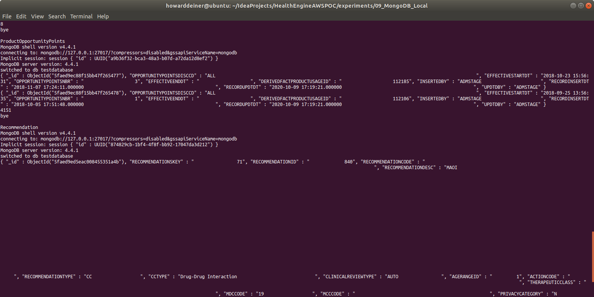
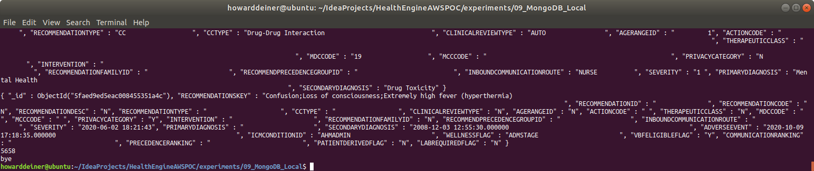

### Starting out with MongoDB

##### Concept

> MongoDB is a cross-platform document-oriented database program. Classified as a NoSQL database program, MongoDB uses JSON-like documents with optional schemas. MongoDB is developed by MongoDB Inc. and licensed under the Server Side Public License (SSPL).

> https://en.wikipedia.org/wiki/PostgreSQL

> https://www.mongodb.com

#### Execution

We want to get into MongoDB quickly.  So, before we start running AWS instances, we need to master our data and how we're going to instantiate it in the database.

This whole project is about rearchitecting the database behind CareEngine, and we will try several different databases to do that.

### 01_startup.sh
This script uses docker-compose to take the latest Dockerhub postgres image and bring it up in a container running as a daemon.  Since Postgres wants to persist data, I use a Docker Volume, which I delete in 03_shutdown.sh

Since we do not want to make use of the database until it actually starts, I monitor the logs from the postgres_container until I see a signature which tells me that the database has started.
```bash
#!/usr/bin/env bash

figlet -w 160 -f small "Startup MongoDB/MongoClient Locally"
docker volume rm 09_mongodb_local_mongo_data
docker volume rm 09_mongodb_local_mongoclient_data
docker-compose -f docker-compose.yml up -d

figlet -w 160 -f small "Wait For MongoDB To Start"
while true ; do
  docker logs mongodb_container > stdout.txt 2> stderr.txt
  result=$(grep -cE "Waiting for connections.*port.*27017" stdout.txt)
  if [ $result != 0 ] ; then
    echo "MongoDB has started"
    break
  fi
  sleep 5
done
rm stdout.txt stderr.txt
```
### 02_populate.sh
This script first the data from the S3 bucket and massages them to make them suitable for using mongoimport and bring them inti the database.  Each file from S3 must:
<ol>
<li>Be decrypted decoded from its AES256 cryptographically secure file </li>
<li>Get a header line inserted before the data with it's colunn heading.</li>
<li>Have all od if't bars translater into tabs</li>
<li>Have the end of line carriage return symvol (\r), smetimes visualized as a ^M) removed</li>
<li>Used in a mongoimport script, with the file and the data headers expsosed.</li>
</ol>

The script then uses mongo to demonstrate that the testdatabase has the collections we created and populated.

It prints out the first two records for each sollection and then the number of records in the collection. 
```bash
#!/usr/bin/env bash

figlet -w 160 -f small "Get Data from S3 Bucket"
../../data/transfer_from_s3_and_decrypt.sh ce.Clinical_Condition.csv
../../data/transfer_from_s3_and_decrypt.sh ce.DerivedFact.csv
../../data/transfer_from_s3_and_decrypt.sh ce.DerivedFactProductUsage.csv
../../data/transfer_from_s3_and_decrypt.sh ce.MedicalFinding.csv
../../data/transfer_from_s3_and_decrypt.sh ce.MedicalFindingType.csv
../../data/transfer_from_s3_and_decrypt.sh ce.OpportunityPointsDiscr.csv
../../data/transfer_from_s3_and_decrypt.sh ce.ProductFinding.csv
../../data/transfer_from_s3_and_decrypt.sh ce.ProductFindingType.csv
../../data/transfer_from_s3_and_decrypt.sh ce.ProductOpportunityPoints.csv
../../data/transfer_from_s3_and_decrypt.sh ce.Recommendation.csv

echo "Clinical_Condition"
figlet -w 160 -f small "Populate MongoDB Locally"
# add header
sed -i '1 i\CLINICAL_CONDITION_COD|CLINICAL_CONDITION_NAM|INSERTED_BY|REC_INSERT_DATE|REC_UPD_DATE|UPDATED_BY|CLINICALCONDITIONCLASSCD|CLINICALCONDITIONTYPECD|CLINICALCONDITIONABBREV' ce.Clinical_Condition.csv
# convert bars to tabs
sed -i 's/|/\t/g' ce.Clinical_Condition.csv
# get rid of ^M (return characters)
tr -d $'\r' < ce.Clinical_Condition.csv > ce.Clinical_Condition.csv.mod
docker cp ce.Clinical_Condition.csv.mod mongodb_container:/tmp/ce.Clinical_Condition
docker exec mongodb_container bash -c "mongoimport --type tsv -d testdatabase -c Clinical_Condition --headerline /tmp/ce.Clinical_Condition"

echo "DerivedFact"
# add header
sed -i '1 i\DERIVEDFACTID|DERIVEDFACTTRACKINGID|DERIVEDFACTTYPEID|INSERTEDBY|RECORDINSERTDT|RECORDUPDTDT|UPDTDBY' ce.DerivedFact.csv
# convert bars to tabs
sed -i 's/|/\t/g' ce.DerivedFact.csv
# get rid of ^M (return characters)
tr -d $'\r' < ce.DerivedFact.csv > ce.DerivedFact.csv.mod
docker cp ce.DerivedFact.csv.mod mongodb_container:/tmp/ce.DerivedFact.csv
docker exec mongodb_container bash -c "mongoimport --type tsv -d testdatabase -c DerivedFact --headerline /tmp/ce.DerivedFact.csv"

echo "DerivedFactProductUsage"
# add header
sed -i '1 i\DERIVEDFACTPRODUCTUSAGEID|DERIVEDFACTID|PRODUCTMNEMONICCD|INSERTEDBY|RECORDINSERTDT|RECORDUPDTDT|UPDTDBY' ce.DerivedFactProductUsage.csv
# convert bars to tabs
sed -i 's/|/\t/g' ce.DerivedFactProductUsage.csv
# get rid of ^M (return characters)
tr -d $'\r' < ce.DerivedFactProductUsage.csv > ce.DerivedFactProductUsage.csv.mod
docker cp ce.DerivedFactProductUsage.csv.mod mongodb_container:/tmp/ce.DerivedFactProductUsage.csv
docker exec mongodb_container bash -c "mongoimport --type tsv -d testdatabase -c DerivedFactProductUsage --headerline /tmp/ce.DerivedFactProductUsage.csv"

echo "MedicalFinding"
# add header
sed -i '1 i\MEDICALFINDINGID|MEDICALFINDINGTYPECD|MEDICALFINDINGNM|SEVERITYLEVELCD|IMPACTABLEFLG|CLINICAL_CONDITION_COD|INSERTEDBY|RECORDINSERTDT|RECORDUPDTDT|UPDTDBY|ACTIVEFLG|OPPORTUNITYPOINTSDISCRCD' ce.MedicalFinding.csv
# convert bars to tabs
sed -i 's/|/\t/g' ce.MedicalFinding.csv
# get rid of ^M (return characters)
tr -d $'\r' < ce.MedicalFinding.csv > ce.MedicalFinding.csv.mod
docker cp ce.MedicalFinding.csv.mod mongodb_container:/tmp/ce.MedicalFinding.csv
docker exec mongodb_container bash -c "mongoimport --type tsv -d testdatabase -c MedicalFinding --headerline /tmp/ce.MedicalFinding.csv"

echo "MedicalFindingType"
# add header
sed -i '1 i\MEDICALFINDINGTYPECD|MEDICALFINDINGTYPEDESC|INSERTEDBY|RECORDINSERTDT|RECORDUPDTDT|UPDTDBY|HEALTHSTATEAPPLICABLEFLAG' ce.MedicalFindingType.csv
# convert bars to tabs
sed -i 's/|/\t/g' ce.MedicalFindingType.csv
# get rid of ^M (return characters)
tr -d $'\r' < ce.MedicalFindingType.csv > ce.MedicalFindingType.csv.mod
docker cp ce.MedicalFindingType.csv.mod mongodb_container:/tmp/ce.MedicalFindingType.csv
docker exec mongodb_container bash -c "mongoimport --type tsv -d testdatabase -c MedicalFinding --headerline /tmp/ce.MedicalFindingType.csv"

echo "OpportunityPointsDiscr"
# add header
sed -i '1 i\OPPORTUNITYPOINTSDISCRCD|OPPORTUNITYPOINTSDISCNM|INSERTEDBY|RECORDINSERTDT|RECORDUPDTDT|UPDTDBY' ce.OpportunityPointsDiscr.csv
# convert bars to tabs
sed -i 's/|/\t/g' ce.OpportunityPointsDiscr.csv
# get rid of ^M (return characters)
tr -d $'\r' < ce.OpportunityPointsDiscr.csv > ce.OpportunityPointsDiscr.csv.mod
docker cp ce.OpportunityPointsDiscr.csv.mod mongodb_container:/tmp/ce.OpportunityPointsDiscr.csv
docker exec mongodb_container bash -c "mongoimport --type tsv -d testdatabase -c OpportunityPointsDiscr --headerline /tmp/ce.OpportunityPointsDiscr.csv"

echo "ProductFinding"
# add header
sed -i '1 i\PRODUCTFINDINGTYPECD|PRODUCTFINDINGTYPEDESC|INSERTEDBY|RECORDINSERTDT|RECORDUPDTDT|UPDTDBY' ce.ProductFinding.csv
# convert bars to tabs
sed -i 's/|/\t/g' ce.ProductFinding.csv
# get rid of ^M (return characters)
tr -d $'\r' < ce.ProductFinding.csv > ce.ProductFinding.csv.mod
docker cp ce.ProductFinding.csv.mod mongodb_container:/tmp/ce.ProductFinding.csv
docker exec mongodb_container bash -c "mongoimport --type tsv -d testdatabase -c ProductFinding --headerline /tmp/ce.ProductFinding.csv"

echo "ProductFindingType"
# add header
sed -i '1 i\PRODUCTFINDINGTYPECD|PRODUCTFINDINGTYPEDESC|INSERTEDBY|RECORDINSERTDT|RECORDUPDTDT|UPDTDBY' ce.ProductFindingType.csv
# convert bars to tabs
sed -i 's/|/\t/g' ce.ProductFindingType.csv
# get rid of ^M (return characters)
tr -d $'\r' < ce.ProductFindingType.csv > ce.ProductFindingType.csv.mod
docker cp ce.ProductFindingType.csv.mod mongodb_container:/tmp/ce.ProductFindingType.csv
docker exec mongodb_container bash -c "mongoimport --type tsv -d testdatabase -c ProductFindingType --headerline /tmp/ce.ProductFindingType.csv"

echo "ProductOpportunityPoints"
# add header
sed -i '1 i\OPPORTUNITYPOINTSDISCCD|EFFECTIVESTARTDT|OPPORTUNITYPOINTSNBR|EFFECTIVEENDDT|DERIVEDFACTPRODUCTUSAGEID|INSERTEDBY|RECORDINSERTDT|RECORDUPDTDT|UPDTDBY' ce.ProductOpportunityPoints.csv
# convert bars to tabs
sed -i 's/|/\t/g' ce.ProductOpportunityPoints.csv
# get rid of ^M (return characters)
tr -d $'\r' < ce.ProductOpportunityPoints.csv > ce.ProductOpportunityPoints.csv.mod
docker cp ce.ProductOpportunityPoints.csv.mod mongodb_container:/tmp/ce.ProductOpportunityPoints.csv
docker exec mongodb_container bash -c "mongoimport --type tsv -d testdatabase -c ProductOpportunityPoints --headerline /tmp/ce.ProductOpportunityPoints.csv"

echo "Recommendation"
# add header
sed -i '1 i\RECOMMENDATIONSKEY|RECOMMENDATIONID|RECOMMENDATIONCODE|RECOMMENDATIONDESC|RECOMMENDATIONTYPE|CCTYPE|CLINICALREVIEWTYPE|AGERANGEID|ACTIONCODE|THERAPEUTICCLASS|MDCCODE|MCCCODE|PRIVACYCATEGORY|INTERVENTION|RECOMMENDATIONFAMILYID|RECOMMENDPRECEDENCEGROUPID|INBOUNDCOMMUNICATIONROUTE|SEVERITY|PRIMARYDIAGNOSIS|SECONDARYDIAGNOSIS|ADVERSEEVENT|ICMCONDITIONID|WELLNESSFLAG|VBFELIGIBLEFLAG|COMMUNICATIONRANKING|PRECEDENCERANKING|PATIENTDERIVEDFLAG|LABREQUIREDFLAG|UTILIZATIONTEXTAVAILABLEF|SENSITIVEMESSAGEFLAG|HIGHIMPACTFLAG|ICMLETTERFLAG|REQCLINICIANCLOSINGFLAG|OPSIMPELMENTATIONPHASE|SEASONALFLAG|SEASONALSTARTDT|SEASONALENDDT|EFFECTIVESTARTDT|EFFECTIVEENDDT|RECORDINSERTDT|RECORDUPDTDT|INSERTEDBY|UPDTDBY|STANDARDRUNFLAG|INTERVENTIONFEEDBACKFAMILYID|CONDITIONFEEDBACKFAMILYID|ASHWELLNESSELIGIBILITYFLAG|HEALTHADVOCACYELIGIBILITYFLAG' ce.Recommendation.csv
# convert bars to tabs
sed -i 's/|/\t/g' ce.Recommendation.csv
# get rid of ^M (return characters)
tr -d $'\r' < ce.Recommendation.csv > ce.Recommendation.csv.mod
docker cp ce.Recommendation.csv.mod mongodb_container:/tmp/ce.Recommendation.csv
docker exec mongodb_container bash -c "mongoimport --type tsv -d testdatabase -c Recommendation --headerline /tmp/ce.Recommendation.csv"


figlet -w 160 -f small "Check MongoDB Locally"
echo ""
echo "Clinical_Condition"
echo 'use testdatabase' > .mongo.js
echo 'db.Clinical_Condition.find().limit(2)' >> .mongo.js
echo 'db.Clinical_Condition.count()' >> .mongo.js
echo 'exit' >> .mongo.js
docker cp .mongo.js mongodb_container:/tmp/.mongo.js
docker exec mongodb_container bash -c "mongo < /tmp/.mongo.js"

echo ""
echo "DerivedFact"
echo 'use testdatabase' > .mongo.js
echo 'db.DerivedFact.find().limit(2)' >> .mongo.js
echo 'db.DerivedFact.count()' >> .mongo.js
echo 'exit' >> .mongo.js
docker cp .mongo.js mongodb_container:/tmp/.mongo.js
docker exec mongodb_container bash -c "mongo < /tmp/.mongo.js"

echo ""
echo "MedicalFinding"
echo 'use testdatabase' > .mongo.js
echo 'db.MedicalFinding.find().limit(2)' >> .mongo.js
echo 'db.MedicalFinding.count()' >> .mongo.js
echo 'exit' >> .mongo.js
docker cp .mongo.js mongodb_container:/tmp/.mongo.js
docker exec mongodb_container bash -c "mongo < /tmp/.mongo.js"

echo ""
echo "MedicalFindingType"
echo 'use testdatabase' > .mongo.js
echo 'db.MedicalFindingType.find().limit(2)' >> .mongo.js
echo 'db.MedicalFindingType.count()' >> .mongo.js
echo 'exit' >> .mongo.js
docker cp .mongo.js mongodb_container:/tmp/.mongo.js
docker exec mongodb_container bash -c "mongo < /tmp/.mongo.js"

echo ""
echo "OpportunityPointsDiscr"
echo 'use testdatabase' > .mongo.js
echo 'db.OpportunityPointsDiscr.find().limit(2)' >> .mongo.js
echo 'db.OpportunityPointsDiscr.count()' >> .mongo.js
echo 'exit' >> .mongo.js
docker cp .mongo.js mongodb_container:/tmp/.mongo.js
docker exec mongodb_container bash -c "mongo < /tmp/.mongo.js"

echo ""
echo "ProductFinding"
echo 'use testdatabase' > .mongo.js
echo 'db.ProductFinding.find().limit(2)' >> .mongo.js
echo 'db.ProductFinding.count()' >> .mongo.js
echo 'exit' >> .mongo.js
docker cp .mongo.js mongodb_container:/tmp/.mongo.js
docker exec mongodb_container bash -c "mongo < /tmp/.mongo.js"

echo ""
echo "ProductFindingType"
echo 'use testdatabase' > .mongo.js
echo 'db.ProductFindingType.find().limit(2)' >> .mongo.js
echo 'db.ProductFindingType.count()' >> .mongo.js
echo 'exit' >> .mongo.js
docker cp .mongo.js mongodb_container:/tmp/.mongo.js
docker exec mongodb_container bash -c "mongo < /tmp/.mongo.js"

echo ""
echo "ProductOpportunityPoints"
echo 'use testdatabase' > .mongo.js
echo 'db.ProductOpportunityPoints.find().limit(2)' >> .mongo.js
echo 'db.ProductOpportunityPoints.count()' >> .mongo.js
echo 'exit' >> .mongo.js
docker cp .mongo.js mongodb_container:/tmp/.mongo.js
docker exec mongodb_container bash -c "mongo < /tmp/.mongo.js"

echo ""
echo "Recommendation"
echo 'use testdatabase' > .mongo.js
echo 'db.Recommendation.find().limit(2)' >> .mongo.js
echo 'db.Recommendation.count()' >> .mongo.js
echo 'exit' >> .mongo.js
docker cp .mongo.js mongodb_container:/tmp/.mongo.js
docker exec mongodb_container bash -c "mongo < /tmp/.mongo.js"

rm .mongo.js *.csv *.mod

```

### 03_shutdown.sh
This script is brutely simple.  It uses docker-compose to bring down the environment it established, and then uses docker volume rm to delete the data which held the bits for out database data.

```bash
#!/usr/bin/env bash

figlet -w 160 -f small "Shutdown MongoDB Locally"
docker-compose -f docker-compose.yml down
docker volume rm 09_mongodb_local_mongo_data
```

### Putting it all together...

It all looks something like this:

\
<BR />
\
\
\
\
\
\
\
<BR />
\
<BR />
