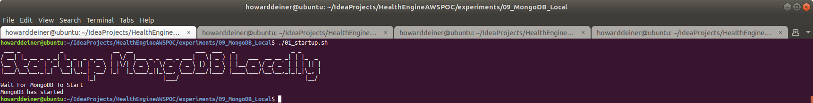
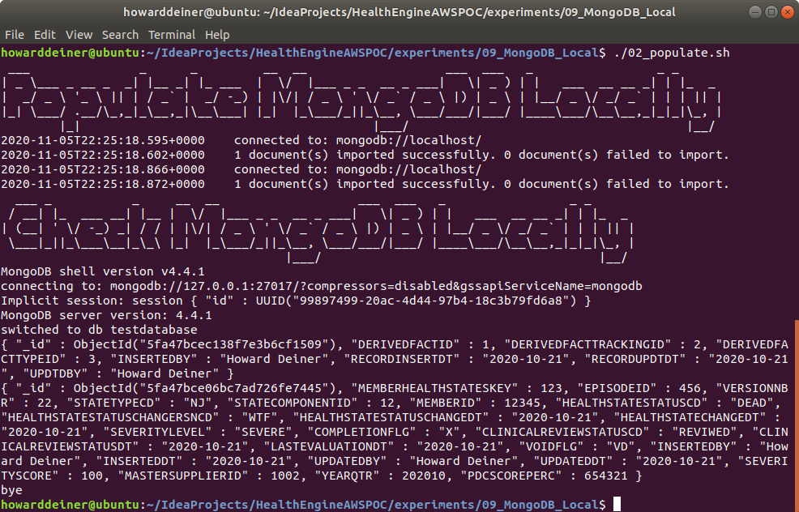
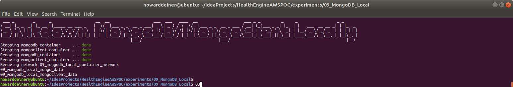

### Starting out with MongoDB

##### Concept

> MongoDB is a cross-platform document-oriented database program. Classified as a NoSQL database program, MongoDB uses JSON-like documents with optional schemas. MongoDB is developed by MongoDB Inc. and licensed under the Server Side Public License (SSPL).

> https://en.wikipedia.org/wiki/PostgreSQL

> https://www.mongodb.com

#### Execution

We want to get into MongoDB quickly.  So, before we start running AWS instances, we need to master our data and how we're going to instantiate it in the database.

This whole project is about rearchitecting the database behind CareEngine, and we will try several different databases to do that.

### 01_startup.sh
This script uses docker-compose to take the latest Dockerhub postgres image and bring it up in a container running as a daemon.  Since Postgres wants to persist data, I use a Docker Volume, which I delete in 03_shutdown.sh

Since we do not want to make use of the database until it actually starts, I monitor the logs from the postgres_container until I see a signature which tells me that the database has started.
```bash
#!/usr/bin/env bash

figlet -w 160 -f small "Startup MongoDB Locally"
docker volume rm 09_mongodb_local_mongo_data
docker-compose -f docker-compose.yml up -d

figlet -w 160 -f small "Wait For MongoDB To Start"
while true ; do
  docker logs mongodb_container > stdout.txt 2> stderr.txt
  result=$(grep -cE "Waiting for connections.*port.*27017" stdout.txt)
  if [ $result != 0 ] ; then
    echo "MongoDB has started"
    break
  fi
  sleep 5
done
rm stdout.txt stderr.txt
```
### 02_populate.sh
This script first uses the running mongodb_container and runs mongoimport in the container to create our database directly from the csv data.

The script then uses mongo to demonstrate that the testdatabase has the collections we created and populated.
```bash
#!/usr/bin/env bash

figlet -w 160 -f small "Populate MongoDB Locally"
docker cp ../../src/db/DERIVEDFACT.csv mongodb_container:/tmp/DERIVEDFACT.csv
docker exec mongodb_container bash -c "mongoimport --type csv -d testdatabase -c DERIVEDFACT --headerline /tmp/DERIVEDFACT.csv"
docker cp ../../src/db/MEMBERHEALTHSTATE.csv mongodb_container:/tmp/MEMBERHEALTHSTATE.csv
docker exec mongodb_container bash -c "mongoimport --type csv -d testdatabase -c MEMBERHEALTHSTATE --headerline /tmp/MEMBERHEALTHSTATE.csv"

figlet -w 160 -f small "Check MongoDB Locally"
echo 'use testdatabase' > .mongo.js
echo 'db.DERIVEDFACT.find()' >> .mongo.js
echo 'db.MEMBERHEALTHSTATE.find()' >> .mongo.js
echo 'exit' >> .mongo.js

docker cp .mongo.js mongodb_container:/tmp/.mongo.js
docker exec mongodb_container bash -c "mongo < /tmp/.mongo.js"
rm .mongo.js
```

### 03_shutdown.sh
This script is brutely simple.  It uses docker-compose to bring down the environment it established, and then uses docker volume rm to delete the data which held the bits for out database data.

```bash
#!/usr/bin/env bash

figlet -w 160 -f small "Shutdown MongoDB Locally"
docker-compose -f docker-compose.yml down
docker volume rm 09_mongodb_local_mongo_data
```

### Putting it all together...

It all looks something like this:

\
<BR />
\
<BR />
\
<BR />
