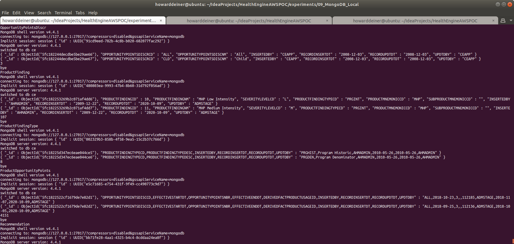
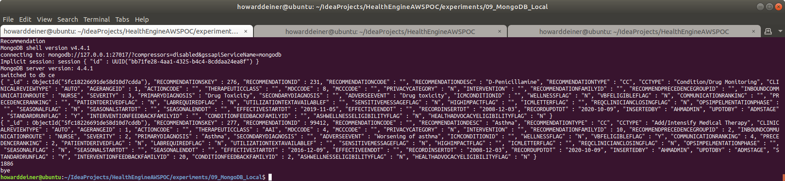
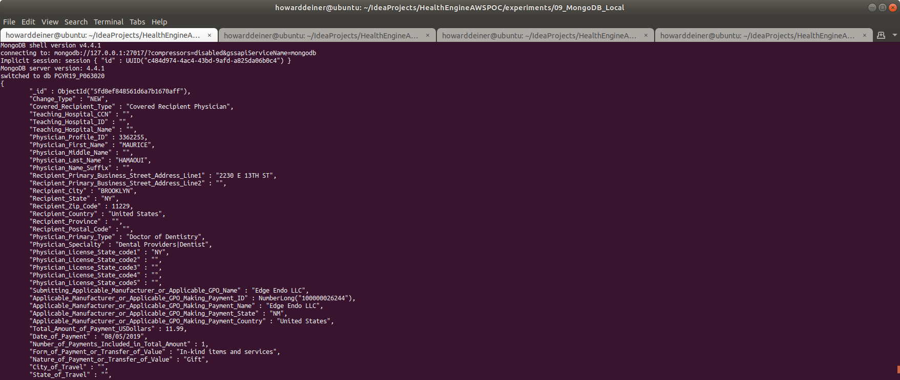

### Starting out with MongoDB

##### Concept

> MongoDB is a cross-platform document-oriented database program. Classified as a NoSQL database program, MongoDB uses JSON-like documents with optional schemas. MongoDB is developed by MongoDB Inc. and licensed under the Server Side Public License (SSPL).

> https://en.wikipedia.org/wiki/PostgreSQL

> https://www.mongodb.com

#### Execution

We want to get into MongoDB quickly.  So, before we start running AWS instances, we need to master our data and how we're going to instantiate it in the database.

This whole project is about rearchitecting the database behind CareEngine, and we will try several different databases to do that.

### 01_startup.sh
This script uses docker-compose to take the latest Dockerhub postgres image and bring it up in a container running as a daemon.  Since Postgres wants to persist data, I use a Docker Volume, which I delete in 03_shutdown.sh

Since we do not want to make use of the database until it actually starts, I monitor the logs from the postgres_container until I see a signature which tells me that the database has started.
```bash
#!/usr/bin/env bash

../../startExperiment.sh

bash -c 'cat << "EOF" > .script
#!/usr/bin/env bash
echo "Startup MongoDB Locally"
docker volume rm 09_mongodb_local_mongo_data
docker volume rm 09_mongodb_local_mongoclient_data
docker-compose -f docker-compose.yml up -d

figlet -w 160 -f small "Wait For MongoDB To Start"
while true ; do
  docker logs mongodb_container > stdout.txt 2> stderr.txt
  result=$(grep -cE "Waiting for connections.*port.*27017" stdout.txt)
  if [ $result != 0 ] ; then
    echo "MongoDB has started"
    break
  fi
  sleep 5
done
rm stdout.txt stderr.txt
EOF'
chmod +x .script
command time -v ./.script 2> .results
../../getExperimentalResults.sh
experiment=$(../../getExperimentNumber.sh)
../../getDataAsCSVline.sh .results ${experiment} "09_MongoDB_Local: Startup MongoDB Locally" >> Experimental\ Results.csv
../../putExperimentalResults.sh
rm .script .results Experimental\ Results.csv
```
### 02_populate.sh
This script first the data from the S3 bucket and massages them to make them suitable for using mongoimport and bring them inti the database.  Each file from S3 must:
<ol>
<li>Be decrypted decoded from its AES256 cryptographically secure file </li>
<li>Get a header line inserted before the data with it's colunn heading.</li>
<li>get sed, tr, and merge working to make this a proper csv</li>
<li>Used in a mongoimport script, with the file and the data headers expsosed.</li>
</ol>

The script then uses mongo to demonstrate that the testdatabase has the collections we created and populated.

It prints out the first two records for each collection and then the number of records in the collection. 
```bash
#!/usr/bin/env bash

bash -c 'cat << "EOF" > .script
#!/usr/bin/env bash
figlet -w 240 -f small "Get Data from S3 Bucket"
../../data/transfer_from_s3_and_decrypt.sh ce.Clinical_Condition.csv
../../data/transfer_from_s3_and_decrypt.sh ce.DerivedFact.csv
../../data/transfer_from_s3_and_decrypt.sh ce.DerivedFactProductUsage.csv
../../data/transfer_from_s3_and_decrypt.sh ce.MedicalFinding.csv
../../data/transfer_from_s3_and_decrypt.sh ce.MedicalFindingType.csv
../../data/transfer_from_s3_and_decrypt.sh ce.OpportunityPointsDiscr.csv
../../data/transfer_from_s3_and_decrypt.sh ce.ProductFinding.csv
../../data/transfer_from_s3_and_decrypt.sh ce.ProductFindingType.csv
../../data/transfer_from_s3_and_decrypt.sh ce.ProductOpportunityPoints.csv
../../data/transfer_from_s3_and_decrypt.sh ce.Recommendation.csv
EOF'
chmod +x .script
command time -v ./.script 2> .results
../../getExperimentalResults.sh
experiment=$(../../getExperimentNumber.sh)
../../getDataAsCSVline.sh .results ${experiment} "09_MongoDB_Local: Get Data from S3 Bucket" >> Experimental\ Results.csv
../../putExperimentalResults.sh
rm .script .results Experimental\ Results.csv

bash -c 'cat << "EOF" > .script
#!/usr/bin/env bash
figlet -w 240 -f small "Process S3 Data into CSV Files For Import"
../transform_Oracle_ce.ClinicalCondition_to_csv.sh
../transform_Oracle_ce.DerivedFact_to_csv.sh
../transform_Oracle_ce.DerivedFactProductUsage_to_csv.sh
../transform_Oracle_ce.MedicalFinding_to_csv.sh
../transform_Oracle_ce.MedicalFindingType_to_csv.sh
../transform_Oracle_ce.OpportunityPointsDiscr_to_csv.sh
../transform_Oracle_ce.ProductFinding_to_csv.sh
../transform_Oracle_ce.ProductFindingType_to_csv.sh
../transform_Oracle_ce.ProductOpportunityPoints_to_csv.sh
../transform_Oracle_ce.Recommendation_to_csv.sh
EOF'
chmod +x .script
command time -v ./.script 2> .results
../../getExperimentalResults.sh
experiment=$(../../getExperimentNumber.sh)
../../getDataAsCSVline.sh .results ${experiment} "09_MongoDB_Local: Process S3 Data into CSV Files For Import" >> Experimental\ Results.csv
../../putExperimentalResults.sh
rm .script .results Experimental\ Results.csv

bash -c 'cat << "EOF" > .script
#!/usr/bin/env bash
figlet -w 160 -f small "Populate MongoDB Data"
echo "Clinical_Condition"
docker cp ce.ClinicalCondition.csv mongodb_container:/tmp/ce.ClinicalCondition.csv
docker exec mongodb_container bash -c "mongoimport --type csv -d ce -c Clinical_Condition --headerline /tmp/ce.ClinicalCondition.csv"
echo "DerivedFact"
docker cp ce.DerivedFact.csv mongodb_container:/tmp/ce.DerivedFact.csv
docker exec mongodb_container bash -c "mongoimport --type csv -d ce -c DerivedFact --headerline /tmp/ce.DerivedFact.csv"
echo "DerivedFactProductUsage"
docker cp ce.DerivedFactProductUsage.csv mongodb_container:/tmp/ce.DerivedFactProductUsage.csv
docker exec mongodb_container bash -c "mongoimport --type csv -d ce -c DerivedFactProductUsage --headerline /tmp/ce.DerivedFactProductUsage.csv"
echo "MedicalFinding"
docker cp ce.MedicalFinding.csv mongodb_container:/tmp/ce.MedicalFinding.csv
docker exec mongodb_container bash -c "mongoimport --type csv -d ce -c MedicalFinding --headerline /tmp/ce.MedicalFinding.csv"
echo "MedicalFindingType"
docker cp ce.MedicalFindingType.csv mongodb_container:/tmp/ce.MedicalFindingType.csv
docker exec mongodb_container bash -c "mongoimport --type csv -d ce -c MedicalFinding --headerline /tmp/ce.MedicalFindingType.csv"
echo "OpportunityPointsDiscr"
docker cp ce.OpportunityPointsDiscr.csv mongodb_container:/tmp/ce.OpportunityPointsDiscr.csv
docker exec mongodb_container bash -c "mongoimport --type csv -d ce -c OpportunityPointsDiscr --headerline /tmp/ce.OpportunityPointsDiscr.csv"
echo "ProductFinding"
docker cp ce.ProductFinding.csv mongodb_container:/tmp/ce.ProductFinding.csv
docker exec mongodb_container bash -c "mongoimport --type csv -d ce -c ProductFinding --headerline /tmp/ce.ProductFinding.csv"
echo "ProductFindingType"
docker cp ce.ProductFindingType.csv mongodb_container:/tmp/ce.ProductFindingType.csv
docker exec mongodb_container bash -c "mongoimport --type tsv -d ce -c ProductFindingType --headerline /tmp/ce.ProductFindingType.csv"
echo "ProductOpportunityPoints"
docker cp ce.ProductOpportunityPoints.csv mongodb_container:/tmp/ce.ProductOpportunityPoints.csv
docker exec mongodb_container bash -c "mongoimport --type tsv -d ce -c ProductOpportunityPoints --headerline /tmp/ce.ProductOpportunityPoints.csv"
echo "Recommendation"
docker cp ce.Recommendation.csv mongodb_container:/tmp/ce.Recommendation.csv
docker exec mongodb_container bash -c "mongoimport --type csv -d ce -c Recommendation --headerline /tmp/ce.Recommendation.csv"
EOF'
chmod +x .script
command time -v ./.script 2> .results
../../getExperimentalResults.sh
experiment=$(../../getExperimentNumber.sh)
../../getDataAsCSVline.sh .results ${experiment} "09_MongoDB_Local: Populate MongoDB Data" >> Experimental\ Results.csv
../../putExperimentalResults.sh
rm .script .results Experimental\ Results.csv

bash -c 'cat << "EOF" > .script
#!/usr/bin/env bash
figlet -w 160 -f small "Check MongoDB Locally"
echo "Clinical_Condition"
echo "use ce" > .mongo.js
echo "db.Clinical_Condition.find().limit(2)" >> .mongo.js
echo "db.Clinical_Condition.count()" >> .mongo.js
echo "exit" >> .mongo.js
docker cp .mongo.js mongodb_container:/tmp/.mongo.js
docker exec mongodb_container bash -c "mongo < /tmp/.mongo.js"
echo "DerivedFact"
echo "use ce" > .mongo.js
echo "db.DerivedFact.find().limit(2)" >> .mongo.js
echo "db.DerivedFact.count()" >> .mongo.js
echo "exit" >> .mongo.js
docker cp .mongo.js mongodb_container:/tmp/.mongo.js
docker exec mongodb_container bash -c "mongo < /tmp/.mongo.js"
echo "MedicalFinding"
echo "use ce" > .mongo.js
echo "db.MedicalFinding.find().limit(2)" >> .mongo.js
echo "db.MedicalFinding.count()" >> .mongo.js
echo "exit" >> .mongo.js
docker cp .mongo.js mongodb_container:/tmp/.mongo.js
docker exec mongodb_container bash -c "mongo < /tmp/.mongo.js"
echo "MedicalFindingType"
echo "use ce" > .mongo.js
echo "db.MedicalFindingType.find().limit(2)" >> .mongo.js
echo "db.MedicalFindingType.count()" >> .mongo.js
echo "exit" >> .mongo.js
docker cp .mongo.js mongodb_container:/tmp/.mongo.js
docker exec mongodb_container bash -c "mongo < /tmp/.mongo.js"
echo "OpportunityPointsDiscr"
echo "use ce" > .mongo.js
echo "db.OpportunityPointsDiscr.find().limit(2)" >> .mongo.js
echo "db.OpportunityPointsDiscr.count()" >> .mongo.js
echo "exit" >> .mongo.js
docker cp .mongo.js mongodb_container:/tmp/.mongo.js
docker exec mongodb_container bash -c "mongo < /tmp/.mongo.js"
echo "ProductFinding"
echo "use ce" > .mongo.js
echo "db.ProductFinding.find().limit(2)" >> .mongo.js
echo "db.ProductFinding.count()" >> .mongo.js
echo "exit" >> .mongo.js
docker cp .mongo.js mongodb_container:/tmp/.mongo.js
docker exec mongodb_container bash -c "mongo < /tmp/.mongo.js"
echo "ProductFindingType"
echo "use ce" > .mongo.js
echo "db.ProductFindingType.find().limit(2)" >> .mongo.js
echo "db.ProductFindingType.count()" >> .mongo.js
echo "exit" >> .mongo.js
docker cp .mongo.js mongodb_container:/tmp/.mongo.js
docker exec mongodb_container bash -c "mongo < /tmp/.mongo.js"
echo "ProductOpportunityPoints"
echo "use ce" > .mongo.js
echo "db.ProductOpportunityPoints.find().limit(2)" >> .mongo.js
echo "db.ProductOpportunityPoints.count()" >> .mongo.js
echo "exit" >> .mongo.js
docker cp .mongo.js mongodb_container:/tmp/.mongo.js
docker exec mongodb_container bash -c "mongo < /tmp/.mongo.js"
echo "Recommendation"
echo "use ce" > .mongo.js
echo "db.Recommendation.find().limit(2)" >> .mongo.js
echo "db.Recommendation.count()" >> .mongo.js
echo "exit" >> .mongo.js
docker cp .mongo.js mongodb_container:/tmp/.mongo.js
docker exec mongodb_container bash -c "mongo < /tmp/.mongo.js"
EOF'
chmod +x .script
command time -v ./.script 2> .results
../../getExperimentalResults.sh
experiment=$(../../getExperimentNumber.sh)
../../getDataAsCSVline.sh .results ${experiment} "09_MongoDB_Local: Check MongoDB Data" >> Experimental\ Results.csv
../../putExperimentalResults.sh
rm .script .mongo.js .results *.csv
```

### 03_startup_app.sh
Here, we bring up the CECacheServer with docker-compose with the same network as we used to bring up MongoDB in, so the CECacheServer can make requests of the database.
<BR/>
Normally, we would do this in the 01_startup.sh script, but we want to seperate out the effects of the database from the application for performance collection purposes, so we do it here.

```bash
#!/usr/bin/env bash

bash -c 'cat << "EOF" > .script
#!/usr/bin/env bash
figlet -w 240 -f small "Startup CECacheServer Locally"
docker volume rm 09_mongodb_local_cecacheserver_data
docker-compose -f docker-compose.app.yml up -d --build
echo "Wait For CECacheServer To Start"
while true ; do
  docker logs cecacheserver_formongodb_container > stdout.txt 2> stderr.txt
#  result=$(grep -cE "<<<<< Local Cache Statistics <<<<<" stdout.txt) cecacheserver_formongodb_container is failing!
  result=$(grep -cE "using Agent sizeof engine" stdout.txt)
  if [ $result != 0 ] ; then
    echo "CECacheServer has started"
    break
  fi
  sleep 5
done
rm stdout.txt stderr.txt
EOF'
chmod +x .script
command time -v ./.script 2> .results
../../getExperimentalResults.sh
experiment=$(../../getExperimentNumber.sh)
../../getDataAsCSVline.sh .results ${experiment} "09_MongoDB_Local: Startup CECacheServer Locally" >> Experimental\ Results.csv
../../putExperimentalResults.sh
rm .script .results Experimental\ Results.csv
```

### 04_shutdown.sh
This script is brutely simple.  It uses docker-compose to bring down the environment it established, and then uses docker volume rm to delete the data which held the bits for out database data.

```bash
#!/usr/bin/env bash

bash -c 'cat << "EOF" > .script
#!/usr/bin/env bash
figlet -w 240 -f small "Shutdown MongoDB and CECacheServer Locally"
docker-compose -f docker-compose.app.yml down
docker volume rm 09_mongodb_local_cecacheserver_data
docker-compose -f docker-compose.yml down
docker volume rm 09_mongodb_local_mongo_data
docker volume rm 09_mongodb_local_mongoclient_data
EOF'
chmod +x .script
command time -v ./.script 2> .results
../../getExperimentalResults.sh
experiment=$(../../getExperimentNumber.sh)
../../getDataAsCSVline.sh .results  ${experiment} "09_MongoDB_Local: Shutdown MongoDB and CECacheServer Locally" >> Experimental\ Results.csv
../../putExperimentalResults.sh
rm .script .results Experimental\ Results.csv

../../endExperiment.sh
```

### Putting it all together...

It all looks something like this:

\
<BR />
\
\
\
\
<BR />
\
<BR />
\
<BR />
And just for laughs, here's the timings for this run.  All kept in a csv file in S3 at s3://health-engine-aws-poc/Experimental Results.csv
\
<BR />

### Large Data Experiments

A different script is available for large data testing.  This transfers the dataset for large volume testing.  It uses the data from the "Complete 2019 Program Year Open Payments Dataset" from the Center for Medicare & Medicade Services.  See https://www.cms.gov/OpenPayments/Explore-the-Data/Dataset-Downloads for details.  In total, there is over 6GB in this dataset.

The script 02_populate_large_data.sh is a variation on 02_populate.sh.
```bash
#!/usr/bin/env bash

if [ $# -eq 0 ]
  then
    echo "must supply the command with the number of rows to use"
    exit 1
fi

re='^[0-9]+$'
if ! [[ $1 =~ $re ]] ; then
    echo "must supply the command with the number of rows to use"
   exit 1
fi

ROWS=$1
export ROWS

bash -c 'cat << "EOF" > .script
#!/usr/bin/env bash

echo $1

figlet -w 240 -f small "Populate MongoDB Locally - Large Data - $(numfmt --grouping $ROWS) rows"

#!/usr/bin/env bash
figlet -w 240 -f small "Get Data from S3 Bucket"
../../data/transferPGYR19_P063020_from_s3_and_decrypt.sh
EOF'
chmod +x .script
command time -v ./.script 2> .results
../../getExperimentalResults.sh
experiment=$(../../getExperimentNumber.sh)
../../getDataAsCSVline.sh .results ${experiment} "09_MongoDB_Local: Get Data from S3 Bucket - Large Data - $ROWS rows" >> Experimental\ Results.csv
../../putExperimentalResults.sh
rm .script .results Experimental\ Results.csv
ls -lh /tmp/PGYR19_P063020

command time -v ./02_populate_large_data_load_data.sh $ROWS 2> .results
../../getExperimentalResults.sh
experiment=$(../../getExperimentNumber.sh)
../../getDataAsCSVline.sh .results ${experiment} "09_MongoDB_Local: Populate MongoDB Data - Large Data - $ROWS rows" >> Experimental\ Results.csv
../../putExperimentalResults.sh
rm -rf .script .results Experimental\ Results.csv

bash -c 'cat << "EOF" > .script
#!/usr/bin/env bash
figlet -w 240 -f small "Check MongoDB Data - Large Data - $(numfmt --grouping $ROWS) rows"

echo "First two rows of data"
echo "use PGYR19_P063020" > .mongo.js
echo "db.PI.find().limit(2).pretty()" >> .mongo.js
echo "exit" >> .mongo.js
docker cp .mongo.js mongodb_container:/tmp/.mongo.js
docker exec mongodb_container bash -c "mongo < /tmp/.mongo.js"

echo "Count of rows of data"
echo "use PGYR19_P063020" > .mongo.js
echo "db.PI.count()" >> .mongo.js
echo "exit" >> .mongo.js
docker cp .mongo.js mongodb_container:/tmp/.mongo.js
docker exec mongodb_container bash -c "mongo < /tmp/.mongo.js"

echo "Average of Total_Amount_of_Payment_USDollars"
echo "use PGYR19_P063020" > .mongo.js
echo "db.PI.aggregate([{\$group: {_id:null, Total_Amount_of_Payment_USDollars: {\$avg:""\"""\$Total_Amount_of_Payment_USDollars""\"""} } }])" >> .mongo.js
echo "exit" >> .mongo.js
docker cp .mongo.js mongodb_container:/tmp/.mongo.js
docker exec mongodb_container bash -c "mongo < /tmp/.mongo.js"

echo ""
echo "Top ten earning physicians"
docker cp 02_populate_large_data_top_10_earning_phyicians.txt mongodb_container:/tmp/.mongo.js
docker exec mongodb_container bash -c "mongo < /tmp/.mongo.js"
EOF'
chmod +x .script
command time -v ./.script 2> .results
../../getExperimentalResults.sh
experiment=$(../../getExperimentNumber.sh)
../../getDataAsCSVline.sh .results ${experiment} "09_MongoDB_Local: Check MongoDB Data - Large Data - $ROWS rows" >> Experimental\ Results.csv
../../putExperimentalResults.sh
rm -rf .script .results .mongo.js /tmp/PGYR19_P063020
```
As you can see, there are two helper scripts used to actually do the data load and checking, called 02_populate_large_data_load_data.sh and 02_populate_large_data_top_10_earning_phyicians.txt.  02_populate_large_data_load_data.sh looks like:
```bash
#!/usr/bin/env bash

ROWS=$1

figlet -w 240 -f small "Populate MongoDB Data - Large Data - $ROWS rows"
head -n `echo "$ROWS+1" | bc` /tmp/PGYR19_P063020/OP_DTL_GNRL_PGYR2019_P06302020.csv > /tmp/PGYR19_P063020/OP_DTL_GNRL_PGYR2019_P06302020.subset.csv
docker cp /tmp/PGYR19_P063020/OP_DTL_GNRL_PGYR2019_P06302020.subset.csv mongodb_container:/tmp/OP_DTL_GNRL_PGYR2019_P06302020.subset.csv
docker exec mongodb_container bash -c "mongoimport --type csv -d PGYR19_P063020 -c PI --headerline /tmp/OP_DTL_GNRL_PGYR2019_P06302020.subset.csv"
```
Ans 02_populate_large_data_top_10_earning_phyicians.txt looks like:
```jshelllanguage
use PGYR19_P063020
    db.getCollection('PI').aggregate( [
            {
                    $match:
{
    "Physician_First_Name": {"$exists": true, "$ne": ""},
    "Physician_Last_Name": {"$exists": true, "$ne": null},
},
},
{
    $group:
    {
    _id: ["$Physician_First_Name", "$Physician_Last_Name"],
    Total_Amount_of_Payment_USDollars: {$sum: '$Total_Amount_of_Payment_USDollars'},
    Total_Number_of_Payments: {$sum: 1}
},
},
{
    $sort:
    {
    Total_Amount_of_Payment_USDollars: -1
}
},
{
    $limit: 10
}
    ],
{
    allowDiskUse: true
}
    )
    exit
```

Since this is MongoDB, there is no schema.  Data is imported into MongoDB with mongoimport, and it directly takes the csv file and creates all of the structure automatically.

<BR />
When run in conjunction with 01_startup.sh and 04_shutdown.sh for a sample size of 1,000,000 records, you will see:

\
\
\
\
\
\
<BR />
This particular run generated the following results.

\
<BR />
When rerun with sample sizes of 3,000,000 and then 9,000,000 records, the following results can be observed for comparison.  For clarity, many of the metrics are hidden to make the observations more easily observed:

\
<BR />
