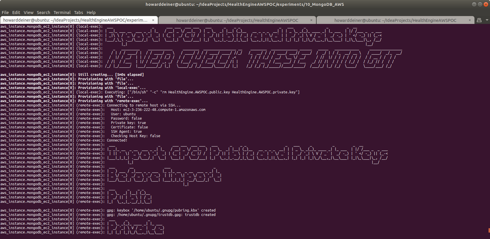
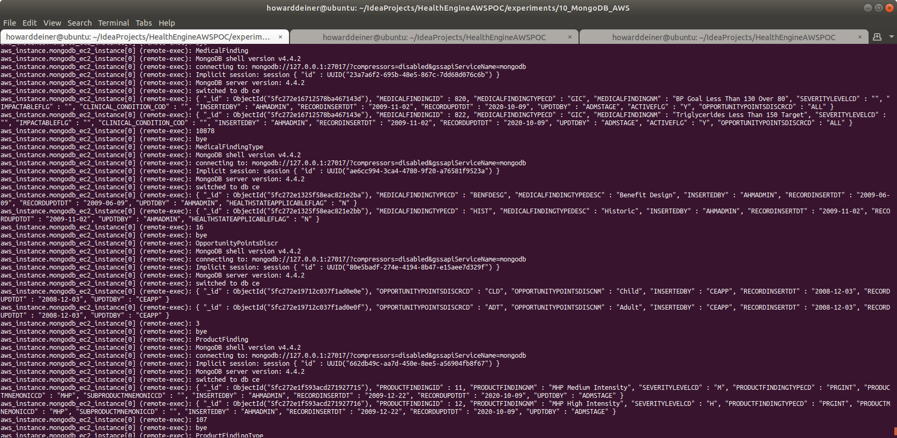

### Starting out with AWS MongoDB

##### Concept

> MongoDB is a cross-platform document-oriented database program. Classified as a NoSQL database program, MongoDB uses JSON-like documents with optional schemas. MongoDB is developed by MongoDB Inc. and licensed under the Server Side Public License (SSPL).

> https://en.wikipedia.org/wiki/PostgreSQL

> https://www.mongodb.com

#### Execution

### 01_startup.sh
This script uses simple Terraform and applies it.   
```bash
#!/usr/bin/env bash

figlet -w 200 -f small "Startup MongoDB AWS"
terraform init
terraform apply -auto-approve
```
The terraform.aws_instance.tf is the most interesting of the terraform scripts because it does does all of the heavy lifting through provisiong.

The reason for doing the provisioning of the actual database and loading sample data is that I don't want to install local clients on the invoking machine.
```hcl-terraform
resource "aws_instance" "mongodb_ec2_instance" {
  ami = "ami-0ac80df6eff0e70b5"  #  Ubuntu 18.04 LTS - Bionic - hvm:ebs-ssde  https://cloud-images.ubuntu.com/locator/ec2/
  instance_type = "m5.large"   # $0.096/hour ; 2 vCPU  ; 10 ECU  ; 8 GiB memory   ; EBS disk              ; EBS Optimized by default
#  instance_type = "m5d.metal" # $5.424/hour ; 96 vCPU ; 345 ECU ; 384 GiB memory ; 4 x 900 NVMe SSD disk ; EBS Optimized by default ; max bandwidth 19,000 Mbps ; max throughput 2,375 MB/s ; Max IOPS 80,000
  key_name = aws_key_pair.mongodb_key_pair.key_name
  ebs_optimized = true
  security_groups = [aws_security_group.mongodb.name]
  root_block_device {
    volume_type           = "io1"
    volume_size           = 30 # GB
    iops                  = 500
    delete_on_termination = true
  }
  count = 1
  tags = {
    Name = "MongoDB Instance ${format("%03d", count.index)}"
  }
  provisioner "local-exec" {
    command = "aws ec2 wait instance-status-ok --region ${regex("[a-z]+[^a-z][a-z]+[^a-z][0-9]+",self.availability_zone)} --instance-ids ${aws_instance.mongodb_ec2_instance[count.index].id}"
  }
  provisioner "remote-exec" {
    connection {
      type = "ssh"
      user = "ubuntu"
      host = self.public_dns
      private_key = file("~/.ssh/id_rsa")
    }
    inline = [
      "mkdir -p /home/ubuntu/.aws",
    ]
  }
  provisioner "file" {
    connection {
      type = "ssh"
      user = "ubuntu"
      host = self.public_dns
      private_key = file("~/.ssh/id_rsa")
    }
    source = "~/.aws/config"
    destination = "/home/ubuntu/.aws/config"
  }
  provisioner "file" {
    connection {
      type = "ssh"
      user = "ubuntu"
      host = self.public_dns
      private_key = file("~/.ssh/id_rsa")
    }
    source = "~/.aws/credentials"
    destination = "/home/ubuntu/.aws/credentials"
  }
  provisioner "file" {
    connection {
      type = "ssh"
      user = "ubuntu"
      host = self.public_dns
      private_key = file("~/.ssh/id_rsa")
    }
    source      = "provision.mongodb.sh"
    destination = "/tmp/provision.mongodb.sh"
  }
  provisioner "remote-exec" {
    connection {
      type = "ssh"
      user = "ubuntu"
      host = self.public_dns
      private_key = file("~/.ssh/id_rsa")
    }
    inline = ["chmod +x /tmp/provision.mongodb.sh", "/tmp/provision.mongodb.sh"]
  }
  provisioner "file" {
    connection {
      type = "ssh"
      user = "ubuntu"
      host = self.public_dns
      private_key = file("~/.ssh/id_rsa")
    }
    source      = "../../data/import_GPG_keys.sh"
    destination = "/tmp/import_GPG_keys.sh"
  }
  provisioner "local-exec" {
    command = "../../data/export_GPG_keys.sh"
  }
  provisioner "file" {
    connection {
      type = "ssh"
      user = "ubuntu"
      host = self.public_dns
      private_key = file("~/.ssh/id_rsa")
    }
    source      = "HealthEngine.AWSPOC.public.key"
    destination = "/tmp/HealthEngine.AWSPOC.public.key"
  }
  provisioner "file" {
    connection {
      type = "ssh"
      user = "ubuntu"
      host = self.public_dns
      private_key = file("~/.ssh/id_rsa")
    }
    source      = "HealthEngine.AWSPOC.private.key"
    destination = "/tmp/HealthEngine.AWSPOC.private.key"
  }
  provisioner "file" {
    connection {
      type = "ssh"
      user = "ubuntu"
      host = self.public_dns
      private_key = file("~/.ssh/id_rsa")
    }
    source      = "../../data/transfer_from_s3_and_decrypt.sh"
    destination = "/tmp/transfer_from_s3_and_decrypt.sh"
  }
  provisioner "remote-exec" {
    connection {
      type = "ssh"
      user = "ubuntu"
      host = self.public_dns
      private_key = file("~/.ssh/id_rsa")
    }
    inline = ["chmod +x /tmp/import_GPG_keys.sh", "/tmp/import_GPG_keys.sh /tmp/HealthEngine.AWSPOC.public.key /tmp/HealthEngine.AWSPOC.private.key", "chmod +x /tmp/transfer_from_s3_and_decrypt.sh","rm /tmp/import_GPG_keys.sh /tmp/*.key"]
  }
  provisioner "file" {
    connection {
      type = "ssh"
      user = "ubuntu"
      host = self.public_dns
      private_key = file("~/.ssh/id_rsa")
    }
    source      = "02_populate.sh"
    destination = "/tmp/02_populate.sh"
  }
  provisioner "remote-exec" {
    connection {
      type = "ssh"
      user = "ubuntu"
      host = self.public_dns
      private_key = file("~/.ssh/id_rsa")
    }
    inline = ["chmod +x /tmp/02_populate.sh", "/tmp/02_populate.sh"]
  }
}
```
The script that is run on the EC2 instance (provision.mongodb.sh) does the provisioning of the database itself.
```bash
#!/usr/bin/env bash

sudo apt-get update > provision.log
sudo apt-get install -y -qq figlet > provision.log

figlet -w 160 -f small "Install Prerequisites"
sudo apt-get install -y -qq gnupg gnupg2 awscli >> provision.log

figlet -w 160 -f small "Import MongoDB public GPG Key"
wget -qO - https://www.mongodb.org/static/pgp/server-4.4.asc | sudo apt-key add -

figlet -w 160 -f small "Create list file for MongoDB"
echo "deb [ arch=amd64,arm64 ] https://repo.mongodb.org/apt/ubuntu bionic/mongodb-org/4.4 multiverse" | sudo tee /etc/apt/sources.list.d/mongodb-org-4.4.list

figlet -w 160 -f small "Install MongoDB packages"
sudo apt-get update >> provision.log
sudo apt-get install -y -qq mongodb-org >> provision.log

figlet -w 160 -f small "Start MongoDB"
sudo systemctl daemon-reload
sudo systemctl start mongod
sudo systemctl enable mongod

figlet -w 160 -f small "Verify That MongoDB Is Up"
echo -e `sudo systemctl status mongod`
```
The script that is then run on the EC2 instance (02_populate.sh) uses mongoimport to bring in the data and mongo to report on it.
```bash
#!/usr/bin/env bash

figlet -w 200 -f slant "This is run on AWS ONLY during startup"
cd /tmp

figlet -w 160 -f small "Get Data from S3 Bucket"
./transfer_from_s3_and_decrypt.sh ce.Clinical_Condition.csv
./transfer_from_s3_and_decrypt.sh ce.DerivedFact.csv
./transfer_from_s3_and_decrypt.sh ce.DerivedFactProductUsage.csv
./transfer_from_s3_and_decrypt.sh ce.MedicalFinding.csv
./transfer_from_s3_and_decrypt.sh ce.MedicalFindingType.csv
./transfer_from_s3_and_decrypt.sh ce.OpportunityPointsDiscr.csv
./transfer_from_s3_and_decrypt.sh ce.ProductFinding.csv
./transfer_from_s3_and_decrypt.sh ce.ProductFindingType.csv
./transfer_from_s3_and_decrypt.sh ce.ProductOpportunityPoints.csv
./transfer_from_s3_and_decrypt.sh ce.Recommendation.csv

figlet -w 160 -f small "Populate MongoDB AWS"

echo "Clinical_Condition"
# add header
sed -i '1 i\CLINICAL_CONDITION_COD|CLINICAL_CONDITION_NAM|INSERTED_BY|REC_INSERT_DATE|REC_UPD_DATE|UPDATED_BY|CLINICALCONDITIONCLASSCD|CLINICALCONDITIONTYPECD|CLINICALCONDITIONABBREV' /tmp/ce.Clinical_Condition.csv
# convert bars to tabs
sed -i 's/|/\t/g' /tmp/ce.Clinical_Condition.csv
# get rid of ^M (return characters)
tr -d $'\r' < /tmp/ce.Clinical_Condition.csv > /tmp/ce.Clinical_Condition.csv.mod
mongoimport --type tsv -d testdatabase -c Clinical_Condition --headerline /tmp/ce.Clinical_Condition.csv.mod

echo "DerivedFact"
# add header
sed -i '1 i\DERIVEDFACTID|DERIVEDFACTTRACKINGID|DERIVEDFACTTYPEID|INSERTEDBY|RECORDINSERTDT|RECORDUPDTDT|UPDTDBY' ce.DerivedFact.csv
# convert bars to tabs
sed -i 's/|/\t/g' ce.DerivedFact.csv
# get rid of ^M (return characters)
tr -d $'\r' < ce.DerivedFact.csv > ce.DerivedFact.csv.mod
mongoimport --type tsv -d testdatabase -c DerivedFact --headerline ce.DerivedFact.csv.mod

echo "DerivedFactProductUsage"
# add header
sed -i '1 i\DERIVEDFACTPRODUCTUSAGEID|DERIVEDFACTID|PRODUCTMNEMONICCD|INSERTEDBY|RECORDINSERTDT|RECORDUPDTDT|UPDTDBY' ce.DerivedFactProductUsage.csv
# convert bars to tabs
sed -i 's/|/\t/g' ce.DerivedFactProductUsage.csv
# get rid of ^M (return characters)
tr -d $'\r' < ce.DerivedFactProductUsage.csv > ce.DerivedFactProductUsage.csv.mod
mongoimport --type tsv -d testdatabase -c DerivedFactProductUsage --headerline ce.DerivedFactProductUsage.mod

echo "MedicalFinding"
# add header
sed -i '1 i\MEDICALFINDINGID|MEDICALFINDINGTYPECD|MEDICALFINDINGNM|SEVERITYLEVELCD|IMPACTABLEFLG|CLINICAL_CONDITION_COD|INSERTEDBY|RECORDINSERTDT|RECORDUPDTDT|UPDTDBY|ACTIVEFLG|OPPORTUNITYPOINTSDISCRCD' ce.MedicalFinding.csv
# convert bars to tabs
sed -i 's/|/\t/g' ce.MedicalFinding.csv
# get rid of ^M (return characters)
tr -d $'\r' < ce.MedicalFinding.csv > ce.MedicalFinding.csv.mod
mongoimport --type tsv -d testdatabase -c MedicalFinding --headerline ce.MedicalFinding.csv.mod

echo "MedicalFindingType"
# add header
sed -i '1 i\MEDICALFINDINGTYPECD|MEDICALFINDINGTYPEDESC|INSERTEDBY|RECORDINSERTDT|RECORDUPDTDT|UPDTDBY|HEALTHSTATEAPPLICABLEFLAG' ce.MedicalFindingType.csv
# convert bars to tabs
sed -i 's/|/\t/g' ce.MedicalFindingType.csv
# get rid of ^M (return characters)
tr -d $'\r' < ce.MedicalFindingType.csv > ce.MedicalFindingType.csv.mod
mongoimport --type tsv -d testdatabase -c MedicalFinding --headerline ce.MedicalFindingType.csv.mod

echo "OpportunityPointsDiscr"
# add header
sed -i '1 i\OPPORTUNITYPOINTSDISCRCD|OPPORTUNITYPOINTSDISCNM|INSERTEDBY|RECORDINSERTDT|RECORDUPDTDT|UPDTDBY' ce.OpportunityPointsDiscr.csv
# convert bars to tabs
sed -i 's/|/\t/g' ce.OpportunityPointsDiscr.csv
# get rid of ^M (return characters)
tr -d $'\r' < ce.OpportunityPointsDiscr.csv > ce.OpportunityPointsDiscr.csv.mod
mongoimport --type tsv -d testdatabase -c OpportunityPointsDiscr --headerline ce.OpportunityPointsDiscr.csv.mod

echo "ProductFinding"
# add header
sed -i '1 i\PRODUCTFINDINGTYPECD|PRODUCTFINDINGTYPEDESC|INSERTEDBY|RECORDINSERTDT|RECORDUPDTDT|UPDTDBY' ce.ProductFinding.csv
# convert bars to tabs
sed -i 's/|/\t/g' ce.ProductFinding.csv
# get rid of ^M (return characters)
tr -d $'\r' < ce.ProductFinding.csv > ce.ProductFinding.csv.mod
mongoimport --type tsv -d testdatabase -c ProductFinding --headerline ce.ProductFinding.csv.mod

echo "ProductFindingType"
# add header
sed -i '1 i\PRODUCTFINDINGTYPECD|PRODUCTFINDINGTYPEDESC|INSERTEDBY|RECORDINSERTDT|RECORDUPDTDT|UPDTDBY' ce.ProductFindingType.csv
# convert bars to tabs
sed -i 's/|/\t/g' ce.ProductFindingType.csv
# get rid of ^M (return characters)
tr -d $'\r' < ce.ProductFindingType.csv > ce.ProductFindingType.csv.mod
mongoimport --type tsv -d testdatabase -c ProductFindingType --headerline ce.ProductFindingType.csv.mod

echo "ProductOpportunityPoints"
# add header
sed -i '1 i\OPPORTUNITYPOINTSDISCCD|EFFECTIVESTARTDT|OPPORTUNITYPOINTSNBR|EFFECTIVEENDDT|DERIVEDFACTPRODUCTUSAGEID|INSERTEDBY|RECORDINSERTDT|RECORDUPDTDT|UPDTDBY' ce.ProductOpportunityPoints.csv
# convert bars to tabs
sed -i 's/|/\t/g' ce.ProductOpportunityPoints.csv
# get rid of ^M (return characters)
tr -d $'\r' < ce.ProductOpportunityPoints.csv > ce.ProductOpportunityPoints.csv.mod
mongoimport --type tsv -d testdatabase -c ProductOpportunityPoints --headerline ce.ProductOpportunityPoints.csv.mod

echo "Recommendation"
# add header
sed -i '1 i\RECOMMENDATIONSKEY|RECOMMENDATIONID|RECOMMENDATIONCODE|RECOMMENDATIONDESC|RECOMMENDATIONTYPE|CCTYPE|CLINICALREVIEWTYPE|AGERANGEID|ACTIONCODE|THERAPEUTICCLASS|MDCCODE|MCCCODE|PRIVACYCATEGORY|INTERVENTION|RECOMMENDATIONFAMILYID|RECOMMENDPRECEDENCEGROUPID|INBOUNDCOMMUNICATIONROUTE|SEVERITY|PRIMARYDIAGNOSIS|SECONDARYDIAGNOSIS|ADVERSEEVENT|ICMCONDITIONID|WELLNESSFLAG|VBFELIGIBLEFLAG|COMMUNICATIONRANKING|PRECEDENCERANKING|PATIENTDERIVEDFLAG|LABREQUIREDFLAG|UTILIZATIONTEXTAVAILABLEF|SENSITIVEMESSAGEFLAG|HIGHIMPACTFLAG|ICMLETTERFLAG|REQCLINICIANCLOSINGFLAG|OPSIMPELMENTATIONPHASE|SEASONALFLAG|SEASONALSTARTDT|SEASONALENDDT|EFFECTIVESTARTDT|EFFECTIVEENDDT|RECORDINSERTDT|RECORDUPDTDT|INSERTEDBY|UPDTDBY|STANDARDRUNFLAG|INTERVENTIONFEEDBACKFAMILYID|CONDITIONFEEDBACKFAMILYID|ASHWELLNESSELIGIBILITYFLAG|HEALTHADVOCACYELIGIBILITYFLAG' ce.Recommendation.csv
# convert bars to tabs
sed -i 's/|/\t/g' ce.Recommendation.csv
# get rid of ^M (return characters)
tr -d $'\r' < ce.Recommendation.csv > ce.Recommendation.csv.mod
mongoimport --type tsv -d testdatabase -c Recommendation --headerline ce.Recommendation.csv.mod

figlet -w 160 -f small "Check MongoDB AWS"
echo ""
echo "Clinical_Condition"
echo 'use testdatabase' > .mongo.js
echo 'db.Clinical_Condition.find().limit(2)' >> .mongo.js
echo 'db.Clinical_Condition.count()' >> .mongo.js
echo 'exit' >> .mongo.js
mongo < .mongo.js

echo ""
echo "DerivedFact"
echo 'use testdatabase' > .mongo.js
echo 'db.DerivedFact.find().limit(2)' >> .mongo.js
echo 'db.DerivedFact.count()' >> .mongo.js
echo 'exit' >> .mongo.js
mongo < .mongo.js

echo ""
echo "MedicalFinding"
echo 'use testdatabase' > .mongo.js
echo 'db.MedicalFinding.find().limit(2)' >> .mongo.js
echo 'db.MedicalFinding.count()' >> .mongo.js
echo 'exit' >> .mongo.js
mongo < .mongo.js

echo ""
echo "MedicalFindingType"
echo 'use testdatabase' > .mongo.js
echo 'db.MedicalFindingType.find().limit(2)' >> .mongo.js
echo 'db.MedicalFindingType.count()' >> .mongo.js
echo 'exit' >> .mongo.js
mongo < .mongo.js

echo ""
echo "OpportunityPointsDiscr"
echo 'use testdatabase' > .mongo.js
echo 'db.OpportunityPointsDiscr.find().limit(2)' >> .mongo.js
echo 'db.OpportunityPointsDiscr.count()' >> .mongo.js
echo 'exit' >> .mongo.js
mongo < .mongo.js

echo ""
echo "ProductFinding"
echo 'use testdatabase' > .mongo.js
echo 'db.ProductFinding.find().limit(2)' >> .mongo.js
echo 'db.ProductFinding.count()' >> .mongo.js
echo 'exit' >> .mongo.js
mongo < .mongo.js

echo ""
echo "ProductFindingType"
echo 'use testdatabase' > .mongo.js
echo 'db.ProductFindingType.find().limit(2)' >> .mongo.js
echo 'db.ProductFindingType.count()' >> .mongo.js
echo 'exit' >> .mongo.js
mongo < .mongo.js

echo ""
echo "ProductOpportunityPoints"
echo 'use testdatabase' > .mongo.js
echo 'db.ProductOpportunityPoints.find().limit(2)' >> .mongo.js
echo 'db.ProductOpportunityPoints.count()' >> .mongo.js
echo 'exit' >> .mongo.js
mongo < .mongo.js

echo ""
echo "Recommendation"
echo 'use testdatabase' > .mongo.js
echo 'db.Recommendation.find().limit(2)' >> .mongo.js
echo 'db.Recommendation.count()' >> .mongo.js
echo 'exit' >> .mongo.js
mongo < .mongo.js

rm .mongo.js *.csv *.mod

cd -
```
This is what the console looks like when the script is executed.  It takes about 4 minutes, is completely repeatable, and doesn't require any manual intervention.  
\
\
\
\
\
\
\
\
\
\
\
\
\
\
<BR/>
If we were to peruse the AWS Console EC2 Dashboard, here's what we will see.
\
<BR/>
Looking at the running instances, we see
\
<BR/>
Looking at details tab of that runing instance, we see
\
<BR/>
The security tab of that runing instance shows us
\
<BR/>
The networking tab of that runing instance shows us
\
<BR/>
The storage tab of that runing instance shows us
\
<BR/>
And, finally, the monitoring tab of that runing instance shows us
\
<BR/>
### 02_populate.sh
This script was run on the AWS EC2 instance in the 01_startup.sh for this experiment to avoid having to install MongoDB clients on our local machine.
<BR/>
### 03_shutdown.sh
This script is extremely simple.  It tells terraform to destroy all that it created.

```bash
#!/usr/bin/env bash

figlet -w 200 -f small "Shutdown MongoDB AWS"
terraform destroy -auto-approve
```
The console shows what it does.
\
<BR/>
