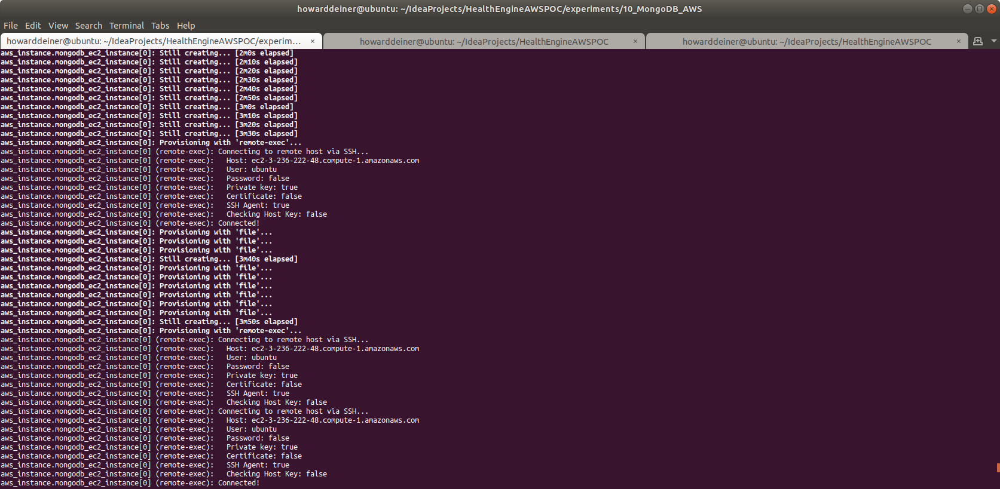
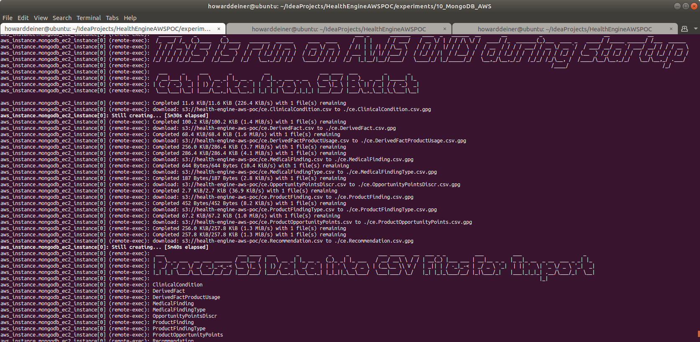
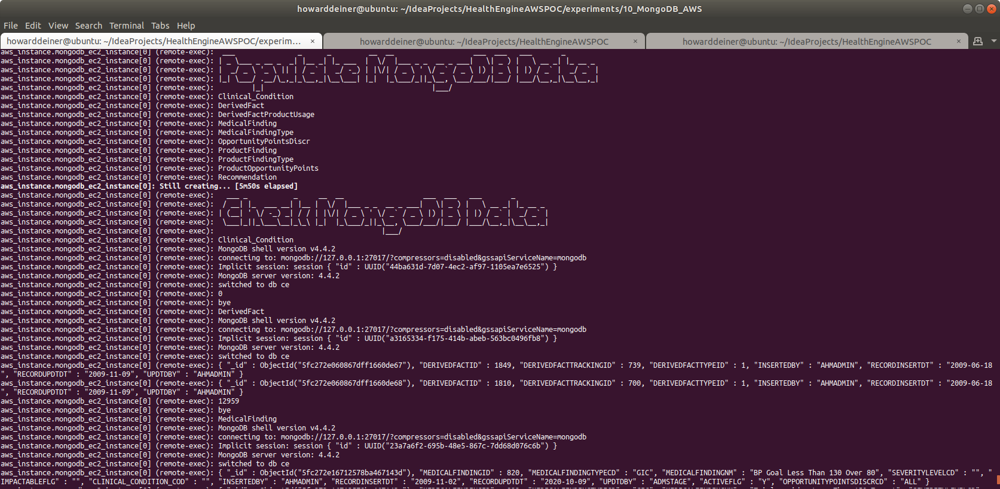
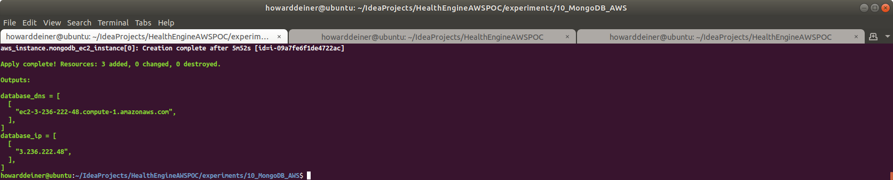

### Starting out with AWS MongoDB

##### Concept

> MongoDB is a cross-platform document-oriented database program. Classified as a NoSQL database program, MongoDB uses JSON-like documents with optional schemas. MongoDB is developed by MongoDB Inc. and licensed under the Server Side Public License (SSPL).

> https://en.wikipedia.org/wiki/PostgreSQL

> https://www.mongodb.com

#### Execution

### 01_startup.sh
This script uses simple Terraform and applies it.   
```bash
#!/usr/bin/env bash

../../startExperiment.sh

bash -c 'cat << "EOF" > .script
#!/usr/bin/env bash
figlet -w 200 -f small "Startup MongoDB AWS"
terraform init
terraform apply -auto-approve
EOF'
chmod +x .script
command time -v ./.script 2> .results
../../getExperimentalResults.sh
experiment=$(../../getExperimentNumber.sh)
../../getDataAsCSVline.sh .results ${experiment} "10_MongoDB_AWS: Startup MongoDB AWS" >> Experimental\ Results.csv
../../putExperimentalResults.sh
rm .script .results Experimental\ Results.csv
```
The terraform.aws_instance.tf is the most interesting of the terraform scripts because it does does all of the heavy lifting through provisiong.

The reason for doing the provisioning of the actual database and loading sample data is that I don't want to install local clients on the invoking machine.
```hcl-terraform
resource "aws_instance" "mongodb_ec2_instance" {
  ami = "ami-0ac80df6eff0e70b5"  #  Ubuntu 18.04 LTS - Bionic - hvm:ebs-ssde  https://cloud-images.ubuntu.com/locator/ec2/
  instance_type = "m5.large"   # $0.096/hour ; 2 vCPU  ; 10 ECU  ; 8 GiB memory   ; EBS disk              ; EBS Optimized by default
#  instance_type = "m5d.metal" # $5.424/hour ; 96 vCPU ; 345 ECU ; 384 GiB memory ; 4 x 900 NVMe SSD disk ; EBS Optimized by default ; max bandwidth 19,000 Mbps ; max throughput 2,375 MB/s ; Max IOPS 80,000
  key_name = aws_key_pair.mongodb_key_pair.key_name
  ebs_optimized = true
  security_groups = [aws_security_group.mongodb.name]
  root_block_device {
    volume_type           = "io1"
    volume_size           = 30 # GB
    iops                  = 500
    delete_on_termination = true
  }
  count = 1
  tags = {
    Name = "MongoDB Instance ${format("%03d", count.index)}"
  }
  provisioner "local-exec" {
    command = "aws ec2 wait instance-status-ok --region ${regex("[a-z]+[^a-z][a-z]+[^a-z][0-9]+",self.availability_zone)} --instance-ids ${aws_instance.mongodb_ec2_instance[count.index].id}"
  }
  provisioner "remote-exec" {
    connection {
      type = "ssh"
      user = "ubuntu"
      host = self.public_dns
      private_key = file("~/.ssh/id_rsa")
    }
    inline = [
      "mkdir -p /home/ubuntu/.aws",
    ]
  }
  provisioner "file" {
    connection {
      type = "ssh"
      user = "ubuntu"
      host = self.public_dns
      private_key = file("~/.ssh/id_rsa")
    }
    source = "~/.aws/config"
    destination = "/home/ubuntu/.aws/config"
  }
  provisioner "file" {
    connection {
      type = "ssh"
      user = "ubuntu"
      host = self.public_dns
      private_key = file("~/.ssh/id_rsa")
    }
    source = "~/.aws/credentials"
    destination = "/home/ubuntu/.aws/credentials"
  }
  provisioner "file" {
    connection {
      type = "ssh"
      user = "ubuntu"
      host = self.public_dns
      private_key = file("~/.ssh/id_rsa")
    }
    source      = "provision.mongodb.sh"
    destination = "/tmp/provision.mongodb.sh"
  }
  provisioner "file" {
    connection {
      type = "ssh"
      user = "ubuntu"
      host = self.public_dns
      private_key = file("~/.ssh/id_rsa")
    }
    source      = "../../getDataAsCSVline.sh"
    destination = "/tmp/getDataAsCSVline.sh"
  }
  provisioner "file" {
    connection {
      type = "ssh"
      user = "ubuntu"
      host = self.public_dns
      private_key = file("~/.ssh/id_rsa")
    }
    source      = "../../getExperimentalResults.sh"
    destination = "/tmp/getExperimentalResults.sh"
  }
  provisioner "file" {
    connection {
      type = "ssh"
      user = "ubuntu"
      host = self.public_dns
      private_key = file("~/.ssh/id_rsa")
    }
    source      = "../../putExperimentalResults.sh"
    destination = "/tmp/putExperimentalResults.sh"
  }
  provisioner "file" {
    connection {
      type = "ssh"
      user = "ubuntu"
      host = self.public_dns
      private_key = file("~/.ssh/id_rsa")
    }
    source      = "../../startExperiment.sh"
    destination = "/tmp/startExperiment.sh"
  }
  provisioner "file" {
    connection {
      type = "ssh"
      user = "ubuntu"
      host = self.public_dns
      private_key = file("~/.ssh/id_rsa")
    }
    source      = "../../endExperiment.sh"
    destination = "/tmp/endExperiment.sh"
  }
  provisioner "file" {
    connection {
      type = "ssh"
      user = "ubuntu"
      host = self.public_dns
      private_key = file("~/.ssh/id_rsa")
    }
    source      = "../../getExperimentNumber.sh"
    destination = "/tmp/getExperimentNumber.sh"
  }
  provisioner "remote-exec" {
    connection {
      type = "ssh"
      user = "ubuntu"
      host = self.public_dns
      private_key = file("~/.ssh/id_rsa")
    }
    inline = [
      "chmod +x /tmp/provision.mongodb.sh",
      "chmod +x /tmp/getDataAsCSVline.sh",
      "chmod +x /tmp/getExperimentalResults.sh",
      "chmod +x /tmp/putExperimentalResults.sh",
      "chmod +x /tmp/startExperiment.sh",
      "chmod +x /tmp/endExperiment.sh",
      "chmod +x /tmp/getExperimentNumber.sh",
      "/tmp/provision.mongodb.sh"
    ]
  }
  provisioner "file" {
    connection {
      type = "ssh"
      user = "ubuntu"
      host = self.public_dns
      private_key = file("~/.ssh/id_rsa")
    }
    source      = "../../data/import_GPG_keys.sh"
    destination = "/tmp/import_GPG_keys.sh"
  }
  provisioner "local-exec" {
    command = "../../data/export_GPG_keys.sh"
  }
  provisioner "file" {
    connection {
      type = "ssh"
      user = "ubuntu"
      host = self.public_dns
      private_key = file("~/.ssh/id_rsa")
    }
    source      = "HealthEngine.AWSPOC.public.key"
    destination = "/tmp/HealthEngine.AWSPOC.public.key"
  }
  provisioner "file" {
    connection {
      type = "ssh"
      user = "ubuntu"
      host = self.public_dns
      private_key = file("~/.ssh/id_rsa")
    }
    source      = "HealthEngine.AWSPOC.private.key"
    destination = "/tmp/HealthEngine.AWSPOC.private.key"
  }
  provisioner "local-exec" {
    command = "rm HealthEngine.AWSPOC.public.key HealthEngine.AWSPOC.private.key"
  }
  provisioner "file" {
    connection {
      type = "ssh"
      user = "ubuntu"
      host = self.public_dns
      private_key = file("~/.ssh/id_rsa")
    }
    source      = "../../data/transfer_from_s3_and_decrypt.sh"
    destination = "/tmp/transfer_from_s3_and_decrypt.sh"
  }
  provisioner "remote-exec" {
    connection {
      type = "ssh"
      user = "ubuntu"
      host = self.public_dns
      private_key = file("~/.ssh/id_rsa")
    }
    inline = [
      "chmod +x /tmp/import_GPG_keys.sh",
      "/tmp/import_GPG_keys.sh /tmp/HealthEngine.AWSPOC.public.key /tmp/HealthEngine.AWSPOC.private.key",
      "chmod +x /tmp/transfer_from_s3_and_decrypt.sh",
      "rm /tmp/import_GPG_keys.sh /tmp/*.key"
    ]
  }
  provisioner "file" {
    connection {
      type = "ssh"
      user = "ubuntu"
      host = self.public_dns
      private_key = file("~/.ssh/id_rsa")
    }
    source      = "../transform_Oracle_ce.ClinicalCondition_to_csv.sh"
    destination = "/tmp/transform_Oracle_ce.ClinicalCondition_to_csv.sh"
  }
  provisioner "file" {
    connection {
      type = "ssh"
      user = "ubuntu"
      host = self.public_dns
      private_key = file("~/.ssh/id_rsa")
    }
    source      = "../transform_Oracle_ce.DerivedFact_to_csv.sh"
    destination = "/tmp/transform_Oracle_ce.DerivedFact_to_csv.sh"
  }
  provisioner "file" {
    connection {
      type = "ssh"
      user = "ubuntu"
      host = self.public_dns
      private_key = file("~/.ssh/id_rsa")
    }
    source      = "../transform_Oracle_ce.DerivedFactProductUsage_to_csv.sh"
    destination = "/tmp/transform_Oracle_ce.DerivedFactProductUsage_to_csv.sh"
  }
  provisioner "file" {
    connection {
      type = "ssh"
      user = "ubuntu"
      host = self.public_dns
      private_key = file("~/.ssh/id_rsa")
    }
    source      = "../transform_Oracle_ce.MedicalFinding_to_csv.sh"
    destination = "/tmp/transform_Oracle_ce.MedicalFinding_to_csv.sh"
  }
  provisioner "file" {
    connection {
      type = "ssh"
      user = "ubuntu"
      host = self.public_dns
      private_key = file("~/.ssh/id_rsa")
    }
    source      = "../transform_Oracle_ce.MedicalFindingType_to_csv.sh"
    destination = "/tmp/transform_Oracle_ce.MedicalFindingType_to_csv.sh"
  }
  provisioner "file" {
    connection {
      type = "ssh"
      user = "ubuntu"
      host = self.public_dns
      private_key = file("~/.ssh/id_rsa")
    }
    source      = "../transform_Oracle_ce.OpportunityPointsDiscr_to_csv.sh"
    destination = "/tmp/transform_Oracle_ce.OpportunityPointsDiscr_to_csv.sh"
  }
  provisioner "file" {
    connection {
      type = "ssh"
      user = "ubuntu"
      host = self.public_dns
      private_key = file("~/.ssh/id_rsa")
    }
    source      = "../transform_Oracle_ce.ProductFinding_to_csv.sh"
    destination = "/tmp/transform_Oracle_ce.ProductFinding_to_csv.sh"
  }
  provisioner "file" {
    connection {
      type = "ssh"
      user = "ubuntu"
      host = self.public_dns
      private_key = file("~/.ssh/id_rsa")
    }
    source      = "../transform_Oracle_ce.ProductFindingType_to_csv.sh"
    destination = "/tmp/transform_Oracle_ce.ProductFindingType_to_csv.sh"
  }
  provisioner "file" {
    connection {
      type = "ssh"
      user = "ubuntu"
      host = self.public_dns
      private_key = file("~/.ssh/id_rsa")
    }
    source      = "../transform_Oracle_ce.ProductOpportunityPoints_to_csv.sh"
    destination = "/tmp/transform_Oracle_ce.ProductOpportunityPoints_to_csv.sh"
  }
  provisioner "file" {
    connection {
      type = "ssh"
      user = "ubuntu"
      host = self.public_dns
      private_key = file("~/.ssh/id_rsa")
    }
    source      = "../transform_Oracle_ce.Recommendation_to_csv.sh"
    destination = "/tmp/transform_Oracle_ce.Recommendation_to_csv.sh"
  }
  provisioner "remote-exec" {
    connection {
      type = "ssh"
      user = "ubuntu"
      host = self.public_dns
      private_key = file("~/.ssh/id_rsa")
    }
    inline = [
      "chmod +x /tmp/transform_Oracle_ce.ClinicalCondition_to_csv.sh",
      "chmod +x /tmp/transform_Oracle_ce.DerivedFact_to_csv.sh",
      "chmod +x /tmp/transform_Oracle_ce.DerivedFactProductUsage_to_csv.sh",
      "chmod +x /tmp/transform_Oracle_ce.MedicalFinding_to_csv.sh",
      "chmod +x /tmp/transform_Oracle_ce.MedicalFindingType_to_csv.sh",
      "chmod +x /tmp/transform_Oracle_ce.OpportunityPointsDiscr_to_csv.sh",
      "chmod +x /tmp/transform_Oracle_ce.ProductFinding_to_csv.sh",
      "chmod +x /tmp/transform_Oracle_ce.ProductFindingType_to_csv.sh",
      "chmod +x /tmp/transform_Oracle_ce.ProductOpportunityPoints_to_csv.sh",
      "chmod +x /tmp/transform_Oracle_ce.Recommendation_to_csv.sh",
    ]
  }
  provisioner "file" {
    connection {
      type = "ssh"
      user = "ubuntu"
      host = self.public_dns
      private_key = file("~/.ssh/id_rsa")
    }
    source      = "02_populate.sh"
    destination = "/tmp/02_populate.sh"
  }
  provisioner "remote-exec" {
    connection {
      type = "ssh"
      user = "ubuntu"
      host = self.public_dns
      private_key = file("~/.ssh/id_rsa")
    }
    inline = [
      "chmod +x /tmp/02_populate.sh",
      "/tmp/02_populate.sh"
    ]
  }
}
```
The script that is run on the EC2 instance (provision.mongodb.sh) does the provisioning of the database itself.
```bash
#!/usr/bin/env bash

bash -c 'cat << "EOF" > .script
#!/usr/bin/env bash
sudo apt-get update > provision.log
sudo apt-get install -y -qq figlet > provision.log

figlet -w 160 -f small "Install Prerequisites"
sudo apt-get install -y -qq gnupg gnupg2 awscli >> provision.log

figlet -w 160 -f small "Import MongoDB public GPG Key"
wget -qO - https://www.mongodb.org/static/pgp/server-4.4.asc | sudo apt-key add -

figlet -w 160 -f small "Create list file for MongoDB"
echo "deb [ arch=amd64,arm64 ] https://repo.mongodb.org/apt/ubuntu bionic/mongodb-org/4.4 multiverse" | sudo tee /etc/apt/sources.list.d/mongodb-org-4.4.list

figlet -w 160 -f small "Install MongoDB packages"
sudo apt-get update >> provision.log
sudo apt-get install -y -qq mongodb-org >> provision.log

figlet -w 160 -f small "Start MongoDB"
sudo systemctl daemon-reload
sudo systemctl start mongod
sudo systemctl enable mongod

figlet -w 160 -f small "Verify That MongoDB Is Up"
echo -e `sudo systemctl status mongod`
EOF'
chmod +x .script
command time -v ./.script 2> .results
aws ec2 describe-instances --region "us-east-1" --instance-id "`curl -s http://169.254.169.254/latest/meta-data/instance-id`" --query 'Reservations[].Instances[].[Tags[0].Value]' --output text > .instanceName
sed --in-place --regexp-extended 's/ /_/g' .instanceName
/tmp/getExperimentalResults.sh
experiment=$(/tmp/getExperimentNumber.sh)
/tmp/getDataAsCSVline.sh .results ${experiment} "10_MongoDB_AWS: Install Prerequisites "$(<.instanceName) >> Experimental\ Results.csv
/tmp/putExperimentalResults.sh
rm .script .results Experimental\ Results.csv
```
The script that is then run on the EC2 instance (02_populate.sh) uses mongoimport to bring in the data and mongo to report on it.
```bash
#!/usr/bin/env bash

figlet -w 200 -f slant "This is run on AWS ONLY during startup"

aws ec2 describe-instances --region "us-east-1" --instance-id "`curl -s http://169.254.169.254/latest/meta-data/instance-id`" --query 'Reservations[].Instances[].[Tags[0].Value]' --output text > .instanceName
sed --in-place --regexp-extended 's/ /_/g' .instanceName

bash -c 'cat << "EOF" > .script
#!/usr/bin/env bash
figlet -w 160 -f small "Get Data from S3 Bucket"
/tmp/transfer_from_s3_and_decrypt.sh ce.ClinicalCondition.csv
/tmp/transfer_from_s3_and_decrypt.sh ce.DerivedFact.csv
/tmp/transfer_from_s3_and_decrypt.sh ce.DerivedFactProductUsage.csv
/tmp/transfer_from_s3_and_decrypt.sh ce.MedicalFinding.csv
/tmp/transfer_from_s3_and_decrypt.sh ce.MedicalFindingType.csv
/tmp/transfer_from_s3_and_decrypt.sh ce.OpportunityPointsDiscr.csv
/tmp/transfer_from_s3_and_decrypt.sh ce.ProductFinding.csv
/tmp/transfer_from_s3_and_decrypt.sh ce.ProductFindingType.csv
/tmp/transfer_from_s3_and_decrypt.sh ce.ProductOpportunityPoints.csv
/tmp/transfer_from_s3_and_decrypt.sh ce.Recommendation.csv
EOF'
chmod +x .script
command time -v ./.script 2> .results
/tmp/getExperimentalResults.sh
experiment=$(/tmp/getExperimentNumber.sh)
/tmp/getDataAsCSVline.sh .results ${experiment} "10_MongoDB_AWS: Get Data from S3 Bucket "$(<.instanceName) >> Experimental\ Results.csv
/tmp/putExperimentalResults.sh
rm .script .results Experimental\ Results.csv

bash -c 'cat << "EOF" > .script
#!/usr/bin/env bash
figlet -w 240 -f small "Process S3 Data into CSV Files For Import"
/tmp/transform_Oracle_ce.ClinicalCondition_to_csv.sh
/tmp/transform_Oracle_ce.DerivedFact_to_csv.sh
/tmp/transform_Oracle_ce.DerivedFactProductUsage_to_csv.sh
/tmp/transform_Oracle_ce.MedicalFinding_to_csv.sh
/tmp/transform_Oracle_ce.MedicalFindingType_to_csv.sh
/tmp/transform_Oracle_ce.OpportunityPointsDiscr_to_csv.sh
/tmp/transform_Oracle_ce.ProductFinding_to_csv.sh
/tmp/transform_Oracle_ce.ProductFindingType_to_csv.sh
/tmp/transform_Oracle_ce.ProductOpportunityPoints_to_csv.sh
/tmp/transform_Oracle_ce.Recommendation_to_csv.sh
EOF'
chmod +x .script
command time -v ./.script 2> .results
/tmp/getExperimentalResults.sh
experiment=$(/tmp/getExperimentNumber.sh)
/tmp/getDataAsCSVline.sh .results ${experiment} "10_MongoDB_AWS: Process S3 Data into CSV Files For Import "$(<.instanceName) >> Experimental\ Results.csv
/tmp/putExperimentalResults.sh
rm .script .results Experimental\ Results.csv

bash -c 'cat << "EOF" > .script
#!/usr/bin/env bash
figlet -w 160 -f small "Populate MongoDB Data"
echo "Clinical_Condition"
mongoimport --type csv -d ce -c Clinical_Condition --headerline ce.ClinicalCondition.csv
echo "DerivedFact"
mongoimport --type csv -d ce -c DerivedFact --headerline ce.DerivedFact.csv
echo "DerivedFactProductUsage"
mongoimport --type csv -d ce -c DerivedFactProductUsage --headerline ce.DerivedFactProductUsage.csv
echo "MedicalFinding"
mongoimport --type csv -d ce -c MedicalFinding --headerline ce.MedicalFinding.csv
echo "MedicalFindingType"
mongoimport --type csv -d ce -c MedicalFindingType --headerline ce.MedicalFindingType.csv
echo "OpportunityPointsDiscr"
mongoimport --type csv -d ce -c OpportunityPointsDiscr --headerline ce.OpportunityPointsDiscr.csv
echo "ProductFinding"
mongoimport --type csv -d ce -c ProductFinding --headerline ce.ProductFinding.csv
echo "ProductFindingType"
mongoimport --type tsv -d ce -c ProductFindingType --headerline ce.ProductFindingType.csv
echo "ProductOpportunityPoints"
mongoimport --type tsv -d ce -c ProductOpportunityPoints --headerline ce.ProductOpportunityPoints.csv
echo "Recommendation"
mongoimport --type csv -d ce -c Recommendation --headerline ce.Recommendation.csv
EOF'
chmod +x .script
command time -v ./.script 2> .results
/tmp/getExperimentalResults.sh
experiment=$(/tmp/getExperimentNumber.sh)
/tmp/getDataAsCSVline.sh .results  ${experiment}  "10_MongoDB_AWS: Populate MongoDB Data "$(<.instanceName) >> Experimental\ Results.csv
/tmp/putExperimentalResults.sh
rm .script .results Experimental\ Results.csv

bash -c 'cat << "EOF" > .script
#!/usr/bin/env bash
figlet -w 160 -f small "Check MongoDB Data"
echo "Clinical_Condition"
echo "use ce" > .mongo.js
echo "db.Clinical_Condition.find().limit(2)" >> .mongo.js
echo "db.Clinical_Condition.count()" >> .mongo.js
echo "exit" >> .mongo.js
mongo < .mongo.js
echo "DerivedFact"
echo "use ce" > .mongo.js
echo "db.DerivedFact.find().limit(2)" >> .mongo.js
echo "db.DerivedFact.count()" >> .mongo.js
echo "exit" >> .mongo.js
mongo < .mongo.js
echo "MedicalFinding"
echo "use ce" > .mongo.js
echo "db.MedicalFinding.find().limit(2)" >> .mongo.js
echo "db.MedicalFinding.count()" >> .mongo.js
echo "exit" >> .mongo.js
mongo < .mongo.js
echo "MedicalFindingType"
echo "use ce" > .mongo.js
echo "db.MedicalFindingType.find().limit(2)" >> .mongo.js
echo "db.MedicalFindingType.count()" >> .mongo.js
echo "exit" >> .mongo.js
mongo < .mongo.js
echo "OpportunityPointsDiscr"
echo "use ce" > .mongo.js
echo "db.OpportunityPointsDiscr.find().limit(2)" >> .mongo.js
echo "db.OpportunityPointsDiscr.count()" >> .mongo.js
echo "exit" >> .mongo.js
mongo < .mongo.js
echo "ProductFinding"
echo "use ce" > .mongo.js
echo "db.ProductFinding.find().limit(2)" >> .mongo.js
echo "db.ProductFinding.count()" >> .mongo.js
echo "exit" >> .mongo.js
mongo < .mongo.js
echo "ProductFindingType"
echo "use ce" > .mongo.js
echo "db.ProductFindingType.find().limit(2)" >> .mongo.js
echo "db.ProductFindingType.count()" >> .mongo.js
echo "exit" >> .mongo.js
mongo < .mongo.js
echo "ProductOpportunityPoints"
echo "use ce" > .mongo.js
echo "db.ProductOpportunityPoints.find().limit(2)" >> .mongo.js
echo "db.ProductOpportunityPoints.count()" >> .mongo.js
echo "exit" >> .mongo.js
mongo < .mongo.js
echo "Recommendation"
echo "use ce" > .mongo.js
echo "db.Recommendation.find().limit(2)" >> .mongo.js
echo "db.Recommendation.count()" >> .mongo.js
echo "exit" >> .mongo.js
mongo < .mongo.js
EOF'
chmod +x .script
command time -v ./.script 2> .results
/tmp/getExperimentalResults.sh
experiment=$(/tmp/getExperimentNumber.sh)
/tmp/getDataAsCSVline.sh .results ${experiment} "10_MongoDB_AWS: Check MongoDB Data "$(<.instanceName) >> Experimental\ Results.csv
/tmp/putExperimentalResults.sh
rm .script .mongo.js .results *.csv
```
This is what the console looks like when the script is executed.  It takes about 4 minutes, is completely repeatable, and doesn't require any manual intervention.  
\
\
\
\
\
\
\
\
\
\
<BR/>
If we were to peruse the AWS Console EC2 Dashboard, here's what we will see.
\
<BR/>
Looking at the running instances, we see
\
<BR/>
Looking at details tab of that runing instance, we see
\
<BR/>
The security tab of that runing instance shows us
\
<BR/>
The networking tab of that runing instance shows us
\
<BR/>
The storage tab of that runing instance shows us
\
<BR/>
And, finally, the monitoring tab of that runing instance shows us
\
<BR/>
### 02_populate.sh
This script was run on the AWS EC2 instance in the 01_startup.sh for this experiment to avoid having to install MongoDB clients on our local machine.
<BR/>
### 03_shutdown.sh
This script is extremely simple.  It tells terraform to destroy all that it created.

```bash
#!/usr/bin/env bash

bash -c 'cat << "EOF" > .script
#!/usr/bin/env bash
figlet -w 200 -f small "Shutdown MongoDB AWS"
terraform destroy -auto-approve
EOF'
chmod +x .script
command time -v ./.script 2> .results
../../getExperimentalResults.sh
experiment=$(../../getExperimentNumber.sh)
../../getDataAsCSVline.sh .results ${experiment} "10_MongoDB_AWS: Shutdown MongoDB AWS" >> Experimental\ Results.csv
../../putExperimentalResults.sh
rm .script .results Experimental\ Results.csv

../../endExperiment.sh
```
The console shows what it does.
\
<BR/>
And just for laughs, here's the timings for this run.  All kept in a csv file in S3 at s3://health-engine-aws-poc/Experimental Results.csv
\
<BR />

### Large Data Experiments

Due to the necessity to pass a parameter to the 02_populate_large_data.sh, a variant of the 01_start.sh script is used, called 01_startup_large_data.sh.

The basic difference between the two startup scripts is which terraform.aws_instance file to use.

```bash
#!/usr/bin/env bash

if [ $# -eq 0 ]
  then
    echo "must supply the command with the number of rows to use"
    exit 1
fi

re='^[0-9]+$'
if ! [[ $1 =~ $re ]] ; then
    echo "must supply the command with the number of rows to use"
   exit 1
fi

ROWS=$1
export ROWS

cp terraform.aws_instance.tf.large_data terraform.aws_instance.tf

../../startExperiment.sh

bash -c 'cat << "EOF" > .script
#!/usr/bin/env bash
figlet -w 240 -f small "Startup MongoDB AWS" - Large Data - $(numfmt --grouping $ROWS) rows
terraform init
echo "$ROWS" > .rows
terraform apply -var rows=$ROWS -auto-approve
EOF'
chmod +x .script
command time -v ./.script 2> .results
../../getExperimentalResults.sh
experiment=$(../../getExperimentNumber.sh)
../../getDataAsCSVline.sh .results ${experiment} "10_MongoDB_AWS: Startup MongoDB AWS" - Large Data - $(numfmt --grouping $ROWS) rows >> Experimental\ Results.csv
../../putExperimentalResults.sh
rm .script .results Experimental\ Results.csv
```

The script invoked the same provision.mongodv.sh discussed previously.

However, a different script is used for large data testing.  This transfers the dataset for large volume testing.  It uses the data from the "Complete 2019 Program Year Open Payments Dataset" from the Center for Medicare & Medicade Services.  See https://www.cms.gov/OpenPayments/Explore-the-Data/Dataset-Downloads for details.  In total, there is over 6GB in this dataset.

The script 02_populate_large_data.sh is a variation on 02_populate.sh.
```bash
#!/usr/bin/env bash

ROWS=$(</tmp/.rows)
export ROWS

aws ec2 describe-instances --region "us-east-1" --instance-id "`curl -s http://169.254.169.254/latest/meta-data/instance-id`" --query 'Reservations[].Instances[].[Tags[0].Value]' --output text > /tmp/.instanceName
sed --in-place --regexp-extended 's/ /_/g' /tmp/.instanceName

bash -c 'cat << "EOF" > /tmp/.script
#!/usr/bin/env bash

figlet -w 200 -f slant "This is run on AWS ONLY during startup"
figlet -w 240 -f small "Populate MongoDB AWS - Large Data - $(numfmt --grouping $ROWS) rows"
figlet -w 240 -f small "Get Data from S3 Bucket"
/tmp/transferPGYR19_P063020_from_s3_and_decrypt.sh > /dev/null
EOF'
chmod +x /tmp/.script
command time -v /tmp/.script 2> /tmp/.results
/tmp/getExperimentalResults.sh
experiment=$(/tmp/getExperimentNumber.sh)
/tmp/getDataAsCSVline.sh /tmp/.results ${experiment} "10_MongoDB_AWS: Get Data from S3 Bucket "$(</tmp/.instanceName)" - Large Data - $ROWS rows" >> Experimental\ Results.csv
/tmp/putExperimentalResults.sh
rm /tmp/.script /tmp/.results Experimental\ Results.csv
ls -lh /tmp/PGYR19_P063020

command time -v /tmp/02_populate_large_data_load_data.sh $ROWS 2> /tmp/.results
/tmp/getExperimentalResults.sh
experiment=$(/tmp/getExperimentNumber.sh)
/tmp/getDataAsCSVline.sh /tmp/.results ${experiment} "10_MongoDB_AWS: Populate MongoDB Data "$(</tmp/.instanceName)" - Large Data - $ROWS rows" >> Experimental\ Results.csv
/tmp/putExperimentalResults.sh
rm -rf /tmp/.script /tmp/.results Experimental\ Results.csv

bash -c 'cat << "EOF" > /tmp/.script
#!/usr/bin/env bash
figlet -w 240 -f small "Check MongoDB Data - Large Data - $(numfmt --grouping $ROWS) rows"

echo "First two rows of data"
echo "use PGYR19_P063020" > /tmp/.mongo.js
echo "db.PI.find().limit(2).pretty()" >> /tmp/.mongo.js
echo "exit" >> /tmp/.mongo.js
mongo < /tmp/.mongo.js

echo "Count of rows of data"
echo "use PGYR19_P063020" > /tmp/.mongo.js
echo "db.PI.count()" >> /tmp/.mongo.js
echo "exit" >> /tmp/.mongo.js
mongo < /tmp/.mongo.js

echo "Average of Total_Amount_of_Payment_USDollars"
echo "use PGYR19_P063020" > /tmp/.mongo.js
echo "db.PI.aggregate([{\$group: {_id:null, Total_Amount_of_Payment_USDollars: {\$avg:""\"""\$Total_Amount_of_Payment_USDollars""\"""} } }])" >> /tmp/.mongo.js
echo "exit" >> /tmp/.mongo.js
mongo < /tmp/.mongo.js

echo ""
echo "Top ten earning physicians"
mongo < /tmp/02_populate_large_data_top_10_earning_phyicians.txt
EOF'
chmod +x /tmp/.script
command time -v /tmp/.script 2> /tmp/.results
/tmp/getExperimentalResults.sh
experiment=$(/tmp/getExperimentNumber.sh)
/tmp/getDataAsCSVline.sh /tmp/.results ${experiment} "10_MongoDB_AWS: Check MongoDB Data "$(</tmp/.instanceName)" - Large Data - $ROWS rows" >> Experimental\ Results.csv
/tmp/putExperimentalResults.sh
rm -rf /tmp/.script /tmp/.results /tmp/command.sql /tmp/*.csv /tmp/PGYR19_P063020
```
As you can see, there are two helper scripts used to actually do the data load and checking, called 02_populate_large_data_load_data.sh and 02_populate_large_data_top_10_earning_phyicians.txt. 02_populate_large_data_load_data.sh looks like:
```bash
#!/usr/bin/env bash

ROWS=$1

figlet -w 240 -f small "Populate MongoDB AWS - Large Data - $ROWS rows"
head -n `echo "$ROWS+1" | bc` /tmp/PGYR19_P063020/OP_DTL_GNRL_PGYR2019_P06302020.csv > /tmp/PGYR19_P063020/OP_DTL_GNRL_PGYR2019_P06302020.subset.csv
mongoimport --type csv -d PGYR19_P063020 -c PI --headerline /tmp/PGYR19_P063020/OP_DTL_GNRL_PGYR2019_P06302020.subset.csv
```
And 02_populate_large_data_top_10_earning_phyicians.txt looks like:
```jshelllanguage
use PGYR19_P063020
    db.getCollection('PI').aggregate( [
            {
                    $match:
{
    "Physician_First_Name": {"$exists": true, "$ne": ""},
    "Physician_Last_Name": {"$exists": true, "$ne": null},
},
},
{
    $group:
    {
    _id: ["$Physician_First_Name", "$Physician_Last_Name"],
    Total_Amount_of_Payment_USDollars: {$sum: '$Total_Amount_of_Payment_USDollars'},
    Total_Number_of_Payments: {$sum: 1}
},
},
{
    $sort:
    {
    Total_Amount_of_Payment_USDollars: -1
}
},
{
    $limit: 10
}
    ],
{
    allowDiskUse: true
}
    )
    exit
```

Since this is MongoDB, there is no schema.  Data is imported into MongoDB with mongoimport, and it directly takes the csv file and creates all of the structure automatically.

<BR />
When run in conjunction with 01_startup_large_data.sh and 03_shutdown.sh for a sample size of 1,000,000 records, you will see:

\
\
\
\
\
\
\
\
\
\
\
\
\
<BR />
This particular run generated the following results.

\
<BR />
When rerun with sample sizes of 3,000,000 and then 9,000,000 records, the following results can be observed for comparison.  For clarity, many of the metrics are hidden to make the observations more easily observed:

\
<BR />


