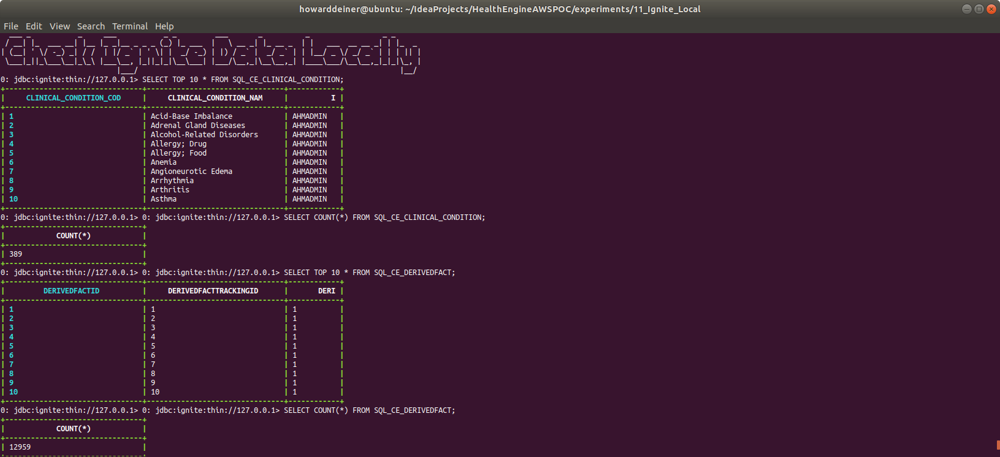
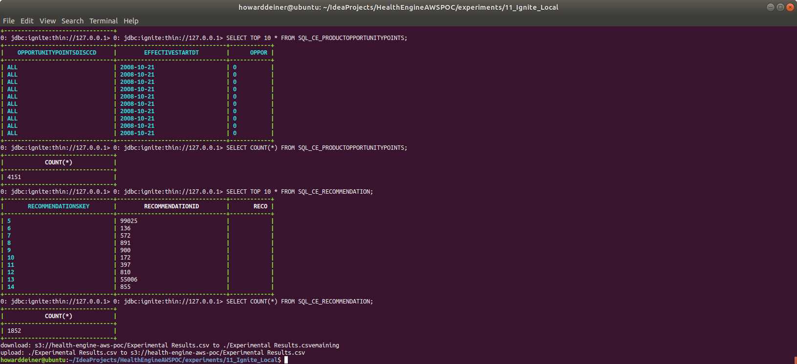
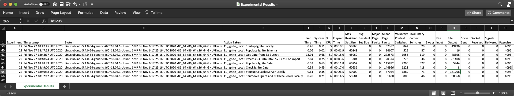
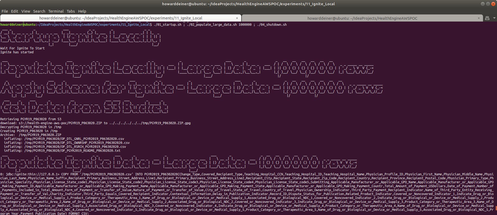
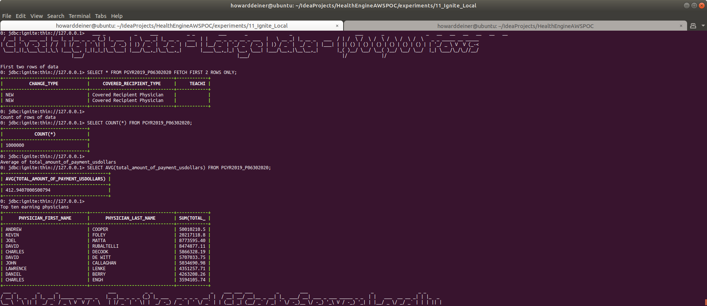
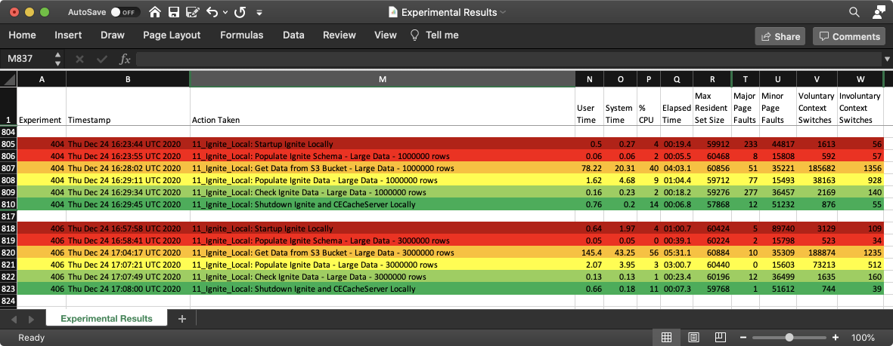

### Starting out with Apache Ignite

##### Concept

> Apache Ignite is an open-source distributed database (without rolling upgrade), caching and processing platform designed to store and compute on large volumes of data across a cluster of nodes.
>
> Ignite was open-sourced by GridGain Systems in late 2014 and accepted in the Apache Incubator program that same year. The Ignite project graduated on September 18, 2015.
>
> Apache Ignite's database utilizes RAM as the default storage and processing tier, thus, belonging to the class of in-memory computing platforms. The disk tier is optional but, once enabled, will hold the full data set whereas the memory tier will cache full or partial data set depending on its capacity.
>
> Regardless of the API used, data in Ignite is stored in the form of key-value pairs. The database component scales horizontally, distributing key-value pairs across the cluster in such a way that every node owns a portion of the overall data set. Data is rebalanced automatically whenever a node is added to or removed from the cluster.
>
> On top of its distributed foundation, Apache Ignite supports a variety of APIs including JCache-compliant key-value APIs, ANSI-99 SQL with joins, ACID transactions, as well as MapReduce like computations.
>
> Apache Ignite cluster can be deployed on-premise on a commodity hardware, in the cloud (e.g. Microsoft Azure, AWS, Google Compute Engine) or in a containerized and provisioning environments such as Kubernetes, Docker, Apache Mesos, VMWare. 
>
> https://en.wikipedia.org/wiki/Apache_Ignite
>
> https://www.gridgain.com

#### Execution

We want to get into Ignite quickly.  So, before we start running AWS instances, we need to master our data and how we're going to instantiate it in the database.

This whole project is about rearchitecting the database behind CareEngine, and we will try several different databases to do that.

### 01_startup.sh
This script uses docker-compose to take the latest Dockerhub Ignite image and bring it up in a container running as a daemon.  Since Postgres wants to persist data, I use a Docker Volume, which I delete in 03_shutdown.sh

Since we do not want to make use of the database until it actually starts, I monitor the logs from the postgres_container until I see a signature which tells me that the database has started.
```bash
#!/usr/bin/env bash

bash -c 'cat << "EOF" > .script
#!/usr/bin/env bash
figlet -w 160 -f small "Startup Ignite Locally"
docker volume rm 11_ignite_local_ignite_data
docker-compose -f docker-compose.yml up -d

echo "Wait For Ignite To Start"
while true ; do
  docker logs ignite_container > stdout.txt 2> stderr.txt
  result=$(grep -cE "Ignite node started OK" stdout.txt)
  if [ $result != 0 ] ; then
    echo "Ignite has started"
    break
  fi
  sleep 5
done
rm stdout.txt stderr.txt
EOF'
chmod +x .script
command time -v ./.script 2> .results
../../getExperimentalResults.sh
../../getDataAsCSVline.sh .results "Howard Deiner" "11_Ignite_Local: Startup Ignite Locally" >> Experimental\ Results.csv
../../putExperimentalResults.sh
rm .script .results Experimental\ Results.csv
```
### 02_populate.sh
This script first uses the running ignite_container and runs sqlline.sh in the container to create our database directly from the ddl and csv data.

The script then uses sqlline.sh to demonstrate that the ce database has the tables we created and populated.
```bash
#!/usr/bin/env bash

bash -c 'cat << "EOF" > .script
#!/usr/bin/env bash
figlet -w 160 -f small "Populate Ignite Schema Locally"
# issues with thingg like VARCHAR needing to be VARCHAR(12) docker cp ../../src/java/IgniteTranslator/changeSet.ignite.sql ignite_container:/tmp/ddl.sql
docker cp ../../src/db/changeset.ignite.sql ignite_container:/tmp/ddl.sql
docker exec ignite_container bash -c "./apache-ignite/bin/sqlline.sh -u jdbc:ignite:thin://127.0.0.1 -f /tmp/ddl.sql"
EOF'
chmod +x .script
command time -v ./.script 2> .results
../../getExperimentalResults.sh
../../getDataAsCSVline.sh .results "Howard Deiner" "11_Ignite_Local: Populate Ignite Schema Locally" >> Experimental\ Results.csv
../../putExperimentalResults.sh
rm .script .results Experimental\ Results.csv

bash -c 'cat << "EOF" > .script
#!/usr/bin/env bash
figlet -w 160 -f small "Get Data from S3 Bucket"
../../data/transfer_from_s3_and_decrypt.sh ce.ClinicalCondition.csv
../../data/transfer_from_s3_and_decrypt.sh ce.DerivedFact.csv
../../data/transfer_from_s3_and_decrypt.sh ce.DerivedFactProductUsage.csv
../../data/transfer_from_s3_and_decrypt.sh ce.MedicalFinding.csv
../../data/transfer_from_s3_and_decrypt.sh ce.MedicalFindingType.csv
../../data/transfer_from_s3_and_decrypt.sh ce.OpportunityPointsDiscr.csv
../../data/transfer_from_s3_and_decrypt.sh ce.ProductFinding.csv
../../data/transfer_from_s3_and_decrypt.sh ce.ProductFindingType.csv
../../data/transfer_from_s3_and_decrypt.sh ce.ProductOpportunityPoints.csv
../../data/transfer_from_s3_and_decrypt.sh ce.Recommendation.csv
EOF'
chmod +x .script
command time -v ./.script 2> .results
../../getExperimentalResults.sh
../../getDataAsCSVline.sh .results "Howard Deiner" "11_Ignite_Local: Get Data from S3 Bucket" >> Experimental\ Results.csv
../../putExperimentalResults.sh
rm .script .results Experimental\ Results.csv

bash -c 'cat << "EOF" > .script
#!/usr/bin/env bash
figlet -w 240 -f small "Process S3 Data into CSV Files For Import"
../transform_Oracle_ce.ClinicalCondition_to_csv.sh
../transform_Oracle_ce.DerivedFact_to_csv.sh
../transform_Oracle_ce.DerivedFactProductUsage_to_csv.sh
../transform_Oracle_ce.MedicalFinding_to_csv.sh
../transform_Oracle_ce.MedicalFindingType_to_csv.sh
../transform_Oracle_ce.OpportunityPointsDiscr_to_csv.sh
../transform_Oracle_ce.ProductFinding_to_csv.sh
../transform_Oracle_ce.ProductFindingType_to_csv.sh
../transform_Oracle_ce.ProductOpportunityPoints_to_csv.sh
../transform_Oracle_ce.Recommendation_to_csv.sh
EOF'
chmod +x .script
command time -v ./.script 2> .results
../../getExperimentalResults.sh
../../getDataAsCSVline.sh .results "Howard Deiner" "11_Ignite_Local: Process S3 Data into CSV Files For Import" >> Experimental\ Results.csv
../../putExperimentalResults.sh
rm .script .results Experimental\ Results.csv

bash -c 'cat << "EOF" > .script
#!/usr/bin/env bash
figlet -w 160 -f small "Populate Ignite Data Locally"
echo "Clinical_Condition"
sed -i -e "1d" ce.ClinicalCondition.csv
docker cp ce.ClinicalCondition.csv ignite_container:/tmp/ce.ClinicalCondition.csv
docker exec ignite_container bash -c "echo '"'"'COPY FROM '"'"'\'"'"'/tmp/ce.ClinicalCondition.csv\'"'"''"'"' INTO SQL_CE_CLINICAL_CONDITION(CLINICAL_CONDITION_COD,CLINICAL_CONDITION_NAM,INSERTED_BY,REC_INSERT_DATE,REC_UPD_DATE,UPDATED_BY,CLINICALCONDITIONCLASSCD,CLINICALCONDITIONTYPECD,CLINICALCONDITIONABBREV) FORMAT CSV;'"'"' | ./apache-ignite/bin/sqlline.sh -u jdbc:ignite:thin://127.0.0.1"
echo "DerivedFact"
sed -i -e "1d" ce.DerivedFact.csv
docker cp ce.DerivedFact.csv ignite_container:/tmp/ce.DerivedFact.csv
docker exec ignite_container bash -c "echo '"'"'COPY FROM '"'"'\'"'"'/tmp/ce.DerivedFact.csv\'"'"''"'"' INTO SQL_CE_DERIVEDFACT(DERIVEDFACTID,DERIVEDFACTTRACKINGID,DERIVEDFACTTYPEID,INSERTEDBY,RECORDINSERTDT,RECORDUPDTDT,UPDTDBY) FORMAT CSV;'"'"' | ./apache-ignite/bin/sqlline.sh -u jdbc:ignite:thin://127.0.0.1"
echo "DerivedFactProductUsage"
sed -i -e "1d" ce.DerivedFactProductUsage.csv
docker cp ce.DerivedFactProductUsage.csv ignite_container:/tmp/ce.DerivedFactProductUsage.csv
docker exec ignite_container bash -c "echo '"'"'COPY FROM '"'"'\'"'"'/tmp/ce.DerivedFactProductUsage.csv\'"'"''"'"' INTO SQL_CE_DERIVEDFACTPRODUCTUSAGE(DERIVEDFACTPRODUCTUSAGEID,DERIVEDFACTID,PRODUCTMNEMONICCD,INSERTEDBY,RECORDINSERTDT,RECORDUPDTDT,UPDTDBY) FORMAT CSV;'"'"' | ./apache-ignite/bin/sqlline.sh -u jdbc:ignite:thin://127.0.0.1"
echo "MedicalFinding"
sed -i -e "1d" ce.MedicalFinding.csv
docker cp ce.MedicalFinding.csv ignite_container:/tmp/ce.MedicalFinding.csv
docker exec ignite_container bash -c "echo '"'"'COPY FROM '"'"'\'"'"'/tmp/ce.MedicalFinding.csv\'"'"''"'"' INTO SQL_CE_MEDICALFINDING(MEDICALFINDINGID,MEDICALFINDINGTYPECD,MEDICALFINDINGNM,SEVERITYLEVELCD,IMPACTABLEFLG,CLINICAL_CONDITION_COD,INSERTEDBY,RECORDINSERTDT,RECORDUPDTDT,UPDTDBY,ACTIVEFLG,OPPORTUNITYPOINTSDISCRCD) FORMAT CSV;'"'"' | ./apache-ignite/bin/sqlline.sh -u jdbc:ignite:thin://127.0.0.1"
echo "MedicalFindingType"
sed -i -e "1d" ce.MedicalFindingType.csv
docker cp ce.MedicalFindingType.csv ignite_container:/tmp/ce.MedicalFindingType.csv
docker exec ignite_container bash -c "echo '"'"'COPY FROM '"'"'\'"'"'/tmp/ce.MedicalFindingType.csv\'"'"''"'"' INTO SQL_CE_MEDICALFINDINGTYPE(MEDICALFINDINGTYPECD,MEDICALFINDINGTYPEDESC,INSERTEDBY,RECORDINSERTDT,RECORDUPDTDT,UPDTDBY,HEALTHSTATEAPPLICABLEFLAG) FORMAT CSV;'"'"' | ./apache-ignite/bin/sqlline.sh -u jdbc:ignite:thin://127.0.0.1"
echo "OpportunityPointsDiscr"
sed -i -e "1d" ce.OpportunityPointsDiscr.csv
docker cp ce.OpportunityPointsDiscr.csv ignite_container:/tmp/ce.OpportunityPointsDiscr.csv
docker exec ignite_container bash -c "echo '"'"'COPY FROM '"'"'\'"'"'/tmp/ce.OpportunityPointsDiscr.csv\'"'"''"'"' INTO SQL_CE_OPPORTUNITYPOINTSDISCR(OPPORTUNITYPOINTSDISCRCD,OPPORTUNITYPOINTSDISCNM,INSERTEDBY,RECORDINSERTDT,RECORDUPDTDT,UPDTDBY) FORMAT CSV;'"'"' | ./apache-ignite/bin/sqlline.sh -u jdbc:ignite:thin://127.0.0.1"
echo "ProductFinding"
sed -i -e "1d" ce.ProductFinding.csv
docker cp ce.ProductFinding.csv ignite_container:/tmp/ce.ProductFinding.csv
docker exec ignite_container bash -c "echo '"'"'COPY FROM '"'"'\'"'"'/tmp/ce.ProductFinding.csv\'"'"''"'"' INTO SQL_CE_PRODUCTFINDING(PRODUCTFINDINGID,PRODUCTFINDINGNM,SEVERITYLEVELCD,PRODUCTFINDINGTYPECD,PRODUCTMNEMONICCD,SUBPRODUCTMNEMONICCD,INSERTEDBY,RECORDINSERTDT,RECORDUPDTDT,UPDTDBY) FORMAT CSV;'"'"' | ./apache-ignite/bin/sqlline.sh -u jdbc:ignite:thin://127.0.0.1"
echo "ProductFindingType"
sed -i -e "1d" ce.ProductFindingType.csv
docker cp ce.ProductFindingType.csv ignite_container:/tmp/ce.ProductFindingType.csv
docker exec ignite_container bash -c "echo '"'"'COPY FROM '"'"'\'"'"'/tmp/ce.ProductFindingType.csv\'"'"''"'"' INTO SQL_CE_PRODUCTFINDINGTYPE(PRODUCTFINDINGTYPECD,PRODUCTFINDINGTYPEDESC,INSERTEDBY,RECORDINSERTDT,RECORDUPDTDT,UPDTDBY) FORMAT CSV;'"'"' | ./apache-ignite/bin/sqlline.sh -u jdbc:ignite:thin://127.0.0.1"
echo "ProductOpportunityPoints"
sed -i -e "1d" ce.ProductOpportunityPoints.csv
docker cp ce.ProductOpportunityPoints.csv ignite_container:/tmp/ce.ProductOpportunityPoints.csv
docker exec ignite_container bash -c "echo '"'"'COPY FROM '"'"'\'"'"'/tmp/ce.ProductOpportunityPoints.csv\'"'"''"'"' INTO SQL_CE_PRODUCTOPPORTUNITYPOINTS(OPPORTUNITYPOINTSDISCCD,EFFECTIVESTARTDT,OPPORTUNITYPOINTSNBR,EFFECTIVEENDDT,DERIVEDFACTPRODUCTUSAGEID,INSERTEDBY,RECORDINSERTDT,RECORDUPDTDT,UPDTDBY) FORMAT CSV;'"'"' | ./apache-ignite/bin/sqlline.sh -u jdbc:ignite:thin://127.0.0.1"
echo "Recommendation"
sed -i -e "1d" ce.Recommendation.csv
docker cp ce.Recommendation.csv ignite_container:/tmp/ce.Recommendation.csv
docker exec ignite_container bash -c "echo '"'"'COPY FROM '"'"'\'"'"'/tmp/ce.Recommendation.csv\'"'"''"'"' INTO SQL_CE_RECOMMENDATION(RECOMMENDATIONSKEY,RECOMMENDATIONID,RECOMMENDATIONCODE,RECOMMENDATIONDESC,RECOMMENDATIONTYPE,CCTYPE,CLINICALREVIEWTYPE,AGERANGEID,ACTIONCODE,THERAPEUTICCLASS,MDCCODE,MCCCODE,PRIVACYCATEGORY,INTERVENTION,RECOMMENDATIONFAMILYID,RECOMMENDPRECE_ENCE_ROUPID,INBOUNDCOMMUNICATIONROUTE,SEVERITY,PRIMARYDIAGNOSIS,SECONDARYDIAGNOSIS,ADVERSEEVENT,ICMCONDITIONID,WELLNESSFLAG,VBFELIGIBLEFLAG,COMMUNICATIONRANKING,PRECE_ENCE_ANKING,PATIENTDERIVEDFLAG,LABREQUIREDFLAG,UTILIZATIONTEXTAVAILABLEF,SENSITIVEMESSAGEFLAG,HIGHIMPACTFLAG,ICMLETTERFLAG,REQCLINICIANCLOSINGFLAG,OPSIMPELMENTATIONPHASE,SEASONALFLAG,SEASONALSTARTDT,SEASONALENDDT,EFFECTIVESTARTDT,EFFECTIVEENDDT,RECORDINSERTDT,RECORDUPDTDT,INSERTEDBY,UPDTDBY,STANDARDRUNFLAG,INTERVENTIONFEEDBACKFAMILYID,CONDITIONFEEDBACKFAMILYID,ASHWELLNESSELIGIBILITYFLAG,HEALTHADVOCACYELIGIBILITYFLAG) FORMAT CSV;'"'"' | ./apache-ignite/bin/sqlline.sh -u jdbc:ignite:thin://127.0.0.1"
EOF'
chmod +x .script
command time -v ./.script 2> .results
../../getExperimentalResults.sh
../../getDataAsCSVline.sh .results "Howard Deiner" "11_Ignite_Local: Populate Ignite Data Locally" >> Experimental\ Results.csv
../../putExperimentalResults.sh
rm .script .results Experimental\ Results.csv

bash -c 'cat << "EOF" > .script
#!/usr/bin/env bash
figlet -w 160 -f small "Check Ignite Data Locally"
docker exec ignite_container bash -c "echo '"'"'SELECT TOP 10 * FROM SQL_CE_CLINICAL_CONDITION;'"'"' | ./apache-ignite/bin/sqlline.sh --color=true -u jdbc:ignite:thin://127.0.0.1"
docker exec ignite_container bash -c "echo '"'"'SELECT COUNT(*) FROM SQL_CE_CLINICAL_CONDITION;'"'"' | ./apache-ignite/bin/sqlline.sh --color=true -u jdbc:ignite:thin://127.0.0.1"
docker exec ignite_container bash -c "echo '"'"'SELECT TOP 10 * FROM SQL_CE_DERIVEDFACT;'"'"' | ./apache-ignite/bin/sqlline.sh --color=true -u jdbc:ignite:thin://127.0.0.1"
docker exec ignite_container bash -c "echo '"'"'SELECT COUNT(*) FROM SQL_CE_DERIVEDFACT;'"'"' | ./apache-ignite/bin/sqlline.sh --color=true -u jdbc:ignite:thin://127.0.0.1"
docker exec ignite_container bash -c "echo '"'"'SELECT TOP 10 * FROM SQL_CE_DERIVEDFACTPRODUCTUSAGE;'"'"' | ./apache-ignite/bin/sqlline.sh --color=true -u jdbc:ignite:thin://127.0.0.1"
docker exec ignite_container bash -c "echo '"'"'SELECT COUNT(*) FROM SQL_CE_DERIVEDFACTPRODUCTUSAGE;'"'"' | ./apache-ignite/bin/sqlline.sh --color=true -u jdbc:ignite:thin://127.0.0.1"
docker exec ignite_container bash -c "echo '"'"'SELECT TOP 10 * FROM SQL_CE_MEDICALFINDING;'"'"' | ./apache-ignite/bin/sqlline.sh --color=true -u jdbc:ignite:thin://127.0.0.1"
docker exec ignite_container bash -c "echo '"'"'SELECT COUNT(*) FROM SQL_CE_MEDICALFINDING;'"'"' | ./apache-ignite/bin/sqlline.sh --color=true -u jdbc:ignite:thin://127.0.0.1"
docker exec ignite_container bash -c "echo '"'"'SELECT TOP 10 * FROM SQL_CE_MEDICALFINDINGTYPE;'"'"' | ./apache-ignite/bin/sqlline.sh --color=true -u jdbc:ignite:thin://127.0.0.1"
docker exec ignite_container bash -c "echo '"'"'SELECT COUNT(*) FROM SQL_CE_MEDICALFINDINGTYPE;'"'"' | ./apache-ignite/bin/sqlline.sh --color=true -u jdbc:ignite:thin://127.0.0.1"
docker exec ignite_container bash -c "echo '"'"'SELECT TOP 10 * FROM SQL_CE_OPPORTUNITYPOINTSDISCR;'"'"' | ./apache-ignite/bin/sqlline.sh --color=true -u jdbc:ignite:thin://127.0.0.1"
docker exec ignite_container bash -c "echo '"'"'SELECT COUNT(*) FROM SQL_CE_OPPORTUNITYPOINTSDISCR;'"'"' | ./apache-ignite/bin/sqlline.sh --color=true -u jdbc:ignite:thin://127.0.0.1"
docker exec ignite_container bash -c "echo '"'"'SELECT TOP 10 * FROM SQL_CE_PRODUCTFINDING;'"'"' | ./apache-ignite/bin/sqlline.sh --color=true -u jdbc:ignite:thin://127.0.0.1"
docker exec ignite_container bash -c "echo '"'"'SELECT COUNT(*) FROM SQL_CE_PRODUCTFINDING;'"'"' | ./apache-ignite/bin/sqlline.sh --color=true -u jdbc:ignite:thin://127.0.0.1"
docker exec ignite_container bash -c "echo '"'"'SELECT TOP 10 * FROM SQL_CE_PRODUCTFINDINGTYPE;'"'"' | ./apache-ignite/bin/sqlline.sh --color=true -u jdbc:ignite:thin://127.0.0.1"
docker exec ignite_container bash -c "echo '"'"'SELECT COUNT(*) FROM SQL_CE_PRODUCTFINDINGTYPE;'"'"' | ./apache-ignite/bin/sqlline.sh --color=true -u jdbc:ignite:thin://127.0.0.1"
docker exec ignite_container bash -c "echo '"'"'SELECT TOP 10 * FROM SQL_CE_PRODUCTOPPORTUNITYPOINTS;'"'"' | ./apache-ignite/bin/sqlline.sh --color=true -u jdbc:ignite:thin://127.0.0.1"
docker exec ignite_container bash -c "echo '"'"'SELECT COUNT(*) FROM SQL_CE_PRODUCTOPPORTUNITYPOINTS;'"'"' | ./apache-ignite/bin/sqlline.sh --color=true -u jdbc:ignite:thin://127.0.0.1"
docker exec ignite_container bash -c "echo '"'"'SELECT TOP 10 * FROM SQL_CE_RECOMMENDATION;'"'"' | ./apache-ignite/bin/sqlline.sh --color=true -u jdbc:ignite:thin://127.0.0.1"
docker exec ignite_container bash -c "echo '"'"'SELECT COUNT(*) FROM SQL_CE_RECOMMENDATION;'"'"' | ./apache-ignite/bin/sqlline.sh --color=true -u jdbc:ignite:thin://127.0.0.1"
EOF'
chmod +x .script
command time -v ./.script 2> .results
../../getExperimentalResults.sh
../../getDataAsCSVline.sh .results "Howard Deiner" "11_Ignite_Local: Check Ignite Data Locally" >> Experimental\ Results.csv
../../putExperimentalResults.sh
rm .script .results *.csv
```

### 03_startup_app.sh
Here, we bring up the CECacheServer with docker-compose with the same network as we used to bring up Apache Ignite in, so the CECacheServer can make requests of the database.
<BR/>
Normally, we would do this in the 01_startup.sh script, but we want to seperate out the effects of the database from the application for performance collection purposes, so we do it here.

```bash
#!/usr/bin/env bash

bash -c 'cat << "EOF" > .script
#!/usr/bin/env bash
figlet -w 240 -f small "Startup CECacheServer Locally"
docker volume rm 11_ignite_local_cecacheserver_data
docker-compose -f docker-compose.app.yml up -d --build

echo "Wait For CECacheServer To Start"
while true ; do
  docker logs cecacheserver_forignite_container > stdout.txt 2> stderr.txt
  result=$(grep -cE "<<<<< Local Cache Statistics <<<<<" stdout.txt)
  if [ $result != 0 ] ; then
    echo "CECacheServer has started"
    break
  fi
  sleep 5
done
rm stdout.txt stderr.txt
EOF'
chmod +x .script
command time -v ./.script 2> .results
../../getExperimentalResults.sh
experiment=$(../../getExperimentNumber.sh)
../../getDataAsCSVline.sh .results ${experiment} "11_Ignite_Local: Startup CECacheServer Locally" >> Experimental\ Results.csv
../../putExperimentalResults.sh
rm .script .results Experimental\ Results.csv
```


### 04_shutdown.sh
This script is brutely simple.  It uses docker-compose to bring down the environment it established, and then uses docker volume rm to delete the data which held the bits for out database data.

```bash
#!/usr/bin/env bash

bash -c 'cat << "EOF" > .script
#!/usr/bin/env bash
figlet -w 160 -f small "Shutdown Ignite Locally"
docker-compose -f docker-compose.yml down
docker volume rm 11_ignite_local_ignite_data
EOF'
chmod +x .script
command time -v ./.script 2> .results
../../getExperimentalResults.sh
../../getDataAsCSVline.sh .results "Howard Deiner" "11_Ignite_Local: Shutdown Ignite Locally" >> Experimental\ Results.csv
../../putExperimentalResults.sh
rm .script .results Experimental\ Results.csv
```

### Putting it all together...

It all looks something like this:

\
<BR />
\
\
\
\
\
\
\
<BR />
\
<BR />
\
<BR />
And just for laughs, here's the timings for this run.  All kept in a csv file in S3 at s3://health-engine-aws-poc/Experimental Results.csv
\
<BR />

### Large Data Experiments

A different script is available for large data testing.  This transfers the dataset for large volume testing.  It uses the data from the "Complete 2019 Program Year Open Payments Dataset" from the Center for Medicare & Medicade Services.  See https://www.cms.gov/OpenPayments/Explore-the-Data/Dataset-Downloads for details.  In total, there is over 6GB in this dataset.

The script 02_populate_large_data.sh is a variation on 02_populate.sh.
```bash
#!/usr/bin/env bash

if [ $# -eq 0 ]
  then
    echo "must supply the command with the number of rows to use"
    exit 1
fi

re='^[0-9]+$'
if ! [[ $1 =~ $re ]] ; then
    echo "must supply the command with the number of rows to use"
   exit 1
fi

ROWS=$1
export ROWS

bash -c 'cat << "EOF" > .script
#!/usr/bin/env bash

echo $1

figlet -w 240 -f small "Populate Ignite Locally - Large Data - $(numfmt --grouping $ROWS) rows"

figlet -w 240 -f small "Apply Schema for Ignite - Large Data - $(numfmt --grouping $ROWS) rows"
cp ../../ddl/PGYR19_P063020/changeset.cassandra.sql .changeset.sql
sed --in-place --regexp-extended '"'"'s/PGYR19_P063020\.PI/PGYR2019_P06302020/g'"'"' .changeset.sql
sed --in-place --regexp-extended '"'"'s/TIMESTAMP/DATE/g'"'"' .changeset.sql
sed --in-place --regexp-extended '"'"'s/TEXT/INT/g'"'"' .changeset.sql
sed --in-place --regexp-extended '"'"'s/record_id INT PRIMARY KEY/record_id BIGINT PRIMARY KEY/g'"'"' .changeset.sql
docker cp .changeset.sql ignite_container:/tmp/ddl.sql
docker exec ignite_container bash -c "./apache-ignite/bin/sqlline.sh -u jdbc:ignite:thin://127.0.0.1 -f /tmp/ddl.sql"
EOF'
chmod +x .script
command time -v ./.script 2> .results
../../getExperimentalResults.sh
experiment=$(../../getExperimentNumber.sh)
../../getDataAsCSVline.sh .results ${experiment} "11_Ignite_Local: Populate Ignite Schema - Large Data - $ROWS rows" >> Experimental\ Results.csv
../../putExperimentalResults.sh
rm .script .results .changeset.sql Experimental\ Results.csv

bash -c 'cat << "EOF" > .script
#!/usr/bin/env bash
figlet -w 240 -f small "Get Data from S3 Bucket"
../../data/transferPGYR19_P063020_from_s3_and_decrypt.sh
python3 ../../create_insert_data_PGYR2019_P06302020.py -s $ROWS -i /tmp/PGYR19_P063020/OP_DTL_GNRL_PGYR2019_P06302020.csv -o /tmp/insert_data
EOF'
chmod +x .script
command time -v ./.script 2> .results
../../getExperimentalResults.sh
experiment=$(../../getExperimentNumber.sh)
../../getDataAsCSVline.sh .results ${experiment} "11_Ignite_Local: Get Data from S3 Bucket - Large Data - $ROWS rows" >> Experimental\ Results.csv
../../putExperimentalResults.sh
rm .script .results Experimental\ Results.csv

command time -v ./02_populate_large_data_load_data.sh $ROWS 2> .results
../../getExperimentalResults.sh
experiment=$(../../getExperimentNumber.sh)
../../getDataAsCSVline.sh .results ${experiment} "11_Ignite_Local: Populate Ignite Data - Large Data - $ROWS rows" >> Experimental\ Results.csv
../../putExperimentalResults.sh
rm -rf .script .results Experimental\ Results.csv /tmp/insert_data

bash -c 'cat << "EOF" > .script
#!/usr/bin/env bash
figlet -w 240 -f small "Check Ignite Data - Large Data - $(numfmt --grouping $ROWS) rows"

echo ""
echo "First two rows of data"
docker exec ignite_container bash -c "echo '"'"'SELECT * FROM PGYR2019_P06302020 FETCH FIRST 2 ROWS ONLY;'"'"' | ./apache-ignite/bin/sqlline.sh --color=true -u jdbc:ignite:thin://127.0.0.1"
echo ""
echo "Count of rows of data"
docker exec ignite_container bash -c "echo '"'"'SELECT COUNT(*) FROM PGYR2019_P06302020;'"'"' | ./apache-ignite/bin/sqlline.sh --color=true -u jdbc:ignite:thin://127.0.0.1"
echo ""
echo "Average of total_amount_of_payment_usdollars"
docker exec ignite_container bash -c "echo '"'"'SELECT AVG(total_amount_of_payment_usdollars) FROM PGYR2019_P06302020;'"'"' | ./apache-ignite/bin/sqlline.sh --color=true -u jdbc:ignite:thin://127.0.0.1"
echo ""
echo "Top ten earning physicians"
echo "SELECT physician_first_name, physician_last_name, SUM(total_amount_of_payment_usdollars), COUNT(total_amount_of_payment_usdollars) " > .command.sql
echo "FROM PGYR2019_P06302020 " >> .command.sql
echo "WHERE physician_first_name != '"'"''"'"' " >> .command.sql
echo "AND physician_last_name != '"'"''"'"' " >> .command.sql
echo "GROUP BY physician_first_name, physician_last_name " >> .command.sql
echo "ORDER BY SUM(total_amount_of_payment_usdollars) DESC " >> .command.sql
echo "FETCH FIRST 10 ROWS ONLY; " >> .command.sql
docker cp .command.sql ignite_container:/tmp/command.sql
docker exec ignite_container bash -c "./apache-ignite/bin/sqlline.sh -u jdbc:ignite:thin://127.0.0.1 -f /tmp/command.sql"
EOF'
chmod +x .script
command time -v ./.script 2> .results
../../getExperimentalResults.sh
experiment=$(../../getExperimentNumber.sh)
../../getDataAsCSVline.sh .results ${experiment} "11_Ignite_Local: Check Ignite Data - Large Data - $ROWS rows" >> Experimental\ Results.csv
../../putExperimentalResults.sh
rm -rf .script .sql .results .command.sql *.csv /tmp/PGYR19_P063020
```
As you can see, there are two helper scripts to actually do the data load.  The first is a Python progrsm called create_insert_data_PGYR2019_P06302020.py, which takes the raw "Complete 2019 Program Year Open Payments Dataset" and creates a script that manufactures SQL INSERT statements to load the data.  Apache Ignite has a CSV Bulk Loader, but it does not work with quoted data CSV files yet.  As such, we will incur a penalty in the data load timings, both to run the helper program, and then to insert the data one row at a time.  The code look like this:
```python
import argparse
import os
import csv
import re
from subprocess import check_output
from subprocess import call

def get_args():
    """get command-line arguments"""

    parser = argparse.ArgumentParser(
        description='cleansePGYR10_P063030 Data',
        formatter_class=argparse.ArgumentDefaultsHelpFormatter)

    parser.add_argument('-s',
                        '--size',
                        help='Size in rows of file to take',
                        metavar='int',
                        type=str,
                        default=1000)

    parser.add_argument('-i',
                        '--inputfile',
                        help='Input filename',
                        metavar='str',
                        type=str,
                        default='')

    parser.add_argument('-o',
                        '--outputfile',
                        help='Output filename',
                        metavar='str',
                        type=str,
                        default='')

    args = parser.parse_args()

    return args

def create_insert_data(filesize, filenamein, filenameout):

    call("rm -rf "+filenameout, shell=True)

    csv_file_out = open(filenameout, mode='w')
    with open(filenamein) as csv_file_in:
        csv_reader = csv.reader(csv_file_in, delimiter=',')
        line_count = 0
        for row in csv_reader:
            if (line_count != 0):
                while ("'" in row[6]):   # Physician_First_Name
                    row[6] = re.sub(r'^(.*)([\'])(.*$)', r'\1\3', row[6])

                while (',' in row[6]):   # Physician_First_Name
                    row[6] = re.sub(r'^(.*)([,])(.*$)', r'\1\3', row[6])

                while ("'" in row[7]):   # Physician_Middle_Name
                    row[7] = re.sub(r'^(.*)([\'])(.*$)', r'\1\3', row[7])

                while (',' in row[7]):   # Physician_Middle_Name
                    row[7] = re.sub(r'^(.*)([,])(.*$)', r'\1\3', row[7])

                while ("'" in row[8]):   # Physician_Last_Name
                    row[8] = re.sub(r'^(.*)([\'])(.*$)', r'\1\3', row[8])

                while (',' in row[8]):  # Physician_Last_Name
                    row[8] = re.sub(r'^(.*)([,])(.*$)', r'\1\3', row[8])

                while ("'" in row[9]):   # Physician_Name_Suffix
                    row[9] = re.sub(r'^(.*)([\'])(.*$)', r'\1\3', row[9])

                while (',' in row[9]):  # Physician_Name_Suffix
                    row[9] = re.sub(r'^(.*)([,])(.*$)', r'\1\3', row[9])

                while ("'" in row[10]):   # Recipient_Primary_Business_Street_Address_Line1
                    row[10] = re.sub(r'^(.*)([\'])(.*$)', r'\1\3', row[10])

                while ('"' in row[10]):  # Recipient_Primary_Business_Street_Address_Line1
                    row[10] = re.sub(r'^^(.*)(\")(.*$)', r'\1\3', row[10])

                while (',' in row[10]):  # Recipient_Primary_Business_Street_Address_Line1
                    row[10] = re.sub(r'^(.*)([,])(.*$)', r'\1\3', row[10])

                while ("'" in row[11]):   # Recipient_Primary_Business_Street_Address_Line2
                    row[11] = re.sub(r'^(.*)([\'])(.*$)', r'\1\3', row[11])

                while (',' in row[11]):  # Recipient_Primary_Business_Street_Address_Line2
                    row[11] = re.sub(r'^(.*)([,])(.*$)', r'\1\3', row[11])

                while ("'" in row[12]):   # Recipient_City
                    row[12] = re.sub(r'^(.*)([\'])(.*$)', r'\1\3', row[12])

                while (',' in row[12]):  # Recipient_City
                    row[12] = re.sub(r'^(.*)([,])(.*$)', r'\1\3', row[12])

                while ("'" in row[19]):   # Physician_Specialty
                    row[19] = re.sub(r'^(.*)([\'])(.*$)', r'\1\3', row[19])

                while (',' in row[19]):  # Physician_Specialty
                    row[19] = re.sub(r'^(.*)([,])(.*$)', r'\1\3', row[19])

                while ("'" in row[25]):   # Submitting_Applicable_Manufacturer_or_Applicable_GPO_Name
                    row[25] = re.sub(r'^(.*)([\'])(.*$)', r'\1\3', row[25])

                while (',' in row[25]):  # Submitting_Applicable_Manufacturer_or_Applicable_GPO_Name
                    row[25] = re.sub(r'^(.*)([,])(.*$)', r'\1\3', row[25])

                while ("'" in row[27]):   # Applicable_Manufacturer_or_Applicable_GPO_Making_Payment_Name
                    row[27] = re.sub(r'^(.*)([\'])(.*$)', r'\1\3', row[27])

                while (',' in row[27]):  # Applicable_Manufacturer_or_Applicable_GPO_Making_Payment_Name
                    row[27] = re.sub(r'^(.*)([,])(.*$)', r'\1\3', row[27])

                row[31] = re.sub(r'^(.*)(/)(.*)(/)(.*$)', r'\5-\1-\3', row[31]) #  Date_of_Payment

                while ("'" in row[33]):   # Form_of_Payment_or_Transfer_of_Value
                    row[33] = re.sub(r'^(.*)([\'])(.*$)', r'\1\3', row[33])

                while (',' in row[33]):  # Form_of_Payment_or_Transfer_of_Value
                    row[33] = re.sub(r'^(.*)([,])(.*$)', r'\1\3', row[33])

                while ("'" in row[34]):   # Nature_of_Payment_or_Transfer_of_Value
                    row[34] = re.sub(r'^(.*)([\'])(.*$)', r'\1\3', row[34])

                while (',' in row[34]):  # Nature_of_Payment_or_Transfer_of_Value
                    row[34] = re.sub(r'^(.*)([,])(.*$)', r'\1\3', row[34])

                while ("'" in row[35]):   # City_of_Travel
                    row[35] = re.sub(r'^(.*)([\'])(.*$)', r'\1\3', row[35])

                while (',' in row[35]):  # City_of_Travel
                    row[35] = re.sub(r'^(.*)([,])(.*$)', r'\1\3', row[35])

                while ("'" in row[37]):   # Country_of_Travel
                    row[37] = re.sub(r'^(.*)([\'])(.*$)', r'\1\3', row[37])

                while (',' in row[37]):  # Country_of_Travel
                    row[37] = re.sub(r'^(.*)([,])(.*$)', r'\1\3', row[37])

                while ("'" in row[40]):   # Name_of_Third_Party_Entity_Receiving_Payment_or_Transfer_of_Value
                    row[40] = re.sub(r'^(.*)([\'])(.*$)', r'\1\3', row[40])

                while ('"' in row[40]):  # Name_of_Third_Party_Entity_Receiving_Payment_or_Transfer_of_Value
                    row[40] = re.sub(r'^^(.*)(\")(.*$)', r'\1\3', row[40])

                while (',' in row[40]):  # Name_of_Third_Party_Entity_Receiving_Payment_or_Transfer_of_Value
                    row[40] = re.sub(r'^(.*)([,])(.*$)', r'\1\3', row[40])

                while ("'" in row[43]):   # Contextual_Information
                    row[43] = re.sub(r'^(.*)([\'])(.*$)', r'\1\3', row[43])

                while (',' in row[43]):  # Contextual_Information
                    row[43] = re.sub(r'^(.*)([,])(.*$)', r'\1\3', row[43])

                while ("'" in row[49]):   # Indicate_Drug_or_Biological_or_Device_or_Medical_Supply_1
                    row[49] = re.sub(r'^(.*)([\'])(.*$)', r'\1\3', row[49])

                while (',' in row[49]):  # Indicate_Drug_or_Biological_or_Device_or_Medical_Supply_1
                    row[49] = re.sub(r'^(.*)([,])(.*$)', r'\1\3', row[49])

                while ("'" in row[50]):   # Product_Category_or_Therapeutic_Area_1
                    row[50] = re.sub(r'^(.*)([\'])(.*$)', r'\1\3', row[50])

                while (',' in row[50]):  # Product_Category_or_Therapeutic_Area_1
                    row[50] = re.sub(r'^(.*)([,])(.*$)', r'\1\3', row[50])

                while ("'" in row[51]):   # Name_of_Drug_or_Biological_or_Device_or_Medical_Supply_1
                    row[51] = re.sub(r'^(.*)([\'])(.*$)', r'\1\3', row[51])

                while (',' in row[51]):  # Name_of_Drug_or_Biological_or_Device_or_Medical_Supply_1
                    row[51] = re.sub(r'^(.*)([,])(.*$)', r'\1\3', row[51])

                while ('"' in row[51]):  # Name_of_Drug_or_Biological_or_Device_or_Medical_Supply_1
                    row[51] = re.sub(r'^^(.*)(\")(.*$)', r'\1\3', row[51])

                while ("'" in row[52]):   # Associated_Drug_or_Biological_NDC_1
                    row[52] = re.sub(r'^(.*)([\'])(.*$)', r'\1\3', row[52])

                while (',' in row[52]):  # Associated_Drug_or_Biological_NDC_1
                    row[52] = re.sub(r'^(.*)([,])(.*$)', r'\1\3', row[52])

                while ("'" in row[54]):   # Indicate_Drug_or_Biological_or_Device_or_Medical_Supply_2
                    row[54] = re.sub(r'^(.*)([\'])(.*$)', r'\1\3', row[54])

                while (',' in row[54]):  # Indicate_Drug_or_Biological_or_Device_or_Medical_Supply_2
                    row[54] = re.sub(r'^(.*)([,])(.*$)', r'\1\3', row[54])

                while ("'" in row[55]):   # Product_Category_or_Therapeutic_Area_2
                    row[55] = re.sub(r'^(.*)([\'])(.*$)', r'\1\3', row[55])

                while (',' in row[55]):  # Product_Category_or_Therapeutic_Area_2
                    row[55] = re.sub(r'^(.*)([,])(.*$)', r'\1\3', row[55])

                while ("'" in row[56]):   # Name_of_Drug_or_Biological_or_Device_or_Medical_Supply_2
                    row[56] = re.sub(r'^(.*)([\'])(.*$)', r'\1\3', row[56])

                while (',' in row[56]):  # Name_of_Drug_or_Biological_or_Device_or_Medical_Supply_2
                    row[56] = re.sub(r'^(.*)([,])(.*$)', r'\1\3', row[56])

                while ('"' in row[56]):  # Name_of_Drug_or_Biological_or_Device_or_Medical_Supply_2
                    row[56] = re.sub(r'^^(.*)(\")(.*$)', r'\1\3', row[56])

                while ("'" in row[57]):   # Associated_Drug_or_Biological_NDC_2
                    row[57] = re.sub(r'^(.*)([\'])(.*$)', r'\1\3', row[57])

                while (',' in row[57]):  # Associated_Drug_or_Biological_NDC_2
                    row[57] = re.sub(r'^(.*)([,])(.*$)', r'\1\3', row[57])

                while ("'" in row[60]):   # Product_Category_or_Therapeutic_Area_3
                    row[60] = re.sub(r'^(.*)([\'])(.*$)', r'\1\3', row[60])

                while (',' in row[60]):  # Product_Category_or_Therapeutic_Area_3
                    row[60] = re.sub(r'^(.*)([,])(.*$)', r'\1\3', row[60])

                while ("'" in row[61]):   # Name_of_Drug_or_Biological_or_Device_or_Medical_Supply_3
                    row[61] = re.sub(r'^(.*)([\'])(.*$)', r'\1\3', row[61])

                while (',' in row[61]):  # Name_of_Drug_or_Biological_or_Device_or_Medical_Supply_3
                    row[61] = re.sub(r'^(.*)([,])(.*$)', r'\1\3', row[61])

                while ('"' in row[61]):  # Name_of_Drug_or_Biological_or_Device_or_Medical_Supply_3
                    row[61] = re.sub(r'^^(.*)(\")(.*$)', r'\1\3', row[61])

                while ("'" in row[62]):   # Associated_Drug_or_Biological_NDC_3
                    row[62] = re.sub(r'^(.*)([\'])(.*$)', r'\1\3', row[62])

                while (',' in row[62]):  # Associated_Drug_or_Biological_NDC_3
                    row[62] = re.sub(r'^(.*)([,])(.*$)', r'\1\3', row[62])

                while ("'" in row[65]):   # Product_Category_or_Therapeutic_Area_4
                    row[65] = re.sub(r'^(.*)([\'])(.*$)', r'\1\3', row[65])

                while (',' in row[65]):  # Product_Category_or_Therapeutic_Area_4
                    row[65] = re.sub(r'^(.*)([,])(.*$)', r'\1\3', row[65])

                while ("'" in row[66]):   # Name_of_Drug_or_Biological_or_Device_or_Medical_Supply_4
                    row[66] = re.sub(r'^(.*)([\'])(.*$)', r'\1\3', row[66])

                while (',' in row[66]):  # Name_of_Drug_or_Biological_or_Device_or_Medical_Supply_4
                    row[66] = re.sub(r'^(.*)([,])(.*$)', r'\1\3', row[66])

                while ('"' in row[66]):  # Name_of_Drug_or_Biological_or_Device_or_Medical_Supply_4
                    row[66] = re.sub(r'^^(.*)(\")(.*$)', r'\1\3', row[66])

                while ("'" in row[67]):   # Associated_Drug_or_Biological_NDC_4
                    row[67] = re.sub(r'^(.*)([\'])(.*$)', r'\1\3', row[67])

                while (',' in row[67]):  # Associated_Drug_or_Biological_NDC_4
                    row[67] = re.sub(r'^(.*)([,])(.*$)', r'\1\3', row[67])

                while ("'" in row[70]):   # Product_Category_or_Therapeutic_Area_5
                    row[70] = re.sub(r'^(.*)([\'])(.*$)', r'\1\3', row[70])

                while (',' in row[70]):  # Product_Category_or_Therapeutic_Area_5
                    row[70] = re.sub(r'^(.*)([,])(.*$)', r'\1\3', row[70])

                while ("'" in row[71]):   # Name_of_Drug_or_Biological_or_Device_or_Medical_Supply_5
                    row[71] = re.sub(r'^(.*)([\'])(.*$)', r'\1\3', row[71])

                while (',' in row[71]):  # Name_of_Drug_or_Biological_or_Device_or_Medical_Supply_5
                    row[71] = re.sub(r'^(.*)([,])(.*$)', r'\1\3', row[71])

                while ('"' in row[71]):  # Name_of_Drug_or_Biological_or_Device_or_Medical_Supply_5
                    row[71] = re.sub(r'^^(.*)(\")(.*$)', r'\1\3', row[71])

                while ("'" in row[72]):   # Associated_Drug_or_Biological_NDC_5
                    row[72] = re.sub(r'^(.*)([\'])(.*$)', r'\1\3', row[72])

                while (',' in row[72]):  # Associated_Drug_or_Biological_NDC_5
                    row[72] = re.sub(r'^(.*)([,])(.*$)', r'\1\3', row[72])

                row[74] = re.sub(r'^(.*)(/)(.*)(/)(.*$)', r'\5-\1-\3', row[74]) #  Payment_Publication_Date

                outrow = "INSERT INTO PGYR2019_P06302020 VALUES("
                for i in range(75):
                    if (i in [3,5,30,32,45,73]):  #numbers
                        if (len(row[i]) == 0):
                            outrow += "0,"
                        else:
                            outrow += row[i] + ","
                    elif (i in [31,74]):    #dates
                        outrow += "'" + row[i] + "'" + ","
                    else:
                        outrow += "'" + row[i] + "'" + ","
                outrow = outrow[:-1]
                outrow += ");\n"
                csv_file_out.write(outrow)

            if (line_count < filesize):
                line_count += 1
            else:
                break

    csv_file_in.close()
    csv_file_out.close()

def main():
    args = get_args()

    if(args.inputfile == ''):
        print("You must specify an input filename")
        quit()
    if os.path.isfile(args.inputfile) != True:
        print("Input file does not exist")
        quit()
    if(args.outputfile == ''):
        print("You must specify an output filename")
        quit()

    create_insert_data(int(args.size),args.inputfile,args.outputfile)

    quit()


# Press the green button in the gutter to run the script.
if __name__ == '__main__':
    main()
```
The other helper file is called 02_populate_large_data_load_data.sh.  For this experiment, it is REALLY simple, and looks like:
```bash
#!/usr/bin/env bash

ROWS=$1

figlet -w 240 -f small "Populate Ignite Data - Large Data - $ROWS rows"
docker cp /tmp/insert_data ignite_container:/tmp/import.command
docker exec ignite_container bash -c "./apache-ignite/bin/sqlline.sh -u jdbc:ignite:thin://127.0.0.1 -f /tmp/import.command"
```

It uses the following schema, althout it does not use Liquibase to establish the database.
```xml
<?xml version="1.0" encoding="UTF-8"?>

<databaseChangeLog
        xmlns="http://www.liquibase.org/xml/ns/dbchangelog"
        xmlns:xsi="http://www.w3.org/2001/XMLSchema-instance"
        xsi:schemaLocation="http://www.liquibase.org/xml/ns/dbchangelog
         http://www.liquibase.org/xml/ns/dbchangelog/dbchangelog-3.8.xsd">

    <changeSet  id="1"  author="howarddeiner">

        <createTable tableName="OP_DTL_GNRL_PGYR2019_P06302020" schemaName="PI">
            <column name="change_type" type="VARCHAR2(20)"/>
            <column name="covered_recipient_type" type="VARCHAR2(50)"/>
            <column name="teaching_hospital_ccn" type="VARCHAR2(06)"/>
            <column name="teaching_hospital_id" type="NUMBER(38,0)"/>
            <column name="teaching_hospital_name" type="VARCHAR2(100)"/>
            <column name="physician_profile_id" type="NUMBER(38,0)"/>
            <column name="physician_first_name" type="VARCHAR2(20)"/>
            <column name="physician_middle_name" type="VARCHAR2(20)"/>
            <column name="physician_last_name" type="VARCHAR2(35)"/>
            <column name="physician_name_suffix" type="VARCHAR2(5)"/>
            <column name="recipient_primary_business_street_address_line1" type="VARCHAR2(55)"/>
            <column name="recipient_primary_business_street_address_line2" type="VARCHAR2(55)"/>
            <column name="recipient_city" type="VARCHAR2(40)"/>
            <column name="recipient_state" type="CHAR(2)"/>
            <column name="recipient_zip_code" type="VARCHAR2(10)"/>
            <column name="recipient_country" type="VARCHAR2(100)"/>
            <column name="recipient_province" type="VARCHAR2(20)"/>
            <column name="recipient_postal_code" type="VARCHAR2(20)"/>
            <column name="physician_primary_type" type="VARCHAR2(100)"/>
            <column name="physician_specialty" type="VARCHAR2(300)"/>
            <column name="physician_license_state_code1" type="CHAR(2)"/>
            <column name="physician_license_state_code2" type="CHAR(2)"/>
            <column name="physician_license_state_code3" type="CHAR(2)"/>
            <column name="physician_license_state_code4" type="CHAR(2)"/>
            <column name="physician_license_state_code5" type="CHAR(2)"/>
            <column name="submitting_applicable_manufacturer_or_applicable_gpo_name" type="VARCHAR2(100)"/>
            <column name="applicable_manufacturer_or_applicable_gpo_making_payment_id" type="VARCHAR2(12)"/>
            <column name="applicable_manufacturer_or_applicable_gpo_making_payment_name" type="VARCHAR2(100)"/>
            <column name="applicable_manufacturer_or_applicable_gpo_making_payment_state" type="CHAR(2)"/>
            <column name="applicable_manufacturer_or_applicable_gpo_making_payment_countr" type="VARCHAR2(100)"/>
            <column name="total_amount_of_payment_usdollars" type="NUMBER(12,2)"/>
            <column name="date_of_payment" type="DATE"/>
            <column name="number_of_payments_included_in_total_amount" type="NUMBER(3,0)"/>
            <column name="form_of_payment_or_transfer_of_value" type="VARCHAR2(100)"/>
            <column name="nature_of_payment_or_transfer_of_value" type="VARCHAR2(200)"/>
            <column name="city_of_travel" type="VARCHAR2(40)"/>
            <column name="state_of_travel" type="CHAR(2)"/>
            <column name="country_of_travel" type="VARCHAR2(100)"/>
            <column name="physician_ownership_indicator" type="CHAR(3)"/>
            <column name="third_party_payment_recipient_indicator" type="VARCHAR2(50)"/>
            <column name="name_of_third_party_entity_receiving_payment_or_transfer_of_val" type="VARCHAR2(50)"/>
            <column name="charity_indicator" type="CHAR(3)"/>
            <column name="third_party_equals_covered_recipient_indicator" type="CHAR(3)"/>
            <column name="contextual_information" type="VARCHAR2(500)"/>
            <column name="delay_in_publication_indicator" type="CHAR(3)"/>
            <column name="record_id" type="NUMBER(38,0)"/>
            <column name="dispute_status_for_publication" type="CHAR(3)"/>
            <column name="related_product_indicator" type="VARCHAR2(100)"/>
            <column name="covered_or_noncovered_indicator_1" type="VARCHAR2(100)"/>
            <column name="indicate_drug_or_biological_or_device_or_medical_supply_1" type="VARCHAR2(100)"/>
            <column name="product_category_or_therapeutic_area_1" type="VARCHAR2(100)"/>
            <column name="name_of_drug_or_biological_or_device_or_medical_supply_1" type="VARCHAR2(500)"/>
            <column name="associated_drug_or_biological_ndc_1" type="VARCHAR2(100)"/>
            <column name="covered_or_noncovered_indicator_2" type="VARCHAR2(100)"/>
            <column name="indicate_drug_or_biological_or_device_or_medical_supply_2" type="VARCHAR2(100)"/>
            <column name="product_category_or_therapeutic_area_2" type="VARCHAR2(100)"/>
            <column name="name_of_drug_or_biological_or_device_or_medical_supply_2" type="VARCHAR2(500)"/>
            <column name="associated_drug_or_biological_ndc_2" type="VARCHAR2(100)"/>
            <column name="covered_or_noncovered_indicator_3" type="VARCHAR2(100)"/>
            <column name="indicate_drug_or_biological_or_device_or_medical_supply_3" type="VARCHAR2(100)"/>
            <column name="product_category_or_therapeutic_area_3" type="VARCHAR2(100)"/>
            <column name="name_of_drug_or_biological_or_device_or_medical_supply_3" type="VARCHAR2(500)"/>
            <column name="associated_drug_or_biological_ndc_3" type="VARCHAR2(100)"/>
            <column name="covered_or_noncovered_indicator_4" type="VARCHAR2(100)"/>
            <column name="indicate_drug_or_biological_or_device_or_medical_supply_4" type="VARCHAR2(100)"/>
            <column name="product_category_or_therapeutic_area_4" type="VARCHAR2(100)"/>
            <column name="name_of_drug_or_biological_or_device_or_medical_supply_4" type="VARCHAR2(500)"/>
            <column name="associated_drug_or_biological_ndc_4" type="VARCHAR2(100)"/>
            <column name="covered_or_noncovered_indicator_5" type="VARCHAR2(100)"/>
            <column name="indicate_drug_or_biological_or_device_or_medical_supply_5" type="VARCHAR2(100)"/>
            <column name="product_category_or_therapeutic_area_5" type="VARCHAR2(100)"/>
            <column name="name_of_drug_or_biological_or_device_or_medical_supply_5" type="VARCHAR2(500)"/>
            <column name="associated_drug_or_biological_ndc_5" type="VARCHAR2(100)"/>
            <column name="program_year" type="CHAR(4)"/>
            <column name="payment_publication_date" type="DATE"/>
        </createTable>

    </changeSet>

</databaseChangeLog>
```
<BR />
When run in conjunction with 01_startup.sh and 04_shutdown.sh for a sample size of 1,000,000 records, you will see:

\
\
\
<BR />
This particular run generated the following results.


<BR />
I normally rerun the above with sample sizes of 3,000,000 and then 9,000,000 records.  However, due to the nature of Apache Ignite, I had to increase my development machine's virtual machine memory size as well as the JVM_OPTS in the docker-compose.yml for the 3,000,000 run.  I was unable to allocate enough memory on my 32GB host for the 9,000,000 run. I will make full comparisons on the AWS runs for this experiment by using appropriate EC2 instances.

The following results can be observed for comparison.  For clarity, many of the metrics are hidden to make the observations more easily observed:

\

<BR />
