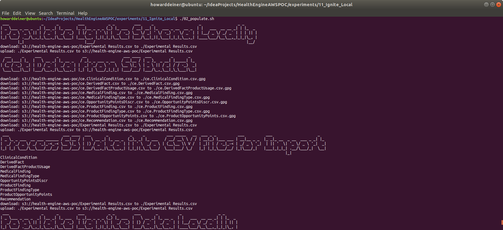
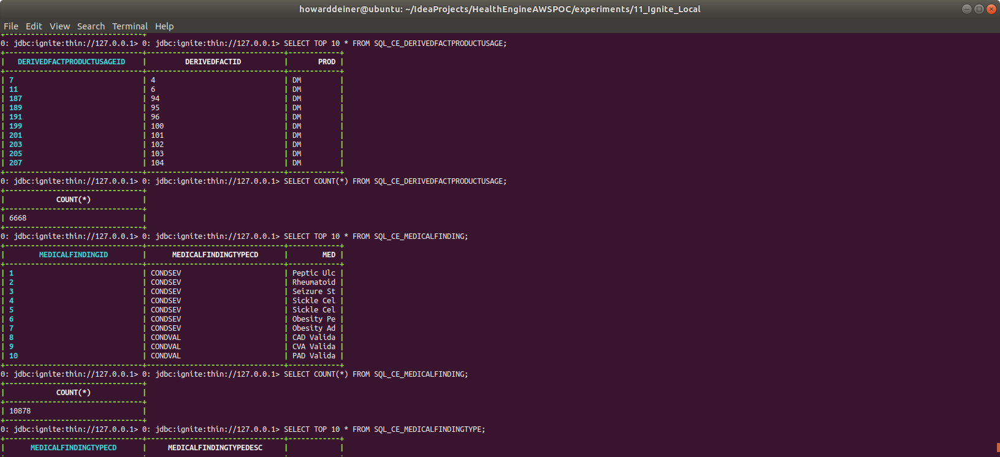

### Starting out with Apache Ignite

##### Concept

> Apache Ignite is an open-source distributed database (without rolling upgrade), caching and processing platform designed to store and compute on large volumes of data across a cluster of nodes.
>
> Ignite was open-sourced by GridGain Systems in late 2014 and accepted in the Apache Incubator program that same year. The Ignite project graduated on September 18, 2015.
>
> Apache Ignite's database utilizes RAM as the default storage and processing tier, thus, belonging to the class of in-memory computing platforms. The disk tier is optional but, once enabled, will hold the full data set whereas the memory tier will cache full or partial data set depending on its capacity.
>
> Regardless of the API used, data in Ignite is stored in the form of key-value pairs. The database component scales horizontally, distributing key-value pairs across the cluster in such a way that every node owns a portion of the overall data set. Data is rebalanced automatically whenever a node is added to or removed from the cluster.
>
> On top of its distributed foundation, Apache Ignite supports a variety of APIs including JCache-compliant key-value APIs, ANSI-99 SQL with joins, ACID transactions, as well as MapReduce like computations.
>
> Apache Ignite cluster can be deployed on-premise on a commodity hardware, in the cloud (e.g. Microsoft Azure, AWS, Google Compute Engine) or in a containerized and provisioning environments such as Kubernetes, Docker, Apache Mesos, VMWare. 
>
> https://en.wikipedia.org/wiki/Apache_Ignite
>
> https://www.gridgain.com

#### Execution

We want to get into Ignite quickly.  So, before we start running AWS instances, we need to master our data and how we're going to instantiate it in the database.

This whole project is about rearchitecting the database behind CareEngine, and we will try several different databases to do that.

### 01_startup.sh
This script uses docker-compose to take the latest Dockerhub Ignite image and bring it up in a container running as a daemon.  Since Postgres wants to persist data, I use a Docker Volume, which I delete in 03_shutdown.sh

Since we do not want to make use of the database until it actually starts, I monitor the logs from the postgres_container until I see a signature which tells me that the database has started.
```bash
#!/usr/bin/env bash

figlet -w 160 -f small "Startup Ignite Locally"
docker volume rm 11_ignite_local_ignite_data
docker-compose -f docker-compose.yml up -d

figlet -w 160 -f small "Wait For Ignite To Start"
while true ; do
  docker logs ignite_container > stdout.txt 2> stderr.txt
  result=$(grep -cE "Ignite node started OK" stdout.txt)
  if [ $result != 0 ] ; then
    echo "Ignite has started"
    break
  fi
  sleep 5
done
rm stdout.txt stderr.txt
```
### 02_populate.sh
This script first uses the running ignite_container and runs sqlline.sh in the container to create our database directly from the ddl and csv data.

The script then uses sqlline.sh to demonstrate that the testdatabase has the tables we created and populated.
```bash
#!/usr/bin/env bash
!
figlet -w 160 -f small "Populate Ignite Schema Locally"
docker cp ../../src/db/changeset.ignite.sql ignite_container:/tmp/ddl.sql
docker exec ignite_container bash -c "./apache-ignite/bin/sqlline.sh -u jdbc:ignite:thin://127.0.0.1 -f /tmp/ddl.sql"

figlet -w 160 -f small "Get Data from S3 Bucket"
../../data/transfer_from_s3_and_decrypt.sh ce.Clinical_Condition.csv
../../data/transfer_from_s3_and_decrypt.sh ce.DerivedFact.csv
../../data/transfer_from_s3_and_decrypt.sh ce.DerivedFactProductUsage.csv
../../data/transfer_from_s3_and_decrypt.sh ce.MedicalFinding.csv
../../data/transfer_from_s3_and_decrypt.sh ce.MedicalFindingType.csv
../../data/transfer_from_s3_and_decrypt.sh ce.OpportunityPointsDiscr.csv
../../data/transfer_from_s3_and_decrypt.sh ce.ProductFinding.csv
../../data/transfer_from_s3_and_decrypt.sh ce.ProductFindingType.csv
../../data/transfer_from_s3_and_decrypt.sh ce.ProductOpportunityPoints.csv
../../data/transfer_from_s3_and_decrypt.sh ce.Recommendation.csv

figlet -w 160 -f small "Populate Ignite Data Locally"

echo "Clinical_Condition"
# convert comas to semi-colons
sed --in-place --regexp-extended 's/,/;/g' ce.Clinical_Condition.csv
# convert bars to commas
sed --in-place 's/|/,/g' ce.Clinical_Condition.csv
# get rid of timestamps
sed --in-place --regexp-extended 's/ [0-9]+[0-9]+\:[0-9]+[0-9]+\:[0-9]+//g' ce.Clinical_Condition.csv
# get rid of ^M (return characters)
# remove blanks at start of line
sed --in-place --regexp-extended 's/^ *//g' ce.Clinical_Condition.csv
# remove blanks before commas
sed --in-place --regexp-extended 's/[ ]+,/,/g' ce.Clinical_Condition.csv
# remove blanks after commas
sed --in-place --regexp-extended 's/,[ ]+/,/g' ce.Clinical_Condition.csv
# remove blanks at end of line
sed --in-place --regexp-extended 's/ *$//g' ce.Clinical_Condition.csv
tr -d $'\r' < ce.Clinical_Condition.csv > ce.Clinical_Condition.csv.mod
docker cp ce.Clinical_Condition.csv.mod ignite_container:/tmp/ce.Clinical_Condition.csv
docker exec ignite_container bash -c "echo 'COPY FROM '\'/tmp/ce.Clinical_Condition.csv\'' INTO SQL_CE_CLINICAL_CONDITION(CLINICAL_CONDITION_COD,CLINICAL_CONDITION_NAM,INSERTED_BY,REC_INSERT_DATE,REC_UPD_DATE,UPDATED_BY,CLINICALCONDITIONCLASSCD,CLINICALCONDITIONTYPECD,CLINICALCONDITIONABBREV) FORMAT CSV;' | ./apache-ignite/bin/sqlline.sh -u jdbc:ignite:thin://127.0.0.1"

echo "DerivedFact"
# convert comas to semi-colons
sed --in-place --regexp-extended 's/,/;/g' ce.DerivedFact.csv
# convert bars to commas
sed --in-place 's/|/,/g' ce.DerivedFact.csv
# get rid of timestamps and decimals after timestamp
sed --in-place --regexp-extended 's/ [0-9]+[0-9]+\:[0-9]+[0-9]+\:[0-9]+\.[0-9]+//g' ce.DerivedFact.csv
# remove blanks at start of line
sed --in-place --regexp-extended 's/^ *//g' ce.DerivedFact.csv
# remove blanks before commas
sed --in-place --regexp-extended 's/[ ]+,/,/g' ce.DerivedFact.csv
# remove blanks after commas
sed --in-place --regexp-extended 's/,[ ]+/,/g' ce.DerivedFact.csv
# remove blanks at end of line
sed --in-place --regexp-extended 's/ *$//g' ce.DerivedFact.csv
# get rid of ^M (return characters)
tr -d $'\r' < ce.DerivedFact.csv > ce.DerivedFact.csv.mod
docker cp ce.DerivedFact.csv.mod ignite_container:/tmp/ce.DerivedFact.csv
docker exec ignite_container bash -c "echo 'COPY FROM '\'/tmp/ce.DerivedFact.csv\'' INTO SQL_CE_DERIVEDFACT(DERIVEDFACTID,DERIVEDFACTTRACKINGID,DERIVEDFACTTYPEID,INSERTEDBY,RECORDINSERTDT,RECORDUPDTDT,UPDTDBY) FORMAT CSV;' | ./apache-ignite/bin/sqlline.sh -u jdbc:ignite:thin://127.0.0.1"

echo "DerivedFactProductUsage"
# convert comas to semi-colons
sed --in-place --regexp-extended 's/,/;/g' ce.DerivedFactProductUsage.csv
# convert bars to commas
sed --in-place 's/|/,/g' ce.DerivedFactProductUsage.csv
# get rid of timestamps and decimals after timestamp
sed --in-place --regexp-extended 's/ [0-9]+[0-9]+\:[0-9]+[0-9]+\:[0-9]+\.[0-9]+//g' ce.DerivedFactProductUsage.csv
# remove blanks at start of line
sed --in-place --regexp-extended 's/^ *//g' ce.DerivedFactProductUsage.csv
# remove blanks before commas
sed --in-place --regexp-extended 's/[ ]+,/,/g' ce.DerivedFactProductUsage.csv
# remove blanks after commas
sed --in-place --regexp-extended 's/,[ ]+/,/g' ce.DerivedFactProductUsage.csv
# remove blanks at end of line
sed --in-place --regexp-extended 's/ *$//g' ce.DerivedFactProductUsage.csv
# get rid of ^M (return characters)
tr -d $'\r' < ce.DerivedFactProductUsage.csv > ce.DerivedFactProductUsage.csv.mod
docker cp ce.DerivedFactProductUsage.csv.mod ignite_container:/tmp/ce.DerivedFactProductUsage.csv
docker exec ignite_container bash -c "echo 'COPY FROM '\'/tmp/ce.DerivedFactProductUsage.csv\'' INTO SQL_CE_DERIVEDFACTPRODUCTUSAGE(DERIVEDFACTPRODUCTUSAGEID,DERIVEDFACTID,PRODUCTMNEMONICCD,INSERTEDBY,RECORDINSERTDT,RECORDUPDTDT,UPDTDBY) FORMAT CSV;' | ./apache-ignite/bin/sqlline.sh -u jdbc:ignite:thin://127.0.0.1"

echo "MedicalFinding"
# convert comas to semi-colons
sed --in-place --regexp-extended 's/,/;/g' ce.MedicalFinding.csv
# convert bars to commas
sed --in-place 's/|/,/g' ce.MedicalFinding.csv
# get rid of timestamps and decimals after timestamp
sed --in-place --regexp-extended 's/ [0-9]+[0-9]+\:[0-9]+[0-9]+\:[0-9]+\.[0-9]+//g' ce.MedicalFinding.csv
# remove blanks at start of line
sed --in-place --regexp-extended 's/^ *//g' ce.MedicalFinding.csv
# remove blanks before commas
sed --in-place --regexp-extended 's/[ ]+,/,/g' ce.MedicalFinding.csv
# remove blanks after commas
sed --in-place --regexp-extended 's/,[ ]+/,/g' ce.MedicalFinding.csv
# remove blanks at end of line
sed --in-place --regexp-extended 's/ *$//g' ce.MedicalFinding.csv
# get rid of ^M (return characters)
tr -d $'\r' < ce.MedicalFinding.csv > ce.MedicalFinding.csv.mod
docker cp ce.MedicalFinding.csv.mod ignite_container:/tmp/ce.MedicalFinding.csv
docker exec ignite_container bash -c "echo 'COPY FROM '\'/tmp/ce.MedicalFinding.csv\'' INTO SQL_CE_MEDICALFINDING(MEDICALFINDINGID,MEDICALFINDINGTYPECD,MEDICALFINDINGNM,SEVERITYLEVELCD,IMPACTABLEFLG,CLINICAL_CONDITION_COD,INSERTEDBY,RECORDINSERTDT,RECORDUPDTDT,UPDTDBY,ACTIVEFLG,OPPORTUNITYPOINTSDISCRCD) FORMAT CSV;' | ./apache-ignite/bin/sqlline.sh -u jdbc:ignite:thin://127.0.0.1"

echo "MedicalFindingType"
# convert comas to semi-colons
sed --in-place --regexp-extended 's/,/;/g' ce.MedicalFindingType.csv
# convert bars to commas
sed --in-place 's/|/,/g' ce.MedicalFindingType.csv
# get rid of timestamps and decimals after timestamp
sed --in-place --regexp-extended 's/ [0-9]+[0-9]+\:[0-9]+[0-9]+\:[0-9]+\.[0-9]+//g' ce.MedicalFindingType.csv
# remove blanks at start of line
sed --in-place --regexp-extended 's/^ *//g' ce.MedicalFindingType.csv
# remove blanks before commas
sed --in-place --regexp-extended 's/[ ]+,/,/g' ce.MedicalFindingType.csv
# remove blanks after commas
sed --in-place --regexp-extended 's/,[ ]+/,/g' ce.MedicalFindingType.csv
# remove blanks at end of line
sed --in-place --regexp-extended 's/ *$//g' ce.MedicalFindingType.csv
# get rid of ^M (return characters)
tr -d $'\r' < ce.MedicalFindingType.csv > ce.MedicalFindingType.csv.mod
docker cp ce.MedicalFindingType.csv.mod ignite_container:/tmp/ce.MedicalFindingType.csv
docker exec ignite_container bash -c "echo 'COPY FROM '\'/tmp/ce.MedicalFindingType.csv\'' INTO SQL_CE_MEDICALFINDINGTYPE(MEDICALFINDINGTYPECD,MEDICALFINDINGTYPEDESC,INSERTEDBY,RECORDINSERTDT,RECORDUPDTDT,UPDTDBY,HEALTHSTATEAPPLICABLEFLAG) FORMAT CSV;' | ./apache-ignite/bin/sqlline.sh -u jdbc:ignite:thin://127.0.0.1"

echo "OpportunityPointsDiscr"
# convert comas to semi-colons
sed --in-place --regexp-extended 's/,/;/g' ce.OpportunityPointsDiscr.csv
# convert bars to commas
sed --in-place 's/|/,/g' ce.OpportunityPointsDiscr.csv
# get rid of timestamps and decimals after timestamp
sed --in-place --regexp-extended 's/ [0-9]+[0-9]+\:[0-9]+[0-9]+\:[0-9]+\.[0-9]+//g' ce.OpportunityPointsDiscr.csv
# remove blanks at start of line
sed --in-place --regexp-extended 's/^ *//g' ce.OpportunityPointsDiscr.csv
# remove blanks before commas
sed --in-place --regexp-extended 's/[ ]+,/,/g' ce.OpportunityPointsDiscr.csv
# remove blanks after commas
sed --in-place --regexp-extended 's/,[ ]+/,/g' ce.OpportunityPointsDiscr.csv
# remove blanks at end of line
sed --in-place --regexp-extended 's/ *$//g' ce.OpportunityPointsDiscr.csv
# get rid of ^M (return characters)
tr -d $'\r' < ce.OpportunityPointsDiscr.csv > ce.OpportunityPointsDiscr.csv.mod
docker cp ce.OpportunityPointsDiscr.csv.mod ignite_container:/tmp/ce.OpportunityPointsDiscr.csv
docker exec ignite_container bash -c "echo 'COPY FROM '\'/tmp/ce.OpportunityPointsDiscr.csv\'' INTO SQL_CE_OPPORTUNITYPOINTSDISCR(OPPORTUNITYPOINTSDISCRCD,OPPORTUNITYPOINTSDISCNM,INSERTEDBY,RECORDINSERTDT,RECORDUPDTDT,UPDTDBY) FORMAT CSV;' | ./apache-ignite/bin/sqlline.sh -u jdbc:ignite:thin://127.0.0.1"

echo "ProductFinding"
# convert comas to semi-colons
sed --in-place --regexp-extended 's/,/;/g' ce.ProductFinding.csv
# convert bars to commas
sed --in-place 's/|/,/g' ce.ProductFinding.csv
# get rid of timestamps and decimals after timestamp
sed --in-place --regexp-extended 's/ [0-9]+[0-9]+\:[0-9]+[0-9]+\:[0-9]+\.[0-9]+//g' ce.ProductFinding.csv
# remove blanks at start of line
sed --in-place --regexp-extended 's/^ *//g' ce.ProductFinding.csv
# remove blanks before commas
sed --in-place --regexp-extended 's/[ ]+,/,/g' ce.ProductFinding.csv
# remove blanks after commas
sed --in-place --regexp-extended 's/,[ ]+/,/g' ce.ProductFinding.csv
# remove blanks at end of line
sed --in-place --regexp-extended 's/ *$//g' ce.ProductFinding.csv
# get rid of ^M (return characters)
tr -d $'\r' < ce.ProductFinding.csv > ce.ProductFinding.csv.mod
docker cp ce.ProductFinding.csv.mod ignite_container:/tmp/ce.ProductFinding.csv
docker exec ignite_container bash -c "echo 'COPY FROM '\'/tmp/ce.ProductFinding.csv\'' INTO SQL_CE_PRODUCTFINDING(PRODUCTFINDINGID,PRODUCTFINDINGNM,SEVERITYLEVELCD,PRODUCTFINDINGTYPECD,PRODUCTMNEMONICCD,SUBPRODUCTMNEMONICCD,INSERTEDBY,RECORDINSERTDT,RECORDUPDTDT,UPDTDBY) FORMAT CSV;' | ./apache-ignite/bin/sqlline.sh -u jdbc:ignite:thin://127.0.0.1"

echo "ProductFindingType"
# convert comas to semi-colons
sed --in-place --regexp-extended 's/,/;/g' ce.ProductFindingType.csv
# convert bars to commas
sed --in-place 's/|/,/g' ce.ProductFindingType.csv
# get rid of timestamps and decimals after timestamp
sed --in-place --regexp-extended 's/ [0-9]+[0-9]+\:[0-9]+[0-9]+\:[0-9]+\.[0-9]+//g' ce.ProductFindingType.csv
# remove blanks at start of line
sed --in-place --regexp-extended 's/^ *//g' ce.ProductFindingType.csv
# remove blanks before commas
sed --in-place --regexp-extended 's/[ ]+,/,/g' ce.ProductFindingType.csv
# remove blanks after commas
sed --in-place --regexp-extended 's/,[ ]+/,/g' ce.ProductFindingType.csv
# remove blanks at end of line
sed --in-place --regexp-extended 's/ *$//g' ce.ProductFindingType.csv
# get rid of ^M (return characters)
tr -d $'\r' < ce.ProductFindingType.csv > ce.ProductFindingType.csv.mod
docker cp ce.ProductFindingType.csv.mod ignite_container:/tmp/ce.ProductFindingType.csv
docker exec ignite_container bash -c "echo 'COPY FROM '\'/tmp/ce.ProductFindingType.csv\'' INTO SQL_CE_PRODUCTFINDINGTYPE(PRODUCTFINDINGTYPECD,PRODUCTFINDINGTYPEDESC,INSERTEDBY,RECORDINSERTDT,RECORDUPDTDT,UPDTDBY) FORMAT CSV;' | ./apache-ignite/bin/sqlline.sh -u jdbc:ignite:thin://127.0.0.1"

echo "ProductOpportunityPoints"
# convert comas to semi-colons
sed --in-place --regexp-extended 's/,/;/g' ce.ProductOpportunityPoints.csv
# convert bars to commas
sed --in-place 's/|/,/g' ce.ProductOpportunityPoints.csv
# get rid of timestamps and decimals after timestamp
sed --in-place --regexp-extended 's/ [0-9]+[0-9]+\:[0-9]+[0-9]+\:[0-9]+\.[0-9]+//g' ce.ProductOpportunityPoints.csv
# remove blanks at start of line
sed --in-place --regexp-extended 's/^ *//g' ce.ProductOpportunityPoints.csv
# remove blanks before commas
sed --in-place --regexp-extended 's/[ ]+,/,/g' ce.ProductOpportunityPoints.csv
# remove blanks after commas
sed --in-place --regexp-extended 's/,[ ]+/,/g' ce.ProductOpportunityPoints.csv
# remove blanks at end of line
sed --in-place --regexp-extended 's/ *$//g' ce.ProductOpportunityPoints.csv
# get rid of ^M (return characters)
tr -d $'\r' < ce.ProductOpportunityPoints.csv > ce.ProductOpportunityPoints.csv.mod
docker cp ce.ProductOpportunityPoints.csv.mod ignite_container:/tmp/ce.ProductOpportunityPoints.csv
docker exec ignite_container bash -c "echo 'COPY FROM '\'/tmp/ce.ProductOpportunityPoints.csv\'' INTO SQL_CE_PRODUCTOPPORTUNITYPOINTS(OPPORTUNITYPOINTSDISCCD,EFFECTIVESTARTDT,OPPORTUNITYPOINTSNBR,EFFECTIVEENDDT,DERIVEDFACTPRODUCTUSAGEID,INSERTEDBY,RECORDINSERTDT,RECORDUPDTDT,UPDTDBY) FORMAT CSV;' | ./apache-ignite/bin/sqlline.sh -u jdbc:ignite:thin://127.0.0.1"

echo "Recommendation"
# get rid of ^M (return characters)
tr -d $'\r' < ce.Recommendation.csv > ce.Recommendation.csv.mod
# Merge every other line in ce.Recommendation together with a comma between them
paste - - - -d'|' < ce.Recommendation.csv.mod > ce.Recommendation.csv
# convert comas to semi-colons
sed --in-place --regexp-extended 's/,/;/g' ce.Recommendation.csv
# convert bars to commas
sed --in-place 's/|/,/g' ce.Recommendation.csv
# get rid of timestamps and decimals after timestamp
sed --in-place --regexp-extended 's/ [0-9]+[0-9]+\:[0-9]+[0-9]+\:[0-9]+\.[0-9]+//g' ce.Recommendation.csv
# remove blanks at start of line
sed --in-place --regexp-extended 's/^ *//g' ce.Recommendation.csv
# remove blanks before commas
sed --in-place --regexp-extended 's/[ ]+,/,/g' ce.Recommendation.csv
# remove blanks after commas
sed --in-place --regexp-extended 's/,[ ]+/,/g' ce.Recommendation.csv
# remove blanks at end of line
sed --in-place --regexp-extended 's/ *$//g' ce.Recommendation.csv
docker cp ce.Recommendation.csv ignite_container:/tmp/ce.Recommendation.csv
docker exec ignite_container bash -c "echo 'COPY FROM '\'/tmp/ce.Recommendation.csv\'' INTO SQL_CE_RECOMMENDATION(RECOMMENDATIONSKEY,RECOMMENDATIONID,RECOMMENDATIONCODE,RECOMMENDATIONDESC,RECOMMENDATIONTYPE,CCTYPE,CLINICALREVIEWTYPE,AGERANGEID,ACTIONCODE,THERAPEUTICCLASS,MDCCODE,MCCCODE,PRIVACYCATEGORY,INTERVENTION,RECOMMENDATIONFAMILYID,RECOMMENDPRECE_ENCE_ROUPID,INBOUNDCOMMUNICATIONROUTE,SEVERITY,PRIMARYDIAGNOSIS,SECONDARYDIAGNOSIS,ADVERSEEVENT,ICMCONDITIONID,WELLNESSFLAG,VBFELIGIBLEFLAG,COMMUNICATIONRANKING,PRECE_ENCE_ANKING,PATIENTDERIVEDFLAG,LABREQUIREDFLAG,UTILIZATIONTEXTAVAILABLEF,SENSITIVEMESSAGEFLAG,HIGHIMPACTFLAG,ICMLETTERFLAG,REQCLINICIANCLOSINGFLAG,OPSIMPELMENTATIONPHASE,SEASONALFLAG,SEASONALSTARTDT,SEASONALENDDT,EFFECTIVESTARTDT,EFFECTIVEENDDT,RECORDINSERTDT,RECORDUPDTDT,INSERTEDBY,UPDTDBY,STANDARDRUNFLAG,INTERVENTIONFEEDBACKFAMILYID,CONDITIONFEEDBACKFAMILYID,ASHWELLNESSELIGIBILITYFLAG,HEALTHADVOCACYELIGIBILITYFLAG) FORMAT CSV;' | ./apache-ignite/bin/sqlline.sh -u jdbc:ignite:thin://127.0.0.1"

figlet -w 160 -f small "Check Ignite Data Locally"
docker exec ignite_container bash -c "echo 'SELECT TOP 10 * FROM SQL_CE_CLINICAL_CONDITION;' | ./apache-ignite/bin/sqlline.sh --color=true -u jdbc:ignite:thin://127.0.0.1"
docker exec ignite_container bash -c "echo 'SELECT COUNT(*) FROM SQL_CE_CLINICAL_CONDITION;' | ./apache-ignite/bin/sqlline.sh --color=true -u jdbc:ignite:thin://127.0.0.1"
docker exec ignite_container bash -c "echo 'SELECT TOP 10 * FROM SQL_CE_DERIVEDFACT;' | ./apache-ignite/bin/sqlline.sh --color=true -u jdbc:ignite:thin://127.0.0.1"
docker exec ignite_container bash -c "echo 'SELECT COUNT(*) FROM SQL_CE_DERIVEDFACT;' | ./apache-ignite/bin/sqlline.sh --color=true -u jdbc:ignite:thin://127.0.0.1"
docker exec ignite_container bash -c "echo 'SELECT TOP 10 * FROM SQL_CE_DERIVEDFACTPRODUCTUSAGE;' | ./apache-ignite/bin/sqlline.sh --color=true -u jdbc:ignite:thin://127.0.0.1"
docker exec ignite_container bash -c "echo 'SELECT COUNT(*) FROM SQL_CE_DERIVEDFACTPRODUCTUSAGE;' | ./apache-ignite/bin/sqlline.sh --color=true -u jdbc:ignite:thin://127.0.0.1"
docker exec ignite_container bash -c "echo 'SELECT TOP 10 * FROM SQL_CE_MEDICALFINDING;' | ./apache-ignite/bin/sqlline.sh --color=true -u jdbc:ignite:thin://127.0.0.1"
docker exec ignite_container bash -c "echo 'SELECT COUNT(*) FROM SQL_CE_MEDICALFINDING;' | ./apache-ignite/bin/sqlline.sh --color=true -u jdbc:ignite:thin://127.0.0.1"
docker exec ignite_container bash -c "echo 'SELECT TOP 10 * FROM SQL_CE_MEDICALFINDINGTYPE;' | ./apache-ignite/bin/sqlline.sh --color=true -u jdbc:ignite:thin://127.0.0.1"
docker exec ignite_container bash -c "echo 'SELECT COUNT(*) FROM SQL_CE_MEDICALFINDINGTYPE;' | ./apache-ignite/bin/sqlline.sh --color=true -u jdbc:ignite:thin://127.0.0.1"
docker exec ignite_container bash -c "echo 'SELECT TOP 10 * FROM SQL_CE_OPPORTUNITYPOINTSDISCR;' | ./apache-ignite/bin/sqlline.sh --color=true -u jdbc:ignite:thin://127.0.0.1"
docker exec ignite_container bash -c "echo 'SELECT COUNT(*) FROM SQL_CE_OPPORTUNITYPOINTSDISCR;' | ./apache-ignite/bin/sqlline.sh --color=true -u jdbc:ignite:thin://127.0.0.1"
docker exec ignite_container bash -c "echo 'SELECT TOP 10 * FROM SQL_CE_PRODUCTFINDING;' | ./apache-ignite/bin/sqlline.sh --color=true -u jdbc:ignite:thin://127.0.0.1"
docker exec ignite_container bash -c "echo 'SELECT COUNT(*) FROM SQL_CE_PRODUCTFINDING;' | ./apache-ignite/bin/sqlline.sh --color=true -u jdbc:ignite:thin://127.0.0.1"
docker exec ignite_container bash -c "echo 'SELECT TOP 10 * FROM SQL_CE_PRODUCTFINDINGTYPE;' | ./apache-ignite/bin/sqlline.sh --color=true -u jdbc:ignite:thin://127.0.0.1"
docker exec ignite_container bash -c "echo 'SELECT COUNT(*) FROM SQL_CE_PRODUCTFINDINGTYPE;' | ./apache-ignite/bin/sqlline.sh --color=true -u jdbc:ignite:thin://127.0.0.1"
docker exec ignite_container bash -c "echo 'SELECT TOP 10 * FROM SQL_CE_PRODUCTOPPORTUNITYPOINTS;' | ./apache-ignite/bin/sqlline.sh --color=true -u jdbc:ignite:thin://127.0.0.1"
docker exec ignite_container bash -c "echo 'SELECT COUNT(*) FROM SQL_CE_PRODUCTOPPORTUNITYPOINTS;' | ./apache-ignite/bin/sqlline.sh --color=true -u jdbc:ignite:thin://127.0.0.1"
docker exec ignite_container bash -c "echo 'SELECT TOP 10 * FROM SQL_CE_RECOMMENDATION;' | ./apache-ignite/bin/sqlline.sh --color=true -u jdbc:ignite:thin://127.0.0.1"
docker exec ignite_container bash -c "echo 'SELECT COUNT(*) FROM SQL_CE_RECOMMENDATION;' | ./apache-ignite/bin/sqlline.sh --color=true -u jdbc:ignite:thin://127.0.0.1"

rm *.csv *.mod
```

### 03_shutdown.sh
This script is brutely simple.  It uses docker-compose to bring down the environment it established, and then uses docker volume rm to delete the data which held the bits for out database data.

```bash
#!/usr/bin/env bash

figlet -w 160 -f small "Shutdown Ignite Locally"
docker-compose -f docker-compose.yml down
docker volume rm 11_ignite_local_ignite_data
```

### Putting it all together...

It all looks something like this:

\
<BR />
\
\
\
\
\
\
\
\
\
\
\
\
\
<BR />
\
<BR />
