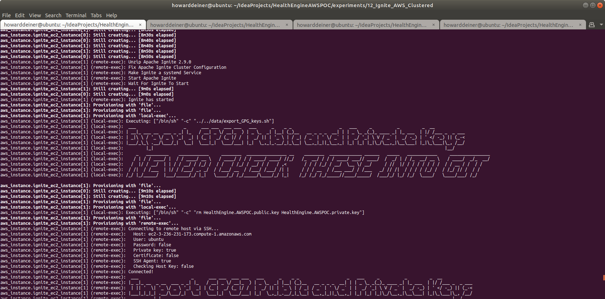
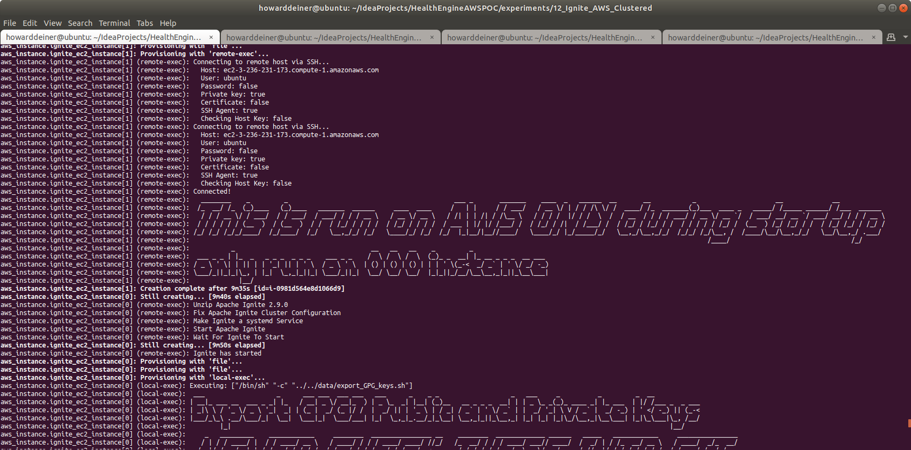
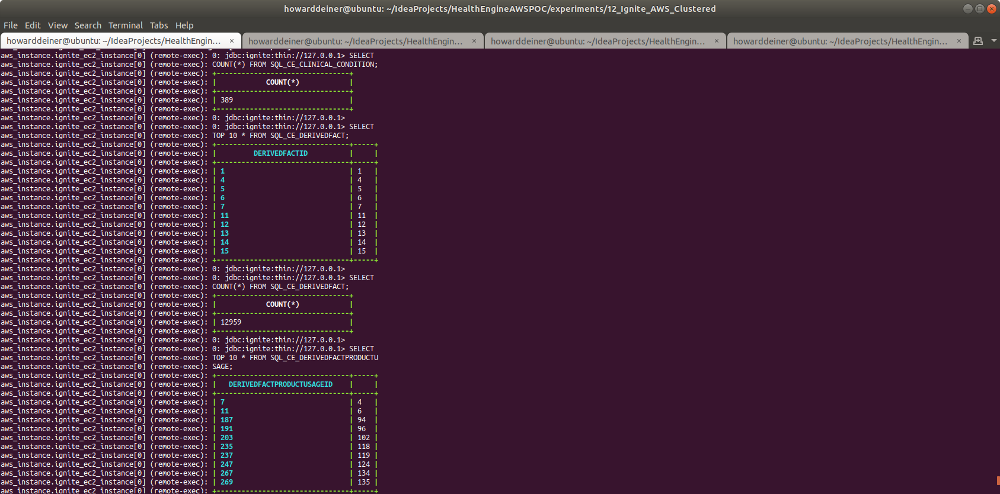
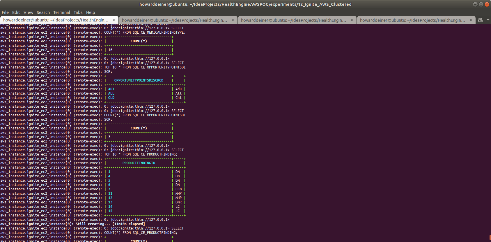

### Starting out with AWS Apache Ignite

##### Concept

> Apache Ignite is an open-source distributed database (without rolling upgrade), caching and processing platform designed to store and compute on large volumes of data across a cluster of nodes.
>
> Ignite was open-sourced by GridGain Systems in late 2014 and accepted in the Apache Incubator program that same year. The Ignite project graduated on September 18, 2015.
>
> Apache Ignite's database utilizes RAM as the default storage and processing tier, thus, belonging to the class of in-memory computing platforms. The disk tier is optional but, once enabled, will hold the full data set whereas the memory tier will cache full or partial data set depending on its capacity.
>
> Regardless of the API used, data in Ignite is stored in the form of key-value pairs. The database component scales horizontally, distributing key-value pairs across the cluster in such a way that every node owns a portion of the overall data set. Data is rebalanced automatically whenever a node is added to or removed from the cluster.
>
> On top of its distributed foundation, Apache Ignite supports a variety of APIs including JCache-compliant key-value APIs, ANSI-99 SQL with joins, ACID transactions, as well as MapReduce like computations.
>
> Apache Ignite cluster can be deployed on-premise on a commodity hardware, in the cloud (e.g. Microsoft Azure, AWS, Google Compute Engine) or in a containerized and provisioning environments such as Kubernetes, Docker, Apache Mesos, VMWare. 
>
> https://en.wikipedia.org/wiki/Apache_Ignite
>
> https://www.gridgain.com

#### Execution

### 01_startup.sh
This script uses simple Terraform and applies it.   
```bash
#!/usr/bin/env bash

figlet -w 200 -f small "Startup Ignite AWS Cluster"
terraform init
terraform apply -auto-approve
```
The terraform.aws_instance.tf is the most interesting of the terraform scripts because it does does all of the heavy lifting through provisiong.

The reason for doing the provisioning of the actual database and loading sample data is that I don't want to install local clients on the invoking machine.
```hcl-terraform
resource "aws_instance" "ignite_ec2_instance" {
  ami = "ami-0ac80df6eff0e70b5"  #  Ubuntu 18.04 LTS - Bionic - hvm:ebs-ssde  https://cloud-images.ubuntu.com/locator/ec2/
  instance_type = "m5.large"   # $0.096/hour ; 2 vCPU  ; 10 ECU  ; 8 GiB memory   ; EBS disk              ; EBS Optimized by default
#  instance_type = "m5d.metal" # $5.424/hour ; 96 vCPU ; 345 ECU ; 384 GiB memory ; 4 x 900 NVMe SSD disk ; EBS Optimized by default ; max bandwidth 19,000 Mbps ; max throughput 2,375 MB/s ; Max IOPS 80,000
  key_name = aws_key_pair.ignite_key_pair.key_name
  ebs_optimized = true
  security_groups = [aws_security_group.ignite.name]
  root_block_device {
    volume_type           = "io1"
    volume_size           = 30 # GB
    iops                  = 500
    delete_on_termination = true
  }
  count = 2
  tags = {
    Name = "Ignite Instance ${format("%03d", count.index)}"
  }
  #  provisioner "local-exec" {
  #    command = "aws ec2 wait instance-status-ok --region ${regex("[a-z]+[^a-z][a-z]+[^a-z][0-9]+",self.availability_zone)} --instance-ids ${aws_instance.ignite_ec2_instance[count.index].id}"
  #  }
  provisioner "local-exec" {
    command = "sleep 5m"
  }
  provisioner "remote-exec" {
    connection {
      type = "ssh"
      user = "ubuntu"
      host = self.public_dns
      private_key = file("~/.ssh/id_rsa")
    }
    inline = [
      "mkdir -p /home/ubuntu/.aws",
    ]
  }
  provisioner "file" {
    connection {
      type = "ssh"
      user = "ubuntu"
      host = self.public_dns
      private_key = file("~/.ssh/id_rsa")
    }
    source = "~/.aws/config"
    destination = "/home/ubuntu/.aws/config"
  }
  provisioner "file" {
    connection {
      type = "ssh"
      user = "ubuntu"
      host = self.public_dns
      private_key = file("~/.ssh/id_rsa")
    }
    source = "~/.aws/credentials"
    destination = "/home/ubuntu/.aws/credentials"
  }
  provisioner "file" {
    connection {
      type = "ssh"
      user = "ubuntu"
      host = self.public_dns
      private_key = file("~/.ssh/id_rsa")
    }
    source      = "provision.ignite.cluster-config.xml"
    destination = "provision.ignite.cluster-config.xml"
  }
  provisioner "file" {
    connection {
      type = "ssh"
      user = "ubuntu"
      host = self.public_dns
      private_key = file("~/.ssh/id_rsa")
    }
    source      = "provision.ignite.fix-cluster-config.sh"
    destination = "provision.ignite.fix-cluster-config.sh"
  }
  provisioner "remote-exec" {
    connection {
      type = "ssh"
      user = "ubuntu"
      host = self.public_dns
      private_key = file("~/.ssh/id_rsa")
    }
    inline = ["chmod +x provision.ignite.fix-cluster-config.sh"]
  }
  provisioner "file" {
    connection {
      type = "ssh"
      user = "ubuntu"
      host = self.public_dns
      private_key = file("~/.ssh/id_rsa")
    }
    source      = "provision.ignite.sh"
    destination = "/tmp/provision.ignite.sh"
  }
  provisioner "remote-exec" {
    connection {
      type = "ssh"
      user = "ubuntu"
      host = self.public_dns
      private_key = file("~/.ssh/id_rsa")
    }
    inline = ["chmod +x /tmp/provision.ignite.sh", "/tmp/provision.ignite.sh"]
  }
  provisioner "file" {
    connection {
      type = "ssh"
      user = "ubuntu"
      host = self.public_dns
      private_key = file("~/.ssh/id_rsa")
    }
    source      = "../../src/db/changeset.ignite.sql"
    destination = "/tmp/ddl.sql"
  }
  provisioner "file" {
    connection {
      type = "ssh"
      user = "ubuntu"
      host = self.public_dns
      private_key = file("~/.ssh/id_rsa")
    }
    source      = "../../data/import_GPG_keys.sh"
    destination = "/tmp/import_GPG_keys.sh"
  }
  provisioner "local-exec" {
    command = "../../data/export_GPG_keys.sh"
  }
  provisioner "file" {
    connection {
      type = "ssh"
      user = "ubuntu"
      host = self.public_dns
      private_key = file("~/.ssh/id_rsa")
    }
    source      = "HealthEngine.AWSPOC.public.key"
    destination = "/tmp/HealthEngine.AWSPOC.public.key"
  }
  provisioner "file" {
    connection {
      type = "ssh"
      user = "ubuntu"
      host = self.public_dns
      private_key = file("~/.ssh/id_rsa")
    }
    source      = "HealthEngine.AWSPOC.private.key"
    destination = "/tmp/HealthEngine.AWSPOC.private.key"
  }
  provisioner "local-exec" {
    command = "rm HealthEngine.AWSPOC.public.key HealthEngine.AWSPOC.private.key"
  }
  provisioner "file" {
    connection {
      type = "ssh"
      user = "ubuntu"
      host = self.public_dns
      private_key = file("~/.ssh/id_rsa")
    }
    source      = "../../data/transfer_from_s3_and_decrypt.sh"
    destination = "/tmp/transfer_from_s3_and_decrypt.sh"
  }
  provisioner "remote-exec" {
    connection {
      type = "ssh"
      user = "ubuntu"
      host = self.public_dns
      private_key = file("~/.ssh/id_rsa")
    }
    inline = ["chmod +x /tmp/import_GPG_keys.sh", "/tmp/import_GPG_keys.sh /tmp/HealthEngine.AWSPOC.public.key /tmp/HealthEngine.AWSPOC.private.key", "chmod +x /tmp/transfer_from_s3_and_decrypt.sh","rm /tmp/import_GPG_keys.sh /tmp/*.key"]
  }
  provisioner "file" {
    connection {
      type = "ssh"
      user = "ubuntu"
      host = self.public_dns
      private_key = file("~/.ssh/id_rsa")
    }
    source      = "02_populate.sh"
    destination = "/tmp/02_populate.sh"
  }
  provisioner "remote-exec" {
    connection {
      type = "ssh"
      user = "ubuntu"
      host = self.public_dns
      private_key = file("~/.ssh/id_rsa")
    }
    inline = ["chmod +x /tmp/02_populate.sh", "/tmp/02_populate.sh"]
  }
}
```
The script that is run on the EC2 instance (provision.ignite.sh) does the provisioning of the database itself.  There is some rather nasty stuff to do, such as build a config for Ignite that collects the private IP addresses for the EC2 instances that comprise the cluster and use them in the config file.  Also, installing Apache Ignite as a systemd service.
```bash
#!/usr/bin/env bash

sudo apt update -y -qq > provision.log
sudo apt-get update -y -qq >> provision.log
sudo apt-get install -y -qq figlet >> provision.log

figlet -w 160 -f small "Install Prerequisites"
sudo apt install -y -qq openjdk-8-jdk wget unzip awscli gnupg gnupg2 >> provision.log

figlet -w 160 -f small "Fetch Apache Ignite 2.9.0"
wget -q http://mirror.linux-ia64.org/apache/ignite/2.9.0/apache-ignite-2.9.0-bin.zip
unzip apache-ignite-2.9.0-bin.zip >> provision.log
rm apache-ignite-2.9.0-bin.zip

figlet -w 160 -f small "Fix Apache Ignite Cluster Configuration"
./provision.ignite.fix-cluster-config.sh > provision.ignite.cluster-config-fixed.xml
echo '</beans>' >> provision.ignite.cluster-config-fixed.xml # small error in script

figlet -w 160 -f small "Make Ignite a systemd Service"
bash -c 'cat << "EOF" > /home/ubuntu/startIgnite.sh
#!/bin/bash
IGNITE_HOME=/home/ubuntu/apache-ignite-2.9.0-bin
export IGNITE_HOME
/home/ubuntu/apache-ignite-2.9.0-bin/bin/ignite.sh /home/ubuntu/provision.ignite.cluster-config-fixed.xml
EOF'

chmod 755 /home/ubuntu/startIgnite.sh

sudo bash -c 'cat << "EOF" > /lib/systemd/system/ignite.service
[Unit]
Description=Apache Ignite Service
After=network.target

[Service]
WorkingDirectory=/home/ubuntu
User=ubuntu
PrivateDevices=yes
ProtectSystem=full
Type=simple
ExecReload=/bin/kill -HUP $MAINPID
KillMode=mixed
KillSignal=SIGTERM
TimeoutStopSec=10
ExecStart=/home/ubuntu/startIgnite.sh
SyslogIdentifier=Ignite
Restart=on-failure
RestartSec=5

[Install]
WantedBy=multi-user.target
Alias=ignite.service
EOF'

sudo systemctl daemon-reload
sudo systemctl enable ignite.service

figlet -w 160 -f small "Start Apache Ignite"
sudo service ignite start

figlet -w 160 -f small "Wait For Ignite To Start"

while true ; do
  result=$(ls -Art apache-ignite-2.9.0-bin/work/log/*.log | wc -l)
  if [ $result != 0 ] ; then
    break
  fi
  sleep 5
done

ls -Art apache-ignite-2.9.0-bin/work/log/*.log | tail -n 1 > .logfile

while true ; do
  result=$(grep -cE "Ignite ver\. 2\.9\.0" < $(cat .logfile))
  if [ $result != 0 ] ; then
    echo "Ignite has started"
    break
  fi
  sleep 5
done
```
The script that is run on the EC2 instance (02_populate.sh) is also worthy of note, as it runs on each instance in the Ignite cluster.  While it's not hard to allow the load to be shared among all the cluster members to populate the cluster, you will find code that has each cluster member except the first to inhibit doing any Ignite loading, so that performance measuring can be more easily assessed.  You will also find significant work done using sed, tr, and paste to transform the | seperated fields into true csv files.
```bash
#!/usr/bin/env bash

figlet -w 200 -f slant "This is run on AWS ONLY during startup"

aws ec2 describe-instances --region "us-east-1" --instance-id "`curl -s http://169.254.169.254/latest/meta-data/instance-id`" --query 'Reservations[].Instances[].[Tags[0].Value]' --output text > .instanceName
result=$(grep -cE 'Ignite Instance 000' .instanceName)
if [ $result == 1 ]
then
  figlet -w 160 -f small "Populate Ignite Schema AWS Cluster"

  echo "Apply Schema"
  ./apache-ignite-2.9.0-bin/bin/sqlline.sh -u jdbc:ignite:thin://127.0.0.1 -f /tmp/ddl.sql

  echo "Import ce.Clinical_Condition.csv"
  /tmp/transfer_from_s3_and_decrypt.sh ce.Clinical_Condition.csv
  # convert comas to semi-colons
  sed --in-place --regexp-extended 's/,/;/g' ce.Clinical_Condition.csv
  # convert bars to commas
  sed --in-place 's/|/,/g' ce.Clinical_Condition.csv
  # get rid of timestamps
  sed --in-place --regexp-extended 's/ [0-9]+[0-9]+\:[0-9]+[0-9]+\:[0-9]+//g' ce.Clinical_Condition.csv
  # get rid of ^M (return characters)
  # remove blanks at start of line
  sed --in-place --regexp-extended 's/^ *//g' ce.Clinical_Condition.csv
  # remove blanks before commas
  sed --in-place --regexp-extended 's/[ ]+,/,/g' ce.Clinical_Condition.csv
  # remove blanks after commas
  sed --in-place --regexp-extended 's/,[ ]+/,/g' ce.Clinical_Condition.csv
  # remove blanks at end of line
  sed --in-place --regexp-extended 's/ *$//g' ce.Clinical_Condition.csv
  tr -d $'\r' < ce.Clinical_Condition.csv > ce.Clinical_Condition.csv.mod
  echo 'COPY FROM '\'ce.Clinical_Condition.csv.mod\'' INTO SQL_CE_CLINICAL_CONDITION(CLINICAL_CONDITION_COD,CLINICAL_CONDITION_NAM,INSERTED_BY,REC_INSERT_DATE,REC_UPD_DATE,UPDATED_BY,CLINICALCONDITIONCLASSCD,CLINICALCONDITIONTYPECD,CLINICALCONDITIONABBREV) FORMAT CSV;' | ./apache-ignite-2.9.0-bin/bin/sqlline.sh -u jdbc:ignite:thin://127.0.0.1

  echo "Import ce.DerivedFact.csv"
  /tmp/transfer_from_s3_and_decrypt.sh ce.DerivedFact.csv
  # convert comas to semi-colons
  sed --in-place --regexp-extended 's/,/;/g' ce.DerivedFact.csv
  # convert bars to commas
  sed --in-place 's/|/,/g' ce.DerivedFact.csv
  # get rid of timestamps and decimals after timestamp
  sed --in-place --regexp-extended 's/ [0-9]+[0-9]+\:[0-9]+[0-9]+\:[0-9]+\.[0-9]+//g' ce.DerivedFact.csv
  # remove blanks at start of line
  sed --in-place --regexp-extended 's/^ *//g' ce.DerivedFact.csv
  # remove blanks before commas
  sed --in-place --regexp-extended 's/[ ]+,/,/g' ce.DerivedFact.csv
  # remove blanks after commas
  sed --in-place --regexp-extended 's/,[ ]+/,/g' ce.DerivedFact.csv
  # remove blanks at end of line
  sed --in-place --regexp-extended 's/ *$//g' ce.DerivedFact.csv
  # get rid of ^M (return characters)
  tr -d $'\r' < ce.DerivedFact.csv > ce.DerivedFact.csv.mod
  echo 'COPY FROM '\'ce.DerivedFact.csv.mod\'' INTO SQL_CE_DERIVEDFACT(DERIVEDFACTID,DERIVEDFACTTRACKINGID,DERIVEDFACTTYPEID,INSERTEDBY,RECORDINSERTDT,RECORDUPDTDT,UPDTDBY) FORMAT CSV;' | ./apache-ignite-2.9.0-bin/bin/sqlline.sh -u jdbc:ignite:thin://127.0.0.1

  echo "Import ce.DerivedFactProductUsage.csv"
  /tmp/transfer_from_s3_and_decrypt.sh ce.DerivedFactProductUsage.csv
  # convert comas to semi-colons
  sed --in-place --regexp-extended 's/,/;/g' ce.DerivedFactProductUsage.csv
  # convert bars to commas
  sed --in-place 's/|/,/g' ce.DerivedFactProductUsage.csv
  # get rid of timestamps and decimals after timestamp
  sed --in-place --regexp-extended 's/ [0-9]+[0-9]+\:[0-9]+[0-9]+\:[0-9]+\.[0-9]+//g' ce.DerivedFactProductUsage.csv
  # remove blanks at start of line
  sed --in-place --regexp-extended 's/^ *//g' ce.DerivedFactProductUsage.csv
  # remove blanks before commas
  sed --in-place --regexp-extended 's/[ ]+,/,/g' ce.DerivedFactProductUsage.csv
  # remove blanks after commas
  sed --in-place --regexp-extended 's/,[ ]+/,/g' ce.DerivedFactProductUsage.csv
  # remove blanks at end of line
  sed --in-place --regexp-extended 's/ *$//g' ce.DerivedFactProductUsage.csv
  # get rid of ^M (return characters)
  tr -d $'\r' < ce.DerivedFactProductUsage.csv > ce.DerivedFactProductUsage.csv.mod
  echo 'COPY FROM '\'ce.DerivedFactProductUsage.csv.mod\'' INTO SQL_CE_DERIVEDFACTPRODUCTUSAGE(DERIVEDFACTPRODUCTUSAGEID,DERIVEDFACTID,PRODUCTMNEMONICCD,INSERTEDBY,RECORDINSERTDT,RECORDUPDTDT,UPDTDBY) FORMAT CSV;' | ./apache-ignite-2.9.0-bin/bin/sqlline.sh -u jdbc:ignite:thin://127.0.0.1

  echo "Import ce.MedicalFinding.csv"
  /tmp/transfer_from_s3_and_decrypt.sh ce.MedicalFinding.csv
  # convert comas to semi-colons
  sed --in-place --regexp-extended 's/,/;/g' ce.MedicalFinding.csv
  # convert bars to commas
  sed --in-place 's/|/,/g' ce.MedicalFinding.csv
  # get rid of timestamps and decimals after timestamp
  sed --in-place --regexp-extended 's/ [0-9]+[0-9]+\:[0-9]+[0-9]+\:[0-9]+\.[0-9]+//g' ce.MedicalFinding.csv
  # remove blanks at start of line
  sed --in-place --regexp-extended 's/^ *//g' ce.MedicalFinding.csv
  # remove blanks before commas
  sed --in-place --regexp-extended 's/[ ]+,/,/g' ce.MedicalFinding.csv
  # remove blanks after commas
  sed --in-place --regexp-extended 's/,[ ]+/,/g' ce.MedicalFinding.csv
  # remove blanks at end of line
  sed --in-place --regexp-extended 's/ *$//g' ce.MedicalFinding.csv
  # get rid of ^M (return characters)
  tr -d $'\r' < ce.MedicalFinding.csv > ce.MedicalFinding.csv.mod
  echo 'COPY FROM '\'ce.MedicalFinding.csv.mod\'' INTO SQL_CE_MEDICALFINDING(MEDICALFINDINGID,MEDICALFINDINGTYPECD,MEDICALFINDINGNM,SEVERITYLEVELCD,IMPACTABLEFLG,CLINICAL_CONDITION_COD,INSERTEDBY,RECORDINSERTDT,RECORDUPDTDT,UPDTDBY,ACTIVEFLG,OPPORTUNITYPOINTSDISCRCD) FORMAT CSV;' | ./apache-ignite-2.9.0-bin/bin/sqlline.sh -u jdbc:ignite:thin://127.0.0.1

  echo "Import ce.MedicalFindingType.csv"
  /tmp/transfer_from_s3_and_decrypt.sh ce.MedicalFindingType.csv
  # convert comas to semi-colons
  sed --in-place --regexp-extended 's/,/;/g' ce.MedicalFindingType.csv
  # convert bars to commas
  sed --in-place 's/|/,/g' ce.MedicalFindingType.csv
  # get rid of timestamps and decimals after timestamp
  sed --in-place --regexp-extended 's/ [0-9]+[0-9]+\:[0-9]+[0-9]+\:[0-9]+\.[0-9]+//g' ce.MedicalFindingType.csv
  # remove blanks at start of line
  sed --in-place --regexp-extended 's/^ *//g' ce.MedicalFindingType.csv
  # remove blanks before commas
  sed --in-place --regexp-extended 's/[ ]+,/,/g' ce.MedicalFindingType.csv
  # remove blanks after commas
  sed --in-place --regexp-extended 's/,[ ]+/,/g' ce.MedicalFindingType.csv
  # remove blanks at end of line
  sed --in-place --regexp-extended 's/ *$//g' ce.MedicalFindingType.csv
  # get rid of ^M (return characters)
  tr -d $'\r' < ce.MedicalFindingType.csv > ce.MedicalFindingType.csv.mod
  echo 'COPY FROM '\'ce.MedicalFindingType.csv.mod\'' INTO SQL_CE_MEDICALFINDINGTYPE(MEDICALFINDINGTYPECD,MEDICALFINDINGTYPEDESC,INSERTEDBY,RECORDINSERTDT,RECORDUPDTDT,UPDTDBY,HEALTHSTATEAPPLICABLEFLAG) FORMAT CSV;' | ./apache-ignite-2.9.0-bin/bin/sqlline.sh -u jdbc:ignite:thin://127.0.0.1

  echo "Import ce.ProductOpportunityPoints.csv"
  /tmp/transfer_from_s3_and_decrypt.sh ce.ProductOpportunityPoints.csv
  # convert comas to semi-colons
  sed --in-place --regexp-extended 's/,/;/g' ce.ProductOpportunityPoints.csv
  # convert bars to commas
  sed --in-place 's/|/,/g' ce.ProductOpportunityPoints.csv
  # get rid of timestamps and decimals after timestamp
  sed --in-place --regexp-extended 's/ [0-9]+[0-9]+\:[0-9]+[0-9]+\:[0-9]+\.[0-9]+//g' ce.ProductOpportunityPoints.csv
  # remove blanks at start of line
  sed --in-place --regexp-extended 's/^ *//g' ce.ProductOpportunityPoints.csv
  # remove blanks before commas
  sed --in-place --regexp-extended 's/[ ]+,/,/g' ce.ProductOpportunityPoints.csv
  # remove blanks after commas
  sed --in-place --regexp-extended 's/,[ ]+/,/g' ce.ProductOpportunityPoints.csv
  # remove blanks at end of line
  sed --in-place --regexp-extended 's/ *$//g' ce.ProductOpportunityPoints.csv
  # get rid of ^M (return characters)
  tr -d $'\r' < ce.ProductOpportunityPoints.csv > ce.ProductOpportunityPoints.csv.mod
  echo 'COPY FROM '\'ce.ProductOpportunityPoints.csv.mod\'' INTO SQL_CE_PRODUCTOPPORTUNITYPOINTS(OPPORTUNITYPOINTSDISCCD,EFFECTIVESTARTDT,OPPORTUNITYPOINTSNBR,EFFECTIVEENDDT,DERIVEDFACTPRODUCTUSAGEID,INSERTEDBY,RECORDINSERTDT,RECORDUPDTDT,UPDTDBY) FORMAT CSV;' | ./apache-ignite-2.9.0-bin/bin/sqlline.sh -u jdbc:ignite:thin://127.0.0.1

  echo "Import ce.Recommendation.csv"
  /tmp/transfer_from_s3_and_decrypt.sh ce.Recommendation.csv
# get rid of ^M (return characters)
  tr -d $'\r' < ce.Recommendation.csv > ce.Recommendation.csv.mod
  # Merge every other line in ce.Recommendation together with a comma between them
  paste - - - -d'|' < ce.Recommendation.csv.mod > ce.Recommendation.csv
  # convert comas to semi-colons
  sed --in-place --regexp-extended 's/,/;/g' ce.Recommendation.csv
  # convert bars to commas
  sed --in-place 's/|/,/g' ce.Recommendation.csv
  # get rid of timestamps and decimals after timestamp
  sed --in-place --regexp-extended 's/ [0-9]+[0-9]+\:[0-9]+[0-9]+\:[0-9]+\.[0-9]+//g' ce.Recommendation.csv
  # remove blanks at start of line
  sed --in-place --regexp-extended 's/^ *//g' ce.Recommendation.csv
  # remove blanks before commas
  sed --in-place --regexp-extended 's/[ ]+,/,/g' ce.Recommendation.csv
  # remove blanks after commas
  sed --in-place --regexp-extended 's/,[ ]+/,/g' ce.Recommendation.csv
  # remove blanks at end of line
  sed --in-place --regexp-extended 's/ *$//g' ce.Recommendation.csv
  echo 'COPY FROM '\'ce.Recommendation.csv\'' INTO SQL_CE_RECOMMENDATION(RECOMMENDATIONSKEY,RECOMMENDATIONID,RECOMMENDATIONCODE,RECOMMENDATIONDESC,RECOMMENDATIONTYPE,CCTYPE,CLINICALREVIEWTYPE,AGERANGEID,ACTIONCODE,THERAPEUTICCLASS,MDCCODE,MCCCODE,PRIVACYCATEGORY,INTERVENTION,RECOMMENDATIONFAMILYID,RECOMMENDPRECE_ENCE_ROUPID,INBOUNDCOMMUNICATIONROUTE,SEVERITY,PRIMARYDIAGNOSIS,SECONDARYDIAGNOSIS,ADVERSEEVENT,ICMCONDITIONID,WELLNESSFLAG,VBFELIGIBLEFLAG,COMMUNICATIONRANKING,PRECE_ENCE_ANKING,PATIENTDERIVEDFLAG,LABREQUIREDFLAG,UTILIZATIONTEXTAVAILABLEF,SENSITIVEMESSAGEFLAG,HIGHIMPACTFLAG,ICMLETTERFLAG,REQCLINICIANCLOSINGFLAG,OPSIMPELMENTATIONPHASE,SEASONALFLAG,SEASONALSTARTDT,SEASONALENDDT,EFFECTIVESTARTDT,EFFECTIVEENDDT,RECORDINSERTDT,RECORDUPDTDT,INSERTEDBY,UPDTDBY,STANDARDRUNFLAG,INTERVENTIONFEEDBACKFAMILYID,CONDITIONFEEDBACKFAMILYID,ASHWELLNESSELIGIBILITYFLAG,HEALTHADVOCACYELIGIBILITYFLAG) FORMAT CSV;' | ./apache-ignite-2.9.0-bin/bin/sqlline.sh -u jdbc:ignite:thin://127.0.0.1

  figlet -w 160 -f small "Check Ignite AWS Cluster"
  echo 'SELECT TOP 10 * FROM SQL_CE_CLINICAL_CONDITION;' | ./apache-ignite-2.9.0-bin/bin/sqlline.sh --color=true -u jdbc:ignite:thin://127.0.0.1
  echo 'SELECT COUNT(*) FROM SQL_CE_CLINICAL_CONDITION;' | ./apache-ignite-2.9.0-bin/bin/sqlline.sh --color=true -u jdbc:ignite:thin://127.0.0.1
  echo 'SELECT TOP 10 * FROM SQL_CE_DERIVEDFACT;' | ./apache-ignite-2.9.0-bin/bin/sqlline.sh --color=true -u jdbc:ignite:thin://127.0.0.1
  echo 'SELECT COUNT(*) FROM SQL_CE_DERIVEDFACT;' | ./apache-ignite-2.9.0-bin/bin/sqlline.sh --color=true -u jdbc:ignite:thin://127.0.0.1
  echo 'SELECT TOP 10 * FROM SQL_CE_DERIVEDFACTPRODUCTUSAGE;' | ./apache-ignite-2.9.0-bin/bin/sqlline.sh --color=true -u jdbc:ignite:thin://127.0.0.1
  echo 'SELECT COUNT(*) FROM SQL_CE_DERIVEDFACTPRODUCTUSAGE;' | ./apache-ignite-2.9.0-bin/bin/sqlline.sh --color=true -u jdbc:ignite:thin://127.0.0.1
  echo 'SELECT TOP 10 * FROM SQL_CE_MEDICALFINDING;' | ./apache-ignite-2.9.0-bin/bin/sqlline.sh --color=true -u jdbc:ignite:thin://127.0.0.1
  echo 'SELECT COUNT(*) FROM SQL_CE_MEDICALFINDING;' | ./apache-ignite-2.9.0-bin/bin/sqlline.sh --color=true -u jdbc:ignite:thin://127.0.0.1
  echo 'SELECT TOP 10 * FROM SQL_CE_MEDICALFINDINGTYPE;' | ./apache-ignite-2.9.0-bin/bin/sqlline.sh --color=true -u jdbc:ignite:thin://127.0.0.1
  echo 'SELECT COUNT(*) FROM SQL_CE_MEDICALFINDINGTYPE;' | ./apache-ignite-2.9.0-bin/bin/sqlline.sh --color=true -u jdbc:ignite:thin://127.0.0.1
  echo 'SELECT TOP 10 * FROM SQL_CE_OPPORTUNITYPOINTSDISCR;' | ./apache-ignite-2.9.0-bin/bin/sqlline.sh --color=true -u jdbc:ignite:thin://127.0.0.1
  echo 'SELECT COUNT(*) FROM SQL_CE_OPPORTUNITYPOINTSDISCR;' | ./apache-ignite-2.9.0-bin/bin/sqlline.sh --color=true -u jdbc:ignite:thin://127.0.0.1
  echo 'SELECT TOP 10 * FROM SQL_CE_PRODUCTFINDING;' | ./apache-ignite-2.9.0-bin/bin/sqlline.sh --color=true -u jdbc:ignite:thin://127.0.0.1
  echo 'SELECT COUNT(*) FROM SQL_CE_PRODUCTFINDING;' | ./apache-ignite-2.9.0-bin/bin/sqlline.sh --color=true -u jdbc:ignite:thin://127.0.0.1
  echo 'SELECT TOP 10 * FROM SQL_CE_PRODUCTFINDINGTYPE;' | ./apache-ignite-2.9.0-bin/bin/sqlline.sh --color=true -u jdbc:ignite:thin://127.0.0.1
  echo 'SELECT COUNT(*) FROM SQL_CE_PRODUCTFINDINGTYPE;' | ./apache-ignite-2.9.0-bin/bin/sqlline.sh --color=true -u jdbc:ignite:thin://127.0.0.1
  echo 'SELECT TOP 10 * FROM SQL_CE_PRODUCTOPPORTUNITYPOINTS;' | ./apache-ignite-2.9.0-bin/bin/sqlline.sh --color=true -u jdbc:ignite:thin://127.0.0.1
  echo 'SELECT COUNT(*) FROM SQL_CE_PRODUCTOPPORTUNITYPOINTS;' | ./apache-ignite-2.9.0-bin/bin/sqlline.sh --color=true -u jdbc:ignite:thin://127.0.0.1
  echo 'SELECT TOP 10 * FROM SQL_CE_RECOMMENDATION;' | ./apache-ignite-2.9.0-bin/bin/sqlline.sh --color=true -u jdbc:ignite:thin://127.0.0.1
  echo 'SELECT COUNT(*) FROM SQL_CE_RECOMMENDATION;' | ./apache-ignite-2.9.0-bin/bin/sqlline.sh --color=true -u jdbc:ignite:thin://127.0.0.1
  rm *.csv *.mod
else
  figlet -w 160 -f small "only run on 000 instance"
fi
```
This is what the console looks like when the script is executed.  It takes about 12 minutes, is completely repeatable, and doesn't require any manual intervention.  
\
\
\
\
\
\
\
\
\
\
\
\
\
\
\
\
\
\
\
\
\
<BR/>
If we were to peruse the AWS Console EC2 Dashboard, here's what we will see.
\
<BR/>
Looking at the first running instance, we see
\
<BR/>
Looking at details tab of that runing instance, we see
\
<BR/>
The security tab of that runing instance shows us
\
<BR/>
The networking tab of that runing instance shows us
\
<BR/>
The storage tab of that runing instance shows us
\
<BR/>
And, finally, the monitoring tab of that runing instance shows us
\
<BR/>
### 02_populate.sh
This script was run on the AWS EC2 instance in the 01_startup.sh for this experiment to avoid having to install Apache Ignite clients on our local machine.
<BR/>
### 03_shutdown.sh
This script is extremely simple.  It tells terraform to destroy all that it created.

```bash
#!/usr/bin/env bash

figlet -w 200 -f small "Shutdown Ignite AWS Cluster"
terraform destroy -auto-approve
```
The console shows what it does.
\
<BR/>
