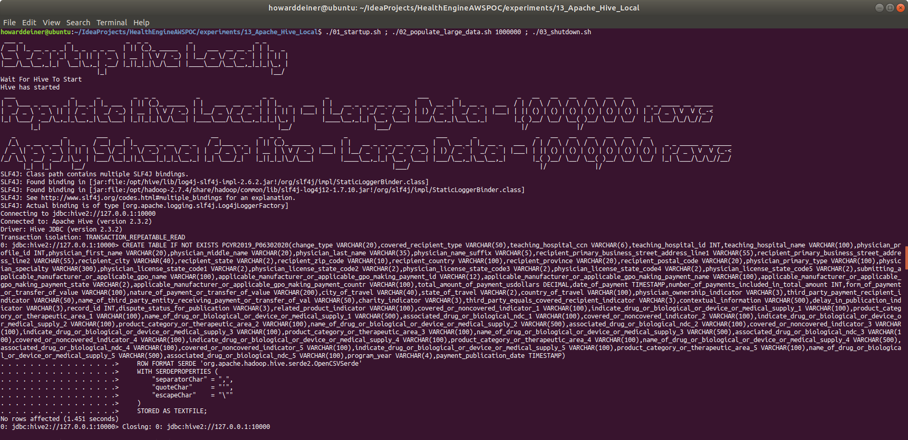
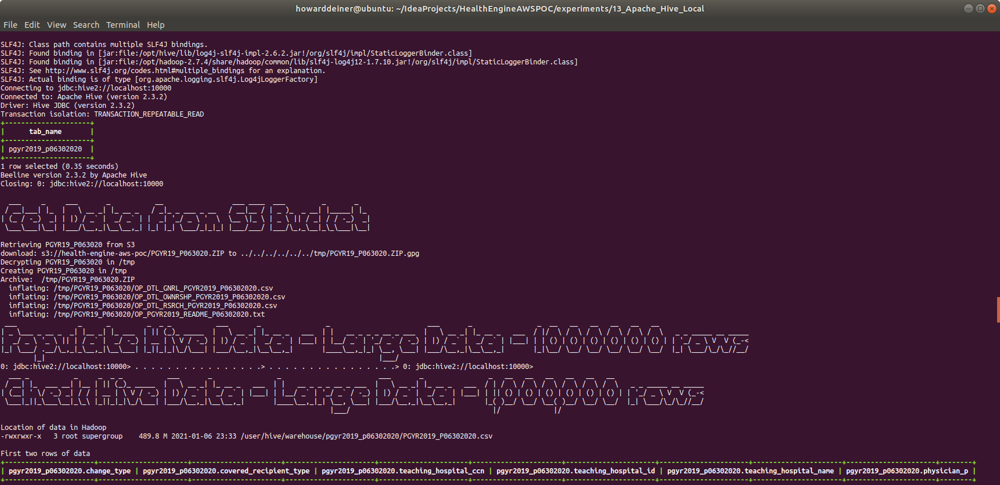
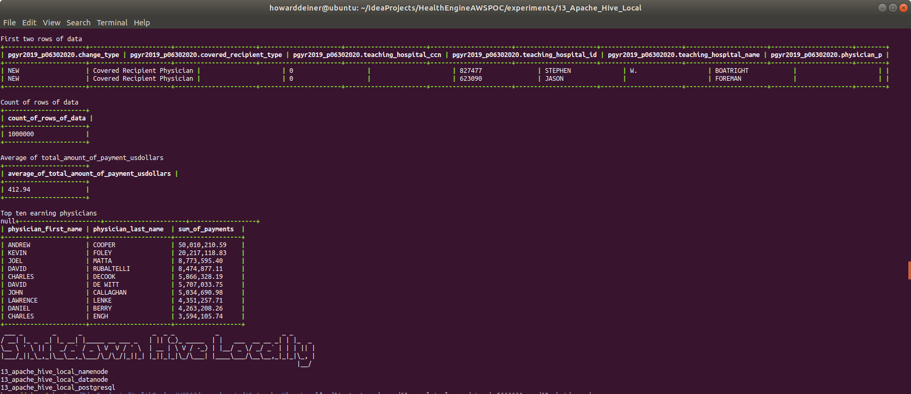
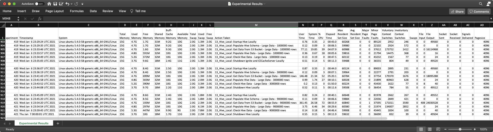
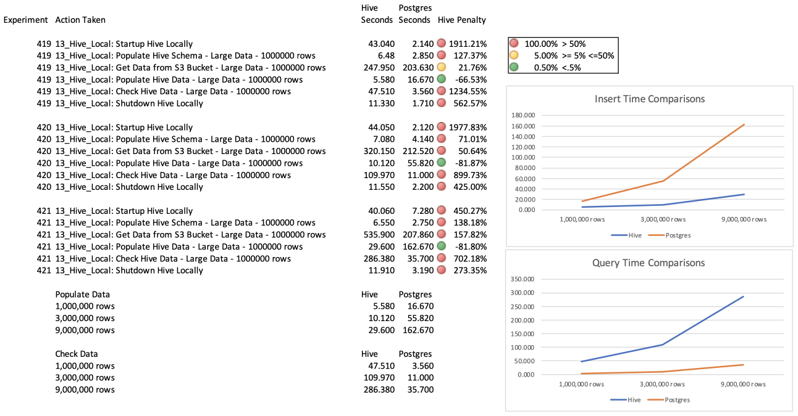

### Starting out with Apache Hive

##### Concept

> Apache Hive is a data warehouse software project built on top of Apache Hadoop for providing data query and analysis. Hive gives an SQL-like interface to query data stored in various databases and file systems that integrate with Hadoop. Traditional SQL queries must be implemented in the MapReduce Java API to execute SQL applications and queries over distributed data. Hive provides the necessary SQL abstraction to integrate SQL-like queries (HiveQL) into the underlying Java without the need to implement queries in the low-level Java API. Since most data warehousing applications work with SQL-based querying languages, Hive aids portability of SQL-based applications to Hadoop. While initially developed by Facebook, Apache Hive is used and developed by other companies such as Netflix and the Financial Industry Regulatory Authority (FINRA). Amazon maintains a software fork of Apache Hive included in Amazon Elastic MapReduce on Amazon Web Services.
>
> Apache Hive supports analysis of large datasets stored in Hadoop's HDFS and compatible file systems such as Amazon S3 filesystem and Alluxio. It provides a SQL-like query language called HiveQL with schema on read and transparently converts queries to MapReduce, Apache Tez and Spark jobs. All three execution engines can run in Hadoop's resource negotiator, YARN (Yet Another Resource Negotiator). To accelerate queries, it provided indexes, but this feature was removed in version 3.0  Other features of Hive include:
>
>> <LI>Different storage types such as plain text, RCFile, HBase, ORC, and others.
>> <LI>Operating on compressed data stored into the Hadoop ecosystem using algorithms including DEFLATE, BWT, snappy, etc.
>> <LI>Built-in user-defined functions (UDFs) to manipulate dates, strings, and other data-mining tools. Hive supports extending the UDF set to handle use-cases not supported by built-in functions.
>> <LI>SQL-like queries (HiveQL), which are implicitly converted into MapReduce or Tez, or Spark jobs.
>
> Major components of the Hive architecture are:
>
>> <LI>Metastore: Stores metadata for each of the tables such as their schema and location. It also includes the partition metadata which helps the driver to track the progress of various data sets distributed over the cluster. The data is stored in a traditional RDBMS format. The metadata helps the driver to keep track of the data and it is crucial. Hence, a backup server regularly replicates the data which can be retrieved in case of data loss.
>> <LI>Driver: Acts like a controller which receives the HiveQL statements. It starts the execution of the statement by creating sessions, and monitors the life cycle and progress of the execution. It stores the necessary metadata generated during the execution of a HiveQL statement. The driver also acts as a collection point of data or query results obtained after the Reduce operation.
>> <LI>Compiler: Performs compilation of the HiveQL query, which converts the query to an execution plan. This plan contains the tasks and steps needed to be performed by the Hadoop MapReduce to get the output as translated by the query. The compiler converts the query to an abstract syntax tree (AST). After checking for compatibility and compile time errors, it converts the AST to a directed acyclic graph (DAG). The DAG divides operators to MapReduce stages and tasks based on the input query and data.
>> <LI>Optimizer: Performs various transformations on the execution plan to get an optimized DAG. Transformations can be aggregated together, such as converting a pipeline of joins to a single join, for better performance. It can also split the tasks, such as applying a transformation on data before a reduce operation, to provide better performance and scalability. However, the logic of transformation used for optimization used can be modified or pipelined using another optimizer.
>> <LI>Executor: After compilation and optimization, the executor executes the tasks. It interacts with the job tracker of Hadoop to schedule tasks to be run. It takes care of pipelining the tasks by making sure that a task with dependency gets executed only if all other prerequisites are run.
>> <LI>CLI, UI, and Thrift Server: A command-line interface (CLI) provides a user interface for an external user to interact with Hive by submitting queries, instructions and monitoring the process status. Thrift server allows external clients to interact with Hive over a network, similar to the JDBC or ODBC protocols
>
> https://en.wikipedia.org/wiki/Apache_Hive


#### Execution

We want to get into Hive quickly.  So, before we start running AWS instances, we need to master our data and how we're going to instantiate it in the database.

### 01_startup.sh
This script uses docker-compose to orchestrate the execution of 5 Hadoop/Hive compoments: Hadoop Name Nodes, Hadoop Data Nodes, the Hive Server, the Hive Metastore, and the Postgres that implements persistence for the Hive Metastore.

The images used in the docker-compose.yml are from Big Data Europe (https://www.big-data-europe.eu), which is a consortium the wants to "empower communities with data technologies".  These docker images are available at https://hub.docker.com/u/bde2020 and provide a good way to ease into the care and feeding of Hadoop and Hive for us.  They come free, with full Dockerfiles available on GitHub to allow us to ensure that they are both secure and open for possible extension. 

This is what my docker-compose,yml looks like:
```yml
version: "3"

services:
  namenode:
    image: bde2020/hadoop-namenode:2.0.0-hadoop2.7.4-java8
    container_name: namenode
    volumes:
      - namenode:/hadoop/dfs/name
    environment:
      - CLUSTER_NAME=test
    env_file:
      - ./hadoop-hive.env
    ports:
      - "50070:50070"
  datanode:
    image: bde2020/hadoop-datanode:2.0.0-hadoop2.7.4-java8
    container_name: datanode
    volumes:
      - datanode:/hadoop/dfs/data
    env_file:
      - ./hadoop-hive.env
    environment:
      SERVICE_PRECONDITION: "namenode:50070"
    ports:
      - "50075:50075"
  hive-server:
    image: bde2020/hive:2.3.2-postgresql-metastore
    container_name: hive-server
    env_file:
      - ./hadoop-hive.env
    environment:
      HIVE_CORE_CONF_javax_jdo_option_ConnectionURL: "jdbc:postgresql://hive-metastore/metastore"
      SERVICE_PRECONDITION: "hive-metastore:9083"
    ports:
      - "10000:10000"
  hive-metastore:
    image: bde2020/hive:2.3.2-postgresql-metastore
    container_name: hive-metastore
    env_file:
      - ./hadoop-hive.env
    command: /opt/hive/bin/hive --service metastore
    environment:
      SERVICE_PRECONDITION: "namenode:50070 datanode:50075 hive-metastore-postgresql:5432"
    ports:
      - "9083:9083"
  hive-metastore-postgresql:
    image: bde2020/hive-metastore-postgresql:2.3.0
    container_name: hive-metastore-postgresql
    volumes:
      - postgresql:/var/lib/postgresql/data

volumes:
  namenode:
  datanode:
  postgresql:
```

The 01_startup.sh does all of the management of getting these containers running, and waits for Hive to become available for immediate use.
```bash
#!/usr/bin/env bash

../../startExperiment.sh

bash -c 'cat << "EOF" > .script
#!/usr/bin/env bash
figlet -w 160 -f small "Startup Hive Locally"
docker volume rm 13_apache_hive_local_namenode
docker volume rm 13_apache_hive_local_datanode
docker volume rm 13_apache_hive_local_postgresql
docker-compose -f docker-compose.yml up -d

echo "Wait For Hive To Start"
while true ; do
  docker logs hive-server > stdout.txt 2> stderr.txt
  result=$(grep -cE " Starting HiveServer2" stdout.txt)
  if [ $result != 0 ] ; then
    sleep 10 # it says it is ready, but not really
    echo "Hive has started"
    break
  fi
  sleep 5
done
rm stdout.txt stderr.txt
EOF'
chmod +x .script
command time -v ./.script 2> .results
../../getExperimentalResults.sh
experiment=$(../../getExperimentNumber.sh)
../../getDataAsCSVline.sh .results ${experiment} "13_Hive_Local: Startup Hive Locally" >> Experimental\ Results.csv
../../putExperimentalResults.sh
rm .script .results Experimental\ Results.csv
```
### 02_populate_large_data.sh
This script manages the transfer of the dataset I use for for large volume testing: the "Complete 2019 Program Year Open Payments Dataset" from the Center for Medicare & Medicade Services.  See https://www.cms.gov/OpenPayments/Explore-the-Data/Dataset-Downloads for details.  In total, there is over 6GB in this dataset.

The script adds a schema into Hive, transfers the data (and parses it into a CSV that Hive can load), inserts the data, and runs some standard queries against the data.

```bash
#!/usr/bin/env bash

if [ $# -eq 0 ]
  then
    echo "must supply the command with the number of rows to use"
    exit 1
fi

re='^[0-9]+$'
if ! [[ $1 =~ $re ]] ; then
    echo "must supply the command with the number of rows to use"
   exit 1
fi

ROWS=$1
export ROWS

bash -c 'cat << "EOF" > .script
#!/usr/bin/env bash

figlet -w 240 -f small "Populate Hive Locally - Large Data - $(numfmt --grouping $ROWS) rows"

figlet -w 240 -f small "Apply Schema for Hive - Large Data - $(numfmt --grouping $ROWS) rows"
docker cp ../../ddl/PGYR19_P063020/changeset.hive.sql hive-server:/tmp/changeset.hive.sql
docker exec -it hive-server bash -c "beeline -u jdbc:hive2://127.0.0.1:10000 --color=true --autoCommit=true -f /tmp/changeset.hive.sql"
echo ""
docker exec -it hive-server bash -c "beeline -u jdbc:hive2://localhost:10000 --color=true --autoCommit=true -e '"'"'show tables;'"'"'"
echo ""
EOF'
chmod +x .script
command time -v ./.script 2> .results
../../getExperimentalResults.sh
experiment=$(../../getExperimentNumber.sh)
../../getDataAsCSVline.sh .results ${experiment} "13_Hive_Local: Populate Hive Schema - Large Data - $ROWS rows" >> Experimental\ Results.csv
../../putExperimentalResults.sh
rm .script .results Experimental\ Results.csv

bash -c 'cat << "EOF" > .script
!/usr/bin/env bash
figlet -w 240 -f small "Get Data from S3 Bucket"
../../data/transferPGYR19_P063020_from_s3_and_decrypt.sh
python3 ../../create_csv_data_PGYR2019_P06302020.py -s $ROWS -i /tmp/PGYR19_P063020/OP_DTL_GNRL_PGYR2019_P06302020.csv -o /tmp/PGYR2019_P06302020.csv
EOF'
chmod +x .script
command time -v ./.script 2> .results
../../getExperimentalResults.sh
experiment=$(../../getExperimentNumber.sh)
../../getDataAsCSVline.sh .results ${experiment} "13_Hive_Local: Get Data from S3 Bucket - Large Data - $ROWS rows" >> Experimental\ Results.csv
../../putExperimentalResults.sh
rm .script .results Experimental\ Results.csv

command time -v ./02_populate_large_data_load_data.sh $ROWS 2> .results
../../getExperimentalResults.sh
experiment=$(../../getExperimentNumber.sh)
../../getDataAsCSVline.sh .results ${experiment} "13_Hive_Local: Populate Hive Data - Large Data - $ROWS rows" >> Experimental\ Results.csv
../../putExperimentalResults.sh
rm -rf .results Experimental\ Results.csv

bash -c 'cat << "EOF" > .script
#!/usr/bin/env bash
figlet -w 240 -f small "Check Hive Data - Large Data - $(numfmt --grouping $ROWS) rows"
echo ""
echo "Location of data in Hadoop"
docker exec hive-server bash -c "hdfs dfs -ls -h /user/hive/warehouse/pgyr2019_p06302020/PGYR2019_P06302020.csv"
echo ""
echo "First two rows of data"
docker exec hive-server bash -c "beeline -u jdbc:hive2://localhost:10000 --color=true --maxWidth=240 --maxColumnWidth=20 --truncateTable=true --silent -e '"'"'SELECT * FROM PGYR2019_P06302020 LIMIT 2;'"'"'"
echo ""
echo "Count of rows of data"
docker exec hive-server bash -c "beeline -u jdbc:hive2://localhost:10000 --color=true --maxWidth=240 --maxColumnWidth=20 --truncateTable=true --silent -e '"'"'SELECT COUNT(*) AS count_of_rows_of_data FROM PGYR2019_P06302020;'"'"'"
echo ""
echo "Average of total_amount_of_payment_usdollars"
docker exec hive-server bash -c "beeline -u jdbc:hive2://localhost:10000 --color=true --maxWidth=240 --maxColumnWidth=20 --truncateTable=true --numberFormat='"'"'###,###,###,##0.00'"'"' --silent -e '"'"'SELECT AVG(total_amount_of_payment_usdollars) AS average_of_total_amount_of_payment_usdollars FROM PGYR2019_P06302020;'"'"'"
echo ""
echo "Top ten earning physicians"
echo "SELECT physician_first_name, physician_last_name, SUM(total_amount_of_payment_usdollars) AS sum_of_payments" > .command.sql
echo "FROM PGYR2019_P06302020 " >> .command.sql
echo "WHERE physician_first_name != '"'"''"'"' "  >> .command.sql
echo "AND physician_last_name != '"'"''"'"' " >> .command.sql
echo "GROUP BY physician_first_name, physician_last_name " >> .command.sql
echo "ORDER BY sum_of_payments DESC " >> .command.sql
echo "LIMIT 10; " >> .command.sql
docker cp .command.sql hive-server:/tmp/command.sql
docker exec hive-server bash -c "beeline -u jdbc:hive2://localhost:10000 --color=true --maxWidth=240 --maxColumnWidth=20 --truncateTable=true --numberFormat='"'"'###,###,###,##0.00'"'"' --silent -f /tmp/command.sql"
EOF'
chmod +x .script
command time -v ./.script 2> .results
../../getExperimentalResults.sh
experiment=$(../../getExperimentNumber.sh)
../../getDataAsCSVline.sh .results ${experiment} "13_Hive_Local: Check Hive Data - Large Data - $ROWS rows" >> Experimental\ Results.csv
../../putExperimentalResults.sh
rm -rf .script .results .command.sql *.csv /tmp/PGYR19_P063020 /tmp/PGYR2019_P06302020.csv
```

### 03_shutdown.sh
This script is brutely simple.  It uses the same docker-compose.yml to bring down the environment it established, and then uses docker volume rm to delete the data which held the bits for out database data.

```bash
#!/usr/bin/env bash

bash -c 'cat << "EOF" > .script
#!/usr/bin/env bash
figlet -w 240 -f small "Shutdown Hive Locally"
docker-compose -f docker-compose.yml  down
docker volume rm 13_apache_hive_local_namenode
docker volume rm 13_apache_hive_local_datanode
docker volume rm 13_apache_hive_local_postgresql
EOF'
chmod +x .script
command time -v ./.script 2> .results
../../getExperimentalResults.sh
experiment=$(../../getExperimentNumber.sh)
../../getDataAsCSVline.sh .results  ${experiment} "13_Hive_Local: Shutdown Hive Locally" >> Experimental\ Results.csv
../../putExperimentalResults.sh
rm .script .results Experimental\ Results.csv

../../endExperiment.sh
```

### Putting it all together...

It all looks something like this when run for 1 million rows:

\
\
\
<BR />

The scripts were then rerun for 3 million and 9 million rows.  These are the raw results captured.


Those results were compared to Postgres run under the same conditions.


As you can see, Hive takes a lot more time for everything except inserting data.  It's almost a mirror twin of Postgres in timing, capable of seemingly linear response for data ingest, and perhaps a slight O2 response for queries.  I will move forward and build environments that we can control and tune in a cluster of AWS EC2 instances to continue our little adventure.