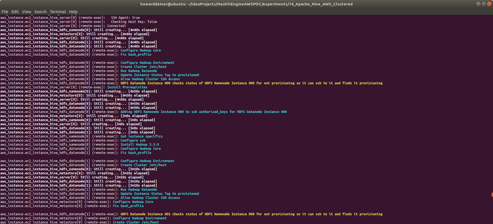
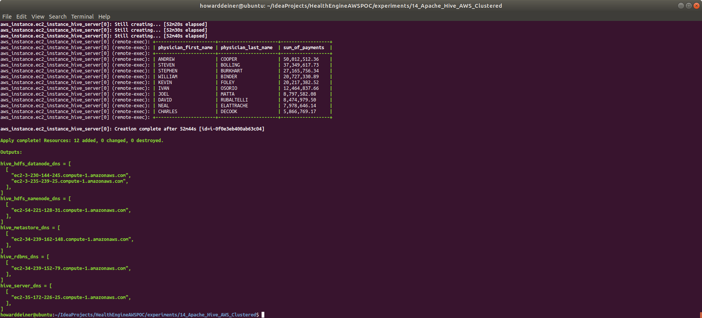

### Starting out with Apache Hive on AWS

##### Concept

> Apache Hive is a data warehouse software project built on top of Apache Hadoop for providing data query and analysis. Hive gives an SQL-like interface to query data stored in various databases and file systems that integrate with Hadoop. Traditional SQL queries must be implemented in the MapReduce Java API to execute SQL applications and queries over distributed data. Hive provides the necessary SQL abstraction to integrate SQL-like queries (HiveQL) into the underlying Java without the need to implement queries in the low-level Java API. Since most data warehousing applications work with SQL-based querying languages, Hive aids portability of SQL-based applications to Hadoop. While initially developed by Facebook, Apache Hive is used and developed by other companies such as Netflix and the Financial Industry Regulatory Authority (FINRA). Amazon maintains a software fork of Apache Hive included in Amazon Elastic MapReduce on Amazon Web Services.
>
> Apache Hive supports analysis of large datasets stored in Hadoop's HDFS and compatible file systems such as Amazon S3 filesystem and Alluxio. It provides a SQL-like query language called HiveQL with schema on read and transparently converts queries to MapReduce, Apache Tez and Spark jobs. All three execution engines can run in Hadoop's resource negotiator, YARN (Yet Another Resource Negotiator). To accelerate queries, it provided indexes, but this feature was removed in version 3.0  Other features of Hive include:
>
>> <LI>Different storage types such as plain text, RCFile, HBase, ORC, and others.
>> <LI>Operating on compressed data stored into the Hadoop ecosystem using algorithms including DEFLATE, BWT, snappy, etc.
>> <LI>Built-in user-defined functions (UDFs) to manipulate dates, strings, and other data-mining tools. Hive supports extending the UDF set to handle use-cases not supported by built-in functions.
>> <LI>SQL-like queries (HiveQL), which are implicitly converted into MapReduce or Tez, or Spark jobs.
>
> Major components of the Hive architecture are:
>
>> <LI>Metastore: Stores metadata for each of the tables such as their schema and location. It also includes the partition metadata which helps the driver to track the progress of various data sets distributed over the cluster. The data is stored in a traditional RDBMS format. The metadata helps the driver to keep track of the data and it is crucial. Hence, a backup server regularly replicates the data which can be retrieved in case of data loss.
>> <LI>Driver: Acts like a controller which receives the HiveQL statements. It starts the execution of the statement by creating sessions, and monitors the life cycle and progress of the execution. It stores the necessary metadata generated during the execution of a HiveQL statement. The driver also acts as a collection point of data or query results obtained after the Reduce operation.
>> <LI>Compiler: Performs compilation of the HiveQL query, which converts the query to an execution plan. This plan contains the tasks and steps needed to be performed by the Hadoop MapReduce to get the output as translated by the query. The compiler converts the query to an abstract syntax tree (AST). After checking for compatibility and compile time errors, it converts the AST to a directed acyclic graph (DAG). The DAG divides operators to MapReduce stages and tasks based on the input query and data.
>> <LI>Optimizer: Performs various transformations on the execution plan to get an optimized DAG. Transformations can be aggregated together, such as converting a pipeline of joins to a single join, for better performance. It can also split the tasks, such as applying a transformation on data before a reduce operation, to provide better performance and scalability. However, the logic of transformation used for optimization used can be modified or pipelined using another optimizer.
>> <LI>Executor: After compilation and optimization, the executor executes the tasks. It interacts with the job tracker of Hadoop to schedule tasks to be run. It takes care of pipelining the tasks by making sure that a task with dependency gets executed only if all other prerequisites are run.
>> <LI>CLI, UI, and Thrift Server: A command-line interface (CLI) provides a user interface for an external user to interact with Hive by submitting queries, instructions and monitoring the process status. Thrift server allows external clients to interact with Hive over a network, similar to the JDBC or ODBC protocols
>
> https://en.wikipedia.org/wiki/Apache_Hive

As a super quick overview, here are a few architecural diagrams.

An overview of Hadoop components:

How Hive interacts with Hadoop:

What we are implementing in this experiment:

Specifically, we will be implementing a Hive Cluster built entirely of six AWS EC2 instances.
<ul>
<li>Two m5.large class instances with 30GB each for HDFS Datanodes.</li>
<li>One m5.xlarge class instances with 30GB a HDFS Namenode and YARN server.</li>
<li>One m5.xlarge class instances with 30GB a Hive Server.</li>
<li>One m5.xarge class instances with 30GB a Hive Metastore.</li>
<li>One m5.xarge class instances with 30GB a Hive RDBMS (running Postgres).</li>
</ul>

The complexities for producing this cluser of instances that are demonstratively solvled are:
<ul>
<li>Q: How do we tie these machines into a cluster unit? A: Pass in a "cluster name" and use as an "environment" in the tag for each instance.  When we run the instance, we querry and make use of these tags.</li>
<li>Q: How do address networking for the cluster? A: Some instances deserve DNS names, such as the database, the Hive Server, and the HDFS Name Server (for YARN submissions).  Other pices are expected to be "hostname" resolvable by Hadoop amnd Hive, so we also setup an /etc/hosts on all machines to allow this.</li>
<li>Q: How do synchronization of component startup? A: All instances keep a "status" as a tag.  Status can be "provisioning" (not yet done installing the software for the instance), "provisioned" (things are ready to start running, but not yet started), and "running".  When an instance that depends on another instance to be running before it runs, it checks the status tag of the depended upon instance.</li>
<li>Q: How do we handle HADOOP ssh requirements? A: Before an instance is done provisioning, it creates public and private ssh keys to configure its ssh environment, and then writes them to an S3 Bucket with its identity, so other instances can import them when the instance is either provisioned or running.</li>
</ul>

#### Execution

### 01_startup.sh
This simple script uses Terraform to start the process going.  The aws_instance Terraform scripts for hdfs_namenode and hive_server also upload and run the 02_test_mapreduce.sh and 02_test_hive.sh tests.

### 03_shutdown.sh
This simple script uses Terraform to bring down all 12 resources created in the 01_startup.sh script.

### Putting it all together...

Here's how to run and what we see from running 01_startup.sh

I try to use consistent color coding on the console to help guide the eye.  On things coming back from the provisioning and test scripts, cyan is used to indicate what's going on.  Yellow is used to indicate that a condition was tried and failed, but that it will be retried until it works (that's how depending upon scripts wait on their dependencies).  And green indicates something that is recognized as good (a server starts, a test works, etc.) 
\
\
\
\
\
\
\
\
\
\
\
\
\
\
\
\
\
\
\
\
\
\
\
\
\
\
 

You can use the AWS Console to see some interesting things, as well as debug an issue.  For example:
\
\
\
 

You can also use the Hadoop Hadoop Namenode WebUI, Hadoop Cluster WebUI, and Hadoop JobHistory WebUI on their external DNS names to see some interesting things, as well as debug an issue.  For example:
\
\
\
\
\
\
\
\
 

And here's how to run and what we see from running 03_shutdown.sh
\
\

#### Conclusion

There are many things left undone with this project.  

We could tune the settings for Hadoop and Hive.  We could add in redundency for the Namenode, Hive, Metadata, and RDBMS instances.  We can use different instance sizes, or even trigger automatic allocation of new instances and scale automagically.  

It's all there for the curious.  

But we don't have to tie ourselves to private and expensive services like AWS EMR.  Not to mention that use of AWS EMR raises the cost of switching Cloud Providers.  

If our business relies on something, we need a hand in developing and deeply understanding that service, or we keep our business beholdent to the whims of the provider. 
