### Starting out with AWS RDS PostgreSQL Clusters

##### Concept

> Amazon Relational Database Service (or Amazon RDS) is a distributed relational database service by Amazon Web Services (AWS). It is a web service running "in the cloud" designed to simplify the setup, operation, and scaling of a relational database for use in applications. Administration processes like patching the database software, backing up databases and enabling point-in-time recovery are managed automatically. Scaling storage and compute resources can be performed by a single API call as AWS does not offer an ssh connection to RDS instances
> https://en.wikipedia.org/wiki/Amazon_Relational_Database_Service

> PostgreSQL has become the preferred open source relational database for many enterprise developers and start-ups, powering leading business and mobile applications. Amazon RDS makes it easy to set up, operate, and scale PostgreSQL deployments in the cloud. With Amazon RDS, you can deploy scalable PostgreSQL deployments in minutes with cost-efficient and resizable hardware capacity. Amazon RDS manages complex and time-consuming administrative tasks such as PostgreSQL software installation and upgrades; storage management; replication for high availability and read throughput; and backups for disaster recovery.
>
> Amazon RDS for PostgreSQL gives you access to the capabilities of the familiar PostgreSQL database engine. This means that the code, applications, and tools you already use today with your existing databases can be used with Amazon RDS. Amazon RDS supports PostgreSQL major version 12, which includes a number of enhancements to performance, robustness, transaction management, query parallelism, and more.
>
> https://aws.amazon.com/rds/postgresql/ (AWS propoganda)
>
#### Execution

### 01_startup.sh
This script uses simple Terraform and applies it.  You get 14 resources of ready to go database.  
```bash
#!/usr/bin/env bash

figlet -w 200 -f small "Startup PostgresSQL on AWS RDS Aurora"
terraform init
terraform apply -auto-approve
```
The one script that does all of the heavy lifting is below.
```hcl-terraform
provider "aws" {
  region                  = "us-east-1"
  shared_credentials_file = "~/.aws/credentials"
}

#######################################
# Data sources to get VPC and subnets #
#######################################
data "aws_vpc" "default" {
  default = true
}

data "aws_subnet_ids" "all" {
  vpc_id = data.aws_vpc.default.id
}

##############
# RDS Aurora #
##############
module "aurora" {
  source  = "terraform-aws-modules/rds-aurora/aws"
  version = "~> 2.0"

  name                            = "aurora-example-postgresql"
  engine                          = "aurora-postgresql"
  engine_version                  = "11.6"
  username                        = "postgres"
  password                        = ""
  publicly_accessible             = true
  subnets                         = data.aws_subnet_ids.all.ids
  vpc_id                          = data.aws_vpc.default.id
  allowed_security_groups         = [aws_security_group.aurora_connect.id]
  allowed_cidr_blocks             = ["0.0.0.0/0"]
  replica_count                   = 2
  instance_type                   = "db.r4.large" #  2 vCPU	8 ECU 15.25 GiB Memory EBS Only	$0.133 per Hour
  instance_type_replica           = "db.t3.medium" # 2 vCPU	variable ECU 4 GiB Memory EBS Only	$0.0416 per Hour
  apply_immediately               = true
  skip_final_snapshot             = true
  db_parameter_group_name         = aws_db_parameter_group.aurora_db_postgres11_parameter_group.id
  db_cluster_parameter_group_name = aws_rds_cluster_parameter_group.aurora_cluster_postgres11_parameter_group.id
#  enabled_cloudwatch_logs_exports = ["audit", "error", "general", "slowquery"]
  security_group_description      = ""
  tags = {
    Terraform = "true"
    Environment = "dev"
  }
}

resource "aws_db_parameter_group" "aurora_db_postgres11_parameter_group" {
  name        = "test-aurora-db-postgres11-parameter-group"
  family      = "aurora-postgresql11"
  description = "test-aurora-db-postgres11-parameter-group"
}

resource "aws_rds_cluster_parameter_group" "aurora_cluster_postgres11_parameter_group" {
  name        = "test-aurora-postgres11-cluster-parameter-group"
  family      = "aurora-postgresql11"
  description = "test-aurora-postgres11-cluster-parameter-group"
}

#############################
# Example of security group #
#############################
resource "aws_security_group" "app_servers" {
  name_prefix = "app-servers-"
  description = "For application servers"
  vpc_id      = data.aws_vpc.default.id
  ingress {
    protocol  = "tcp"
    from_port = 5432
    to_port   = 5432
    cidr_blocks = [
      "0.0.0.0/0",
    ]
  }
  egress {
    from_port = 0
    to_port   = 0
    protocol  = "-1"
    cidr_blocks = [
      "0.0.0.0/0",
    ]
  }
}

resource "aws_security_group_rule" "allow_access" {
  type                     = "ingress"
  from_port                = module.aurora.this_rds_cluster_port
  to_port                  = module.aurora.this_rds_cluster_port
  protocol                 = "tcp"
  source_security_group_id = aws_security_group.app_servers.id
  security_group_id        = module.aurora.this_security_group_id
}

resource "aws_security_group" "aurora_connect" {
  name        = "Aurora Security Group"
  description = "Aurora Security Group"
  ingress {
    protocol  = "tcp"
    from_port = 5432
    to_port   = 5432
    cidr_blocks = [
      "0.0.0.0/0",
    ]
  }
  egress {
    from_port = 0
    to_port   = 0
    protocol  = "-1"
    cidr_blocks = [
      "0.0.0.0/0",
    ]
  }
  tags = {
    Name = "Aurora Security Group"
  }
}
```

This is what the console looks like when the script is executed.
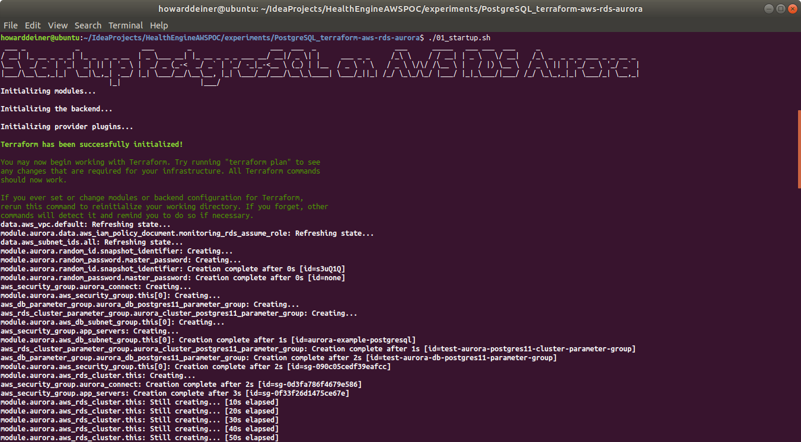\
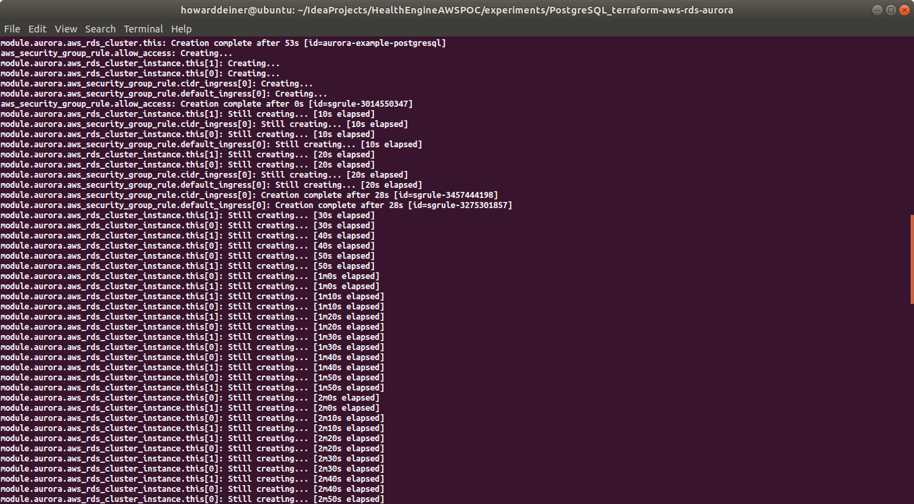\
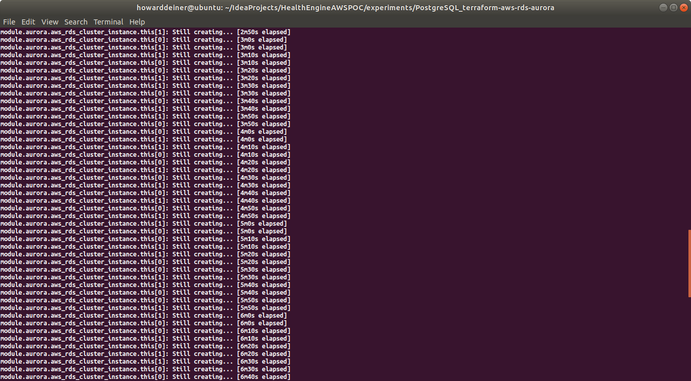\
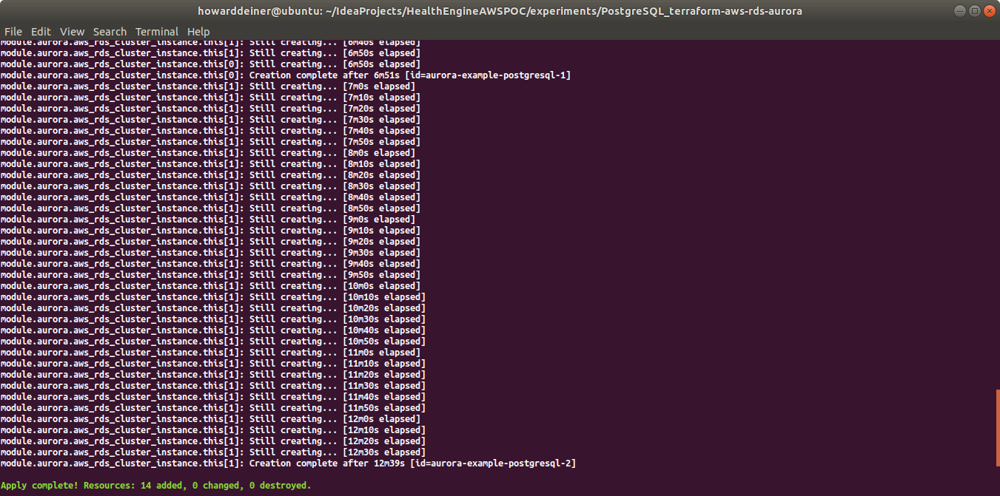\
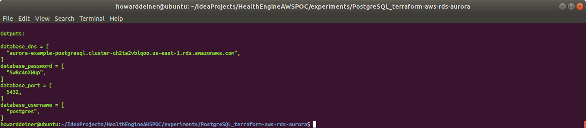\
<BR/>
If we were to peruse the AWS Console Database Dashboard, here's what we will see.
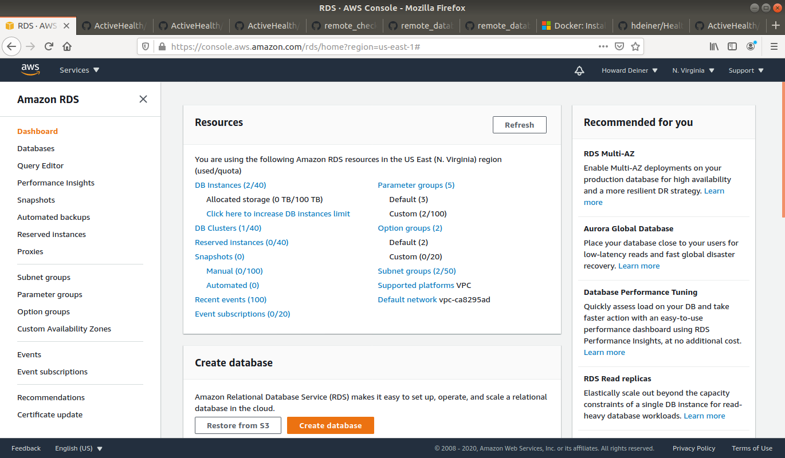\
<BR/>
Looking deeper into the AWS Console Database Connectivity, we'd see this.
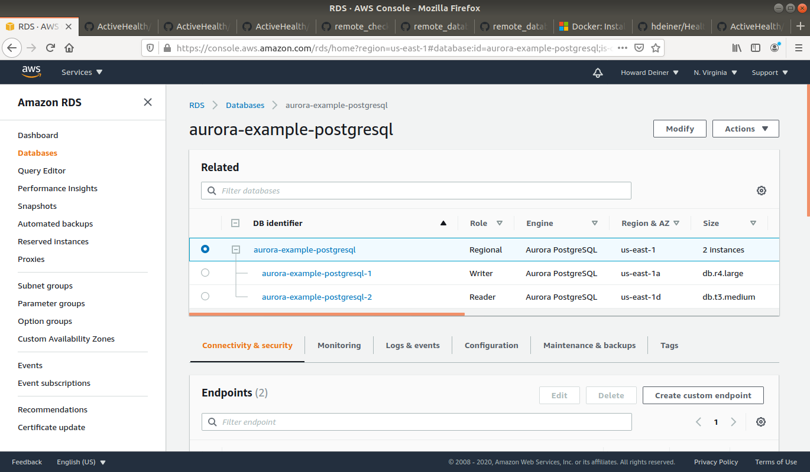\
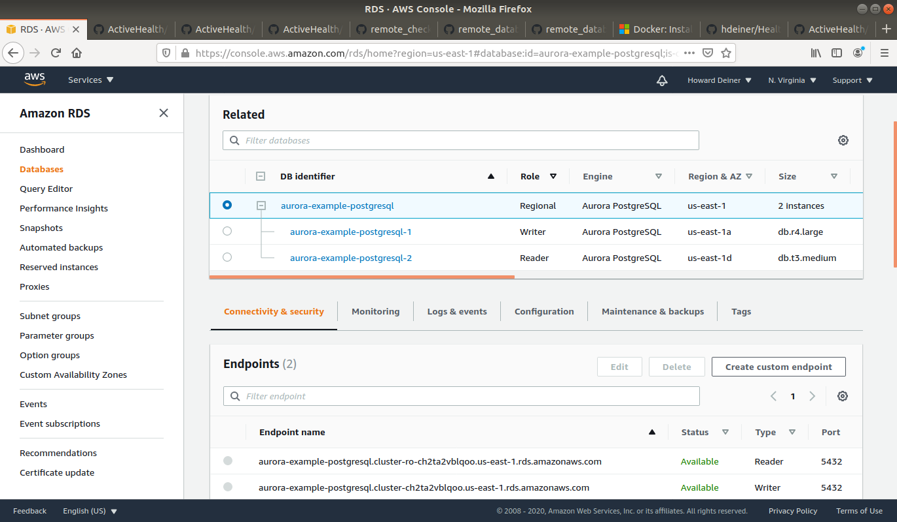\
<BR/>
And, finally, looking deeper into the AWS Console Database Monitoring, we'd see this.
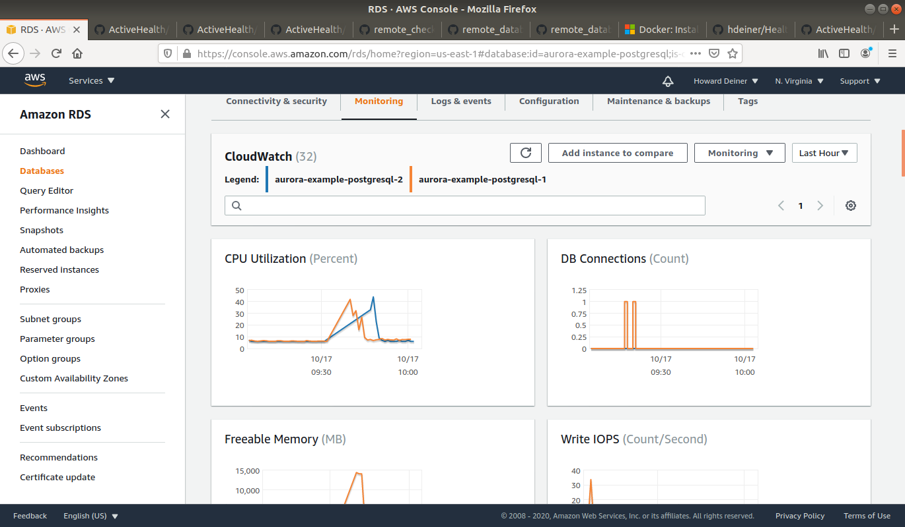\
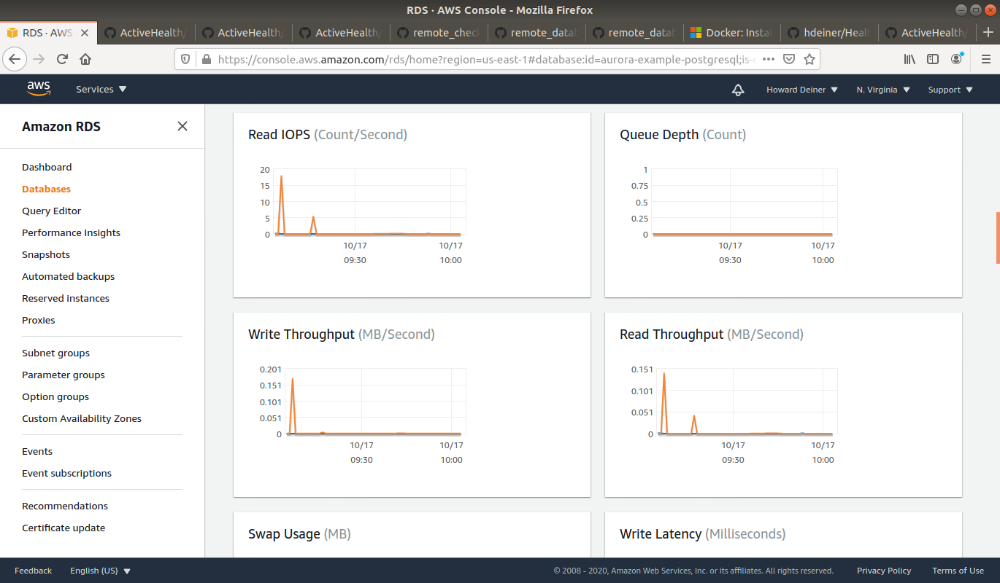\
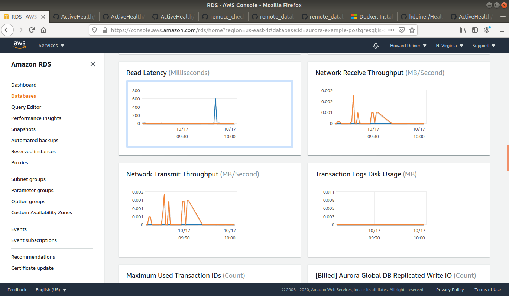\
<BR/>
### 02_populate.sh
This script first uses the running AWS database to run psql to create a database for us.

The script then creates a liquibase.properties to run liquibase to update the database to it's intended state.

The script then demonstrates that the two tables created have data in them, all managed by liquibase.
```bash
#!/usr/bin/env bash

figlet -w 160 -f small "Populate Postgres on AWS RDS Aurora"
echo `terraform output database_dns | grep -o '".*"' | cut -d '"' -f2` > .database_dns
echo `terraform output database_port | grep -Eo '[0-9]{1,}' | cut -d '"' -f2` > .database_port
echo `terraform output database_username | grep -o '".*"' | cut -d '"' -f2` > .database_username
echo `terraform output database_password | grep -o '".*"' | cut -d '"' -f2` > .database_password

PGPASSWORD=$(<.database_password) psql --host=$(<.database_dns) --port=$(<.database_port) --username=$(<.database_username) --no-password --no-align -c 'create database testdatabase;'

echo 'changeLogFile: ../../src/db/changeset.xml' > liquibase.properties
echo 'url:  jdbc:postgresql://'$(<.database_dns)':'$(<.database_port)'/testdatabase' >> liquibase.properties
echo 'username: '$(<.database_username) >> liquibase.properties
echo 'password: '$(<.database_password) >> liquibase.properties
echo 'driver:  org.postgresql.Driver' >> liquibase.properties
echo 'classpath:  ../../liquibase_drivers/postgresql-42.2.18.jre6.jar' >> liquibase.properties
liquibase update

figlet -w 160 -f small "Check Postgres on AWS RDS Aurora"
PGPASSWORD=$(<.database_password) psql --host=$(<.database_dns) --port=$(<.database_port) --username=$(<.database_username) --no-password -d testdatabase --no-align -c 'select * from DERIVEDFACT;'
PGPASSWORD=$(<.database_password) psql --host=$(<.database_dns) --port=$(<.database_port) --username=$(<.database_username) --no-password -d testdatabase --no-align -c 'select * from MEMBERHEALTHSTATE;'

rm .database_dns .database_port .database_username .database_password liquibase.properties
figlet -w 160 -f small "Check Postgres Locally"
docker exec postgres_container psql --port=5432 --username=postgres --no-password -d testdatabase -c 'select * from DERIVEDFACT;'
docker exec postgres_container psql --port=5432 --username=postgres --no-password -d testdatabase -c 'select * from MEMBERHEALTHSTATE;'
```
This is what the console looks like when the script is executed.
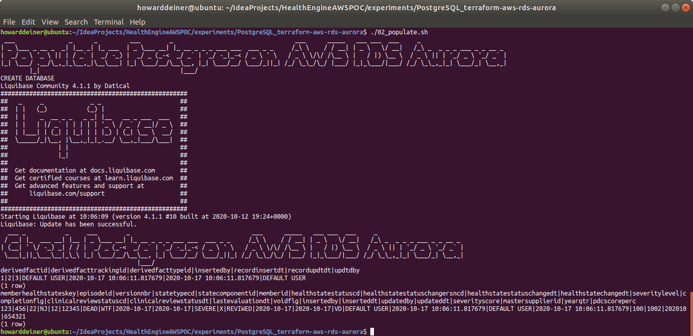\
<BR/>
### 03_shutdown.sh
This script is extremely simple.  It tells terraform to destroy all that it created.

```bash
#!/usr/bin/env bash

figlet -w 200 -f small "Shutdown PostgresSQL on AWS RDS Aurora"
terraform destroy -auto-approve
```
The console shows what it does.
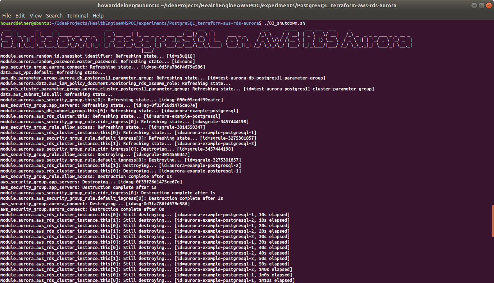\
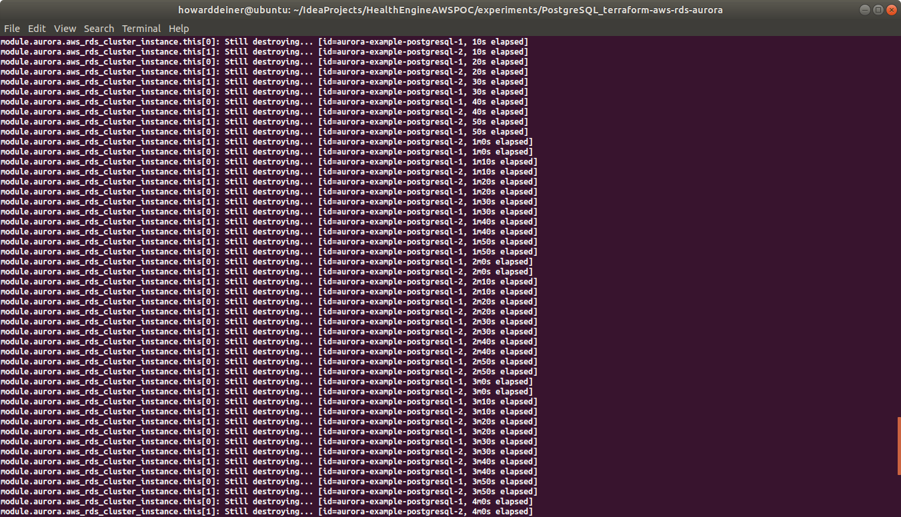\
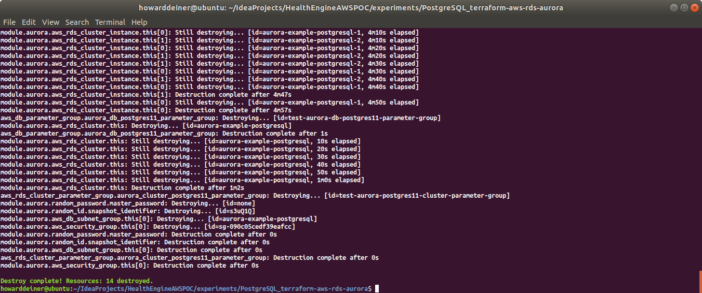\
<BR/>
